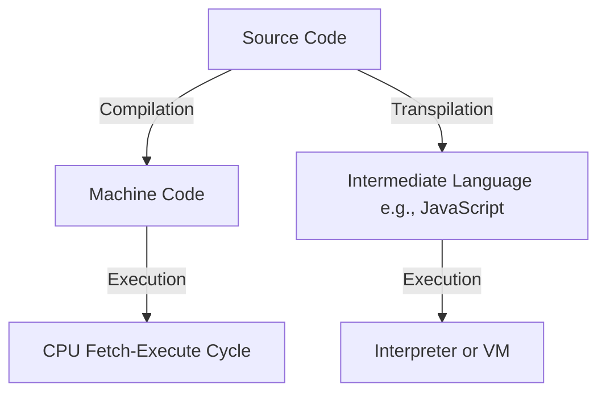
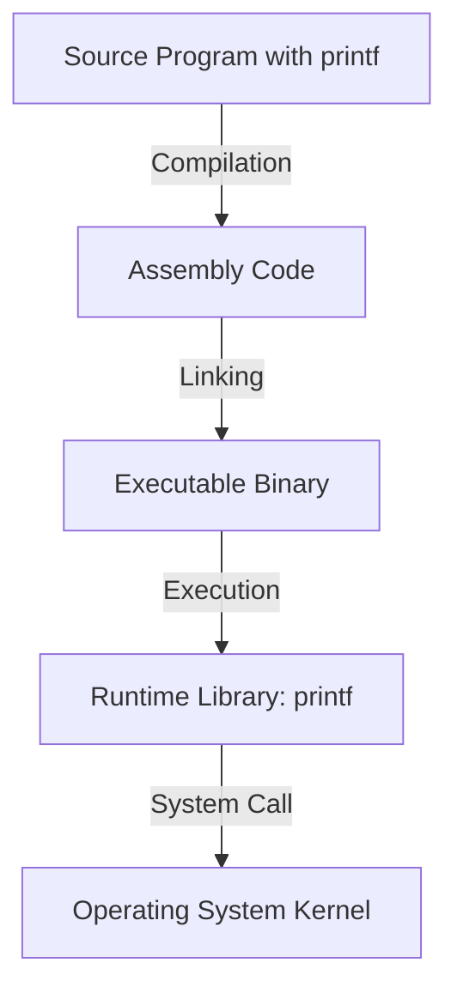
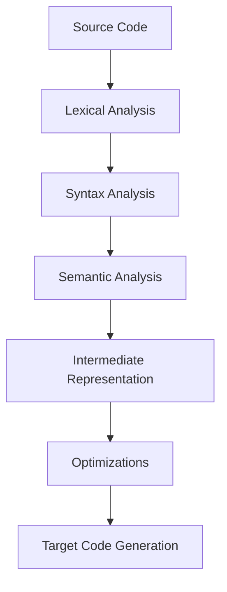
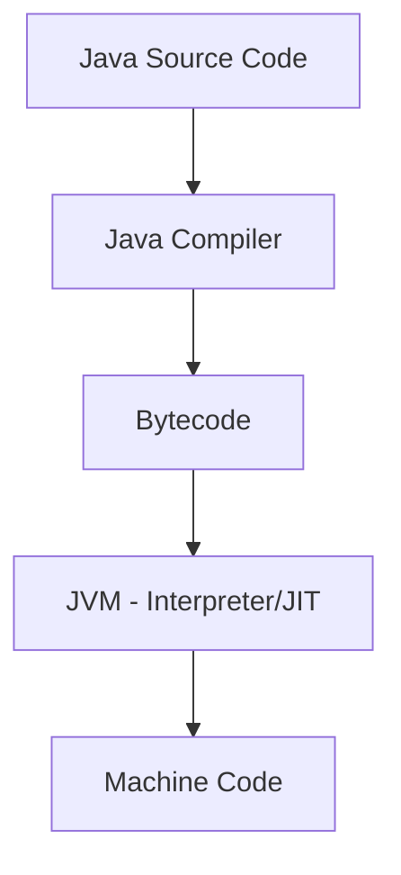
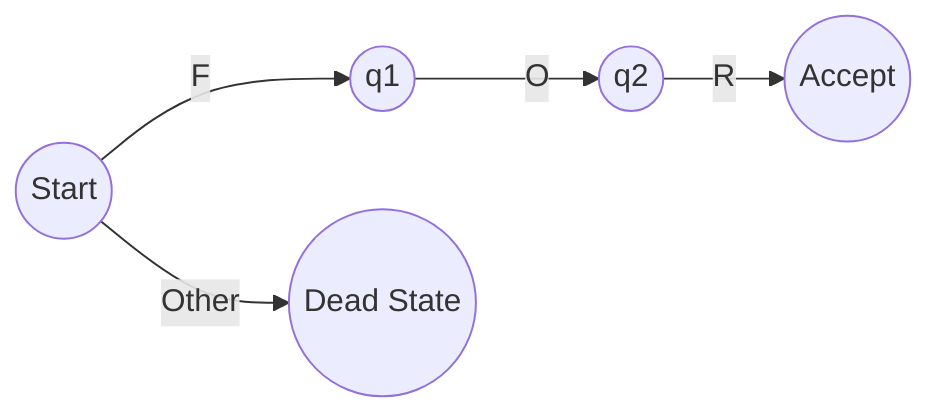
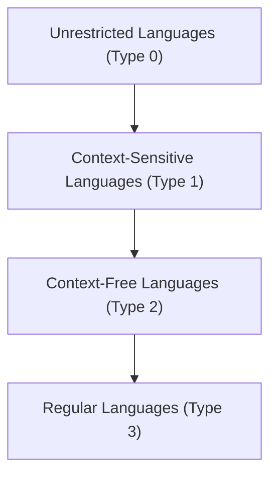
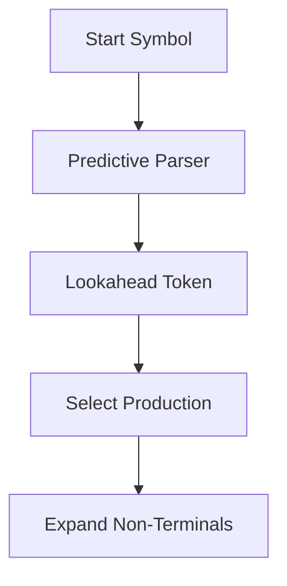
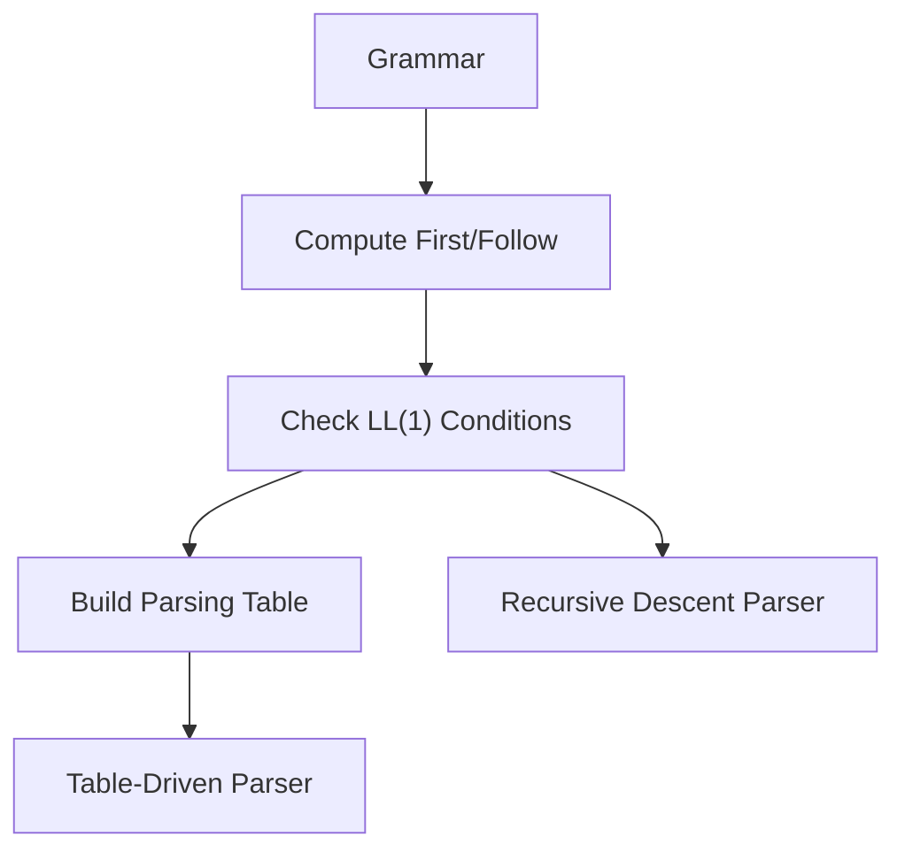
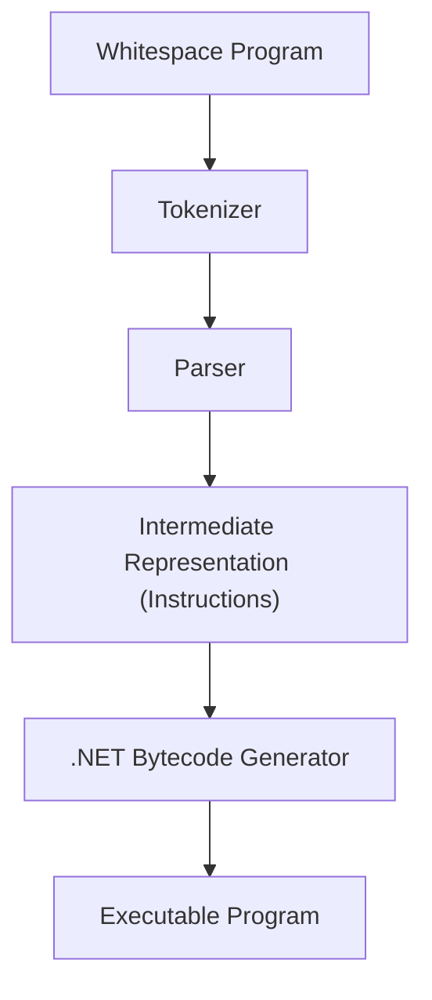

# 15/9/25

![[15:09:25.pdf]]

# 18/9/25
## Chapter 2 – Programming Language Stacks

## 2.1 Introduction
In the second lecture, Professors Cisternino and Corradini introduced the **architecture of programming languages**, focusing on the distinction between **compiled** and **interpreted** languages, the role of **types**, and the historical evolution of programming language semantics【28†Trascrizione】.

The discussion emphasized that programming languages are not only technical tools but also cultural artifacts, shaped by design debates, historical contingencies, and the need to balance **human readability** with **machine executability**.

## 2.2 Historical Perspectives
Every symbol and syntactic convention in programming languages has a history. For example, the syntax for **assignment** varies between languages: while C uses the `=` operator, Pascal historically used `:=`, aligning more closely with the mathematical notion of equality as a relation rather than an operation. Such design choices reflect philosophical debates about clarity, formality, and usability【28†Trascrizione】.

A notable anecdote concerned the early 2000s development of **C# generics** (parametric polymorphism). At Microsoft Research, teams debated for days about the placement of angle brackets and commas to preserve formal grammar properties. Such details illustrate how even apparently trivial syntactic decisions embody deep theoretical concerns.

## 2.3 Compiled vs. Interpreted Languages
The lecture explored the distinction between compiled and interpreted languages. In simplified terms:
- **Compiled languages** translate source code into a *target language* (usually machine code) before execution.
- **Interpreted languages** execute source code more directly, often line by line, through a program that acts as an interpreter.

However, this distinction is not absolute:
- A CPU itself implements a **fetch-execute cycle**, effectively behaving as an interpreter at the hardware level.
- Many modern languages employ **hybrid strategies**, such as Java, which compiles into bytecode executed by the Java Virtual Machine (JVM).
- Intermediate cases include **transpilers**, e.g., TypeScript → JavaScript.

Thus, compilation and interpretation exist on a **continuum** rather than as mutually exclusive categories【28†Trascrizione】.



*Figure 2.1 – Simplified view of compilation and interpretation pathways.*

## 2.4 Formal Specifications and Machines
The concept of a *machine* is central. Each machine (physical or virtual) has a language of instructions it can execute. Compilers map a **source language** (e.g., C, Java) into the target language of the machine, preserving semantics. Interpreters, on the other hand, directly execute the source or an intermediate representation.

Importantly, **pure interpreters** or **pure compilers** are rare. Even compiled languages rely on runtime libraries (e.g., `printf` in C) that are not compiled into machine code but provided separately. Conversely, interpreters often perform preprocessing steps, creating optimized intermediate forms before execution【28†Trascrizione】.

## 2.5 The Example of `printf` in C
A central case discussed in class was the **`printf` function in C**. Students often assume that C is a “fully compiled” language, but this is not entirely true. When a program containing `printf("Hello, world!\n")` is compiled:
1. The C compiler translates the source into assembly.
2. The **runtime library** provides the implementation of `printf`, which is **not compiled into machine code by the user’s compiler** but instead linked at runtime.
3. At execution, the compiled code prepares the arguments, pushes them onto the **stack**, and calls the `printf` function provided by the runtime.

The stack plays a crucial role in function calls. Arguments are loaded into memory following a **calling convention** (e.g., in C, the caller is responsible for cleaning up the stack, unlike Pascal-style conventions where the callee cleans it). This distinction is essential because `printf` accepts a **variable number of arguments**, making it impossible for the callee to know how many arguments were passed. Thus, only the caller can clean the stack correctly【28†Trascrizione】.

In class, a **GPT-based code window** was also used to show the compilation process, displaying the generated assembly instructions. This live demonstration illustrated how `printf` is invoked: first pushing the format string and parameters, then executing a `CALL` to the runtime’s `printf` implementation. The assembly revealed both the **compiled portion** of the program and the **runtime dependency**, underscoring that no language is purely compiled.



*Figure 2.2 – Flow of control when using `printf` in a C program.*

## 2.6 Runtime Systems
A key theme was the role of **runtime systems**. Beyond the compiler, runtimes provide essential services:
- Memory management (including garbage collection)
- Input/output libraries
- Networking and concurrency support

Historical examples include the **C runtime**, the **Java Virtual Machine**, and Microsoft’s **.NET Universal Runtime (URT)**, originally conceived as a “modern C runtime” to integrate features such as garbage collection, networking, and graphics【28†Trascrizione】.

These runtimes blur the line between compilation and interpretation, as they embed interpreters and additional services into what might otherwise be considered a compiled language environment.

## 2.7 Types and Type Systems
Types are a fundamental organizing principle in programming languages. A type can be defined as:
- A **set of values** (e.g., integers, strings)
- A set of **operations** permissible on those values

Programming languages differ in how strictly they enforce type rules:
- **Strongly typed languages** (e.g., Java, Haskell) strictly enforce type rules and prevent operations on incompatible types.
- **Weakly typed languages** (e.g., C, C++) allow unsafe operations such as pointer casts, placing responsibility on the programmer.

### Static vs. Dynamic Typing
- **Statically typed languages** (e.g., C, Java) check types at compile time.
- **Dynamically typed languages** (e.g., Python, JavaScript) defer type checking to runtime.

Hybrid cases exist. For instance, **Java** performs compile-time checks but requires runtime checks for operations such as **downcasting** (e.g., casting a `Control` object to a `Button`). Generics in Java reduce the need for such casts, but their implementation strategy (type erasure) means that certain checks still occur at runtime【28†Trascrizione】.

### Duck Typing
In dynamically typed languages, **duck typing** permits operations on objects if they “quack like a duck,” i.e., if they provide the expected methods, regardless of formal type declarations. This philosophy underlies languages such as Python and JavaScript.

## 2.8 Type Constructors and Language Expressivity
An important classification concerns whether a language supports **type constructors**—the ability to define new composite types. Some languages (e.g., Java, C++) provide robust mechanisms for creating new types, while others (e.g., JavaScript, Lua, early Lisp dialects) lack true type constructors, instead relying on flexible object/dictionary models【28†Trascrizione】.

JavaScript in particular exemplifies this: although it provides a `class` keyword, its underlying type system is based on objects and dictionaries, with syntactic sugar (`a.b` as shorthand for `a["b"]`) providing the illusion of class-based structure. The `this` keyword further complicates semantics, as it dynamically binds to the calling context.

## 2.9 Language Classification
Programming languages can be classified along several axes:
- **Compiled vs. Interpreted**
- **Statically vs. Dynamically typed**
- **Strongly vs. Weakly typed**
- **With or without type constructors**

For example:
- **Rust**: compiled, statically typed, strongly typed, with type constructors.
- **Python**: interpreted, dynamically typed, weakly typed, without traditional type constructors.
- **JavaScript**: interpreted, dynamically typed, with limited type construction via objects.

These categories are **idealizations**, and most real languages occupy hybrid positions along a spectrum【28†Trascrizione】.

## 2.10 Conclusion
The lecture highlighted the **continuum** between compilation and interpretation, the centrality of **types**, and the historical and cultural dimensions of programming language design. Students were encouraged to critically evaluate new or unfamiliar languages by asking:
- To what extent is it compiled or interpreted?
- Is it statically or dynamically typed?
- Is it strongly or weakly typed?
- Does it support type constructors?

These questions provide a framework for systematically analyzing programming languages, preparing students to engage critically with both classical and modern paradigms.


# 24/9/25

## Chapter 3 – The Transformation Architecture of Programming Languages

## 3.1 Introduction
The third lecture began by clarifying the distinction between **programming languages** and **markup languages**. For example, **HTML** is not a programming language but a markup language, designed for structuring documents rather than controlling computation. More modern and lightweight alternatives such as **Markdown** and **Mermaid** were also introduced: the latter allows diagrams to be represented in textual form and rendered automatically, a technique that demonstrates how text manipulation can produce structured and interpretable artifacts【42†Trascrizione】.

This introduction connected naturally to the theme of the lecture: programming languages as systems that transform text into structured representations through a **pipeline of transformations**. Understanding this architecture is crucial, both to build compilers and interpreters, and to analyze or manipulate programs—a skill increasingly central in the age of **AI-driven code generation**.

## 3.2 Metaprogramming
One of the first conceptual topics was **metaprogramming**. A program is not always the final artifact to be executed by a machine: sometimes, programs themselves become the **input** to other programs that transform or generate new programs. This recursive view is fundamental to modern computing:
- **Compilers and interpreters**: programs that read and transform other programs.
- **Frameworks such as TypeScript or React**: they translate higher-level notations into JavaScript and HTML.
- **Object-relational mapping (ORM) systems**: they transform high-level code into SQL queries.

Metaprogramming reflects the natural inclination of programmers to automate repetitive tasks: after writing the same pattern multiple times, the temptation is to build a generator that automates it. This becomes even more relevant with AI tools, which essentially perform metaprogramming at scale.

## 3.3 The Compiler Pipeline
A compiler (or interpreter) typically  processes a program through several **ordered phases**:



*Figure 3.1 – General architecture of a programming language processor.*

### 3.3.1 Lexical Analysis
- Input: a stream of characters.
- Task: group characters into **tokens** (keywords, identifiers, numbers, symbols).
- Removes irrelevant details such as whitespace and comments.
- Often implemented using **finite automata**, derived from **regular languages**.

### 3.3.2 Syntax Analysis (Parsing)
- Input: a stream of tokens.
- Task: build a **tree representation** (parse tree or abstract syntax tree, AST).
- Example: an arithmetic expression like `a + b` becomes a tree with `+` as the root and `a`, `b` as children.

### 3.3.3 Semantic Analysis
- Input: an AST.
- Task: enforce rules about **types** and other semantic properties.
- Example: ensure that variables are used consistently with their declared type.
- Enables **type inference**, where the compiler deduces types from usage (e.g., `let a = 2` implies `a` is an integer).

### 3.3.4 Code Transformation and Optimization
- Intermediate representation (IR) allows systematic **tree-to-tree transformations**.
- Goals: (1) map high-level constructs into target constructs, (2) optimize code for performance.

### 3.3.5 Target Code Generation
- Produces machine code, assembly, or bytecode.
- Examples: GCC uses RTL as IR, Java compiles to **bytecode**, and .NET compiles to **CIL** (Common Intermediate Language).

## 3.4 Determinism and Safety in Language Processing
A key property of programming languages is **determinism**: given the same input, the compiler/interpreter must produce the same output. Non-determinism is unacceptable in critical domains (e.g., aerospace). A historical case: the **Ariane 5 rocket explosion** (1996), caused by an integer overflow in reused software from Ariane 4, illustrates the catastrophic consequences of inadequate attention to determinism【42†Trascrizione】.

## 3.5 Intermediate Representations and Virtual Machines
The lecture emphasized the role of **intermediate code**:
- Early example: **P-code** in Pascal (portable intermediate representation).
- Java’s **bytecode**: more expressive than machine code, but less expressive than Java itself. It retains **metadata** about classes and methods, supporting reflection and portability.
- .NET’s **CLR (Common Language Runtime)**: designed for multi-language integration, ensuring that C#, VB.NET, and F# could interoperate by compiling into the same IR.
- **LLVM**: a modern framework designed to manipulate intermediate representations, enabling powerful optimizations and portability across platforms.



*Figure 3.2 – Java compilation into bytecode and execution on the JVM.*

## 3.6 Automata and Regular Languages
Lexical analysis relies on **finite automata**, which recognize patterns in character streams. However, automata have limits: they cannot, for example, check for **balanced parentheses**. For that, more powerful models such as **context-free grammars** are needed.

### Regular Expressions
Regular expressions, widely used in text editors and code, are a practical application of automata theory:
- Operators: concatenation, alternation (`|`), repetition (`*`, `+`, `{n,m}`).
- Shorthands: character classes (`\d`, `\w`), ranges (`[a-z]`).
- Greedy vs. lazy quantifiers: `*` matches as much as possible, while `*?` matches as little as possible.

Regular expressions extend beyond strict regular languages in most implementations (e.g., **Perl-style regexes**), introducing backtracking and thus Turing-complete expressivity.



*Figure 3.3 – Automaton recognizing the keyword `for`.*

## 3.7 Tokenizers and Practical Examples
A **tokenizer** converts character streams into tokens. In class, a GPT-assisted demonstration showed how to generate a simple tokenizer for recognizing keywords like `for`, `while`, identifiers, and numeric literals. This illustrated how **regular expressions** and **state machines** translate directly into practical code【42†Trascrizione】.

```csharp
if (char.IsLetter(c) || c == '_') {
    // Recognize identifier or keyword
    while (char.IsLetterOrDigit(c)) advance();
    if (lexeme == "for") return Token.For;
    if (lexeme == "while") return Token.While;
    return Token.Identifier;
}
else if (char.IsDigit(c)) {
    while (char.IsDigit(c)) advance();
    return Token.Number;
}
```

*Figure 3.4 – Simplified tokenizer logic.*

## 3.8 Conclusion
This lecture highlighted the **two halves of programming language processing**:
1. **Analysis**: lexical, syntax, and semantic analysis.
2. **Synthesis**: code transformation, optimization, and generation.

Students were encouraged to remember that programming languages are deeply conservative systems: they evolve slowly because of their complexity and the critical importance of reliability. Understanding the **pipeline of transformations**, from text to tokens, from trees to machine code, equips programmers to reason rigorously about both traditional compilers and modern AI-based code generators.


# 25/9/25

## Chapter 4 – Grammars and Top-Down Parsing

## 4.1 Introduction
In this lecture, Professor Andrea Corradini introduced the theory and practice of **grammars** and their role in defining the syntax of programming languages, with a particular focus on **top-down parsing**. Unlike previous lessons that explored the broader architecture of compilers, this lecture focused on how grammars generate languages, how derivations and parse trees work, and how parsers determine whether a program is syntactically correct【50†Trascrizione】.

## 4.2 Syntax, Semantics, and Pragmatics
To specify a programming language, three aspects are essential:
- **Syntax**: the formal rules that define valid programs (expressed through grammars).
- **Semantics**: the meaning of syntactically valid programs.
- **Pragmatics**: conventions for readability and usability (e.g., paradigms such as object-oriented vs. functional, or naming conventions across languages).

While this lecture concentrated on syntax, it acknowledged the importance of semantics (checked later in compilation) and pragmatics (vital for code readability and maintainability).

## 4.3 Grammars and the Chomsky Hierarchy
A **grammar** is defined as a tuple consisting of:
- A set of terminal symbols (tokens).
- A set of non-terminal symbols.
- A set of productions (rewriting rules).
- A start symbol.

The **Chomsky hierarchy** classifies grammars by expressive power:
1. **Regular grammars (Type 3)** – can be recognized by **finite automata**.
2. **Context-free grammars (Type 2)** – can be recognized by **pushdown automata** (with a stack).
3. **Context-sensitive grammars (Type 1)** – require more complex automata.
4. **Unrestricted grammars (Type 0)** – equivalent to **Turing machines**.

Each level strictly includes the previous one. For example:
- Finite languages are regular.
- The language `{a^n b^n}` is context-free but not regular.
- The language `{a^n b^n c^n}` is context-sensitive but not context-free【50†Trascrizione】.


*Figure 4.1 – The Chomsky hierarchy of grammars.*

## 4.4 Derivations and Parse Trees
- A **derivation** is a sequence of steps applying productions to generate strings from the start symbol.
- **Leftmost derivations** always expand the leftmost non-terminal first.
- **Rightmost derivations** always expand the rightmost non-terminal first.

A **parse tree** represents the structure of a derivation:
- Root: the start symbol.
- Internal nodes: non-terminals expanded by productions.
- Leaves: terminal symbols (tokens).

Parse trees abstract away from the order of derivations, offering a canonical representation of structure. However, a grammar may be **ambiguous**, meaning that multiple parse trees can yield the same string. This is problematic because ambiguity can imply multiple interpretations of the same program.

### Example: Ambiguity
For arithmetic expressions with `+` and `-`, the string `9 - 5 + 2` can be parsed in two ways:
- `(9 - 5) + 2 = 6`
- `9 - (5 + 2) = 2`

To resolve ambiguity, programming languages adopt:
- **Operator precedence** (e.g., `*` has higher precedence than `+`).
- **Associativity rules** (e.g., `+` and `-` are left-associative).

Another classical ambiguity is the **dangling else problem** in conditional statements, where an `else` clause could be attached to multiple `if` statements. Most languages resolve this by attaching the `else` to the nearest unmatched `if`【50†Trascrizione】.

## 4.5 Lexical and Syntax Grammars
Programming languages typically separate two grammars:
- **Lexical grammar (regular)**: defines how characters group into tokens. Implemented via **regular expressions** and finite automata.
- **Syntax grammar (context-free)**: defines how tokens combine into valid structures (statements, expressions).

Some constraints (e.g., variables must be declared before use, or matching numbers of actual and formal parameters) cannot be expressed in context-free grammars. These are enforced later during **semantic analysis**【50†Trascrizione】.

## 4.6 Parsing Techniques
Parsing is the process of determining if a sequence of tokens belongs to the language defined by a grammar. General parsing algorithms may have cubic complexity (O(n³)) and are impractical for real-world programming languages. Instead, compilers use efficient algorithms based on restricted grammars.

### 4.6.1 Top-Down Parsing
- Constructs the parse tree from the root down to the leaves.
- Straightforward to implement: each non-terminal corresponds to a procedure that attempts to match input.
- Naive recursive descent with backtracking is **exponential** in complexity.

### 4.6.2 Predictive Parsing (LL Parsing)
- Restricts grammars to avoid backtracking.
- Uses **lookahead tokens** to decide which production to apply.
- Achieves **linear time parsing**.


*Figure 4.2 – Simplified predictive parsing strategy.*

#### First and Follow Sets
To build predictive parsers, two sets are computed:
- **First(α)**: the set of tokens that can begin strings derived from α.
- **Follow(A)**: the set of tokens that can immediately follow the non-terminal A in derivations.

These sets help ensure that the grammar is suitable for predictive parsing (LL(1) grammars).

#### Eliminating Left Recursion
Predictive parsers cannot handle **left-recursive grammars** (where a non-terminal can derive itself as the first symbol). Transformations exist to eliminate left recursion by rewriting productions into right-recursive forms.

## 4.7 Practical Examples
During the lecture, small grammars were used to illustrate predictive parsing. A demonstration with ChatGPT showed how a grammar could be translated into recursive parsing functions, and how **lookahead tokens** allow parsers to decide which production to apply without backtracking【50†Trascrizione】.

```csharp
void Expr() {
    Term();
    while (lookahead == '+' || lookahead == '-') {
        Token op = lookahead;
        match(op);
        Term();
    }
}
```
*Figure 4.3 – Example of recursive descent parsing function for expressions.*

## 4.8 Conclusion
This lecture emphasized how **grammars formalize syntax**, how **parse trees** ensure structured representation, and how **ambiguity must be resolved** to ensure deterministic semantics. Top-down parsing, and in particular **predictive (LL) parsing**, was presented as an efficient and widely adopted strategy for real-world compilers.

Professor Corradini concluded by highlighting the complementarity of teaching styles: *“I feel very much like a compiler, where Antonio is an interpreter.”*【50†Trascrizione】


![[09-25-AP25-Parsing.pdf]]

# 29/9/25
## Chapter 5 – Predictive Parsing and the Whitespace Compiler

### 5.1 Introduction
The lecture of September 29 was divided into two parts. In the first hour, Professor Corradini concluded his presentation on **predictive parsing**, focusing on the formal definitions of **First** and **Follow** sets and on the construction of LL(1) parsers. In the second hour, Professor Cisternino led a hands-on exercise by examining and running the **Whitespace compiler**, a playful yet instructive project demonstrating how compiler theory translates into practice【58†Trascrizione】.

### 5.2 Predictive Parsing: First and Follow Sets
Predictive parsing relies on the ability to choose the correct production at each step using only one lookahead token. This requires computing:

- **First(α):** the set of tokens that may appear at the beginning of strings derived from α.
  - If α begins with a terminal, that terminal is in First(α).
  - If α begins with a non-terminal, First(α) includes the union of First of all its productions.
  - If α can derive ε (epsilon, the empty string), then First(α) also contains ε.

- **Follow(A):** the set of tokens that can appear immediately after a non-terminal A in some sentential form.
  - If a production contains `A β`, then everything in First(β) (except ε) is added to Follow(A).
  - If β can derive ε, then everything in Follow of the left-hand side symbol is added to Follow(A).
  - For the start symbol S, the end-of-input marker `$` is included in Follow(S).

A grammar is **LL(1)** if, for every non-terminal, the sets of possible lookaheads for its productions are disjoint. This ensures that parsing is deterministic without backtracking【58†Trascrizione】.

#### Recursive Descent vs. Table-Driven Parsing
- **Recursive descent**: each non-terminal corresponds to a procedure; lookahead determines which production to apply.
- **Table-driven**: uses a parsing table indexed by (non-terminal, lookahead) to decide the production. The parser maintains a stack of symbols, consulting the table at each step.

Both methods are equivalent for LL(1) grammars.


*Figure 5.1 – Constructing LL(1) parsers.*

### 5.3 Error Handling in Parsing
Compilers must handle errors gracefully rather than stopping at the first mistake. Strategies include:
- **Panic mode**: skip tokens until a synchronizing token (e.g., `;` or `}`) is found.
- **Phrase-level recovery**: insert or delete minimal tokens to continue parsing.
- **Error productions**: extend the grammar to explicitly handle common mistakes.
- **Global correction**: find the least-cost set of edits to make the input valid (rare in practice).

LL(1) parsers enjoy the **viable prefix property**: they can detect errors as soon as the current prefix cannot be extended into a valid string【58†Trascrizione】.

### 5.4 The Whitespace Language
The second half of the lecture introduced the **Whitespace language**, an esoteric programming language invented as a parody of conventional syntax. In Whitespace:
- Only spaces, tabs, and line feeds are meaningful tokens.
- All visible characters are ignored.
- Programs are defined entirely through sequences of whitespace characters.

The language, though humorous in origin, is **Turing complete**. It includes:
- **Stack manipulation**: push, pop, duplicate, swap.
- **Arithmetic operations**: addition, subtraction, multiplication, division.
- **Heap access**: memory read/write.
- **Flow control**: labels, jumps, subroutines.
- **I/O operations**: input and output for integers and characters【58†Trascrizione】.


*Figure 5.2 – Architecture of the Whitespace compiler implemented in C#.*

### 5.5 Architecture of the Whitespace Compiler
The **Whitespace compiler** implemented by Professor Cisternino in 2003 (and later modernized) demonstrates how compiler theory applies even to a joke language:

1. **Tokenizer**: converts spaces, tabs, and line feeds into tokens. Other characters are ignored.
2. **Parser**: a recursive descent parser that interprets Whitespace grammar rules and builds an internal representation (a list of instructions).
3. **Intermediate Representation**: each instruction (push, add, jump, etc.) is represented by a class instance. Control-flow instructions use a table of labels for jump targets.
4. **Code Generation**: emits .NET bytecode via reflection. A separate `Stack` object is created to maintain Whitespace semantics, since it differs from the .NET runtime stack.
5. **Executable Output**: produces a runnable .NET program (`.dll` and `.exe`) faithfully implementing the Whitespace code【58†Trascrizione】.

#### Example Program
A program that pushes `6`, pushes `1`, adds them, and prints the result (`7`) looks like an empty file, but internally it is:
- **Source (invisible):** `[space][number 6][LF][space][number 1][LF][tab][space][LF][tab][LF]`
- **Human-readable (via pretty-printer):**
  ```
  PUSH 6
  PUSH 1
  ADD
  PRINT_INT
  END
  ```
- **Execution result:** `7`

This shows how invisible whitespace translates into meaningful computation.

#### Fibonacci Example
A more complex program included in the repository computes the Fibonacci sequence. Written in Whitespace, it uses stack operations, loops, and I/O to generate terms. With comments interspersed, the code becomes readable; otherwise, it is entirely whitespace.

### 5.6 Stack Machines and Compilation
Both Java and .NET virtual machines are **stack-based**, meaning operands are pushed and popped from a stack rather than stored in registers. This design simplifies compiler implementation (no need to manage a fixed number of registers).

The Whitespace compiler illustrates these principles. Each instruction in Whitespace is compiled into a corresponding .NET bytecode sequence. For example:
- `PUSH n` → `ldc.i4 n` then `call Stack.Push`
- `ADD` → `call Stack.Pop` twice, then `add`, then `call Stack.Push`

By tracking the stack height, the compiler can even perform **static checks** (e.g., ensuring enough operands exist before applying `ADD`). This is an instance of **abstract interpretation**, proving properties about the program without running it.

### 5.7 Modernization with AI Assistance
The original compiler was written in C# 1.0. To update it for .NET 9, Professor Cisternino used **GitHub Copilot / GPT-based tools** to:
- Suggest replacements for deprecated constructs.
- Refactor code for readability (e.g., replacing explicit type declarations with `var`).
- Automatically generate pull requests for modernization.

The result is a working modern compiler, partially rewritten with AI assistance—demonstrating how future programming will increasingly involve **human oversight of AI-generated code**【58†Trascrizione】.

### 5.8 Conclusion
This lecture bridged **theory and practice**. The first half detailed how grammars, First/Follow sets, and LL(1) parsing guarantee determinism and efficiency. The second half demonstrated these ideas through the Whitespace compiler: from tokenizer to parser to .NET bytecode. Beyond its humorous origin, the project shows how compiler concepts apply universally, and how AI tools are reshaping the very way compilers and software are maintained.

# 1/10/25

## Lecture Summary: Names and Scoping in Programming Languages

**Date:** October 1, 2025

### Chapter 1: Introduction and Course Materials

- **AI-Generated Notes**: The instructor has released AI-generated notes from transcripts, which have been reviewed and edited. These are available in the course materials section.
- **Important Caveat**: While these notes contain most of the lecture content and additional information, they do not replace textbook chapters on programming language pragmatics.
- **Master's Course Philosophy**: Students should focus on becoming better programmers rather than just learning to pass exams.

### Chapter 2: Reviewing Language Fundamentals

- **Whitespace Compiler**: A small, browsable example containing all main elements of a language pipeline (lexer, parser, code generation).
- **Moving Forward**: The course transitions from traditional compiler topics to exploring the importance of names in programs.

### Chapter 3: The Importance of Names in Programs

#### 3.1 Why Names Matter

- Names are crucial for documentation, software engineering, and security.
- Names act as a contract between programmers and machines.
- Names are more than variable/function names—they include:
    - Identifiers in grammar
    - Pointers in C (which reference objects)
    - Any mechanism that allows reference to program entities

#### 3.2 Names and Memory Organization

- Names define the organization of memory in a programming language.
- Scoping rules that govern name visibility directly affect object lifetime in memory.

#### 3.3 Naming Conventions

- **Camel Case** (camelCase): Start with lowercase, capitalize subsequent words
- **Pascal Case** (PascalCase): Start with uppercase for class names
- Conventions aid code readability and are enforced by tools and AI assistants (e.g., GitHub Copilot)
- These pragmatic conventions help developers understand and browse code

#### 3.4 Names in Real-World Code: The C# Compiler

- Explored the Roslyn compiler architecture (open-source on GitHub)
- Names start with filenames (important in languages like Java)
- Real-world code organization follows theoretical principles
- Examples from the C# compiler show how naming patterns reveal program structure
- The importance of finding definitions through names (e.g., searching for "Main" or "Parser")

---

### Chapter 4: Scoping Rules

#### 4.1 What is Scoping?

- **Definition**: Scoping defines where a name is visible and how it relates to its declaration.
- Names have declarations that bind them to values or types.

#### 4.2 Static vs. Dynamic Scoping

- **Static Scoping** (most modern languages):
    
    - Name meaning is determined by examining the program text
    - You can determine which declaration a name refers to without running the program
    - Examples: C#, Java, JavaScript (mostly)
- **Dynamic Scoping** (rarely used today):
    
    - Execution determines which value a name refers to
    - The last assignment in execution order defines the name
    - Historical: simpler to implement, now considered poor practice

#### 4.3 Scope Hierarchy

- **Local Scope**: Variables declared within a block (function, method)
- **Class Scope**: Fields and members of a class
- **Global Scope**: Variables accessible throughout the program
- **Namespace Scope**: Organized through dot notation (e.g., `System.IO.FileNotFoundException`)

#### 4.4 Understanding Scope in Real Code

- Example: Finding `_options` field in a C# constructor
    - Not declared locally → check class level
    - May be in a `partial` class (spread across files)
    - Hierarchical search based on grammar structure

### Chapter 5: Lexical Closures

#### 5.1 Definition and Purpose

- Lexical closures result from scoping rules in languages that support nested function definitions.
- Allow functions to "capture" variables from enclosing scopes.

#### 5.2 Example: Counter Function

```javascript
function counter() {
  var n = 0;
  return function() {
    return n++;
  };
}
```

- The returned function captures `n` from the outer scope
- Each call to `counter()` creates a separate instance of `n`
- `c1 = counter()` and `c2 = counter()` have independent `n` variables

#### 5.3 Semantic Implications

- Variable `n` must remain allocated beyond the function's exit because it's captured
- Extends the lifespan of local variables as long as referencing functions exist
- Without this mechanism, code would be semantically broken

#### 5.4 Objects Through Closures

```javascript
function counter() {
  var n = 0;
  return {
	  'inc': function() { return n++; }
	  'dec': function() { return n--; }
  };
}
```

- (Lexical) Closures can simulate object-oriented behavior:
    - Shared state (the captured variables) = object state
    - Multiple functions referencing that state = methods
    - Enables `inc()` and `dec()` methods sharing the same `n`

#### 5.5 Delegates in C\#

- `.NET` introduced **delegates** to formalize this pattern
- A delegate is a pair: (this pointer, function pointer)
- Enables passing methods as values, essential for functional programming patterns

## Chapter 6: Functions as Values and Higher-Order Programming

#### 6.1 Evolution of Functions as Values

- **Pre-Java (70s-80s)**: Functions were declarations only, not values
- **Java Era (Mid-90s)**: Interfaces made it possible (though clumsy) to pass functions
- **Modern Era**: Functional programming with first-class functions is standard

#### 6.2 Higher-Order Functions

- Functions that accept or return other functions
- Example: `sort(algorithm, collection)`
- Enable powerful abstractions and code reuse

### Chapter 7: The `this` Keyword and JavaScript's Exception

#### 7.1 JavaScript's Unique Scoping Model

- JavaScript is **almost entirely statically scoped** with one notable exception: the `this` variable
- `this` has **dynamic scoping** semantics

#### 7.2 How `this` Works

- When calling `object.method()`, the runtime transforms it to:
    - `this = object`
    - `method()` is invoked
- Enables the illusion of objects in JavaScript (despite being a prototype-based language)

#### 7.3 The `new` Keyword

- `var s = new Student()` creates an empty object and sets `this` to it
- Constructor function populates the object's properties
- Convinced many JavaScript developers they had "real" objects

#### 7.4 Modern JavaScript

- Functional patterns now dominate over object-oriented patterns
- The `this` complexity is largely avoided in contemporary code

### Chapter 8: Memory Allocation and the Stack

#### 8.1 Memory Management Fundamentals

- Programs have limited, linear memory (0 to terabytes on 64-bit systems)
- Memory must be allocated for all program values
- Scoping rules directly imply efficient memory management strategies

#### 8.2 The Stack Data Structure

- **Stack allocation** for local variables follows the functional call pattern
- When entering a function: allocate an **activation record**
- When exiting: deallocate and return value
- **Natural fit** for recursive, nested function calls

#### 8.3 Activation Records

- Contains:
    - Local variables
    - Formal parameters
    - Return address (where to return control)
    - Other metadata
- Stack grows/shrinks with function calls and returns
- Implements scope naturally: variables below are hidden

#### 8.4 Stack and Scope Relationship

- Stack layout naturally enforces static scoping
- Functions cannot access variables of other concurrent activations
- Provides automatic privacy/encapsulation

#### 8.5 Recursion and Static Allocation

- Without recursion: local variables could be statically allocated once
- With recursion: need dynamic allocation for each activation
- Scoping rules that allow recursion require dynamic stack management

### Chapter 9: Memory Management Strategies

#### 9.1 Three Categories of Memory

1. **Static Memory**: Allocated at program load, persists until termination (global variables)
2. **Stack Memory**: Automatically managed, follows function activation
3. **Dynamic Memory**: Allocated on demand, requires explicit or automatic deallocation

#### 9.2 Memory Management Approaches

##### Explicit Management (C/C++)

- Programmer explicitly allocates (`malloc`/`new`) and frees (`free`/`delete`)
- Most efficient but error-prone
- Can lead to memory leaks or dangling pointers

##### Reference Counting

- Tracks how many references exist to each value
- Automatically deallocates when count reaches zero
- Semi-automatic approach

##### Garbage Collection (Java, Python, JavaScript, C#/.NET)

- System automatically identifies and deallocates unreachable objects
- More forgiving but with runtime overhead
- Enables safer programming at cost of performance

##### Rust's Approach

- Attempts to combine efficiency of explicit management with safety
- Uses ownership rules and borrow checking to prevent errors
- Unique position as a practical system language with memory safety guarantees

#### 9.3 The Great Memory Management Debate

- **C Philosophy**: "Memory is too important to let the system manage it"
- **Lisp/Python Philosophy**: "Memory is too important to let the programmer manage it"
- **Result (40 years later)**: Lisp/Python won—most modern code uses automatic management

### Chapter 10: Practical Implications and Future Topics

#### 10.1 Key Takeaways

- Scoping rules define a language's semantics and implementation
- Names are the foundation of code comprehension
- Understanding where names come from is crucial for reading code
- Scoping rules naturally induce stack-based memory management

#### 10.2 Real-World Example: The Legere Project

- Open-source University of Pisa project used for elections
- Election card generation code contains complex JavaScript patterns
- Even the author is cautious when modifying it—complexity of real-world code

#### 10.3 Upcoming Topics

- Deep dive into memory management strategies
- Virtual machine implementation (JVM, .NET CLR)
- Cost analysis of virtual calls and garbage collection
- Advanced naming and scoping patterns
### Conclusion

The lecture emphasizes that names, scoping, and memory management are deeply interconnected. By understanding how scoping rules work, programmers gain insight into:

- How to read and understand complex code
- How languages are implemented efficiently
- The trade-offs between different programming paradigms
- Why certain design decisions exist in modern languages
# 2/10/25
## Lecture Summary: Memory Management and Garbage Collection

**Date:** October 2, 2025

#TODO REWATCH
### Chapter 1: Course Assignments and Housekeeping

#### 1.1 Lexical Closures Investigation Assignment

- Students are asked to investigate at least two programming languages
- Determine whether each language supports lexical closures
- Assess if support is complete or partial
- **Languages to investigate**: C, JavaScript, ML, F#, Visual Basic, C#, Java, Rust, Python, Lua, Perl, Fortran, COBOL, PowerShell, Bash, C Shell
- **Note on Pascal**: Allows returning functions but only within module scope (incomplete closure support)
- Results can be uploaded via assignment form (optional but encouraged)

#### 1.2 Course Philosophy Reminder

- Scoping is essential for understanding how names work in programs
- Scope defines where a name has meaning (value and type)
- Static scoping is defined independently of execution
- Understanding activation records is key to grasping memory management

### Chapter 2: Introduction to Memory Management

#### 2.1 Three Types of Memory

1. **Static Memory**: Allocated at program load, persists throughout execution (global variables)
2. **Stack Memory**: Automatically managed through activation records, grows/shrinks with function calls
3. **Dynamic Memory (Heap)**: Allocated on demand, requires explicit or automatic deallocation

#### 2.2 Memory Layout

- Memory is a continuous stream of cells addressed linearly
- Layout interpretation depends on programming language
- **Interoperability challenge**: Different compilers may organize data differently (e.g., X-Y vs Y-X coordinate storage)
- Memory layout crucial for marshalling and serialization between languages

#### 2.3 The Heap Problem

- Stack has a maximum size (prevents collision with heap)
- **Stack Overflow**: Results from exceeding maximum stack size through deep recursion
- Heap is the largest portion of memory for dynamic allocation
- Programmer must manage which blocks are allocated and which are free

### Chapter 3: Explicit Memory Management (C Style)

#### 3.1 Free List Data Structure

- **Concept**: Linked list of free memory blocks
- **Mechanism**: Free blocks are stored in the heap itself (no extra cost)
- **Implementation**:
    - Each free block contains pointer to next block and size information
    - Allocation: Find block large enough, split if necessary
    - Deallocation: Return block to free list

#### 3.2 Memory Fragmentation

- **Issue**: Repeated allocate/deallocate cycles create holes in memory
- **Problem**: Total free memory may be sufficient, but no single contiguous block large enough for new allocation
- **Defragmentation**: Theoretically possible but impractical at CPU instruction level
- **Performance cost**: Moving blocks and updating pointers would be too expensive
- **Solution in C**: Allocate memory in chunks (1 MB heaps), throw away entire heap when empty

#### 3.3 Challenges with Explicit Management

- **Two schools of thought**:
    - **C Philosophy**: Programmer should control memory (more efficient)
    - **Lisp Philosophy**: System should manage memory (safer)
- **Result (40 years later)**: Lisp philosophy won—most modern code uses automatic management
- **Human error**: Conventions for allocate/deallocate are prone to mistakes:
    - Forget to deallocate → memory leaks
    - Deallocate prematurely → dangling pointers
    - Allocation responsibility unclear → inconsistent patterns

### Chapter 4: Reference Counting

#### 4.1 Basic Concept

- Each object has a reference counter
- Every client using an object increments counter ("retain")
- When client stops using it, decrements counter ("release")
- When counter reaches zero, object is deallocated
- **Advantage over explicit management**: Safer—automatic deallocation when truly unused

#### 4.2 Implementation Details

- **Space cost**: 4 bytes per object for reference counter (overhead)
- **Time cost**: Increment/decrement on every assignment or scope exit
- **Memory overhead**: Modern objects already carry metadata (~12 bytes overhead), so 4 bytes is reasonable
- **Compiler optimization**: Can automatically inject retain/release calls on assignment

#### 4.3 Critical Problem: Circular References

- **Scenario**: Object A references Object B, Object B references Object A
- **Problem**: Both have reference count ≥ 1, even though neither is reachable from program roots
- **Result**: Memory leak—garbage that won't be collected
- **Example**: Python's CPython uses reference counting but has garbage collection for cyclic references

#### 4.4 Usage in Different Languages

- **Python**: Extensively uses reference counting for memory management
- **Drawbacks**: Breaks reference counting protocol → dangling references possible
- **Why others abandoned it**: All major languages switched to garbage collection to avoid circular reference problem
- **Modern usage**: COM and CORBA used reference counting (90s component models)

### Chapter 5: Garbage Collection Fundamentals

#### 5.1 Core Concept

- Automatically identify and deallocate objects no longer needed
- **Key insight**: If an object is unreachable, it can be freed
- **Reachability**: Object is reachable if there's a path from program roots to it

#### 5.2 Roots

- **Definition**: Entry points to the object graph
- **Types of roots**:
    - Local variables in stack (activation records)
    - Static/global variables in static memory
    - Special roots (e.g., remote objects in remoting, handles in system)
- **Critical importance**: All garbage collection begins from roots
- **Security aspect**: Hiding names/removing references prevents access (core security principle)

#### 5.3 Conservative Assumption

- If object is reachable from any root, keep it alive
- Doesn't guarantee it will be accessed—just that it might be
- Safer than deleting prematurely

### Chapter 6: Mark-and-Sweep Garbage Collection

#### 6.1 Algorithm Overview

- **Phase 1 - Mark**: Starting from roots, traverse object graph and mark all reachable objects
- **Phase 2 - Sweep**: Scan entire heap, deallocate unmarked objects
- **Implementation**: Typically uses free list approach (malloc/free underneath)

#### 6.2 Advantages

- Intuitive and straightforward
- Works with any object layout (precise or imprecise)
- Doesn't require contiguous memory reorganization

#### 6.3 Disadvantages

- **Fragmentation**: Creates holes in heap over time
- **Imprecise variants**: Conservative approach scans memory looking for "pointer-like" values
    - Used in C++ when full layout information unavailable
    - May keep unreachable objects alive ("false positives")
    - Less precise but works without complete type information

### Chapter 7: Copy Collection (Copying Garbage Collector)

#### 7.1 Basic Mechanism

- **Heap divided into two semi-spaces**: From-space and To-space
- **Allocation**: Always allocate in From-space (trivial—just pointer increment)
- **Collection triggered**: When From-space is full

#### 7.2 Collection Process

- **Copy phase**: Traverse from roots, copy all live objects to To-space
- **Update phase**: Backpatch pointers—update all references to point to new locations
- **Space swap**: To-space becomes new From-space; old From-space is empty
- **Benefit**: Compact heap—no fragmentation

#### 7.3 Requirements and Limitations

- **Requires precise GC**: Must know exact location of all pointers
- **Works best with short-lived objects**: If most objects die quickly, little copying needed
- **Expensive if most objects survive**: Requires copying large amounts of memory and backpatching many pointers
- **Memory overhead**: Need space for both semi-spaces simultaneously

#### 7.4 When Copy Collection Works Well

- **String concatenation**: Generate new string, discard old ones (short-lived)
- **Temporary objects**: Web applications creating HTML
- **Poor performance**: Long-lived objects (game physics, scene graphs)

### Chapter 8: Generational Garbage Collection

#### 8.1 Motivation

- Empirical observation: Objects tend to be either very short-lived or long-lived
- Generational hypothesis: Young objects more likely to die; old objects likely to live
- **Solution**: Combine strategies for different generations

#### 8.2 Two-Generation System (Most Common)

- **Generation 0 (Nursery)**:
    - New objects allocated here
    - Allocation is super fast (just pointer increment)
    - Uses copy collection when full
    - Objects surviving move to Gen 1
- **Generation 1 (Mature)**:
    - Objects that survived Gen 0 collection
    - Uses mark-and-sweep
    - Collected less frequently
    - Reduces fragmentation impact since objects are long-lived

#### 8.3 Large Object Heap

- **Threshold**: ~1.5 KB in .NET runtime
- Objects larger than threshold bypass generational system
- Uses mark-and-sweep (copying large objects too expensive)
- Allocates directly to mature heap

#### 8.4 Multiple Generations

- Can extend to Gen 2, Gen 3, etc.
- Each generation collected at different intervals
- Gen 0 → Gen 1 → Gen 2 progression
- Most runtimes use 2-3 generations in practice

#### 8.5 Real-World Example: Xbox Memory Management

- Standard .NET: Generational GC optimized for string-heavy apps
- Xbox .NET (2005): **Replaced with mark-and-sweep only**
- **Reason**: Games allocate different objects than web apps
    - Few strings (no string concatenation)
    - Long-lived objects (scenery, physics objects persist for scenes)
    - Copy collection was creating garbage, slowing down games
    - Generational approach actually hurt performance
- **Lesson**: No universal "best" garbage collection strategy

#### 8.6 Empirical Tuning

- Magic numbers throughout runtimes adjusted based on testing
- Comments like: "Empirically we found this number works best"
- Different workloads require different strategies
- No theory—just trial and error finding what works
### Chapter 9: Multi-Heap Approach

#### 9.1 Modern Runtime Architecture

- **Not a single heap**: Runtime manages multiple heaps with different policies
- **Typical setup**:
    - Gen 0 heap (copy collection)
    - Gen 1 heap (mark-and-sweep)
    - Large object heap (mark-and-sweep, no moving)
    - Possibly Gen 2, GC locker, etc.

#### 9.2 Integration of Strategies

- **Within single program**, use:
    - Explicit allocation for specific needs
    - Reference counting for certain objects
    - Garbage collection for others
- **Not alternatives**: Different strategies coexist
- **Hierarchy of heaps**: Each managed internally with different policies

#### 9.3 Virtual Memory Consideration

- Each heap is array of bytes
- Allocated from process virtual memory
- Multiple heaps allows sophisticated management
- Enables trading off efficiency for different workload patterns

### Chapter 10: Garbage Collection Challenges and Limitations

#### 10.1 Dangling References

- **Worst case**: Pointer to memory that's been freed
- **Result**: Program interprets freed memory as valid → memory corruption → crash
- **Prevention**: Only garbage collection provides complete protection
- **Example**: Ariana 5 rocket failure (mentioned in first class)

#### 10.2 False Positives

- Garbage collection is conservative: "if reachable, keep it"
- **Problem**: Programmer can inadvertently keep objects alive
    - Forgot to clear reference
    - Reference stored in unused variable
    - Cyclic references (even with cycle detection)

#### 10.3 Memory Leaks Still Possible

- If programmer doesn't release references they no longer need
- Objects stay alive even if unreachable from active code
- Garbage collection prevents **dangling references** but not **garbage**
- Garbage = memory that's allocated but unused (wastes space)
- Dangling reference = pointer to freed memory (causes crashes)

#### 10.4 Conservative vs Precise Collection

- **Precise**: Runtime knows exact type/layout of all memory
    - Enables safe compacting
    - Requires rich metadata
    - Used by Java, .NET with full type information
- **Conservative**: Scans memory looking for values that might be pointers
    - Safer for languages that erase type info (C++)
    - False positives keep some garbage alive
    - Less optimal but practical

### Chapter 11: Memory Management is Fundamental

#### 11.1 Performance Reality

- **80% of program execution**: Memory operations (fetch, copy, compute, store)
- **CPU design consequence**: High clock = fewer cores (physical law)
- **Example**: CERN buys high-frequency CPUs (fewer cores) for Monte Carlo simulations because those are memory-independent

#### 11.2 Memory Bandwidth Matters

- **High bandwidth memory (HBM)**: 1 terabyte/second (Intel, NVIDIA)
- Dimension programs assuming this throughput bottleneck
- As advanced programmer, must understand memory hierarchy

#### 11.3 Practical Takeaway

- Memory management is 50-80% of program execution
- Must consider in every line of code
- Understanding memory policies essential for performance
- Different languages/runtimes make different trade-offs based on workload assumptions

### Chapter 12: Summary and Next Steps

#### 12.1 Key Insights

- No single "best" memory management strategy
- Explicit management is efficient but error-prone
- Reference counting fails with cycles
- Garbage collection trades performance for safety
- Generational GC combines strategies for practical efficiency
- Real systems use multiple heaps with different policies

#### 12.2 Empirical Nature

- Memory management design is largely empirical
- Testing and profiling determine best strategies
- Different applications have different needs
- Constants and thresholds tuned for typical workloads

#### 12.3 Coming Next

- **Monday**: Andrea will present Rust memory management (unique approach)
- Rust attempts to combine efficiency of explicit management with safety of GC
- Represents different paradigm using ownership and borrowing

### Conclusion

Memory management is not separate from programming language design—it's fundamental to it. The scoping rules you learned yesterday directly determine how memory must be managed. Understanding both explicit and automatic memory management strategies prepares you to work effectively in any language and to appreciate why different languages make different choices for different use cases.
# 6/10/25

![[07-AP25-10-06-RUST-1.pdf]]
# 8/10/25

![[08-AP25-10-08-RUST-2.pdf]]

# 13/10/25

![[09-AP25-10-13-RUST-3.pdf]]

# 15/10/25

![[10-AP25-10-15-Python_and_GIL.pdf]]

# 16/10/25
## Lecture 16/10/2025 - Higher Order Programming Summary

### Chapter 1: Introduction to Higher Order Programming

**Time: 00:00 - 02:10**

Antonio Cisternino begins the lecture by introducing the concept of **higher order programming**. He emphasizes that the key characteristic of higher order programming languages is not just the ability to return functions as results from function calls, but rather the broader ability to treat functions as values.

The main goal of the lecture is to challenge assumptions rooted in **C-oriented thinking**, since most modern programming languages (C++, Java, C#, JavaScript, Python) derive their syntax from C. However, other programming paradigms exist that offer different approaches to language design.

### Chapter 2: Alternative Programming Languages and ML Family

**Time: 02:10 - 07:05**

Cisternino discusses programming languages beyond the C-syntax family, particularly focusing on **functional programming languages**.

#### Key Languages Mentioned:

- **Haskell**: A research language designed to study programming language concepts, originally started by Simon Peyton Jones
- **ML (Meta Language)**: An industrial-grade functional programming language with several implementations:
    - **OCaml** (Object Camel): ML with object-oriented programming support
    - **F#**: Microsoft's ML port for .NET, bringing functional programming to the .NET ecosystem

#### F# Significance:

- Used heavily in finance (largest deployment at Credit Suisse with over 2 million lines of code)
- Made popular the `let` keyword in modern languages
- Pioneered asynchronous programming features
- Has unique feature: **Unit of Measure** - ability to attach physical dimensions to numbers and statically verify dimensional consistency
- Influenced many modern programming language features

### Chapter 3: F# Features and Setup

**Time: 07:05 - 14:05**

#### Getting Started with F#

To use F#, developers need to:

- Install the .NET Framework SDK (open source, multi-platform, runs from Raspberry Pi upwards)
- Access the F# compiler (fsc command)
- Use F# interactive environment (fsli) for REPL-style development

#### Unit of Measure Example

The lecture demonstrates F#'s ability to define and track units of measurement:

```fsharp
[<Measure>] type M  // meters
[<Measure>] type S  // seconds

let distance = 100<M>
let time = 9.558<S>
let speed = distance / time  // Results in meters per second
```

This feature:

- Prevents calculation errors by ensuring dimensional consistency
- Compiles away at runtime (no performance overhead)
- Particularly useful in physics and finance applications
- Authored by Andrew Kennedy in a research paper

### Chapter 4: Understanding F# Syntax and Compilation

**Time: 14:05 - 20:40**

#### Language Characteristics

F# is a **compiled language**, but the interactive mode compiles and executes each line. This is possible because:

- In functional programming languages, **everything is an expression**
- No need for explicit main() entry point
- Can evaluate statements line-by-line without structural issues

#### Type Inference

F# uses **type inference** (originally introduced in ML), allowing developers to write:

```fsharp
let n = 1 + 2  // Type inferred as int
```

The compiler determines variable types from context without explicit annotations.

#### Key Design Insight

Most programming languages use similar structures with different syntaxes, but the fundamental concepts of typing and variable binding differ. F# demonstrates alternative approaches to these fundamental decisions.

### Chapter 5: Functions and Tuples - Breaking C Conventions

**Time: 20:40 - 33:00**

#### Function Definition Differences

In F#, the function invocation syntax differs from C-based languages:

```fsharp
let add x y = x + y
// Called as: add 1 2  (NOT add(1, 2))
```

The parentheses syntax is unavailable because it's reserved for **tuples**.

#### The Tuple Type System

**Tuples** are fundamental in ML:

- Multi-field values without explicit names
- Expressed as Cartesian products (int * string represents a pair)
- Examples: (1, 2), (1, "a"), (1, "a", 3.14)

#### Why Tuples Matter

Traditional object-oriented approach requires creating named classes for every data structure. Tuples eliminate this overhead by:

- Allowing anonymous multi-field values
- Avoiding unnecessary naming when the structure is obvious
- Reducing cognitive burden of maintaining class definitions

Cisternino notes that **names are expensive** in software engineering because they must be documented, defined, and maintained.

#### Pattern Matching

F# introduces **pattern matching** to extract tuple components:

```fsharp
let a, b = (1, 2)  // a = 1, b = 2
let (x, (y, z), w) = (1, (2, 3), 4)  // Nested pattern matching
let (_, important) = (1, "value")  // Underscore ignores unneeded values
```

This is more powerful than traditional accessors because it:

- Uses structure, not names, to decompose values
- Supports nested decomposition
- Allows selective binding of only needed values

### Chapter 6: Currying - The Foundation of Higher Order Programming

**Time: 33:00 - 54:40**

#### Understanding Currying

In mathematics, functions can be defined to take one argument at a time:

```fsharp
let add x = fun y -> x + y
// Or equivalently:
let add x y = x + y
```

Both definitions are mathematically equivalent but syntactically different.

#### Function Application

With currying, `add 1 2` is actually:

- `add 1` returns a new function (from int to int)
- That function is then applied to `2`

This creates the ability to **partially apply** functions:

```fsharp
let increment = add 1
increment 5  // Returns 6
```

#### Practical Benefits

**Currying enables practical patterns** like creating specialized functions:

```fsharp
let readDB connection tableName = ...  // Takes 2 arguments

let readTable = readDB myConnection  // Partially applied
readTable "users"  // Use the specialized function
```

This pattern allows progressive refinement from general to specific functions.

#### The Cost of Currying

Trade-off: All functions technically take exactly one argument. To enforce a fixed number of arguments, use tuple syntax:

```fsharp
let add (x, y) = x + y  // Takes one tuple argument
```

### Chapter 7: Parametric Polymorphism and Generic Functions

**Time: 54:40 - 01:02:10**

#### Defining Generic Functions

```fsharp
let swap (a, b) = (b, a)
```

When no type information is provided, F# infers a generic signature:

- Type variables: `'a` and `'b` represent any types
- The function works for any pair of types

#### Type Instantiation

```fsharp
swap (1, 2)      // Binds 'a = int, 'b = int
swap ("a", 1)    // Binds 'a = string, 'b = int
```

The compiler essentially generates specialized versions of the function for each type combination used.

#### Parametric Polymorphism Definition

This is a form of **polymorphism** distinct from inheritance-based polymorphism:

- **Inheritance polymorphism**: Derived class instances can be used where base class instances are expected
- **Parametric polymorphism**: A single function definition works for multiple type combinations

This mechanism allows defining abstract algorithms that work on any types, which is impossible in C without manually writing multiple versions or using unsafe casts.

### Chapter 8: Higher Order Functions and Meta-Programming

**Time: 01:02:10 - 01:18:00**

#### Creating Functions from Functions

The ability to derive new functions from existing ones is the essence of higher order programming:

```fsharp
let add x y = x + y
let increment = add 1  // Creates new function with different signature
```

This is **meta-programming** because the program is generating part of itself.

#### What Doesn't Count as Higher Order

Not all languages that can return functions are "higher order":

- **C with function pointers**: Can return pointers to functions, but lacks closures
- **Pascal**: Could return procedures/functions, but limited capability

**Lexical closures** appear to be the minimum viable feature set for true higher order programming languages.

#### The Forward Pipe Operator

F# provides the `|>` operator to improve readability:

```fsharp
1 |> add 1  // More natural left-to-right reading
// Instead of: add 1 1
```

This works because **all F# functions take exactly one argument** (currying), making the pipe operator universally applicable.

#### Design Interaction

The lecture emphasizes how language features interact:

- Tuples require different syntax for function calls (can't use parentheses)
- Currying enables the forward pipe operator
- Pattern matching provides natural tuple decomposition
- Together, these create a coherent, mathematically-grounded system

### Chapter 9: Working with Sequences - Lazy Evaluation

**Time: 01:18:00 - End (01:36:30)**

#### The Sequence Object

F# provides the `sequence` computational expression for working with infinite data structures:

```fsharp
let n = seq {
    let mutable i = 0
    while true do
        yield i
        i <- i + 1
}
```

This defines an infinite sequence of integers.

#### Lazy Evaluation Power

Sequences support **lazy evaluation**:

- Values are computed on-demand, not upfront
- Can represent infinite data structures in finite memory
- Can perform operations like `take`, `skip`, `map` on infinite sequences

```fsharp
seq { 1..1000000 }
|> Seq.take 10         // Get first 10 elements
|> Seq.map (fun x -> x * 2)
```

#### Versus C# LINQ

While C# LINQ appears similar, the underlying semantics are different:

- C# requires complex state machines under the hood (iterators)
- F# treats sequences naturally as first-class data structures
- The conceptual model is cleaner in F#

#### Functional Purity

The lecture notes that functional languages prefer **pure functions** and immutable data:

- Making mutation explicit with `mutable` keyword
- Default is read-only (`let` bindings)
- This design choice enables:
    - Easier parallelization (no race conditions)
    - Clearer code intent
    - Mathematical reasoning about program behavior

#### Practical Impact

The sequence object allows:

- Processing infinite data structures
- Composing operations naturally
- Representing complex algorithmic concepts elegantly

This feature exemplifies how higher order functional programming enables expressing sophisticated concepts that would be cumbersome in imperative languages.

---

### Summary of Key Takeaways

1. **Higher order programming** is fundamentally about manipulating functions as values with powerful abstractions
2. **Design choices interact**: Tuples, currying, pattern matching, and lazy evaluation form a coherent whole
3. **Parametric polymorphism** provides generics without the verbosity of traditional generic systems
4. **Functional languages** enable elegant expression of abstract algorithms and data structures
5. **Understanding multiple paradigms** deepens appreciation for design trade-offs in programming languages
# 20/10/25
## Lecture 20/10/2025 - Monads and Computational Expressions Summary

### Chapter 1: Introduction to Meta-Programming and F\#

**Time: 00:00 - 05:01**

Antonio Cisternino introduces today's topic: exploring meta-programming features in F#. He acknowledges this will be a complex lecture for both him and the students.

#### Why F# for Meta-Programming?

F# was chosen because:

- It's been an influential programming language in the last decade
- Started as an ML port to .NET, proving functional programming languages can run on standard runtimes
- Like Scala (which did the same on JVM), it demonstrated the feasibility of functional languages on industry-standard platforms
- In the late 90s/early 2000s, it was challenging to have a first-class, industrial-grade, higher-order functional programming language

#### Historical Context: Microsoft Research

Microsoft established a major research organization in 1997 under Bill Gates, creating an "academic spin-off" that hired brilliant minds, primarily to Cambridge, UK. This included:

- Luca Cardelli (type theory researcher)
- Tony Hoare (inventor of quicksort)
- Simon Peyton Jones (Haskell author)
- Andrew Kennedy and others

This period (10-15 years) produced globally influential innovations in programming languages, after which the lab activity declined and research influence faded.

### Chapter 2: Language Design Philosophy - Experts vs. Practitioners

**Time: 05:01 - 10:13**

#### Design Approaches

**Expert-Designed Languages:**

- Demonstrate subtle, beautiful constructs
- May seem difficult to approach
- Example: F#, designed with deep theoretical foundations

**Practitioner-Designed Languages:**

- Examples: Visual Basic, Perl, Python
- Easier to understand initially
- But perpetuate shallow design patterns
- Create long-term technical debt

#### The Python Example

Python's development illustrates practitioner-driven design issues:

- The **LGB (Local-Global-Built-in) scoping rule** was not static scoping by design, but rather an implementation artifact
- Function arguments were passed through a global array without formal parameter binding
- This lack of design led to fundamental scoping problems that plagued Python for years
- Yet Python became extremely popular

#### The False Promise of Simplicity

Despite initial ease of learning, simpler languages create illusions of productivity:

- Easy entry barrier attracts programmers
- Once invested in a language, switching costs are high
- Programmers end up patching bad languages rather than switching
- The complexity of problems doesn't decrease—just becomes harder to manage

Researchers can create beautiful constructs, but practitioners often prefer simple languages, even if they're poorly designed.

### Chapter 3: Monads - A Powerful but Complex Concept

**Time: 10:13 - 14:06**

#### What is a Monad?

Cisternino acknowledges that **monads are inherently difficult** to understand. He spent his weekend reviewing computational expressions and still finds them challenging after 20 years and writing multiple books on the subject.

#### Core Purpose of Monads

Monads are a solution to a fundamental problem in functional programming:

**The Problem with Purity:**

- Pure functional languages ideally have no side effects
- However, real programs need:
    - I/O operations (printing to console)
    - Mutable state (which inherently has side effects)
    - The console itself has state (a buffer)

Even "Hello World" involves side effects—writing to the console changes its state.

#### The Monad Solution

Rather than abandoning purity, **monads provide a way to hide side effects** using a formal mathematical structure. They allow:

- Creating containers around values
- Defining operations to extract values and compose them
- Making side effects explicit within the type system

This leads to a specific programming pattern known as **monads** (called **computational expressions** in F#).

### Chapter 4: Monads in Haskell

**Time: 14:06 - 15:33**

#### The Two Core Operations

Monads are defined by two operations:

**1. Return Operation:**

- Takes a value
- Wraps it in a monad container

**2. Bind Operation:**

- Takes a monad containing a value of type A
- Takes a function that: given an A, returns a monad of type B
- Returns a monad of type B

This allows "unpacking" a value from a monad, transforming it, and "repacking" it.

#### Why F# Uses "Computational Expressions" Instead of "Monads"

As Cisternino notes:

- Monads have a reputation for being scary and academic
- F# adopted the term "computational expressions" which sounds less intimidating
- But they're fundamentally the same thing
- The name change was a marketing decision, not a technical one

### Chapter 5: Functional Programming Benefits

**Time: 15:33 - 20:04**

#### Why Functional Programming Became Popular

**Concurrency Advantages:**

- Immutable state avoids race conditions
- With functional purity, multiple threads can safely operate without locking
- No contention on shared data
- More efficient parallel programming

**Mathematical Properties:**

- Without side effects, proving program properties is much easier
- Concurrent programs with mutable state are nearly impossible to verify because timing introduces non-determinism
- If threads can modify shared state, program behavior becomes unpredictable

#### The Concurrency Problem with Mutable State

When multiple threads access mutable state:

- The order of execution matters (non-determinism)
- Race conditions can occur (e.g., a bank account getting corrupted)
- The timing depends on CPU scheduling, I/O operations, and other factors
- **It's basically impossible to determine ahead of time what a concurrent program with mutable state will do**

### Chapter 6: Solving I/O in Functional Languages

**Time: 20:04 - 24:03**

#### The I/O Problem

Even the purest functional programmers need I/O:

- Console output (printing)
- File operations
- Network operations
- All have side effects by nature

#### The Monad Solution for I/O

Functional programmers created the **I/O monad** to:

- Hide the state of I/O operations inside the monad
- Make side effects explicit in the type system
- Allow composing I/O operations without breaking functional purity
- When you output something, you get back a new I/O monad with updated state

This approach makes I/O part of the formal structure of the language.

### Chapter 7: Computational Expressions in F#

**Time: 24:03 - 33:00**

#### Beyond Just Two Operations

F# introduced **de-sugaring** to make monads practical and readable.

A computational expression type needs:

- **Return operation**: wraps a value in the monad
- **Bind operation**: unpacks, transforms, and repacks values
- **Other methods**: support syntactic sugar and additional patterns

#### The "Maybe" Monad Example

The simplest monad is "Maybe" (or "Option"), which represents values that may or may not exist:

```fsharp
type Option<'a> =
| None  // No value
| Some of 'a  // A value
```

#### Bind for Maybe

The bind operation for Maybe works like this:

- If you have `Some value`, apply the function to extract the value
- If you have `None`, return `None` (short-circuit on failure)

This creates a pattern where operations automatically handle missing values.

#### Pattern Matching with Discriminated Unions

F# uses **discriminated unions** (like `Some`/`None`) with **pattern matching** to safely handle different cases:

```fsharp
match opt with
| Some value -> (* do something with value *)
| None -> (* handle missing value *)
```

This is type-safe and elegant.

### Chapter 8: Desugaring and Syntactic Sugar

**Time: 33:00 - 48:57**

#### What is Desugaring?

The F# compiler transforms readable syntax into sequences of bind and return operations. For example:

```fsharp
maybe {
    let! a = divide 10 2    // Returns Some 5
    let! b = divide a 0     // Returns None
    return b + 1
}
```

**Desugars to:**

- `bind (divide 10 2) (fun a ->`
- `bind (divide a 0) (fun b ->`
- `return (b + 1))`

#### The Bang Operator (!)

The `let!` syntax (pronounced "let bang") is syntactic sugar for the bind operation. It:

- Extracts the value from a monad
- Passes it to the rest of the computation
- Automatically handles the monadic structure

#### Example: Safe Division with Maybe

```fsharp
let divide x y = 
    if y = 0 then None else Some (x / y)

let safeComputation = maybe {
    let! a = divide 10 2    // a = 5
    let! b = divide a 0     // b = None, short-circuits
    return b + 1            // Never executes
}
```

Result: `None` (because division by zero)

If we changed `divide a 0` to `divide a 1`:

- a = 5
- b = 5
- Result: `Some 6`

#### How Bind Works

The compiler applies bind with the definition of the Maybe monad:

```fsharp
// If you have Some value and a function:
bind (Some 5) (fun a -> divide a 0)

// Bind extracts the value and applies the function:
divide 5 0  // Returns None

// Then returns: None
```

### Chapter 9: Multiple Monads, Same Syntax

**Time: 48:57 - 01:06:30**

#### The Power of Computational Expressions

The same syntax works for **different monads** with different semantics:

**1. Maybe Monad:**

- `let!` extracts values from `Some`/`None`
- Short-circuits on failure

**2. Sequence Monad:**

- `let!` iterates over all elements
- Composes sequences

**3. Async Monad:**

- `let!` waits for asynchronous operations
- Non-blocking delays

**4. Task Monad:**

- Similar to async but using .NET Tasks

#### The Async Example

```fsharp
async {
    do! Async.Sleep 1000    // Non-blocking delay
    printfn "Finished"
    let! result = someAsyncOp ()
    return result + 1
}
```

The same `do!` operator means different things:

- In Maybe: handle optional values
- In Async: wait for computation to complete
- In sequences: iterate over elements

This is **meta-programming at its finest**—the language's semantics change based on the monad.

### Chapter 10: Real-World Applications

**Time: 01:06:30 - 01:22:57**

#### Distribution/Probability Monad

An interesting application: **modeling probability distributions** as sequences of samples.

**Key Insight:**

- A distribution is a list of values with probabilities
- You can compose distributions using bind
- Rolling two dice and summing them changes the distribution

#### Implementation

```fsharp
type Distribution<'a> = list<'a * float>  // value, probability pairs

let return x = [(x, 1.0)]  // A value with probability 1

let bind d f =  // d is distribution, f is function returning distribution
    normalize [
        for (x, p) in d do
            for (y, q) in f x do
                yield (y, p * q)  // Combined probability
    ]
```

#### Why This Matters

- You can compose probability distributions naturally
- Handles complex distributions (even non-analytical ones)
- Used in physics for error propagation
- Used in Monte Carlo simulations
- Can model quantum computing

#### The OPERA Incident

Cisternino gives a real example: physicists claimed to have observed faster-than-light neutrinos. The problem:

- A fiber optic connector was misaligned (< 1 millimeter)
- This small error propagated through their calculations
- Without proper error handling, the analysis concluded FTL behavior
- It took months to debug because they couldn't easily decompose error propagation

With a proper monad for distributions with error bounds, this would have been caught immediately.

### Chapter 11: Why This Matters in Practice

**Time: 01:22:57 - 01:27:30**

#### The Real World: Not Just Mobile Apps

The most important applications are **simulation and modeling**:

- Physics simulations
- Financial modeling
- Oil and gas exploration (ENI discovered huge gas fields off Libya through simulation)
- Climate modeling
- Drug discovery

These require:

- Proper mathematical abstractions
- Type systems that capture physical meaning
- Languages that allow compositional thinking

#### Why Not Python?

For serious scientific computing:

- Python's weak type system makes it hard to model constraints
- Functional languages like F# are better suited for mathematical abstractions
- The ability to use monads and computational expressions enables cleaner, more verifiable code

#### The Complexity Tradeoff

Yes, monads are complex. But:

- Once you understand bind, you don't have to re-verify that it works correctly
- The behavior is guaranteed by the monad laws
- You can reason about complex systems confidently
- Domain-specific languages emerge naturally

### Chapter 12: Conclusion and Looking Forward

**Time: 01:27:30 - End**

#### Summary

Cisternino emphasizes that understanding computational expressions requires grasping several concepts simultaneously:

- **Sugaring/desugaring**: How syntax transforms to function applications
- **Monadic framework**: The mathematical structure
- **Type system**: How types capture semantics
- **Multiple instantiations**: Same syntax, different meanings

This combination is powerful but requires time to understand.

#### Assignment

Students should:

1. Read F# documentation on computational expressions
2. Understand that this is one of the most complex pieces of a programming language
3. Challenge themselves to comprehend it—it combines sugaring, higher-order functions, and types

#### Next Lecture

Wednesday's class will cover **meta-programming** more explicitly:

- How F# allows direct manipulation of programs
- What meta-programming means
- Why it's fundamental to modern computing

Cisternino notes: Most of the world we live in today is built on meta-programming techniques.

---

### Key Takeaways

1. **Monads solve the side-effects problem** in functional programming by providing a formal structure to hide complexity
2. **Computational expressions** use syntactic sugar to make monads readable and practical
3. **The same syntax can mean different things** depending on the monad (maybe, async, sequences, distributions)
4. **This enables domain-specific languages** within a general-purpose language
5. **The complexity is worth it** because once mastered, you can reason about complex systems reliably
6. **Real applications** exist in physics, finance, and scientific computing where proper abstractions matter greatly
7. **Understanding monads is challenging** but represents the frontier of practical programming language design
# 22/10/25
## 📘 Lecture Summary – _Lezione 22/10/2025_

**Instructor:** Antonio Cisternino  
**Format:** Recorded university lecture (with student interaction)

---

### Chapter 1 – Opening, Context, and Questions (00:00 – ~05:00)

- The lecture opens with informal interaction between the professor and students.
- The instructor checks whether there are **questions or doubts** from the previous lesson.
- This sets a **discussion-driven tone**, where concepts are clarified through dialogue rather than monologue.
- The course context suggests an ongoing discussion about **program execution models** and **language semantics**.    

---

### Chapter 2 – JavaScript Promises and Misconceptions (~05:00 – ~20:00)

- The professor addresses a claim made by a student (or relayed by a colleague) that **JavaScript promises “simplify” reasoning** about program execution.
- He challenges this idea, stating that:
    - Promises are **not simpler**, but rather **a specific abstraction**.
    - They **shift complexity** instead of eliminating it.
- Key points:
    - Promises are _not_ about making execution sequential.
    - They represent **deferred computations** whose resolution is managed by the runtime.
- Emphasis on the danger of assuming that syntactic constructs imply simpler semantics.

---

### Chapter 3 – Asynchronous Execution and Control Flow (~20:00 – ~40:00)

- Discussion expands to **asynchronous programming models**:
    - Callbacks
    - Promises
    - Event-driven execution
- The instructor explains that:
    - Asynchronous code **breaks the traditional call–return mental model**.
    - Control flow becomes **non-linear** and **distributed over time**.
- Important distinction:
    - What the programmer _writes_ vs. what the **runtime actually executes**.
- The lecture highlights how reasoning about execution order becomes harder when:
    - Functions do not complete immediately.        
    - Execution resumes later, potentially interleaved with other tasks.

---

### Chapter 4 – Event Loop and Scheduling Semantics (~40:00 – ~60:00)

- Introduction to the **event loop** concept (implicitly or explicitly).
- Explanation of how:
    - Tasks are queued.
    - Promises are resolved in specific scheduling phases.
- The instructor stresses that:
    - Understanding _when_ code runs is as important as _what_ code runs.
- Students are encouraged to think in terms of:
    - Execution phases
    - Queues
    - Deferred evaluation

---

### Chapter 5 – Names, Bindings, and Scope (~60:00 – ~80:00)

- The lecture transitions toward **names and scope**, linking them to execution.
- Core ideas:
    - A _name_ is not a value, but a **binding**.
    - Scope determines **where a name is visible**.
- Discussion includes:
    - Lexical scope vs. dynamic effects.
    - How scopes are created and destroyed during execution.
- The instructor emphasizes that misunderstanding scope leads to:    
    - Bugs
    - Incorrect assumptions about variable lifetime

---

### Chapter 6 – Memory, Lifetime, and Execution State (~80:00 – ~100:00)

- Scope is connected to **memory lifetime**:
    - When does a variable exist?
    - When can it be safely accessed?
- Key conceptual distinction:
    - _Visibility_ (scope)
    - _Existence_ (lifetime)
- The professor explains that:
    - A name may go out of scope while the underlying memory still exists (or vice versa).
- This prepares students to understand:
    - Closures
    - Captured variables
    - Delayed execution effects

---

### Chapter 7 – Closures and Deferred Computation (~100:00 – ~120:00)

- Closures are discussed as a **natural consequence** of:
    - First-class functions
    - Lexical scoping
- The instructor clarifies:
    - A closure retains access to bindings, not copies of values.
- This reinforces earlier points about:
    - Execution being delayed
    - Memory remaining alive longer than expected
- Emphasis on **mental models** rather than syntax.

---

### Chapter 8 – Common Reasoning Errors and Best Practices (~120:00 – End)

- The lecture concludes by highlighting frequent student mistakes:
    - Confusing order of writing with order of execution.
    - Assuming scopes imply lifetimes.
    - Treating promises as “magic”.
- Final takeaway:
    - Programming languages are **formal systems**.
    - Abstractions help, but only if their semantics are understood.
- Students are encouraged to:
    - Always reason in terms of execution models.
    - Question intuitive but incorrect assumptions.

---

### ✅ Key Takeaways

- Promises and async constructs **do not simplify reasoning by default**.
- Execution order, scope, and memory lifetime are **orthogonal concepts**.
- Understanding language semantics is essential for writing correct programs.
- Names, scopes, and memory are tightly connected through **execution**, not syntax.
# 23/10/25

## Chapter 1: Introduction and Whitespace Compiler Review

The lecture begins with a discussion of the Whitespace compiler, which serves as an interesting example of metaprogramming using reflection APIs. While the compiler itself isn't technically an example of introspection (since its behavior doesn't depend on reflection usage), it demonstrates how reflection APIs are used to generate code.

The professor emphasizes that modern programming has become heavily framework-dependent, where developers write small amounts of code but the resulting programs can be gigabytes in size due to extensive framework dependencies.

## Chapter 2: Understanding Reflection API Architecture

### The Core Diagram and Abstraction Levels

A fundamental diagram is introduced showing the relationship between:

- **Source Language Level**: Where programmers write code
- **Intermediate Language Level**: The actual runtime representation
- **Reflection API**: The bridge between these levels

The key insight is that reflection must provide the **illusion** of operating at the programming language level, even though the actual operations occur at the intermediate language level.

### Historical Context: Java's Innovation

Java was revolutionary as the first compiled language to provide comprehensive reflection support. The brilliant insight was that in the JVM, everything is a class at runtime, and these classes aren't eliminated during compilation (unlike C/C++). This allowed a subset of objects to define programs at both the source and intermediate language levels equivalently.

### Memory and Performance Costs

Reflection comes with significant costs:

- **Primary cost**: The in-memory database required to represent all reflection elements
- Languages like C, C++, and Rust avoid reflection to minimize runtime overhead
- The cost isn't just CPU cycles, but primarily memory footprint
- System-level languages prioritize avoiding this overhead

## Chapter 3: Assembly Concept in .NET

### What is an Assembly?

In .NET, an **assembly** is:

- The binary output of compilation (DLL or EXE)
- A container for multiple types/classes (unlike Java's one-class-per-file approach)
- Based on the Portable Executable (PE) format
- Contains a complete database of types with metadata

### Assembly vs. Java's JAR Files

Key differences:

- **Java**: Individual class files that can be zipped into JAR files (just a container)
- **.NET**: Single binary with an organized internal database of all types
- The assembly provides an additional visibility scope: **internal** (public within assembly, but not external)

### Assembly Structure

The assembly contains:

- A table of types with pointers to definitions
- Bytecode for all methods (in a single section)
- Metadata for reflection
- Crypto signatures
- A full relational database structure

## Chapter 4: Code Generation with Reflection API

### Setting Up Code Generation

The lecture walks through generating an assembly programmatically:

```csharp
// Create assembly name
var assemblyName = new AssemblyName("WSMain");

// Create assembly builder
var assemblyBuilder = new PersistedAssemblyBuilder(...);

// Define module (mostly historical, little semantic meaning)
var moduleBuilder = assemblyBuilder.DefineDynamicModule("WSMain");

// Define type (class)
var typeBuilder = moduleBuilder.DefineType(
    "WSMain", 
    TypeAttributes.Public | TypeAttributes.Class
);

// Define method
var methodBuilder = typeBuilder.DefineMethod(
    "Main",
    MethodAttributes.Public | MethodAttributes.Static,
    typeof(void),
    new Type[] { typeof(string[]) }
);
```

### Key Observations

1. **Parallel to Source Code**: The API mirrors source code constructs (classes, methods, attributes)
2. **Hierarchical Structure**: Assembly → Module → Type → Method (matryoshka-like nesting)
3. **Metadata Enumeration**: Everything uses enumerations (TypeAttributes, MethodAttributes, etc.)

## Chapter 5: IL Generation - Departing from Source Language

### The Transition Point

When you create an `ILGenerator`, you depart from the source language abstraction and enter the intermediate language level:

```csharp
var ilGen = methodBuilder.GetILGenerator();
```

### Example: Implementing Stack Push

For a Whitespace stack push operation:

```csharp
ilGen.Emit(OpCodes.Ldloc, stackVariable);  // Load stack reference
ilGen.Emit(OpCodes.Ldc_I4, value);         // Load integer constant
ilGen.Emit(OpCodes.Box, typeof(int));      // Box the integer
ilGen.Emit(OpCodes.Callvirt, pushMethod);  // Call push method
```

### Understanding the Operand Stack

The professor explains the operand stack state at each step:

1. **After Ldloc**: Stack contains [stack_reference]
2. **After Ldc_I4**: Stack contains [stack_reference, integer]
3. **After Box**: Stack contains [stack_reference, object]
4. **After Callvirt**: Stack is empty (arguments consumed, void return)

The AI assistant (used during lecture) correctly tracked these stack states, demonstrating understanding of the IL semantics.

## Chapter 6: Boxing and Type Conversions

### Why Boxing is Necessary

In .NET:

- The stack's push method expects an `object` parameter
- Integers are value types
- Boxing creates a heap-allocated object wrapper around the value type
- This happens at runtime through the `Box` instruction

### Virtual Call Mechanics

When calling instance methods:

- The `this` pointer is taken from the operand stack
- Arguments follow
- Example: `stack.Push(boxedInt)` requires both the stack reference and the argument on the operand stack

## Chapter 7: Modern .NET Core API Changes

### Evolution of Code Generation

The original .NET Framework had simpler API:

```csharp
assemblyBuilder.Save(filename);  // Old way
```

.NET Core requires more explicit steps:

```csharp
// Create PE builder
var peBuilder = new PEBuilder(...);
// Add metadata
// Add IL stream
// Create blob builder
var blobBuilder = new BlobBuilder();
// Serialize
peBuilder.Serialize(blobBuilder);
// Write to file
```

### Rationale for Complexity

The increased verbosity provides:

- More control points for customization
- Better cross-platform support
- Ability to target different runtime versions
- Extension points for advanced scenarios

## Chapter 8: Security Concerns - SQL Injection Example

### The Danger of String Manipulation

The professor demonstrates SQL injection vulnerability:

```csharp
var bar = userInput;  // From web
var s = "SELECT * FROM P WHERE F = " + bar;
```

If `bar = "2025'; INSERT INTO TAB VALUES ..."`, malicious code gets executed.

### Broader Implications

- **String-based metaprogramming**: Maximum flexibility, maximum risk
- **Prompt injection**: Modern equivalent affecting AI systems
- **Type safety**: Reflection APIs provide some protection, but string manipulation doesn't

## Chapter 9: Spectrum of Metaprogramming Approaches

### From Most to Least Flexible

1. **String Manipulation (eval)**
    
    - Maximum flexibility
    - No syntax checking
    - Security vulnerabilities
    - Available in: JavaScript, Python, etc.
2. **Lisp Quotation**
    
    - Lists/S-expressions
    - Syntactic correctness guaranteed
    - No type checking
    - Quote/unquote mechanism
3. **F# Quotations**
    
    - Full type checking
    - Compile-time verification
    - Produces typed AST
    - Balance of safety and flexibility
4. **Reflection-based Code Generation**
    
    - Type-safe at API level
    - IL generation is lower-level
    - Runtime overhead
    - Used for: Whitespace compiler example

### Key Principle

**More restrictions → More safety, Less flexibility**

The trade-off is fundamental to metaprogramming design.

## Chapter 10: LINQ - Language Integrated Query

### The Syntax Sugar

LINQ provides SQL-like syntax in C#:

```csharp
from c in _context.PollingStationCommission
where c.ElectionId == id
select c
```

### Desugaring to Method Calls

The compiler transforms this to:

```csharp
_context.PollingStationCommission
    .Where(c => c.ElectionId == id)
    .Select(c => c)
```

### Key Features

1. **Extension Methods**: `Where` and `Select` aren't instance methods but static methods that appear to be instance methods
2. **Deferred Execution**: Returns `IQueryable<T>`, not actual results
3. **Expression Trees**: The lambda expressions become data structures
4. **Provider Model**: Different providers (Postgres, Oracle, SQL Server) translate to appropriate SQL

### Design Improvements Over SQL

- SQL: `SELECT ... FROM ...` (you don't know the source until FROM)
- LINQ: `from ... select ...` (source is known first, enabling IntelliSense)

## Chapter 11: Extension Methods in C#

### How They Work

Extension methods allow adding methods to existing types:

```csharp
public static class Extensions {
    public static IEnumerable<T> Where<T>(
        this IEnumerable<T> source, 
        Func<T, bool> predicate
    ) {
        // Implementation
    }
}
```

The `this` keyword on the first parameter makes it callable as:

```csharp
collection.Where(predicate)
// Instead of:
Extensions.Where(collection, predicate)
```

### Limitations

- No access to private members
- No access to protected members
- Only works with public interface
- Pure syntactic sugar

## Chapter 12: LINQ Extensibility Model

### How LINQ Providers Work

1. **Compiler**: Desugars LINQ syntax into method calls with lambda expressions
2. **Expression Trees**: Lambdas become explorable data structures
3. **Provider**: Analyzes expression tree
4. **Code Generation**: Provider generates appropriate SQL (or other query language)

### Example Flow

```
LINQ Query → Expression Tree → Provider Analyzes → SQL Generated → Database Executes
```

Different providers generate different SQL dialects:

- **Entity Framework + PostgreSQL**: PostgreSQL SQL
- **Entity Framework + Oracle**: PL/SQL
- **LINQ to Objects**: In-memory enumeration

## Chapter 13: Practical Reflection Example - Web API Generation

### The Use Case

Given a class with methods, automatically generate HTTP endpoints:

```csharp
public class MyAPI {
    [HttpGet]
    public string Hello() => "Hello World";
    
    [HttpPost]
    public string Echo(string message) => message;
}
```

### The Reflection Code

```csharp
var apiType = typeof(MyAPI);

foreach (var method in apiType.GetMethods(
    BindingFlags.Public | BindingFlags.Instance)) {
    
    if (method.GetCustomAttribute(typeof(HttpGetAttribute)) != null) {
        Console.WriteLine($"GET: {method.Name}");
        // Generate GET endpoint
    }
    
    if (method.GetCustomAttribute(typeof(HttpPostAttribute)) != null) {
        Console.WriteLine($"POST: {method.Name}");
        // Generate POST endpoint
    }
}
```

### Why This Matters

This pattern is the **core of modern web frameworks**:

- ASP.NET Core
- Django (Python)
- Spring Boot (Java)
- Express.js decorators (TypeScript)

Without reflection, building such frameworks would be impractical.

## Chapter 14: Custom Attributes

### What Are They?

Custom attributes in .NET are classes derived from `System.Attribute`:

```csharp
public class HttpGetAttribute : Attribute {
    // Can contain properties
}
```

### How They Work

1. **Declaration**: Apply to classes, methods, properties, etc.
2. **Storage**: Stored in assembly metadata
3. **Runtime Access**: Retrieved via reflection
4. **Type Safety**: Must inherit from `Attribute` to be used

### Checking for Attributes

```csharp
var attr = method.GetCustomAttribute(typeof(HttpGetAttribute));
if (attr != null) {
    // Method has [HttpGet] attribute
}
```

## Chapter 15: Benefits of Reflection-Based Web Frameworks

### Automatic Type Conversion

If a method expects an integer:

```csharp
[HttpGet]
public int GetValue(int id) { ... }
```

The framework automatically:

1. Checks if the HTTP parameter is convertible to `int`
2. Attempts conversion
3. Returns 400 Bad Request if conversion fails
4. **No SQL injection** - type checking prevents malicious input

### Why Reflection is Essential for Web

- String processing is inherent to HTTP
- Without reflection, manual marshaling is error-prone
- Type information enables automatic validation
- Frameworks handle security concerns

### Performance Considerations

For web APIs, reflection overhead is negligible because:

- TCP connection establishment
- SSL encryption/decryption
- Network latency
- Database queries

All these dwarf the cost of browsing types via reflection.

## Chapter 16: Object-Relational Mapping (ORM)

### The Problem

Databases define schemas, programming languages define classes. How to bridge them?

### ORM Solution

ORMs use metaprogramming to:

1. **Read database schema** → Generate classes
2. **Read class definitions** → Generate SQL statements
3. **Automate CRUD operations** without manual SQL writing

### Example

```csharp
// Instead of:
var sql = "INSERT INTO Users VALUES (@name, @email)";
// Write:
user.Name = "John";
user.Email = "john@example.com";
context.Users.Add(user);
context.SaveChanges();
```

The ORM generates appropriate SQL based on reflection.

### Popular ORMs

- **LINQ to SQL** (.NET)
- **Entity Framework** (.NET)
- **Hibernate** (Java)
- **SQLAlchemy** (Python)
- **ActiveRecord** (Ruby)

## Chapter 17: Limitations and Trade-offs

### When NOT to Use Reflection

1. **Performance-critical code**:
    
    - Monte Carlo simulations
    - Game engines (inner loops)
    - Real-time systems
    - High-frequency trading
2. **System-level programming**:
    
    - Kernel development
    - Embedded systems
    - Device drivers

### Why Languages Avoid Reflection

- **C/C++**: Minimize runtime overhead
- **Rust**: System-level focus, no runtime
- **Go**: Initially avoided for simplicity (though has some reflection)

### The Memory Cost

Every reflection-enabled system requires:

- Type metadata in memory
- Method tables
- Attribute information
- Potentially source-level debugging info

For systems with tight memory constraints, this is prohibitive.

## Chapter 18: Relationship Between Language and Runtime

### The Desugaring Process

Modern languages heavily use desugaring:

1. **Async/await** → State machines
2. **LINQ** → Method calls with lambdas
3. **Iterators (yield)** → State machine classes
4. **Lambda expressions** → Compiler-generated classes

### Reflection Reveals Compiled Form

When you use reflection, you see the **desugared, compiled form**, not your original source:

- Compiler-generated classes (e.g., `<>c__DisplayClass`)
- State machine types
- Closure classes
- Lifted variables

### Example: Iterators

Source code:

```csharp
IEnumerable<int> GetNumbers() {
    for (int i = 0; i < 10; i++)
        yield return i;
}
```

Reflection shows:

- A generated class implementing `IEnumerator<int>`
- A state machine with state field
- `MoveNext()` method with switch statement

## Chapter 19: The Gap Between Source and Runtime

### Why This Matters

As languages become more sophisticated:

1. **More desugaring** occurs
2. **More compiler-generated code** exists in binaries
3. **Reflection shows more** than you wrote
4. The **gap widens** between source and runtime

### Critical Question for Developers

When using reflection: **"What is the difference between my source code and the runtime representation?"**

The answer determines:

- What you can reliably introspect
- What might be compiler-specific
- What's portable across compilers

### Java's Conservative Approach

Java initially provided:

- Type reflection (classes, interfaces)
- Method/field reflection
- **NOT bytecode reflection** (until later)

Why? Because bytecode ≠ source code, and exposing it would break the abstraction.

## Chapter 20: .NET's More Permissive Approach

### Code Generation API

.NET provided:

- Full bytecode emission
- Assembly generation
- Method body creation

This was **crucial for compiler writers** because:

- Manually generating correct binaries is extremely difficult
- Type systems have complex rules
- Verification requirements are stringent

### Microsoft's Advantage

By providing code generation APIs, Microsoft enabled:

- Third-party language implementers
- Dynamic code generation scenarios
- JIT-like optimizations in user code
- Academic research on language implementation

## Chapter 21: The Role of AI in Understanding Code

### AI Hallucination Example

Yesterday's lecture included an F# quotation example where AI incorrectly showed:

```fsharp
let x = 10
<@ x + 5 @>
// AI claimed this included "let x = 10" in the quotation
```

Actual output when run:

```
Quote: Call (op_Addition, PropertyGet (None, x), Const 5)
```

### Lesson Learned

- AI outputs seem natural and convincing
- Most of the time AI is correct
- Occasional errors can be subtle and dangerous
- **Always verify critical information**
- The professor nearly believed the AI until reasoning through the logic

### Why It's Dangerous

When tools are right 95% of the time, we develop trust. The 5% errors are harder to catch because we stop being vigilant.

## Chapter 22: Extension Methods Deep Dive

### Motivation

Problem: Java-style rigid class hierarchies don't allow adding methods to compiled classes.

Solution: Static methods that "look like" instance methods.

### Implementation

```csharp
public static class StringExtensions {
    public static bool IsEmpty(this string s) {
        return string.IsNullOrEmpty(s);
    }
}

// Usage:
string myString = "hello";
myString.IsEmpty();  // Looks like instance method

// Actual compilation:
StringExtensions.IsEmpty(myString);  // Static call
```

### Used Heavily in LINQ

All LINQ methods are extension methods:

- `Where`, `Select`, `OrderBy`, etc.
- Defined on `IEnumerable<T>`
- Work on any collection type
- Enable fluent syntax

## Chapter 23: Complete Web Framework Pattern

### The Startup Pattern

In ASP.NET Core:

```csharp
public class Program {
    public static void Main(string[] args) {
        CreateHostBuilder(args).Build().Run();
    }
    
    public static IHostBuilder CreateHostBuilder(string[] args) =>
        Host.CreateDefaultBuilder(args)
            .UseStartup<Startup>();
}
```

### What `UseStartup<Startup>()` Does

```csharp
var startupType = typeof(Startup);

// Look for ConfigureServices method
var configureServices = startupType.GetMethod("ConfigureServices");
if (configureServices != null) {
    // Invoke it with appropriate parameters
}

// Look for Configure method
var configure = startupType.GetMethod("Configure");
if (configure != null) {
    // Invoke it with appropriate parameters
}
```

### The Convention

The framework looks for methods by **name and signature**, not interfaces. This is:

- More flexible than interfaces
- Allows optional methods
- Enables framework evolution without breaking changes

## Chapter 24: Why Rust Struggles with Web Frameworks

### The Challenge

Web frameworks rely heavily on:

1. Runtime type information
2. Dynamic method invocation
3. String processing with type safety
4. Metadata attributes

### Rust's Limitations

- No traditional reflection
- No runtime type information (by design)
- Strong compile-time guarantees
- Zero-cost abstractions philosophy

### The Result

- Fewer web frameworks in Rust
- More manual boilerplate required
- Procedural macros used as alternative (compile-time metaprogramming)
- Trade-off: Safety and performance vs. convenience

### Macro-Based Alternatives

Rust uses procedural macros for compile-time code generation:

```rust
#[derive(Serialize, Deserialize)]
struct User {
    name: String,
    email: String,
}
```

But this is **compile-time only**, no runtime reflection.

## Chapter 25: Types vs. Reflection - When to Use Each

### Type System Strengths

- Compile-time verification
- IDE support (IntelliSense, refactoring)
- Performance (static dispatch)
- Documentation through types

### Type System Limitations

- Must be coherent within a project
- Difficult across project boundaries
- Rigid inheritance hierarchies
- Can't adapt to external schemas (databases, APIs)

### Reflection Strengths

- Runtime flexibility
- Works across boundaries
- Generates boilerplate automatically
- Enables frameworks and libraries

### Reflection Limitations

- Runtime overhead
- No compile-time checking
- More prone to errors
- Debugging is harder

### The Modern Approach

**Use both**: Types for application logic, reflection for framework/infrastructure code.

## Chapter 26: The Evolution of Programming Paradigms

### Historical Progression

1. **Assembly**: Direct hardware manipulation
2. **Procedural** (C): Functions and procedures
3. **Object-Oriented** (C++, Java): Classes and inheritance
4. **Functional** (ML, Haskell): Functions as first-class values
5. **Metaprogramming** (Modern): Code generating/modifying code

### Current State

Modern languages are **multi-paradigm**:

- C# has: OOP, functional (LINQ, lambdas), metaprogramming (reflection), async
- Python has: OOP, functional, dynamic, metaprogramming
- JavaScript has: Functional, OOP (prototypal), dynamic, metaprogramming

### Key Insight

**Functional programming keeps appearing**, even in languages not designed for it:

- Lambda expressions everywhere
- LINQ's functional operations
- Immutability preferences
- First-class functions

## Chapter 27: Memory Management and Reflection

### Stack vs. Heap in .NET

- **Value types** (struct, int, etc.): Stack-allocated or inline in objects
- **Reference types** (class): Heap-allocated
- **Boxing**: Converting value type → reference type (heap allocation)

### Why Boxing Matters in Reflection

When using reflection APIs like the Whitespace compiler:

```csharp
stack.Push(someInteger);  // Push expects object
```

The integer must be boxed:

```csharp
ilGen.Emit(OpCodes.Box, typeof(int));
```

This creates runtime overhead, one of the costs of reflection.

### Unboxing

Reverse operation when extracting:

```csharp
int value = (int)stack.Pop();  // Requires unbox
ilGen.Emit(OpCodes.Unbox, typeof(int));
```

## Chapter 28: The Role of Metadata in Modern Systems

### What is Metadata?

Information **about** code:

- Type definitions
- Method signatures
- Attributes/annotations
- Assembly versions
- Dependencies

### Why It's Essential

Enables:

1. **Reflection**: Runtime introspection
2. **Serialization**: Converting objects to/from formats
3. **Dependency Injection**: Automatic component wiring
4. **Code Generation**: Creating boilerplate
5. **Documentation**: Tools extract API docs

### Storage Cost

In .NET assemblies:

- Type tables
- Method tables
- Attribute data
- String literals (type/method names)

Can be substantial, but necessary for reflection features.

## Chapter 29: Design Patterns Enabled by Reflection

### Dependency Injection

Without reflection:

```csharp
var service = new MyService(new Dependency1(), new Dependency2());
```

With reflection-based DI:

```csharp
services.AddTransient<IMyService, MyService>();
// Framework resolves dependencies automatically
```

### Factory Pattern

Reflection enables generic factories:

```csharp
public T Create<T>() where T : class {
    return (T)Activator.CreateInstance(typeof(T));
}
```

### Plugin Systems

Load assemblies at runtime:

```csharp
var assembly = Assembly.LoadFrom("plugin.dll");
var pluginType = assembly.GetType("MyPlugin");
var plugin = (IPlugin)Activator.CreateInstance(pluginType);
```

### Observer Pattern

Automatic event wiring through reflection, examining methods for specific attributes.

## Chapter 30: Compilation Strategies Comparison

### Ahead-of-Time (AOT)

- **Examples**: C, C++, Rust, Go
- **Advantages**: Fast startup, no runtime overhead
- **Disadvantages**: No runtime code generation, large binaries

### Just-in-Time (JIT)

- **Examples**: Java (HotSpot), .NET (CoreCLR), JavaScript (V8)
- **Advantages**: Runtime optimization, adaptive performance
- **Disadvantages**: Slower startup, memory overhead

### Interpreted

- **Examples**: Python (CPython), Ruby
- **Advantages**: Maximum flexibility, easy debugging
- **Disadvantages**: Slow execution

### Hybrid Approaches

Modern systems often combine:

- **C#**: AOT (with NativeAOT) or JIT (standard)
- **Python**: Bytecode compilation + interpretation
- **JavaScript**: Interpretation + JIT compilation

### Impact on Reflection

- **AOT**: Reflection harder to implement (or impossible)
- **JIT**: Reflection natural, type info available
- **Interpreted**: Full reflection, includes source

## Chapter 31: The Future of Metaprogramming

### Trends Observed

1. **Compile-time metaprogramming** gaining popularity:
    
    - Rust procedural macros
    - C++ templates evolving
    - Zig comptime
2. **Macro systems** becoming more sophisticated:
    
    - Hygienic macros
    - Type-aware macros
    - Better error messages
3. **AI-assisted code generation**:
    
    - Copilot and similar tools
    - Higher-level abstractions
    - Natural language to code

### Trade-offs Continue

The fundamental tension remains:

- **Flexibility** vs. **Safety**
- **Runtime power** vs. **Performance**
- **Convenience** vs. **Transparency**

Different languages make different choices based on their domains and philosophies.

## Conclusion

This lecture provided a comprehensive deep dive into metaprogramming and reflection, covering:

- **Theoretical foundations**: How reflection bridges source and runtime
- **Practical implementations**: .NET reflection API, LINQ, web frameworks
- **Real-world applications**: ORMs, web APIs, dependency injection
- **Trade-offs and limitations**: Performance costs, security concerns
- **Historical context**: Evolution from Java to modern languages
- **Future directions**: Compile-time metaprogramming, AI assistance

The key takeaway is that modern software development increasingly relies on metaprogramming to handle the complexity of large systems, with reflection APIs being one of the most important tools in a developer's arsenal—when used appropriately for the right scenarios.
# 27/10/25

![[15-AP25-10-27-Types-Polymorphism.pdf]]

# 29/10/25

![[16-AP25-JavaGenerics.pdf]]

# 30/10/25

![[17-AP25-Haskell-TypeClasses.pdf]]

# 3/11/25

## Chapter 1: Introduction and Course Context

The lecture begins with Professor Cisternino sharing a significant milestone: he has just accepted the first AI-generated pull request in an official University of Pisa system. This represents a historic moment where AI-generated bug fixes are now being integrated into production systems after careful human review.

The professor announces a shift in focus from programming languages to **runtime implementation**. The week will be dedicated to understanding how runtimes work, using the .NET runtime as the primary example due to his deep familiarity with it (having contributed to the codebase 23 years ago).

### The Scale of Real Codebases

The .NET runtime represents an enormous engineering effort:

- **Original development**: 600 people working secretly for 5 years
- **Total effort**: Approximately 3000 human-years of work
- **Comparison**: Like living in Mexico City or Cairo—impossible to know every street

The goal is to learn how to navigate such massive codebases, validate hypotheses, and find information without needing to understand every single line.

## Chapter 2: The Importance of Source Code Management

### Historical Context: The 1980s-1990s

The professor shares a firsthand account of software development at Microsoft during the development of Office:

**The Original Approach (Late 1980s)**:

- Source code stored on a shared network drive
- All programmers directly edited files in a common directory
- **Nightly builds**: One person compiled and checked code consistency
- **Punishment system**: Whoever broke the build became the next "code branch maintainer"
- Tools were primitive (barely Notepad available)

This chaotic system couldn't scale, leading to the development of source control systems.

### Evolution of Version Control Systems

**Late 1990s - Early 2000s**: Source code management systems became popular with the core needs:

1. **Freezing state**: Creating snapshots of code at specific points
2. **Branching**: Diverging development paths
3. **Tracking changes**: Maintaining history
4. **Conflict resolution**: Handling simultaneous edits

## Chapter 3: CVS and Early Version Control

### The CVS Model

**CVS (Concurrent Versions System)** represented the first generation of version control:

**Architecture**:

- Central server with main branch (trunk)
- Branches for releases
- Tag/snapshot capability for releases
- Implemented using shell commands and the `diff` tool

**Workflow**:

```
Main Branch: V1.0 → V1.1 → V2.0 → V2.1 → V3.0
                ↓
         Release Branch: V1.0.1 → V1.0.2 (bug fixes)
```

**Branching Use Case**:

- Release version 1.0
- Main branch continues evolving (potentially with bugs or incompatibilities)
- Bug found in version 1.0
- Create branch from V1.0, fix bug, release V1.0.1
- Main branch continues separately

### Limitations of CVS

**Design constraints**:

- Single company/organization model
- Shared authentication system
- Simple merge model (branch → main only)
- Not scalable for massive distributed projects

## Chapter 4: The Birth of Git - Linux's Challenge

### Why Linux Needed Something Better

**The Problem**:

- Linux kernel development involved multiple companies
- Thousands of contributors worldwide
- Can't give all contributors direct write access
- Need sophisticated branch management
- CVS's simple model was insufficient

**Linus Torvalds' Response** (circa 2005):

- Created Git from scratch
- Designed for distributed, massive-scale development
- Introduced the **"benevolent dictator"** model

### The Benevolent Dictator Model

**Definition**:

- **Benevolent**: Accepts contributions from everyone
- **Dictator**: Sole authority on what gets included
- Linus Torvalds remains Linux's benevolent dictator

This model requires sophisticated tools to manage contributions without granting universal write access.

## Chapter 5: Git Architecture and Philosophy

### Distributed Nature

**Fundamental difference from CVS**:

- **CVS**: Central server, local working copies
- **Git**: Every clone is a complete repository

**Key Concept - Clone**:

```bash
git clone https://github.com/user/repository.git
```

This creates a **full repository copy** on your local machine, not just current files. This includes:

- All branches
- Complete history
- All commits
- Metadata

### Repository vs. Working Directory

**Two distinct spaces**:

1. **Working Directory**: Current files you're editing
2. **Repository**: Complete version history (in `.git` folder)

All operations happen locally until you explicitly sync with remote repositories.

### Git's Complexity

The professor admits: **"I control maybe 30% of Git"**

Git is the most complicated version control system because:

- Implements operations for massive-scale projects
- Supports complex merge strategies
- Handles distributed workflows
- Many features rarely used in typical projects

## Chapter 6: Basic Git Workflow

### Essential Commands

**1. Initialization**:

```bash
git init          # Create new repository
git clone [url]   # Copy existing repository
```

**2. Checking Status**:

```bash
git status        # Show changed/untracked files
```

Status output shows:

- **Modified files**: Tracked files with changes
- **Untracked files**: New files not in repository
- **Staged files**: Files ready to commit

**3. Adding Files**:

```bash
git add [filename]        # Add specific file
git add .                 # Add all changes
```

This stages files for commit.

**4. Committing**:

```bash
git commit -m "message"   # Commit with message
```

**Important**: Commits require descriptive messages explaining changes. This becomes crucial documentation in large projects.

### Live Demonstration

The professor demonstrates the workflow:

```bash
# Create new file
touch sample_election.sql

# Check status
git status
# Output: Untracked files: sample_election.sql

# Add file
git add sample_election.sql

# Status now shows staged file
git status

# Commit with message
git commit -m "SQL script to create sample election for testing purposes"

# Edit file
nano sample_election.sql

# Status shows modified file
git status

# Remove changes
# (revert to committed version)

# Status clean again
git status
```

### Smart Change Detection

Git doesn't just track timestamps—it detects actual content changes. If you edit and then revert a file, Git recognizes it's identical to the committed version.

## Chapter 7: Branching and Merging

### What is a Branch?

A branch represents a divergent development path from a common ancestor.

**Use Cases**:

1. **Feature development**: Work on new feature without affecting main code
2. **Bug fixes**: Fix issues in released versions
3. **Experimentation**: Try approaches without risk
4. **Release management**: Maintain multiple versions

### Branch Visualization

```
Main: C1 → C2 → C3 → C4 → C5
              ↓
       Branch A: C3a → C3b
              ↓
       Branch B: C3x → C3y → C3z
```

### Merging Challenges

**The Problem**:

- Branch A and Branch B diverged from C2
- Both modified the codebase
- Bug fix in Branch A should also apply to Branch B
- Changes happened independently

**CVS Approach**: Simple—merge from branch to main only.

**Git Approach**: Complex merge strategies including:

- **Merge**: Combine histories
- **Rebase**: Replay commits on new base
- **Cherry-pick**: Select specific commits

### Merge Conflicts

**Types of conflicts**:

1. **Non-conflicting changes**: Different sections of file
    
    - Git can merge automatically
2. **Conflicting changes**: Same lines modified
    
    - Manual resolution required
    - Git presents both versions
    - Developer chooses or combines

**Example conflict markers**:

```
<<<<<<< HEAD
Your changes
=======
Their changes
>>>>>>> branch-name
```

## Chapter 8: Distributed Workflow - Push, Pull, and Pull Requests

### Push and Pull Operations

**Pull**: Fetch changes from remote repository

```bash
git pull origin main
```

- Retrieves updates from remote
- Merges into local branch
- Requires read access

**Push**: Send local changes to remote

```bash
git push origin main
```

- Uploads commits to remote
- Requires write access
- Updates remote repository

### Pull Requests - The Innovation

**The Problem**: You cloned someone else's repository but lack write access.

**The Solution - Pull Request**: Instead of **you pushing** to their repository, you ask **them to pull** from yours.

**Workflow**:

1. Clone original repository (you're not the owner)
2. Make changes in your clone
3. Create pull request: "Please pull my changes"
4. Owner reviews and decides to merge or reject

**Role Reversal**:

- Normal: You push to your repository
- Pull Request: You ask owner to pull from your repository

### GitHub's Pull Request Interface

Features shown in live demo:

- **Graphical diff viewer**: See exactly what changed
- **Line-by-line comparison**:
    - Red: Removed lines
    - Green: Added lines
- **Review tools**: Comment on specific lines
- **Automated checks**: Tests run automatically
- **Merge button**: One-click integration (if owner approves)

## Chapter 9: AI-Generated Pull Request Example

### The Historic First

The professor demonstrates the first AI-generated pull request he accepted:

**The Change**:

```diff
- // Missing initialization
+ this.field = initialValue;
```

**Context**:

- Appears simple (one line added)
- But the analysis was complex
- AI consulted to verify assumptions
- Full conversation with AI about code structure
- AI proposed fix after detailed analysis
- Professor reviewed and merged

**Process**:

1. AI cloned repository (via integration)
2. AI analyzed code and dependencies
3. AI proposed specific change
4. Created pull request automatically
5. Human reviewed and approved
6. Change merged into production

This represents a fundamental shift: AI as contributor, humans as reviewers.

## Chapter 10: Advanced Git Concepts

### Stash

**Purpose**: Temporarily save uncommitted changes

**Use Case**:

- Working on feature
- Need to switch branches
- Changes not ready to commit
- Conflicts with branch switching

**Commands**:

```bash
git stash           # Save changes
git stash pop       # Restore changes
git stash list      # View stashed changes
```

**Common Pattern**: Some developers use stash to discard changes rather than retrieve them (though not the intended use).

### Understanding the Git Tree

Git's structure is truly a tree (technically a Directed Acyclic Graph):

- Commits are nodes
- Branches are paths
- Merges create convergence points
- Tags mark specific commits

## Chapter 11: Git History and Metadata

### The Value of History

When browsing large codebases on GitHub:

**Visible Information**:

- Last commit message for each file/directory
- Date of last change
- Author
- Commit hash

**Example from .NET runtime**:

- Some files: "5 years ago"
- Some files: "3 days ago"
- Indicates active vs. stable code

### Why History Matters

**Benefits**:

1. **Understanding context**: Why was change made?
2. **Identifying ownership**: Who knows this code?
3. **Assessing risk**: How frequently does it change?
4. **Finding related changes**: What else changed together?
5. **Debugging**: When did bug appear?

### Commit Messages as Documentation

**Critical importance** of good commit messages:

- Explain **why**, not just **what**
- Reference issues/bugs
- Describe impact
- Future developers rely on this

**Bad**: "Fixed bug" **Good**: "Fixed null pointer in user authentication when session expires (Issue #1234)"

## Chapter 12: GitHub as Infrastructure

### GitHub's Dominance

**Facts**:

- Acquired by Microsoft (6-7 years ago)
- Largest code hosting platform
- Free for most uses
- Pay for advanced AI features

**Alternatives exist but less popular**:

- GitLab
- Bitbucket
- Self-hosted solutions

### GitHub Organizations

**Example: .NET Foundation**

- Organization on GitHub
- Multiple repositories
- Coordinated development
- Open governance

**Important Repositories**:

- **runtime**: The .NET runtime (CLR)
- **roslyn**: C# and VB.NET compilers
- **aspnetcore**: Web framework
- **docs**: Documentation

### University of Pisa on GitHub

The professor mentions:

- **simu5g**: Open-source 5G simulator
- Used by Intel and major corporations
- Active development by engineering department
- University of Pisa likely most active Italian university on GitHub

## Chapter 13: Automated Tools and Bots

### Dependabot

**Purpose**: Automatically update dependencies

**Example Pull Requests**:

```
Update mermaid from 10.9.0 to 10.9.4
Compatibility: 78%
```

**Features**:

- Detects outdated dependencies
- Creates automatic pull requests
- Runs tests
- Provides compatibility analysis
- Owner decides to merge or reject

### Continuous Integration/Continuous Deployment (CI/CD)

**Automated workflows** triggered by commits/pull requests:

1. Code checkout
2. Build
3. Run unit tests
4. Run integration tests
5. Generate reports
6. Deploy (if tests pass)

**Benefits**:

- Catch bugs early
- Ensure code quality
- Reduce manual work
- Document test results

## Chapter 14: Unit Testing in Large Projects

### What are Unit Tests?

**Definition**: Small programs testing specific functionality

**Structure**:

```csharp
[Test]
public void TestUserLogin() {
    var user = new User("test@example.com", "password");
    Assert.IsTrue(user.Login());
}
```

**Benefits**:

- Automated verification
- Regression testing
- Documentation of expected behavior
- Confidence when refactoring

### The Testing Dilemma

**The Professor's Story**: Even the creator of code becomes uncertain after 5 years:

- Forgot original assumptions
- Risk breaking existing functionality
- Unit tests help but aren't complete

## Chapter 15: Microsoft's Bug Fix Statistics

### The Windows Error Reporting Story (2008)

**The Problem**:

- Every bug appeared to be Windows fault
- Actually: many crashes from third-party drivers
- Perception: Windows unstable

**Microsoft's Solution**:

1. Collect crash reports from all applications
2. Build statistics: crash frequency, affected users
3. Contact vendors: "Your software crashes 1 million times/day"
4. Pressure vendors to fix bugs

### The Second Insight - Fix or Don't Fix?

**Statistical Analysis**:

- Probability of introducing new bug when fixing existing bug: ~2-20%
- Track: commits → bugs → fixes → new bugs

**Critical Question**: "Is it worth fixing a rare bug?"

**Risk Calculation**:

- Bug affects 100 users
- Fix has 10% chance of creating new bug affecting 10,000 users
- **Decision**: Don't fix

**Implication for large codebases**:

- Not all bugs should be fixed
- Statistical approach to bug triage
- Known bugs might be documented but left unfixed

## Chapter 16: Navigating Large Codebases

### The .NET Runtime Repository

**Structure**:

```
runtime/
├── src/
│   ├── coreclr/          # Common Language Runtime
│   ├── mono/             # Alternative runtime
│   ├── libraries/        # Standard libraries
│   ├── tests/            # Test suites
│   └── tools/            # Build tools
├── docs/                 # Documentation
└── eng/                  # Engineering infrastructure
```

### Convention-Based Navigation

**Common Patterns**:

- `src/` - Source code
- `tests/` - Unit tests
- `docs/` - Documentation
- `examples/` - Sample code
- `tools/` - Build/development tools

**Not Always Reliable**: "Don't be too optimistic, but if you're lucky enough..."

### Name-Based Exploration

**Examples**:

- **coreclr** → "CLR" = Common Language Runtime → Virtual machine code
- **mono** → Open-source .NET implementation → Legacy/compatibility code
- **libraries** → Standard library implementations

**Strategy**: Start with recognizable names, make educated guesses, verify.

### Finding Specific Components

**Example**: Looking for System.IO.Compression:

```
src/libraries/System.IO.Compression/
```

You can now see:

- How ZIP files are implemented
- Compression algorithms used
- Tests and examples

## Chapter 17: Source Code as Treasure Hunt

### The Metaphor

Browsing large codebases is like **treasure hunting**:

- No complete map
- Follow clues
- Dead ends are common
- Persistence required
- Expertise develops over time

### Information Sources

**Within the code**:

1. File/directory names
2. Comments
3. README files
4. Code structure
5. Naming conventions

**From version control**:

1. Commit messages
2. Pull request discussions
3. Issue tracker references
4. Change frequency
5. Author information

**External**:

1. Documentation
2. Blog posts
3. Conference talks
4. Academic papers
5. AI assistance

### The Role of AI

**Modern approach** demonstrated with Claude/GPT:

- Ask questions about code structure
- Request explanations
- Verify assumptions
- Generate exploration strategies
- **But**: Always verify AI output (hallucinations possible)

## Chapter 18: Working with AI Tools

### Code Browsing with AI

**Examples of AI integration**:

- **GitHub Copilot**: Code completion
- **Claude Code**: Full project analysis
- **Google AI Studio**: Code understanding
- **Visual Studio Code plugins**: Integrated assistance

**Workflow** shown in demo:

1. Open project in AI tool
2. Ask questions about code
3. Review proposed changes
4. AI generates pull requests
5. Human reviews and merges

### The Limitations

**The University's Situation**:

- Tried to get enterprise GitHub/Copilot
- Initially approved, then reversed
- No budget for licenses
- Students must use free versions

**Free versions work** but with limitations:

- Rate limits
- Fewer features
- Smaller context windows

## Chapter 19: Dynamic Linking Libraries (DLLs)

### What is a DLL?

**Definition**: Dynamic Linking Library - precompiled code loaded at runtime

**File Extensions**:

- Windows: `.dll`
- Linux: `.so` (shared object)
- macOS: `.dylib`

### Static vs. Dynamic Linking

**Static Linking**:

```
Program.exe contains:
- Your code
- Library A (full copy)
- Library B (full copy)
```

**Advantages**:

- Self-contained
- No dependency issues
- Known working versions

**Disadvantages**:

- Large executables
- Duplicate libraries across programs
- Must recompile to update library
- Wastes disk space

### Dynamic Linking

```
Program.exe contains:
- Your code
- References to libraries

Library.dll (separate file):
- Shared by multiple programs
```

**Advantages**:

- Smaller executables
- Shared libraries save space
- Update library without recompiling programs
- One copy in memory

**Disadvantages**:

- "DLL Hell" - version conflicts
- Dependency management
- Potential compatibility issues

## Chapter 20: How Dynamic Linking Works

### The Address Problem

**Challenge**: When you call a function in static linking:

```assembly
CALL 0x00401000    ; Fixed address
```

But with dynamic linking:

- Library loaded at different addresses in different programs
- Address not known at compile time
- How to call functions?

### The Solution - Import Tables

**Mechanism**:

1. Program has **import table** (list of needed functions)
2. Library has **export table** (list of provided functions)
3. At runtime, **loader** (part of OS) matches them up
4. Fills in actual addresses

**The Call Process**:

```
Your code:
    CALL [import_table + offset]
    
Import table:
    Function1: 0x????????  (filled at runtime)
    Function2: 0x????????  (filled at runtime)
```

### Static Stub Libraries

**For programmer convenience**:

- Link against small `.lib` file (Windows) or `.a` file (Linux)
- Contains stubs that go through import table
- Programmer writes normal function calls
- Linker handles redirection

## Chapter 21: Memory Sharing and DLLs

### The Memory Problem

**Scenario**:

- Program 1 uses Library.dll
- Program 2 uses Library.dll
- Both running simultaneously

**Naïve approach**: Load library twice in memory

- Wastes RAM
- Defeats purpose

**Goal**: Single copy of library in memory, shared by all processes

### Virtual Memory Solution

**Key Concept**: Virtual memory allows different processes to map to same physical memory

**Process**:

1. Load library once in physical memory
2. Each process has its own virtual address space
3. Both processes' page tables point to same physical pages
4. OS marks pages as read-only
5. All processes see library at same virtual address

### The Microsoft Innovation (Windows 32-bit)

**Memory Layout**:

```
0x00000000 - 0x7FFFFFFF (0-2GB):  Process private (read/write)
0x80000000 - 0xFFFFFFFF (2-4GB):  System/shared (read-only)
```

**Key Insight**:

- Top 2GB read-only and shared
- All DLLs loaded in this space
- Same address in every process
- Simplifies implementation
- No complex remapping needed

**Benefits**:

- Single copy in memory
- Predictable addresses
- Efficient
- Secure (read-only)

### Linux Copied This Approach

The professor notes: "This idea was from Microsoft and Linux copied it"

Different implementation details, but same principle.

## Chapter 22: DLL Hell - The Dark Side

### What is DLL Hell?

**The Problem**:

- Program A requires Library v1.0
- Program B requires Library v2.0
- System can only have one version
- Update for B breaks A

**Real-world impacts**:

- Windows systems crashing after updates
- "This program worked yesterday!"
- Difficult to diagnose
- Frustrates users

### The Blame Game

**Microsoft's Challenge (2000s)**:

- All crashes blamed on Windows
- Actually: faulty third-party drivers
- Open platform = anyone can write drivers
- Bad drivers crash entire system
- Windows reputation suffers

### Why It Happens

**Technical reasons**:

1. **API changes**: Function signatures modified
2. **Behavior changes**: Same API, different results
3. **Missing functions**: Removed in new version
4. **New dependencies**: Library now needs others
5. **Subtle bugs**: Edge cases differ

**Management challenges**:

- Testing every combination impossible
- Users install software in unpredictable order
- No central coordination
- Transitive dependencies

## Chapter 23: Java and .NET's Solution

### The Innovation

**Dynamic Loading Standardized**:

**Java**:

- Load classes at runtime
- `ClassLoader` mechanism
- Can add classes to running program
- No system-wide library conflicts

**.NET**:

- Load assemblies dynamically
- `Assembly.Load()` API
- Side-by-side versioning
- Private vs. shared assemblies

### Key Advantage

**Version Isolation**:

```
Application1/
  └── MyLibrary.dll (v1.0)

Application2/
  └── MyLibrary.dll (v2.0)
```

Each application can have its own version. No system-wide conflict.

### Dynamic Loading in Action

**Capability**: Load code that didn't exist when program started

**Example Scenario**:

1. Web server starts
2. Loads plugin framework
3. New plugin DLL added to folder
4. Server detects new file
5. Loads plugin without restart
6. New functionality available

**This is impossible** in traditional C/C++ without DLL-level support.

## Chapter 24: Runtime Architecture Introduction

### What We'll Explore

Over the next three lectures, examining the .NET runtime to understand:

1. **Garbage Collection**:
    
    - How memory is managed
    - Generational collection
    - Finalizers and cleanup
2. **Just-In-Time Compilation**:
    
    - IL to native code
    - Optimization
    - Code generation at runtime
3. **Type System**:
    
    - How types are represented
    - Inheritance implementation
    - Generic types
4. **Dynamic Code Generation**:
    
    - Runtime code compilation
    - Reflection.Emit
    - Expression trees

### The Challenge

**Production code** - not academic examples:

- Highly optimized
- Complex interactions
- Performance critical
- Battle-tested over decades

**Skills to develop**:

- Navigate unfamiliar codebases
- Find relevant sections
- Understand through reading
- Verify hypotheses
- Use tools effectively

## Chapter 25: Prerequisites for Understanding Runtime Code

### Required Knowledge

**Language Features**:

- C# or Java proficiency
- Understanding of types
- Inheritance and polymorphism
- Generics/templates
- Delegates/function pointers

**System Concepts**:

- Memory management
- Process vs. thread
- Virtual memory
- Stack vs. heap
- CPU architecture basics

**Data Structures**:

- Trees and graphs
- Hash tables
- Linked lists
- Queues

### Why Type System Understanding is Critical

**Everything in runtime relates to types**:

- Object layout in memory
- Method dispatch
- Type checking
- Casting
- Generic instantiation

**Example**: Understanding generics is essential to understand:

- How `List<int>` differs from `List<string>`
- Memory layout differences
- Performance implications
- Code sharing vs. specialization

## Chapter 26: The Intertwined Stack

### Full Stack Understanding

**The professor's key point**: "You must be able to look at all the stack to fully understand"

**Layers**:

```
High Level:
  C# Language Constructs
    ↓
  C# Compiler (Roslyn)
    ↓
  Intermediate Language (IL)
    ↓
  .NET Runtime (CoreCLR)
    ↓
  Just-In-Time Compiler
    ↓
  Machine Code (x86/ARM)
    ↓
  Operating System
    ↓
  Hardware (CPU, Memory)
```

**Why all layers matter**:

- High-level code translates through all layers
- Bug could be at any level
- Performance issues require full-stack knowledge
- Each layer has assumptions about others

### Example: A Simple Assignment

```csharp
myObject.field = 42;
```

**What actually happens**:

1. **C# level**: Field assignment syntax
2. **Compiler**: Generates IL store instruction
3. **JIT**: Translates to machine code MOV instruction
4. **CPU**: Writes to memory address
5. **Memory**: Updates physical location
6. **OS**: Manages page table for virtual address
7. **GC**: Tracks object for collection

Understanding just the C# isn't enough.

## Chapter 27: Practical Navigation Strategies

### Starting Points

**When exploring .NET runtime**:

1. **README files**: Start here always
2. **Documentation folder**: High-level architecture
3. **Known components**: Start with familiar names
4. **Search functionality**: GitHub's search
5. **Blame/history**: See what changed when

### Search Strategies

**GitHub search features**:

- Search code: Find specific functions
- Search issues: See problems and discussions
- Search commits: Find when something changed
- Search pull requests: See proposed changes

**Example searches**:

- `"garbage collection"` - Find GC code
- `function:AllocateObject` - Find specific function
- `filename:gc.cpp` - Find garbage collector

### Reading Code Effectively

**Techniques**:

1. **Top-down**: Start with high-level, drill down
2. **Bottom-up**: Find specific function, work outward
3. **Follow the data**: Track data structures
4. **Follow the execution**: Trace program flow

**Tools**:

- IDE with "Go to Definition"
- Call hierarchy view
- Find all references
- Debugger for live exploration

## Chapter 28: The Week Ahead

### Goals for Runtime Study

**Three-class series objectives**:

1. **Understand production VM implementation**:
    
    - Not toy examples
    - Real optimizations
    - Battle-tested code
2. **Learn navigation techniques**:
    
    - How to find relevant code
    - How to verify understanding
    - How to test hypotheses
3. **Connect high-level to low-level**:
    
    - Types → memory layout
    - Methods → CPU instructions
    - GC → memory management
4. **Appreciate engineering decisions**:
    
    - Why things are done certain ways
    - Trade-offs made
    - Historical context

### Specific Topics

**Confirmed for coverage**:

- Garbage collection algorithms
- Generational collection
- JIT compilation
- Type system implementation
- Dynamic code generation
- Reflection implementation

## Chapter 29: Git as Essential Modern Skill

### Why Git Mastery Matters

**Current reality**:

- All major projects use Git
- Open source collaboration requires it
- Job interviews assume Git knowledge
- AI tools integrate with Git

**The professor's encouragement**: Most students now use Git and create pull requests—a positive trend that will only increase in importance.

### AI and Version Control

**Emerging patterns**:

- AI tools create branches
- AI generates commits
- AI proposes pull requests
- Humans review and approve
- CI/CD runs automated tests

**This is the future**: Human oversight of AI-generated changes, with version control providing safety and traceability.

## Chapter 30: Conclusion and Looking Forward

### Key Takeaways

1. **Source control is fundamental** to modern software development
2. **Git is complex but essential** - don't expect to master it quickly
3. **Pull requests enable collaboration** at massive scale
4. **History and metadata are valuable** - not just current code
5. **Large codebases require different skills** than small projects
6. **Dynamic linking is critical** to modern systems
7. **Understanding the full stack matters** - from C# to hardware

### The Modern Developer's Toolkit

**Essential skills**:

- Git and GitHub
- Code navigation in large projects
- Reading others' code
- Understanding runtime behavior
- Performance awareness
- Security consciousness
- Collaboration via pull requests
- AI-assisted development

### Next Class

**Wednesday's focus**: Deep dive into .NET runtime

- Start exploring CoreCLR code
- Understand runtime architecture
- See real garbage collector implementation
- Connect theory to practice

The journey from simple programs to understanding production runtimes begins with the ability to navigate, question, and systematically explore complex codebases—skills that will be developed throughout the week.
# 5/11/25

## Chapter 1: Introduction and Course Objectives

The professor begins by setting expectations for this and the following class: these sessions will be dense and potentially confusing, as they involve browsing a very complex codebase. However, they serve multiple important purposes for the course's main goal of understanding runtime systems.

### The Nature of Runtime Support

**Definition**: The runtime encompasses all services available during program execution that cannot be compiled by the compiler.

**Spectrum of Runtime Support**:

- **Interpreted languages**: Runtime is everything (the interpreter itself)
- **C**: Minimal but non-empty (standard C library with malloc, free, printf)
- **Java/.NET**: Comprehensive runtime environments

Even C, often considered "close to the metal," requires runtime support for:

- File operations
- Dynamic memory allocation (malloc/free)
- Printf (which includes a mini-interpreter for format strings)

## Chapter 2: Historical Context - The 1990s Problem

### The Re-implementation Crisis

During the 1990s, developers were constantly reimplementing the same functionality in C++:

- Reference counting
- Garbage collection
- Multithreading
- UI graphics
- Network operations

**Industrial Response**: "Maybe we need to make runtime support grow" - modern programming requires more than just printf and basic functions.

### The Birth of Modern Runtimes

**Java's Emergence**:

- Addressed the need for comprehensive runtime support
- Made programming more productive
- Reduced repetitive implementation work

**.NET's Origins (1996)**:

- Started as a secret project at Microsoft
- 600 people working for 5 years
- Triggered by legal issues with Sun Microsystems over Java
- Total effort: ~3000 human-years of work
- Released publicly after years of secret development

### The Last Big Execution Environments

**Key Point**: Java and .NET represent the **last major attempts** to provide comprehensive, structured runtime support for programming languages. No subsequent efforts have matched their scope and ambition.

**.NET's Additional Goal**: Unlike Java (designed specifically for Java), .NET aimed to be a **universal runtime** supporting multiple programming languages.

## Chapter 3: The Universal Runtime Vision

### Early Codenames and Philosophy

**Internal Names**:

- **URT**: Universal Runtime (one of many internal names)
- ".NET" was decided only weeks before public announcement
- Multiple internal names changed throughout development

### Project Seven - Multi-Language Validation

**Circa 1999**: Microsoft launched a secret validation project:

- Implemented **7 programming languages** targeting the .NET runtime
- Goal: Prove the runtime could support diverse languages
- Academia later contributed additional language implementations

### Design Philosophy Differences

**Java's Approach**:

- Single language focus (Java)
- Later: other languages targeted JVM (not original design)
- Became multi-language somewhat accidentally

**.NET's Approach**:

- Explicit multi-language design from day one
- Runtime designed with language diversity in mind
- All languages require: garbage collection, JIT, type system, dynamic type checking

## Chapter 4: Core Runtime Services - The Complete List

### Essential Components

The professor collaboratively builds a comprehensive list of runtime services:

**1. Garbage Collection**

- Essential for memory safety
- By the 1990s, even GCC (the C compiler) used garbage collection internally
- Proof that modern compilers need automatic memory management

**2. Memory Management**

- Beyond just garbage collection
- Stack manipulation
- Activation record management
- Each thread has its own stack
- Stack pointer management
- Critical for function calls

**3. Stack as Source of Roots**

- One of the main sources for garbage collection roots
- Runtime must walk and navigate the stack
- Finding roots initiates the mark phase

**4. Type Loader**

- One of Java's greatest contributions
- Enables type-safe code
- Critical for preventing crashes

### The Type Safety Revolution

**Historical Context (1990s)**:

- PCs constantly crashed due to null pointer dereferences
- C code kept crashing from improper conventions
- Modern students live in a "basically type-safe world"
- Don't experience the constant rebooting of the 90s

**Java's Original Purpose**:

- Internet of Things (washing machines, etc.)
- Crashing washing machines = bad idea
- Type safety was critical

**The Type Loader's Role**:

- Reads binary format
- Lays out memory structures
- Creates elements for runtime execution
- Responsible for the binary format interpretation

## Chapter 5: From Interpreter to JIT Compilation

### Java's Evolution

**Initial Design**: Java started as an interpreter

- For embedded devices (washing machines, etc.)
- No native code execution
- Slow but safe

**The Game-Changer**: Just-In-Time (JIT) compilation

- Compile bytecode to machine language on-the-fly
- Execute machine code directly
- Overhead becomes negligible
- Performance almost matches C

### Performance Benchmarks

**From Linux Shootout Benchmarks**:

- **C**: Baseline (1.0x)
- **Java**: ~1.6x slower than C
- **Python**: ~67x slower than C

**Context**: These are averages across multiple algorithms. Specific situations may vary, but generally holds true.

**Modern Usage**:

- Java widely used
- .NET mostly on Microsoft side (was Windows-only until 2016)
- Since 2016: .NET open source and fully multiplatform

## Chapter 6: Dynamic Loading - The Critical Innovation

### The Revolutionary Feature

**Capability**: Load types at runtime that didn't exist when the program started

**Significance**: For mission-critical code, this is transformative

### The Driver Model Pattern

**Example Implementation**:

```
1. Define interface for device
2. Implement interface in separate binary
3. Place binary in designated folder
4. Runtime dynamically loads new executable
5. Interface enables device usage
```

**Key Advantage**:

- Compile time: Know the interface
- Runtime: Load implementation dynamically
- No restart required
- Code that wasn't present at compile time becomes available

### Enabling Modern Architecture

This capability enables:

- Plugin systems
- Extension frameworks
- Hot-swapping code
- Continuous availability for critical systems

## Chapter 7: Additional Runtime Services

### Just-In-Time Compilation

- Compiles bytecode to native code on demand
- Performance optimization
- Balance between interpretation and compilation

### Exception Handling

- Structured error management
- Stack unwinding
- Try-catch-finally semantics

### Monitoring and Performance

- Profiling capabilities
- Performance metrics
- Resource tracking

### Debugging

**Anecdote**: Dario Russo (Italian developer at Microsoft):

- Responsible for reflection implementation
- Could debug by reading hexadecimal JIT output directly
- Matrix-level debugging: reading raw memory bytes
- Someone must have this painful expertise for the system to work

### OS Functions

- File I/O
- Network operations
- Process management

**Network Revolution**:

- Java made socket abstraction acceptable
- Without suffering C sockets, hard to appreciate how revolutionary this was
- Web server in few lines of code
- Made network programming accessible

## Chapter 8: User Interface Evolution

### Event-Driven Programming

**1990s Context**: Command line no longer the norm

- Graphical interfaces becoming standard
- Event-driven programming model needed
- Java and .NET enabled this

### .NET's Ambitious UI Vision

**The Grand Idea**: Web browser = renderer, similar to native UI renderer

- Why write different apps for desktop vs. web?
- Many modern frameworks still pursue this idea

**The Reality**:

- UI was where marketing happened
- Cool interfaces required cutting-edge features
- Intersection of web and desktop capabilities too limited
- Visual flair suffered from compromise

### Microsoft's Pragmatic Solution

**Two Libraries Announced**:

- **WinForms**: Desktop applications
- **WebForms**: Web applications
- Same type system (unified design)
- Separate implementations (avoiding compromise)
- Better than making both desktop and web programmers unhappy

## Chapter 9: Threading and Concurrency

### Multi-threading Support

- Essential for modern applications
- Concurrent execution
- Synchronization primitives
- Thread-safe operations

### Scheduler

- Thread management
- Resource allocation
- Priority handling

## Chapter 10: Security in Dynamic Loading

### The New Risk

**Problem**: Dynamic loading introduces code from different authors into the same process

- Shared memory space
- Risk of corruption or illegal reads
- Untrusted code in trusted process

### Code Access Security (CAS)

**Purpose**: Enable Java and .NET for banking and financial systems

**Mechanism**:

- Permission-based model
- Controlled resource access
- Isolated execution contexts
- Trust levels for different code sources

## Chapter 11: Interoperability - A Critical Requirement

### Java's Philosophical Flaw

**Java's Attitude**: "We made the perfect language"

- Everything should be Java
- Interoperability intentionally difficult
- Assumption: everyone would write Java code

**Why This Failed**: Real world requires using existing libraries and systems

### The Calling Convention Problem

**Activation Record Structure**:

```
Stack Layout:
- Arguments
- Return address
- Local variables
- (Possibly additional information for static scoping)
```

**Critical Questions**:

1. Load arguments first-to-last or last-to-first?
2. Who clears the stack? Caller or callee?
3. How to pass structured data?
4. Field order in structures?
5. Number representation and alignment?

### The C Calling Convention Debate

**Variable Arguments Problem** (printf):

- Printf accepts variable number of arguments
- Only caller knows the count
- **Solution**: Caller must unload the stack

**Performance Trade-off**:

- Same number of instructions executed
- But: every call site needs unload code
- Increases executable size
- In the 1990s with 20MB hard drives: significant cost

### The Pascal Alternative

**Pascal Convention (stdcall)**:

- No variable arguments in language
- Callee unloads stack before returning
- Smaller executables (unload code only in function, not at every call site)
- Became standard for Windows APIs

**Why Smaller Matters**: Operating system calls happen constantly. Reducing OS executable size was paramount.

## Chapter 12: Marshaling Data Structures

### The Marshaling Problem

**Definition**: Marshaling = loading/unloading the donkey

- Transform object from memory representation
- To format another system can receive
- Reverse transformation on return values

### Example: Point Structure

```cpp
class Point {
    int x;
    int y;
}
```

**Questions**:

- Pass x first or y first?
- Bit alignment for integers?
- Byte order (endianness)?
- Padding between fields?

### Application Domains

Marshaling applies to:

- **Binary libraries** (DLLs)
- **Web services** (REST APIs)
- **SOAP messages**
- **JSON serialization**
- **XML with XSD**

### The General Pattern

**Universal Workflow**:

1. Invoke local function
2. Function marshals data to expected format
3. Invoke callee (process, network socket, etc.)
4. Wait for result
5. Parse/unmarshal result
6. Return structured result to caller

**Historical Example**: RPC (Remote Procedure Call) - first implementation of this concept

## Chapter 13: .NET's Interoperability Excellence

### The DLL Import Attribute

**Simple Declaration**:

```csharp
[DllImport("MyDLL.dll")]
public static extern int Add(int a, int b);
```

**What Happens Automatically**:

- Runtime loads DLL
- Marshals arguments
- Invokes native function
- Unmarshals result
- Returns to caller

**Design Philosophy**: .NET designed from the start to interoperate seamlessly with external systems.

### Custom Attributes Shine

This is one of the most successful applications of custom attributes:

- Declarative specification
- No manual marshaling code
- Compiler/runtime handles complexity
- Clean, readable code

## Chapter 14: Execution Models - Orchestration vs. Callbacks

### Orchestrated Execution (Java's Approach)

**Interpreter-Style Model**:

```
Main loop:
1. What's the next step?
2. Invoke next step
3. Wait for result
4. Decide next action
5. Repeat
```

**Characteristics**:

- Virtual machine controls flow
- All code generated by VM
- VM is the orchestrator
- Natural for interpretation

### Passive Callback Approach (.NET's Approach)

**Compiler-Style Model**:

- Generate executable code
- Code runs natively in memory
- Runtime provides services via callbacks
- Similar to C compiler calling C runtime

**Example - GC Callback**:

- JIT sees backward jump (loop indicator)
- Emits check: "Should I run garbage collection?"
- Ensures GC gets invoked periodically
- Prevents running out of memory

### Why .NET's Approach is Harder

**Professor's Opinion**: "Personally I love it, but very difficult to understand the code"

**Trade-offs**:

- More efficient execution
- More complex implementation
- Harder to debug and understand
- Better performance in production

## Chapter 15: Navigating the .NET Runtime Codebase

### The Challenge

**Scale**:

- 3000 human-years of work
- Decades of evolution
- Multiple coding styles
- Historical artifacts preserved

**Not Your Average Codebase**:

- Contains code from the 1990s onward
- Different naming conventions over time
- Pragmatics of development evolution visible

### Counterintuitive Names

**Example: EE (Execution Environment)**

- Not obvious from the acronym
- Crucial data structure for runtime
- Historical naming that persists

### Finding the Object Class

**The Search**:

1. Look in `source/`
2. Actually in `SystemPrivate.CoreLib` (counterintuitive)
3. `object.cs` (C# file)

**First Surprise**: Runtime contains C# code?

**Answer: Partial Classes**

- Microsoft's solution to avoid pure C++ codebase
- Object class defined partly in C++, partly in C#
- Same memory layout
- Enables defining classes across languages

### What's in object.cs

```csharp
public partial class Object {
    [MethodImpl(MethodImplOptions.InternalCall)]
    public extern Type GetType();
    
    // Unsafe keyword allows pointer manipulation
    // Intrinsic notation for runtime-specific behavior
}
```

**Key Elements**:

- **Partial**: Not full definition
- **Unsafe**: Allows pointer operations
- **InternalCall**: Special calling convention for runtime internal functions
- **Intrinsic**: Compiler recognizes and handles specially

## Chapter 16: The Method Table - Core of Polymorphism

### Finding the C++ Definition

**Search Process**:

- Look in VM (virtual machine) directory
- Find `object.h` / `object.cpp`
- Comments: "Object model CLR object is common base part to all CLR objects"

### The Critical Discovery

```cpp
class Object {
protected:
    MethodTable* m_pMethodTable;
    // (Technically not entirely true, but almost)
};
```

**Key Insight**: Object has essentially one field: pointer to method table

### Why Method Tables Exist

**The Inheritance Problem**:

- Superclass defines methods
- Subclass inherits from superclass
- Subclass can override methods
- At runtime: which version to call?

**Static vs. Virtual**:

- Static dispatch: Known at compile time
- Virtual dispatch: Determined at runtime
- Virtual requires runtime type information

### The C++ Virtual Debate (1990s)

**C++ Philosophy**:

- Programmer decides: `virtual` keyword
- Virtual methods: can be overridden
- Non-virtual: statically determined
- Performance concern: indirection overhead

**By End of 1990s**: Impossible to measure performance difference

- CPU architecture advanced
- Branch prediction improved
- Indirection cost negligible

### Java's Decision

**Java's Approach**: "You know what? Everything is virtual, that's it."

**Rationale**:

- Performance difference unmeasurable
- Simplifies language
- More consistent behavior
- Reduces programmer burden

### Method Table Implementation

**Structure**:

```
Object Instance:
  └─> MethodTable Pointer (shared by all instances)

MethodTable (one per class):
  ├─> Method 1 address
  ├─> Method 2 address
  ├─> Method 3 address
  └─> ...
```

**Key Properties**:

1. One method table per class (not per instance)
2. All instances of a class share the method table
3. Method table pointer identifies the class
4. Enables dynamic dispatch
5. Supports method overriding

### Answering "What is the object's type?"

**At Runtime**:

```
object.m_pMethodTable → identifies the class
```

**Because**: One method table per type, shared across all instances

## Chapter 17: The Documentation - Book of the Runtime

### Finding Official Documentation

**Location**: `/docs/design/coreclr/`

**Three Folders**:

- **JIT**: Just-In-Time compiler
- **Profiling**: Performance analysis
- **BOTR**: **Book of the Runtime**

### BOTR - Essential Reading

**What is BOTR**: Comprehensive documentation of runtime internals

**Origin**: Written in 2007 (10 years after initial development)

- Internal documentation existed at Microsoft
- Public documentation created for open source release
- Simplified for portability (removed Windows-specific details)

### Important BOTR Topics

**The List**:

1. **Garbage Collection Design** (first - most important)
2. **Threading**
3. **RyuJIT** (the JIT compiler)
4. **Type System**
5. **Type Loader**
6. **Method Descriptor**
7. **Virtual Stub Dispatch**
8. **Stack Walking** (critical activity)
9. **P/Invoke, CoreCLR, and Calling Into Runtime**
10. **ECMA** (binary format conventions)

## Chapter 18: Garbage Collection Design Details

### Two Main Components

**1. The Allocator**

- Gets called by allocation helpers
- Receives: size, thread allocation context, flags
- Flags indicate: finalizable object? other properties

**2. The Collector**

- Performs mark phase
- Decides on compaction vs. sweeping
- Executes chosen strategy

### Finalizable Objects

**What Are They**: Objects with a finalizer (destructor-like method)

- Called just before garbage collection disposes object
- Enables resource cleanup
- Unpredictable timing (depends on memory pressure)
- Never became really popular due to unpredictability

**Why GC Needs to Know**: Must invoke finalizer before disposing

### Object Size Classification

**Threshold**: 85,000 bytes

**Categories**:

- **Small Objects**: < 85,000 bytes
- **Large Objects**: ≥ 85,000 bytes

**Why 85K?**: Empirical determination

- Ran billions of computations
- Found 85,000 is optimal compromise
- Not 73, not 42, but 85,000
- Could theoretically be changed, but empirically validated

### Why Classify by Size?

**Reason 1 - Longevity**:

- Large objects tend to live longer
- Allocating 85KB+ indicates importance
- Not just temporary variables
- Likely to persist

**Reason 2 - Copy Cost**:

- Copying collection copies surviving objects
- 85KB copies are expensive
- Significantly slows garbage collection
- Performance impact becomes significant

**Solution**: Large objects in single generation

- Mark and sweep (not copy collection)
- No generational management
- Avoids expensive copying

## Chapter 19: Allocator Design Goals

### Core Objectives

**1. Trigger Collection When Appropriate**

- Monitor memory pressure
- Balance allocation vs. collection frequency

**2. Preserve Object Locality**

- Keep related objects close in memory
- Enables efficient heap management
- Reduces fragmentation

**3. Efficient Cache Usage**

- Memory access patterns matter
- Locality improves CPU cache hits

**4. Efficient Locking**

- Minimize contention
- Thread-safe allocation
- Concurrent access management

### The "Stop-the-World" Problem

**Original Criticism**: Garbage collection stops execution

- Copy collection moves objects
- Can't execute during copy (references change)
- All threads must pause
- Perceived as major drawback

**Naive Implementation**: Stop everything, collect, resume

**Better Approaches**: Concurrent collection strategies

- Reduce pause times
- Selective stopping
- Incremental collection

**5. Memory Integrity**

- Always zero out newly allocated memory
- Security: prevents information spillage
- Allocating and deallocating repeatedly won't leak data

**6. Keep Heap Crawlable**

- Handle fragmentation
- 30 bytes left, next object 40 bytes
- Make 30 bytes a "free object"
- Get new allocation quantum
- Maintain heap structure integrity

## Chapter 20: Generational Collection Implementation

### Three Generations for Small Objects

**Implementation Choice**: Three generations (could be N, but chose 3)

**The Generations**:

- **Gen 0**: Where allocation happens
- **Gen 1**: Survived one collection
- **Gen 2**: Long-lived objects

**Large Objects**:

- **Gen 3**: Single generation
- Mark and sweep only
- No generational promotion

### Ephemeral Generations

**Definition**: Gen 0 and Gen 1 are "ephemeral"

- Short-lived objects
- Collected frequently
- Time between collections < object lifespan
- Many objects never leave ephemeral generations

### Heap Segments

**Structure**: Managed heap = set of managed heap segments

- Not a single pool of memory
- Multiple segments (e.g., 1MB each)
- More manageable than monolithic heap

## Chapter 21: The Garbage Collection Phases

### Phase 1: Mark

**Purpose**: Identify reachable objects

- Start from roots
- Traverse object graph
- Mark all accessible objects
- Essential for both copy and mark-and-sweep

### Phase 2: Plan (The Surprise)

**What It Does**: Simulates compaction

- Calculates: "What if we compact?"
- Determines efficiency of compaction
- Makes decision: compact or sweep?

**Key Insight**: Not purely copy collection - **HYBRID approach**

### Phase 3A: Relocate (If Compacting)

**Executed If**: Plan phase decided to compact

**Process**:

1. Pre-computed target addresses (from plan phase)
2. Copy objects to new locations
3. Update all references (backpatching)

**Backpatching**: Update pointers to moved objects

- Critical for correctness
- All references must point to new locations
- Plan phase already calculated addresses

### Phase 3B: Sweep (If Not Compacting)

**Executed If**: Plan phase decided against compaction

**Process**:

1. Look for dead space between live objects
2. Create "free objects" in dead spaces
3. Mark spaces as available for allocation

**Why Sweep Instead of Compact**:

- Sometimes compaction isn't beneficial
- Fragmentation might be acceptable
- Cost of copying exceeds benefit

### The Compaction Decision

**Trade-off**: Compact or sweep?

**Compact When**:

- Significant fragmentation
- Small fragments unusable
- Would need new segment anyway
- Aggregating space beneficial

**Sweep When**:

- Objects well-distributed
- Fragments usable
- Compaction cost too high
- Memory layout acceptable

**Cost Consideration**: Measured in single CPU instructions at this level

## Chapter 22: Physical Architecture

### Pseudo-Code Documentation

The BOTR provides pseudo-code illustrating garbage collection logic:

- Easier to understand than actual C++
- Shows flow and decisions
- Explains complex interactions

### Concurrent Garbage Collection

**Evolution**: Beyond simple stop-the-world

- Allows some concurrent execution
- Reduces pause times
- More complex implementation
- Better user experience

## Chapter 23: Write Barriers - The Performance Secret

### What is a Write Barrier?

**Definition**: Bit mask tracking memory modifications

**Structure**: Cards (bits) mapping memory regions

- Each bit represents a memory section
- Bit set = that region was modified
- Efficient tracking mechanism

### How It Works

**On Reference Assignment**:

```
Instructions:
- Store field (normal assignment)
- Store location (variable assignment)
```

**Additional Operation**: If storing a reference, set corresponding bit in write barrier

### Why This Matters

**Problem Without Write Barriers**: Must scan entire memory every collection

- Time-consuming
- Inefficient
- Redundant work

**Solution With Write Barriers**:

1. Garbage collection starts
2. Check write barrier: "Which memory changed?"
3. Collect only changed regions
4. Skip unchanged regions (already OK from previous run)

### The Trade-off

**Cost of Writing**:

- Assignment operation
- PLUS set bit in write barrier
- Slightly more expensive per write

**Benefit During Collection**:

- Dramatically reduced collection time
- Skip unchanged memory regions
- Focus on modified areas only

### Why This Works

**Key Insights**:

1. **Writing is thread-safe**: No concurrency issues
2. **GC affects concurrency**: Collection pauses threads
3. **Pay less during writes**: Minimal overhead
4. **Pay much less during GC**: Massive time savings

**Net Result**: Small cost per write, huge reduction in GC time

### Production Usage

**Adoption**:

- .NET: Definitely uses write barriers
- Java: Unknown if current implementation uses it
- Proven effective technique
- Significant performance improvement when introduced

## Chapter 24: Tomorrow's Preview

### Topics to Cover

**1. Type Loader**

- How types are loaded into memory
- Type layout in memory
- Initialization process

**2. Type Layout**

- Memory structure of objects
- Field arrangement
- Alignment and padding

**3. Stack Walking**

- Traversing the call stack
- Finding roots for GC
- Exception handling support
- Debugging information

**4. AI-Assisted Code Browsing**

- Using AI to navigate large codebases
- Asking questions to understand architecture
- Practical demonstration of AI-assisted exploration

## Chapter 25: The Complexity of Real Codebases

### Why This is Hard

**Unlike Typical Web Applications**:

- Web: Look at URL → find corresponding page → understand routing → done
- Runtime: Thousands of interacting elements, low-level optimizations, historical decisions

### Reading Runtime Code

**Challenges**:

```cpp
// Example from JIT
RegisterCodeGen();
GenInitializeRegisteredState();
// ... thousands of internal service calls
```

**Problems**:

- Unfamiliar names
- Deep nesting
- Complex interactions
- Optimization obscures logic

**Even Simple Operations**: Compiling the `add` instruction is complicated

### The Correct Approach

**Don't Start Reading Code Directly**:

1. Read documentation (BOTR)
2. Understand architecture
3. Learn concepts
4. THEN read code with context

**Why**: Code alone is incomprehensible without architectural understanding

## Chapter 26: Reflection on Learning Methodology

### What We've Accomplished

**Skills Developed**:

- Understanding massive codebases
- Navigating without complete knowledge
- Using documentation effectively
- Asking the right questions
- Leveraging tools (git, AI, search)

### Key Takeaways

**1. You Can't Know Everything**:

- Like living in Mexico City - can't visit every street
- Must learn to navigate without complete knowledge
- Focus on understanding patterns and principles

**2. Documentation is Critical**:

- BOTR is essential reading
- Architecture before implementation
- Concepts before code

**3. Historical Context Matters**:

- Code from 1990s onward
- Different eras, different styles
- Evolution of practices visible

**4. Tools Help Exploration**:

- Git history
- Search functionality
- AI assistants
- Documentation browsers

## Conclusion: The Bridge Between Theory and Practice

### What We've Learned

**Theoretical Foundation**:

- Garbage collection algorithms
- Type systems
- Memory management
- Runtime services

**Practical Reality**:

- Production implementations are complex
- Trade-offs everywhere
- Optimizations obscure simplicity
- Historical decisions persist

### The Value of This Exercise

**Why Study Production Runtimes**:

1. Understand real engineering constraints
2. See theory in practice
3. Appreciate optimization complexity
4. Learn navigation techniques
5. Bridge academic concepts and industrial reality

**Preparation for Tomorrow**: Continue exploration with type loader, type layout, stack walking, and AI-assisted code browsing - completing the picture of how modern runtimes actually work in production.

The lecture concludes with an invitation to read the BOTR documentation independently, as it contains fascinating details about runtime implementation that complement the architectural overview provided in class.
# 6/11/25

## Chapter 1: Introduction to Runtime Architecture and VD8 Vector Database

The lecture begins with Professor Cisternino discussing a morning interview with the team developing VD8, a vector database. He developed the .NET library for accessing VD8, and the team is now developing internal .NET support. The discussion centered on using custom attributes to annotate and decorate fields, controlling the database connector's behavior through reflection. This real-world example demonstrates how theoretical concepts taught in the course apply to practical software development, particularly in the context of metadata-driven design patterns.

## Chapter 2: Navigating Large Codebases - Methodology and Philosophy

### Understanding the Domain First

The professor emphasizes that browsing large codebases is fundamentally different from traditional programming approaches. Rather than starting from the main entry point, developers must first understand the application domain. Humans naturally use meaningful names in classes and structures, making domain knowledge crucial for code comprehension.

### Key Strategies for Code Navigation

1. **Study the domain** before approaching the codebase
2. **Consult documentation** when available
3. **Don't pretend to understand everything** immediately
4. **Make changes carefully** due to hidden assumptions in large codebases
5. **Look for specific features** rather than reading linearly - adopt a hypothesis-driven approach

The professor stresses that you should identify what features should exist (based on theoretical knowledge) and then search for them, rather than randomly browsing and hoping to find something useful.

## Chapter 3: The Object Model - Memory Layout and Headers

### The Object Class and Method Table

Every object in .NET contains a method table pointer that points to the method table. Since there's one method table per type, this pointer effectively identifies the object's type. However, objects cost more than just the 4 or 8 bytes for this pointer.

### The Object Header (OBJHeader)

Every object is preceded by an object header at a **negative offset**. This design decision is intentional:

- The header contains implementation-specific details (not part of the standard)
- It includes the synchronization block
- It represents internal bookkeeping that shouldn't be directly accessed
- The negative offset makes it "invisible" to normal code access patterns

### Memory Costs

On 64-bit architectures:

- Object header: 8 bytes
- Method table pointer: 8 bytes
- **Total overhead per object: 16 bytes**

For a boxed 32-bit integer:

- Overhead: 16 bytes
- Integer value: 4 bytes
- **Total: 20 bytes** to store a single integer on the heap

### Why C++ for Runtime Implementation

The .NET runtime is written in C++, not because of object-oriented features, but because C++ allows precise control over memory layout. The runtime developers think in terms of memory layouts to create abstractions, not in terms of C++ objects. This is why C was deemed suitable - it allows control over every single bit in memory layout.

## Chapter 4: The Synchronization Block and Thread Safety

The synchronization block (sync block) is located in the object header and is crucial for implementing thread synchronization. This explains why:

- You can create instances of the base Object class (they serve as synchronization primitives)
- Every object can be used as a lock in synchronized blocks
- The sync block is shared infrastructure between garbage collection and threading

The sync block index is stored at a negative offset, maintaining the principle that internal implementation details remain hidden from standard code access.

## Chapter 5: Memory Layout and Inheritance

### Single Inheritance Memory Layout

When fields are written in order from base class to derived class, the operation of upcasting becomes trivial - you simply reinterpret the memory at the base pointer. This works because:

- Base class fields come first in memory
- Derived class fields follow
- The base pointer can access all base class fields without adjustment

### Why Multiple Inheritance Is Avoided

Multiple inheritance complicates memory layout dramatically:

- You can't maintain the simple base-pointer interpretation
- Accessing fields requires complex offset calculations
- Performance suffers significantly

This is why Java and .NET restrict inheritance:

- **Java and .NET**: Single class inheritance + interfaces (no state in interfaces)
- **Rationale**: Implementation efficiency trumps theoretical elegance
- Interfaces provide method tables without state, avoiding layout complexity

## Chapter 6: Type System Architecture

### Type System as Foundation

The type system is central to the entire runtime. In both Java and .NET, the entry point is a static method, making **type king**. The runtime revolves around type information because:

- Garbage collection requires precise type information
- Method dispatch depends on type metadata
- Reflection operates on type structures
- Security boundaries are defined by types

### Core Data Structures

#### EEClass (Execution Environment Class)

The runtime representation of a .NET class loaded into memory. The type loader reads binaries and allocates EEClass structures. Key characteristics:

- **Lifetime**: Almost as long as program execution
- **Immutability**: Classes cannot be unloaded individually
- **Purpose**: Contains the complete type definition and metadata

#### Method Table

The hot data structure accessed frequently during execution:

- Contains pointers to method implementations
- One method table per type
- Organized to optimize cache performance
- Initially populated with stubs

#### Method Descriptor

The cold data structure containing detailed method information:

- Separated from method table for cache optimization
- Contains signature, parameters, return type
- Provides reflection metadata
- Only accessed when detailed information is needed

### Hot vs. Cold Data Separation

A critical performance optimization:

- **Hot data** (Method Table): Frequently accessed, kept small for cache efficiency
- **Cold data** (Method Descriptor): Rarely accessed, can be larger
- **Principle**: Separate conceptually related data by access frequency
- **Benefit**: Better CPU cache utilization, improved performance

## Chapter 7: Application Domains and Type Lifetime

### Application Domains (.NET) and Class Loaders (Java)

Both runtimes have container concepts:

- **Java**: Class loaders that can be unloaded
- **.NET**: Application domains that can be unloaded
- **Similarity**: Both allow bulk unloading of types

### Cross-Domain Communication

When objects in different application domains communicate within the same process:

- Marshalling occurs even though they're in the same memory
- Performance cost is similar to inter-process communication
- This emphasizes the heavyweight nature of domain boundaries

### Why Classes Can't Be Individually Unloaded

Making classes loadable and unloadable would be extremely expensive:

- Too many assumptions throughout the runtime depend on type stability
- Both Java and .NET opted for container-based unloading instead
- The only way to unload types is to unload entire domains/class loaders

## Chapter 8: The JIT Compilation Process - Stubs and Back-Patching

### The Stub Mechanism

When a type is loaded, its method table is initialized with pointers to a **pre-stub** rather than actual compiled code. This implements lazy compilation:

1. **Initial State**: Method table slot points to a generic JIT stub
2. **First Call**:
    - Execution jumps to the stub
    - Stub identifies which method was called (from call location)
    - Stub invokes the JIT compiler
3. **Compilation**: JIT compiles the CIL/bytecode to native code
4. **Back-Patching**: Method table slot is overwritten to point directly to native code
5. **Subsequent Calls**: Jump directly to native code, bypassing JIT

### Performance Characteristics

- **First invocation**: Pays compilation cost
- **Subsequent invocations**: Same cost as statically compiled C/C++ code
- **Net effect**: Pay compilation cost once, native performance thereafter

### Design Philosophy Differences

#### .NET Approach

- Designed for 100% JIT compilation
- No interpreter in the core design
- Compile on first call
- Aggressive optimization assumptions

#### Java Approach

- Initially designed with interpreter
- JIT added later as optimization
- Interprets first ~50 invocations before compiling
- Rationale: Don't pay compilation cost for rarely-called methods

## Chapter 9: Value Types, Reference Types, and Boxing

### The Type Dichotomy Problem

Java's limitation:

- Primitive types (int, float, etc.) are stack values
- All class types are heap references
- No way to create lightweight structures on the stack
- Wrapper classes (Integer) add full object overhead

### .NET's Solution: Value Types

.NET introduces a more flexible system:

- **class**: Reference type (heap-allocated)
- **struct**: Value type (stack-allocated or inline)
- Both inherit from Object
- **Boxing**: Automatic conversion from value type to reference type when needed

### Boxing Mechanics

When a value type is cast to Object:

1. Compiler inserts boxing instruction
2. Runtime allocates heap memory
3. Object header is added
4. Value is copied into heap wrapper
5. Reference to wrapper is returned

Example costs on 64-bit:

- Stack integer: 4 bytes
- Boxed integer: 20 bytes (16-byte overhead + 4-byte value)

### Why This Matters

For performance-critical applications (games, graphics, scientific computing):

- Point structures: 8 bytes as value type vs. 24+ bytes as reference type
- Complex numbers: Similar savings
- Arrays of millions of points: Massive memory savings

The Java approach forces either:

- Poor abstraction (passing x, y separately)
- Poor performance (full object overhead)
- Clever workarounds (flattened arrays with index arithmetic)

## Chapter 10: Generic Types and Parametric Polymorphism

### .NET vs. Java Generics

#### Java's Limitation

- JVM does not support parametric polymorphism at runtime
- Generics implemented via type erasure
- Generic information exists only at compile time
- All generic types become raw types at runtime

#### .NET's Rich Support

- Runtime natively supports generic types
- Type parameters preserved at runtime
- Full reflection support for generic types
- Generic methods supported

### Type Descriptors with Parameters

In .NET, type descriptors include:

- **ParamTypeDescriptor**: For generic type parameters
- **TypeVariableDescriptor**: For type variables
- Captured at both type and method level
- Fully accessible via reflection

### Implications

This design decision affects:

- **Performance**: .NET can optimize for specific type instantiations
- **Reflection**: .NET can inspect generic types at runtime
- **Type Safety**: .NET maintains type information throughout execution
- **Compatibility**: Java couldn't break backward compatibility with pre-generic JVMs

## Chapter 11: Delegates - First-Class Functions in .NET

### The Problem Delegates Solve

Before lambdas became common, Java required interfaces for callback functions:

- Verbose: Must define interface, implement it, create instance
- Type-bound: Different interfaces with same signature are incompatible
- Awkward: Simple callbacks require complex ceremony

### Delegate Fundamentals

A delegate is a type-safe function pointer with signature:

```csharp
delegate int MathOperation(int a, int b);
```

Any method matching this signature can be assigned:

```csharp
MathOperation op = Add;  // Add is a method int Add(int a, int b)
int result = op(5, 3);   // Calls Add(5, 3)
```

### Delegate as Pair

A delegate is not just a function pointer - it's a pair:

1. **this pointer**: Reference to object instance (null for static methods)
2. **method pointer**: Address of method code

This design allows instance methods to be passed as delegates while maintaining object context.

### Multicast Delegates

Delegates support composition:

```csharp
MathOperation combined = op1 + op2;
combined(5, 3);  // Calls both op1(5, 3) and op2(5, 3)
```

Used extensively for events: Multiple handlers can subscribe to a single event.

### Historical Context

Delegates were revolutionary when introduced:

- First mainstream language to treat functions as first-class types
- Inspired lambda expressions in C# 3.0
- Influenced Java's eventual addition of lambda expressions
- Foundation for LINQ and functional programming in .NET

## Chapter 12: Stack Architecture and Frame Management

### The Complexity of Mixed Execution

The .NET stack contains frames from:

1. **Managed code** (C#, F#, VB.NET)
2. **Runtime internal functions** (C++)
3. **Platform invoke (P/Invoke)** calls to native code
4. **Callbacks** from native to managed

Example flow:

```
Managed Method A
→ P/Invoke to Native DLL
  → Native Function B
    → Native Function C
      → Callback to Managed Method D (via function pointer)
        → Managed Method E
```

### Stack Frame Annotations

The runtime uses **frame objects** to annotate the stack:

- Inserted before calling unmanaged code
- Encode frame type and boundaries
- Allow stack reconstruction at any time
- Essential for garbage collection

### Frame Types

Numerous frame types exist (defined in frame.h):

- **PreStubMethodFrame**: Call to pre-stub
- **StubDispatchFrame**: Virtual method dispatch stub
- **PInvokeFrame**: Managed-to-unmanaged transition
- **ProtectArgument frames**: Various protection scenarios
- **Debugger frames**: Debugging support
- Many others for specific scenarios

### Why Stack Walking Matters

#### Garbage Collection

- GC must scan stack for object references (roots)
- Can't scan unmanaged frames (different memory semantics)
- Must identify managed frames precisely
- Frame annotations enable selective scanning

#### Security and Debugging

- Stack inspection for security decisions
- Debugger needs to construct call stack
- Exception handling requires stack unwinding
- Frame metadata enables all these features

### The Stack Walker Interface

Provides unified stack traversal:

- Encapsulates complex traversal logic
- Callback-based iteration
- Handles frame type variations automatically
- Critical for GC, debugging, security, exceptions

## Chapter 13: Thread-Local Static Storage

### The Static Memory Problem

Traditional static memory is global across all threads:

- Potential synchronization issues
- Shared state between threads
- May not be desired behavior

### The ThreadStatic Attribute

.NET provides `[ThreadStatic]` attribute:

- Marks static fields as thread-local
- Each thread gets its own copy
- No synchronization needed between threads
- Values isolated per thread

### Design Philosophy Difference

- **Java**: More conservative, cleaner model
- **.NET**: More pragmatic, provides hooks into runtime
- **Rationale**: .NET prioritizes performance control in safe environment

## Chapter 14: Method Descriptor Details and Cache Optimization

### Separation Rationale

Method Table and Method Descriptor are separate because:

#### Method Table (Hot)

- Accessed on every method call
- Must fit in CPU cache (L1/L2)
- Contains only essential pointers
- Size directly impacts performance

#### Method Descriptor (Cold)

- Accessed only for reflection/metadata queries
- Can be larger and more detailed
- Contains signatures, parameters, attributes
- Doesn't need to be cache-resident

### Cache Performance Impact

Modern CPUs have cache hierarchies:

- **L1 Cache**: Extremely fast, very small (32-64 KB)
- **L2 Cache**: Fast, small (256 KB - 1 MB)
- **L3 Cache**: Moderate speed, larger (4-32 MB)
- **RAM**: Slow (100-300 cycles latency)

Breaking cache boundaries causes dramatic performance degradation. Keeping method tables small ensures they stay cache-resident during method dispatch.

## Chapter 15: Thread Architecture and Runtime Integration

### Threads as Runtime Citizens

Threads represent a fundamental design pattern: **mapping active OS entities to runtime objects**.

#### The Thread Abstraction

- Not just a data class
- Represents an executable entity
- Creates actual OS thread on start
- Has behavior independent of calling code

### Managed Threads vs. System Threads

A managed thread is:

- **System thread**: OS-level execution context
- **Runtime awareness**: Can be suspended for GC
- **Managed state**: Represented as object in type system

### Thread Suspension for GC

The garbage collector must stop managed threads:

#### Stop-The-World Collection

1. GC signals collection start
2. Runtime inserts check points in JIT-generated code
3. Threads suspend at safe points
4. GC performs mark and sweep
5. Threads resume

#### Concurrent Background GC

- Most work happens on background GC thread
- Brief suspension at start and end
- Managed code continues executing
- Requires write barriers for correctness

### Special Runtime Threads

The runtime maintains dedicated threads:

- **Finalizer thread**: Runs finalizers, zeros memory
- **GC threads**: Perform garbage collection
- **Debugger thread**: Supports debugging operations
- **Thread pool threads**: Execute queued work items

### Thread Synchronization and Sync Blocks

The sync block in every object header enables:

- Lock statements (monitor enter/exit)
- Wait/Pulse for coordination
- Any object can be synchronization primitive
- Shared infrastructure with GC

## Chapter 16: AI-Assisted Code Exploration with Claude Codex

### The Demonstration

The professor demonstrates Claude Codex on the .NET runtime:

1. Forked the runtime repository to GitHub
2. Attached Codex to the repository
3. Asked: "Does the GC stop all threads to operate?"

### How Codex Works

#### Agent Architecture

- Allocates container in cloud
- Pulls repository code
- Uses Unix tools (grep, sed, find)
- Iteratively explores codebase
- Synthesizes findings

#### Execution Flow

1. Initial query received
2. Container provisioned
3. Repository cloned/updated
4. Hypothesis generation
5. File exploration using shell commands
6. Content analysis
7. Additional queries as needed
8. Answer synthesis with citations

### The Importance of Good Questions

The professor emphasizes: **garbage in, garbage out**

- Quality of answer depends on quality of question
- Must understand domain to ask meaningful questions
- Example: "Show me where the GC write barrier gets updated" requires knowing:
    - What a write barrier is
    - Why it exists
    - What "updated" means in this context

### Results Obtained

The system successfully:

- Identified stop-the-world GC behavior
- Located relevant source files
- Cited specific code locations
- Explained concurrent GC mode differences
- Found assembly-level write barrier implementation

### The Learning Paradox

**Student concern**: "By doing this, we're not learning how to find stuff"

**Professor's response**:

- Similar to calculator debate from previous generation
- Tool changes work method, not eliminates need for knowledge
- Must be competent programmer to:
    - Ask right questions
    - Understand answers
    - Verify correctness
    - Identify hallucinations

### Real-World Adoption

Examples of AI code assistance in production:

- Major company in Pisa using AI code generation
- University applications developed entirely with AI assistance
- Five-minute development of SAML authentication implementation
- Pull request generation and iterative refinement

### The Critical Verifier Role

The modern developer becomes:

- **Not just code writer**: But critical verifier
- **Question former**: Able to pose precise technical queries
- **Answer evaluator**: Can identify incorrect or unsafe code
- **Context maintainer**: Understands architectural implications

## Chapter 17: Safety, Responsibility, and the Future

### The Containment Requirement

When using AI code generation tools:

- **Run in containers**: Don't execute directly on development machine
- **Example danger**: AI might execute `rm -rf /` if hallucinating
- **Isolation essential**: Protect data and system integrity

### The Responsibility Question

**Who is responsible for AI-generated code?**

The professor's clear position:

- **You are responsible** for code behavior
- **You are responsible** for security implications
- **You are responsible** for correctness
- **Tool doesn't change accountability** for the output

### Skills Required to Use AI Effectively

#### Before Using AI

Must understand:

- Domain concepts (garbage collection, type systems, etc.)
- Architectural patterns
- Security implications
- Performance characteristics
- Language semantics

#### While Using AI

Must be able to:

- Formulate precise questions
- Recognize complete vs. partial answers
- Identify wrong or dangerous suggestions
- Verify claims against documentation
- Test generated code thoroughly

#### After Using AI

Must perform:

- Code review with security lens
- Performance analysis
- Integration testing
- Documentation of assumptions
- Risk assessment

### The Dual Nature of AI Assistance

**Benefits**:

- Dramatically accelerates development
- Enables rapid prototyping
- Provides instant documentation lookup
- Handles boilerplate efficiently
- Democratizes complex tasks

**Risks**:

- Can generate plausible but incorrect code
- May introduce security vulnerabilities
- Could create maintenance nightmares
- Might embed hidden assumptions
- Enables incompetent developers to ship code

### The Societal Dimension

Beyond individual career concerns:

- **Critical systems** increasingly use AI-generated code
- **Safety-critical domains** (automotive, medical) affected
- **Infrastructure** depends on software quality
- **Public safety** at stake with poor code

**Example**: Ariane 5 explosion mentioned earlier - integer overflow from reused code. AI could make such mistakes at scale.

### The Path Forward

According to the professor:

1. **Strong fundamentals essential**: Now more than ever
2. **Understanding trumps memorization**: Must grasp concepts deeply
3. **Critical thinking paramount**: Cannot delegate verification to AI
4. **Ethical awareness required**: Responsibility extends beyond code to society
5. **Continuous learning necessary**: AI capabilities evolving rapidly

### The Grand Irony

The better AI becomes at generating code:

- The more important human expertise becomes
- The higher the bar for verification skills
- The more critical deep understanding proves
- The more valuable experienced developers become

**Not because AI is weak, but because the stakes are higher when anyone can generate complex code quickly.**

## Chapter 18: Course Summary and Key Takeaways

### Runtime as Complex Ecosystem

The .NET runtime demonstrates:

- Thousands of person-years of engineering effort
- Intricate interdependencies between components
- Careful performance optimization throughout
- Sophisticated memory management strategies
- Deep integration between type system, GC, JIT, and threading

### Hierarchy of Components

```
Type System (Foundation)
    ↓
Type Loader
    ↓
Method Tables / EEClass
    ↓  ↓  ↓
   JIT  GC  Reflection
    ↓  ↓  ↓
Security, Debugging, Threading
    ↓
Application Domain Management
```

### Universal Patterns

Concepts from .NET runtime apply broadly:

- **Python**: Has similar structures (simpler due to single language)
- **JavaScript**: V8 engine uses comparable techniques
- **Go**: Runtime with similar responsibilities
- **Any managed runtime**: Shares these fundamental challenges

### The Documentation Approach

"The Book of the Runtime" demonstrates:

- High-quality documentation is invaluable
- Architecture documents explain the "why"
- Implementation follows from design decisions
- Comments in code provide local context
- Multiple levels of documentation serve different needs

### Skills for Modern Development

#### Technical Competence

- Deep understanding of language semantics
- Memory model comprehension
- Concurrency awareness
- Performance characteristics
- Security implications

#### Research Skills

- Navigate large codebases effectively
- Use documentation efficiently
- Leverage AI tools appropriately
- Verify information across sources
- Synthesize understanding from multiple inputs

#### Critical Evaluation

- Assess code quality
- Identify security risks
- Recognize performance issues
- Spot architectural problems
- Question assumptions

### The AI Integration

AI tools like Codex are:

- **Powerful accelerators**: When used properly
- **Dangerous enablers**: When used carelessly
- **Inevitable reality**: Already in production use
- **Skill multipliers**: For competent developers
- **Skill disguisers**: For incompetent developers

### Final Philosophical Point

Programming is transitioning from:

- **Code Writing**: Manual implementation of logic
- **Code Verification**: Critical evaluation of generated solutions
- **Specification**: Precise problem statement
- **Architecture**: System design and integration

This mirrors historical transitions:

- **Manual drafting** → CAD tools
- **Manual calculation** → Calculators/computers
- **Manual typesetting** → Desktop publishing

But unlike previous transitions, code correctness has:

- **No visual verification**: Can't "see" if code is wrong
- **Cascading failures**: Errors compound rapidly
- **Safety implications**: Bugs can harm or kill
- **Security dimensions**: Vulnerabilities enable attacks

Therefore, understanding fundamentals becomes **more critical**, not less.

---

## Conclusion: The Future Developer

The course argues that the future belongs to developers who:

1. Master fundamental concepts deeply
2. Understand runtime behavior intimately
3. Can verify AI-generated code critically
4. Take responsibility for correctness
5. Consider societal implications

**The goal**: Not to avoid AI, but to use it effectively while maintaining the quality, security, and reliability that society depends upon.

**The warning**: Without deep understanding, developers become merely "prompt writers" hoping for correct output, rather than engineers ensuring correct behavior.

**The opportunity**: For those willing to invest in deep learning, AI tools amplify capabilities dramatically, enabling previously impossible productivity while maintaining professional standards.
# 10/11/25

![[21-AP25-Monads.pdf]]

# 12/11/25

## Chapter 1: Course Transition and Introduction to Markup Languages

### Course Progress Overview

The professor begins by noting that the course has nearly completed its exploration of programming language constructs and semantics. The first phase covered the theoretical foundations necessary to understand AI-generated code. Now the course transitions to the final phase: exploring the intersection of languages and their runtime environments, with particular focus on:

- Concurrent and asynchronous programming
- Debugging and testing
- Interoperability between systems
- Marshalling and unmarshalling data

### What is a Markup Language?

**Definition**: A markup language is a formal syntax for representing data without predefined execution semantics. Unlike programming languages, markup languages:

- Cannot be "executed" in the traditional sense
- Provide structure and annotation for data
- Have formal grammars that can be parsed
- Separate content from meta-information

**Examples mentioned**:

- XML (eXtensible Markup Language)
- HTML (HyperText Markup Language)
- JSON (JavaScript Object Notation)
- YAML (Yet Another Markup Language)
- Markdown
- TSON (Tokenized JSON - newly announced by Hugging Face)
- S-expressions (LISP notation)

### Key Distinction from Programming Languages

A markup language has the formalism of a formal language without the semantics of execution. HTML, for instance, is not a programming language despite being able to contain JavaScript (which _is_ a programming language embedded within HTML elements).

## Chapter 2: Historical Evolution of Markup Languages

### The SGML Foundation (1960s-1980s)

**Charles Goldfarb** introduced:

- **GML** (Generalized Markup Language)
- **SGML** (Standard Generalized Markup Language) - 1986

**The SGML Problem**: Too abstract. It allowed arbitrary tag names and meanings, making it difficult to create interoperable systems. While theoretically powerful, it lacked practical standardization.

### The HTML Revolution (1990s)

**Tim Berners-Lee at CERN** had the breakthrough insight:

- Use SGML syntax as the foundation
- **Fix the meaning of specific tags** (title, body, header, etc.)
- Create HTML as a specific instance of SGML
- Leverage existing SGML parsers available for Unix/Linux

This decision enabled the rapid development of the World Wide Web by providing a standardized way to structure hypertext documents.

### The XML Era (1997-1998)

XML emerged as the "cool" technology of the late 1990s:

- Extensible Markup Language
- More flexible than HTML
- More structured than SGML
- Became the foundation for document interchange

**Professor's Personal Connection**: He contributed to the GNU Software Foundation with "Simple XML" parser and was part of the team that defined the Italian translation of "Free Software" as "Software Libero" (distinguishing "free as in freedom" from "free as in beer"). This work was done in collaboration with Richard Stallman.

### The Simplification Movement (2000s-Present)

As XML grew complex, simpler alternatives emerged:

- **JSON** (early 2000s) - JavaScript Object Notation
- **YAML** (mid-2000s) - For configuration files
- **Markdown** (mid-2000s) - For text documentation
- **TSON** (2024) - Tokenized JSON for AI efficiency

## Chapter 3: Core Characteristics of Markup Languages

### Universal Properties

#### 1. Tree Structure Representation

**Fundamental principle**: All markup languages represent hierarchical tree structures.

- Objects and fields naturally form trees
- Graphs can be represented by adding reference pointers within the tree
- No linear markup languages exist - hierarchical structure is essential

**XML as Verbose S-expressions**: Someone once noted that "XML is just a verbose way to express LISP S-expressions." This observation is accurate:

```lisp
; S-expression
(name atom1 atom2 (name2 a2 a3))

; XML equivalent
<name>
  atom1
  atom2
  <name2>a2 a3</name2>
</name>
```

#### 2. Meta-Annotation Structure

Markup languages separate:

- **Content**: The actual data being represented
- **Meta-content**: Structural information about the data (tags, attributes, etc.)

This separation allows the same content to be annotated with different semantic meanings.

### Why Markup Languages Became Popular

**The Parser Problem**: Writing parsers is:

- Theoretically straightforward once you understand context-free grammars
- Practically tedious and error-prone
- Time-consuming for every new data format

**The Solution**: Standardized markup languages provide:

- Pre-written, tested parsers available in all major programming languages
- Immediate ability to represent structured data without custom parsing
- Focus on data structure rather than parsing implementation

**Historical Impact**: Before XML, Microsoft Office used proprietary binary formats (.doc) that required custom parsers. The .docx format (introduced with Office 2007) is actually:

- A ZIP file containing XML documents
- Parseable with standard XML tools
- Much easier to work with programmatically

## Chapter 4: Deep Dive into XML Structure

### Core XML Components

#### 1. Elements

The fundamental building block:

```xml
<elementName attribute="value">
  content
</elementName>

<!-- Empty element shorthand -->
<elementName attribute="value" />
```

**Key rules**:

- Must have opening and closing tags
- Can contain text, other elements, or be empty
- Case-sensitive names
- Must be properly nested

#### 2. Attributes

Key-value pairs within element tags:

```xml
<element attr1="value1" attr2="value2">
```

#### 3. CDATA (Character Data)

Raw text content that should not be parsed:

```xml
<![CDATA[
  This <content> won't be parsed as XML
]]>
```

#### 4. Entities

Special character representations:

```xml
&agrave;  <!-- à character -->
&lt;      <!-- < symbol -->
&gt;      <!-- > symbol -->
&amp;     <!-- & symbol -->
```

#### 5. Processing Instructions

Directives to the XML processor:

```xml
<?xml version="1.0" encoding="UTF-8"?>
```

Format: `<?target instruction?>`

- Not part of document content
- Provide metadata about processing
- Can be safely ignored by processors that don't understand them

#### 6. Comments

```xml
<!-- This is a comment -->
```

### XML Document Structure Example

Opening a .docx file reveals its XML structure:

```xml
<?xml version="1.0"?>
<w:document xmlns:w="http://schemas.openxmlformats.org/...">
  <w:body>
    <w:p>
      <w:r>
        <w:t>Advanced Programming</w:t>
      </w:r>
    </w:p>
  </w:body>
</w:document>
```

## Chapter 5: XML Namespaces - The Counterintuitive Solution

### The Namespace Problem

As the world began tagging everything with XML in the 1990s, a critical issue emerged:

- My definition of "title" differs from your definition of "title"
- How can we use both definitions in the same document?
- How can we avoid naming collisions globally?

### The URL-Inspired Solution

The designers adopted the URL model's success:

- URLs uniquely identify resources worldwide
- Use URI (Uniform Resource Identifier) syntax for namespace identification
- The URI doesn't need to exist as an actual web page
- It serves as a globally unique identifier

### Namespace Declaration Syntax

The most **counterintuitive aspect** of XML:

```xml
<w:document xmlns:w="http://schemas.openxmlformats.org/wordprocessingml/2006/main">
```

**Breaking this down**:

1. `w:document` - Element named "document" in namespace "w"
2. `xmlns:w` - Declares namespace prefix "w" (xmlns = XML NameSpace)
3. `="http://..."` - The actual namespace URI

**Critical insights**:

- The `w` appears **before** it's defined (in the same tag!)
- Namespace scope is the element plus all its children (subtree)
- The prefix (`w`) is an alias local to this element
- The URI is the actual namespace identifier
- Multiple documents can use different prefixes for the same namespace

### Why This is Counterintuitive

The professor uses this as a test question because:

- The namespace prefix is used before declaration
- Scope is element-based, not global
- The colon has special meaning only because of the xmlns specification
- From pure XML perspective, "w:document" is just a valid element name

### Practical Example

```xml
<w:document 
  xmlns:w="http://schemas.openxmlformats.org/wordprocessingml/2006/main"
  xmlns:r="http://schemas.openxmlformats.org/officeDocument/2006/relationships">
  
  <w:body>
    <w:p r:id="rId1">
      <!-- w: refers to word processing namespace -->
      <!-- r: refers to relationships namespace -->
    </w:p>
  </w:body>
</w:document>
```

## Chapter 6: HTML vs. XML - Subtle but Important Differences

### Key Distinction

**HTML is NOT valid XML**, despite sharing SGML ancestry.

### Example: The `<br>` Tag Problem

In HTML:

```html
<p>Line one<br>Line two<br>Line three</p>
```

This is **valid HTML** but **invalid XML** because:

- `<br>` has no closing tag
- XML requires all elements to be closed
- Empty elements must use `<br />` syntax

### The XHTML Solution

**XHTML** emerged as an attempt to make HTML XML-compliant:

```xhtml
<p>Line one<br />Line two<br />Line three</p>
```

**Modern practice**: Many web developers now use the self-closing syntax by default, making HTML more XML-compatible, though browsers still accept the unclosed version.

### Why Browsers Accept Invalid XML

Browsers were designed for **fault tolerance**:

- Must display something even with malformed markup
- Cannot refuse to render pages with errors
- Led to very permissive parsing rules
- Created inconsistencies across implementations

## Chapter 7: Document Type Definition (DTD) - The First Type System

### The Higher-Level Syntax Problem

XML validates structure (elements, attributes, nesting) but doesn't validate:

- Which elements are allowed where
- Required vs. optional elements
- Valid nesting patterns
- Attribute constraints

### DTD Purpose

Define **templates** for document structure:

```dtd
<!ELEMENT tei (teiHeader, text)>
<!ELEMENT teiHeader (fileDesc)>
<!ELEMENT fileDesc (titleStmt, publicationStmt, sourceDesc)>
<!ELEMENT titleStmt (#PCDATA)>
<!ELEMENT editor (#PCDATA)>
<!ATTLIST rs type (person|object|place|organization) #IMPLIED>
```

**What this defines**:

- `tei` element must contain `teiHeader` followed by `text`
- `teiHeader` must contain `fileDesc`
- `fileDesc` contains three required sub-elements in order
- `titleStmt` and `editor` contain character data (#PCDATA)
- `rs` element can have `type` attribute with four allowed values

### TEI Example (Text Encoding Initiative)

A standard for marking up literary and historical texts:

```xml
<tei>
  <teiHeader>
    <fileDesc>
      <titleStmt>Advanced Programming Notes</titleStmt>
      <author>Professor Cisternino</author>
      <publicationStmt>
        <publisher>University of Pisa</publisher>
      </publicationStmt>
    </fileDesc>
  </teiHeader>
  <text>
    <!-- Document content -->
  </text>
</tei>
```

### DTD Limitations

While useful for document markup, DTD proved insufficient for:

- Representing programming language type systems
- Expressing complex constraints
- Defining precise data structures
- Serializing objects from memory

This limitation led to the creation of XML Schema.

## Chapter 8: XML Schema (XSD) - The Monster and the Bible

### The 2001 Specification

When XML reached peak hype, the W3C produced **XML Schema Definition (XSD)**:

- **500+ pages** of specification when printed
- Incredibly ambitious scope
- Very difficult to read (good bedtime reading for insomnia)
- Represents 20+ years of work

### The Grand Ambition

XSD was designed as: **"The superset of all type systems of all programming languages"**

This means:

- Should express types from C, C++, Java, Haskell, etc.
- Should be more expressive than any single language
- Should handle serialization from any language
- Should support deserialization to any language

### Unique Capabilities

XSD can express constraints impossible in most programming languages:

**Example 1**: Array with size constraints

```xsd
<xs:element name="scores">
  <xs:simpleType>
    <xs:restriction base="xs:integer">
      <xs:minLength value="2"/>
      <xs:maxLength value="10"/>
    </xs:restriction>
  </xs:simpleType>
</xs:element>
```

This defines an array that must have between 2 and 10 integers - a constraint expressible in C/C++ (fixed allocation) but not in Java, C#, Python, etc.

**Example 2**: String pattern constraints

```xsd
<xs:simpleType name="email">
  <xs:restriction base="xs:string">
    <xs:pattern value="[^@]+@[^@]+\.[^@]+"/>
  </xs:restriction>
</xs:simpleType>
```

### Why XSD Matters Today

Despite being "not sexy" and "very annoying":

1. **Still the foundation** of web services interoperability
2. **Cross-language serialization works** after 20+ years:
    - Java code generates SOAP messages
    - Python web service correctly parses them
    - Returns XML response
    - Java correctly deserializes the response
3. **Best reference** for type system design
4. **Comprehensive type theory** in one place

### The Price of Generality

XSD is:

- Verbose and complex
- Difficult to learn completely
- Overkill for most applications
- Rarely hand-written (usually generated)

But its existence enables the robust interoperability we take for granted.

## Chapter 9: Serialization and Deserialization - The Hidden Process

### What is Serialization?

**Serialization**: Converting in-memory object structures into a format suitable for storage or transmission.

**Deserialization**: The reverse process - reconstructing objects from serialized data.

### Why Serialization Matters

#### Use Case 1: Mobile Applications

**The hidden reality**: Every time you switch apps on your phone:

1. Operating system decides to terminate background app
2. App receives notification: "You're about to be killed"
3. App must **serialize its state** immediately
4. When user returns, app **deserializes state**
5. User perceives app as still running

**Why this is necessary**:

- Limited device resources (RAM, battery)
- Many apps running simultaneously
- User expectation of instant switching
- Must maintain illusion of persistence

#### Use Case 2: Long-Running Computations

**ENI (Italian oil/gas company) example**:

- Acquire seismic data with dynamite and sensors
- Process data to generate underground images
- **Computation time**: Several months
- **Problem**: Cannot afford crashes without recovery

**Ferrari Formula One example**: The professor's personal experience:

- Worked with Ferrari F1 aerodynamics team
- Fluid dynamics simulations run for **7 days**
- New Acer cluster had random crashes after 5-6 days
- **Spent entire August** testing memory modules on 128-node cluster
- Eventually discovered: RAM modules from specific brand didn't meet AMD's electrical specifications
- **Solution**: Replace all memory modules with compatible brand

**Antonio's Mantra** (Ferrari IT Director):

> "Race starts at 2:00 PM" No matter what, the car must be ready when race begins.

#### Use Case 3: Checkpointing

For simulations requiring months:

- Cannot save gigabytes of state continuously
- Periodic checkpointing (e.g., daily)
- If crash occurs, restart from last checkpoint
- Trade-off between checkpoint frequency and storage cost

**Ferrari CFD Setup**:

- Thousands of CPUs in parallel
- Head node: **1 terabyte of RAM**
- Used to slice 3D car model
- Each slice sent to compute nodes
- Finite element simulation on each piece
- Communication between nodes at each step (boundary conditions)
- Low-latency fabric essential for performance

### What Can and Cannot Be Serialized

**Serializable**:

- Primitive types (integers, strings, etc.)
- Object structures with values
- Arrays and collections
- Nested structures

**Non-serializable or problematic**:

1. **Raw memory pointers**: Meaningless across executions
2. **File descriptors**: OS-specific handles for single execution
3. **Network connections**: Bound to specific session
4. **Thread objects**: Runtime-specific

**Recursive structures**: Can be serialized by:

- Assigning unique IDs to objects
- Using references to those IDs
- Reconstruction during deserialization

## Chapter 10: SOAP and Web Services - The XML-RPC Era

### The Remote Procedure Call Problem

**Scenario**: Need to invoke a service on a remote server

- Different memory space
- Possibly different organization
- Possibly different programming language
- Possibly different platform

**Example**: Geo-reference service

- Input: IP address
- Output: Geographic location
- Service provider: External company
- Communication: Over network

### Enter SOAP (Simple Object Access Protocol)

**Developed**: ~2000 (25 years ago, when the professor "was there, unfortunately")

**Purpose**: Standardized protocol for invoking remote methods using XML

### SOAP Request Example

```xml
<?xml version="1.0"?>
<soap:Envelope xmlns:soap="http://www.w3.org/2003/05/soap-envelope"
               xmlns:uni="http://university.example.com">
  <soap:Header>
    <!-- Optional metadata -->
  </soap:Header>
  <soap:Body>
    <uni:enrollStudent>
      <uni:name>Alice Smith</uni:name>
      <uni:birthDate>2000-01-15</uni:birthDate>
    </uni:enrollStudent>
  </soap:Body>
</soap:Envelope>
```

### SOAP Response Example

```xml
<?xml version="1.0"?>
<soap:Envelope xmlns:soap="http://www.w3.org/2003/05/soap-envelope"
               xmlns:uni="http://university.example.com">
  <soap:Body>
    <uni:enrollStudentResponse>
      <uni:studentID>12345</uni:studentID>
      <uni:status>enrolled</uni:status>
    </uni:enrollStudentResponse>
  </soap:Body>
</soap:Envelope>
```

### Parameter Passing in Distributed Systems

**Local function calls** support:

- **Pass by value**: Copy the data
- **Pass by reference**: Pass pointer/memory location
- **Pass by name**: Pass expression, evaluate when used

**Remote procedure calls** only support:

- **Pass by value**: Everything is copied
- No pass by reference (different memory spaces)
- Creates clones of data structures

**Critical implication**: Web services always work with **copies** of data, never references.

### WSDL (Web Service Definition Language)

**Problem**: How does client know:

- What messages to send?
- What response format to expect?
- What data types are used?

**Solution**: WSDL document describes the service:

```xml
<message name="enrollStudentRequest">
  <part name="name" type="xsd:string"/>
  <part name="birthDate" type="xsd:date"/>
</message>

<message name="enrollStudentResponse">
  <part name="studentID" type="xsd:int"/>
  <part name="status" type="xsd:string"/>
</message>
```

**Interesting problem**: WSDL has ambiguity - the same service can be defined in two valid but different ways, causing interoperability issues. Nevertheless, it worked well enough for widespread adoption.

### SOAP's Legacy

**Modern perspective**:

- "Not really sexy"
- "Not the latest thing"
- Largely replaced by REST/JSON APIs

**Reality**:

- Still powers large portions of enterprise systems
- Banking systems rely heavily on SOAP
- Government services often use SOAP
- Legacy systems continue using it
- Understanding SOAP remains professionally valuable

### Transport Flexibility

SOAP messages were typically sent via:

- HTTP/HTTPS (most common)
- Email (slow but possible!)
- Any transport protocol

The flexibility to send SOAP via email demonstrates the protocol's transport-agnostic design, even if impractical for real-time services.

## Chapter 11: JSON - The Simplification Revolution

### The Origin and Definition

**JSON** (JavaScript Object Notation) emerged as a simpler alternative to XML.

**Complete specification**: Available at json.org as a single, readable web page with clear grammar diagrams.

### JSON vs. JavaScript Objects

**Key restriction**: JSON is a **subset** of JavaScript object notation:

- Valid JavaScript objects may be invalid JSON
- All valid JSON is valid JavaScript (mostly)

**Examples of differences**:

**JavaScript (valid)**:

```javascript
{
  name: "Alice",      // Unquoted key - OK in JS
  age: 25
}
```

**JSON (required)**:

```json
{
  "name": "Alice",    // Quoted key - required in JSON
  "age": 25
}
```

### Security Motivation

**Original approach**: Use JavaScript's `eval()` function to parse JSON

```javascript
const obj = eval(jsonString);  // Dangerous!
```

**Problem**: `eval()` executes **any** JavaScript code:

```javascript
eval('{"name": "Alice"}');  // Safe
eval('deleteAllFiles()');    // Catastrophic!
```

**JSON's restriction**: Define safe subset that:

- Excludes function definitions
- Excludes executable code
- Only includes data structures
- Can be safely parsed without execution

**Modern reality**: No one uses `eval()` for JSON anymore - dedicated JSON parsers used instead.

### JSON Structure

**Core elements** from the grammar:

- **Objects**: `{ "key": value, ... }`
- **Arrays**: `[ value, value, ... ]`
- **Values**: string | number | boolean | null | object | array
- **Strings**: Double-quoted text
- **Numbers**: Integer or floating point
- **Whitespace**: Flexible (unlike some formats)

### JSON Example

```json
{
  "users": [
    {
      "id": 1,
      "name": "Alice",
      "active": true,
      "roles": ["admin", "user"]
    },
    {
      "id": 2,
      "name": "Bob",
      "active": false,
      "roles": ["user"]
    }
  ],
  "count": 2
}
```

### The Complexity Cycle

**Pattern observed**:

1. XML becomes too complex
2. JSON created as simpler alternative
3. JSON becomes popular
4. Need for validation emerges
5. **JSON Schema** created to validate structure
6. JSON Schema adds complexity
7. Eventually, students in 20 years will say "JSON is too complicated!"
8. Cycle repeats with new format

**Professor's insight**: This is natural evolution of programming languages and data formats. Each generation rediscovers the need for features that previous generation found cumbersome.

## Chapter 12: Modern Alternatives - YAML, Markdown, and TSON

### YAML (Yet Another Markup Language)

**Motivation**: Configuration files shouldn't require:

- Curly braces everywhere
- Quotes around every key
- Complicated syntax

**Example comparison**:

**JSON version**:

```json
{
  "server": {
    "port": 8080,
    "host": "localhost",
    "services": [
      "api",
      "web"
    ]
  }
}
```

**YAML version**:

```yaml
server:
  port: 8080
  host: localhost
  services:
    - api
    - web
```

**Key features**:

- Indentation-based hierarchy
- No braces or brackets (usually)
- Lists use dash prefix
- More human-readable
- Simpler for configuration files

**Popular uses**:

- Docker Compose files
- Kubernetes configurations
- CI/CD pipeline definitions (GitHub Actions, GitLab CI)
- Application configuration files

**Trade-off**: Some complex data structures harder to represent, but sufficient for most configuration needs.

### TSON (Tokenized JSON)

**Announced**: Recently by Hugging Face **Motivation**: AI token consumption

**The token problem**: When passing data to AI models:

- Each comma, brace, quote counts as tokens
- Tokens cost money
- Unnecessary syntax consumes valuable context window

**Comparison**:

**JSON version** (many tokens):

```json
{
  "users": [
    {
      "id": 1,
      "name": "Alice",
      "role": "admin"
    }
  ]
}
```

**TSON version** (fewer tokens):

```
users id name role
1 Alice admin
```

**Benefits**:

- More compact representation
- Fewer tokens consumed
- Lower costs for AI API calls
- Faster transmission
- Larger effective context windows

**Status**: Working draft specification available, emerging standard.

### Markdown

**Philosophy**: Ultimate simplicity for text documents

**Example** (created in Notepad):

```
# Title

## Section 1

Text content here.

[Link text](http://example.com)

- List item 1
- List item 2

**bold text**
*italic text*
```

**Key characteristics**:

- Minimalist syntax
- Human-readable as plain text
- Implicit tree structure
- No explicit closing tags

**Implicit hierarchy**:

- Headers define section boundaries
- Everything until next header belongs to current section
- Indentation for nested lists
- Simple markers for formatting

**Limitation**: Not general-purpose - designed specifically for text markup, not arbitrary data structures.

**Popularity**: Became so ubiquitous that even Windows Notepad now supports Markdown rendering.

### Mermaid Diagrams

Similar philosophy to Markdown:

- YAML-based syntax
- Implicit structure
- Specialized for diagrams
- Human-readable text representation

## Chapter 13: The Document Object Model (DOM)

### The Universal Tree Structure

**Fundamental observation**: Data structures in programming are predominantly **trees**:

- Objects contain fields
- Fields contain objects
- Creates hierarchical structure
- Graphs represented as trees with reference pointers

### The Browser's Primary Data Structure

**Question to students**: "What is the main data structure of web browser?"

**Answer**: **Document Object Model (DOM)**

The DOM is:

- Tree representation of HTML/XML document
- Created by parsing markup
- Manipulated by JavaScript
- Rendered by browser engine
- Accessible via developer tools (F12)

### DOM Manipulation

**Modern web development** relies on DOM:

- JavaScript queries DOM structure
- Modifies elements dynamically
- Adds/removes nodes
- Changes attributes and content
- Triggers re-rendering

**Example workflow**:

```javascript
// Access DOM element
const element = document.getElementById('title');

// Modify content
element.textContent = 'New Title';

// Add new element
const newDiv = document.createElement('div');
document.body.appendChild(newDiv);
```

### Evolution of DOM Importance

Originally: Static document representation Modern: Core application state in Single-Page Applications (SPAs)

**Why trees dominate**:

- Natural for nested data
- Efficient traversal
- Clear hierarchy
- Matches object-oriented structure
- Easy to serialize/deserialize

## Chapter 14: The Evolution Cycle - Why Complexity Returns

### The Pattern

The professor identifies a recurring pattern in technology:

**Stage 1**: Complex system (XML + XSD + SOAP) **Stage 2**: Simplified alternative (JSON) **Stage 3**: Need for validation emerges **Stage 4**: Add validation layer (JSON Schema) **Stage 5**: Validation adds complexity **Stage 6**: System becomes "too complicated" **Stage 7**: Next generation creates new simplified alternative **Stage 8**: Repeat

### Why This Happens

**Initial enthusiasm**: "Let's simplify everything!"

**Real-world needs emerge**:

- Need to validate data structure
- Need to ensure type safety
- Need to check constraints
- Need to generate documentation
- Need to handle edge cases

**Complexity creeps back**:

- Each feature adds specification
- Edge cases require special handling
- Backward compatibility constrains changes
- Multiple use cases pull in different directions

### The XML Legacy

**Why XML remains important** despite being "not sexy":

1. **Most capable system**: Still the most comprehensive markup language
2. **Historical foundation**: Understanding XML illuminates design decisions in successors
3. **Superset relationship**: Other markup languages are essentially simplified XML variants
4. **Production reality**: Major systems still rely on XML
5. **Educational value**: Best example of complete markup language design

### The Lesson

**Professor's wisdom**: "Every other language is simply a simplified version of [XML], apart from syntax that was defined in the 60s in a world where computing was completely different."

Understanding the full-featured system (XML) makes it easier to understand why simplified systems (JSON, YAML) made the choices they did and what trade-offs they accepted.

## Chapter 15: Word Documents as XML - A Practical Example

### The .docx Format Revolution

**Before**: Office 97 used .doc format:

- Proprietary binary format
- Required custom parser
- Difficult to work with programmatically
- Expensive to maintain

**After**: Office 2007+ uses .docx:

- Actually a **ZIP file**
- Contains XML documents
- Standard format
- Easy to parse

### Exploring a .docx File

**Demonstration**: Opening example.docx with 7-Zip reveals:

```
document.xml
styles.xml
settings.xml
_rels/
  .rels
word/
  document.xml
  styles.xml
```

**Inside document.xml**:

```xml
<?xml version="1.0"?>
<w:document xmlns:w="http://schemas.openxmlformats.org/wordprocessingml/2006/main">
  <w:body>
    <w:p>
      <w:r>
        <w:t>Advanced</w:t>
      </w:r>
      <w:r>
        <w:t>Programming</w:t>
      </w:r>
    </w:p>
  </w:body>
</w:document>
```

### Why XML is "Dead" (According to Popular Opinion)

**Professor's demonstration** shows the problem:

- Opening XML file in text editor reveals overwhelming complexity
- Difficult to find where content starts
- Nested structures hard to follow
- Barely browsable without proper editor

**The namespace nightmare**:

```xml
<w:document 
  xmlns:w="http://schemas.openxmlformats.org/wordprocessingml/2006/main"
  xmlns:r="http://schemas.openxmlformats.org/officeDocument/2006/relationships"
  xmlns:o="urn:schemas-microsoft-com:office:office">
```

### The Standards Battle

**Two competing standards**:

1. **ODT (Open Document Text)**: Already standardized
2. **Microsoft's DOCX**: Microsoft pushed through ISO standardization

**Result**: We have **two different ISO standards** for the same purpose - a rare and problematic outcome caused by Microsoft's financial power in the standards process.

### Why Each Part Has Meaning

Despite complexity, every element serves a purpose:

- Paragraph properties
- Character runs
- Font information
- Styling
- Layout hints
- Relationship references

**The complexity is earned**: Years of features and requirements led to this structure.

## Chapter 16: The Annotation Burden and Simplification Attempts

### The Fundamental Trade-off

**More expressiveness** = More annotation burden

**XML**: Maximum expressiveness

- Namespaces for global disambiguation
- Complex nesting
- Rich metadata
- Precise validation

**JSON**: Moderate expressiveness

- Simpler syntax
- Limited namespacing
- Less verbose
- Basic validation

**TSON**: Minimal annotation

- Compact representation
- Column-based rather than key-per-item
- Fewer tokens
- Limited flexibility

### Losing Generality for Simplicity

**Markdown example**:

```
# Title
## Section
Text content
```

**What's hidden**:

- Implicit closing of sections
- Hierarchy from header levels
- Structure inferred from sequence

**YAML example**:

```yaml
section:
  items:
    - value1
    - value2
```

**What's hidden**:

- Indentation defines nesting
- List syntax implied by dash
- No explicit element boundaries

**The cost**: Cannot represent arbitrary tree structures - only patterns the syntax was designed for.

### When Simplification Works

Specialized formats work well when:

- Use case is well-defined and limited
- Structure follows predictable patterns
- Human readability is priority
- Configuration over computation

Examples:

- YAML for configuration files
- Markdown for documentation
- JSON for API responses
- CSV for tabular data

### When Generality is Needed

Full XML/XSD power required when:

- Multiple namespaces must coexist
- Complex validation rules necessary
- Cross-language serialization critical
- Long-term archival important
- Standards compliance

## Chapter 17: Professional Realities and Career Implications

### What Students Should Know

**Current reality**:

- XML is "not sexy"
- JSON is "modern"
- REST APIs dominate new projects

**Career reality**:

- Banking systems: SOAP/XML
- Government services: SOAP/XML
- Enterprise integrations: SOAP/XML
- Legacy systems: SOAP/XML
- These systems process trillions of dollars

**Professor's advice**: "You have to be aware about this" even if it's not exciting.

### The Production World

**Fact**: After 20 years:

- Java code generates SOAP messages
- Python services parse them correctly
- Return XML responses
- Java deserializes correctly
- **This works reliably across different languages and platforms**

**Why this matters**: The boring, unsexy technology actually **powers global commerce**. Understanding it is professionally valuable even if it's not interesting.

### The AI Era Connection

**Modern challenge**: Token consumption for AI

- Every character costs money
- Context windows are limited
- Efficiency matters more than ever

**Historical parallel**: Same tension that drove XML → JSON simplification now drives JSON → TSON.

**Lesson**: Technical decisions driven by economic constraints, not just elegance.

### The Education Philosophy

**Professor's goal**: Not to make students experts in XML, but to:

1. Understand foundational concepts
2. Recognize patterns across systems
3. Appreciate design trade-offs
4. Read specifications when needed
5. Know where to look for answers

**The exercise suggestion**:

- Write a JSON parser from scratch
- Or have AI generate one and verify it
- Both are valuable learning experiences
- Understanding comes from implementation

## Chapter 18: Summary and Key Takeaways

### Core Concepts Mastered

**Markup languages**:

- Formal syntax without execution semantics
- Always represent tree structures
- Separate content from meta-annotation
- Enable standardized parsing

**Evolution pattern**:

1. Complex system emerges for good reasons
2. Simplified alternative gains popularity
3. Real-world needs add complexity
4. Cycle repeats with new technology

**Historical progression**:

- SGML (1960s-1980s): Abstract foundation
- HTML (1990s): Fixed tags for hypertext
- XML (1997-1998): Extensible general-purpose
- JSON (2000s): Simplified for web services
- YAML (2000s): Human-friendly configuration
- TSON (2024): Token-efficient for AI

### Technical Mastery

**XML understanding**:

- Elements, attributes, CDATA, entities
- Namespaces (the counterintuitive part)
- DTD for basic validation
- XSD for comprehensive type systems
- SOAP for web services

**JSON understanding**:

- Subset of JavaScript objects
- Security-motivated restrictions
- Simple grammar
- Schema for validation

**Serialization concepts**:

- Converting memory to data
- Critical for mobile apps
- Essential for long-running computations
- Checkpointing for fault tolerance
- Pass-by-value in distributed systems

### Practical Skills

**Reading specifications**:

- json.org for complete JSON grammar
- W3C specs for XML/XSD
- Understanding formal definitions

**Tool selection**:

- XML for maximum expressiveness
- JSON for web APIs
- YAML for configuration
- Markdown for documentation
- TSON for AI efficiency

**Debugging and analysis**:

- Using browser developer tools
- Exploring .docx as XML
- Understanding namespace resolution
- Validating against schemas

### The Bigger Picture

**Why this matters**:

1. **Foundation for all data interchange**
2. **Basis for understanding APIs**
3. **Critical for system integration**
4. **Essential for career longevity**
5. **Framework for evaluating new technologies**

**The professor's final wisdom**: XML is boring and verbose, but it's "the Bible" - the most comprehensive attempt humanity has made to define a universal type system for data interchange. Every simpler alternative is a subset trading completeness for convenience.

### Looking Forward

The course now transitions to:

- Asynchronous programming
- Debugging and testing
- Runtime integration
- Practical application development

But understanding markup languages and serialization provides the foundation for data handling in all these domains.

---

## Conclusion: The Interoperability Foundation

The lecture reveals that markup languages, despite their evolution and simplification, share a common goal: **enable different systems to exchange structured data reliably**.

**The grand achievement**: A Python program can reliably communicate with a Java program using data structures validated by specifications, thanks to decades of work on XML, XSD, and related technologies.

**The eternal tension**:

- Generality vs. Simplicity
- Expressiveness vs. Readability
- Completeness vs. Efficiency

Each generation finds their own balance point, but understanding the full spectrum - from XML's comprehensive power to TSON's token efficiency - enables informed technology choices throughout a career.
# 13/11/25
## Chapter 1: Course Overview & AI-Assisted Development

### 1.1 The Experimental Nature of This Course

This is an **experimental course** designed to introduce artificial intelligence as a primary tool for learning advanced programming concepts. The course reflects a fundamental shift in how programming skills are taught and applied in the real world.

**Key Premise:** The real-world usage of programming is changing rapidly. Evidence shows that AI-assisted development is becoming mainstream, and the course prepares students for this reality.

### 1.2 The Rise of AI in Software Development

**Cursor & The New Developer Paradigm:**

- Cursor is a popular online platform for software development powered by AI (partnering with OpenAI on GPT-5)
- AI code agents are producing significantly more output: **39% more code merges with no sign of decreasing quality**
- **Revert rates remained the same** despite increased productivity, indicating quality hasn't degraded
- **Bug rates actually decreased**, proving AI-assisted development can improve code quality

**Real-World Statistics:**

- GitHub now shows numerous AI-generated pull requests from dependency agents
- Developers are increasingly relying on AI for routine tasks like version updates
- The trend is accelerating, and this "AI thing is part of your future for sure"

### 1.3 Shift in Developer Responsibilities

The traditional role of "code writer" is evolving into **"critical verifier"**:

- Writing code is becoming easier
- Reading, auditing, and verifying code is becoming harder and more critical
- Developers are moving from **"writing software" to "specifying requirements and verifying behavior"**
- This mirrors how engineering shifted from manual drafting to CAD

**The Central Thesis:** Programmers are responsible for the code's behavior, security, and correctness, **regardless of whether they or an AI wrote it**.

### 1.4 Available AI Tools for Students

**University-Provided Options:**

- All students have access to **web-based AI** through office.com (uses GPT-4 and GPT-5 models)
- Not as powerful as ChatGPT but functional and free

**Alternative Local Options:**

- **Ollama**: A command-line and web UI tool for running local AI
    - Supports multiple models including Code Llama (for programming)
    - SQL Coder (for database analysis)
    - Cohere and other specialized models
    - Growing ecosystem of open-source models
- **Choosing the model is part of the exercise** – different models have different strengths

**Important Note on Model Personality:**

- GPT-5.1 introduced "personality" in assistants
- Different personalities yield different answers for the same query
- This can be a threat to business systems that require deterministic behavior
- Temperature settings control randomness: Low (≈0) for deterministic answers, High (>1) for creative exploration

### 1.5 The Course Project Framework

**Three Essential Submission Components:**

1. **The Output**: Code/artifacts produced (document, code, or running system)
    
    - Generated primarily using AI
    - Can be substantial (100+ pages)
    - Must demonstrate working results
2. **Prompt History**: Significant prompts showing your interaction with AI
    
    - Not the complete logs, but key prompts that shaped results
    - Including "dead ends" where AI failed
    - **Quality of prompts = quality of output**
    - Making the right question is crucial
3. **Verification Report** (Most Important): How you checked the results
    
    - This is where you demonstrate understanding
    - You must prove you understood what the AI produced
    - Various verification strategies available:
        - Cross-checking with multiple AI models
        - Googling/fact-checking
        - Consulting authoritative sources (books, standards)
        - Following resources the AI cites
        - Manual code inspection

**Grading Philosophy:**

- Grade reflects your ability to question the AI
- A perfect code with no verification = **FAILURE**
- Buggy code with deep analysis of why the AI failed = **SUCCESS**
- Using local models (e.g., Llama via Ollama) shows understanding of different capabilities

### 1.6 Project Categories

Students can choose from three types:

**A. Software Generation**

- Build a working application (game, tool, simulation)
- Focus on iteratively fixing bugs
- Document fixes with concrete details
- Examples: Conway's Game of Life in Python, Tower Defense in C#, Concurrency Shootout (Go vs Rust)

**B. Feature Exploration**

- Deep dive into a language feature
- Demonstrate understanding through specific questions
- Compare different language approaches
- Examples: Julia's Multiple Dispatch, Memory Models (Swift vs Rust), Scoping rules

**C. System Analysis**

- Analyze existing codebases (Linux Kernel, CLR, Redis)
- Understand architectural decisions
- Use AI to explain specific implementations
- Focus on hypothesis-driven investigation

**Important:** If your project idea doesn't fit provided options, propose alternatives if:

- Workload is reasonable for exam scope
- Not too simple, not too hard
- Aligned with course methodology
- Something genuinely worth your effort

### 1.7 Exam Structure

- **Flexible scheduling** (January/February)
- **Oral exam**: ~30 minutes
- **Submission**: Via Google Form/Teams
- **Required materials**: Code/Report + Prompt History + Verification Analysis
- **Mandatory**: Must demonstrate you learned, not just that AI learned

---

## Chapter 2: Language Processing - Lexical Analysis

### 2.1 The Compiler Pipeline

Compilation is structured into two main phases:

**Analysis Phase** (Breaking down the source):

1. **Lexical Analysis**: Converts characters → tokens (Regular Languages)
2. **Syntax Analysis**: Converts tokens → Parse Tree/AST (Context-Free Languages)
3. **Semantic Analysis**: Enforces rules not capturable by CFGs (type checking, variable declaration)

**Synthesis Phase** (Building the target): 4. **Intermediate Representation (IR)**: Machine-independent structure (Trees, RTL) 5. **Code Generation**: Translates IR → Target Code (Machine code, Bytecode)

**Historical Note:** The Ariane 5 explosion (1996) resulted from inadequate semantic error checking (integer overflow in reused code from Ariane 4), illustrating the critical importance of rigorous compiler design.

### 2.2 Lexical Analysis: From Characters to Tokens

**Purpose**: Transform a raw stream of characters into a structured stream of **tokens** (keywords, identifiers, literals, symbols).

**Implementation**: Uses Deterministic Finite Automata (DFA) derived from regular expressions.

### 2.3 Token Data Structure

A token must encapsulate:

```c
typedef struct {
    TokenType type;      // Syntactic category (what is it?)
    char* lexeme;        // Actual string representation (what does it look like?)
    int line;            // Line number for error reporting
    int column;          // Column number for error reporting
} Token;
```

**Why these fields?**

- **Parser** relies on `TokenType` for syntactic analysis
- **Semantic analysis** requires `lexeme` and location data for detailed error messages

### 2.4 The next_token() Algorithm

The scanner implements a **state machine** that:

1. **Discards non-relevant characters** (whitespace, comments)
2. **Determines next token type** based on lookahead character
3. **Enforces the Longest Match Rule** (maximal munch): "123abc" → "123" + "abc", not "1" + "2" + "3abc"

**Basic Algorithm Flow:**

```
Phase 1: Skip whitespace and comments
Phase 2: Determine token type via switch statement
  - Identifiers/keywords: 'a'-'z', 'A'-'Z'
  - Numbers: '0'-'9'
  - Operators: +, -, *, /, :=, etc.
  - Special symbols: (, ), {, }, ;, etc.
Phase 3: Return token with metadata
```

**Lookahead Requirement**: Some operators need lookahead to distinguish:

- `:` vs `:=`
- `/` vs `//` (comment start)

### 2.5 Case Study: Whitespace Language Scanner

**Whitespace (WS)** is an esoteric language with inverted syntax:

- **Significant tokens**: Space, Tab, Line Feed (LF) only
- **Ignored**: All other visible characters (treated as comments)

**Scanner Implementation**:

```c
WSToken get_next_ws_token(WSInputStream *input) {
    char current_char;
    do {
        current_char = advance(input);
        switch (current_char) {
            case ' ':  return create_ws_token(WS_SPACE, " ");
            case '\t': return create_ws_token(WS_TAB, "\t");
            case '\n': return create_ws_token(WS_LF, "LF");
            case EOF:  return create_ws_token(WS_EOF, "EOF");
            default:   break;  // Ignore all visible chars
        }
    } while (true);
}
```

**Whitespace Compiler Pipeline**:

1. **Tokenizer**: Filters input, converts Space/Tab/LF → internal instruction enum
2. **Parser**: Recursive descent builds Intermediate Representation (list of instructions)
3. **Code Generation (.NET)**: Translates to CIL via `System.Reflection.Emit`
    - `PUSH n` → `ldc.i4 n`
    - `ADD` → `add`
4. **Semantic Checking**: Compiler tracks stack height statically to detect underflows at compile-time

### 2.6 Key Takeaways

- Lexical analysis is the **first and most straightforward** compilation phase
- Tokens bridge the gap between raw text and syntactic structure
- The scanner must be **efficient** (single linear pass) and **unambiguous** (longest match rule)
- Even esoteric languages demonstrate the same fundamental lexical analysis principles

---

## Chapter 3: Grammars and Syntax

### 3.1 Context-Free Grammars (CFGs)

**Definition**: A CFG is a set of rules defining the **hierarchical composition** of tokens into valid structures.

**Notation**: Typically expressed in BNF (Backus-Naur Form) or EBNF.

**Why CFGs?** Regular languages (used for lexical analysis) cannot express nested structures. CFGs require a **Pushdown Automaton** to recognize, making them suitable for parsing.

### 3.2 The Chomsky Hierarchy

Languages are classified by expressive power (each level strictly includes the previous):

|Level|Name|Recognizer|Use Case|
|---|---|---|---|
|**Type 3**|Regular|Finite Automata|Tokenizers|
|**Type 2**|Context-Free|Pushdown Automata|Parsers (handles nesting)|
|**Type 1**|Context-Sensitive|Linear Bounded Automata|—|
|**Type 0**|Unrestricted|Turing Machines|—|

**Why Type 3 Can't Handle Nesting:** Regular grammars cannot express balanced parentheses or nested structures. Example: `{(){}}` requires counting, which requires a stack (context).

### 3.3 CFG Rules for Common Constructs

**A. Arithmetic Expressions (LL(1) Form)**

This structure encodes **precedence** (multiplication before addition) and **associativity** (left vs. right) via distinct non-terminals:

```
E  → T E'
E' → ADD_OP T E' | ϵ       (Handles left associativity)
T  → F T'
T' → MULT_OP F T' | ϵ      (Handles precedence: mult before add)
F  → (E) | ID | NUM_LITERAL

ADD_OP → + | −
MULT_OP → ∗ | /
```

**Why This Structure?**

- `E` (expression) encompasses all operations
- `T` (term) handles multiplication/division (higher precedence)
- `F` (factor) handles parentheses and atoms
- Recursive structure naturally encodes left-associativity

**Example Parse Tree for "2 + 3 * 4":**

```
        E
       / \
      T   E'
     /|    \
    F T'  ADD_OP T E'
    | |     |    /| \
    2 ϵ     +   F T' ϵ
            |  |  |
            3  * F T'
               | |ϵ
               4
```

**B. Conditional Blocks (If-Else Statements)**

```
Statement   → IF (Expression) Statement Else_Clause | Other_Statement
Else_Clause → ELSE Statement | ϵ
```

### 3.4 The "Dangling Else" Ambiguity

**The Problem:**

```
IF C1 THEN IF C2 THEN S1 ELSE S2
```

This has **two valid parse trees**:

1. **Inner Binding** (Standard Convention): `ELSE S2` binds to `IF C2`
    
    ```
    IF C1 THEN (IF C2 THEN S1 ELSE S2)
    ```
    
2. **Outer Binding**: `ELSE S2` binds to `IF C1`
    
    ```
    IF C1 THEN (IF C2 THEN S1) ELSE S2
    ```
    

**Resolution Strategies:**

**1. Grammar Modification (Formal):** Distinguish between "matched" (balanced) and "unmatched" statements:

```
Statement    → Matched_Stmt | Unmatched_Stmt
Matched_Stmt → IF (C) Matched_Stmt ELSE Matched_Stmt | Other
Unmatched_Stmt → IF (C) Statement | IF (C) Matched_Stmt ELSE Unmatched_Stmt
```

(Verbose but removes ambiguity)

**2. Parser Logic (Bottom-Up/Shift-Reduce):** In an LR parser, this manifests as a **shift-reduce conflict**:

- **Shift**: Push `ELSE` onto stack (delay reduction, prefer inner binding)
- **Reduce**: Immediately reduce the inner `IF` statement

**Resolution:** Prefer **Shift** → Associates `ELSE` with nearest (top-of-stack) `IF`

This enforces the standard convention: **inner binding**.

### 3.5 General Ambiguity Resolution

**Example: Associativity**

```
9 - 5 + 2
```

Interpretation A: `(9 - 5) + 2 = 6` (Left-associative) Interpretation B: `9 - (5 + 2) = 2` (Right-associative)

**Solution:** Languages define **precedence** and **associativity** rules to resolve conflicts deterministically.

### 3.6 Key Takeaways

- CFGs formalize syntax structure through recursive rules
- **Precedence** and **associativity** are encoded via grammar structure, not explicitly
- Ambiguities are resolved through **grammar modification** (formal) or **parser directives** (pragmatic)
- The Chomsky hierarchy explains why different grammars are needed for different language levels

---

## Chapter 4: Parsing Algorithms

### 4.1 Recursive Descent Parsing (Top-Down, LL(1))

**Strategy**: Every non-terminal in the grammar corresponds to a **function**. Uses **FIRST sets** to predict which production applies.

**Algorithm**:

- Maintain current lookahead token
- For each non-terminal, switch on lookahead to select production
- Call functions recursively for sub-productions
- If lookahead doesn't match any FIRST set, error

**Implementation Example:**

```c
// Helper: Consume expected token
void match(TokenType expected_type) {
    if (current_token.type == expected_type) {
        current_token = next_token();  // Advance lookahead
    } else {
        error_handler("mismatched token");
    }
}

// Non-terminal E: E -> T E'
// FIRST(E) = FIRST(T) = { '(', ID, NUM }
void parse_expr() {
    switch (current_token.type) {
        case TOKEN_LPAREN:
        case TOKEN_ID:
        case TOKEN_NUM_LITERAL:
            parse_term();        // T
            parse_expr_prime();  // E'
            break;
        default:
            error_handler("unexpected token in expression");
    }
}

// Non-terminal E': E' -> ADD_OP T E' | epsilon
// FIRST(ADD_OP) = {+, -}
// FOLLOW(E') = {), ;, EOF}
void parse_expr_prime() {
    switch (current_token.type) {
        case TOKEN_PLUS:
        case TOKEN_MINUS:
            parse_add_op();      // ADD_OP
            parse_term();        // T
            parse_expr_prime();  // E' (recursive for chaining)
            break;
        case TOKEN_RPAREN:
        case TOKEN_SEMICOLON:
        case TOKEN_EOF:
            // Production: E' -> epsilon
            // Do nothing (return), consuming epsilon implicitly
            break;
        default:
            error_handler("unexpected token in E'");
    }
}
```

**Advantages**:

- Simple and intuitive
- Easy to implement by hand
- Direct control over parsing logic

**Limitations**:

- Requires LL(1) grammar (single token lookahead)
- Must eliminate left recursion
- Less powerful than LR parsing

### 4.2 Bottom-Up Parsing (Shift-Reduce, LR)

**Strategy**: Construct the parse tree from **leaves to root** using a stack and shift-reduce actions.

**Key Operations**:

- **Shift**: Push next input token onto the stack
- **Reduce**: Replace a sequence of symbols β on top of the stack with non-terminal A, given production A → β

**Example Trace: Parsing "id + id"**

Grammar:

```
1. E → E + T
2. E → T
3. T → id
```

|Step|Stack (Symbols)|Input|Action|Explanation|
|---|---|---|---|---|
|1|`$`|`id + id $`|SHIFT|Push `id`|
|2|`$id`|`+ id $`|REDUCE(3)|Handle is `id` → Reduce T → id|
|3|`$T`|`+ id $`|REDUCE(2)|Handle is T → Reduce E → T|
|4|`$E`|`+ id $`|SHIFT|Push `+`|
|5|`$E+`|`id $`|SHIFT|Push `id`|
|6|`$E+id`|`$`|REDUCE(3)|Handle is `id` → Reduce T → id|
|7|`$E+T`|`$`|REDUCE(1)|Handle is E + T → Reduce E → E + T|
|8|`$E`|`$`|ACCEPT|Start symbol obtained|

**Advantages**:

- Handles more grammars than LL (LR > LL)
- Can parse left-recursive grammars directly
- More powerful and flexible

**Limitations**:

- More complex to implement
- Requires parsing table generation (usually automated by tools like Yacc/Bison)

### 4.3 Key Takeaways

- **Recursive Descent**: Intuitive, top-down, LL(1), suitable for hand-written parsers
- **Shift-Reduce**: Powerful, bottom-up, LR, suitable for automated parser generation
- Both produce **parse trees** or **ASTs** that represent the syntactic structure
- The choice depends on grammar properties and implementation preferences

---

## Chapter 5: Memory Semantics & Activation Records

### 5.1 The Activation Record (Stack Frame)

**Definition**: A data structure allocated on the execution stack upon subroutine invocation. Contains all information needed to execute the function and return to the caller.

**Memory Layout** (canonical, architecture-dependent):

```c
typedef struct ActivationRecord {
    // Caller Context
    void* return_address;           // Where to resume after return
    struct ActivationRecord* dynamic_link;  // Caller's frame (Control Link)
    struct ActivationRecord* static_link;   // Lexical parent's frame (Access Link)
    
    // Data
    int parameters[N_PARAMS];       // Arguments (often at +offset from FP)
    int local_vars[N_LOCALS];       // Local variables (at -offset from FP)
    
    // Dope Vectors (for dynamic arrays)
    struct {
        void* data_ptr;
        size_t size;
    } dynamic_array_metadata;
} Frame;
```

**Stack Growth Direction**: In modern architectures, the stack grows toward **lower memory addresses**.

### 5.2 Stack Frame Components

1. **Parameters**: Arguments passed by caller
    
    - Often at positive offsets relative to Frame Pointer (if passed on stack)
    - Some passed in registers (calling convention dependent)
2. **Return Address**: Code address to resume execution after function returns
    
    - Essential for unwinding the call stack
3. **Dynamic Link (Control Link)**: Saved Frame Pointer of the caller
    
    - Enables restoration of caller's frame upon return
    - Used for manual stack unwinding
4. **Static Link (Access Link)**: Pointer to lexically enclosing scope
    
    - Only in languages with nested procedures (Pascal, Ada, ML, Scheme)
    - Enables non-local variable access
5. **Local Variables**: Declared within the function body
    
    - Negative offsets from Frame Pointer
    - Automatic allocation and deallocation with frame
6. **Temporaries**: Intermediate values from complex expression evaluation
    
    - Exist for expression evaluation duration
    - Often register-allocated in optimized code

### 5.3 Case Study: The printf() Stack Mechanics

C's `printf()` illustrates dependencies between compiled code and the runtime system:

**The Illusion of Compilation**: C is considered "fully compiled", yet `printf()` is **not compiled into the user's binary** but resides in a shared runtime library.

**Calling Convention (cdecl)**:

- `printf()` accepts a **variable number of arguments** (variadic)
- Caller pushes arguments onto stack **right-to-left**
- **Caller is responsible for cleaning up** the stack after the call returns

**Why?** Only the caller knows how many arguments were pushed. The callee (`printf()`) must calculate this dynamically by parsing the format string—a risky pattern that highlights why modern calling conventions often pass variable arguments differently.

**Key Insight**: Even "compiled" languages depend on runtime coordination. The stack frame is not just a compile-time construct but a runtime contract between caller and callee.

### 5.4 Key Takeaways

- **Activation records** are the fundamental runtime data structure for managing function calls
- **Stack growth direction** matters for pointer arithmetic and memory layout
- **Links** (dynamic and static) enable the runtime to navigate the call stack
- The **interaction** between compiled code and runtime system is crucial for correctness

---

## Chapter 6: Scoping Disciplines

### 6.1 Static (Lexical) vs. Dynamic Scoping

**Definition**: The **scoping discipline** determines the region of text (or execution state) where a name-to-object binding is active.

**Static Scoping (Lexical Scoping)**:

- Resolution depends on **textual structure** of the program
- Determined at **compile-time**
- Binding is resolved to the **lexically closest enclosing scope**

**Dynamic Scoping**:

- Resolution depends on **flow of control** (call stack)
- Determined at **runtime**
- Binding is resolved by searching up the **call stack** for the most recent active binding

**Comparative Case Study**:

```c
int n = 0;  // Global

void first() {
    n = 1;  // Which 'n'?
}

void second() {
    int n = 0;  // Local declaration
    if (read_int() > 0) {
        second();  // Recursive call
    } else {
        first();  // Call first()
    }
    print(n);
}
```

|Scoping Rule|Output Logic|
|---|---|
|**Static**|`first()` modifies the **global** `n` (lexically closest). The local `n` in `second()` is untouched. Output: 0 (assuming `second()` initializes local `n`, then calls `first()`, then `first()` changes global `n`, so `second()` prints its local `n`).|
|**Dynamic**|`first()` modifies the most recent `n` on the stack. Since `first()` was called by `second()`, the most recent `n` is `second()`'s local variable. `first()` modifies that local. Output reflects the change.|

**Modern Practice**: Almost all modern languages use **static scoping** (C, C++, Java, Python, JavaScript—though JavaScript has unusual rules). Dynamic scoping is rare (Bash, Emacs Lisp).

### 6.2 Variable Resolution: Static Chain vs. Display

In languages with nested procedures, non-local variable access requires runtime resolution:

**Static Chain** (Simple but O(k)):

- Maintain a **static_link** pointer in each activation record pointing to the lexically enclosing frame
- To access a variable declared k levels out, traverse the static_link k times
- Time complexity: **O(k)** where k is the nesting depth

**Display** (O(1)):

- Maintain a global array where `Display[i]` points to the active activation record at lexical nesting level i
- On function entry, save the old `Display[i]` and update it to point to the new frame
- On function exit, restore the old `Display[i]`
- **Time complexity: O(1)** for variable access

**Trade-off**:

- Static chain: Simple implementation, O(k) access
- Display: More complex maintenance, O(1) access

### 6.3 Key Takeaways

- **Static scoping** is standard; enable compile-time optimization and reasoning
- **Dynamic scoping** complicates analysis but enables some dynamic programming patterns
- **Variable resolution** in nested scopes requires runtime mechanisms (chains or displays)
- Understanding scoping is essential for reasoning about program behavior

---

## Chapter 7: Lexical Closures & Heap Management

### 7.1 The Funarg Problem

**The Problem**: In statically scoped languages, when a function is returned from another function, it may reference variables from the parent scope. After the parent returns, its stack frame is destroyed—so how can the returned function access those variables?

**Example**:

```javascript
function makeAdder(x) {
    return function(y) {
        return x + y;  // x is from parent scope
    };
}

const add5 = makeAdder(5);
// makeAdder's frame is destroyed, but add5 still needs x!
console.log(add5(3));  // Should print 8
```

### 7.2 Lexical Closure Implementation

**Solution: Heap Promotion**

Variables captured by closures must be allocated on the **heap** (unlimited lifetime), not the stack (LIFO lifetime).

**Runtime Representation**:

```c
// The "Environment" captured by the closure
struct CapturedEnv {
    int* upvalue_count;  // Pointer to heap-allocated variable
    // ... other captured variables
};

// The Closure Object
typedef struct {
    void (*function_code)(struct CapturedEnv*, int args);  // Code pointer
    struct CapturedEnv* env;  // Environment (Static Link)
} Closure;
```

**Execution Model**:

1. When a closure is created, identify all **captured variables**
2. Allocate them on the heap (if not already)
3. Create a **closure object** containing:
    - **Code pointer**: The function's compiled code
    - **Environment pointer**: Points to captured variables
4. When the closure is invoked, pass the `env` pointer as a hidden argument
5. The function accesses captured variables through `env`, enabling access even after the defining scope exits

### 7.3 Deep vs. Shallow Binding

This distinction applies when **passing procedures as parameters**:

**Deep Binding** (Static Scope):

- The **environment** is bound at the moment the procedure is **created/referenced**
- The procedure carries its lexical context with it

**Shallow Binding** (Dynamic Scope):

- The **environment** is bound at the moment the procedure is **called**
- The procedure uses the current call stack's bindings

**Modern Practice**: Deep binding is standard in static languages (Java, C++, Python). Shallow binding is rare and associated with dynamic scoping.

### 7.4 Heap Management Algorithms

When memory lifetimes exceed the LIFO discipline of the stack, **heap management** is required.

#### 7.4.1 Reference Counting

**Concept**: Each object maintains a **count of incoming references**.

```c
struct RefCountedObject {
    int ref_count;
    Data data;
    
    void add_ref() {
        ref_count++;
    }
    
    void release() {
        if (--ref_count == 0) {
            free(this);
        }
    }
};
```

**Mechanism**:

- On `ptr = obj`: Increment `obj.ref_count`
- If `ptr` held `old_obj`: Decrement `old_obj.ref_count`
- When count reaches 0: Deallocate immediately

**Invariant**: `ref_count > 0` implies the object is live.

**Critical Problem**: **Cannot handle reference cycles**

Example:

```
A → B → A  (A points to B, B points to A)
```

Both A and B have `ref_count = 1`, but are unreachable from any root. They form a **cycle** and are never freed (memory leak).

**Advantage**: O(1) deallocation when count reaches 0

**Disadvantage**: Cycle detection requires additional mechanism (e.g., cycle detection phase)

#### 7.4.2 Garbage Collection: Mark-and-Sweep

**Strategy**: Tracing GC that identifies and frees **unreachable** objects. Handles cycles naturally.

**Prerequisite**: Identify **roots** (pointers on the stack, global/static areas).

**Algorithm**:

**Phase 1: Mark**

```c
void mark(Object* obj) {
    if (obj == NULL || obj->marked) return;
    obj->marked = true;
    for (Object* child : obj->children) {
        mark(child);  // Recursively mark reachable objects
    }
}
```

- Traverse object graph starting from roots
- Set **marked** bit for every visited object
- Reachable = marked

**Phase 2: Sweep**

```c
void sweep(Heap* heap) {
    for (Object* obj : heap->all_objects) {
        if (obj->marked) {
            obj->marked = false;  // Reset for next GC
        } else {
            free(obj);  // Reclaim unmarked (unreachable) objects
        }
    }
}
```

- Scan entire heap memory
- **Reclaim unmarked objects** (they're unreachable)
- **Reset mark bits** for next GC cycle

**Variants**:

- **Copying Collector**: Move live objects to contiguous block, update pointers (requires "Stop-the-World" pause)
- **Incremental GC**: Run mark-sweep in increments to reduce pause time

**Advantage**: Handles cycles naturally

**Disadvantage**: O(heap size) scan required; "Stop-the-World" pauses

### 7.5 Key Takeaways

- **Closures** solve the funarg problem by capturing and heap-allocating variables
- **Reference counting** is simple but can't handle cycles
- **Mark-and-sweep GC** is powerful but requires periodic full heap scans
- Choice of memory management affects performance, pause times, and complexity

---

## Chapter 8: Rust Systems Programming
### 8.1 Core Invariant: The Ownership-Mutability Trade-off

Rust achieves memory and concurrency safety **without a garbage collector** by enforcing a strict compile-time discipline:

**Invariant**: At any point in the program, for a specific resource, you can have either:

- **Aliasing** (multiple readers), OR
- **Mutability** (one writer)

But **NEVER both simultaneously**.

This enforces a compile-time **Readers-Writer Lock** without runtime overhead.

### 8.2 Formal Ownership Rules (RAII)

Rust implements **RAII** (Resource Acquisition Is Initialization): resources are tied to object lifetimes.

**Three Rules**:

1. **[O1] Each value has a variable as its owner**
    
    - Every piece of data has exactly one owner
2. **[O2] There can only be one owner at a time**
    
    - Ownership is exclusive
    - Prevents double-free errors
3. **[O3] When the owner goes out of scope, the value is dropped (deallocated)**
    
    - Automatic cleanup; no manual `free()` needed
    - Compiler inserts `drop()` call automatically

**Implication**: Assignments of heap-allocated types follow **Move Semantics**:

```rust
let s1 = String::from("hello");
let s2 = s1;  // s1's ownership MOVES to s2
// s1 is now invalid; compiler rejects use of s1
// Prevents: s1 and s2 both freeing the same memory
```

### 8.3 Formal Borrowing Rules

To allow resource usage without transferring ownership, Rust uses **borrowing**:

**Two Rules**:

1. **[B1] You can have either one mutable reference (`&mut T`) OR any number of immutable references (`&T`)**
    
    - Immutable borrows = readers (can coexist)
    - Mutable borrow = writer (exclusive)
2. **[B2] References must always be valid**
    
    - No dangling pointers
    - Lifetime of borrower ≤ lifetime of borrowed

**Effect**:

- Immutable Borrows = Readers
- Mutable Borrow = Writer
- Structurally equivalent to compile-time Readers-Writer Lock

### 8.4 Lifetimes and Dangling Pointers

**Lifetime**: A code region where a reference is valid.

**Mechanism**: Compiler verifies that the **lifetime of the owner strictly encloses the lifetime of the borrower**.

```rust
fn dangle() -> &String {
    let s = String::from("hello");
    &s  // ERROR: s is dropped at end of function
        // returning reference to dropped memory
}
```

**Compiler Error**: "borrowed value does not live long enough"

**Non-Lexical Lifetimes (NLL)**: Modern Rust defines lifetimes based on the **control flow graph** (last usage) rather than strict lexical scopes, enabling more flexible borrowing while maintaining safety.

### 8.5 Compile-Time Data Race Prevention

**Definition**: A data race occurs when:

1. Two or more pointers access the same data concurrently
2. At least one access is a write
3. There is no synchronization

**Rust's Prevention**: Borrowing rules [B1] and [B2] **structurally eliminate** conditions (1) + (2):

- If you have a `&mut T` (writer), **no other reference** (`&T` or `&mut T`) can exist
- Rendering data races **impossible in Safe Rust**

### 8.6 Smart Pointers

Smart pointers are **structs** implementing `Deref` and `Drop` traits, providing capabilities beyond raw pointers.

#### 8.6.1 Box<\T>: Zero-Cost Heap Allocation

```rust
let boxed = Box::new(5);  // Allocate 5 on heap
let x = *boxed;           // Dereference to access
```

**Properties**:

- Exclusive ownership of data on the heap
- **Memory layout**: `Box<T>` on stack is a pointer (size `usize`) to heap memory holding `T`
- **Zero-cost abstraction**: No runtime overhead beyond the pointer itself
- Compiler automatically inserts `drop()` when Box goes out of scope

#### 8.6.2 Reference Counting: Rc<\T> vs Arc<\T>

These enable **multiple ownership** via reference counting:

|Feature|Rc (Reference Counted)|Arc (Atomic RC)|
|---|---|---|
|**Counter Type**|Standard integer (`usize`)|Atomic integer (`atomic::AtomicUsize`)|
|**Thread Safety**|NO. Cannot cross thread boundaries.|YES. Safe to share across threads.|
|**Overhead**|Low (standard arithmetic)|High (atomic CPU instructions, cache locking)|
|**Traits**|`!Send`, `!Sync`|`Send`, `Sync`|

**Shared Mechanism**:

- Maintain a **Control Block** on heap containing:
    - The value `T`
    - A `strong_count` (number of owners)
- `clone()`: Increments count (shallow copy)
- `drop()`: Decrements count; deallocates when count == 0

#### 8.6.3 Interior Mutability

Interior Mutability is a design pattern allowing **mutation of data even when there are immutable references**. Bypasses static borrow checker by moving checks to **runtime**.

**RefCell<\T>** (Single-threaded):

```rust
let cell = RefCell::new(5);
*cell.borrow_mut() = 10;  // Runtime borrow check
```

- Wraps data `T` and tracks borrows dynamically via `borrow_state` counter
- `borrow()`: Returns immutable reference; panics if already mutably borrowed
- `borrow_mut()`: Returns mutable reference; panics if already borrowed
- **Panic = thread crash** if borrowing rules violated

**Mutex<\T>** (Thread-safe):

```rust
let mutex = Mutex::new(5);
*mutex.lock().unwrap() = 10;  // Blocks until lock available
```

- Uses OS-level locking (futexes) for mutual exclusion
- Threads **block** until lock is available (vs. RefCell's panic)
- Effectively the thread-safe version of `RefCell<T>`

|Smart Pointer|Borrow Checking|Thread Safe?|
|---|---|---|
|`Box<T>`|Compile Time|Yes (if T is Send)|
|`RefCell<T>`|Runtime (Panic)|No|
|`Mutex<T>`|Runtime (Block)|Yes|

### 8.7 The unsafe Keyword

**unsafe** marks code blocks where the programmer assumes responsibility for upholding safety invariants that the compiler cannot verify.

**Critical Point**: `unsafe` does **NOT disable the borrow checker**. It only permits specific operations; the borrow checker still runs on all references.

#### 8.7.1 The Five Superpowers

Inside `unsafe`, you can:

1. **Dereference raw pointers**: `*ptr`
    
    - Compiler cannot check if `ptr` is null or dangling
    - Programmer responsible for validity
2. **Call unsafe functions**: e.g., FFI calls to C
    
    - C functions have no safety guarantees
    - Programmer must ensure preconditions
3. **Access/modify mutable statics**: Global mutable state
    
    - Normally, all static mutable data is unsafe
    - Compiler cannot enforce synchronization
4. **Implement unsafe traits**: e.g., `unsafe impl Send for MyType`
    
    - Trait implementations with safety invariants
    - Programmer verifies invariants
5. **Access fields of unions**: Type punning
    
    - Unions allow multiple interpretations of same memory
    - Compiler cannot verify type safety

#### 8.7.2 Philosophy: Safe Abstractions from Unsafe Code

**Goal**: Build **safe abstractions** that encapsulate unsafe low-level operations behind a strictly safe API.

**Examples**:

- `Vec<T>`: Wraps unsafe pointer arithmetic in a safe dynamic array
- `Rc<T>`: Uses unsafe reference counting internally but presents safe interface
- OS abstractions: Syscalls are inherently unsafe; Rust wraps them safely

**Formal Verification**: Projects like **RustBelt** formally verify that unsafe code maintains safety invariants, enabling safe-to-use abstractions.

### 8.8 Key Takeaways

- **Ownership** enforces exclusive access and automatic cleanup
- **Borrowing** implements static Readers-Writer Lock semantics
- **Smart pointers** (Box, Rc, Arc) enable flexible memory management
- **Interior mutability** (RefCell, Mutex) enables controlled mutation
- **unsafe** is a controlled escape hatch, not a free-for-all

---

## Chapter 9: Advanced Paradigms - Functional & Metaprogramming

### 9.1 Lambda Expressions (Java)

Java 8+ implements lambdas using **Functional Interfaces** and the `invokedynamic` bytecode instruction, not simple anonymous inner classes.

**Conceptual Type**: Compiler treats a lambda as an instance of a specific **Functional Interface** (interface with exactly one abstract method):

```java
// Lambda
x -> x * 2

// Equivalent to
new Function<Integer, Integer>() {
    public Integer apply(Integer x) {
        return x * 2;
    }
}
```

**Runtime Invocation (invokedynamic)**: Instead of generating a distinct `.class` file for every lambda at compile-time (binary bloat), the compiler emits an `invokedynamic` instruction.

**Process**:

1. **Compile-time**: Emit `invokedynamic` instruction
2. **First invocation**: JVM calls `LambdaMetafactory` (bootstrap method)
3. **Runtime code generation**: JVM generates wrapper code on-the-fly
4. **Subsequent invocations**: Jump directly to generated code

**Advantage**: Reduces binary size and enables future optimization.

**Closure Implementation (Variable Capture)**: Lambdas can capture variables from enclosing scope:

```java
int multiplier = 5;
Function<Integer, Integer> scale = x -> x * multiplier;
```

**Constraint**: Local variables must be **effectively final** (assigned exactly once)

**Mechanism**: Captured variables are passed as "hidden arguments" to the generated function instance. Unlike local variables, captured **static fields** can be modified (not stack-confined).

### 9.2 Streams and Lazy Evaluation

The Java Stream API separates operations into a **pipeline**:

```
Source → Intermediate Operations → Terminal Operation
```

**Example**:

```java
list.stream()
    .filter(x -> x > 0)    // Intermediate (Lazy)
    .map(x -> x * 2)       // Intermediate (Lazy)
    .collect(Collectors.toList())  // Terminal (Eager)
```

**Filter-Map-Reduce Pipeline**:

1. **Filter (Intermediate)**: Takes a predicate (A → bool); discards elements returning false
2. **Map (Intermediate)**: Takes a function (A → B); transforms elements
3. **Reduce (Terminal)**: Combines all elements into a single result (e.g., `sum`, `collect`)

**Lazy Evaluation Mechanics**:

- **Intermediate operations** (filter, map) are **lazy**: NOT executed immediately
- Instead, they **construct a pipeline description**
- **Trigger**: Execution is triggered only when a **terminal operation** is invoked

**Control Flow (Pull Model)**:

- Terminal operation "pulls" data from the source
- Data flows through pipeline **one element at a time** (or in batches for parallel streams)

**Short-Circuiting**:

- Operations like `findFirst()` can terminate the entire pipeline early
- Subsequent elements in source are never accessed
- Huge efficiency win for large/infinite streams

**Implementation (Spliterator)**: Underlying mechanism is the `Spliterator` interface, which:

- Supports sequential traversal
- Enables partitioning for parallel execution

### 9.3 Monads in Practice

**Formal Definition**: A monad is a triple (T, η, μ) consisting of:

- An endofunctor T
- Natural transformation η (Unit/Return)
- Natural transformation μ (Join/Multiplication)
- Satisfying associativity and identity laws

**Pragmatic Definition**: A monad is a **computational context** ("box") around a value, allowing sequencing of operations while abstracting away context management.

**Examples**:

- `Optional<T>`: Handles "potential absence of value"
- `Future<T>`: Handles asynchronous computation
- `Stream<T>`: Handles lazy sequences

#### 9.3.1 The flatMap (Bind) Mechanism

`flatMap` (equivalent to Haskell's `>>=`) composes functions returning monadic values.

**Case Study: Optional<\T> (The Maybe Monad)**

`Optional` handles the context of "potential absence of value" (nullability).

**Logic of flatMap**:

```java
public <U> Optional<U> flatMap(Function<\? super T, Optional<U>> mapper) {
    if (this.value == null) {
        return Optional.empty();  // Propagate "Nothing"
    } else {
        return mapper.apply(this.value);  // Apply function to value
    }
}
```

**Semantics**:

1. **Check context**: Is the value present?
2. **If present** (Just x): Extract value x, apply function f to it, return result
3. **If absent** (Nothing/Null): Return `Optional.empty()` immediately, bypassing function application

**Significance**: Replaces nested `if (x != null)` blocks with a **linear chain of operations**.

**Example**:

```java
// Traditional nested nulls
Person p = getPersonById(id);
if (p != null) {
    Address a = p.getAddress();
    if (a != null) {
        String city = a.getCity();
        System.out.println(city);
    }
}

// Monadic (flatMap)
getPersonById(id)
    .flatMap(p -> p.getAddress())
    .flatMap(a -> a.getCity())
    .ifPresent(System.out::println);
```

### 9.4 Metaprogramming and Reflection

Metaprogramming allows a program to **inspect and manipulate its own structure**.

#### 9.4.1 Reflection (JVM/CLR)

**Capability**: A running program can inspect and manipulate its own structure.

**Implementation (JVM)**:

- Metadata is stored in the **Constant Pool** of `.class` files
- At runtime, JVM creates instances of `java.lang.Class`, `Method`, `Field`
- These represent types, methods, and fields dynamically

**Implementation (CLR/.NET)**:

- Metadata is stored in **Method Tables** and **EEClass** structures
- Similar reflection API to inspect types, methods, fields

**Capabilities**:

- **Introspection**: Reading types, names, and signatures
- **Intercession**: Invoking methods or modifying fields dynamically

**Difference**:

- Java Reflection: Cannot modify bytecode itself (read-only)
- .NET `System.Reflection.Emit`: Can generate new CIL code at runtime

#### 9.4.2 Annotations vs. Decorators

While they share the `@` syntax, their mechanics differ fundamentally:

|Feature|Java Annotations (@Override)|Python Decorators (@log)|
|---|---|---|
|**Nature**|Passive metadata|Active higher-order function|
|**Mechanism**|Stored in binary; read via reflection|Syntactic sugar for function call & reassignment|
|**Effect**|Does not change code logic directly|Modifies or wraps function logic|
|**Timing**|Processed by external tools/runtime|Executed at definition time|

**Python Decorator Implementation (Higher-Order Function)**:

```python
@my_decorator
def my_func():
    pass
```

Is syntactic sugar for:

```python
def my_func():
    pass
my_func = my_decorator(my_func)
```

**Mechanism**:

- `my_decorator` is a **higher-order function** taking a function, wrapping it, and returning a new callable
- Typical pattern:

```python
def my_decorator(func):
    def wrapper(*args, **kwargs):
        print("Before")
        result = func(*args, **kwargs)
        print("After")
        return result
    return wrapper
```

### 9.5 Dynamic Object Models (Python)

In dynamic languages like Python, classes are created at runtime and are **mutable**.

**Objects**: Not fixed memory layouts (like C++ structs) but effectively **hash maps** (dictionaries).

#### 9.5.1 The Role of **dict**

**Mechanism**: Most Python objects store instance attributes in a special dictionary named `__dict__`.

**Lookup**: When accessing `obj.field`, the runtime essentially performs a lookup in `obj.__dict__`.

**Reflection**: Trivialized to iterating over dictionary keys:

```python
dir(obj)  # Returns keys of __dict__
for key in obj.__dict__:
    print(key, obj.__dict__[key])
```

**Uniform Reference Model**: Variables are references to objects on the heap (no stack-allocated objects).

**Constructor**: Python uses `__init__` to initialize instances. Unlike Java, method overloading for constructors is not natively supported (only one `__init__` exists).

### 9.6 Parametric Polymorphism & Java Generics

Java implements Parametric Polymorphism via **Generics**, introduced in Java 5.

**Different Approach than C++**: Unlike C++ Templates (which generate specialized code for each type—**monomorphization**), Java uses **Type Erasure**.

#### 9.6.1 Type Erasure Mechanism

To maintain backward compatibility with pre-Java 5 bytecode, the compiler **removes all type parameters** after type checking.

**Compile-Time** (Type-Checked):

```java
List<String> list = new ArrayList<>();
list.add("Hello");
String s = list.get(0);  // No explicit cast needed
```

**What Compiler Generates** (Bytecode):

```java
List list = new ArrayList();  // <String> removed
list.add("Hello");
String s = (String) list.get(0);  // Compiler inserts cast
```

**Consequences**:

1. **No Primitive Arguments**: Cannot have `List<int>` because `int` is not an object and cannot be erased to `Object`
    
    - Must use `List<Integer>` (boxing)
2. **No Runtime Checks**: `list instanceof List<String>` is **illegal**
    
    - `<String>` information doesn't exist at runtime
    - Cannot perform the check

#### 9.6.2 Generics vs. Arrays: Invariance vs. Covariance

Arrays and generics handle subtyping differently:

**Arrays are Covariant**:

```java
Integer[] ints = new Integer[10];
Number[] nums = ints;  // OK (Covariance)
nums[0] = 3.14;        // Throws ArrayStoreException at runtime
```

- If `Integer <: Number`, then `Integer[] <: Number[]`
- **Risk**: Can store wrong type (Double in Integer[])
- **Safety**: JVM performs runtime check, throws `ArrayStoreException`

**Generics are Invariant**:

```java
List<Integer> intList = new ArrayList<>();
// List<Number> numList = intList;  // Compile Error (Invariance)
```

- `List<Integer>` is NOT a subtype of `List<Number>`
- **Reason**: Erasure removes type info; JVM cannot perform runtime check
- **Safety**: Compiler forbids assignment, preventing heap pollution

### 9.7 Wildcards and PECS

To allow flexible polymorphism despite invariance, Java uses **Wildcards** (`?`).

**PECS Principle**: "Producer Extends, Consumer Super"

**Upper Bound (`? extends T`)**: Covariant, safe to **read** (producer)

```java
void printAll(List<\? extends Number> list) {
    Number n = list.get(0);  // OK
    // list.add(1);  // Error: Don't know if List<Integer> or List<Double>
}
```

**Lower Bound (`? super T`)**: Contravariant, safe to **write** (consumer)

```java
void addNumbers(List<\? super Integer> list) {
    list.add(42);  // OK
    // Integer n = list.get(0);  // Error: Could be Object
}
```

### 9.8 Key Takeaways

- **Lambdas** are implemented via `invokedynamic`, not anonymous classes
- **Streams** use lazy evaluation and short-circuiting for efficiency
- **Monads** abstract context management (null handling, async, sequences)
- **Reflection** enables dynamic introspection and manipulation
- **Annotations** are metadata; **Decorators** are active code transformation
- **Generics** use type erasure in Java, unlike C++'s monomorphization
- **Wildcards** enable polymorphism within invariant type system

---

## Chapter 10: Runtime Environments - JVM & CLR

### 10.1 Anatomy of a Managed Runtime

Managed runtimes like the **Common Language Runtime (CLR)** and **Java Virtual Machine (JVM)** provide an abstraction layer over hardware and OS, offering:

- Automatic memory management (garbage collection)
- Type safety enforcement
- Just-In-Time (JIT) compilation
- Language interoperability

#### 10.1.1 Key Architectural Components

**1. Type Loader**

**Role**: Dynamically load code and types (classes) from binary formats (Bytecode/CIL) into memory.

**Mechanism**:

- Reads metadata from binary files
- Allocates internal structures (e.g., `EEClass` in CLR)
- Initializes **Method Table** for call dispatch
- Ensures type safety by verifying loaded code adheres to type constraints

**Outcome**: Runtime representation of types ready for execution.

**2. Just-In-Time (JIT) Compiler**

**Role**: Translate intermediate representation (Bytecode/CIL) into **native machine code** at runtime to improve performance over pure interpretation.

**Strategy**:

- **CLR**: Designed for 100% JIT compilation (all code compiled before execution)
- **Early JVMs**: Relied on interpretation (slower)
- **Modern JVMs**: Mix of interpretation (fast startup) and JIT (long-term performance)

**Outcome**: Native code execution with performance approaching statically compiled languages.

**3. Garbage Collector (GC)**

**Role**: Manage heap memory automatically.

**Generational Design**:

- Objects divided into generations (Gen 0, 1, 2) based on survival time
- Young objects collected frequently (most become garbage quickly)
- Old objects collected infrequently (likely to survive)

**Write Barrier**: Tracks inter-generational pointers

- Records assignments to prevent scanning entire heap during minor collections
- Enables efficient incremental collection

### 10.2 The JIT Compilation Process: "Stub" and "Back-Patching"

JIT compilation occurs **on-demand** (lazy compilation) to minimize startup time while maintaining runtime performance.

**Initial State**: When a type is loaded, Method Table entries point to a **generic JIT Stub** (not the actual code).

**First Call**:

1. The stub is executed
2. Stub invokes the **JIT Compiler**
3. JIT compiles method's Bytecode/CIL into native machine code
4. Native code stored in the **Code Heap**

**Back-Patching**: JIT overwrites the Method Table entry, replacing the stub pointer with the newly generated native code pointer.

**Subsequent Calls**: Execution jumps directly to native code, bypassing JIT logic entirely.

**Advantage**: Transparent to the programmer; first call has JIT overhead, subsequent calls are fast.

### 10.3 Managed vs. Unmanaged Code

**Managed Code**: Executes under runtime control

- Benefits from GC, type safety checks, JIT optimization
- Subject to runtime constraints and overhead

**Unmanaged Code**: Executes directly on hardware/OS

- E.g., C/C++ libraries, system calls
- Fast but unsafe; programmer responsible for correctness

**Interoperability (PInvoke)**: CLR mediates calls between managed and unmanaged worlds

- **Platform Invoke (PInvoke)**: Mechanism to call OS/library functions
- **Custom Attributes**: Identify external DLL and function signature
- **Marshalling**: Runtime automatically converts data types across boundary
- **Unmarshalling**: Convert return values back to managed types

### 10.4 Intermediate Representations (IR) Evolution

Runtimes rely on IRs to decouple **source languages** from **target architectures**.

|IR|Context|Use|
|---|---|---|
|**P-Code**|Pascal|Early portable IR for abstract stack machines|
|**Java Bytecode**|JVM|Stack-based IR; retains high-level metadata (classes, methods) enabling reflection|
|**CIL** (.NET)|CLR|Designed for multi-language interoperability (C#, F#, VB.NET)|
|**LLVM IR**|Modern compilers|SSA-based (Static Single Assignment); bridges high-level syntax and machine code; powers Rust, Swift, Clang/C++|

**Advantage of IR**: Write once, compile to multiple architectures; optimize independently of source language.

### 10.5 Key Takeaways

- **Type Loader** brings code into memory and validates type safety
- **JIT Compiler** translates bytecode to native code on-demand
- **GC** manages memory automatically using generational strategies
- **Back-patching** enables efficient stub-based lazy compilation
- **Interoperability** via PInvoke marshals data across managed/unmanaged boundary
- **IRs** provide abstraction enabling multi-language runtimes

---

## Chapter 11: Concurrency & Threading

### 11.1 Hardware Constraints

Modern execution is dictated by CPU architecture (x86, ARM, RISC-V) and real-world hardware properties.

**Core Complexity**:

- CPUs include branch predictors, multiple cache levels (L1, L2, L3)
- Interconnects (mesh) between cores
- Non-trivial memory hierarchies

**Memory Wall**:

- Accessing RAM is slow (orders of magnitude slower than register/cache access)
- Multiple cores contend for memory bandwidth
- **High Bandwidth Memory (HBM)** introduced to mitigate, but **data locality** remains crucial for performance

**Atomicity**:

- CPU doesn't operate on references directly; copies data to registers
- **Read-Modify-Write** operations are not atomic by default
- Without synchronization, **race conditions** occur: updates can be lost if two threads write simultaneously

### 11.2 Evolution of Concurrency Abstractions

|Level|Isolation|Overhead|Use Case|
|---|---|---|---|
|**Processes**|Strong (memory, security)|High context-switch overhead|System-level isolation|
|**Threads**|Shared memory space|Lower than processes|Concurrent tasks within process|
|**Fibers** (Collaborative)|Shared memory; software-scheduled|Minimal; no OS involvement|Highly scalable applications (with discipline)|

**Process**: Original concurrency unit; strong isolation but expensive context switches.

**Thread**: Lighter execution unit sharing process memory. Pros: lower overhead. Cons: shared state → race conditions; thread creation/destruction still expensive (OS resource).

**Fibers** (Coroutines): Software-scheduled without OS preemption. Relies on code voluntarily yielding. Efficient but risky (stuck fiber blocks everything).

### 11.3 The Thread Pool Pattern

**Problem**: Creating/destroying threads is expensive (OS resources, context switch overhead). For I/O-bound workloads, threads spend most time blocked.

**Solution**: **Thread Pool** - a collection of pre-allocated worker threads consuming tasks from a queue.

**Workflow**:

1. Application submits a "Task" (e.g., `Action` or `Runnable`) to a blocking queue
2. Idle worker picks the task and executes it
3. Upon completion, worker returns to pool (doesn't die)
4. Reuse of OS threads reduces latency and limits active concurrency

**Benefits**:

- Reuse of threads avoids allocation overhead
- Reduced latency for starting tasks
- Limits active concurrency, preventing OS thrashing

### 11.4 Synchronization Primitives

**Problem**: Shared mutable state → race conditions.

**Solution**: Mutual exclusion primitives (locks, monitors) enforce that only one thread accesses critical section at a time.

**Java `synchronized`**: NOT syntactic sugar

- Maps directly to **Monitors** embedded in object header
- Uses specific bytecode instructions: `monitorenter` / `monitorexit`

**C# `lock`**: IS syntactic sugar

```csharp
lock (obj) {
    // critical section
}
```

Compiles to:

```csharp
Monitor.Enter(obj);
try {
    // critical section
} finally {
    Monitor.Exit(obj);  // Ensure release even on exception
}
```

### 11.5 The Global Interpreter Lock (GIL) in CPython

**Problem**: CPython's internal data structures (especially reference counting) are not thread-safe.

**Solution (CPython)**: **Global Interpreter Lock (GIL)** - a mutex that enforces a critical section around the Python interpreter loop.

**Constraint**: Only one thread can execute Python bytecode at any instant within a single process.

**Impact on Workloads**:

**CPU-Bound Workloads**: GIL severely limits performance

- Multi-threaded CPU-intensive tasks (complex math) effectively serialize
- Cannot utilize multiple cores
- Single-threaded or process-based parallelism preferred

**I/O-Bound Workloads**: GIL less detrimental

- Threads release GIL while waiting for I/O (network/disk)
- Allows other threads to execute bytecode during wait
- Provides concurrency (though not true parallelism)

**Recent Development**: Python 3.13 experimentally removes the GIL to improve CPU-bound performance, requiring redesign of internal locking.

### 11.6 Key Takeaways

- **Processes** provide strong isolation but high overhead
- **Threads** are lighter but introduce shared-state race conditions
- **Thread pools** amortize allocation cost and limit concurrency
- **Synchronization primitives** (locks, monitors) enforce mutual exclusion
- **GIL** in CPython enforces single-threaded bytecode execution, affecting scalability

---

## Chapter 12: Professional Practice & AI-Assisted Code

### 12.1 Navigating Large-Scale Codebases

Analyzing real-world runtimes like the .NET CLR (estimated 3,000+ man-years of work) requires **systematic strategies** rather than instinctive browsing.

#### 12.1.1 Strategies for Code Exploration

**1. Leverage Architectural Knowledge**:

- Use knowledge of language constructs (type systems, GC models)
- Formulate hypotheses before reading code
- Guided exploration vs. random browsing

**2. Documentation First**:

- Consult domain-specific documents (e.g., "The Book of the Runtime" for CLR)
- Understand high-level design before diving into implementation details
- Architecture > Implementation details

**3. Version Control Forensics**:

- Use Git history to analyze commit messages
- Identify active components and core logic changes over time
- Understand evolution of codebase

**4. Naming Conventions**:

- Learn to identify significant names (e.g., `CoreCLR` denotes the VM)
- Recognize conventions (CamelCase vs. PascalCase)
- Names reveal pragmatic design intent

**5. Avoid Entry Points**:

- Don't rely on finding a traditional "start" function
- Modern frameworks use passive callbacks orchestrated by runtime
- Execution flow is non-linear and data-driven

**6. Metaprogramming & Callbacks**:

- Understand that modern frameworks (ASP.NET) use passive callbacks
- Runtime orchestrates execution, invoking user code via **Reflection** and **Custom Attributes**
- Tracing this requires understanding **why** a method is invoked, not just **what** it does

#### 12.1.2 Deep Analysis Tools

**Reflection APIs**: Use runtime inspection to explore type structures dynamically

- Java: `Class`, `Method`, `Field` from `java.lang.reflect`
- C#: `Type`, `MethodInfo`, `FieldInfo` from `System.Reflection`

**AI Agents**: Deploy AI agents with shell commands for rapid structural analysis

- Use `grep`, `sed`, `awk` for pattern matching across massive file sets
- Identify architecturally significant code quickly

### 12.2 The Developer as "Critical Verifier"

The modern developer shifts from "code writer" to **"critical verifier"**:

- **Write**: AI does this increasingly
- **Read/Audit**: Becomes harder and more critical
- **Verify**: Your primary responsibility

**Verification Workflow**:

1. **Identify critical sections**: High-risk logic requiring manual audit
2. **Systematic testing**: Apply unit tests to verify behavioral correctness
3. **Evidence-based validation**: Conclude with concrete arguments and proofs (logs, test results)

**AI can generate syntactically correct but semantically flawed code.** You must catch these errors.

### 12.3 Learning and Discovery with AI

**Use AI to discover hidden mechanisms** rather than just solving problems.

**Desugaring**: Ask AI to "desugar" high-level syntax into low-level semantics:

- `lock` statement → `Monitor.Enter` + `Monitor.Exit` + `try/finally`
- `async/await` → State machine transformation
- Lambdas → `invokedynamic` bytecode instruction

**Architectural Analysis**: Use AI to reason about codebase structure:

- Identify design patterns
- Spot potential vulnerabilities
- Analyze dependency graphs

### 12.4 Probabilistic Generation & Temperature

**LLMs are non-deterministic**: They generate tokens based on probability distributions.

**Temperature**: A hyperparameter controlling randomness

- **Low (≈0)**: Deterministic, safer for code syntax (reproducible results)
- **High (>1)**: Creative, high variance (risk of hallucinations)

**Implication**: The same prompt can yield correct code once and buggy code on the next run.

**Mandatory**: **Verification is not optional**.

### 12.5 Cross-Model Verification

Different models have different strengths and weaknesses:

**Query multiple models** (GPT, Claude, Gemini) and **compare outputs**:

- Triangulate errors: If all models agree, likely correct
- If models disagree: Dig deeper to find the truth
- Different models' mistakes are often uncorrelated

### 12.6 Key Takeaways

- **Large codebases** require systematic exploration strategies
- **Reflection and metaprogramming** complicate code understanding
- **Critical verification** is the developer's primary responsibility
- **Desugaring** and **architectural analysis** aid understanding
- **Temperature control** and **cross-model verification** improve AI output reliability

---

## Chapter 13: WebAssembly Technology

### 13.1 What is WebAssembly?

**Definition**: WebAssembly (WASM) is an **open standard** defining a **portable binary code format** designed to run securely inside web browsers.

**Analogy**: Like the JVM, but for the browser.

**Goal**: Run **high-performance applications** (originally computer games) in the browser without the performance bottleneck of JavaScript interpretation.

**History**:

- Originally named **ASMJS** (2013): Attempted to define a subset of JavaScript that could be statically typed and compiled
- **NaCl** (Chrome): Native Client—a sandbox for binary code (built on original Java applet sandbox concept)
- **Standardization**: Collaboration between Mozilla, Google, Microsoft (Webkit), and Apple
- **Standard**: **WebAssembly** specification as a binary instruction format
- **Timeline**: ~10 years of evolution; now a mature, widely-supported standard

### 13.2 Design Motivations

**1. Performance Gap**: JavaScript is the only execution engine on the web, but not all applications run efficiently in JS

- Numerical code (Mandelbrot sets, game physics) interpreted slowly
- Need for compiled, native-like execution

**2. Language Diversity**: Want to write in C++, Rust, etc., not just JavaScript

- Support for multiple source languages via cross-compilation

**3. Security**: Provide sandboxing for untrusted code

- Binary code should not directly access OS resources
- Isolated from host execution context

**4. Portability**: Bytecode compiles across architectures (x86, ARM, RISC-V)

- Mitigates "fall of x86"; modern world has multiple ISAs
- Single bytecode binary runs everywhere

**5. Deterministic Performance**: Avoid JIT and GC pauses

- Games and real-time applications need predictable frame rates
- GC pauses → glitches in games, data loss in real-time
- WASM avoids GC (value types, no object model)

**6. JavaScript Compatibility**: Interoperate with JS code

- WebAssembly can call JavaScript (for DOM manipulation)
- JavaScript can invoke WebAssembly functions
- Typical scenario: computational kernel in WASM, UI in JS

### 13.3 Technical Characteristics

#### 13.3.1 Stack-Based Virtual Machine

- **Stack-based**: Instructions push/pop operands from an operand stack
- **~200 instructions**: Similar count to JVM and CLR
- **Typed stack**: Operations explicitly specify types (i32.add, f64.mul, etc.)

#### 13.3.2 Type System

**Simple (No Type Constructors)**:

- Only fixed, primitive types
- No custom classes or structures at the WASM level
- Languages must lower high-level types to primitives

**Statically Typed**:

- Compiler determines types at compile-time
- Operations require specific types (f32.add ≠ f64.add)
- Type safety enforced at compile-time

**Primitive Types Only**:

- `i32`, `i64`: Integers
- `f32`, `f64`: Floating-point
- `v128`: 128-bit SIMD vectors (optional extension)
- **No strings, chars, booleans, objects**

**Value-Oriented**:

- No object references or pointers (in the high-level sense)
- All data is value semantics
- Copy-based, not reference-based

#### 13.3.3 Memory Model

**Linear Memory**:

- Single, **contiguous byte array** (not fragmented heap)
- Flat address space
- Direct memory access via load/store instructions

**Isolation**:

- Each WASM module has its own linear memory
- No shared heap unless explicitly imported/exported
- Strong sandboxing through memory isolation

#### 13.3.4 No Garbage Collection (Currently)

- **Value types** enable stack allocation
- **Limited object model** reduces GC need
- **Proposals exist** for GC support but not yet standard
- **Consequence**: Languages compiling to WASM must implement their own GC if needed (e.g., targeting the linear memory buffer)

#### 13.3.5 Safety Mechanics

**Static Validation**: Type and memory safety verified at compile-time **Sandboxing**:

- No raw pointers
- No direct OS access
- All resources controlled by host

**Closest to**: A **typed assembly language** (more like machine assembly than a high-level VM like JVM)

### 13.4 Instruction Analysis

WASM text format (WAT) provides a readable representation, but note: **Text ≠ Bytecode directly**.

**Example Concepts**:

```wasm
(func $mandelbrot (param f64 f64 i32) (result i32)
  (local i32 f64 f64)  ; Local variables
  (block $exit
    (loop $iterate
      ; Implementation
    )
  )
)
```

**Key Observations**:

- `local` declares variables (implying stack frame support)
- `block` and `loop` provide control flow (not while/repeat)
- Labels allow jumps within function scope
- **Functional notation** hides the underlying stack operations
    - `(f64.add x y)` is syntactic sugar for `push x; push y; add` (underlying implementation)

### 13.5 Execution Model & Interoperability

#### 13.5.1 Module Isolation

When a WASM module is instantiated:

- **Isolated environment** is created
- No console I/O, no file system, no network
- **Everything external must be provided by the host**

**Security by design**: Whitelist approach—nothing available except what host explicitly grants.

#### 13.5.2 Imports and Exports

A WebAssembly module explicitly declares:

**Imports**: Functions, memories, globals it **needs from the host**

```wasm
(import "env" "log" (func $log (param i32)))
```

**Exports**: Functions, memories it **provides to the host**

```wasm
(export "mandelbrot" (func $mandelbrot))
```

**Host Responsibility**:

- Define what can be imported
- Execute the module's exported functions
- Handle marshalling of parameters/results

**Example (JavaScript Host)**:

```javascript
// 1. Instantiate with imports
const imports = {
    env: { log: (x) => console.log(x) }
};
const wasmModule = await WebAssembly.instantiate(wasmBytes, imports);

// 2. Invoke exported function
const result = wasmModule.instance.exports.mandelbrot(x, y, maxIter);

// 3. The module can call host's log function
```

#### 13.5.3 No Entry Point

Unlike a traditional executable (main function), WASM modules have no automatic entry point.

**Execution model**:

- Host controls invocation
- Can call any exported function
- Optional `start` section: Auto-executed upon instantiation

**Typical scenario**:

- Computational kernel in WASM
- Host (JavaScript) controls when to invoke kernels
- Results passed back for display/further processing

### 13.6 Data Types & Design Intent

**Limitation**: Only primitive numeric types (i32, i64, f32, f64) + vectors

**Insight**: WASM is designed for **computational kernels**, not general-purpose programming.

**Typical use cases**:

- Game physics/rendering
- Numerical computations (Mandelbrot, FFT)
- Image/video processing
- Real-time signal processing

**NOT suitable for**:

- General application logic (no strings, structs)
- Dynamic object creation
- Object-oriented programming (no classes)

**Design Philosophy**: Restricted to what the **browser's JIT can compile efficiently**, with performance guarantees.

### 13.7 Formal Specification & Standards

WASM has a formal specification document accessible online. Key points:

- **WAT** (WebAssembly Text Format): Human-readable representation
- **Binary format**: Compact bytecode
- **Formal semantics**: Mathematical definition of execution

### 13.8 Real-World Examples

**Figma**: Design tool running entirely in browser using WASM **Google Earth**: Leverages WASM for 3D rendering efficiency **CinderBloc**: Compiled code running in browser

**Performance Observation** (from in-class demonstration):

- Mandelbrot set computation at 10,000 iterations: responsive, real-time
- Same in JavaScript: ~10x slower (due to interpretation overhead)
- WASM performance approaches compiled C/C++

### 13.9 Verification Strategy

When learning WASM with AI assistance, verify claims by:

1. **Checking the official specification** (formal definitions)
2. **Running examples**: Write minimal programs and observe behavior
3. **Cross-referencing**: Compare AI answers across models
4. **Consulting authoritative sources**: MDN Web Docs, official WebAssembly site

### 13.10 Key Takeaways

- **WASM** is a bytecode format for secure, efficient browser execution
- **Stack-based machine** with typed primitives (no objects/GC)
- **Sandboxed execution**: Isolation from host OS
- **Import/Export model**: Explicit interaction with host
- **Performance**: Near-native code execution via browser JIT
- **Restricted type system**: Designed for computational kernels, not general programming
- **Formal specification**: Enables precise understanding of semantics

---

## Final Synthesis: The Course in Context

### Integration of Concepts

This advanced programming course ties together:

1. **Language Design** (Chapters 2-4): How programming languages are formally specified and parsed
2. **Runtime Systems** (Chapters 5-7, 10): How code executes and memory is managed
3. **Concurrency** (Chapter 11): How multiple threads safely share resources
4. **Modern Languages** (Chapter 8): How Rust addresses memory safety without GC
5. **Advanced Features** (Chapter 9): Functional programming, metaprogramming, generics
6. **Practical Development** (Chapter 12): Working with AI tools and large codebases
7. **Emerging Technologies** (Chapter 13): WebAssembly as a modern runtime

### The AI-Assisted Learning Paradigm

Throughout the course:

- **AI is a tool**, not a solution provider
- **Prompts must be specific** and hypothesis-driven
- **Verification is non-negotiable**
- **Understanding > output**
- **Your responsibility** for code behavior and correctness

This reflects the real-world shift: Developers are becoming **architects and auditors** rather than pure code writers, leveraging AI for productivity while maintaining ultimate responsibility for quality and correctness.

# 17/11/25

![[24-AP25-JLambdas.pdf]]

# 19/11/25

![[25-AP25-Reflection_Annotations_in_Java.pdf]]

# 20/11/25

![[26-AP25-Python-Decorators-OOP.pdf]]

# 24/11/25
## Chapter 1: Conference Context & Industry Perspective

### 1.1 Supercomputing Conference 2025

**Setting**: Professor Cisternino attended the largest supercomputing conference worldwide in San Luis (middle of nowhere), balancing conference attendance during the day with debugging Pisa network issues at night.

**Key Industry Observations**:

1. **AI Hype & Financial Bubbles**
    
    - The conference felt "like entering a plumber shop"—massive exhibition floor with companies claiming to redefine the world
    - **AI everywhere**: Every vendor is claiming AI solves their problem
    - Jensen Huang (NVIDIA CEO) announcing new capabilities
    - **Financial bubble warning**: Many investors use "AI brand" to secure funding without producing real value
    - Historical parallel: Similar hype around 2000 dot-com bubble
    - **Post-bubble reality**: The web survived the collapse and became genuinely important
    - **Lesson**: Hype ≠ technology permanence, but real value technologies do survive and thrive
2. **Compute Power & Efficiency**
    
    - **Critical realization**: Performance is NOT just about algorithms and languages
    - Servers cost €60,000+ → companies expect maximum utilization
    - **Power consumption** is the dominant concern in modern computing
    - Racks with 1000s of nodes use **bus bars instead of cables** (current requirements too high)
    - Servers literally plug into power bus via mechanical insertion mechanism
3. **Programmer Responsibility**
    
    - As power consumption becomes critical, **efficiency becomes everyone's responsibility**
    - Concurrency is one of the key elements to maximize hardware utilization
    - **Imperative**: Learn how to write efficient concurrent code

### 1.2 The Gap Between Theory and Reality

**Critical Message**: Programming is NOT an island.

Don't assume:

- Single CPU executing your code
- Compiled C is fastest, Python is slow (incomplete picture)
- Your algorithm is the only factor

**Reality**: Performance determined by:

- **Algorithm** (your code)
- **Programming language** (interpreted vs. compiled, GC, etc.)
- **Hardware architecture** (the actual CPU you're running on)
- **Operating system** (scheduling, context switches)
- **The combination of all these factors**

---

## Chapter 2: Hardware Architecture Reality

### 2.1 Modern CPU Complexity

**Traditional Model**: Simple picture of a CPU executing instructions sequentially.

**Actual Reality**: CPUs are far more complex:

**Components**:

- **Branch predictors**: Try to guess which branch will be taken to avoid pipeline stalls
- **Multiple cache levels**: L1 (fastest, smallest), L2, L3, with different access latencies
- **Interconnects**: Mesh networks between cores
- **Non-trivial memory hierarchies**: Access patterns matter enormously

### 2.2 Memory Wall Problem

**The Bottleneck**:

- CPU registers: Fast
- RAM: Slow (orders of magnitude slower)
- **Multiple cores contending** for the same memory bandwidth
- Data locality is crucial for performance

**Solution**: High Bandwidth Memory (HBM)

- Specialized memory to handle high throughput from many cores
- Still doesn't solve the fundamental latency problem

### 2.3 Multi-Core Architecture Example

**72-Core Machine Architecture** (10-year-old example, now commonplace):

**Structure**:

- **Tiles**: Each rectangle is a tile (building block)
- **2 cores per tile**: Share resources
- **First-level cache**: Inside the two cores
- **Proxy/Router**: Silicon dedicated to communication
- **2D mesh network**: Cores communicate via bidirectional mesh to access RAM

**Key Insight**: If different cores access different memory modules:

- Different access paths → locks don't block RAM access
- Memory contention is mitigated by intelligent routing

**The Point**: Writing a program that runs on this hardware requires understanding:

- How memory access patterns affect other threads
- Where to place data for locality
- When synchronization is necessary

### 2.4 Architectural Evolution

**Changes over 10 years**: Not as dramatic as expected

- CPUs evolved, but not fundamentally
- Multi-core trend continues
- **Future roadmaps** (from private meetings): CPUs will get "a ridiculous number of cores"

**Consequence**: More cores = more concurrent memory access = more contention = more need for efficient concurrency

---

## Chapter 3: Operating System Concurrency Mechanisms

### 3.1 Process vs. Thread vs. Fiber

Operating systems provide multiple levels of concurrency:

|Level|Definition|Overhead|Isolation|Use Case|
|---|---|---|---|---|
|**Process**|Full OS execution unit|High (OS manages)|Strong (separate memory)|System-level isolation, security boundary|
|**Thread**|Lightweight process|Lower (OS manages)|Weak (shared memory)|Concurrent tasks within process|
|**Fiber**|Cooperative concurrency|Minimal (software-managed)|Weak (shared memory)|High-scale concurrency with discipline|

### 3.2 Process Semantics

**Definition**: A process is a domain for memory and program execution.

**Typically**: One-to-one mapping between process and program during execution.

**Modern variation** (Mobile OS optimization):

- Save process state
- Kill process to save battery
- Later: Reload state and resume
- Weakens process-program connection
- Enables efficient resource management on mobile devices

**Security & Memory**: Virtual memory implementation allows processes to run as if they own the computer (complete isolation).

### 3.3 Threads

**Definition**: Threads are "smaller processes" that share the same memory within a process.

**Key characteristics**:

- Share process memory space
- Compete for CPU time
- From CPU perspective: Threads ARE processes (OS abstracts this)
- Context switch differs based on scope:
    - **Same process threads**: Only registers must be switched
    - **Different process threads**: Full memory context switch (expensive)

### 3.4 Fibers (Cooperative Concurrency)

**Definition**: Software-abstracted concurrency without OS preemption.

**Mechanism**:

- Code voluntarily yields control
- Reliable, predictable scheduling
- No OS involvement (lower overhead)

**Risk**: If one fiber doesn't yield, everything blocks

**Example**: Windows 3.1 was essentially fiber-based (no CPU preemption)—notorious for freezing if one application didn't yield.

**Modern use**: Libraries in C for high-scale concurrent systems.

### 3.5 Operating System Preemption

**Key OS mechanism**: Ability to suspend a running process/thread and switch to another.

**Normal flow**:

1. Process running on CPU
2. OS interrupt (timer or I/O event)
3. OS suspends process, saves state
4. OS switches to another process
5. Process resumes later

**Auto-suspension**: Process automatically suspends when waiting for I/O (no OS intervention needed)

---

## Chapter 4: Concurrent Programming in Languages

### 4.1 Why Java Introduced Threading

**Historical Context**:

- Until mid-90s: Processes were the concurrency unit
- OS/2 and Windows NT introduced thread libraries
- **Java's innovation** (1995): Brought threads into mainstream programming languages
- Before Java: Concurrent programming was for specialized languages only
- Java made it: Reify threads as language-level values (Thread class)

**The Idea**:

- Create an OS thread object in your program
- Represent it as a value (the Thread class)
- Much like File objects (you don't get a file number, you get a File object)
- Non-equivalent values: Each Thread is unique (can't be created by direct assignment)

### 4.2 Java Threading Model

**Creating a Thread** (Traditional approach):

```java
class MyThread extends Thread {
    public void run() {
        // Code executed by this thread
    }
}

// Usage
MyThread t = new MyThread();
t.start();  // Spawns OS thread, runs run() method
```

**Modern approach** (using Runnable interface):

```java
Thread t = new Thread(() -> {
    // Lambda passed as Runnable
    // Code executed by this thread
});
t.start();
```

**Multiple Threads**:

```java
Thread t1 = new Thread(task1);
Thread t2 = new Thread(task2);
t1.start();
t2.start();
t1.join();  // Wait for t1 to complete
t2.join();  // Wait for t2 to complete
```

### 4.3 Why Lambdas Became Important for Concurrency

**Observation**: Lambdas (functional programming) became popular in non-functional languages primarily due to concurrency.

**Reason**: Functional programming naturally suits concurrent programming.

**Why?**:

- **Pure functions** have no side effects
- **Immutable data** (in functional style)
- **No shared mutable state** = no race conditions
- **Data copied by value** = no memory contention

**Advantage over imperative/OO**:

- Imperative/OO heavily uses shared mutable objects
- Requires extensive synchronization
- Functional: Isolation by default

**Trade-off**: Functional uses more memory (copying values), but eliminates synchronization overhead (programmer can choose where to pay the cost).

---

## Chapter 5: Synchronization & Race Conditions

### 5.1 The Race Condition Problem

**Example**: Multiple threads incrementing a counter

```java
class Counter {
    private int count = 0;
    
    public void increment() {
        count++;  // NOT atomic!
    }
}

// Thread 1 and Thread 2 both call increment 10,000 times
// Expected: count = 20,000
// Actual: count < 20,000 (due to race condition)
```

**Why it fails**:

1. **Read-Modify-Write is NOT atomic**:
    
    - `count++` is really:
        
        ```
        1. LOAD count into register: tmp = count2. ADD 1: tmp = tmp + 13. STORE back: count = tmp
        ```
        
2. **CPU doesn't have references** (only registers and memory):
    
    - Must copy data from memory to register
    - Operate on registers
    - Write back to memory
3. **Interleaving catastrophe**:
    
    ```
    Thread 1: LOAD count (=5) → tmp1=5
    Thread 2: LOAD count (=5) → tmp2=5
    Thread 1: ADD 1 → tmp1=6
    Thread 2: ADD 1 → tmp2=6
    Thread 1: STORE → count=6
    Thread 2: STORE → count=6 (overwrites Thread 1's update!)
    ```
    
    Result: count=6 instead of 7
    

### 5.2 Race Condition Definition

**Formal**: A situation where two threads read the same value, operate on independent copies, then write back—without synchronization, one write overwrites the other.

**Financial analogy** (if count is a bank account):

- Thread 1 deposits $1,000 → tmp1 = 1,000 + 1,000 = 2,000
- Thread 2 withdraws $500 → tmp2 = 1,000 - 500 = 500
- Thread 1 writes first → balance = 2,000
- Thread 2 writes second → balance = 500 (Thread 1's deposit lost!)

### 5.3 Mutual Exclusion Solution

**Concept**: Only one thread at a time can access the critical section.

**Java `synchronized` keyword**:

```java
class Counter {
    private int count = 0;
    
    public synchronized void increment() {
        count++;  // Now atomic (protected by monitor)
    }
    
    public synchronized int getCount() {
        return count;
    }
}
```

**How it works**:

- `synchronized` uses an implicit monitor (lock) on the object
- First thread to enter acquires the lock
- Other threads wait
- Lock released on exit
- Guarantees atomicity of the critical section

**Implementation**:

- NOT syntactic sugar in JVM (compiled to `monitorenter`/`monitorexit` bytecode)
- Object header contains monitor bits
- JVM manages lock acquisition/release

### 5.4 C# Lock Implementation (Syntactic Sugar)

```csharp
public void Increment() {
    lock (this) {
        count++;
    }
}
```

**Desugars to**:

```csharp
public void Increment() {
    Monitor.Enter(this);
    try {
        count++;
    } finally {
        Monitor.Exit(this);  // Always release lock
    }
}
```

**Key difference**: C# explicitly uses `try/finally` to ensure lock release even on exception.

**Trade-off**:

- More explicit about exception safety
- Slightly higher overhead than Java's implicit approach

---

## Chapter 6: Thread Limitations & Thread Pools

### 6.1 Drawbacks of Direct Threading

**Performance Issues**:

1. **Thread creation is expensive** (OS resource)
2. **Context switching overhead** (register/cache operations)
3. **Memory per thread** (stack allocation)

**Programming Issues**:

**The "Main Thread Syndrome"**:

- Programmer thinks in terms of "main" program flow
- Creates threads for "other" work
- Must communicate between threads via messages/synchronization
- Even simple algorithms become complex when split across threads

**Example problem**: DB connection handling

```
Naive approach:
- 10 concurrent DB requests
- Create 10 threads
- Each thread blocks waiting for DB connection
- 10 blocked threads = wasted resources
- Can't service other requests
```

### 6.2 Thread Pool Pattern

**Solution**: Reuse threads instead of creating/destroying them.

**Architecture**:

```
┌─────────────────────┐
│   Thread Pool       │
│  (e.g., 4 workers)  │
├─────────────────────┤
│ Queue of Tasks      │
├─────────────────────┤
│ Worker 1: idle      │
│ Worker 2: idle      │
│ Worker 3: running   │
│ Worker 4: running   │
└─────────────────────┘
       ↓
  New Task → Enqueue
  Worker picks up and executes
```

**Workflow**:

1. Create fixed number of worker threads (pool creation cost, once)
2. Submit tasks to queue
3. Idle workers pick tasks and execute
4. Upon completion, worker returns to idle (doesn't die)
5. Workers wait on blocking queue for new tasks

**Benefits**:

- Amortizes thread creation cost
- Limits active concurrency (prevents thrashing)
- Reuses resources efficiently

### 6.3 Simple Thread Pool Implementation (C#)

```csharp
public class SimpleThreadPool {
    private BlockingCollection<Action> queue = 
        new BlockingCollection<Action>();
    private Thread[] workers;
    
    public SimpleThreadPool(int workerCount) {
        workers = new Thread[workerCount];
        for (int i = 0; i < workerCount; i++) {
            workers[i] = new Thread(Worker) {
                Name = $"Worker-{i}"
            };
            workers[i].Start();
        }
    }
    
    private void Worker() {
        // Worker loop: get task, execute, repeat
        foreach (Action job in queue.GetConsumingEnumerable()) {
            try {
                job();  // Execute task
            } catch (Exception ex) {
                Console.WriteLine($"Job failed: {ex}");
            }
        }
    }
    
    public void Submit(Action task) {
        if (task == null) throw new ArgumentNullException();
        queue.Add(task);
    }
    
    public void Dispose() {
        queue.CompleteAdding();  // No more items
        foreach (Thread worker in workers) {
            worker.Join();  // Wait for completion
        }
    }
}

// Usage:
var pool = new SimpleThreadPool(4);
for (int i = 0; i < 4; i++) {
    pool.Submit(() => Thread.Sleep(200));
}
pool.Dispose();
```

**Key components**:

1. **BlockingCollection<\Action>**: Thread-safe queue
    
    - `GetConsumingEnumerable()` blocks until task available
    - `CompleteAdding()` signals no more tasks incoming
    - Implicitly handles synchronization (monitors internally)
2. **Worker loop**: Always does the same thing
    
    - Wait for task
    - Execute
    - Repeat
3. **Exception handling**: Per-task (doesn't kill worker)
    

### 6.4 Important Caveats

**Thread-safety assumptions**:

- Assuming BlockingCollection is synchronized (check documentation!)
- Example: Windows Forms library is NOT thread-safe
    - Documented: "Do your own synchronization"
    - Throws exception if accessed from wrong thread

**Disposal pattern**:

- `Dispose()` method needed to clean up threads
- Finalizers (C#) or destructors aren't guaranteed to run
- Can leave hanging threads if not explicitly disposed
- Applications freezing = often due to undisposed threads

---

## Chapter 7: Asynchronous Programming Origins

### 7.1 The Problem with Threading

**Key realization**: Threads are too "system-level" for application programming.

**Example problem**:

```
Algorithm: Fetch resource A, then fetch resource B
Threaded approach:
- Create thread for A
- A blocks waiting for network
- Create thread for B
- B blocks waiting for network
- Both threads blocked, no progress
- OS manages context switching, but threads are wasted resources
```

**Fundamental issue**: Threads encapsulate too much (entire call stack, all state)

**Solution insight**: What if we could suspend execution at specific points without stopping the entire thread?

### 7.2 The Rise of Asynchronous Programming

**Historical path**:

1. **Processes only** (1980s-1990s)
    
    - OS level
    - Heavy weight
    - Clear isolation
2. **Threads in mainstream** (mid-1990s)
    
    - Java 1.0 (1995)
    - Languages gave programmers explicit threading control
    - But: Programming threads is hard
3. **Early callback patterns** (late 1990s)
    
    - Recognition: "Threading is too coarse-grained for app programming"
    - Alternative: Register callbacks, let framework invoke them
    - Problem: Callback hell (deeply nested callbacks)
4. **Asynchronous patterns** (2000s+)
    
    - Promises, Futures, async/await
    - Modern solution to callback hell
    - Syntactic sugar on continuation-passing style

---

## Chapter 8: AJAX & Callback Hell

### 8.1 AJAX Origins

**Historical context** (1990s):

- Microsoft implemented `XMLHttpRequest` component for Office
- Goal: Enable background HTTP requests in desktop apps
- NOT initially designed for web

**Web adoption**:

- Internet Explorer exposed COM components to JavaScript
- JavaScript could instantiate XMLHttpRequest
- Developers realized: We can fetch data without page reload!
- Name: AJAX (Asynchronous JavaScript and XML) popularized (2005)
- Firefox/Safari/Chrome adopted XMLHttpRequest as standard (not using COM)

### 8.2 XMLHttpRequest Pattern

**Basic mechanics**:

```javascript
var xhr = new XMLHttpRequest();

// Open request (but don't send yet)
xhr.open("GET", "data.json", true);  // true = asynchronous

// Register callback for state changes
xhr.onreadystatechange = function() {
    if (xhr.readyState == 4 && xhr.status == 200) {
        // Data received
        var data = JSON.parse(xhr.responseText);
        console.log(data);
    }
};

// Send request (doesn't block)
xhr.send();
```

**Key insight**:

- Call `send()` - returns immediately
- Browser handles network I/O in background
- When data arrives, callback is invoked
- Program continues without blocking

### 8.3 Callback Hell

**Problem**: Sequential operations require nested callbacks.

**Example**: Fetch `data1.json`, then use its content to fetch `data2.json`

```javascript
var xhr1 = new XMLHttpRequest();
xhr1.open("GET", "data1.json", true);
xhr1.onreadystatechange = function() {
    if (xhr1.readyState == 4 && xhr1.status == 200) {
        var data1 = JSON.parse(xhr1.responseText);
        
        // NOW fetch second file
        var xhr2 = new XMLHttpRequest();
        xhr2.open("GET", "data2.json", true);
        xhr2.onreadystatechange = function() {
            if (xhr2.readyState == 4 && xhr2.status == 200) {
                var data2 = JSON.parse(xhr2.responseText);
                console.log(data2);
                // More nesting if we need a third...
            }
        };
        xhr2.send();
    }
};
xhr1.send();
```

**Problems**:

1. **Indentation hell**: Code structure becomes deeply nested
2. **Hard to follow logic**: "What happens first?" requires reading carefully
3. **Error handling scattered**: Try-catch difficult across boundaries
4. **State management**: Must pass data through callback chain

---

## Chapter 9: Continuation-Passing Style

### 9.1 The Insight

**Conceptual rewrite** of sequential operations:

Instead of thinking:

```
Read data1
Read data2
Process
```

Think:

```
Read data1, then (when complete) invoke a function with the result:
    Read data2, then invoke a function with the result:
        Process
```

**Key idea**: Instead of `return value`, pass value to "continuation" function.

### 9.2 Continuation-Passing Style (CPS)

**Definition**: A function doesn't return a value; instead, it takes a continuation function as an argument and calls it with the result.

**Contrast**:

**Normal style**:

```javascript
function add(a, b) {
    return a + b;  // Returns immediately
}

let result = add(2, 3);  // result = 5
```

**CPS**:

```javascript
function addCPS(a, b, continuation) {
    // Instead of returning, call continuation with result
    continuation(a + b);
}

addCPS(2, 3, function(result) {
    console.log(result);  // result = 5
});
```

### 9.3 CPS for Asynchronous Operations

```javascript
function fetchCPS(url, continuation) {
    var xhr = new XMLHttpRequest();
    xhr.open("GET", url, true);
    xhr.onreadystatechange = function() {
        if (xhr.readyState == 4 && xhr.status == 200) {
            continuation(JSON.parse(xhr.responseText));
        }
    };
    xhr.send();
    // Note: function returns immediately, continuation called later
}

// Sequential fetches become cleaner:
fetchCPS("data1.json", function(data1) {
    fetchCPS("data2.json", function(data2) {
        console.log(data2);
    });
});
```

**Key advantage**: The callback is the "continuation"—"what happens next"

### 9.4 Why CPS Matters

**Preservation of functional semantics**:

- Even though execution is asynchronous (suspended/resumed)
- We can write code that reads linearly
- Sequence of operations is clear

**Mental model**:

- "This function will be invoked with the result"
- Don't worry if it happens now or later
- Don't worry if a different thread executes it
- From function's perspective: "I compute until done, then invoke next step"

**Modern implementations**:

- JavaScript Promises (hide CPS boilerplate)
- C# async/await (syntactic sugar over CPS)
- F# async/await (direct monadic expression)

### 9.5 From Callbacks to Promises

**The evolution**:

1. **Raw callbacks**: Callback hell, hard to read
2. **CPS formalization**: Explicit about control flow
3. **Promises**: Abstract the continuation into Promise object
4. **async/await**: Hide Promise details, look like synchronous code

**All ultimately based on CPS** - just different syntax layers.

---

## Chapter 10: Platform-Specific Interop (Historical Tangent)

### 10.1 COM (Component Object Model)

**Context**: This section came up when discussing XMLHttpRequest origins.

**What is COM?**

- Microsoft's binary component model (1996-97)
- Allow different languages to call pre-compiled binary components
- Used v-tables (virtual method tables) and interfaces
- Exposed via Windows Registry's "Classes" CLSID entries

**Example from Registry**:

```
HKEY_CLASSES_ROOT\CLSID\{F47...}\InprocHandler32
Points to: DLL that will marshal calls to component
```

**Purpose**: Component interoperability across language boundaries.

**Historical significance**:

- Foundation for OLE, ActiveX, Office plugins
- XMLHttpRequest was a COM component originally
- Every interface had IUnknown (QueryInterface, AddRef, Release)
- Manual reference counting (before GC)

**Modern replacement**: .NET (CLR), which evolved from COM ideas.

---

## Final Synthesis

### Where We're Going

**Wednesday's topics**:

1. **Continuation-Passing Style examples**
2. **JavaScript Promises** (abstraction over CPS)
3. **C# async/await** (syntactic sugar over CPS)
4. **Debugging implications** (cross-thread execution)
5. **F# async** (monadic approach to asynchronous computation)

### Core Understanding

**Evolution of concurrency models**:

- **Threads**: OS-level, coarse-grained, hard to program
- **Callbacks**: Functional, fine-grained, but syntactically messy
- **CPS**: Formalization of callback pattern
- **Promises/async-await**: High-level abstractions over CPS
- **All enable**: Suspension/resumption without blocking threads

**Key realization**:

- Programming language concurrency is NOT threads
- Threads are implementation detail
- Modern concurrency: Functional decomposition with asynchronous waiting
- Preserve functional semantics even when execution is non-linear

---

**End of Summary**

This lecture demonstrates how modern concurrent programming evolved from the practical limitations of threads, through AJAX's callback-based asynchronous model, toward sophisticated abstractions (Promises, async/await) that hide complexity while preserving readable, linear-seeming code structure. The mathematical foundation—continuation-passing style—unifies all these approaches.
# 25/11/25
## Chapter 1: Introduction to Concurrency and Asynchronous Programming

### 1.1 The Shift from Pure Functions to Reality

Programming languages had to transition from the "beautiful mathematical world of pure functions" to dealing with real-world complexities like communication errors, network I/O, and user interfaces. This transition introduced **non-determinism** into programs—the same program can produce different results across different executions due to concurrency.

### 1.2 Non-Determinism and Synchronization

When multiple threads or processes execute concurrently:

- The operating system influences execution through thread preemption
- Two different executions of the same program can lead to different results
- **Synchronization mechanisms** (like monitors) preserve essential system behavior despite non-deterministic execution traces

Unlike single-threaded programs where execution is entirely replicable given the same inputs, concurrent programs lose this deterministic guarantee. However, UI programming had already introduced this non-determinism—user interactions (clicks at different coordinates, different timings) made execution inherently variable.

---

## Chapter 2: Event-Driven Programming Foundations

### 2.1 The Event-Driven Model

**Event-driven programming** became the solution for managing asynchronous behavior, particularly in graphical applications:

**Core Components:**

1. **Event Source**: Generates events (keyboard, mouse, network)
2. **Event Queue**: Each process has a queue where the system posts events
3. **Event Loop**: `wait for event → pick event → dispatch to handler`
4. **Event Handlers**: Functions that react to specific events
5. **Event Payload**: Data associated with each event (e.g., mouse coordinates)

### 2.2 Callback Mechanism

The callback mechanism is paramount in event-driven programming:

- When a specific event occurs, invoke registered code
- **Functional programming** naturally implements this—functions as first-class values can be stored and invoked
- In C: function pointers
- In Java: interfaces
- In .NET: delegates (more flexible than interfaces—any method matching the signature can be cast to a delegate)

### 2.3 From Graphics to Network

Originally developed for UI (graphics), the event-driven pattern was borrowed for:

- **Network programming**: "Call me back when data is available" instead of active polling
- **Asynchronous I/O**: General pattern for any operation requiring waiting

The pattern allows hiding complexity from programmers while maintaining a logical sequential view of computation.

---

## Chapter 3: AJAX and the Birth of Modern Web

### 3.1 JavaScript's Single-Threaded Constraint

JavaScript in the browser runs in a **single-threaded model**:

- No `sleep`, no background jobs, no thread creation
- Originally impossible to make HTTP requests from JavaScript
- Network is inherently asynchronous—you send a request and wait for a response

### 3.2 XML HTTP Request (ActiveX Component)

Microsoft introduced the **XMLHttpRequest component** (originally ActiveX, later standardized):

```javascript
var xhr1 = new XMLHttpRequest();
xhr1.onreadystatechange = function() {
    if (xhr1.readyState === 4 && xhr1.status === 200) {
        var responseText = xhr1.responseText;
        // Process response
    }
};
xhr1.open('GET', url);
xhr1.send();
```

**Key mechanism**: State machine with callback

- `onreadystatechange` fires whenever connection changes state
- State 4 = done, Status 200 = HTTP OK
- Uses **side effects** to read values from the connection object

### 3.3 Lexical Closures: The Critical Enabler

**Lexical closures** are essential for this pattern to work:

```javascript
function loadData() {
    var xhr1 = new XMLHttpRequest();
    xhr1.onreadystatechange = function() {
        // Captures xhr1 from enclosing scope
        if (xhr1.readyState === 4) { ... }
    };
}
```

Without lexical closures, programmers would need global variables, making code unreadable and difficult to manage. Closures create the **illusion that all code and state are local**, even though callbacks execute at different times, potentially in different threads.

### 3.4 Impact on Web Development

This small piece of code enabled:

- **Single Page Applications (SPAs)**
- Incremental data loading (infinite scroll)
- Dynamic content updates without full page reloads
- Modern frameworks (React, etc.)

Before AJAX, the only option was full page reloads, losing state like scroll position. After AJAX, the **DOM state could live in the browser**, fundamentally changing web application architecture.

**Historical casualties**: Microsoft Web Forms framework died because it was designed with DOM on the server side, incompatible with this new paradigm.

---

## Chapter 4: Continuation-Passing Style (CPS)

### 4.1 CPS Fundamentals

**Continuation-Passing Style**: Instead of a function returning a value to its caller, it takes an extra argument (a "continuation" function) representing "what to do next."

```javascript
function ajaxGet(url, next) {
    var xhr = new XMLHttpRequest();
    xhr.onreadystatechange = function() {
        if (xhr.readyState === 4 && xhr.status === 200) {
            next(xhr.responseText); // Invoke continuation
        }
    };
    xhr.open('GET', url);
    xhr.send();
}
```

### 4.2 CPS for Sequential Operations

CPS allows describing sequential operations in a single place:

```javascript
ajaxGet(url1, function(response1) {
    updateDOM(response1);
    ajaxGet(url2, function(response2) {
        updateDOM(response2);
    });
});
```

**Execution reality vs. code appearance:**

- Code **appears** sequential
- **Actually**: `loadData()` allocates XHR, sets callback, invokes `open/send`, then **terminates**
- Later, when data arrives, the callback executes (original activation record is gone)
- The second nested call follows the same pattern

### 4.3 CPS Applications Beyond Concurrency

CPS isn't just for concurrency—it's a general pattern:

- **Driver model**: "Prepare document, then print" (printer-specific print function)
- **Mathematical computations**: Function composition
- **Hiding complexity**: Drivers, callbacks, asynchronous operations behind a linear-looking interface

### 4.4 CPS Challenges

**Type system complications**: In statically-typed languages, every continuation has a different type. Solutions:

- **Weak typing**: Dynamic type checking (JavaScript)
- **Side effects**: Manipulate global state (DOM) instead of returning values
- **Monadic computations**: Functional way to hide side effects (Haskell's IO monad)

**Return values in CPS**: Functions typically don't return values directly—computation continues by invoking the continuation.

---

## Chapter 5: Promises - Structuring Asynchronous Code

### 5.1 Promise Fundamentals

**Promises** encode CPS style into JavaScript as objects representing asynchronous computations:

```javascript
function ajaxGet(url) {
    return new Promise((resolve, reject) => {
        var xhr = new XMLHttpRequest();
        xhr.onreadystatechange = function() {
            if (xhr.readyState === 4) {
                if (xhr.status === 200) {
                    resolve(xhr.responseText);
                } else {
                    reject(new Error('HTTP ' + xhr.status));
                }
            }
        };
        xhr.open('GET', url);
        xhr.send();
    });
}
```

### 5.2 Promise Chaining

Promises provide `.then()` and `.catch()` methods for chaining:

```javascript
ajaxGet(url1)
    .then(response1 => {
        updateDOM(response1);
        return ajaxGet(url2);
    })
    .then(response2 => {
        updateDOM(response2);
    })
    .catch(error => {
        console.error('Error:', error);
    });
```

**Semantics:**

- `.then(onSuccess)`: Executes if promise resolves; returns a new promise
- `.catch(onError)`: Handles any rejection in the chain
- **Chaining behavior**: If one `.then()` fails, subsequent `.then()` are skipped until `.catch()`

### 5.3 Promise vs Try-Catch Similarity

The promise chain structure mirrors try-catch blocks:

```javascript
// Conceptually similar to:
try {
    var response1 = ajaxGet(url1);
    updateDOM(response1);
    var response2 = ajaxGet(url2);
    updateDOM(response2);
} catch (error) {
    console.error('Error:', error);
}
```

### 5.4 Promise Limitations

**Challenges:**

- Difficult to determine which operation failed in a long chain
- The catch handler at the end handles errors from anywhere in the chain
- No implicit returns from callbacks complicates type systems
- Can insert multiple `.catch()` blocks for fine-grained error handling

---

## Chapter 6: Exception Handling Digression

### 6.1 Exceptions as Control Flow

**Exception handling** alters natural program flow:

- Allows jumping from deeply nested functions to a catch block
- Requires **stack unwinding** (removing activation records)
- Not deterministic—you don't know where exceptions will be caught

### 6.2 Exception Philosophy Debate

**Two schools of thought:**

1. **Exceptions for exceptional cases only** (Professor Attardi's view):
    
    - Likely failures should return error values, not throw exceptions
    - Exception mechanism has runtime overhead
    - Should be reserved for truly exceptional situations
2. **Exceptions for error handling** (common practice):
    
    - Simplifies code (no need for `if (error) return -1` everywhere)
    - Standard libraries use exceptions liberally
    - Can lead to abuse

**Go language approach**: Eliminated exceptions entirely, forcing explicit error handling:

```go
result, err := someFunction()
if err != nil {
    // Handle error
}
```

### 6.3 Exception Handling Runtime Cost

Exceptions require significant runtime support:

- **Stack unwinding**: Removing frames from nested calls
- **Exception propagation**: Searching up the call stack for handlers
- **Finally blocks**: Ensuring cleanup code runs
- Metadata for mapping exceptions to catch blocks

### 6.4 Exceptions in CPS-Inspired Patterns

In promise-based patterns, failure is **explicit**:

- `resolve` for success, `reject` for failure
- Still in the same context (unlike exceptions jumping up the stack)
- Access to local variables and state
- Not an exception—it's a known, expected path

---

## Chapter 7: Async/Await - The Final Syntactic Sugar

### 7.1 Async/Await in JavaScript

**Async/await** provides the illusion of synchronous code while maintaining asynchronous behavior:

```javascript
async function loadDataAsync() {
    try {
        const response1 = await ajaxGet(url1);
        updateDOM(response1);
        
        const response2 = await ajaxGet(url2);
        updateDOM(response2);
    } catch (error) {
        console.error('Error:', error);
    }
}
```

**Key features:**

- `async` keyword marks function as asynchronous (returns a Promise)
- `await` keyword suspends execution until promise resolves
- Uses standard try-catch for error handling
- Code reads linearly, top-to-bottom

### 7.2 How Await Works

When `await` is encountered:

1. Current execution **pauses**
2. Function returns incomplete Promise
3. Callback registered to resume when awaited operation completes
4. Runtime/thread pool handles continuation
5. Execution resumes with the resolved value

**Critical point**: `await` does **not** block the thread—the thread is released back to the pool and later reclaimed.

### 7.3 C# Async/Await

C# provides similar syntax with explicit typing:

```csharp
async Task<string> GetAsync(string url) {
    using var client = new HttpClient();
    string content = await client.GetStringAsync(url);
    return content; // Returns string, but method signature is Task<string>
}

async Task Main() {
    string text = await GetAsync(url);
    Console.WriteLine(text);
}
```

**Type system:**

- Async methods return `Task<T>` (or `Task` for void)
- `await` unwraps `Task<T>` to get `T`
- Compiler generates state machine behind the scenes

### 7.4 State Machine Desugaring

The compiler transforms async/await into a **finite state machine**:

```csharp
// Original async method
async Task<string> ReadFileAsync(string path) {
    string content = await File.ReadAllTextAsync(path);
    return content;
}

// Compiler-generated (simplified)
Task<string> ReadFileAsync(string path) {
    var stateMachine = new <ReadFileAsync>StateMachine {
        state = -1, // Initial state
        builder = AsyncTaskMethodBuilder<string>.Create()
    };
    stateMachine.builder.Start(ref stateMachine);
    return stateMachine.builder.Task;
}

struct <ReadFileAsync>StateMachine : IAsyncStateMachine {
    public int state;
    public AsyncTaskMethodBuilder<string> builder;
    private TaskAwaiter<string> awaiter;
    
    public void MoveNext() {
        string content;
        try {
            switch (state) {
                case -1: // Initial
                    awaiter = File.ReadAllTextAsync(path).GetAwaiter();
                    if (!awaiter.IsCompleted) {
                        state = 0;
                        builder.AwaitUnsafeOnCompleted(ref awaiter, ref this);
                        return;
                    }
                    goto case 0;
                case 0: // Resume after await
                    content = awaiter.GetResult();
                    break;
            }
            builder.SetResult(content);
        } catch (Exception ex) {
            builder.SetException(ex);
        }
    }
}
```

**State machine benefits:**

- **Memory efficient**: Only one integer for state tracking
- **No nested closures**: All state in single struct
- **Optimal performance**: Avoids multiple stack frames
- **Completely unreadable**: But compiler-generated, so programmer doesn't care

---

## Chapter 8: Tasks, Threads, and the Thread Pool

### 8.1 Task vs Thread Distinction

**Threads**: Execution units (from OS)

- Fixed number available (OS limitation)
- Expensive to create/destroy
- Represent **execution** of computation

**Tasks**: Computation units (programming abstraction)

- Represent **description** of computation
- Can be scheduled on threads
- Backed by state machines

```csharp
// Thread-based (older approach)
var thread = new Thread(() => DoWork());
thread.Start();

// Task-based (modern approach)
var task = Task.Run(() => DoWork());
```

### 8.2 Thread Pool Architecture

**Problem**: Creating one thread per request doesn't scale

- OS has finite thread limit
- Web server with 10 threads = max 10 concurrent requests
- Threads blocked on I/O waste resources

**Solution**: Thread Pool pattern

1. Pre-allocate fixed number of threads
2. Maintain task queue
3. Worker threads: take task → execute → return to pool → repeat
4. If queue grows, dynamically add more threads (within limits)

**Real-world example**: University authentication system

- Initially configured with 10 workers
- 60,000 students tried to access simultaneously
- Result: System overload, connection timeouts
- Solution: Increased to 64 workers → system worked beautifully

### 8.3 Why Asynchronous Programming Matters

**Asynchronous programming** allows:

- **Waiting without blocking threads**
- Serving more requests with fewer threads
- Optimal CPU and system resource usage

**I/O-bound computations** (network, disk, database):

- Impose significant wait times
- CPU sits idle while waiting
- Asynchronous programming releases threads during waits

**Example**: Web server handling 1000 concurrent requests

- Synchronous: Needs 1000 threads (impossible)
- Asynchronous: Needs ~10-50 threads (threads released during I/O waits)

### 8.4 Thread-Local Storage (TLS) Caveat

**Thread-Local Storage**: Memory area specific to each thread

- **Problem**: With async/await, continuation may execute on different thread
- **Consequence**: TLS values may change unexpectedly
- **Solution**: TLS generally not exposed in high-level language APIs

Example scenario:

```csharp
async Task ProcessRequest() {
    // Thread A executes this
    var threadId1 = Thread.CurrentThread.ManagedThreadId;
    
    await SomeAsyncOperation(); // May release Thread A
    
    // Thread B might execute this continuation
    var threadId2 = Thread.CurrentThread.ManagedThreadId;
    // threadId1 != threadId2 (possibly)
}
```

---

## Chapter 9: The Complete Architectural Picture

### 9.1 Evolution Timeline

**1995-1996: Java introduces threads**

- First general-purpose language with built-in concurrency
- Threads, sockets, network support in core library
- Before Java, C required external socket libraries

**Late 1990s: Thread Pool pattern**

- Recognized that one-thread-per-task doesn't scale
- Introduced task queues and worker thread reuse
- Enabled better resource management

**Early 2000s: AJAX and XMLHttpRequest**

- Event-driven programming enters mainstream web
- Callbacks and closures become essential
- Single-page applications become possible

**~2005: Continuation-Passing Style formalized**

- Academic pattern enters practical programming
- Promises emerge as structured CPS
- Functional programming influences grow

**~2010: F# introduces async workflows**

- First mainstream language with async/await
- Based on monadic computations
- Inspired C#, JavaScript, Python implementations

**2012+: Async/await goes mainstream**

- C# 5.0 adds async/await
- JavaScript ES2017 standardizes it
- Python 3.5 adds asyncio
- Most modern languages follow suit

### 9.2 The Complete Stack

**Layer 1: Operating System**

- Provides threads (preemptive scheduling)
- Fixed resource limits (thread count)
- Context switching managed by kernel

**Layer 2: Thread Pool (Runtime)**

- Reuses OS threads efficiently
- Task queue for pending work
- Dynamic scaling within OS limits

**Layer 3: Task Abstraction**

- Represents asynchronous computation
- Implemented as finite state machine
- Decouples computation description from execution

**Layer 4: Continuation-Passing Style**

- Functions take "next" callbacks
- Chains computations sequentially
- Exploits lexical closures for state management

**Layer 5: Promises/Futures**

- Object-oriented CPS wrapper
- `.then()` and `.catch()` for chaining
- Better error propagation than raw callbacks

**Layer 6: Async/Await (Syntactic Sugar)**

- Linear, imperative-looking code
- Compiler generates state machines
- Hides complexity from programmer

### 9.3 Information Flow Through Layers

**Downward (Sugar → Machine Code):**

```
async/await syntax
    ↓ (desugar)
State machine class
    ↓ (implements)
Task<T> objects
    ↓ (scheduled on)
Thread pool
    ↓ (uses)
OS threads
```

**Upward (Machine → Abstraction):**

```
OS threads
    ↓ (abstracted by)
Thread pool
    ↓ (executes)
Tasks
    ↓ (wrapped in)
Promises
    ↓ (simplified by)
Async/await
```

---

## Chapter 10: Practical Implications and Best Practices

### 10.1 When to Use Asynchronous Programming

**Ideal for:**

- **I/O-bound operations**: Network, disk, database
- **External resource waits**: API calls, file uploads
- **GPU computations**: Loading models, inference
- **Long-running operations**: Without blocking UI

**Not ideal for:**

- **CPU-bound computations**: Pure calculation (use parallel algorithms instead)
- **Short operations**: Overhead not worth the complexity
- **Single-threaded requirements**: When order must be strictly guaranteed

### 10.2 Debugging Challenges

**The price of abstraction:**

- Breakpoints may hit on different threads across runs
- Stack traces show state machine internals, not original code
- Non-deterministic execution order complicates debugging

**Mitigation strategies:**

- Good IDE support (Visual Studio, VS Code show "logical" stack traces)
- Async-aware debugging tools
- Logging with correlation IDs
- Acceptance that debugging async code is inherently harder

### 10.3 Lexical Closures Revisited

**Why closures are essential:**

1. **State preservation**: Captured variables outlive function execution
2. **No global pollution**: Avoids global variable proliferation
3. **Logical locality**: All related code appears together
4. **Automatic memory management**: Runtime handles closure lifetime

**Without closures**, asynchronous code would require:

- Global variables for every piece of shared state
- Manual state management structures
- Callback context objects
- Unreadable, unmaintainable code

### 10.4 The Illusion vs Reality

**What you write:**

```csharp
async Task ProcessData() {
    var data1 = await FetchFromAPI(url1);
    ProcessStep1(data1);
    var data2 = await FetchFromAPI(url2);
    ProcessStep2(data2);
}
```

**What actually happens:**

1. Execute up to first `await`
2. Return incomplete Task
3. Register callback with awaiter
4. Release thread to pool
5. _Time passes, I/O completes_
6. Thread pool thread picks up continuation
7. Execute `ProcessStep1(data1)`
8. Hit second `await`, repeat process
9. Eventually complete and set Task result

**Programmer perception**: Sequential, linear execution **Runtime reality**: Multiple threads, callbacks, state machines, non-contiguous execution

---

## Chapter 11: Advanced Topics and Extensions

### 11.1 F# Async Workflows

F# implements async using **computation expressions** (monadic pattern):

```fsharp
let fetchDataAsync url = async {
    use! client = new HttpClient() |> Async.AwaitTask
    let! content = client.GetStringAsync(url) |> Async.AwaitTask
    return content
}
```

**Key features:**

- `async { ... }` computation expression
- `let!` operator (equivalent to `await`)
- Implemented using **bind** from monad theory
- Direct connection to category theory foundations

**Monadic implementation:**

- CPS is implemented via continuation monads
- `bind` operation sequences computations
- `return` wraps values in async context
- Compiler transforms into efficient state machine

### 11.2 Streams and LLM Integration

**Streams** represent asynchronous sequences:

- Used for LLM token generation (text appearing incrementally)
- Implemented using web events for fragment delivery
- Naturally modeled as async computation (each token takes time)

```javascript
// Conceptual LLM streaming
async function* generateTokens(prompt) {
    const stream = await llm.createStream(prompt);
    for await (const token of stream) {
        yield token; // Asynchronously emit each token
    }
}
```

**Why streaming matters:**

- Reduces perceived latency (user sees output immediately)
- Memory efficient (don't need entire response in memory)
- Naturally fits async model (GPU generates tokens one-by-one)

### 11.3 Relationship to GPU Computing

**GPU operations are inherently asynchronous**:

1. CPU loads model into GPU memory
2. CPU sends computation request to GPU
3. CPU continues other work (doesn't block)
4. GPU completes computation
5. CPU receives result via callback/event

This pattern mirrors I/O-bound async programming—CPU waits for external resource (GPU) without blocking threads.

### 11.4 Historical: COM and Component Models

**Brief mention of historical context:**

- AJAX originally used COM (Component Object Model)
- COM was Microsoft's binary component standard
- ActiveX controls (like XMLHttpRequest) used COM interfaces
- Eventually standardized beyond Microsoft ecosystem

This historical detail illustrates how modern async patterns emerged from practical problems in legacy systems.

---

## Chapter 12: Theoretical Foundations

### 12.1 Continuation-Passing Style in Theory

**CPS transformation** is a formal technique in compiler theory:

- Every function takes an extra parameter (the continuation)
- Instead of returning, functions invoke their continuation
- Allows representing arbitrary control flow
- Foundation for implementing async/await compilers

**Example transformation:**

```javascript
// Direct style
function add(x, y) {
    return x + y;
}
var result = add(3, 4);
console.log(result);

// CPS style
function add_cps(x, y, k) {
    k(x + y);
}
add_cps(3, 4, function(result) {
    console.log(result);
});
```

### 12.2 Monads and Async

**Monad laws** govern async behavior:

1. **Left identity**: `return a >>= f` ≡ `f a`
2. **Right identity**: `m >>= return` ≡ `m`
3. **Associativity**: `(m >>= f) >>= g` ≡ `m >>= (λx → f x >>= g)`

**In async context:**

- `Task<T>` is a monad
- `await` is syntactic sugar for `bind` (>>=)
- `async` creates monadic values (`return`)
- Monad laws ensure consistent composition

### 12.3 State Machine Theory

**Finite State Machines (FSM)** provide theoretical foundation:

- States represent computation progress points
- Transitions occur at `await` boundaries
- State encoded as integer (most efficient)
- `MoveNext()` advances to next state

**Why state machines:**

- **Memory efficiency**: O(1) space (just state integer)
- **Performance**: Direct jump to resume point
- **Correctness**: Formally verifiable behavior
- **Compiler optimization**: Well-studied transformation

### 12.4 Lambda Calculus Connection

**Lambda calculus foundations:**

- Functions as first-class values (λ-abstraction)
- Closures capture lexical environment
- CPS is expressible in pure lambda calculus
- Church encoding shows universality

**Practical impact:**

- Functional programming languages naturally support async
- Closures are essential (not just convenient)
- Higher-order functions enable elegant async APIs
- Mathematical foundations ensure correctness

---

## Chapter 13: Performance and Scalability

### 13.1 Resource Consumption Analysis

**Thread-based approach (synchronous):**

- 1 request = 1 thread (blocking during I/O)
- 1000 concurrent requests = 1000 threads
- Each thread: ~1-2 MB memory
- Total: 1-2 GB just for thread stacks
- Context switching overhead: significant

**Task-based approach (asynchronous):**

- 1 request = 1 task (releases thread during I/O)
- 1000 concurrent requests = ~10-50 active threads
- Each task: ~few KB for state machine
- Total: ~10-50 MB (100x improvement)
- Context switching: minimal

### 13.2 Real-World Scalability Example

**University authentication system case study:**

**Initial configuration:**

- 10 worker threads
- 60,000 simultaneous login attempts
- Result: System failure

**Bottleneck analysis:**

- Each request blocks thread for authentication
- Max 10 concurrent authentications
- Queue grows indefinitely
- Connection timeouts occur

**Solution:**

- Increased to 64 worker threads
- System handled load successfully

**Lesson**: Thread pool size directly impacts scalability ceiling, but async programming reduces threads needed per request.

### 13.3 Latency vs Throughput

**Latency** (time per request):

- Async doesn't improve single-request latency
- May slightly increase due to overhead
- Still bound by I/O speed

**Throughput** (requests per second):

- Async dramatically improves throughput
- Server handles more concurrent requests
- Better resource utilization during waits

**Trade-off**: Slight latency increase for massive throughput gains.

### 13.4 CPU vs I/O Bound Workloads

**I/O-bound** (async advantage):

- Network requests
- Database queries
- File system operations
- External API calls

**CPU-bound** (limited async benefit):

- Complex calculations
- Image/video processing
- Data analysis
- Cryptographic operations

**Hybrid approach**:

- Use async for I/O operations
- Use parallel algorithms (Task.Parallel, PLINQ) for CPU work
- Don't use async for pure CPU tasks

---

## Chapter 14: Common Pitfalls and Anti-Patterns

### 14.1 Async Void Anti-Pattern

**Problem:**

```csharp
async void ProcessData() { // BAD: async void
    await FetchData();
}
```

**Issues:**

- Cannot await async void methods
- Exceptions can't be caught by caller
- No way to know when completion occurs

**Solution:**

```csharp
async Task ProcessDataAsync() { // GOOD: async Task
    await FetchData();
}
```

### 14.2 Blocking on Async Code (Deadlock)

**Dangerous pattern:**

```csharp
// UI thread context
void Button_Click() {
    var result = FetchDataAsync().Result; // DEADLOCK!
}

async Task<string> FetchDataAsync() {
    var data = await httpClient.GetStringAsync(url);
    return data; // Tries to resume on UI thread (blocked!)
}
```

**Why deadlock occurs:**

1. UI thread calls `.Result` (blocks, waiting)
2. Async operation completes
3. Continuation tries to resume on UI thread
4. UI thread is blocked waiting for `.Result`
5. Deadlock

**Solutions:**

- Use `await` all the way up (don't block)
- Use `ConfigureAwait(false)` if UI context not needed
- Use `Task.Run` to move work off UI thread

### 14.3 Async All the Way

**Anti-pattern (mixing sync and async):**

```csharp
string GetData() {
    return GetDataAsync().Result; // Blocks thread
}

async Task<string> GetDataAsync() {
    return await FetchFromNetwork();
}
```

**Better (async all the way):**

```csharp
async Task<string> GetDataAsync() {
    return await FetchFromNetwork();
}

async Task ProcessAsync() {
    var data = await GetDataAsync(); // No blocking
}
```

### 14.4 Over-Async: When Not to Use It

**Unnecessary async:**

```csharp
// BAD: No actual async work
async Task<int> AddAsync(int a, int b) {
    return a + b;
}

// GOOD: Just make it synchronous
int Add(int a, int b) {
    return a + b;
}
```

**Rule of thumb**: Only use async if:

1. Calling other async methods
2. Performing I/O operations
3. Explicitly need async behavior

---

## Chapter 15: Language Comparisons and Evolution

### 15.1 JavaScript Evolution

**Pre-ES2015 (ES5):**

- Callbacks only (callback hell)
- No promises in language
- Libraries (Bluebird, Q) provided promises

**ES2015 (ES6):**

- Native Promise support
- Still used `.then()` chaining

**ES2017 (ES8):**

- `async`/`await` syntax
- Game-changer for readability

**Current:**

- Top-level `await` (ES2022)
- Async generators
- Widespread adoption

### 15.2 C# Evolution

**C# 1.0-4.0:**

- Threads and thread pool
- Begin/End async pattern (awkward)
- Event-based async pattern

**C# 5.0 (2012):**

- `async`/`await` introduced
- Task Parallel Library (TPL)
- Revolutionary for .NET

**C# 7.0+:**

- `ValueTask<T>` for allocation-free async
- Async streams (`IAsyncEnumerable<T>`)
- Async disposal

### 15.3 Python Evolution

**Python 2:**

- Threading (GIL limitations)
- Callbacks via libraries

**Python 3.4:**

- `asyncio` module
- Generator-based coroutines

**Python 3.5+:**

- `async`/`await` syntax
- Native async functions
- Growing ecosystem

### 15.4 Other Languages

**Rust:**

- Async without runtime (zero-cost abstraction)
- Futures and async/await
- Compile-time optimization

**Go:**

- Goroutines (lightweight threads)
- Channels for communication
- Different philosophy (CSP model)

**Kotlin:**

- Coroutines (structured concurrency)
- `suspend` functions
- JVM and native support

---

## Chapter 16: Future Directions and Emerging Patterns

### 16.1 Structured Concurrency

**Problem with current async:**

- Tasks can outlive their creators
- Difficult to cancel operations
- Resource leaks possible

**Structured concurrency solution:**

- Tasks have clear lifetime scopes
- Parent cancellation propagates to children
- Kotlin coroutines lead this approach

### 16.2 Actor Model Integration

**Actor pattern** for concurrent systems:

- Isolated state (no shared memory)
- Message-passing communication
- Natural async fit

**Languages adopting:**

- Erlang/Elixir (native)
- Akka (Scala/Java)
- Orleans (.NET)

### 16.3 Reactive Programming

**Reactive extensions (Rx):**

- Observable streams
- Operators for transformation
- Async event processing

**Integration with async:**

- `await foreach` on observables
- Async LINQ
- BackPressure handling

### 16.4 WebAssembly Impact

**WASM changes web async:**

- True threading in browser
- Shared memory
- Closer to native performance

**But** JavaScript async patterns persist:

- Browser APIs still callback-based
- Interop requires async bridges
- Gradual evolution expected

---

## Chapter 17: Key Takeaways and Mental Models

### 17.1 The Core Insight

**Asynchronous programming separates two concerns:**

1. **What** to compute (task description)
2. **When/Where** to compute (execution scheduling)

This separation enables:

- Writing sequential-looking code
- Runtime optimizing execution
- Maximum resource utilization

### 17.2 The Cost-Benefit Analysis

**Costs:**

- Increased complexity
- Harder debugging
- Learning curve
- Potential for subtle bugs

**Benefits:**

- Massive scalability improvements
- Efficient resource usage
- Better user experience (responsive UIs)
- Foundation for modern applications

**Verdict**: Benefits far outweigh costs for I/O-bound applications.

### 17.3 Mental Model for Understanding

**Think of async as:**

1. **A recipe with waiting steps**
    
    - "Boil water (10 min), then add pasta (8 min)"
    - You don't stand there watching—you do other things
2. **A restaurant kitchen**
    
    - Multiple orders in progress
    - Chefs switch between tasks during waits
    - More customers served with same staff
3. **A compiler transformation**
    
    - Your code is rewritten into state machine
    - Runtime orchestrates execution
    - You work at high level of abstraction

### 17.4 Evolution Summary

**The journey:**

```
Threads (1990s)
    → Too expensive, don't scale
    
Thread Pools (2000s)
    → Better, but still block on I/O
    
Callbacks/Events (2000s)
    → No blocking, but callback hell
    
CPS/Promises (2010s)
    → Structured callbacks, better error handling
    
Async/Await (2012+)
    → Linear-looking code, optimal performance
    
Future: Structured Concurrency
    → Safer lifetime management
```

---

## Chapter 18: Practical Guidelines for Developers

### 18.1 When to Choose Async

**✅ Use async for:**

- Network I/O (HTTP requests, database calls)
- File system operations
- Long-running computations (with cancellation)
- UI applications (keep interface responsive)
- Server applications (handle many clients)

**❌ Don't use async for:**

- Pure CPU-bound work (use parallelism instead)
- Very fast operations (<1ms)
- Simple scripts (unnecessary complexity)
- Situations requiring strict ordering

### 18.2 Design Principles

1. **Async all the way**: Don't mix sync and async
2. **Avoid async void**: Use `Task` return type
3. **ConfigureAwait wisely**: Use `ConfigureAwait(false)` in libraries
4. **Handle cancellation**: Support `CancellationToken`
5. **Dispose properly**: Use `IAsyncDisposable` for async resources

### 18.3 Testing Async Code

**Challenges:**

- Non-deterministic timing
- Difficult to reproduce race conditions
- Deadlock detection

**Strategies:**

- Use deterministic schedulers (test frameworks)
- Mock async dependencies
- Test timeout scenarios explicitly
- Stress testing with concurrent operations

### 18.4 Code Review Checklist

**Look for:**

- [ ] `.Result` or `.Wait()` calls (blocking)
- [ ] `async void` methods (except event handlers)
- [ ] Missing `await` keywords
- [ ] Unhandled exceptions in tasks
- [ ] Missing cancellation support
- [ ] Potential deadlocks (UI context)
- [ ] Over-async (unnecessary async)

---

## Chapter 19: Historical Context and Cultural Impact

### 19.1 The Web's Role

**AJAX revolution (2005):**

- Gmail beta demonstrated possibilities
- Google Maps showed smooth interaction
- Industry transformed overnight
- Flash/Silverlight decline accelerated

**Impact:**

- Single-page applications became standard
- Frontend complexity exploded
- JavaScript evolved from toy to critical
- Modern web frameworks emerged

### 19.2 Mobile's Influence

**Mobile apps required:**

- Responsive UIs (async UI updates)
- Battery efficiency (release threads)
- Network handling (spotty connections)

**Result**: Mobile platforms embraced async early

- iOS: Grand Central Dispatch, async/await (Swift 5.5)
- Android: Coroutines (Kotlin)

### 19.3 Cloud Computing Driver

**Cloud economics:**

- Pay per compute time
- Idle resources = wasted money
- Async maximizes resource utilization

**Serverless evolution:**

- AWS Lambda, Azure Functions
- Auto-scaling based on load
- Async enables efficient function invocation

### 19.4 Cultural Shift in Programming

**Before async:**

- "Threading is hard, avoid when possible"
- Synchronous by default
- Explicit concurrency when needed

**After async:**

- "Async by default for I/O"
- Threading abstracted away
- Concurrency expected, not exceptional

---

## Chapter 20: Conclusion and Synthesis

### 20.1 The Complete Picture

**Asynchronous programming represents a 30-year evolution:**

Starting from **threads** (OS primitive) through **thread pools** (resource management) to **callbacks** (event-driven) to **CPS** (structured composition) to **promises** (error handling) to **async/await** (syntactic elegance), the industry has converged on a model that:

1. **Hides complexity** from developers
2. **Optimizes resource usage** automatically
3. **Scales** to millions of operations
4. **Reads** like synchronous code
5. **Executes** asynchronously under the hood

### 20.2 The Fundamental Trade-off

**What we gained:**

- Scalability (10x-100x more concurrent operations)
- Responsiveness (UIs never freeze)
- Efficiency (optimal hardware utilization)
- Maintainability (linear code structure)

**What we lost:**

- Simplicity (more concepts to learn)
- Determinism (execution order varies)
- Debugging ease (stack traces complex)
- Mental model (code != execution)

**The verdict**: Trade-off overwhelmingly favors async for modern applications.

### 20.3 Key Concepts Interconnection

```
Lexical Closures
    └─→ Enable CPS (state preservation)
        └─→ Enable Promises (chaining)
            └─→ Enable Async/Await (linear syntax)

Threads (OS)
    └─→ Thread Pool (efficiency)
        └─→ Tasks (abstraction)
            └─→ State Machines (implementation)
                └─→ Async/Await (interface)

Event-Driven Programming
    └─→ Callbacks (mechanism)
        └─→ CPS (pattern)
            └─→ Monads (theory)
                └─→ Async/Await (practice)
```

### 20.4 Essential Understanding

**To truly understand async, grasp:**

1. **Execution ≠ Code**: What you write isn't how it executes
2. **State Machines**: Your code becomes FSM at runtime
3. **Non-blocking**: `await` releases threads, doesn't block
4. **Closures**: Captured state survives across continuations
5. **Monads**: Theoretical foundation for composition
6. **Trade-offs**: Complexity buys scalability

### 20.5 The Future

**Emerging trends:**

- Structured concurrency (safer lifetimes)
- Effect systems (tracking async in types)
- Zero-cost abstractions (Rust model)
- Actor models (Erlang influence)
- Reactive streams (backpressure handling)

**Constant principle**: Separating "what" from "when/where" in computation.

### 20.6 Final Wisdom

**Professor Cisternino's synthesis:**

> "After four hours, you have a big picture where you see all the relations between these things that may seem different, but they are all part of the same architecture. Threads are the core implementation from the operating system. Then thread pools for efficiency. Then tasks as abstraction represented as finite state machines. Then CPS to hide complexity. Finally, async/await as syntactic sugar over this entire chain."

**The journey continues**: Async programming isn't finished evolving, but the foundational concepts—CPS, closures, state machines—will remain relevant for decades to come.

---

## Appendix: Quick Reference

### Key Terms Glossary

- **Async**: Adjective meaning "may not complete immediately"
- **Await**: Operator that waits without blocking thread
- **Callback**: Function invoked when operation completes
- **Closure**: Function capturing variables from enclosing scope
- **Continuation**: Function representing "what happens next"
- **CPS**: Continuation-Passing Style (passing continuations explicitly)
- **Monad**: Abstraction for composing computations (category theory)
- **Promise**: Object representing future value
- **State Machine**: Structure tracking computation progress
- **Task**: Representation of asynchronous operation
- **Thread**: OS unit of execution
- **Thread Pool**: Collection of reusable threads

### Language Feature Matrix

|Feature|JavaScript|C#|F#|Python|
|---|---|---|---|---|
|Async keyword|✅|✅|✅ (async {})|✅|
|Await keyword|✅|✅|✅ (let!)|✅|
|Promises|✅|❌ (Tasks)|❌ (Async)|❌ (Futures)|
|Native threads|❌|✅|✅|✅ (GIL)|
|Thread pool|❌|✅|✅|✅|
|Closures|✅|✅|✅|✅|
|State machine|✅|✅|✅|✅|

### Common Patterns Quick Reference

**Sequential async operations:**

```javascript
const a = await op1();
const b = await op2(a);
const c = await op3(b);
```

**Parallel async operations:**

```javascript
const [a, b, c] = await Promise.all([op1(), op2(), op3()]);
```

**Error handling:**

```javascript
try {
    const result = await asyncOp();
} catch (error) {
    handleError(error);
}
```

**Cancellation (C#):**

```csharp
async Task DoWork(CancellationToken token) {
    await Task.Delay(1000, token);
}
```

This completes the comprehensive summary of the asynchronous programming lecture material.
# 27/11/25
## Chapter 1: Introduction - The Evolution of Software as an Artifact

### 1.1 The Nature of Modern Software Development

**The "Best Before" Date Analogy:** Professor Cisternino introduces a provocative concept: software has a "best before" date, similar to eggs. Software that is left unmaintained will eventually stop working, even if nothing is explicitly changed in the code itself. This challenges the traditional view of software as a purely mathematical, timeless entity.

**From Mathematical Purity to Practical Reality:**

- Computer science began as an applied mathematical discipline during World War 2
- Initial focus: numerical computation, cryptography, engineering
- Software was viewed as mathematical entities with formal verification
- The waterfall model assumed software could be built to "last forever"

**The Modern Reality:**

- Most systems today don't perform pure mathematical computations
- Software interacts with unpredictable external environments (UI, IoT, networks)
- Human behavior cannot be fully modeled formally
- External dependencies constantly evolve

### 1.2 The Shift in Programming Paradigms

**Historical progression:**

1. **1940s-1980s**: Mathematical algorithms and physics simulations
    
    - Linear algebra libraries (LINPACK)
    - Fortran for physics (C/C++ for Large Hadron Collider)
    - Well-established, stable domains
2. **1990s-2000s**: Introduction of UI and event-driven programming
    
    - Reaction to external, unpredictable events
    - Non-deterministic execution patterns
3. **2010s-Present**: Exploratory and evolving systems
    
    - Physicists switching from C++ to Python
    - Reason: Modeling unconsolidated theories requiring frequent code changes
    - Biologists using Python for evolving research models

**The AI-Generated Future:**

- Software increasingly generated by AI to capture evolving requirements
- Society, services, and needs evolve continuously
- Even marketing drives software changes (example: unnecessary iOS UI updates)

---

## Chapter 2: The Crisis of Software Engineering

### 2.1 Dependency Management Nightmare

**The Python Package Problem:** When you execute `pip install`, consider these questions:

1. How many libraries are you downloading?
2. What happens if one package maintainer changes semantics?
3. Every package depends on other packages (transitive dependencies)
4. Conflicts arise: Package A needs version 1.x, Package B needs version 2.x

**Real-world timeline:**

- **Optimistic view**: "Will this work in two years?"
- **Realistic view**: "This breaks in two months"
- After project completion, software begins decaying immediately

### 2.2 The Waterfall Model's Demise

**Late 1990s transition:**

- From: NASA-oriented rigid methodology (waterfall)
- To: Agile software development
- Recognition: Software is an evolving structure, not a static artifact

**Software Reuse Questioned:** Professor's observation: "I've asked AI to implement Mandelbrot fractal viewer at least 10 times. I never thought 'Oh, I already have this, let's reuse it.'"

**Implication**: With AI generation, why optimize for reuse? Just regenerate when needed. This challenges fundamental software engineering principles.

### 2.3 What Remains of Software Engineering?

**Requirements engineering is crucial:**

- Natural language specifications become primary
- Professor Di Vasi's PhD work on natural language requirements was prescient
- Requirements must be "as specific as possible"

**What's diminishing:**

- Manual code reuse strategies
- Some library dependency management
- Traditional component architectures

**What persists:**

- Cryptography libraries (security-critical)
- Some foundational libraries
- But even these could theoretically be regenerated

---

## Chapter 3: The Modern Software Stack

### 3.1 Beyond the Executable

**Traditional view (obsolete):**

- Program = single executable file (`.exe`)
- Well-defined format
- OS loader puts it in memory, jumps to first instruction

**Modern reality:** Programs are now:

1. **Dynamic collections**: Not self-contained executables
2. **Framework-hosted**: Loaded by other programs (browsers, app servers)
3. **Dependency networks**: Complex webs of packages and libraries
4. **Runtime-dependent**: Behavior changes based on environment

**Example - Web Applications:**

- Web server already running
- Add new folder with code (not compiled executable)
- Dynamic linking library (DLL), not `.exe`
- Loaded at runtime by host framework

### 3.2 The Framework Pattern

**Evolution of software structure:**

```
Traditional: Application → OS → Hardware

Modern: Small behavior slots → Framework → Runtime → OS → Hardware
```

**Characteristics:**

- Developers write only specific behavior slots
- Framework provides infrastructure
- Custom attributes/annotations guide framework behavior

**ASP.NET example:**

```csharp
[HttpGet]
public ActionResult GetData() {
    // Method exposed as web endpoint via annotation
}
```

The annotation tells the framework to expose this method as an HTTP GET endpoint—the programmer doesn't write server code.

### 3.3 The Shift from Components to Distributed Services

**10 years ago**: Called "components" **Today**: Too limiting—now we have:

- Libraries
- Components
- Web endpoints
- APIs
- Microservices

**Italian Public Administration example:**

- Created PDND (interoperability platform)
- API-based system with authentication/authorization
- Public administrations offer services to each other
- Represents disaggregation of monolithic systems

---

## Chapter 4: The Containerization Revolution

### 4.1 The Virtual Machine Solution (and Its Limitations)

**Virtual Machines as stability solution:**

- Freeze entire computing stack (OS + applications)
- VMware allows running Windows 2000/NT4 on modern systems
- Sandbox isolates old systems from security threats
- Software lasts until "nobody understands it anymore"

**VM Drawbacks:**

1. **Hypervisor overhead**: ~10% performance penalty
2. **Resource multiplication**: 3 Linux VMs = 3 file systems + 3 kernels + 3 everything
3. **Memory intensive**: Each VM reserves significant RAM
4. **Slow startup**: Full OS boot required

### 4.2 Understanding Containers - The Core Concept

**Fundamental Definition:** A container is **NOT** a virtual machine. It is:

1. **A set of processes** running on the host operating system
2. **Confined** using kernel features (Linux cgroups - container groups)
3. **With limited visibility** into system resources

**Key mechanism - cgroups:** When processes execute system APIs, the OS returns only a subset of information:

- `ps` shows only container's processes
- File system access limited to container's view
- Network information restricted
- But: **Same kernel** as host system

**Windows support:** Windows containers use Windows Subsystem for Linux (WSL)—Linux kernel running inside Windows to support Docker.

### 4.3 Container vs VM Comparison

|Aspect|Virtual Machine|Container|
|---|---|---|
|**Isolation**|Complete (separate kernel)|Process-level (shared kernel)|
|**Startup**|Minutes (full OS boot)|Seconds (process launch)|
|**Memory**|GBs (OS + application)|MBs (application only)|
|**Overhead**|~10% CPU|Minimal (~1-2%)|
|**Kernel**|Each VM has own kernel|Shares host kernel|
|**OS Support**|Windows on Linux, different OS versions|Same kernel family only|

**Critical limitation:** Cannot mix Windows and Linux containers on the same host (different kernel APIs). Can run Ubuntu + Red Hat (same kernel, different user-space tools).

### 4.4 The Two Components of Containers

**Component 1: Process Isolation (cgroups)**

- Processes belong to container groups
- System tables partitioned
- Name-based access control (hidden names = inaccessible resources)
- Security through obscurity at process level

**Component 2: Differential File System** Like Git, but for entire file systems:

```
Base Image (read-only)
    ↓
Container Layer 1 (differences only)
    ↓
Container Layer 2 (more differences)
    ↓
Container Layer N (writable)
```

**Advantages:**

- Multiple containers share base image (space efficient)
- Only differences stored per container
- Copy-on-write mechanism

**Disadvantages:**

- Fragile (corruption of base affects all)
- Slower than native file systems
- **Best practice**: Real data on volumes, not differential FS

---

## Chapter 5: Docker and Dockerfile Deep Dive

### 5.1 Dockerfile Fundamentals

**Purpose:** A Dockerfile is a script that executes commands sequentially to build a container image. Commands can be run manually at command line—Dockerfile automates this.

**Basic operations:**

- `FROM`: Inherit from existing container
- `WORKDIR`: Change directory (like `cd`)
- `COPY`: Copy files from host to container
- `RUN`: Execute command inside container
- `ENV`: Set environment variables
- `EXPOSE`: Declare network ports
- `ENTRYPOINT`: Define startup command

### 5.2 Multi-Stage Build Pattern (Microsoft's Approach)

**The problem:** Building requires SDKs and compilers (heavy), but running needs only binaries (light).

**Microsoft's solution - 4 stages:**

```dockerfile
# Stage 1: Base (runtime only)
FROM mcr.microsoft.com/dotnet/aspnet:8.0 AS base
USER app
WORKDIR /app
EXPOSE 8080

# Stage 2: Build (full SDK)
FROM mcr.microsoft.com/dotnet/sdk:8.0 AS build
ARG BUILD_CONFIGURATION=Release
WORKDIR /src
COPY ["project.csproj", "./"]
RUN dotnet restore
COPY . .
RUN dotnet build -c $BUILD_CONFIGURATION

# Stage 3: Publish (optimize binaries)
FROM build AS publish
RUN dotnet publish -c $BUILD_CONFIGURATION -o /app/publish

# Stage 4: Final (copy binaries to runtime)
FROM base AS final
WORKDIR /app
COPY --from=publish /app/publish .
ENTRYPOINT ["dotnet", "Application.dll"]
```

**Why this matters:**

- Build container: Large (~2GB with SDK)
- Final container: Small (~200MB, runtime only)
- SDK discarded after compilation
- Clean separation of concerns

### 5.3 Environment Variables Renaissance

**Historical context:**

1. **1970s-1990s**: Environment variables used for configuration
2. **1990s-2010s**: Abandoned for config files (too limiting, flat structure)
    - Linux: `/etc` configuration files
    - Windows: Registry
3. **2010s-Present**: Containers brought them back!

**Why containers revived env vars:**

- Easy to set from orchestration tools
- No need to map configuration files
- Simple key-value pairs sufficient for containers
- Natural fit with DevOps workflows

**Example usage:**

```dockerfile
ENV ASPNETCORE_ENVIRONMENT=Production
ENV CONNECTION_STRING="Server=db;Database=app"
```

### 5.4 Port Mapping Architecture

**The problem:**

- TCP/IP has 65,536 ports (16-bit)
- Standard assignments: HTTP=80, HTTPS=443, SMTP=25
- Multiple container instances would conflict

**Solution - Two-tier port system:**

1. **Internal port**: What application binds to inside container
2. **External port**: What host system exposes

```yaml
ports:
  - "8080:80"  # Host port 8080 → Container port 80
  - "8443:443" # Host port 8443 → Container port 443
```

**Benefits:**

- Run multiple instances: Each maps to different external port
- Application doesn't change (always uses same internal port)
- Similar to home NAT (Network Address Translation)

---

## Chapter 6: Docker Compose - Multi-Container Applications

### 6.1 The Orchestration Need

**Reality of modern applications:** Not single executables, but compositions:

- Frontend (NGINX)
- Application server (ASP.NET, Tomcat, Python)
- Database (SQL Server, PostgreSQL)
- Cache (Redis)
- Message queue (RabbitMQ)

**The development challenge:** "How do I debug this complex system locally?"

### 6.2 Docker Compose File Structure

**YAML format example:**

```yaml
services:
  frontend:
    image: nginx:latest
    restart: always
    volumes:
      - ./nginx.conf:/etc/nginx/conf.d/default.conf:ro
    ports:
      - "80:80"
      - "443:443"
  
  app:
    image: myapp:0.7.3
    environment:
      - DATABASE_URL=postgresql://db:5432/appdb
      - API_KEY=${API_KEY}
    ports:
      - "8080:8080"
    depends_on:
      - db
    networks:
      - app_network
  
  db:
    image: mcr.microsoft.com/mssql/server:2022-latest
    environment:
      - ACCEPT_EULA=Y
      - SA_PASSWORD=DevPassword123!
    ports:
      - "1433:1433"
    volumes:
      - ./data:/var/opt/mssql/data
```

### 6.3 Service Composition Patterns

**Three-tier architecture:**

```
┌──────────────┐
│   NGINX      │ ← HTTPS termination, reverse proxy
│  (frontend)  │    Load balancing, SSL certificates
└──────┬───────┘
       │
┌──────▼───────┐
│ Application  │ ← Business logic
│   Server     │    ASP.NET/Tomcat/Python
└──────┬───────┘
       │
┌──────▼───────┐
│   Database   │ ← Data persistence
│  SQL Server  │    
└──────────────┘
```

**Why this separation:**

1. **Frontend specialization**: NGINX handles HTTP protocol complexity, security, certificates
2. **Application isolation**: Business logic independent of HTTP details
3. **Database management**: Specialized for data persistence and query optimization

### 6.4 Volume Mapping Strategies

**Volume types:**

1. **Configuration files** (read-only):

```yaml
volumes:
  - ./nginx.conf:/etc/nginx/conf.d/default.conf:ro
```

2. **Data persistence** (read-write):

```yaml
volumes:
  - ./data:/var/opt/mssql/data
```

3. **Application code** (development):

```yaml
volumes:
  - ./src:/app/src
```

**Critical insight:** Containers are ephemeral—data in differential FS is lost on restart. Volumes provide:

- Persistence across container restarts
- Shared data between containers
- Easy backup (just backup volume directory)

---

## Chapter 7: Practical Container Management

### 7.1 Docker Commands for Daily Operations

**Essential commands:**

```bash
# List running containers
docker ps

# List all containers (including stopped)
docker ps -a

# Execute command in running container
docker exec -it <container_name> bash

# View logs
docker logs <container_name>

# Stop/start containers
docker stop <container_name>
docker start <container_name>

# Remove containers
docker rm <container_name>

# Build image from Dockerfile
docker build -t myapp:1.0 .

# Pull image from registry
docker pull nginx:latest

# Push to registry
docker push myregistry.com/myapp:1.0
```

### 7.2 Debugging Inside Containers

**Professor's live demonstration:**

```bash
# On host: No .NET installed
$ dotnet
Command not found

# List running containers
$ docker ps
CONTAINER ID   IMAGE          STATUS
abc123def456   nginx          Up 2 hours
789ghi012jkl   myapp:0.7.3    Up 2 hours

# Enter container interactively
$ docker exec -it myapp bash

# Inside container: Different environment
root@789ghi012jkl:/app# ls /usr/bin
# Only essential commands present (security through minimalism)

root@789ghi012jkl:/app# ls /app
# Application binaries and dependencies frozen at build time

root@789ghi012jkl:/app# ps aux
# Only processes from this container visible
```

**Security benefit:** Minimal commands in container = harder for attackers even if they break in.

### 7.3 Container States and Lifecycle

**State diagram:**

```
Created → Running → Stopped → Removed
   ↓         ↓
   └─────────┴──────→ (Image remains)
```

**Key concept clarification:**

- **Container image**: Differential file system (can exist without processes)
- **Running container**: Container image + at least one active process
- **Stopped container**: Image persists, no processes

**Common confusion addressed:** Student: "Are different containers running simultaneously during build?" Professor: "Containers in Dockerfile stages are build-time constructs. Final image is single container, but references multiple temporary containers during build process."

---

## Chapter 8: Production Deployment Realities

### 8.1 The DevOps Contract

**Traditional division:**

- **Developers**: Write code
- **Operations**: Run systems, ensure uptime

**The problem:** "It works on my machine" syndrome—different environments cause failures.

**Container solution:**

```
Developer's contract: "Code works inside this container"
Operations' contract: "We run containers reliably"
```

**Boundary**: The container image becomes the handoff point.

### 8.2 Real University Deployment Example

Professor demonstrated live production system:

```bash
# Registry structure
registry.unipi.it/
  ├── myapp:0.7.1
  ├── myapp:0.7.2
  └── myapp:0.7.3 (current)

# Deployment process
$ docker pull registry.unipi.it/myapp:0.7.3
$ docker-compose up -d

# Service starts automatically via systemctl
$ systemctl status myapp.service
● myapp.service - Docker Compose Application
   Loaded: loaded
   Active: active (running)
```

**Versioning strategy:**

- Each release = new container version
- Registry maintains version history
- Rollback = pull previous version

### 8.3 Converting Docker Compose to System Service

**Script structure (found online, adapted):**

```bash
#!/bin/bash
# /etc/systemd/system/myapp.service

[Unit]
Description=Docker Compose Application
Requires=docker.service
After=docker.service

[Service]
Type=oneshot
RemainAfterExit=yes
WorkingDirectory=/opt/myapp
ExecStart=/usr/bin/docker-compose up -d
ExecStop=/usr/bin/docker-compose down
TimeoutStartSec=0

[Install]
WantedBy=multi-user.target
```

**Benefits:**

- Starts on system boot
- Integrates with systemd logging
- Standard Linux service management
- Automatic restarts on failure

---

## Chapter 9: Advanced Topics and Ecosystem

### 9.1 Unit Testing in Containerized World

**The problem:** How do you test code that runs in containers with dependencies?

**NUnit example (shown in Visual Studio):**

```csharp
[TestClass]
public class MyTests {
    [TestMethod]
    public void TestBusinessLogic() {
        // Test code
        Assert.AreEqual(expected, actual);
    }
}
```

**Testing strategy:**

1. Unit tests run in development container
2. Integration tests spin up Docker Compose stack
3. End-to-end tests use full production-like environment

**Limitations discussed:**

- Unit testing doesn't catch all bugs
- Regression testing still necessary
- Not exhaustive—can't test all combinations
- But: Better than no testing

### 9.2 Container Registries

**Public registries:**

- Docker Hub: `docker.io` (default)
- Microsoft: `mcr.microsoft.com`
- Google: `gcr.io`
- NVIDIA: `nvcr.io`

**Private registries:**

- University example: `registry.unipi.it`
- Corporate registries for proprietary software
- Access control via authentication

**Version management:**

```bash
# Pull specific version
docker pull myapp:1.2.3

# Pull latest
docker pull myapp:latest

# List local images
docker images
```

### 9.3 Kubernetes - The Container Orchestrator

**What Kubernetes does:**

- Schedules containers across cluster of machines
- Auto-scales based on load
- Handles failures (restarts containers)
- Load balancing
- Service discovery
- Rolling updates without downtime

**Architecture (simplified):**

```
┌─────────────────────────────────────┐
│         Kubernetes Master           │
│  (Scheduler, Controller, API)       │
└──────────────┬──────────────────────┘
               │
    ┌──────────┼──────────┐
    ▼          ▼          ▼
┌────────┐ ┌────────┐ ┌────────┐
│ Node 1 │ │ Node 2 │ │ Node 3 │
│ ┌────┐ │ │ ┌────┐ │ │ ┌────┐ │
│ │Pod │ │ │ │Pod │ │ │ │Pod │ │
│ └────┘ │ │ └────┘ │ │ └────┘ │
└────────┘ └────────┘ └────────┘
```

**Mentioned but not detailed:** Professor: "This is becoming the de facto standard... but detailed Kubernetes is beyond today's scope."

### 9.4 NVIDIA and Complex Software Stacks

**The CUDA problem:** Installing NVIDIA CUDA toolkit on Linux was notoriously difficult:

1. Download specific driver version
2. Compile kernel modules
3. Install CUDA libraries
4. Configure environment variables
5. Test with sample programs
6. Debug inevitable conflicts

**Container solution:**

```bash
docker pull nvidia/cuda:12.0-base

\\# Everything pre-configured and tested
\\# Just works™
```

**Why this matters:**

- Complex software stacks (AI/ML frameworks)
- Distribution as containers eliminates "works on my machine"
- User doesn't spend days on installation

---

## Chapter 10: The Future of Software Distribution

### 10.1 Paradigm Shift Summary

**Past (1990s-2010s):**

```
Write code → Compile → Distribute executable
              ↓
        User installs → Dependencies break
```

**Present (2020s):**

```
Write code → Dockerfile → Build container → Push to registry
                            ↓
              User pulls container → Just works
```

### 10.2 The "Best Before" Problem Solved?

**Professor's conclusion:** Containers don't eliminate decay, but they:

1. **Freeze dependencies** at build time
2. **Isolate** from system changes
3. **Document** requirements explicitly (Dockerfile)
4. **Enable** long-term preservation

**Limitations acknowledged:**

- Kernel API stability required
- Can't run very old Linux versions on new kernels
- Security updates still needed
- Not a silver bullet—just better than alternatives

### 10.3 Industry Adoption

**Professor's observation:** "Everyone I talk to in industry is moving to containers. This is the contract between developers and operations."

**Evidence:**

- Cloud platforms (AWS, Azure, GCP) container-first
- CI/CD pipelines built around containers
- Kubernetes becoming standard orchestration
- Even desktop apps exploring containerization (Snap, Flatpak)

---

## Chapter 11: Practical Guidelines and Best Practices

### 11.1 When to Use Containers

**✅ Use containers for:**

- Web applications and services
- Microservices architectures
- Development environment standardization
- CI/CD pipelines
- Complex dependency management
- Multi-component systems

**❌ Don't use containers for:**

- Simple scripts (overkill)
- Performance-critical HPC (overhead matters)
- GUI desktop applications (complication without benefit)
- When native installation is straightforward

### 11.2 Security Considerations

**Professor's warnings:**

1. **Privilege escalation risk:**
    
	```bash
    \\# If attacker gains root on host
    \\# All containers compromised (shared kernel)
    ```
    
2. **Minimal container principle:**
    
    - Only include necessary binaries
    - Fewer tools = harder for attackers
    - Regular security updates still required
3. **Volume mapping caution:**
    
    - Mapping sensitive files can expose them
    - Use read-only when possible (`:ro`)
4. **Network isolation:**
    
    - Containers on bridge networks
    - Not true network isolation like VMs

### 11.3 Debugging Strategies

**Techniques demonstrated:**

1. **Interactive shell access:**

```bash
docker exec -it container_name bash
# Explore file system
# Check running processes
# Examine logs
```

2. **Log inspection:**

```bash
docker logs -f container_name
# Real-time log streaming
```

3. **Copy files out:**

```bash
docker cp container:/app/log.txt ./local/
```

4. **Restart with different command:**

```bash
docker run -it myimage /bin/bash
# Override entrypoint for debugging
```

### 11.4 Performance Optimization

**Dockerfile optimization:**

1. **Layer caching:**

```dockerfile
# Copy dependencies first (changes rarely)
COPY requirements.txt .
RUN pip install -r requirements.txt

# Copy code last (changes frequently)
COPY . .
```

2. **Multi-stage builds:**

- Minimize final image size
- Separate build and runtime dependencies

3. **Use specific base images:**

```dockerfile
# Bad (large)
FROM ubuntu:latest

# Better (smaller)
FROM python:3.9-slim

# Best (minimal)
FROM python:3.9-alpine
```

---

## Chapter 12: Historical Context and Evolution

### 12.1 Before Containers - Configuration Management

**Tools mentioned:**

- **Chef**: Ruby-based, recipe metaphor
- **Puppet**: Declarative configuration
- **Ansible**: YAML playbooks, agentless

**Purpose:** "Infrastructure as Code" - deploy consistent environments across thousands of servers.

**Example Chef recipe concept:**

```ruby
package 'nginx' do
  action :install
end

service 'nginx' do
  action [:enable, :start]
end

# Apply to 7500 servers
```

**Why containers superseded these:**

- Chef/Puppet/Ansible still require managing OS dependencies
- System updates can still break applications
- Containers provide better isolation

### 12.2 The Google Origin Story

**Why Google developed containers (cgroups):**

**Problem:**

- Billions of searches per day
- Each search needs isolated execution
- Virtual machines too expensive (resource + startup time)
- Security: Prevent search A from accessing search B's data

**Solution:**

- Developed cgroups in Linux kernel
- Each search runs in container
- Process-level isolation
- Minimal overhead
- Fast startup (milliseconds, not minutes)

**Impact:**

- Google open-sourced the technology
- Docker popularized it (2013)
- Became industry standard

### 12.3 The DevOps Movement

**Extreme Programming → Agile → DevOps**

**DevOps philosophy:**

- Break silos between Development and Operations
- Continuous integration/deployment (CI/CD)
- Frequent releases (daily/weekly, not yearly)
- "Can't shut down Facebook for 2 hours for maintenance"

**Containers as enabler:**

- Quick deployment of new versions
- A/B testing (5% users on new version, 95% on old)
- Rollback easily if problems detected
- Load balancers distribute traffic between versions

---

## Chapter 13: Advanced Concepts and Edge Cases

### 13.1 Python Virtual Environments vs Containers

**Student question:** "Why not use Python virtual environments?"

**Professor's nuanced answer:**

**Python venv/conda:**

- Python-specific solution
- Isolates Python packages only
- Still depends on system libraries (C extensions, OpenSSL, etc.)
- Breaking: System upgrade can break venv

**Containers:**

- Language-agnostic
- Full isolation including system libraries
- More robust against system changes

**Best practice:** Use containers wrapping Python venvs for maximum isolation:

```dockerfile
FROM python:3.9-slim
RUN python -m venv /opt/venv
ENV PATH="/opt/venv/bin:$PATH"
COPY requirements.txt .
RUN pip install -r requirements.txt
```

### 13.2 Container Overhead Deep Dive

**Student concern:** "Isn't there still overhead?"

**Professor's clarification:**

**VM overhead (~10%):**

- Hypervisor mediation
- Interrupt handling complexity
- Memory management translation
- CPU virtualization

**Container overhead (~1-2%):**

- Namespace lookups (minimal)
- cgroup accounting (negligible)
- Network bridge (small)
- File system layering (noticeable for I/O)

**Conclusion:** Acceptable trade-off for benefits gained.

### 13.3 Kernel Stability and Compatibility

**Critical dependency:** Containers rely on kernel API stability.

**Linux kernel policy:**

- System calls remain stable
- Internal implementation changes freely
- Allows old userspace binaries on new kernels

**Example:**

```c
// open() syscall from 1990s still works today
int fd = open("/path/file", O_RDONLY);
```

**Limitation:** Cannot run 5-generation-old Linux on modern kernel (typically). But Ubuntu 20.04 and Ubuntu 22.04 containers can coexist (DLLs differ, kernel compatible).

---

## Chapter 14: The Dockerfile in Production

### 14.1 Microsoft's Template Analysis

**Professor's pedagogical approach:** "I learned Docker by studying Microsoft's templates. Most Dockerfiles are obvious, but this one is tricky and therefore instructive."

**Key teaching points:**

1. **Multi-stage pattern prevents bloat:**
    
    - SDK container: 2GB+
    - Final container: 200MB
    - 90% size reduction
2. **Build inside container benefits:**
    
    - Dependencies match production environment
    - "Works on Windows because WSL provides Linux kernel"
    - Reduces "works on my machine" issues
3. **COPY --from=stage trick:**
    
    ```dockerfile
    COPY --from=publish /app/publish .
    ```
    
    Enables cherry-picking files from previous stages without carrying baggage.
    

### 14.2 Environment Variable Configuration Pattern

**Modern practice:**

```yaml
services:
  app:
    environment:
      - DATABASE_URL=${DATABASE_URL}
      - API_KEY=${API_KEY}
      - LOG_LEVEL=INFO
```

**Why this works well:**

- 12-factor app methodology
- Easy to override in different environments
- Kubernetes/orchestrators inject secrets
- No file mapping needed
- Clear configuration documentation

**Comparison with config files:**

|Approach|Pros|Cons|
|---|---|---|
|Config files|Structured, hierarchical|Requires volume mapping, harder to override|
|Environment vars|Simple, orchestration-friendly|Flat structure, limited to strings|

**Best practice:** Environment vars for deployment settings, config files for complex application logic.

---

## Chapter 15: Docker Compose - Production Patterns

### 15.1 The Three-Tier Pattern Explained

**Professor's architecture walkthrough:**

```yaml
# Tier 1: Frontend (NGINX)
frontend:
  image: nginx:latest
  # Handles: SSL/TLS, HTTP/2, compression, security headers,
  #          reverse proxy, load balancing
  volumes:
    - ./nginx.conf:/etc/nginx/conf.d/default.conf:ro
  ports:
    - "80:80"
    - "443:443"

# Tier 2: Application (Business Logic)
app:
  image: myapp:latest
  # Handles: Business logic, data processing, API endpoints
  # Doesn't worry about HTTP complexity (nginx handles it)
  environment:
    - DATABASE_URL=postgresql://db:5432
  depends_on:
    - db

# Tier 3: Database (Data Layer)
db:
  image: postgres:14
  # Handles: Data persistence, transactions, queries
  volumes:
    - db_data:/var/lib/postgresql/data
```

**Separation of concerns:**

- **Frontend specialist**: NGINX optimized for HTTP
- **Application specialist**: Your code, business logic
- **Database specialist**: PostgreSQL optimized for queries

### 15.2 Service Dependencies and Startup Order

**The depends_on problem:**

```yaml
app:
  depends_on:
    - db  # Docker starts db first, but doesn't wait for "ready"
```

**Reality:**

- `depends_on` only controls start order
- Doesn't wait for service to be **ready**
- Application may try to connect before database accepts connections

**Solutions:**

1. **Application retry logic:**

```python
while True:
    try:
        connect_to_database()
        break
    except ConnectionError:
        time.sleep(1)
```

2. **Health checks:**

```yaml
db:
  healthcheck:
    test: ["CMD", "pg_isready"]
    interval: 10s
    timeout: 5s
    retries: 5
```

3. **Init containers** (Kubernetes pattern)

### 15.3 Volume Strategies for Data Persistence

**Named volumes (recommended for production):**
```yaml
volumes:
  db_data:  # Docker manages lifecycle

services:
  db:
    volumes:
      - db_data:/var/lib/postgresql/data
````

**Bind mounts (development/configuration):**

```yaml
services:
  app:
    volumes:
      - ./code:/app/src  # Live code reload
      - ./config.yml:/app/config.yml:ro  # Configuration
```

**Professor's warning:** "Don't put real data on differential file system. It's fragile and slow."

---

## Chapter 16: Real-World Deployment Story

### 16.1 The Live Production System

**Professor's demonstration:**

```bash
# SSH into production server
ssh user@production.unipi.it

# Check running containers
$ docker ps
CONTAINER ID   IMAGE                        STATUS
abc123         nginx:latest                 Up 5 days
def456         registry.unipi.it/app:0.7.3  Up 5 days

# Enter application container
$ docker exec -it def456 bash
root@def456:/app# ls
# Application binaries frozen at build time

# Exit container, back to host
root@def456:/app# exit

# Check host system
$ which dotnet
# Not found (only in container)

$ systemctl status myapp
● myapp.service - Docker Compose Application
   Active: active (running) since Mon 2025-11-20
```

**Key observations:**

1. Host system minimal (no .NET installation)
2. All dependencies in containers
3. Managed via systemd (standard Linux service)
4. Automatic startup on boot
5. Logs integrated with systemd journal

### 16.2 The Registry Workflow

**Development to production pipeline:**

```bash
# Developer's machine
git commit -m "New feature"
git push origin main

# CI/CD pipeline (automated)
docker build -t registry.unipi.it/app:0.7.4 .
docker push registry.unipi.it/app:0.7.4

# Production server (manual or automated)
docker pull registry.unipi.it/app:0.7.4
docker-compose up -d  # Restarts with new version
```

**Version management:**

- Each build = unique tag (semantic versioning)
- Registry maintains history
- Easy rollback: `docker pull app:0.7.3`
- Old versions preserved (disk space trade-off)

---

## Chapter 17: Conclusion and Future Directions

### 17.1 The Contract Between Dev and Ops

**Professor's synthesis:**

**The old problem:**

```
Developer: "Works on my machine!"
Operations: "Not on production..."
```

**The container solution:**

```
Developer: "Works in THIS container"
Operations: "We run containers"
```

**Contract terms:**

1. Developer guarantees: Code works inside container
2. Operations guarantees: Container runs reliably
3. Boundary: Container image (immutable artifact)

### 17.2 Key Takeaways

**What students must understand:**

1. **Containers are NOT VMs:**
    
    - Same kernel, different userspace
    - Process-level isolation via cgroups
    - Differential file systems
2. **Build vs Runtime separation:**
    
    - Multi-stage builds minimize final size
    - SDK discarded, runtime-only in production
3. **Environment as configuration:**
    
    - Environment variables revived by containers
    - Simpler than file-based configuration for deployment
4. **Composition over monoliths:**
    
    - Docker Compose orchestrates multiple services
    - Each service specialized (frontend, app, database)
5. **The "Best Before" problem mitigated:**
    
    - Dependencies frozen at build time
    - Less susceptible to system changes
    - But not immune (kernel API changes still matter)

### 17.3 What Wasn't Covered (By Design)

**Professor's acknowledgments:**

1. **Kubernetes details:**
    
    - "Becoming de facto standard"
    - "But that's another course entirely"
    - Orchestration, scaling, self-healing
2. **Network internals:**
    
    - Bridge networks, overlay networks
    - DNS, service discovery
    - "Ask AI or take ICT infrastructure course"
3. **Storage drivers:**
    
    - overlay2, aufs, btrfs
    - Performance characteristics
    - "Beyond today's scope"
4. **Security hardening:**
    
    - AppArmor, SELinux profiles
    - Rootless containers
    - Image scanning for vulnerabilities

---

## Chapter 18: The Bigger Picture - Software as Artifact

### 18.1 From Mathematics to Manufacturing

**Professor's philosophical reflection:**

**1960s-1980s: Software as mathematics**

- Pure, correct, verifiable
- Formal methods, proofs
- Waterfall model (design once, run forever)

**1990s-2000s: Software as engineering**

- Requirements, analysis, implementation
- Agile methodologies emerge
- Recognition of evolution

**2010s-Present: Software as artifact**

- Generated (possibly by AI)
- Evolving continuously
- Social/market forces drive changes
- "Best before" date inherent

**Implications:**

- Less focus on "build once, run forever"
- More focus on "deploy easily, update frequently"
- Containers enable this paradigm

### 18.2 The AI Generation Question

**Professor's provocation:** "Everyone in industry is generating code through AI now."

**What this means for software reuse:**

- Traditional approach: Write once, reuse libraries
- AI approach: Regenerate when needed
- Question: Is software reuse still valuable?

**Professor's nuance:**

- **Security-critical** libraries still valuable (crypto)
- **Performance-critical** code still hand-tuned
- **Business logic** increasingly generated

### 18.3 What Remains of Software Engineering?

**Pillars that persist:**

1. **Requirements engineering:**
    
    - Natural language specifications
    - "Professor Di Vasi's PhD thesis vindicated"
    - Clearer than ever: Requirements → AI → Code
2. **Testing and verification:**
    
    - Unit testing (but not exhaustive)
    - Regression testing crucial
    - AI-generated code needs verification MORE, not less
3. **Architecture and system design:**
    
    - How services compose
    - Performance characteristics
    - Security boundaries

**Pillars diminishing:**

- Manual code reuse strategies
- Some forms of dependency management
- Traditional documentation (code as documentation)

---

## Chapter 19: Practical Exam Project Context

### 19.1 Project Types Mentioned

**Professor's framework:**

1. **Software generation:**
    
    - "Generate working application"
    - Example: Conway's Game of Life in Python with numpy
    - Example: Tower Defense in C# WinForms
    - Focus: Iterative bug fixing, documentation
2. **Feature exploration:**
    
    - "Explore feature X in language Y"
    - Example: Concurrency shootout (Go vs Rust)
    - Example: Julia's multiple dispatch
    - Example: Memory models (Swift ARC vs Rust ownership)
3. **System analysis:**
    
    - "Explore system X, tell me about it"
    - Example: SQLite architecture (B-Trees, Pager)
    - Example: Redis event loop
    - With AI assistance to understand codebase

**Grading criterion:** "The grade reflects your ability to ask good questions to AI. Perfect code with no verification = failure. Buggy code with deep analysis of why AI failed = success."

### 19.2 Timeline and Expectations

**Project scope:**

- 10 days (not full-time)
- "More about challenging you to learn procedures"
- Submission: Code + prompt history + verification report

**Exam structure:**

- Oral exam (~30 minutes)
- Project discussion
- Course concepts
- Professor Cisternino + Professor Stea grading together

**Philosophy:** "I want to see the right questions. 'How can I express monads in Rust?' is a good question. 'Generate X' without thought is not."

---

## Appendix: Quick Reference

### Docker Commands Cheat Sheet

```bash
\\# Images
docker images                    # List images
docker pull IMAGE               # Download image
docker build -t NAME:TAG .      # Build from Dockerfile
docker push IMAGE               # Upload to registry

\\# Containers
docker ps                       # List running
docker ps -a                    # List all
docker run IMAGE                # Start new container
docker start CONTAINER          # Start stopped container
docker stop CONTAINER           # Stop running container
docker restart CONTAINER        # Restart container
docker rm CONTAINER             # Remove container

\\# Debugging
docker logs CONTAINER           # View logs
docker exec -it CONTAINER bash  # Interactive shell
docker inspect CONTAINER        # Detailed info
docker cp CONTAINER:PATH LOCAL  # Copy files out

\\# Compose
docker-compose up              # Start services
docker-compose up -d           # Start in background
docker-compose down            # Stop and remove
docker-compose logs -f         # Follow logs
docker-compose ps              # List services
```

### Common Dockerfile Patterns

```dockerfile
# Multi-stage build
FROM builder AS build
RUN compile-code

FROM runtime
COPY --from=build /output .

# Environment variables
ENV APP_ENV=production
ARG BUILD_TIME_VAR

# Volumes
VOLUME /data

# Health check
HEALTHCHECK CMD curl -f http://localhost/ || exit 1

# User (security)
USER nonroot

# Entrypoint vs CMD
ENTRYPOINT ["executable"]  # Can't override
CMD ["param1"]             # Can override
```

### Docker Compose Patterns

```yaml
# Service dependencies
services:
  app:
    depends_on:
      db:
        condition: service_healthy

# Health checks
  db:
    healthcheck:
      test: ["CMD", "pg_isready"]
      interval: 10s

# Named volumes
volumes:
  data_volume:

# Networks
networks:
  frontend:
  backend:

# Environment files
  app:
    env_file:
      - .env
```

### Key Concepts Summary

|Concept|Definition|Purpose|
|---|---|---|
|**cgroups**|Linux kernel feature|Process isolation, resource limits|
|**Namespace**|Kernel isolation mechanism|Separate view of system resources|
|**Differential FS**|Layered file system|Space-efficient image storage|
|**Image**|Read-only template|Blueprint for containers|
|**Container**|Running image instance|Isolated process environment|
|**Volume**|Persistent storage|Data survives container restarts|
|**Registry**|Image repository|Distribution and versioning|
|**Dockerfile**|Build instructions|Reproducible image creation|
|**Compose**|Multi-container definition|Service orchestration|

---

## Final Thoughts from Professor Cisternino

**On software evolution:** "Software started as mathematical entity, now has become artifact—possibly generated by AI—capturing evolving requirements."

**On containers:** "This has become the contract between developers and operations. Not the only option, but the de facto standard of software development today."

**On learning:** "Try yourself. Understand right questions. Ask AI: 'Explain scoping policy of Python.' That's how you learn with modern tools."

**On the exam:** "Focus on ideas behind technologies, not memorizing syntax. 'Active workflows in F#' will be obsolete. Understanding monadic computation persists."

**On the future:** "Alan Turing predicted machines would generate their own instruction tables. We're living that shift. Your role: Architect and Quality Assurance, not just writer."

This completes the comprehensive summary of the container and runtime environment lecture.
# 1/12/25

## Chapter 1: Course Introduction and Exam Structure

### Exam Format and Requirements

The course follows an experimental format with two main components:

- **Oral Examination**: Traditional oral exam covering course topics (continuation passing time, closures, runtimes, grammars, etc.)
- **Project Component**: AI-assisted development project

### Project Submission Requirements

Students must submit **three essential components**:

1. **The Output**:
    
    - PDF file or ZIP archive containing the final product
    - Can be generated incrementally (multiple files/steps)
    - Quality of AI output is not the primary evaluation criterion
2. **Prompt History**:
    
    - Significant prompts used during development
    - Including "dead ends" where AI failed
    - Demonstrates the questioning process and iteration
3. **Verification Report** (Most Important):
    
    - Documentation of how the output was verified
    - Testing methodology and validation steps
    - Critical analysis of AI-generated content
    - This component carries the most weight in evaluation

### Project Categories

The course offers three main project types:

**A. Software Generation**

- Generate working applications (games, tools)
- Focus on iterative bug fixing
- Document the refinement process
- Examples: Conway's Game of Life (Python), Tower Defense (C# WinForms)

**B. Feature Exploration**

- Deep dive into specific language features
- Compare implementations across languages
- Examples: Concurrency models (Go vs. Rust), Julia's multiple dispatch, Swift's ARC vs. Rust's ownership

**C. System Analysis**

- Analyze existing codebases (Linux Kernel, CLR, web browsers)
- Use AI to understand architectural decisions
- Examples: SQLite architecture, Redis event loop, ntopng codebase analysis

### Grading Philosophy

- Grade reflects **ability to question and verify AI output**, not just final product quality
- Perfect code without verification is considered a failure
- Buggy code with deep analysis of AI failures is considered success
- Project difficulty should be completable in approximately 2 weeks (part-time)
- Custom project proposals are encouraged if aligned with course objectives

---

## Chapter 2: AI Tools and Development Environment

### Recommended AI Models

- **No specific requirement**: GPT, Claude, Gemini, or local models all acceptable
- **On-premise options**: Ollama for running local models
- **Advanced option**: Codex CLI (requires API key, recommended to run in container for safety)
- Model choice must be documented in submission as it affects output quality expectations

### Development Tools

- **Chat-based interfaces**: Standard for most interactions (GPT, Claude web interfaces)
- **IDE Integration**: Cursor, GitHub Copilot, or similar tools
- **Local model management**: Ollama with web UI
- **Code models**: Code Llama, Code Gemma available through Ollama
- **Container deployment**: Docker for safe AI agent execution

### Important Considerations

- Smaller local models produce different quality output (acknowledged in grading)
- Web-based AI good for high-level architecture but may hallucinate specific details
- IDE-integrated tools better for deep code analysis with full repository context
- Questions matter more than answers when using smaller models

---

## Chapter 3: Practical Exercise - Arkanoid Game Development

### Project Setup

**Objective**: Create an Arkanoid-like game using C# and Windows Forms

**Initial Prompt Strategy**:

```
"I'd like to create an Arkanoid-like game in C# and WinForms. 
I want a super nice application. Can you help me?"
```

**Key Learning**: Use enthusiastic, American-style prompting for better engagement with AI models.

### Project Initialization

**Steps taken**:

1. Created .NET Core Windows Forms project via command line
2. Used `dotnet new winforms` command (verified before execution)
3. Renamed default Form1 to GameForm for clarity
4. Opened project in VS Code

**Important Practice**: Always read AI-generated shell commands before executing them

### Core Game Architecture

**Game Loop Concept** (Fundamental to all games):

- Produces new frame at least 30 times per second
- Three main phases per frame:
    1. **Update State**: Calculate new positions based on physics/rules
    2. **Process Input**: Poll keyboard/joystick, update affected objects (e.g., paddle)
    3. **Render Frame**: Draw updated state to screen

**Double Buffering**:

- Graphics context operations update pixels sequentially
- Without buffering, causes visible flickering
- Solution: Offscreen bitmap buffer
    - Render complete frame to hidden buffer
    - Copy entire buffer to screen at once
    - Only changed pixels updated, creating stable display

### Object Structure

**Core Game Objects**:

- **Paddle**: Player-controlled, responds to input
- **Ball**: Constant speed in classic Arkanoid, governed by simple physics
- **Bricks**: Static objects that break on collision
- **GameForm**: Main window managing game state

**Files Created**:

- `GameForm.cs`: Main game logic
- `GameObjects.cs`: Class definitions for game entities
- `Program.cs`: Application entry point

### Implementation Challenges Encountered

**1. Timer Ambiguity Issue**:

- Error: "Timer is ambiguous between System.Windows.Forms.Timer and System.Threading.Timer"
- **Solution**: Explicitly specify `System.Windows.Forms.Timer` for UI applications
- **Learning**: AI may not always specify fully qualified type names

**2. Physics Realism Request**:

- Initial physics too simple (constant speed, basic bouncing)
- **Improvement prompt**: "Can you make the physics of the ball more realistic when the ball interacts with the paddle? Add friction, ball speed variance, etc."
- **Result**: Added paddle velocity influence on ball direction, friction effects

**3. Brick Collision Bug**:

- Ball sometimes passed through bricks without bouncing
- Occurred at brick intersections
- **Debugging approach**:
    - Captured video of bug using Windows Game Bar (Win+Alt+R)
    - Uploaded video directly to AI
    - AI analyzed visual behavior and identified collision detection issue
- **Solution**: Implemented per-frame collision limiting to prevent multiple simultaneous collisions
- **AI Hallucination Detected**: Generated unused variable in fix, spotted and removed manually

**4. Speed Progression**:

- Requested: Increase ball speed as bricks are destroyed
- Implementation added acceleration mechanics to Ball class

### Verification Techniques Demonstrated

**Runtime Verification**:

- Executing game and observing behavior
- Video recording of bugs for AI analysis
- Iterative testing after each change

**Code Review**:

- Manual inspection of generated code
- Comparing AI suggestions with existing implementation
- Identifying unnecessary variables or code
- Using code editor collapse/expand for structure analysis

**Cross-Model Verification**:

- Submitted code to different AI (Claude) asking "Is the game loop correct?"
- Received architectural critique identifying potential improvements
- Validates approach through multiple AI perspectives

**Git Version Control**:

- Recommended for tracking changes
- Allows rollback if AI suggestions worsen code
- Commits after successful iterations

---

## Chapter 4: AI-Assisted Development Workflow

### The Iterative Refinement Cycle

**Initial Generation**:

- Broad prompts produce basic working structure
- Often contains ambiguities or suboptimal implementations
- First version rarely production-ready

**Bug Identification**:

- Mix of execution testing and code inspection
- Visual bugs easily caught through gameplay
- Logic bugs may require deeper analysis

**Refinement Prompts**:

- Specific, focused requests for improvements
- Reference exact behavior or code sections
- May include screenshots, videos, or code snippets

**Verification Loop**:

- Test changes immediately
- Compare with previous version
- Document what worked/didn't work

### The "Human in the Loop" Philosophy

**Programmer's Evolving Role**:

- **From**: Code writer
- **To**: Critical verifier and system architect
- Reading code becomes more important than writing code
- Responsibility for code behavior regardless of author (human or AI)

**Required Skills**:

- Domain knowledge to evaluate AI suggestions
- Ability to spot logical errors and hallucinations
- Understanding of underlying concepts (not just syntax)
- Critical thinking about edge cases and failure modes

**Example**: Physics Engine Verification

- Need to understand "delta time" vs. "timer-based" approaches
- Recognize when AI uses naive implementation
- Know difference between constant-speed and physics-based movement

### Common AI Pitfalls

**1. Inconsistent Regeneration**:

- Asking AI to "regenerate" often produces completely different implementation
- Risk: Fixes one problem but introduces new ones
- **Better approach**: Request specific targeted changes

**2. Context Loss**:

- AI may "forget" previous improvements when regenerating code
- Example: Lost friction implementation when fixing collision bug
- **Solution**:
    - Start new chat with current code uploaded
    - Make manual edits instead of full regeneration
    - Use code folding to isolate and replace specific methods

**3. Hallucinated Variables**:

- AI sometimes creates unnecessary variables
- May declare but never use variables
- **Detection**: Compiler warnings, manual code review

**4. Over-Simplification**:

- AI may revert to simpler implementation when asked for changes
- Need to explicitly state requirements for complexity level

### Multimodal AI Capabilities

**Video Analysis** (Demonstrated):

- Recorded 10-second gameplay video showing bug
- Uploaded directly to AI with prompt "Can you fix this?"
- **AI successfully**:
    - Identified specific collision detection issue
    - Proposed targeted fix
    - Maintained existing code structure

**Implications**:

- Faster than describing bugs textually
- More accurate bug identification
- Reduces miscommunication about visual issues

### Managing Code Complexity

**Small Applications** (Demonstrated):

- Chat-based approach sufficient
- Manual copy-paste manageable
- Direct file editing in IDE

**Larger Applications**:

- Codex or similar tools necessary
- Full codebase indexing required
- Automated diff generation
- Tools handle file management automatically

**Scalability Estimate** (Professor's opinion):

- Current approach handles ~80-90% of app store applications
- Simple apps, web wrappers, basic games all feasible
- Complex applications with heavy graphics more challenging
- Production-grade achievable with sufficient iteration

---

## Chapter 5: Verification Strategies and Best Practices

### Types of Verification

**1. Execution-Based Verification** (For Applications):

- Self-evident for UI applications
- Run and observe behavior
- Compare against requirements
- **Limitation**: Doesn't catch all edge cases

**2. Code Review Verification**:

- Manual inspection of generated code
- Check for logical consistency
- Identify potential failure modes
- Look for unnecessary complexity or unused variables

**3. Cross-Model Verification**:

- Submit code to different AI model
- Ask specific questions about correctness
- Compare analyses from multiple models
- **Example**: Asked Claude if game loop implementation was correct
    - Received architectural critique
    - Identified potential improvements (UI thread blocking)
    - Suggested alternative approaches

**4. Test-Driven Verification**:

- Create specific test cases
- Document expected vs. actual behavior
- Systematic edge case exploration

### Domain-Specific Verification

**For Software Projects**:

- Functionality testing through execution
- Performance measurement
- User experience evaluation
- Stability testing (does it crash?)

**For Research/Analysis Projects**:

- Cross-reference with official documentation
- Verify claims against source code
- Check multiple AI models for consistency
- Trace back to original specifications or standards

**For Exploratory Projects**:

- Conceptual coherence check
- Historical accuracy verification
- Implementation details validation through code samples

### Critical Verification Mindset

**Questions to Ask**:

1. Does this code handle all edge cases?
2. Are there conditions where this would fail?
3. Is the logic sound or just "looks right"?
4. Have I tested beyond happy path scenarios?
5. Would this scale to production use?

**Red Flags**:

- Code that "just works" without understanding why
- Warnings dismissed without investigation
- Untested edge cases
- Complexity without justification
- Magic numbers or hardcoded values

### Documentation of Verification Process

**What to Include in Report**:

- Specific tests performed
- Edge cases identified and tested
- AI failures encountered and resolved
- Manual corrections made and why
- Comparison of different AI suggestions
- Performance measurements if relevant
- Security considerations (if applicable)

**Example from Lecture**:

- Identified speed variation bug
- Traced to frame-rate assumption vs. actual timing
- Proposed fix: Use delta-time instead of constant frame rate
- Documented why timer callback approach was suboptimal

---

## Chapter 6: Advanced Concepts and Course Philosophy

### The Shifting Programming Paradigm

**Historical Context**:

- **15 years ago**: Programming was about "Googling, StackOverflow, and writing code"
- **Key skill then**: Knowing language features
- **Today**: Features still important but conceptual understanding more critical

**Current State** (2024-2025):

- AI generates 30%+ of code in tools like Cursor
- Role shifting from "writer" to "auditor/architect"
- Reading code becoming harder and more critical than writing
- Similar to shift from manual drafting to CAD in engineering

**Future Outlook**:

- Web programmers "dying" as profession
- Fewer programming jobs, but for highly skilled programmers
- Micro-applications fully AI-generated (demonstrated by GitHub Spark)
- Complex applications following: spec + back-end APIs + AI-generated UI components

### Programming as Problem Simplification

**Philosophical View**:

- Computer Science often about "easy" problems (polynomial, linear, logarithmic)
- Real world is exponential, difficult, quantum
- **Programmer's job**: Take complicated exponential problems and find tractable polynomial/linear representations
- Contribution is in the modeling and approximation, not just the code

**Implications**:

- Domain understanding more important than syntax knowledge
- Conceptual thinking over mechanical coding
- Understanding "why" over "how"

### The Responsibility Framework

**Core Principle**: "The programmer is responsible for code behavior, security, and correctness, regardless of whether human or AI wrote it."

**Why This Matters**:

- Code may run on critical systems (cars, airports, medical devices)
- AI-generated code can be more complex than human would write
- Example: AlphaCode's quicksort implementation (fastest worldwide, nearly incomprehensible)
- Future code may be beyond human ability to write, but must still be verified

**The Verification Challenge**:

- Much harder to read/verify than write
- Requires deeper understanding than original authorship
- Need techniques for validating incomprehensibly complex AI code
- Open research question: How to verify code we don't fully understand?

### Understanding vs. Using AI

**Required Knowledge Base**:

- Can't verify what you don't understand
- Must know domain concepts (physics, music theory, data structures, etc.)
- Need to recognize correct vs. incorrect implementations
- Pattern recognition for common pitfalls

**Examples from Lecture**:

- Physics engine: Must understand delta-time vs. frame-counting approaches
- Game loop: Must recognize polling vs. event-driven architectures
- Timer classes: Must know difference between threading and UI timers

**The Paradox**:

- AI makes writing easier
- But verification requires more expertise than ever
- Can't delegate understanding to AI
- Must be "better programmer than the AI" to verify output

---

## Chapter 7: Practical Tools and Techniques

### Prompt Engineering Principles

**Effective Prompting**:

1. **Be specific**: Vague prompts → generic results
2. **Use technical terminology**: "Magic words" unlock deeper AI knowledge
    - Examples: "desugaring", "monad", "stack walking"
3. **American enthusiasm**: "Super nice", "awesome" → better engagement
4. **Iterative refinement**: Start broad, then add detail
5. **Reference existing code**: Upload context for targeted changes

**Temperature Control**:

- **Low (~0)**: Deterministic, precise, good for critical code
- **High (>1)**: Creative exploration, generating diverse examples
- **Implication**: Same prompt can yield correct code once, buggy code next time

### Multi-Model Strategy

**When to Use Multiple Models**:

- Cross-verification of critical logic
- When stuck with one model's approach
- Comparing architectural suggestions
- Learning different perspectives on same problem

**Example from Lecture**:

- GPT for initial generation
- Claude for verification review
- Both for concept explanation comparison

**Model Selection**:

- **Web chatbots** (GPT, Claude): High-level architecture, finding documentation
- **IDE integration** (Copilot, Cursor): Deep dives, accurate about specific functions
- **Local models** (Ollama): Privacy, learning, experimentation

### Code Management Techniques

**Version Control**:

- Create local git repository for AI projects
- Commit after successful iterations
- Rollback when AI introduces regressions
- Track evolution of prompts and results

**Code Editor Features**:

- **Folding**: Collapse sections for easier navigation
- **Refactoring**: Rename across all references
- **Formatting**: Auto-format after AI generation (Ctrl+K, F)
- **AST awareness**: Editor parses code semantically, not just text

**File Organization**:

- Keep related classes in same file initially
- Split into separate files as complexity grows
- AI expects one-file-per-class in some languages (Java)
- C# allows multiple classes per file

### Debugging AI Output

**Common Issues**:

1. **Ambiguous references**: Specify fully qualified names
2. **Missing imports**: Add explicit using/import statements
3. **Wrong API version**: Specify framework/library versions
4. **Hardcoded assumptions**: Check for magic numbers, fixed paths

**Resolution Process**:

1. Screenshot or copy error message
2. Provide error to AI with minimal context
3. Review suggested fix before applying
4. Test incrementally

**When AI Fails**:

- Simplify the request
- Provide more context
- Try different model
- Break into smaller sub-problems
- Consider manual implementation

---

## Chapter 8: Specific Implementation Insights

### Windows Forms Architecture

**Key Components**:

- **Form**: Main window container
- **Timer**: Event-driven callbacks (System.Windows.Forms.Timer for UI)
- **Graphics Context**: Drawing API for rendering
- **Event Loop**: UI framework manages threading

**Double Buffering Implementation**:

```
1. Allocate offscreen bitmap (same size as window)
2. Get graphics context for bitmap
3. Draw all game objects to bitmap
4. Copy bitmap to screen in one operation
5. Only changed pixels updated by system
```

**Timer vs. Game Loop**:

- Windows Forms uses event-driven model (Timer.Tick)
- Alternative: Manual loop with better frame timing control
- Trade-off: Integration with UI framework vs. performance

### Physics Implementation Considerations

**Simple Approach** (Initial):

- Constant ball speed
- Basic angle reflection (angle_in = angle_out)
- No friction or spin

**Realistic Approach** (Requested):

- Paddle velocity affects ball direction
- Friction adds rotational component
- Air resistance for gradual slowdown
- Speed increases with brick destruction

**Timing Issues**:

- Timer callbacks not precisely regular
- Frame rate varies based on system load
- **Better approach**: Use delta-time (time since last frame)
- Calculate physics based on actual elapsed time, not assumed frame rate

### Collision Detection

**Problem Encountered**:

- Ball passing through bricks without bouncing
- Occurred at brick intersections
- Multiple simultaneous collisions possible

**Root Cause**:

- Position updated before collision check
- Ball could "teleport" through thin objects
- Check-update-render order matters

**Solution Applied**:

- Limit to one collision per frame
- Break from loop after first collision detected
- More sophisticated: Continuous collision detection

**Alternative Approaches**:

- Smaller time steps
- Predictive collision (line intersection)
- Separating Axis Theorem for complex shapes

---

## Chapter 9: Course Projects and Case Studies

### Example Projects (From Lecture 33)

**Software Generation Category**:

1. **Conway's Game of Life (Python)**:
    
    - Matrix calculations using numpy
    - Visualization with matplotlib
    - Challenge: Force vectorization over loops for performance
    - Verification: Correct generation evolution, performance benchmarks
2. **Tower Defense (C# WinForms)**:
    
    - More complex than Arkanoid
    - Multiple entity types (towers, enemies, projectiles)
    - Pathfinding algorithms
    - Game state management
    - Verification: AI behavior, balance, no memory leaks

**Feature Exploration Category**:

1. **Concurrency Shootout (Go vs. Rust)**:
    
    - Compare Go Channels (CSP model) vs. Rust mpsc
    - Analyze syntax, semantics, memory safety
    - Verification: Cross-reference language specs, test programs
2. **Julia's Multiple Dispatch**:
    
    - Compare vs. C++ overloading, Java single dispatch
    - Generate examples where Julia superior
    - Verification: Benchmark performance, correctness of dispatch
3. **Memory Models (Swift vs. Rust)**:
    
    - Swift's ARC vs. Rust's Ownership/Borrowing
    - Verification: Memory leak tests, concurrency safety

**System Analysis Category**:

1. **SQLite Architecture**:
    
    - B-Tree implementation
    - Pager module analysis
    - Use AI to explain specific C source files
    - Verification: Cross-reference with SQLite documentation
2. **Redis Event Loop**:
    
    - Single-threaded high performance analysis
    - File descriptor handling
    - Multiplexing logic
    - Verification: Trace code paths, performance testing
3. **ntopng C++ Codebase** (Demonstrated in Lecture):
    
    - Goal: Analyze memory management and security
    - Hypothesis testing approach
    - Found: Manual malloc/free, potential buffer overflows
    - Verification: grep source code, compare AI findings

### The ntopng Case Study (Detailed)

**Approach**:

1. Define specific angle: "Memory management style and security issues"
2. Form hypothesis: "Does it use GC or reference counting?"
3. AI findings: Manual memory (malloc/free, new/delete)
4. Conflicting answers on jemalloc usage
5. Manual verification: grep source confirmed jemalloc only in Lua runtime

**Security Analysis**:

- AI flagged potential buffer overflows in memcpy calls
- Manual review: Many were false positives
- Context mattered: Defensive checks in utility functions
- **Lesson**: AI good at pattern recognition, poor at understanding program flow

**Tool Selection**:

- Web chatbots: High-level overview, miss specific details
- IDE integration: Essential for accurate function/variable analysis
- Local repository indexing: Much more accurate than general knowledge

---

## Chapter 10: Historical Context and Legacy Technologies

### CORBA and COM Analysis

**Challenge**:

- Obsolete but foundational technologies
- Difficult to set up and run today
- Limited current documentation

**AI as "Virtual Archaeologist"**:

- Explain concepts without running code
- "Explain Stubs and Skeletons in CORBA"
- Compare standards: "CORBA IDL vs Microsoft IDL"
- Extract architectural patterns

**CORBA Architecture**:

- **IDL** (Interface Definition Language): Language-neutral API specification
- **Stub** (Client): Proxy that marshals parameters
- **Skeleton** (Server): Deserializes and invokes implementation
- **ORB** (Object Request Broker): Middleware transmission bus

**COM Architecture**:

- Binary standard for component interoperability
- **IUnknown**: Root interface with QueryInterface, AddRef, Release
- **Memory Layout**: Strict v-table specification
- **HRESULT**: Standard error codes instead of exceptions

**Modern Equivalents**:

- CORBA → gRPC (Protocol Buffers as IDL), REST/HTTP (JSON)
- COM → .NET CLR, WebAssembly Component Model

### Verification for Theory

**Challenges**:

- Can't "run" a conceptual explanation
- Risk of AI hallucination on details

**Strategies**:

1. **Cross-Model Validation**: Ask same question to multiple AIs
2. **Source Trace**: Request exact standard or header file names
3. **Example Generation**: Ask for code samples, verify they compile
4. **Historical Cross-Reference**: Check against archived documentation

**Example Verification**:

- AI claims IUnknown in unknwn.h
- Verify file exists in Windows SDK
- Check method signatures match
- Compare with official Microsoft documentation

---

## Chapter 11: Software Distribution and DevOps

### The "Best Before" Date of Software

**Core Concept**:

- Software is not static mathematical entity
- Dependencies evolve (pip install, npm install)
- APIs break, OS libraries update
- Without maintenance or frozen environment, software "decays"

**Container Solution**:

- Freeze entire stack including OS
- Reproducible environments
- **Artifact**: No longer just binary, but container image
- **DevOps Contract**: Dev guarantees works in container; Ops guarantees container runs
- Eliminates "works on my machine" problem

### Evolution of Isolation

**1. Processes**:

- Basic isolation (memory, security)
- High dependency on host OS libraries
- "DLL hell" - conflicting versions

**2. Virtual Machines**:

- Complete isolation including OS
- Hypervisor mediates hardware access
- **Pros**: Strong security, OS independence
- **Cons**: High overhead (CPU/RAM), slow startup

**3. Containers** (e.g., Docker):

- OS-level virtualization
- Share host kernel, isolate user space
- **Mechanism**: Kernel namespaces (cgroups)
- **Pros**: Low overhead, fast startup, high density
- **Cons**: Lower isolation than VMs, cannot mix kernels

### Container Architecture

**Key Components**:

1. **Kernel Namespaces**: Restrict what process can see (PIDs, Network, Mounts)
2. **Differential File System**:
    - Read-only layers (base image + libraries)
    - Thin writable layer on top
    - Multiple containers share underlying image data
    - Copy-on-write mechanism

**Multi-Stage Docker Build** (For .NET Example):

```
1. Base: Minimal runtime image
2. Build: Heavy SDK image, compiles source
3. Publish: Optimizes binaries
4. Final: Copies binaries into Base, discards SDK
```

**Result**: Production image is minimal, no development tools included

### Orchestration

**Docker Compose**:

- YAML definition for multi-container apps
- Internal DNS for service discovery
- Volume mapping for persistence
- Manages networking between containers

**Kubernetes**:

- Cluster management
- Scaling and failover
- Deployment across multiple physical servers
- Load balancing and service mesh

---

## Chapter 12: Professional Development Practices

### Navigating Large Codebases

**Challenges**:

- Example: .NET CLR (~3,000 man-years of work)
- No linear execution from main()
- Framework-driven architecture with callbacks

**Strategies**:

1. **Leverage Architectural Knowledge**:
    
    - Use understanding of type systems, GC models
    - Form hypotheses before reading code
    - Example: "This should be using generational GC"
2. **Documentation First**:
    
    - Read domain-specific docs
    - Example: "The Book of the Runtime" for CLR
    - Understand high-level design before implementation
3. **Version Control Forensics**:
    
    - Git history shows active components
    - Commit messages reveal logic
    - Identify core vs. peripheral code
4. **Naming Conventions**:
    
    - Learn significant names (CoreCLR = VM core)
    - Recognize patterns (CamelCase vs. PascalCase)
    - Framework-specific idioms
5. **Metaprogramming & Callbacks**:
    
    - Modern frameworks use passive callbacks
    - Runtime invokes user code via Reflection
    - Custom Attributes drive behavior
    - Trace "why" method is invoked, not just "what"
6. **Deep Analysis Tools**:
    
    - Reflection APIs for runtime inspection
    - AI agents with shell commands (grep, sed)
    - Rapid structural analysis across file sets

### AI Agent-Based Analysis

**Capabilities**:

- Run shell commands on codebase
- Pattern matching across thousands of files
- Structural analysis without understanding semantics
- Quick hypothesis testing

**Example Workflow**:

1. Hypothesis: "This uses reference counting"
2. AI agent: `grep -r "ref_count" src/`
3. Analyze results with AI interpretation
4. Form new hypothesis
5. Iterate

**Limitations**:

- AI sees patterns, not semantics
- False positives common
- Human verification still required
- Context understanding limited

---

## Chapter 13: The Future of Programming

### Current State (2024-2025)

**Code Generation**:

- Cursor generates 40%+ of code
- GitHub Spark enables on-the-go micro-apps
- Claude artifacts produce full dashboards from data
- AlphaCode generates fastest-known algorithm implementations

**What's Already Possible**:

- Complete simple applications
- Web wrappers and basic games
- Data visualizations
- CRUD interfaces
- Microservices

**What's Still Challenging**:

- Complex graphics programming
- Novel algorithms
- Large-scale architecture
- Real-time systems
- Security-critical code

### The Coming Shift

**Jobs Evolution**:

- Fewer programming positions
- Higher skill requirements for remaining jobs
- "Web programmers are dying"
- Demand for architects and verifiers

**Architecture-First Development**:

```
1. Write application specification
2. Design back-office APIs
3. Create data models
4. Generate micro-applications using APIs
5. Focus on core business logic maintenance
```

**Benefits**:

- Save UI development time (typically largest effort)
- Consistent interface generation
- Rapid prototyping
- Focus expertise where it matters most

### Philosophical Questions

**The Measurement Paradox**:

- How to grade projects when AI does heavy lifting?
- Solution: Grade the questions, not the answers
- Evaluate verification depth, not output quality

**The Verification Crisis**:

- Code becoming too complex for human comprehension
- Example: AlphaCode's quicksort "almost incomprehensible"
- Question: How to verify code we can't fully understand?
- Open research area

**The Probabilistic Nature**:

- LLMs roll dice for token generation
- Randomness introduces changes
- Can produce unexpected behaviors
- Same prompt → different results
- Verification becomes mandatory, not optional

**The Responsibility Problem**:

- Developer responsible regardless of code author
- Will run on cars, airports, medical devices
- How to ensure safety of AI-generated code?
- Current answer: Rigorous testing and verification
- Future: Unknown, requires new methodologies

### Turing's Prophecy

**Historical Quote**: Alan Turing predicted machines would eventually generate their own instruction tables

**Current Reality**:

- Living through this transition
- Machines generating code humans wouldn't write
- Humans shifting to specification and verification roles
- Fundamental change in programming profession

**Implication for Students**:

- Learn to read and verify, not just write
- Understand concepts deeply
- Develop critical thinking
- Prepare for architect/verifier role
- Expect continuous evolution

---

## Chapter 14: Key Takeaways and Practical Wisdom

### Core Principles for AI-Assisted Development

**1. Domain Knowledge is Paramount**:

- Can't verify without understanding domain
- Examples: Physics for games, music theory for audio apps
- Conceptual understanding > syntactic knowledge
- AI amplifies expertise, doesn't replace it

**2. Verification is Harder Than Generation**:

- Reading code more difficult than writing
- Requires deeper understanding
- Must be better programmer than AI to verify
- Most critical skill in AI era

**3. Iteration is Key**:

- First generation rarely production-ready
- Expect multiple refinement cycles
- Document what works and what doesn't
- Learn from failures

**4. Context Management**:

- AI forgets previous improvements
- Start new chats with uploaded context
- Use version control religiously
- Make targeted changes over full regeneration

**5. Multi-Model Verification**:

- Cross-check critical code with different AIs
- Compare architectural suggestions
- Triangulate on correct answers
- No single AI has all answers

### Practical Dos and Don'ts

**DO**:

- Read AI-generated commands before executing
- Commit to version control frequently
- Test incrementally after each change
- Ask specific, technical questions
- Provide context (code, screenshots, videos)
- Document your verification process
- Use appropriate temperature settings
- Cross-verify with multiple models

**DON'T**:

- Blindly copy-paste without understanding
- Ask for full code regeneration repeatedly
- Ignore compiler warnings
- Trust AI implicitly on complex logic
- Skip edge case testing
- Forget about performance implications
- Assume consistency across runs

### The Three-Part Submission Framework

**Remember for Projects**:

1. **Output**: The work product (code, document, analysis)
2. **Prompts**: Significant questions and iterations
3. **Verification**: How you ensured correctness (most important!)

**What Makes Good Verification**:

- Systematic testing methodology
- Edge case identification
- Cross-model checks
- Manual code review notes
- Performance measurements
- Security considerations
- Documentation of AI failures and fixes

### Looking Forward

**Skills for the Future**:

- **Critical Thinking**: Question AI outputs rigorously
- **System Architecture**: Design before implementation
- **Code Reading**: Deep understanding of complex code
- **Verification Techniques**: Ensure correctness despite complexity
- **Communication**: Prompt engineering and requirement specification

**Mindset Shifts**:

- From "I write code" to "I ensure code correctness"
- From feature-focused to concept-focused
- From solo coder to AI supervisor
- From writing to reading as primary skill
- From implementation to architecture

**Final Thought**: The course represents an experiment in preparing students for a fundamentally different programming landscape. Success is not measured by perfect AI outputs, but by the ability to critically evaluate, verify, and improve AI-generated work while maintaining full responsibility for the final product's correctness and safety.

---

## Appendix: Technical Reference

### Covered Language Features and Concepts

**From Course Material**:

- Lexical Analysis (Scanning, DFA, Token structures)
- Formal Grammars (CFG, parsing algorithms, dangling else)
- Memory Semantics (Activation records, scoping, closures)
- Rust Systems Programming (Ownership, borrowing, lifetimes)
- Functional Paradigms (Lambdas, monads, streams)
- Runtime Environments (JVM/CLR, JIT, garbage collection)
- Concurrency Models (Threads, processes, GIL)
- Metaprogramming (Reflection, annotations)

**Applied in Exercise**:

- Event-driven programming
- Game loop architecture
- Collision detection
- Physics simulation
- UI rendering
- State management

### Tools and Technologies Mentioned

**Development**:

- Visual Studio Code
- .NET Core
- C# and Windows Forms
- Git version control
- Docker containers

**AI Tools**:

- ChatGPT (GPT-4, GPT-o1 thinking mode)
- Claude
- Gemini
- Ollama (local models)
- GitHub Copilot
- Cursor
- Codex CLI

**Frameworks and Languages Referenced**:

- Python (NumPy, matplotlib, Papaparse)
- Rust (Ownership system)
- Go (Channels)
- Julia (Multiple dispatch)
- JavaScript/TypeScript (React, Angular)
- SQL (SQLite, PostgreSQL, MySQL)
# 3/12/25

## Chapter 1: Introduction and Session Goals

### Lecture Context

Second day of exercises focusing on **codebase exploration** rather than code generation. The goal is to demonstrate how to use AI tools to analyze and understand existing complex projects.

### Project Selection

- **Chosen codebase**: ntopng (network monitoring tool)
- **Repository**: Available on GitHub
- **Language**: C++ core with Lua for control plane and UI
- **Maintainer**: Professor Luca Deri
- **Domain**: Networking and traffic analysis

### Defined Analysis Goals

**Primary objective**: Explore ntopng codebase focusing on:

1. Memory management conventions used in C++ code
2. Potential security issues
3. Performance considerations

**Scope restriction**: Focus on C++ core, not Lua components

---

## Chapter 2: Tool Selection and Setup

### Available AI Tools Discussed

**1. Web-Based Chat Interfaces**:

- ChatGPT (GPT-4, GPT-5.1)
- Claude (with deep thinking mode)
- Google Gemini
- Accessible without downloading codebase

**2. IDE-Integrated Tools**:

- **Antigravity**: Free AI integrated into IDE (downloaded during lecture)
    - Fork of Visual Studio Code
    - Good for deep code analysis with full repository context
- **Cursor**: Online editor with AI integration
- **GitHub Copilot**: Available with limited free version
- **Visual Studio Code** with AI extensions

**3. Local Models**:

- Ollama for running models on-premises
- Suitable for privacy-sensitive projects

### Strategic Approach Decided

1. **Phase 1**: Use web-based AI for quick initial overview
2. **Phase 2**: Use Antigravity (local IDE tool) for verification and deep analysis
3. **Cross-verification**: Compare outputs from multiple AI models

### Installation Process

- Downloaded and installed Antigravity during session
- Cloned ntopng repository locally for IDE analysis
- Set up both web chat and local development environment

---

## Chapter 3: Initial Exploration Strategy

### Starting with Context Setting

**Importance of Proper Prompting**: When starting a code analysis project, always provide context to the AI first:

```
"For my Advanced Programming course project, I have to review 
the ntopng codebase (https://github.com/ntop/ntopng) looking for:
- Memory management style
- Potential issues
- Security-related concerns"
```

**Additional context provided**:

- Link to course syllabus (helps AI understand academic requirements)
- Explicit instruction: "Use only GitHub repo, not external sources"

### Traditional vs. AI-Assisted Analysis

**Traditional approach would require**:

1. Learning how to compile the project (typically 1 full day)
2. Setting up development environment
3. Manual code reading (weeks for large projects)

**AI-assisted approach**:

- Skip compilation setup initially
- Get overview in minutes
- Deep dive selectively where needed
- Feasible to analyze in 10 days what would take months traditionally

### Preliminary Questions Before Downloading

**GitHub-level inspection** (without cloning):

- Browse repository structure
- Check README and documentation
- Look at issues and discussions
- Examine configuration files

**Key insight**: "grep beats AI 4-0 in this kind of task"

- Simple GitHub search often faster and more reliable than AI for specific queries
- Example: Searching for "jemalloc" in repository

---

## Chapter 4: Memory Management Analysis

### Core Questions to Ask About C++ Memory Management

**Fundamental considerations**:

1. Is garbage collection used? (Can exist in C++ through libraries)
2. Is reference counting employed?
3. Is there a borrow checker or Rust-like ownership model?
4. Are there multiple heaps or custom allocators?
5. What patterns are used (pools, arenas, etc.)?

### Initial AI Responses (Web-based)

**GPT Response**:

- Manual memory management with new/delete
- No garbage collector in C++ core (only in embedded Lua runtime)
- Flow objects ownership stored in lists or arrays
- Each interface owns socket polling thread
- Allocates separate interface statistic structures

**Important caveat from GPT**: "With the tool I have here, I cannot mechanically grep the whole repo, so I can't mathematically prove there is 0 reference counting anywhere."

**Professor's note**: This honesty from AI is a major improvement compared to months ago when AI would confidently claim to have checked everything.

### Verification Strategy

**Question asked**: "Can you check whether reference counting is used or not?"

**GPT Conclusion**:

- No evidence of reference counting scheme
- Very likely manual ownership plus containers
- No shared_ptr, unique_ptr, or custom ref count base class

**Critical teaching moment**: AI acknowledged limitations and explained it's browsing GitHub selectively, not analyzing entire codebase.

### Garbage Collection Investigation

**Prompt**: "Can you check whether a garbage collector is included/used in the project?"

**Answer**:

- No C++ side garbage collector in ntopng
- Only GC in project is from embedded Lua JIT runtime
- Lua GC manages Lua objects only, not C++ objects

**Learning point**: Question shows understanding that GC is possible in C++ (even though not built-in), which is valuable to demonstrate in project submission.

---

## Chapter 5: Allocator Analysis - jemalloc Investigation

### The jemalloc Discrepancy

**Claude's claim**: Project uses jemalloc allocator **GPT's counter-claim**: jemalloc only mentioned in configuration for Lua dependency

### Cross-Verification Process

**Manual verification using GitHub search**:

```
Search: "jemalloc" in repository
Result: Only references in:
- configure.ac (build configuration)
- README (compilation instructions)
- Lua-related dependencies
```

**Conclusion**: GPT was correct - jemalloc is a **dependency from Lua**, not used by C++ core.

**Teaching moment**: This demonstrates importance of verification. Claude provided more comprehensive output but included inaccurate information. GPT was more cautious and ultimately correct.

### Understanding Allocator Usage

**Why multiple allocators matter**:

- Different allocators optimize for different patterns
- Can allocate chunk of memory and manage with different strategies
- Some allocators optimize for thread-safety
- Others optimize for reduced fragmentation
- Can use different allocators for different parts of heap

**jemalloc specifically**:

- Optional drop-in replacement for standard malloc
- Optimizes memory usage and reduces fragmentation
- Simply redefines malloc during linking
- Configuration option, not core dependency

---

## Chapter 6: Ownership and Destruction Patterns

### Key C++ Concepts Relevant to Memory Management

**Question posed**: "Who is responsible for deallocating memory allocated with new?"

**Answer pattern in ntopng**:

- **Container-based ownership**: Objects stored in containers (lists, vectors)
- **Destructor responsibility**: Container destructors deallocate contained objects
- **Hierarchical deallocation**: Deleting container deletes all contents recursively
- Think of containers as "roots" in a manually-developed memory strategy

### Destructor Role Investigation

**Important C++ concept**: In object-oriented languages with destructors (C++, some others), destructors play crucial role in memory management.

**Question to always ask for C++ projects**: "What is the role of destructors in this codebase, especially regarding memory management?"

**Finding**: Destructors are responsible for deallocating data structures in ntopng.

**Pattern identified**:

```
Manual memory management with defensive patterns:
- Containers act as ownership roots
- Destructors cascade deallocation
- No automatic garbage collection
- No reference counting scheme
```

---

## Chapter 7: String Management Analysis

### Why String Management Matters

**Performance considerations**:

- Strings can fragment heap memory
- Java-style immutable strings lead to excessive copying
- In networking applications, string manipulation is frequent
- Performance critical: ntopng monitors 100-400 Gbps networks
- CPU efficiency affects real-time analysis capability

**Relevance to ntopng**:

- Network analysis involves packet parsing
- Searching and filtering require string operations
- Control plane generates strings for queries
- Even if packets are raw bytes, tools generate strings for search

### String Management Style Found

**Query**: "What is the string manipulation style in the codebase?"

**AI Response (Antigravity after full repo analysis)**:

```
Very traditional mixed C/C++ string style:
- char* (C-style pointers)
- Fixed buffers
- snprintf and similar for formatting
- std::string used but mostly as convenience wrapper
- No modern features:
  - No string_view
  - No std::format
  - No safe string abstractions
```

**Interpretation**:

- C-style buffer string processing at core
- Makes sense for networking (packets have fixed length)
- Chart* typical for fixed-size network data
- Reflects C fan approach (Professor's knowledge of maintainer)

---

## Chapter 8: Security Vulnerability Analysis

### Understanding Buffer Overflow Risks

**Teaching moment on manual security analysis**:

**Question to class**: "How would you check for potential buffer overflows without AI, with only Notepad?"

**Key insight**: Focus on **stack-allocated memory** first

- Buffer overflow attacks exploit lack of boundary checks
- Goal: Override stack (activation records)
- Target: Return address in stack frame
- Most dangerous when calling elevated-privilege libraries

**Why stack over heap**:

- Stack layout is well-understood (activation records)
- Predictable memory structure
- Easier to exploit than heap (which varies by implementation)
- Can inject code and redirect execution

**Functions to search for**:

- `strcpy` (no boundary check)
- `sprintf` (unbounded)
- `memcpy` (if length parameter wrong)
- Any function that writes to buffer without size validation

### AI Security Analysis Results

**GPT Response** (web-based, limited file access):

```
Security-related concerns:
1. Null pointer dereference potential
2. Undefined behavior if pointer used without checking
3. General patterns but no specific critical issues
```

**Caveat**: "I can't do a complete audit with my access level"

**Claude Response** (comprehensive but verbose):

- Generated extremely long report (took many minutes)
- Included diagrams and data structure layouts
- Too verbose to easily verify
- Mixed relevant and irrelevant information

**Antigravity Response** (local full-repo analysis):

```
Found security issues:
1. Weak random number generation (HIGH SEVERITY)
2. Potential buffer overflow in string replacement (utils.cpp)
   - Performs memcpy assuming destination large enough
   - SIGNIFICANT concern
3. Recommendation: Fixed-size password buffer checks
```

**Professor's Assessment of Findings**:

- **Skeptical of buffer overflow claim**: utils.cpp is utility file with most-used functions
- **Likely false positive**: AI misses defensive checks elsewhere in code
- **Pattern recognition vs. flow understanding**: AI good at spotting dangerous patterns (strcpy, memcpy) but poor at understanding program control flow and guarantees

### Verification Approach for Security Claims

**How to verify AI security findings**:

1. Go to specified file and line number
2. Read surrounding context (not just flagged line)
3. Check for defensive checks before the call
4. Look at calling context and preconditions
5. Evaluate whether assumptions are documented

**Teaching point**:

```
AI pattern recognition: Good at "strcpy is dangerous"
AI flow analysis: Poor at "but there are checks that make this usage safe"
```

---

## Chapter 9: Comparison of AI Tools

### Tool Performance Summary

**1. Claude (Web-based with deep thinking)**:

- **Output**: Extremely comprehensive, verbose
- **Problems**:
    - Too much information to verify efficiently
    - Included irrelevant details
    - Some inaccuracies (jemalloc claim)
    - Generated diagrams and extensive documentation
- **Time**: Very slow (many minutes)
- **Best for**: Initial brainstorming, not verification

**2. ChatGPT (Web-based)**:

- **Output**: Moderate, acknowledges limitations
- **Strengths**:
    - Honest about browsing only subset of files
    - More cautious claims
    - Faster responses
    - Thinking mode shows reasoning
- **Limitations**: Clearly states cannot grep entire repo
- **Best for**: Quick overview, honest assessment

**3. Antigravity (Local IDE-integrated)**:

- **Output**: Focused, actionable
- **Strengths**:
    - Full repository access
    - Can run grep/sed commands
    - More accurate on specific findings
    - References specific files and line numbers
- **Limitations**: Slower initial setup (must clone repo)
- **Best for**: Detailed verification, comprehensive analysis

### Key Differences Observed

**Web AI behavior**:

- Browses GitHub selectively
- Reads README, documentation, some source files
- May check issues and discussions
- Cannot guarantee exhaustive coverage

**Local AI behavior**:

- Clones entire repository
- Runs shell commands (grep, find, etc.)
- Can analyze all files systematically
- Takes longer but more thorough

### Strategic Use Recommendations

**Phase 1 - Quick Overview** (Web AI):

- General architecture understanding
- Identify key files and patterns
- Form hypotheses
- Fast turnaround

**Phase 2 - Verification** (Local AI or manual):

- Validate claims from Phase 1
- Comprehensive property checks (security, global patterns)
- Detailed code review
- More time-consuming but trustworthy

**Teaching moment**: "When you use AI, do it incrementally so it's easy to cross-check and validate statements."

---

## Chapter 10: Critical Analysis of AI Outputs

### The jemalloc Controversy - Detailed Analysis

**What actually happened**:

**Claude's claim** (from comprehensive report):

```
"The project uses jemalloc allocator for memory management.
Allocation patterns derived from [file list]."
```

**GPT's counter-claim**:

```
"From what I can see, there's no sign of multiple independent 
heap allocators in C++ core. More precisely, C++ code assumes 
single process-wide allocator (new/delete/malloc/free).

From GitHub issues: Some builds are packaged with jemalloc, 
meaning the whole process is linked against jemalloc on that 
platform, not used directly by C++ code."
```

**Manual grep verification**:

```bash
# Search in repository for "jemalloc"
Results:
- configure.ac: Optional build flag
- README: Compilation instructions
- Third-party/lua: Dependency reference
- NO references in C++ source files
```

**Conclusion**:

- jemalloc is **build-time linking option**, not explicit usage
- Used by Lua JIT runtime, not C++ code
- GPT was more accurate despite less verbose output
- Claude's comprehensive analysis included this inaccuracy

**Key lesson**: Verbosity ≠ Accuracy

### False Positives in Security Analysis

**Claim**: Buffer overflow in utils.cpp string replacement function

**Why likely false positive**:

1. **File context**: utils.cpp typically contains most-used, well-tested functions
2. **Professional codebase**: ntopng is production network monitoring tool
3. **Common pattern**: Utility functions often have defensive programming
4. **AI limitation**: Can't see full calling context and preconditions

**Professor's reasoning**:

```
"I'm pretty sure if I go to utils.cpp at this line, I will find 
code that... It's unlikely that there's a buffer overflow there. 
Utils is the typical file where you put functions you use the most."
```

**Teaching point**:

- AI spots patterns but misses context
- Experience and domain knowledge crucial for evaluation
- Don't blindly trust security warnings without verification

---

## Chapter 11: Effective Prompting Strategies

### Incremental Question Approach

**Wrong approach** (demonstrated by Claude's response):

- Ask one broad question
- Receive massive comprehensive report
- Impossible to verify all claims
- Mix of relevant and irrelevant information

**Right approach** (recommended):

```
1. Start with specific, focused question
2. Get answer
3. Verify answer
4. Ask next specific question
5. Build understanding incrementally
```

**Example sequence from lecture**:

```
Q1: "Is garbage collection used?"
→ Verify answer
Q2: "Is reference counting used?"
→ Verify answer
Q3: "What about jemalloc?"
→ Verify answer (found discrepancy)
Q4: "String management style?"
→ Etc.
```

### Context Management

**Always start session with**:

1. Project goal and academic context
2. Link to repository
3. Scope restrictions ("Use only GitHub repo")
4. Specific focus area

**Example from lecture**:

```
"For my Advanced Programming course project, I have to review 
the ntopng codebase looking for memory management style, potential 
issues, and security-related concerns. The URL is..."
```

**Why this matters**:

- Sets context for all subsequent interactions
- AI uses this to filter relevant information
- Helps AI understand level of detail needed

### Corrective Prompting

**When AI goes wrong direction**:

```
Original response: [Massive verbose output]
Correction: "Stop. Don't do a full analysis. I will ask you for 
specific things. Let's go incremental."
```

**Professor's advice**: "If I were using Claude, I would probably have stopped it and corrected the prompt."

---

## Chapter 12: Verification Methodologies

### Multi-Model Cross-Verification

**Strategy: "Airplane Redundancy Model"**

- Commercial aircraft have two flight systems (active and passive)
- Usually different implementations
- Reduces risk of common failure

**Applied to AI**:

- Query multiple AI models with same question
- Compare outputs
- Assumption: Both may be wrong, but hopefully on different subjects
- Can ask one AI to critique another's output

**Example from lecture**:

```
Claude: "Project uses jemalloc"
GPT: "No, jemalloc only in build config for Lua"
Manual grep: Confirms GPT correct
```

### Manual Verification Techniques

**1. Direct Code Reading**:

- Go to specific file and line number cited by AI
- Read surrounding context (10-20 lines before/after)
- Check function signatures and documentation
- Look for defensive checks

**2. Repository Search**:

- GitHub built-in search (faster than AI for specific terms)
- Command: Search for exact term in repository
- Example: "jemalloc" search revealed truth

**3. grep Commands** (when repo cloned locally):

```bash
grep -r "jemalloc" src/
grep -r "ref_count" include/
grep -r "garbage" src/
```

**Professor's quote**: "grep beats AI 4-0 in this kind of task"

### Verification Documentation

**What to include in project submission**:

**1. The Output**:

- Summary of findings
- Can be curated compilation of AI responses
- Ask AI: "Can you produce me a summary about garbage collection?"
- Cut and paste most relevant parts

**2. The Questions**:

- List of prompts used
- Rationale for each question
- Why these questions matter for understanding topic
- Evolution of inquiry (including dead ends)

**3. The Verification** (Most Important):

```
Examples:
- "I checked using grep: [result]"
- "I examined utils.cpp line 245 and found: [finding]"
- "Compared Claude vs GPT on this question: [comparison]"
- "Manual code inspection revealed: [insight]"
```

---

## Chapter 13: Domain Knowledge Requirements

### Why Programming Knowledge Still Essential

**Core principle**: Can't verify what you don't understand

**Examples from lecture**:

**1. Memory Management Concepts**: Must know:

- Difference between stack and heap
- What is garbage collection
- What is reference counting
- What is manual memory management
- Role of destructors in C++
- Concept of ownership

Without this knowledge:

- Can't evaluate if AI answer makes sense
- Can't ask right follow-up questions
- Can't spot contradictions

**2. C++ Specific Knowledge**: Must understand:

- new/delete vs malloc/free
- Smart pointers (shared_ptr, unique_ptr)
- RAII pattern
- Virtual inheritance diamond problem
- String handling approaches

**3. Security Knowledge**: Must know:

- What is buffer overflow
- Why stack overflows more dangerous than heap
- Activation record structure
- Which functions are dangerous (strcpy, sprintf)
- Concept of boundary checking

### Questions That Demonstrate Understanding

**Good questions asked in lecture** (showing domain knowledge):

```
1. "Is garbage collection used?" 
   → Shows awareness GC possible in C++ through libraries

2. "Is reference counting employed?"
   → Shows understanding of alternative memory strategies

3. "Is there a borrow checker or Rust-like ownership?"
   → Shows knowledge of modern memory safety approaches

4. "What about multiple heaps or custom allocators?"
   → Advanced understanding of memory optimization

5. "Role of destructors in memory management?"
   → C++-specific insight
```

**Why these questions matter**: They demonstrate mastery of concepts taught in course, not just AI usage skills.

### From Course Content to Practical Application

**Course concepts applied**:

- Activation records → Understanding stack overflow risk
- Heap management algorithms → Evaluating allocator choices
- Ownership models (from Rust section) → Analyzing C++ patterns
- Memory semantics → Asking about lifetimes and responsibility

**Professor's philosophy**:

```
"The questions should come not from following advice of this 
stupid thing we call the AI, but from what you learned during 
the course."
```

---

## Chapter 14: Additional Investigation Areas

### Questions Not Fully Explored (Time Constraints)

**1. Multiple Inheritance**:

- "Is this codebase using multiple inheritance?"
- Relevant because:
    - Error-prone feature in C++
    - Virtual vs. non-virtual affects memory layout
    - Diamond problem can lead to duplicate base classes
    - Memory implications for object size

**2. Thread Safety**:

- "What threading model is used?"
- "Are there race conditions?"
- "What synchronization primitives?"

**3. Error Handling**:

- "Exception usage patterns?"
- "Error code conventions?"
- "Resource cleanup on errors?"

**4. Performance Patterns**:

- "Are there object pools?"
- "Memory reuse strategies?"
- "Cache-friendly data structures?"

### Deep Dive Example: String Management

**Why strings deserve special attention**:

1. **Frequency**: Used extensively in any application
2. **Performance impact**: Can fragment heap, cause excessive copying
3. **Security**: Buffer overflows often involve strings
4. **Memory pressure**: Small allocations add up

**Full analysis would include**:

- Static analysis of string usage patterns
- Dynamic analysis (if running code)
- Comparison to best practices
- Alternative approach recommendations

---

## Chapter 15: Practical Workflow Recommendations

### Recommended Development Workflow

**Phase 1: Quick Survey (30 minutes - 1 hour)**:

```
Tools: Web-based AI (GPT or Claude)
Actions:
1. Provide project context
2. Ask 3-5 high-level questions
3. Get general architecture understanding
4. Identify key files/modules
5. Form initial hypotheses
```

**Phase 2: Focused Investigation (2-4 hours)**:

```
Tools: IDE-integrated AI (Antigravity, Cursor) or local clone
Actions:
1. Clone repository locally
2. Ask specific technical questions
3. Request file/line citations
4. Cross-reference between tools
5. Document findings incrementally
```

**Phase 3: Verification (2-4 hours)**:

```
Tools: Manual code reading, grep, multiple AIs
Actions:
1. Verify each major claim
2. Read cited code sections
3. Check with grep for patterns
4. Compare multiple AI outputs
5. Document verification process
```

**Phase 4: Synthesis (1-2 hours)**:

```
Tools: AI for summarization
Actions:
1. Ask AI to summarize findings
2. Organize verified facts
3. Prepare final report
4. Document methodology
```

**Total time budget**: 10-15 hours for comprehensive analysis

- Feasible in 2 weeks part-time
- Would take months without AI assistance

### Managing Free vs. Paid AI Versions

**Free version limitations**:

- Token limits (may run out mid-response)
- Less sophisticated models
- Fewer features

**Advantages of free versions**:

- Forces more critical thinking
- Less temptation to trust blindly
- Good for learning verification skills

**Professor's advice**:

```
"If using free version, be more suspicious. They are less capable 
models. But also good thing - you have to use your brain instead 
of relying only on AI brain."
```

**For project submission**:

- Acceptable to use any tool (free or paid)
- Must document which tools used
- Quality judged on verification, not AI output quality

---

## Chapter 16: Common Pitfalls and How to Avoid Them

### Pitfall 1: Accepting Verbose Output Uncritically

**What happened with Claude**:

- Prompted with broad question
- Generated 10+ page report
- Included diagrams, comprehensive analysis
- Mixed accurate and inaccurate information
- Impossible to verify in reasonable time

**How to avoid**:

- Start with narrow questions
- Stop AI if response becomes too verbose
- Request incremental answers
- Verify each piece before continuing

### Pitfall 2: Not Verifying Simple Claims

**The jemalloc lesson**:

- Both AIs made claims about allocator usage
- Seemed plausible
- Only grep revealed truth
- 30 seconds of manual checking beat minutes of AI analysis

**How to avoid**:

- Don't trust any claim without verification
- Use simple tools first (grep, GitHub search)
- Reserve AI for complex analysis
- Manual verification often faster for simple facts

### Pitfall 3: Forgetting Context Matters

**Buffer overflow false positive**:

- AI flagged memcpy in utils.cpp
- Pattern recognition: "memcpy without explicit length check = bad"
- Missed: Defensive checks elsewhere in code
- Missed: Utility function likely well-tested

**How to avoid**:

- Always read surrounding code
- Consider file purpose and usage patterns
- Don't judge code snippets in isolation
- Professional codebases have context AI misses

### Pitfall 4: Using Wrong Tool for Task

**When web AI appropriate**:

- General architecture questions
- Finding documentation
- Initial orientation
- Broad patterns

**When local AI necessary**:

- Security audits
- Comprehensive property verification
- Performance analysis
- Claims requiring full repo scan

**How to choose**:

- Quick facts → grep/GitHub search
- Overview → web AI
- Deep analysis → local IDE AI
- Verification → manual + multiple sources

---

## Chapter 17: Academic and Professional Context

### Course Grading Philosophy

**What's being evaluated** (in order of importance):

1. **Quality of questions asked** (50%)
    
    - Demonstrate course concept understanding
    - Show critical thinking
    - Appropriate for problem domain
2. **Verification methodology** (30%)
    
    - How claims were checked
    - Evidence gathered
    - Cross-referencing approach
3. **Output quality** (20%)
    
    - Secondary concern
    - AI gets credit for good output
    - Student gets credit for verification

**Quote from professor**:

```
"The grade will be more a way to give you feedback than a way 
to say your project is 25 but you cannot get more than 28."
```

### Connection to Industry Practices

**Modern software development reality**:

- AI assists code generation
- AI dramatically reduces code reading time
- "Orders of magnitude" improvement in understanding large codebases
- Safe because just reading (vs. generating)

**Impact on profession**:

```
AI shortened time to understand codebase from weeks to days, 
from months to weeks. Impact is huge.
```

**Developer role evolution**:

- Reading code more important than writing
- Verification more critical than generation
- Architecture and system understanding paramount

### Research Methodology Parallels

**Scientific approach to code analysis**:

1. Form hypothesis
2. Design investigation
3. Gather evidence
4. Verify findings
5. Document methodology
6. Acknowledge limitations

**This maps to AI-assisted development**:

- Hypothesis: What AI claims
- Investigation: Prompts and queries
- Evidence: Code citations, grep results
- Verification: Manual checking, cross-references
- Documentation: Project report
- Limitations: What couldn't be verified

---

## Chapter 18: Course Conclusion and Future Direction

### Remaining Schedule

**Announcement made**:

- Today: Second exercise session (codebase exploration)
- Tomorrow: Final class (third exercise session)
- Next week: No classes
    - Monday: Holiday
    - Wednesday: Professor traveling (returning too late from London)

**Course completion**:

- Sufficient material covered
- Focus on project execution now
- Office hours available for questions

**Quote**: "We agreed that we tortured you enough"

### Project Publication Timeline

**Expected**:

- Projects published by end of week
- Mix of generative, exploratory, and analytical tasks
- Students can propose custom projects (subject to approval)

### Key Takeaways for Students

**1. Incremental Approach is Essential**:

```
Don't ask for comprehensive analysis.
Ask specific questions.
Verify each answer.
Build understanding step by step.
```

**2. Verification is Most Important**:

```
Output quality = AI's work
Verification quality = Your work
Grade based on YOUR contribution
```

**3. Multiple Tools for Different Purposes**:

```
Quick facts → grep, GitHub search
Overview → web-based AI
Deep analysis → local IDE-integrated AI
Verification → manual reading + cross-reference
```

**4. Domain Knowledge Non-Negotiable**:

```
Can't verify without understanding concepts
Course content provides foundation
AI amplifies knowledge, doesn't replace it
```

**5. Honest Assessment**:

```
Better to say "AI claimed X but I couldn't verify" 
than to present unverified AI output as truth
```

---

## Chapter 19: Detailed Tool Comparison Matrix

### Feature-by-Feature Comparison

**Repository Access**:

- Web AI (GPT/Claude): Browse GitHub, selective file access
- Antigravity: Full local clone, all files accessible
- GitHub Search: Fastest for exact string matching

**Analysis Depth**:

- Web AI: Surface-level, pattern recognition
- Local AI: Can examine call chains, data flow
- Manual: Deepest but slowest

**Speed**:

- GitHub Search: Seconds
- Web AI: Minutes
- Local AI: Can take 5-10 minutes for comprehensive
- Manual: Hours to days

**Accuracy**:

- GitHub Search: 100% for what it finds
- Web AI: 70-80% accurate, acknowledges limits
- Local AI: 85-95% accurate, more context
- Manual: 100% but human error possible

**Verification Ease**:

- Web AI: Difficult (claims can't be checked)
- Local AI: Easy (provides file/line references)
- Manual: Inherent

### Cost Considerations

**Free options**:

- GitHub search: Always free
- Web AI: Limited tokens, basic models
- Antigravity: Free download
- Manual work: Time cost only

**Paid options**:

- GPT-4, GPT-5: ~$20/month
- Claude Pro: ~$20/month
- GitHub Copilot: $10/month (free with student account)
- Cursor Pro: $20/month

**Professor's setup**: Paid versions of both GPT and Claude for comparison purposes.

**Recommendation for students**:

- Free versions acceptable
- Must document which tools used
- Lower quality output acceptable if verification is strong

---

## Chapter 20: Pattern Recognition vs. Understanding

### The Core AI Limitation Illustrated

**What AI excels at**:

```
Pattern matching:
- "strcpy is dangerous" ✓
- "malloc without free is memory leak" ✓
- "memcpy without boundary check is risky" ✓
```

**What AI struggles with**:

```
Semantic understanding:
- This specific strcpy usage is safe because X
- This malloc is paired with free in destructor
- This memcpy has implicit guarantees from caller
```

### Case Study: utils.cpp Buffer Overflow

**AI pattern recognition**:

```
Found: memcpy(dest, src, len)
Pattern: memcpy without explicit dest size check
Conclusion: POTENTIAL BUFFER OVERFLOW
```

**Human semantic understanding**:

```
Context: This is in utils.cpp (core utility file)
Logic: Function called thousands of times
Reasoning: If unsafe, would have crashed/been fixed
Assumptions: Likely defensive checks in callers
Conclusion: PROBABLY FALSE POSITIVE
```

**Why human judgment better here**:

- Professional codebase context
- File usage patterns
- Project maturity indicators
- Real-world testing implications

### When to Trust AI vs. Human Judgment

**Trust AI for**:

- Exhaustive searching (finding all occurrences)
- Pattern detection across large codebase
- Consistency checking
- Finding known antipatterns
- Initial hypothesis generation

**Trust human judgment for**:

- Semantic correctness
- Context-dependent safety
- Design intent understanding
- Risk assessment
- Final verification

**Hybrid approach** (recommended):

1. AI finds potential issues
2. Human evaluates each in context
3. AI helps understand complex cases
4. Human makes final judgment

---

## Chapter 21: Memory Management Deep Dive Summary

### Complete Memory Management Profile for ntopng

**Allocation Strategy**:

```
Primary: Manual new/delete
Secondary: STL containers (vector, list, map)
Special: Fixed buffers for network data
Lua side: Lua GC (separate from C++)
```

**Ownership Model**:

```
Container-based ownership
- Containers own their contents
- Destructors cascade deallocation
- No reference counting
- No garbage collection
```

# 11/12/25

## Summary of Advanced Programming Course Final Project Lecture

### Chapter 1: Introduction and Course Welcome
- The professor, Antonio Cisternino, welcomes students back to the Advanced Programming course
- Acknowledges the experimental nature of the course format
- Announces the final project phase as the "final step" of the course

### Chapter 2: Project Overview and Philosophy
- Projects will be AI-generated but human-curated
- Three main project categories:
  1. **Explorer codebase** (e.g., GCC memory management, Linux kernel cgroups)
  2. **Explorer language features/libraries**
  3. **Code generation projects**
- 30+ projects will be available
- Students can choose their own project, with some allowance for duplicates
- Emphasis on exploring unfamiliar topics to leverage AI learning capabilities

### Chapter 3: Project Objectives and Learning Goals
- Students should use AI to investigate topics they don't know
- Key skills:
  - Formulating proper questions to get useful AI answers
  - Critically evaluating AI outputs for correctness
  - Understanding advanced programming concepts and their interactions
- The goal is rapid learning of new technologies through effective AI interaction

### Chapter 4: Assessment and Exam Structure
- Projects will be graded and count toward final evaluation
- Oral exams will be scheduled via time slots (approximately 1 hour each)
- Exam dates are flexible and not strictly bound to the academic calendar
- Project submission deadline: **One week before the scheduled oral exam**
- Submission format: Via form (maximum 3 documents, links to cloud storage accepted)

### Chapter 5: Example Projects - Category A (Codebase Exploration)
- **GCC Memory Management**: Internal memory allocation strategies during compilation
- **Linux Kernel Cgroups**: Control groups implementation in Linux kernel
- Focus on understanding memory optimization, data structures, and system architecture

### Chapter 6: Example Projects - Code Generation
- 3D graphics library implementation
- Multi-threaded Mandelbrot viewer with zoom/export capabilities
- Face detector web application (client-side)
- 2D game engine with manual game loop
- Binary disassembler
- MCP server for AI data source integration
- XML parser
- Statistical computation transpiler to JavaScript
- Shakespeare programming language interpreter/parser

### Chapter 7: Example Projects - Language Features Exploration
- **Haskell kinds** and their emulation in F# and JavaScript
- **C# LINQ** type system and extension methods
- **Duck typing** implementations across languages
- **Parametric polymorphism** in C++, Java, and C#
- **Template metaprogramming** differences (why only C++ supports Turing-complete templates)
- **Smalltalk and CLOS** object systems compared to modern OOP
- **Web frameworks**: AngularJS vs React vs jQuery implementation approaches
- **Quotation and quasi-quotation** in Lisp, PHP, and ASP
- **Lexical closures** in Lua, Python, JavaScript, and Perl
- **TypeScript's** hybrid static/dynamic typing system
- **F# units of measure** type system
- **C, C++, and Rust** memory management comparison

### Chapter 8: Project Requirements and Expectations
- Projects are intentionally broad to allow for personal interests
- Focus should be on **advanced programming perspectives**, not just usage tutorials
- AI generation is permitted but not required to be single-shot
- Canvas/iterative editing of AI output is acceptable
- For coding projects: **Code must run** (Docker containers accepted)
- Documentation should include prompts used and discovery process

### Chapter 9: Communication and Support
- Contact professor via **Teams** (not email due to inbox overload)
- Include "Advanced Programming" in subject line
- Projects will be posted in Teams channel for claiming
- Students should comment on posts to claim projects
- Questions and clarifications available before project commitment

### Chapter 10: Course Philosophy and Closing Remarks
- Advanced programming involves understanding subtle interactions between:
  - Syntax and semantics
  - Type systems
  - Runtime implementations
  - Scoping rules
- The beauty of programming languages lies in how features combine to express ideas
- Encouragement to appreciate subtle details, not just obvious features
- Emphasis on thinking critically about language design choices
- Final farewell and holiday wishes to students

---

# PROGETTO ESAME

![[Pasted image 20251211213406.png]]