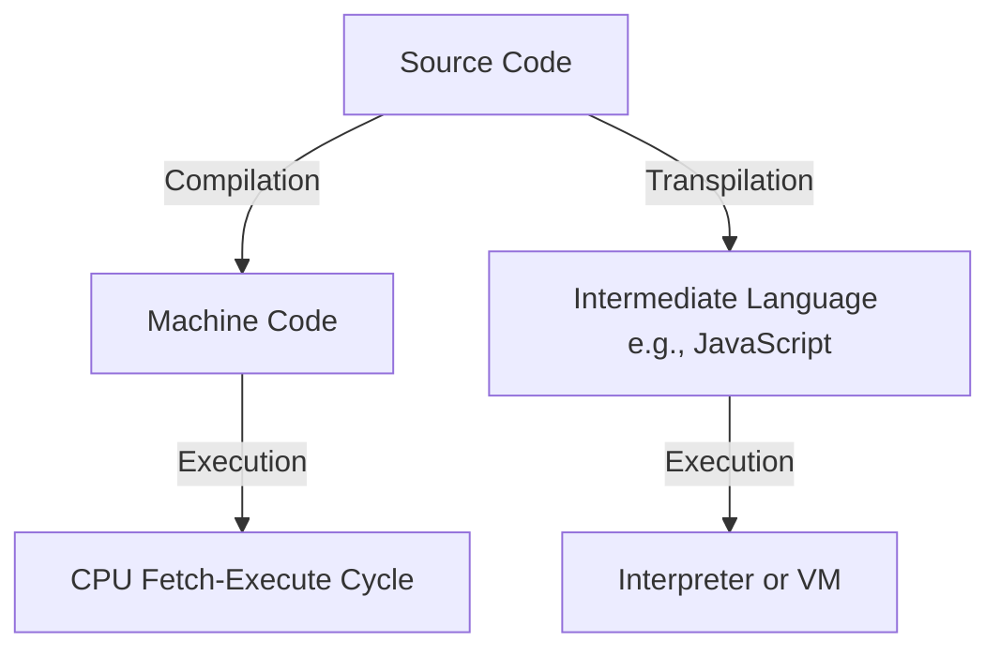
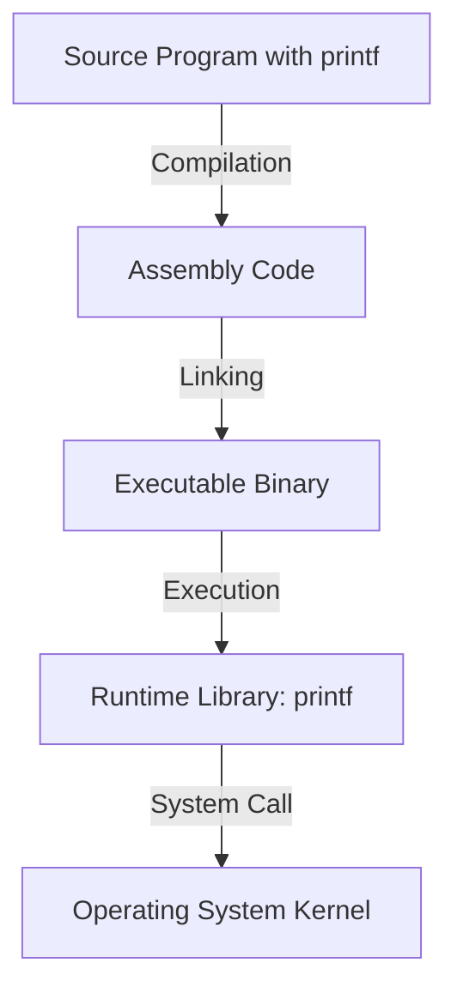
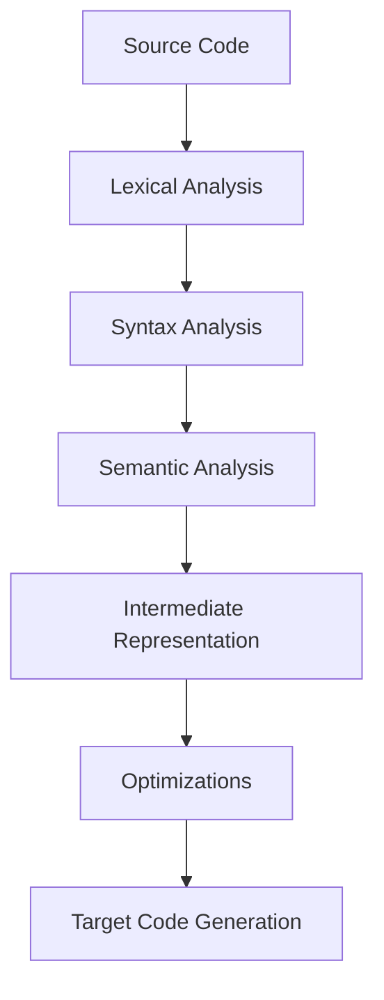
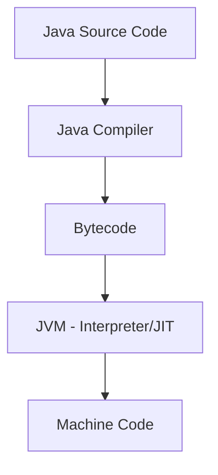
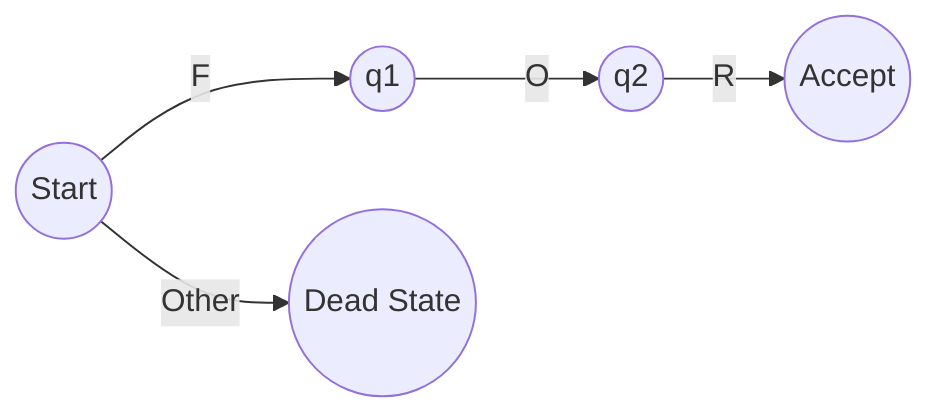
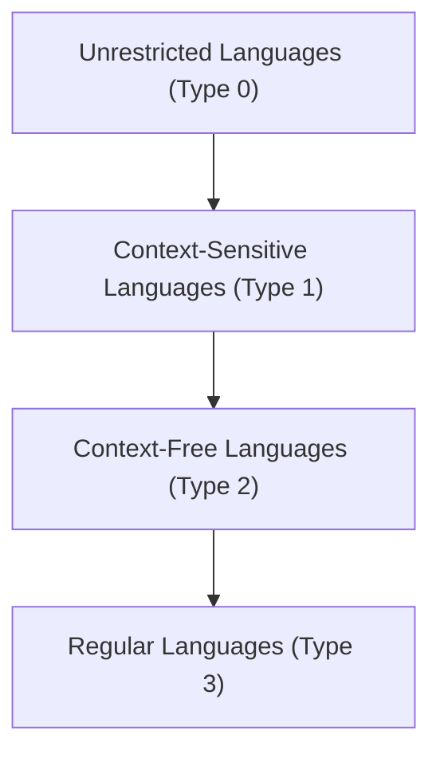
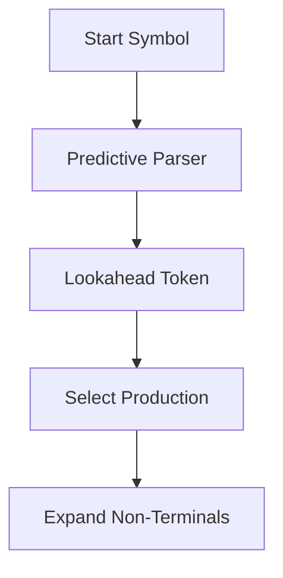
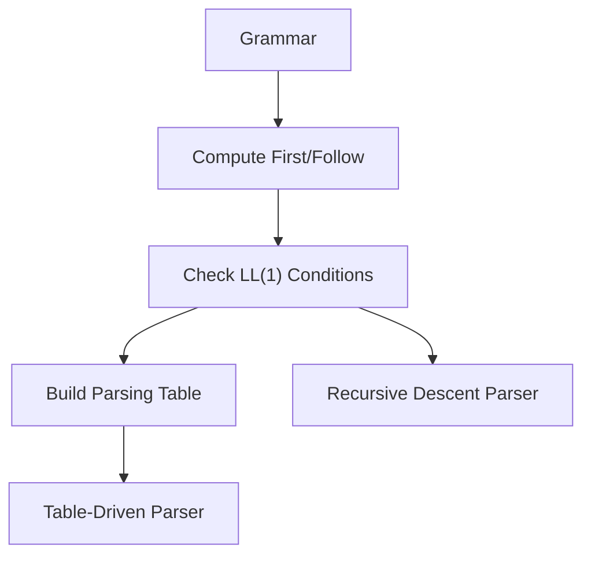
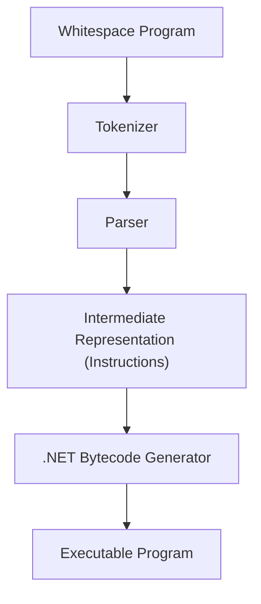

# 15/9/25

![[15:09:25.pdf]]

# 18/9/25
## Chapter 2 – Programming Language Stacks

## 2.1 Introduction
In the second lecture, Professors Cisternino and Corradini introduced the **architecture of programming languages**, focusing on the distinction between **compiled** and **interpreted** languages, the role of **types**, and the historical evolution of programming language semantics【28†Trascrizione】.

The discussion emphasized that programming languages are not only technical tools but also cultural artifacts, shaped by design debates, historical contingencies, and the need to balance **human readability** with **machine executability**.

## 2.2 Historical Perspectives
Every symbol and syntactic convention in programming languages has a history. For example, the syntax for **assignment** varies between languages: while C uses the `=` operator, Pascal historically used `:=`, aligning more closely with the mathematical notion of equality as a relation rather than an operation. Such design choices reflect philosophical debates about clarity, formality, and usability【28†Trascrizione】.

A notable anecdote concerned the early 2000s development of **C# generics** (parametric polymorphism). At Microsoft Research, teams debated for days about the placement of angle brackets and commas to preserve formal grammar properties. Such details illustrate how even apparently trivial syntactic decisions embody deep theoretical concerns.

## 2.3 Compiled vs. Interpreted Languages
The lecture explored the distinction between compiled and interpreted languages. In simplified terms:
- **Compiled languages** translate source code into a *target language* (usually machine code) before execution.
- **Interpreted languages** execute source code more directly, often line by line, through a program that acts as an interpreter.

However, this distinction is not absolute:
- A CPU itself implements a **fetch-execute cycle**, effectively behaving as an interpreter at the hardware level.
- Many modern languages employ **hybrid strategies**, such as Java, which compiles into bytecode executed by the Java Virtual Machine (JVM).
- Intermediate cases include **transpilers**, e.g., TypeScript → JavaScript.

Thus, compilation and interpretation exist on a **continuum** rather than as mutually exclusive categories【28†Trascrizione】.



*Figure 2.1 – Simplified view of compilation and interpretation pathways.*

## 2.4 Formal Specifications and Machines
The concept of a *machine* is central. Each machine (physical or virtual) has a language of instructions it can execute. Compilers map a **source language** (e.g., C, Java) into the target language of the machine, preserving semantics. Interpreters, on the other hand, directly execute the source or an intermediate representation.

Importantly, **pure interpreters** or **pure compilers** are rare. Even compiled languages rely on runtime libraries (e.g., `printf` in C) that are not compiled into machine code but provided separately. Conversely, interpreters often perform preprocessing steps, creating optimized intermediate forms before execution【28†Trascrizione】.

## 2.5 The Example of `printf` in C
A central case discussed in class was the **`printf` function in C**. Students often assume that C is a “fully compiled” language, but this is not entirely true. When a program containing `printf("Hello, world!\n")` is compiled:
1. The C compiler translates the source into assembly.
2. The **runtime library** provides the implementation of `printf`, which is **not compiled into machine code by the user’s compiler** but instead linked at runtime.
3. At execution, the compiled code prepares the arguments, pushes them onto the **stack**, and calls the `printf` function provided by the runtime.

The stack plays a crucial role in function calls. Arguments are loaded into memory following a **calling convention** (e.g., in C, the caller is responsible for cleaning up the stack, unlike Pascal-style conventions where the callee cleans it). This distinction is essential because `printf` accepts a **variable number of arguments**, making it impossible for the callee to know how many arguments were passed. Thus, only the caller can clean the stack correctly【28†Trascrizione】.

In class, a **GPT-based code window** was also used to show the compilation process, displaying the generated assembly instructions. This live demonstration illustrated how `printf` is invoked: first pushing the format string and parameters, then executing a `CALL` to the runtime’s `printf` implementation. The assembly revealed both the **compiled portion** of the program and the **runtime dependency**, underscoring that no language is purely compiled.



*Figure 2.2 – Flow of control when using `printf` in a C program.*

## 2.6 Runtime Systems
A key theme was the role of **runtime systems**. Beyond the compiler, runtimes provide essential services:
- Memory management (including garbage collection)
- Input/output libraries
- Networking and concurrency support

Historical examples include the **C runtime**, the **Java Virtual Machine**, and Microsoft’s **.NET Universal Runtime (URT)**, originally conceived as a “modern C runtime” to integrate features such as garbage collection, networking, and graphics【28†Trascrizione】.

These runtimes blur the line between compilation and interpretation, as they embed interpreters and additional services into what might otherwise be considered a compiled language environment.

## 2.7 Types and Type Systems
Types are a fundamental organizing principle in programming languages. A type can be defined as:
- A **set of values** (e.g., integers, strings)
- A set of **operations** permissible on those values

Programming languages differ in how strictly they enforce type rules:
- **Strongly typed languages** (e.g., Java, Haskell) strictly enforce type rules and prevent operations on incompatible types.
- **Weakly typed languages** (e.g., C, C++) allow unsafe operations such as pointer casts, placing responsibility on the programmer.

### Static vs. Dynamic Typing
- **Statically typed languages** (e.g., C, Java) check types at compile time.
- **Dynamically typed languages** (e.g., Python, JavaScript) defer type checking to runtime.

Hybrid cases exist. For instance, **Java** performs compile-time checks but requires runtime checks for operations such as **downcasting** (e.g., casting a `Control` object to a `Button`). Generics in Java reduce the need for such casts, but their implementation strategy (type erasure) means that certain checks still occur at runtime【28†Trascrizione】.

### Duck Typing
In dynamically typed languages, **duck typing** permits operations on objects if they “quack like a duck,” i.e., if they provide the expected methods, regardless of formal type declarations. This philosophy underlies languages such as Python and JavaScript.

## 2.8 Type Constructors and Language Expressivity
An important classification concerns whether a language supports **type constructors**—the ability to define new composite types. Some languages (e.g., Java, C++) provide robust mechanisms for creating new types, while others (e.g., JavaScript, Lua, early Lisp dialects) lack true type constructors, instead relying on flexible object/dictionary models【28†Trascrizione】.

JavaScript in particular exemplifies this: although it provides a `class` keyword, its underlying type system is based on objects and dictionaries, with syntactic sugar (`a.b` as shorthand for `a["b"]`) providing the illusion of class-based structure. The `this` keyword further complicates semantics, as it dynamically binds to the calling context.

## 2.9 Language Classification
Programming languages can be classified along several axes:
- **Compiled vs. Interpreted**
- **Statically vs. Dynamically typed**
- **Strongly vs. Weakly typed**
- **With or without type constructors**

For example:
- **Rust**: compiled, statically typed, strongly typed, with type constructors.
- **Python**: interpreted, dynamically typed, weakly typed, without traditional type constructors.
- **JavaScript**: interpreted, dynamically typed, with limited type construction via objects.

These categories are **idealizations**, and most real languages occupy hybrid positions along a spectrum【28†Trascrizione】.

## 2.10 Conclusion
The lecture highlighted the **continuum** between compilation and interpretation, the centrality of **types**, and the historical and cultural dimensions of programming language design. Students were encouraged to critically evaluate new or unfamiliar languages by asking:
- To what extent is it compiled or interpreted?
- Is it statically or dynamically typed?
- Is it strongly or weakly typed?
- Does it support type constructors?

These questions provide a framework for systematically analyzing programming languages, preparing students to engage critically with both classical and modern paradigms.


# 24/9/25

## Chapter 3 – The Transformation Architecture of Programming Languages

## 3.1 Introduction
The third lecture began by clarifying the distinction between **programming languages** and **markup languages**. For example, **HTML** is not a programming language but a markup language, designed for structuring documents rather than controlling computation. More modern and lightweight alternatives such as **Markdown** and **Mermaid** were also introduced: the latter allows diagrams to be represented in textual form and rendered automatically, a technique that demonstrates how text manipulation can produce structured and interpretable artifacts【42†Trascrizione】.

This introduction connected naturally to the theme of the lecture: programming languages as systems that transform text into structured representations through a **pipeline of transformations**. Understanding this architecture is crucial, both to build compilers and interpreters, and to analyze or manipulate programs—a skill increasingly central in the age of **AI-driven code generation**.

## 3.2 Metaprogramming
One of the first conceptual topics was **metaprogramming**. A program is not always the final artifact to be executed by a machine: sometimes, programs themselves become the **input** to other programs that transform or generate new programs. This recursive view is fundamental to modern computing:
- **Compilers and interpreters**: programs that read and transform other programs.
- **Frameworks such as TypeScript or React**: they translate higher-level notations into JavaScript and HTML.
- **Object-relational mapping (ORM) systems**: they transform high-level code into SQL queries.

Metaprogramming reflects the natural inclination of programmers to automate repetitive tasks: after writing the same pattern multiple times, the temptation is to build a generator that automates it. This becomes even more relevant with AI tools, which essentially perform metaprogramming at scale.

## 3.3 The Compiler Pipeline
A compiler (or interpreter) typically  processes a program through several **ordered phases**:



*Figure 3.1 – General architecture of a programming language processor.*

### 3.3.1 Lexical Analysis
- Input: a stream of characters.
- Task: group characters into **tokens** (keywords, identifiers, numbers, symbols).
- Removes irrelevant details such as whitespace and comments.
- Often implemented using **finite automata**, derived from **regular languages**.

### 3.3.2 Syntax Analysis (Parsing)
- Input: a stream of tokens.
- Task: build a **tree representation** (parse tree or abstract syntax tree, AST).
- Example: an arithmetic expression like `a + b` becomes a tree with `+` as the root and `a`, `b` as children.

### 3.3.3 Semantic Analysis
- Input: an AST.
- Task: enforce rules about **types** and other semantic properties.
- Example: ensure that variables are used consistently with their declared type.
- Enables **type inference**, where the compiler deduces types from usage (e.g., `let a = 2` implies `a` is an integer).

### 3.3.4 Code Transformation and Optimization
- Intermediate representation (IR) allows systematic **tree-to-tree transformations**.
- Goals: (1) map high-level constructs into target constructs, (2) optimize code for performance.

### 3.3.5 Target Code Generation
- Produces machine code, assembly, or bytecode.
- Examples: GCC uses RTL as IR, Java compiles to **bytecode**, and .NET compiles to **CIL** (Common Intermediate Language).

## 3.4 Determinism and Safety in Language Processing
A key property of programming languages is **determinism**: given the same input, the compiler/interpreter must produce the same output. Non-determinism is unacceptable in critical domains (e.g., aerospace). A historical case: the **Ariane 5 rocket explosion** (1996), caused by an integer overflow in reused software from Ariane 4, illustrates the catastrophic consequences of inadequate attention to determinism【42†Trascrizione】.

## 3.5 Intermediate Representations and Virtual Machines
The lecture emphasized the role of **intermediate code**:
- Early example: **P-code** in Pascal (portable intermediate representation).
- Java’s **bytecode**: more expressive than machine code, but less expressive than Java itself. It retains **metadata** about classes and methods, supporting reflection and portability.
- .NET’s **CLR (Common Language Runtime)**: designed for multi-language integration, ensuring that C#, VB.NET, and F# could interoperate by compiling into the same IR.
- **LLVM**: a modern framework designed to manipulate intermediate representations, enabling powerful optimizations and portability across platforms.



*Figure 3.2 – Java compilation into bytecode and execution on the JVM.*

## 3.6 Automata and Regular Languages
Lexical analysis relies on **finite automata**, which recognize patterns in character streams. However, automata have limits: they cannot, for example, check for **balanced parentheses**. For that, more powerful models such as **context-free grammars** are needed.

### Regular Expressions
Regular expressions, widely used in text editors and code, are a practical application of automata theory:
- Operators: concatenation, alternation (`|`), repetition (`*`, `+`, `{n,m}`).
- Shorthands: character classes (`\d`, `\w`), ranges (`[a-z]`).
- Greedy vs. lazy quantifiers: `*` matches as much as possible, while `*?` matches as little as possible.

Regular expressions extend beyond strict regular languages in most implementations (e.g., **Perl-style regexes**), introducing backtracking and thus Turing-complete expressivity.



*Figure 3.3 – Automaton recognizing the keyword `for`.*

## 3.7 Tokenizers and Practical Examples
A **tokenizer** converts character streams into tokens. In class, a GPT-assisted demonstration showed how to generate a simple tokenizer for recognizing keywords like `for`, `while`, identifiers, and numeric literals. This illustrated how **regular expressions** and **state machines** translate directly into practical code【42†Trascrizione】.

```csharp
if (char.IsLetter(c) || c == '_') {
    // Recognize identifier or keyword
    while (char.IsLetterOrDigit(c)) advance();
    if (lexeme == "for") return Token.For;
    if (lexeme == "while") return Token.While;
    return Token.Identifier;
}
else if (char.IsDigit(c)) {
    while (char.IsDigit(c)) advance();
    return Token.Number;
}
```

*Figure 3.4 – Simplified tokenizer logic.*

## 3.8 Conclusion
This lecture highlighted the **two halves of programming language processing**:
1. **Analysis**: lexical, syntax, and semantic analysis.
2. **Synthesis**: code transformation, optimization, and generation.

Students were encouraged to remember that programming languages are deeply conservative systems: they evolve slowly because of their complexity and the critical importance of reliability. Understanding the **pipeline of transformations**, from text to tokens, from trees to machine code, equips programmers to reason rigorously about both traditional compilers and modern AI-based code generators.


# 25/9/25

## Chapter 4 – Grammars and Top-Down Parsing

## 4.1 Introduction
In this lecture, Professor Andrea Corradini introduced the theory and practice of **grammars** and their role in defining the syntax of programming languages, with a particular focus on **top-down parsing**. Unlike previous lessons that explored the broader architecture of compilers, this lecture focused on how grammars generate languages, how derivations and parse trees work, and how parsers determine whether a program is syntactically correct【50†Trascrizione】.

## 4.2 Syntax, Semantics, and Pragmatics
To specify a programming language, three aspects are essential:
- **Syntax**: the formal rules that define valid programs (expressed through grammars).
- **Semantics**: the meaning of syntactically valid programs.
- **Pragmatics**: conventions for readability and usability (e.g., paradigms such as object-oriented vs. functional, or naming conventions across languages).

While this lecture concentrated on syntax, it acknowledged the importance of semantics (checked later in compilation) and pragmatics (vital for code readability and maintainability).

## 4.3 Grammars and the Chomsky Hierarchy
A **grammar** is defined as a tuple consisting of:
- A set of terminal symbols (tokens).
- A set of non-terminal symbols.
- A set of productions (rewriting rules).
- A start symbol.

The **Chomsky hierarchy** classifies grammars by expressive power:
1. **Regular grammars (Type 3)** – can be recognized by **finite automata**.
2. **Context-free grammars (Type 2)** – can be recognized by **pushdown automata** (with a stack).
3. **Context-sensitive grammars (Type 1)** – require more complex automata.
4. **Unrestricted grammars (Type 0)** – equivalent to **Turing machines**.

Each level strictly includes the previous one. For example:
- Finite languages are regular.
- The language `{a^n b^n}` is context-free but not regular.
- The language `{a^n b^n c^n}` is context-sensitive but not context-free【50†Trascrizione】.


*Figure 4.1 – The Chomsky hierarchy of grammars.*

## 4.4 Derivations and Parse Trees
- A **derivation** is a sequence of steps applying productions to generate strings from the start symbol.
- **Leftmost derivations** always expand the leftmost non-terminal first.
- **Rightmost derivations** always expand the rightmost non-terminal first.

A **parse tree** represents the structure of a derivation:
- Root: the start symbol.
- Internal nodes: non-terminals expanded by productions.
- Leaves: terminal symbols (tokens).

Parse trees abstract away from the order of derivations, offering a canonical representation of structure. However, a grammar may be **ambiguous**, meaning that multiple parse trees can yield the same string. This is problematic because ambiguity can imply multiple interpretations of the same program.

### Example: Ambiguity
For arithmetic expressions with `+` and `-`, the string `9 - 5 + 2` can be parsed in two ways:
- `(9 - 5) + 2 = 6`
- `9 - (5 + 2) = 2`

To resolve ambiguity, programming languages adopt:
- **Operator precedence** (e.g., `*` has higher precedence than `+`).
- **Associativity rules** (e.g., `+` and `-` are left-associative).

Another classical ambiguity is the **dangling else problem** in conditional statements, where an `else` clause could be attached to multiple `if` statements. Most languages resolve this by attaching the `else` to the nearest unmatched `if`【50†Trascrizione】.

## 4.5 Lexical and Syntax Grammars
Programming languages typically separate two grammars:
- **Lexical grammar (regular)**: defines how characters group into tokens. Implemented via **regular expressions** and finite automata.
- **Syntax grammar (context-free)**: defines how tokens combine into valid structures (statements, expressions).

Some constraints (e.g., variables must be declared before use, or matching numbers of actual and formal parameters) cannot be expressed in context-free grammars. These are enforced later during **semantic analysis**【50†Trascrizione】.

## 4.6 Parsing Techniques
Parsing is the process of determining if a sequence of tokens belongs to the language defined by a grammar. General parsing algorithms may have cubic complexity (O(n³)) and are impractical for real-world programming languages. Instead, compilers use efficient algorithms based on restricted grammars.

### 4.6.1 Top-Down Parsing
- Constructs the parse tree from the root down to the leaves.
- Straightforward to implement: each non-terminal corresponds to a procedure that attempts to match input.
- Naive recursive descent with backtracking is **exponential** in complexity.

### 4.6.2 Predictive Parsing (LL Parsing)
- Restricts grammars to avoid backtracking.
- Uses **lookahead tokens** to decide which production to apply.
- Achieves **linear time parsing**.


*Figure 4.2 – Simplified predictive parsing strategy.*

#### First and Follow Sets
To build predictive parsers, two sets are computed:
- **First(α)**: the set of tokens that can begin strings derived from α.
- **Follow(A)**: the set of tokens that can immediately follow the non-terminal A in derivations.

These sets help ensure that the grammar is suitable for predictive parsing (LL(1) grammars).

#### Eliminating Left Recursion
Predictive parsers cannot handle **left-recursive grammars** (where a non-terminal can derive itself as the first symbol). Transformations exist to eliminate left recursion by rewriting productions into right-recursive forms.

## 4.7 Practical Examples
During the lecture, small grammars were used to illustrate predictive parsing. A demonstration with ChatGPT showed how a grammar could be translated into recursive parsing functions, and how **lookahead tokens** allow parsers to decide which production to apply without backtracking【50†Trascrizione】.

```csharp
void Expr() {
    Term();
    while (lookahead == '+' || lookahead == '-') {
        Token op = lookahead;
        match(op);
        Term();
    }
}
```
*Figure 4.3 – Example of recursive descent parsing function for expressions.*

## 4.8 Conclusion
This lecture emphasized how **grammars formalize syntax**, how **parse trees** ensure structured representation, and how **ambiguity must be resolved** to ensure deterministic semantics. Top-down parsing, and in particular **predictive (LL) parsing**, was presented as an efficient and widely adopted strategy for real-world compilers.

Professor Corradini concluded by highlighting the complementarity of teaching styles: *“I feel very much like a compiler, where Antonio is an interpreter.”*【50†Trascrizione】


![[09-25-AP25-Parsing.pdf]]

# 29/9/25
## Chapter 5 – Predictive Parsing and the Whitespace Compiler

### 5.1 Introduction
The lecture of September 29 was divided into two parts. In the first hour, Professor Corradini concluded his presentation on **predictive parsing**, focusing on the formal definitions of **First** and **Follow** sets and on the construction of LL(1) parsers. In the second hour, Professor Cisternino led a hands-on exercise by examining and running the **Whitespace compiler**, a playful yet instructive project demonstrating how compiler theory translates into practice【58†Trascrizione】.

### 5.2 Predictive Parsing: First and Follow Sets
Predictive parsing relies on the ability to choose the correct production at each step using only one lookahead token. This requires computing:

- **First(α):** the set of tokens that may appear at the beginning of strings derived from α.
  - If α begins with a terminal, that terminal is in First(α).
  - If α begins with a non-terminal, First(α) includes the union of First of all its productions.
  - If α can derive ε (epsilon, the empty string), then First(α) also contains ε.

- **Follow(A):** the set of tokens that can appear immediately after a non-terminal A in some sentential form.
  - If a production contains `A β`, then everything in First(β) (except ε) is added to Follow(A).
  - If β can derive ε, then everything in Follow of the left-hand side symbol is added to Follow(A).
  - For the start symbol S, the end-of-input marker `$` is included in Follow(S).

A grammar is **LL(1)** if, for every non-terminal, the sets of possible lookaheads for its productions are disjoint. This ensures that parsing is deterministic without backtracking【58†Trascrizione】.

#### Recursive Descent vs. Table-Driven Parsing
- **Recursive descent**: each non-terminal corresponds to a procedure; lookahead determines which production to apply.
- **Table-driven**: uses a parsing table indexed by (non-terminal, lookahead) to decide the production. The parser maintains a stack of symbols, consulting the table at each step.

Both methods are equivalent for LL(1) grammars.


*Figure 5.1 – Constructing LL(1) parsers.*

### 5.3 Error Handling in Parsing
Compilers must handle errors gracefully rather than stopping at the first mistake. Strategies include:
- **Panic mode**: skip tokens until a synchronizing token (e.g., `;` or `}`) is found.
- **Phrase-level recovery**: insert or delete minimal tokens to continue parsing.
- **Error productions**: extend the grammar to explicitly handle common mistakes.
- **Global correction**: find the least-cost set of edits to make the input valid (rare in practice).

LL(1) parsers enjoy the **viable prefix property**: they can detect errors as soon as the current prefix cannot be extended into a valid string【58†Trascrizione】.

### 5.4 The Whitespace Language
The second half of the lecture introduced the **Whitespace language**, an esoteric programming language invented as a parody of conventional syntax. In Whitespace:
- Only spaces, tabs, and line feeds are meaningful tokens.
- All visible characters are ignored.
- Programs are defined entirely through sequences of whitespace characters.

The language, though humorous in origin, is **Turing complete**. It includes:
- **Stack manipulation**: push, pop, duplicate, swap.
- **Arithmetic operations**: addition, subtraction, multiplication, division.
- **Heap access**: memory read/write.
- **Flow control**: labels, jumps, subroutines.
- **I/O operations**: input and output for integers and characters【58†Trascrizione】.


*Figure 5.2 – Architecture of the Whitespace compiler implemented in C#.*

### 5.5 Architecture of the Whitespace Compiler
The **Whitespace compiler** implemented by Professor Cisternino in 2003 (and later modernized) demonstrates how compiler theory applies even to a joke language:

1. **Tokenizer**: converts spaces, tabs, and line feeds into tokens. Other characters are ignored.
2. **Parser**: a recursive descent parser that interprets Whitespace grammar rules and builds an internal representation (a list of instructions).
3. **Intermediate Representation**: each instruction (push, add, jump, etc.) is represented by a class instance. Control-flow instructions use a table of labels for jump targets.
4. **Code Generation**: emits .NET bytecode via reflection. A separate `Stack` object is created to maintain Whitespace semantics, since it differs from the .NET runtime stack.
5. **Executable Output**: produces a runnable .NET program (`.dll` and `.exe`) faithfully implementing the Whitespace code【58†Trascrizione】.

#### Example Program
A program that pushes `6`, pushes `1`, adds them, and prints the result (`7`) looks like an empty file, but internally it is:
- **Source (invisible):** `[space][number 6][LF][space][number 1][LF][tab][space][LF][tab][LF]`
- **Human-readable (via pretty-printer):**
  ```
  PUSH 6
  PUSH 1
  ADD
  PRINT_INT
  END
  ```
- **Execution result:** `7`

This shows how invisible whitespace translates into meaningful computation.

#### Fibonacci Example
A more complex program included in the repository computes the Fibonacci sequence. Written in Whitespace, it uses stack operations, loops, and I/O to generate terms. With comments interspersed, the code becomes readable; otherwise, it is entirely whitespace.

### 5.6 Stack Machines and Compilation
Both Java and .NET virtual machines are **stack-based**, meaning operands are pushed and popped from a stack rather than stored in registers. This design simplifies compiler implementation (no need to manage a fixed number of registers).

The Whitespace compiler illustrates these principles. Each instruction in Whitespace is compiled into a corresponding .NET bytecode sequence. For example:
- `PUSH n` → `ldc.i4 n` then `call Stack.Push`
- `ADD` → `call Stack.Pop` twice, then `add`, then `call Stack.Push`

By tracking the stack height, the compiler can even perform **static checks** (e.g., ensuring enough operands exist before applying `ADD`). This is an instance of **abstract interpretation**, proving properties about the program without running it.

### 5.7 Modernization with AI Assistance
The original compiler was written in C# 1.0. To update it for .NET 9, Professor Cisternino used **GitHub Copilot / GPT-based tools** to:
- Suggest replacements for deprecated constructs.
- Refactor code for readability (e.g., replacing explicit type declarations with `var`).
- Automatically generate pull requests for modernization.

The result is a working modern compiler, partially rewritten with AI assistance—demonstrating how future programming will increasingly involve **human oversight of AI-generated code**【58†Trascrizione】.

### 5.8 Conclusion
This lecture bridged **theory and practice**. The first half detailed how grammars, First/Follow sets, and LL(1) parsing guarantee determinism and efficiency. The second half demonstrated these ideas through the Whitespace compiler: from tokenizer to parser to .NET bytecode. Beyond its humorous origin, the project shows how compiler concepts apply universally, and how AI tools are reshaping the very way compilers and software are maintained.

# 1/10/25

## Lecture Summary: Names and Scoping in Programming Languages

**Date:** October 1, 2025

### Chapter 1: Introduction and Course Materials

- **AI-Generated Notes**: The instructor has released AI-generated notes from transcripts, which have been reviewed and edited. These are available in the course materials section.
- **Important Caveat**: While these notes contain most of the lecture content and additional information, they do not replace textbook chapters on programming language pragmatics.
- **Master's Course Philosophy**: Students should focus on becoming better programmers rather than just learning to pass exams.

### Chapter 2: Reviewing Language Fundamentals

- **Whitespace Compiler**: A small, browsable example containing all main elements of a language pipeline (lexer, parser, code generation).
- **Moving Forward**: The course transitions from traditional compiler topics to exploring the importance of names in programs.

### Chapter 3: The Importance of Names in Programs

#### 3.1 Why Names Matter

- Names are crucial for documentation, software engineering, and security.
- Names act as a contract between programmers and machines.
- Names are more than variable/function names—they include:
    - Identifiers in grammar
    - Pointers in C (which reference objects)
    - Any mechanism that allows reference to program entities

#### 3.2 Names and Memory Organization

- Names define the organization of memory in a programming language.
- Scoping rules that govern name visibility directly affect object lifetime in memory.

#### 3.3 Naming Conventions

- **Camel Case** (camelCase): Start with lowercase, capitalize subsequent words
- **Pascal Case** (PascalCase): Start with uppercase for class names
- Conventions aid code readability and are enforced by tools and AI assistants (e.g., GitHub Copilot)
- These pragmatic conventions help developers understand and browse code

#### 3.4 Names in Real-World Code: The C# Compiler

- Explored the Roslyn compiler architecture (open-source on GitHub)
- Names start with filenames (important in languages like Java)
- Real-world code organization follows theoretical principles
- Examples from the C# compiler show how naming patterns reveal program structure
- The importance of finding definitions through names (e.g., searching for "Main" or "Parser")

---

### Chapter 4: Scoping Rules

#### 4.1 What is Scoping?

- **Definition**: Scoping defines where a name is visible and how it relates to its declaration.
- Names have declarations that bind them to values or types.

#### 4.2 Static vs. Dynamic Scoping

- **Static Scoping** (most modern languages):
    
    - Name meaning is determined by examining the program text
    - You can determine which declaration a name refers to without running the program
    - Examples: C#, Java, JavaScript (mostly)
- **Dynamic Scoping** (rarely used today):
    
    - Execution determines which value a name refers to
    - The last assignment in execution order defines the name
    - Historical: simpler to implement, now considered poor practice

#### 4.3 Scope Hierarchy

- **Local Scope**: Variables declared within a block (function, method)
- **Class Scope**: Fields and members of a class
- **Global Scope**: Variables accessible throughout the program
- **Namespace Scope**: Organized through dot notation (e.g., `System.IO.FileNotFoundException`)

#### 4.4 Understanding Scope in Real Code

- Example: Finding `_options` field in a C# constructor
    - Not declared locally → check class level
    - May be in a `partial` class (spread across files)
    - Hierarchical search based on grammar structure

### Chapter 5: Lexical Closures

#### 5.1 Definition and Purpose

- Lexical closures result from scoping rules in languages that support nested function definitions.
- Allow functions to "capture" variables from enclosing scopes.

#### 5.2 Example: Counter Function

```javascript
function counter() {
  var n = 0;
  return function() {
    return n++;
  };
}
```

- The returned function captures `n` from the outer scope
- Each call to `counter()` creates a separate instance of `n`
- `c1 = counter()` and `c2 = counter()` have independent `n` variables

#### 5.3 Semantic Implications

- Variable `n` must remain allocated beyond the function's exit because it's captured
- Extends the lifespan of local variables as long as referencing functions exist
- Without this mechanism, code would be semantically broken

#### 5.4 Objects Through Closures

```javascript
function counter() {
  var n = 0;
  return {
	  'inc': function() { return n++; }
	  'dec': function() { return n--; }
  };
}
```

- (Lexical) Closures can simulate object-oriented behavior:
    - Shared state (the captured variables) = object state
    - Multiple functions referencing that state = methods
    - Enables `inc()` and `dec()` methods sharing the same `n`

#### 5.5 Delegates in C\#

- `.NET` introduced **delegates** to formalize this pattern
- A delegate is a pair: (this pointer, function pointer)
- Enables passing methods as values, essential for functional programming patterns

## Chapter 6: Functions as Values and Higher-Order Programming

#### 6.1 Evolution of Functions as Values

- **Pre-Java (70s-80s)**: Functions were declarations only, not values
- **Java Era (Mid-90s)**: Interfaces made it possible (though clumsy) to pass functions
- **Modern Era**: Functional programming with first-class functions is standard

#### 6.2 Higher-Order Functions

- Functions that accept or return other functions
- Example: `sort(algorithm, collection)`
- Enable powerful abstractions and code reuse

### Chapter 7: The `this` Keyword and JavaScript's Exception

#### 7.1 JavaScript's Unique Scoping Model

- JavaScript is **almost entirely statically scoped** with one notable exception: the `this` variable
- `this` has **dynamic scoping** semantics

#### 7.2 How `this` Works

- When calling `object.method()`, the runtime transforms it to:
    - `this = object`
    - `method()` is invoked
- Enables the illusion of objects in JavaScript (despite being a prototype-based language)

#### 7.3 The `new` Keyword

- `var s = new Student()` creates an empty object and sets `this` to it
- Constructor function populates the object's properties
- Convinced many JavaScript developers they had "real" objects

#### 7.4 Modern JavaScript

- Functional patterns now dominate over object-oriented patterns
- The `this` complexity is largely avoided in contemporary code

### Chapter 8: Memory Allocation and the Stack

#### 8.1 Memory Management Fundamentals

- Programs have limited, linear memory (0 to terabytes on 64-bit systems)
- Memory must be allocated for all program values
- Scoping rules directly imply efficient memory management strategies

#### 8.2 The Stack Data Structure

- **Stack allocation** for local variables follows the functional call pattern
- When entering a function: allocate an **activation record**
- When exiting: deallocate and return value
- **Natural fit** for recursive, nested function calls

#### 8.3 Activation Records

- Contains:
    - Local variables
    - Formal parameters
    - Return address (where to return control)
    - Other metadata
- Stack grows/shrinks with function calls and returns
- Implements scope naturally: variables below are hidden

#### 8.4 Stack and Scope Relationship

- Stack layout naturally enforces static scoping
- Functions cannot access variables of other concurrent activations
- Provides automatic privacy/encapsulation

#### 8.5 Recursion and Static Allocation

- Without recursion: local variables could be statically allocated once
- With recursion: need dynamic allocation for each activation
- Scoping rules that allow recursion require dynamic stack management

### Chapter 9: Memory Management Strategies

#### 9.1 Three Categories of Memory

1. **Static Memory**: Allocated at program load, persists until termination (global variables)
2. **Stack Memory**: Automatically managed, follows function activation
3. **Dynamic Memory**: Allocated on demand, requires explicit or automatic deallocation

#### 9.2 Memory Management Approaches

##### Explicit Management (C/C++)

- Programmer explicitly allocates (`malloc`/`new`) and frees (`free`/`delete`)
- Most efficient but error-prone
- Can lead to memory leaks or dangling pointers

##### Reference Counting

- Tracks how many references exist to each value
- Automatically deallocates when count reaches zero
- Semi-automatic approach

##### Garbage Collection (Java, Python, JavaScript, C#/.NET)

- System automatically identifies and deallocates unreachable objects
- More forgiving but with runtime overhead
- Enables safer programming at cost of performance

##### Rust's Approach

- Attempts to combine efficiency of explicit management with safety
- Uses ownership rules and borrow checking to prevent errors
- Unique position as a practical system language with memory safety guarantees

#### 9.3 The Great Memory Management Debate

- **C Philosophy**: "Memory is too important to let the system manage it"
- **Lisp/Python Philosophy**: "Memory is too important to let the programmer manage it"
- **Result (40 years later)**: Lisp/Python won—most modern code uses automatic management

### Chapter 10: Practical Implications and Future Topics

#### 10.1 Key Takeaways

- Scoping rules define a language's semantics and implementation
- Names are the foundation of code comprehension
- Understanding where names come from is crucial for reading code
- Scoping rules naturally induce stack-based memory management

#### 10.2 Real-World Example: The Legere Project

- Open-source University of Pisa project used for elections
- Election card generation code contains complex JavaScript patterns
- Even the author is cautious when modifying it—complexity of real-world code

#### 10.3 Upcoming Topics

- Deep dive into memory management strategies
- Virtual machine implementation (JVM, .NET CLR)
- Cost analysis of virtual calls and garbage collection
- Advanced naming and scoping patterns
### Conclusion

The lecture emphasizes that names, scoping, and memory management are deeply interconnected. By understanding how scoping rules work, programmers gain insight into:

- How to read and understand complex code
- How languages are implemented efficiently
- The trade-offs between different programming paradigms
- Why certain design decisions exist in modern languages
# 2/10/25
## Lecture Summary: Memory Management and Garbage Collection

**Date:** October 2, 2025

#TODO REWATCH
### Chapter 1: Course Assignments and Housekeeping

#### 1.1 Lexical Closures Investigation Assignment

- Students are asked to investigate at least two programming languages
- Determine whether each language supports lexical closures
- Assess if support is complete or partial
- **Languages to investigate**: C, JavaScript, ML, F#, Visual Basic, C#, Java, Rust, Python, Lua, Perl, Fortran, COBOL, PowerShell, Bash, C Shell
- **Note on Pascal**: Allows returning functions but only within module scope (incomplete closure support)
- Results can be uploaded via assignment form (optional but encouraged)

#### 1.2 Course Philosophy Reminder

- Scoping is essential for understanding how names work in programs
- Scope defines where a name has meaning (value and type)
- Static scoping is defined independently of execution
- Understanding activation records is key to grasping memory management

### Chapter 2: Introduction to Memory Management

#### 2.1 Three Types of Memory

1. **Static Memory**: Allocated at program load, persists throughout execution (global variables)
2. **Stack Memory**: Automatically managed through activation records, grows/shrinks with function calls
3. **Dynamic Memory (Heap)**: Allocated on demand, requires explicit or automatic deallocation

#### 2.2 Memory Layout

- Memory is a continuous stream of cells addressed linearly
- Layout interpretation depends on programming language
- **Interoperability challenge**: Different compilers may organize data differently (e.g., X-Y vs Y-X coordinate storage)
- Memory layout crucial for marshalling and serialization between languages

#### 2.3 The Heap Problem

- Stack has a maximum size (prevents collision with heap)
- **Stack Overflow**: Results from exceeding maximum stack size through deep recursion
- Heap is the largest portion of memory for dynamic allocation
- Programmer must manage which blocks are allocated and which are free

### Chapter 3: Explicit Memory Management (C Style)

#### 3.1 Free List Data Structure

- **Concept**: Linked list of free memory blocks
- **Mechanism**: Free blocks are stored in the heap itself (no extra cost)
- **Implementation**:
    - Each free block contains pointer to next block and size information
    - Allocation: Find block large enough, split if necessary
    - Deallocation: Return block to free list

#### 3.2 Memory Fragmentation

- **Issue**: Repeated allocate/deallocate cycles create holes in memory
- **Problem**: Total free memory may be sufficient, but no single contiguous block large enough for new allocation
- **Defragmentation**: Theoretically possible but impractical at CPU instruction level
- **Performance cost**: Moving blocks and updating pointers would be too expensive
- **Solution in C**: Allocate memory in chunks (1 MB heaps), throw away entire heap when empty

#### 3.3 Challenges with Explicit Management

- **Two schools of thought**:
    - **C Philosophy**: Programmer should control memory (more efficient)
    - **Lisp Philosophy**: System should manage memory (safer)
- **Result (40 years later)**: Lisp philosophy won—most modern code uses automatic management
- **Human error**: Conventions for allocate/deallocate are prone to mistakes:
    - Forget to deallocate → memory leaks
    - Deallocate prematurely → dangling pointers
    - Allocation responsibility unclear → inconsistent patterns

### Chapter 4: Reference Counting

#### 4.1 Basic Concept

- Each object has a reference counter
- Every client using an object increments counter ("retain")
- When client stops using it, decrements counter ("release")
- When counter reaches zero, object is deallocated
- **Advantage over explicit management**: Safer—automatic deallocation when truly unused

#### 4.2 Implementation Details

- **Space cost**: 4 bytes per object for reference counter (overhead)
- **Time cost**: Increment/decrement on every assignment or scope exit
- **Memory overhead**: Modern objects already carry metadata (~12 bytes overhead), so 4 bytes is reasonable
- **Compiler optimization**: Can automatically inject retain/release calls on assignment

#### 4.3 Critical Problem: Circular References

- **Scenario**: Object A references Object B, Object B references Object A
- **Problem**: Both have reference count ≥ 1, even though neither is reachable from program roots
- **Result**: Memory leak—garbage that won't be collected
- **Example**: Python's CPython uses reference counting but has garbage collection for cyclic references

#### 4.4 Usage in Different Languages

- **Python**: Extensively uses reference counting for memory management
- **Drawbacks**: Breaks reference counting protocol → dangling references possible
- **Why others abandoned it**: All major languages switched to garbage collection to avoid circular reference problem
- **Modern usage**: COM and CORBA used reference counting (90s component models)

### Chapter 5: Garbage Collection Fundamentals

#### 5.1 Core Concept

- Automatically identify and deallocate objects no longer needed
- **Key insight**: If an object is unreachable, it can be freed
- **Reachability**: Object is reachable if there's a path from program roots to it

#### 5.2 Roots

- **Definition**: Entry points to the object graph
- **Types of roots**:
    - Local variables in stack (activation records)
    - Static/global variables in static memory
    - Special roots (e.g., remote objects in remoting, handles in system)
- **Critical importance**: All garbage collection begins from roots
- **Security aspect**: Hiding names/removing references prevents access (core security principle)

#### 5.3 Conservative Assumption

- If object is reachable from any root, keep it alive
- Doesn't guarantee it will be accessed—just that it might be
- Safer than deleting prematurely

### Chapter 6: Mark-and-Sweep Garbage Collection

#### 6.1 Algorithm Overview

- **Phase 1 - Mark**: Starting from roots, traverse object graph and mark all reachable objects
- **Phase 2 - Sweep**: Scan entire heap, deallocate unmarked objects
- **Implementation**: Typically uses free list approach (malloc/free underneath)

#### 6.2 Advantages

- Intuitive and straightforward
- Works with any object layout (precise or imprecise)
- Doesn't require contiguous memory reorganization

#### 6.3 Disadvantages

- **Fragmentation**: Creates holes in heap over time
- **Imprecise variants**: Conservative approach scans memory looking for "pointer-like" values
    - Used in C++ when full layout information unavailable
    - May keep unreachable objects alive ("false positives")
    - Less precise but works without complete type information

### Chapter 7: Copy Collection (Copying Garbage Collector)

#### 7.1 Basic Mechanism

- **Heap divided into two semi-spaces**: From-space and To-space
- **Allocation**: Always allocate in From-space (trivial—just pointer increment)
- **Collection triggered**: When From-space is full

#### 7.2 Collection Process

- **Copy phase**: Traverse from roots, copy all live objects to To-space
- **Update phase**: Backpatch pointers—update all references to point to new locations
- **Space swap**: To-space becomes new From-space; old From-space is empty
- **Benefit**: Compact heap—no fragmentation

#### 7.3 Requirements and Limitations

- **Requires precise GC**: Must know exact location of all pointers
- **Works best with short-lived objects**: If most objects die quickly, little copying needed
- **Expensive if most objects survive**: Requires copying large amounts of memory and backpatching many pointers
- **Memory overhead**: Need space for both semi-spaces simultaneously

#### 7.4 When Copy Collection Works Well

- **String concatenation**: Generate new string, discard old ones (short-lived)
- **Temporary objects**: Web applications creating HTML
- **Poor performance**: Long-lived objects (game physics, scene graphs)

### Chapter 8: Generational Garbage Collection

#### 8.1 Motivation

- Empirical observation: Objects tend to be either very short-lived or long-lived
- Generational hypothesis: Young objects more likely to die; old objects likely to live
- **Solution**: Combine strategies for different generations

#### 8.2 Two-Generation System (Most Common)

- **Generation 0 (Nursery)**:
    - New objects allocated here
    - Allocation is super fast (just pointer increment)
    - Uses copy collection when full
    - Objects surviving move to Gen 1
- **Generation 1 (Mature)**:
    - Objects that survived Gen 0 collection
    - Uses mark-and-sweep
    - Collected less frequently
    - Reduces fragmentation impact since objects are long-lived

#### 8.3 Large Object Heap

- **Threshold**: ~1.5 KB in .NET runtime
- Objects larger than threshold bypass generational system
- Uses mark-and-sweep (copying large objects too expensive)
- Allocates directly to mature heap

#### 8.4 Multiple Generations

- Can extend to Gen 2, Gen 3, etc.
- Each generation collected at different intervals
- Gen 0 → Gen 1 → Gen 2 progression
- Most runtimes use 2-3 generations in practice

#### 8.5 Real-World Example: Xbox Memory Management

- Standard .NET: Generational GC optimized for string-heavy apps
- Xbox .NET (2005): **Replaced with mark-and-sweep only**
- **Reason**: Games allocate different objects than web apps
    - Few strings (no string concatenation)
    - Long-lived objects (scenery, physics objects persist for scenes)
    - Copy collection was creating garbage, slowing down games
    - Generational approach actually hurt performance
- **Lesson**: No universal "best" garbage collection strategy

#### 8.6 Empirical Tuning

- Magic numbers throughout runtimes adjusted based on testing
- Comments like: "Empirically we found this number works best"
- Different workloads require different strategies
- No theory—just trial and error finding what works
### Chapter 9: Multi-Heap Approach

#### 9.1 Modern Runtime Architecture

- **Not a single heap**: Runtime manages multiple heaps with different policies
- **Typical setup**:
    - Gen 0 heap (copy collection)
    - Gen 1 heap (mark-and-sweep)
    - Large object heap (mark-and-sweep, no moving)
    - Possibly Gen 2, GC locker, etc.

#### 9.2 Integration of Strategies

- **Within single program**, use:
    - Explicit allocation for specific needs
    - Reference counting for certain objects
    - Garbage collection for others
- **Not alternatives**: Different strategies coexist
- **Hierarchy of heaps**: Each managed internally with different policies

#### 9.3 Virtual Memory Consideration

- Each heap is array of bytes
- Allocated from process virtual memory
- Multiple heaps allows sophisticated management
- Enables trading off efficiency for different workload patterns

### Chapter 10: Garbage Collection Challenges and Limitations

#### 10.1 Dangling References

- **Worst case**: Pointer to memory that's been freed
- **Result**: Program interprets freed memory as valid → memory corruption → crash
- **Prevention**: Only garbage collection provides complete protection
- **Example**: Ariana 5 rocket failure (mentioned in first class)

#### 10.2 False Positives

- Garbage collection is conservative: "if reachable, keep it"
- **Problem**: Programmer can inadvertently keep objects alive
    - Forgot to clear reference
    - Reference stored in unused variable
    - Cyclic references (even with cycle detection)

#### 10.3 Memory Leaks Still Possible

- If programmer doesn't release references they no longer need
- Objects stay alive even if unreachable from active code
- Garbage collection prevents **dangling references** but not **garbage**
- Garbage = memory that's allocated but unused (wastes space)
- Dangling reference = pointer to freed memory (causes crashes)

#### 10.4 Conservative vs Precise Collection

- **Precise**: Runtime knows exact type/layout of all memory
    - Enables safe compacting
    - Requires rich metadata
    - Used by Java, .NET with full type information
- **Conservative**: Scans memory looking for values that might be pointers
    - Safer for languages that erase type info (C++)
    - False positives keep some garbage alive
    - Less optimal but practical

### Chapter 11: Memory Management is Fundamental

#### 11.1 Performance Reality

- **80% of program execution**: Memory operations (fetch, copy, compute, store)
- **CPU design consequence**: High clock = fewer cores (physical law)
- **Example**: CERN buys high-frequency CPUs (fewer cores) for Monte Carlo simulations because those are memory-independent

#### 11.2 Memory Bandwidth Matters

- **High bandwidth memory (HBM)**: 1 terabyte/second (Intel, NVIDIA)
- Dimension programs assuming this throughput bottleneck
- As advanced programmer, must understand memory hierarchy

#### 11.3 Practical Takeaway

- Memory management is 50-80% of program execution
- Must consider in every line of code
- Understanding memory policies essential for performance
- Different languages/runtimes make different trade-offs based on workload assumptions

### Chapter 12: Summary and Next Steps

#### 12.1 Key Insights

- No single "best" memory management strategy
- Explicit management is efficient but error-prone
- Reference counting fails with cycles
- Garbage collection trades performance for safety
- Generational GC combines strategies for practical efficiency
- Real systems use multiple heaps with different policies

#### 12.2 Empirical Nature

- Memory management design is largely empirical
- Testing and profiling determine best strategies
- Different applications have different needs
- Constants and thresholds tuned for typical workloads

#### 12.3 Coming Next

- **Monday**: Andrea will present Rust memory management (unique approach)
- Rust attempts to combine efficiency of explicit management with safety of GC
- Represents different paradigm using ownership and borrowing

### Conclusion

Memory management is not separate from programming language design—it's fundamental to it. The scoping rules you learned yesterday directly determine how memory must be managed. Understanding both explicit and automatic memory management strategies prepares you to work effectively in any language and to appreciate why different languages make different choices for different use cases.
# 6/10/25

![[07-AP25-10-06-RUST-1.pdf]]
# 8/10/25

![[08-AP25-10-08-RUST-2.pdf]]

# 13/10/25

![[09-AP25-10-13-RUST-3.pdf]]

# 15/10/25

![[10-AP25-10-15-Python_and_GIL.pdf]]

# 16/10/25
REGISTRAZIONE DA RECUPERARE
# 20/10/25
REGISTRAZIONE DA RECUPERARE
# 22/10/25
REGISTRAZIONE DA RECUPERARE
# 23/10/25
REGISTRAZIONE DA RECUPERARE
# 27/10/25

![[15-AP25-10-27-Types-Polymorphism.pdf]]

# 29/10/25

![[16-AP25-JavaGenerics.pdf]]

# 30/10/25

![[17-AP25-Haskell-TypeClasses.pdf]]

# 3/11/25
REGISTRAZIONE DA RECUPERARE
# 5/11/25
REGISTRAZIONE DA RECUPERARE
# 6/11/25
REGISTRAZIONE DA RECUPERARE
# 10/11/25

![[21-AP25-Monads.pdf]]

# 12/11/25
REGISTRAZIONE DA RECUPERARE
# 13/11/25
REGISTRAZIONE DA RECUPERARE
# 17/11/25

![[24-AP25-JLambdas.pdf]]

# 19/11/25

![[25-AP25-Reflection_Annotations_in_Java.pdf]]

# 20/11/25

![[26-AP25-Python-Decorators-OOP.pdf]]

# 24/11/25
REGISTRAZIONE DA RECUPERARE
# 25/11/25
REGISTRAZIONE DA RECUPERARE
# 27/11/25
REGISTRAZIONE DA RECUPERARE

chef, puppet, ansible -> infrastructure as code (IaC)

VM => overhead

container => set of process (cgroup in Linux)
# 1/12/25
REGISTRAZIONE DA RECUPERARE
# 3/12/25
REGISTRAZIONE DA RECUPERARE

# 11/12/25

## Summary of Advanced Programming Course Final Project Lecture

### Chapter 1: Introduction and Course Welcome
- The professor, Antonio Cisternino, welcomes students back to the Advanced Programming course
- Acknowledges the experimental nature of the course format
- Announces the final project phase as the "final step" of the course

### Chapter 2: Project Overview and Philosophy
- Projects will be AI-generated but human-curated
- Three main project categories:
  1. **Explorer codebase** (e.g., GCC memory management, Linux kernel cgroups)
  2. **Explorer language features/libraries**
  3. **Code generation projects**
- 30+ projects will be available
- Students can choose their own project, with some allowance for duplicates
- Emphasis on exploring unfamiliar topics to leverage AI learning capabilities

### Chapter 3: Project Objectives and Learning Goals
- Students should use AI to investigate topics they don't know
- Key skills:
  - Formulating proper questions to get useful AI answers
  - Critically evaluating AI outputs for correctness
  - Understanding advanced programming concepts and their interactions
- The goal is rapid learning of new technologies through effective AI interaction

### Chapter 4: Assessment and Exam Structure
- Projects will be graded and count toward final evaluation
- Oral exams will be scheduled via time slots (approximately 1 hour each)
- Exam dates are flexible and not strictly bound to the academic calendar
- Project submission deadline: **One week before the scheduled oral exam**
- Submission format: Via form (maximum 3 documents, links to cloud storage accepted)

### Chapter 5: Example Projects - Category A (Codebase Exploration)
- **GCC Memory Management**: Internal memory allocation strategies during compilation
- **Linux Kernel Cgroups**: Control groups implementation in Linux kernel
- Focus on understanding memory optimization, data structures, and system architecture

### Chapter 6: Example Projects - Code Generation
- 3D graphics library implementation
- Multi-threaded Mandelbrot viewer with zoom/export capabilities
- Face detector web application (client-side)
- 2D game engine with manual game loop
- Binary disassembler
- MCP server for AI data source integration
- XML parser
- Statistical computation transpiler to JavaScript
- Shakespeare programming language interpreter/parser

### Chapter 7: Example Projects - Language Features Exploration
- **Haskell kinds** and their emulation in F# and JavaScript
- **C# LINQ** type system and extension methods
- **Duck typing** implementations across languages
- **Parametric polymorphism** in C++, Java, and C#
- **Template metaprogramming** differences (why only C++ supports Turing-complete templates)
- **Smalltalk and CLOS** object systems compared to modern OOP
- **Web frameworks**: AngularJS vs React vs jQuery implementation approaches
- **Quotation and quasi-quotation** in Lisp, PHP, and ASP
- **Lexical closures** in Lua, Python, JavaScript, and Perl
- **TypeScript's** hybrid static/dynamic typing system
- **F# units of measure** type system
- **C, C++, and Rust** memory management comparison

### Chapter 8: Project Requirements and Expectations
- Projects are intentionally broad to allow for personal interests
- Focus should be on **advanced programming perspectives**, not just usage tutorials
- AI generation is permitted but not required to be single-shot
- Canvas/iterative editing of AI output is acceptable
- For coding projects: **Code must run** (Docker containers accepted)
- Documentation should include prompts used and discovery process

### Chapter 9: Communication and Support
- Contact professor via **Teams** (not email due to inbox overload)
- Include "Advanced Programming" in subject line
- Projects will be posted in Teams channel for claiming
- Students should comment on posts to claim projects
- Questions and clarifications available before project commitment

### Chapter 10: Course Philosophy and Closing Remarks
- Advanced programming involves understanding subtle interactions between:
  - Syntax and semantics
  - Type systems
  - Runtime implementations
  - Scoping rules
- The beauty of programming languages lies in how features combine to express ideas
- Encouragement to appreciate subtle details, not just obvious features
- Emphasis on thinking critically about language design choices
- Final farewell and holiday wishes to students

---

# PROGETTO ESAME

![[Pasted image 20251211213406.png]]