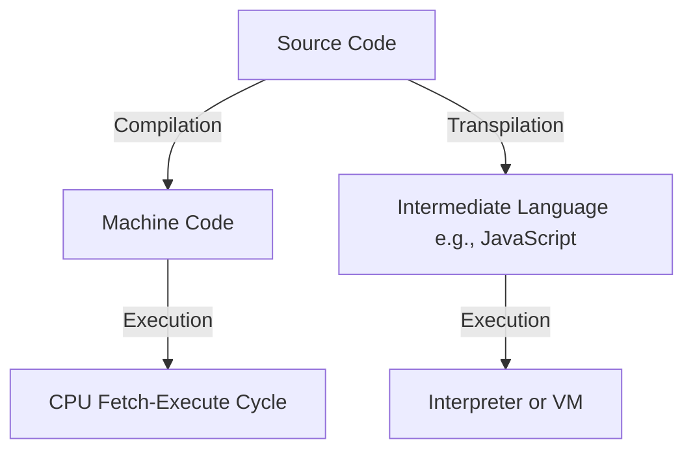
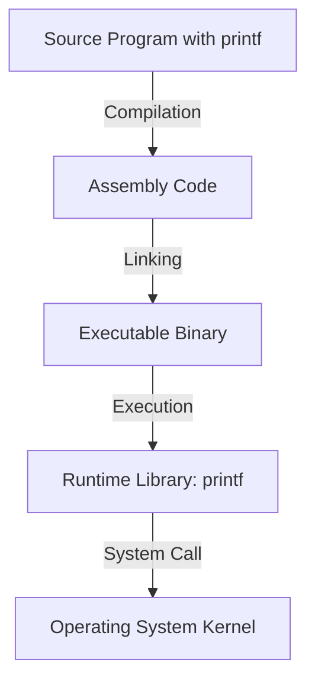
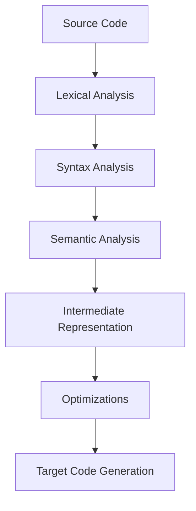
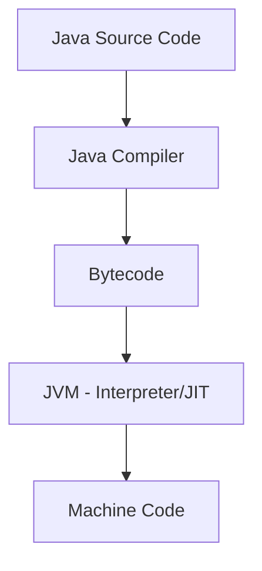
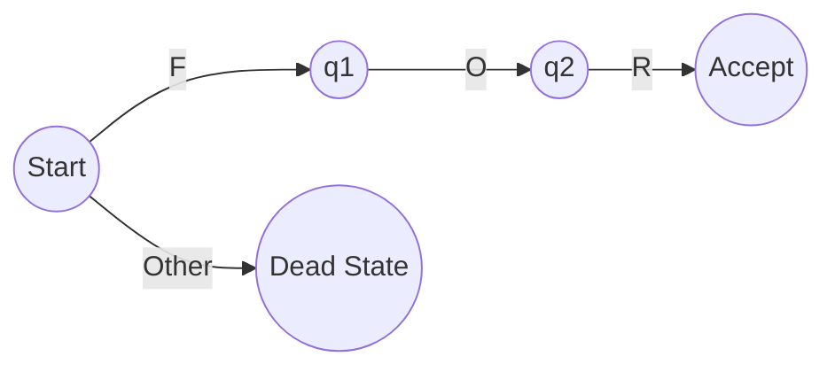
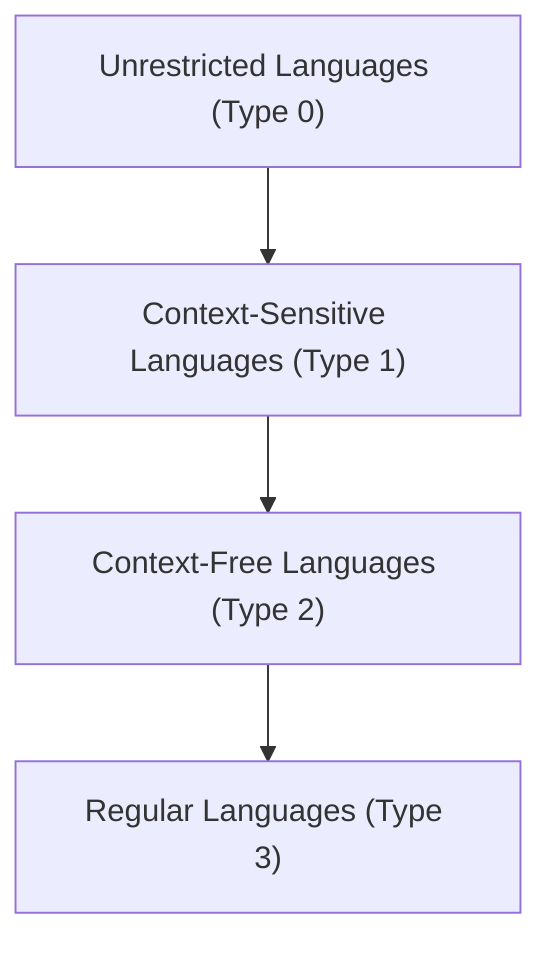
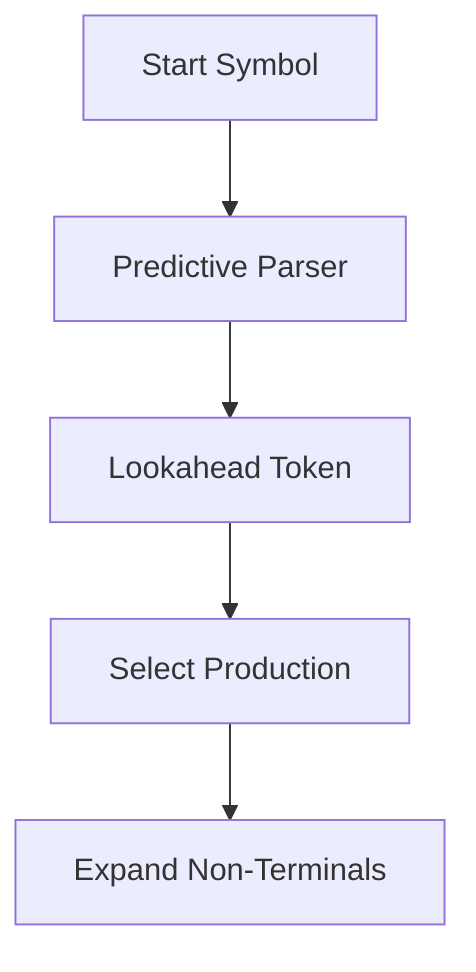
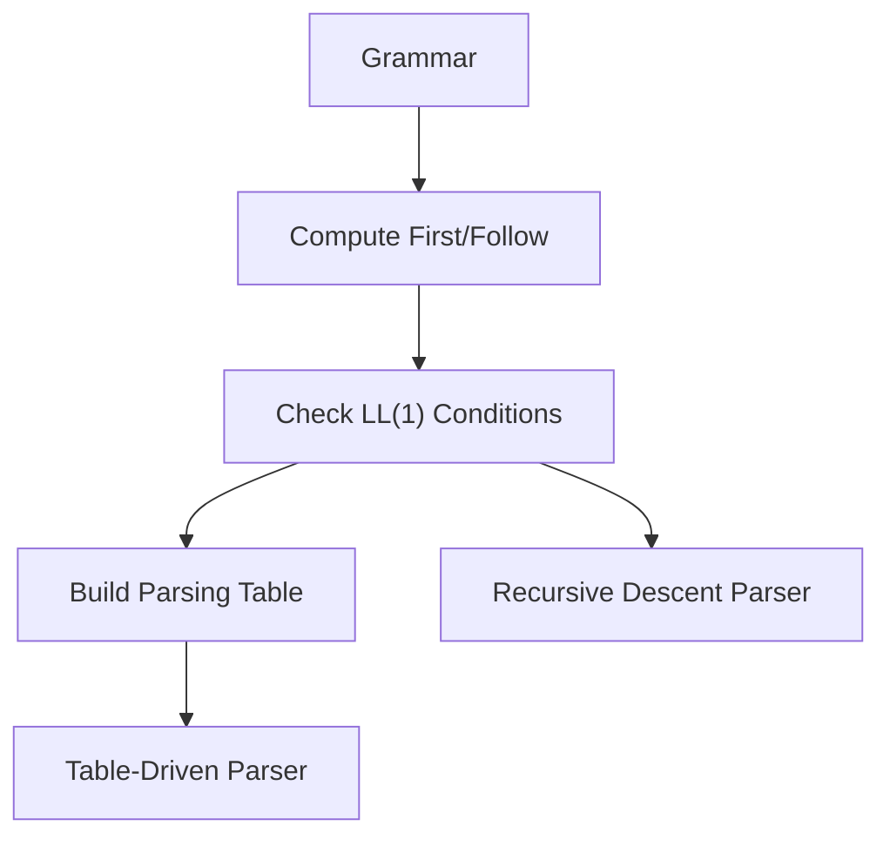
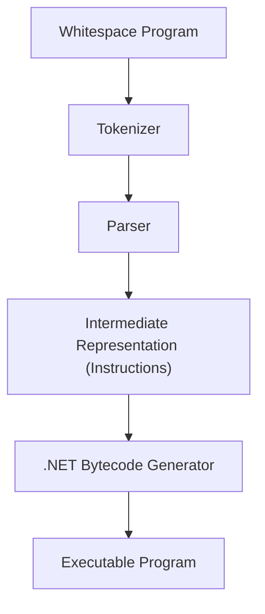

# 15/9/25

![[15:09:25.pdf]]

# 18/9/25
## Chapter 2 – Programming Language Stacks

## 2.1 Introduction
In the second lecture, Professors Cisternino and Corradini introduced the **architecture of programming languages**, focusing on the distinction between **compiled** and **interpreted** languages, the role of **types**, and the historical evolution of programming language semantics【28†Trascrizione】.

The discussion emphasized that programming languages are not only technical tools but also cultural artifacts, shaped by design debates, historical contingencies, and the need to balance **human readability** with **machine executability**.

## 2.2 Historical Perspectives
Every symbol and syntactic convention in programming languages has a history. For example, the syntax for **assignment** varies between languages: while C uses the `=` operator, Pascal historically used `:=`, aligning more closely with the mathematical notion of equality as a relation rather than an operation. Such design choices reflect philosophical debates about clarity, formality, and usability【28†Trascrizione】.

A notable anecdote concerned the early 2000s development of **C# generics** (parametric polymorphism). At Microsoft Research, teams debated for days about the placement of angle brackets and commas to preserve formal grammar properties. Such details illustrate how even apparently trivial syntactic decisions embody deep theoretical concerns.

## 2.3 Compiled vs. Interpreted Languages
The lecture explored the distinction between compiled and interpreted languages. In simplified terms:
- **Compiled languages** translate source code into a *target language* (usually machine code) before execution.
- **Interpreted languages** execute source code more directly, often line by line, through a program that acts as an interpreter.

However, this distinction is not absolute:
- A CPU itself implements a **fetch-execute cycle**, effectively behaving as an interpreter at the hardware level.
- Many modern languages employ **hybrid strategies**, such as Java, which compiles into bytecode executed by the Java Virtual Machine (JVM).
- Intermediate cases include **transpilers**, e.g., TypeScript → JavaScript.

Thus, compilation and interpretation exist on a **continuum** rather than as mutually exclusive categories【28†Trascrizione】.



*Figure 2.1 – Simplified view of compilation and interpretation pathways.*

## 2.4 Formal Specifications and Machines
The concept of a *machine* is central. Each machine (physical or virtual) has a language of instructions it can execute. Compilers map a **source language** (e.g., C, Java) into the target language of the machine, preserving semantics. Interpreters, on the other hand, directly execute the source or an intermediate representation.

Importantly, **pure interpreters** or **pure compilers** are rare. Even compiled languages rely on runtime libraries (e.g., `printf` in C) that are not compiled into machine code but provided separately. Conversely, interpreters often perform preprocessing steps, creating optimized intermediate forms before execution【28†Trascrizione】.

## 2.5 The Example of `printf` in C
A central case discussed in class was the **`printf` function in C**. Students often assume that C is a “fully compiled” language, but this is not entirely true. When a program containing `printf("Hello, world!\n")` is compiled:
1. The C compiler translates the source into assembly.
2. The **runtime library** provides the implementation of `printf`, which is **not compiled into machine code by the user’s compiler** but instead linked at runtime.
3. At execution, the compiled code prepares the arguments, pushes them onto the **stack**, and calls the `printf` function provided by the runtime.

The stack plays a crucial role in function calls. Arguments are loaded into memory following a **calling convention** (e.g., in C, the caller is responsible for cleaning up the stack, unlike Pascal-style conventions where the callee cleans it). This distinction is essential because `printf` accepts a **variable number of arguments**, making it impossible for the callee to know how many arguments were passed. Thus, only the caller can clean the stack correctly【28†Trascrizione】.

In class, a **GPT-based code window** was also used to show the compilation process, displaying the generated assembly instructions. This live demonstration illustrated how `printf` is invoked: first pushing the format string and parameters, then executing a `CALL` to the runtime’s `printf` implementation. The assembly revealed both the **compiled portion** of the program and the **runtime dependency**, underscoring that no language is purely compiled.



*Figure 2.2 – Flow of control when using `printf` in a C program.*

## 2.6 Runtime Systems
A key theme was the role of **runtime systems**. Beyond the compiler, runtimes provide essential services:
- Memory management (including garbage collection)
- Input/output libraries
- Networking and concurrency support

Historical examples include the **C runtime**, the **Java Virtual Machine**, and Microsoft’s **.NET Universal Runtime (URT)**, originally conceived as a “modern C runtime” to integrate features such as garbage collection, networking, and graphics【28†Trascrizione】.

These runtimes blur the line between compilation and interpretation, as they embed interpreters and additional services into what might otherwise be considered a compiled language environment.

## 2.7 Types and Type Systems
Types are a fundamental organizing principle in programming languages. A type can be defined as:
- A **set of values** (e.g., integers, strings)
- A set of **operations** permissible on those values

Programming languages differ in how strictly they enforce type rules:
- **Strongly typed languages** (e.g., Java, Haskell) strictly enforce type rules and prevent operations on incompatible types.
- **Weakly typed languages** (e.g., C, C++) allow unsafe operations such as pointer casts, placing responsibility on the programmer.

### Static vs. Dynamic Typing
- **Statically typed languages** (e.g., C, Java) check types at compile time.
- **Dynamically typed languages** (e.g., Python, JavaScript) defer type checking to runtime.

Hybrid cases exist. For instance, **Java** performs compile-time checks but requires runtime checks for operations such as **downcasting** (e.g., casting a `Control` object to a `Button`). Generics in Java reduce the need for such casts, but their implementation strategy (type erasure) means that certain checks still occur at runtime【28†Trascrizione】.

### Duck Typing
In dynamically typed languages, **duck typing** permits operations on objects if they “quack like a duck,” i.e., if they provide the expected methods, regardless of formal type declarations. This philosophy underlies languages such as Python and JavaScript.

## 2.8 Type Constructors and Language Expressivity
An important classification concerns whether a language supports **type constructors**—the ability to define new composite types. Some languages (e.g., Java, C++) provide robust mechanisms for creating new types, while others (e.g., JavaScript, Lua, early Lisp dialects) lack true type constructors, instead relying on flexible object/dictionary models【28†Trascrizione】.

JavaScript in particular exemplifies this: although it provides a `class` keyword, its underlying type system is based on objects and dictionaries, with syntactic sugar (`a.b` as shorthand for `a["b"]`) providing the illusion of class-based structure. The `this` keyword further complicates semantics, as it dynamically binds to the calling context.

## 2.9 Language Classification
Programming languages can be classified along several axes:
- **Compiled vs. Interpreted**
- **Statically vs. Dynamically typed**
- **Strongly vs. Weakly typed**
- **With or without type constructors**

For example:
- **Rust**: compiled, statically typed, strongly typed, with type constructors.
- **Python**: interpreted, dynamically typed, weakly typed, without traditional type constructors.
- **JavaScript**: interpreted, dynamically typed, with limited type construction via objects.

These categories are **idealizations**, and most real languages occupy hybrid positions along a spectrum【28†Trascrizione】.

## 2.10 Conclusion
The lecture highlighted the **continuum** between compilation and interpretation, the centrality of **types**, and the historical and cultural dimensions of programming language design. Students were encouraged to critically evaluate new or unfamiliar languages by asking:
- To what extent is it compiled or interpreted?
- Is it statically or dynamically typed?
- Is it strongly or weakly typed?
- Does it support type constructors?

These questions provide a framework for systematically analyzing programming languages, preparing students to engage critically with both classical and modern paradigms.


# 24/9/25

## Chapter 3 – The Transformation Architecture of Programming Languages

## 3.1 Introduction
The third lecture began by clarifying the distinction between **programming languages** and **markup languages**. For example, **HTML** is not a programming language but a markup language, designed for structuring documents rather than controlling computation. More modern and lightweight alternatives such as **Markdown** and **Mermaid** were also introduced: the latter allows diagrams to be represented in textual form and rendered automatically, a technique that demonstrates how text manipulation can produce structured and interpretable artifacts【42†Trascrizione】.

This introduction connected naturally to the theme of the lecture: programming languages as systems that transform text into structured representations through a **pipeline of transformations**. Understanding this architecture is crucial, both to build compilers and interpreters, and to analyze or manipulate programs—a skill increasingly central in the age of **AI-driven code generation**.

## 3.2 Metaprogramming
One of the first conceptual topics was **metaprogramming**. A program is not always the final artifact to be executed by a machine: sometimes, programs themselves become the **input** to other programs that transform or generate new programs. This recursive view is fundamental to modern computing:
- **Compilers and interpreters**: programs that read and transform other programs.
- **Frameworks such as TypeScript or React**: they translate higher-level notations into JavaScript and HTML.
- **Object-relational mapping (ORM) systems**: they transform high-level code into SQL queries.

Metaprogramming reflects the natural inclination of programmers to automate repetitive tasks: after writing the same pattern multiple times, the temptation is to build a generator that automates it. This becomes even more relevant with AI tools, which essentially perform metaprogramming at scale.

## 3.3 The Compiler Pipeline
A compiler (or interpreter) typically  processes a program through several **ordered phases**:



*Figure 3.1 – General architecture of a programming language processor.*

### 3.3.1 Lexical Analysis
- Input: a stream of characters.
- Task: group characters into **tokens** (keywords, identifiers, numbers, symbols).
- Removes irrelevant details such as whitespace and comments.
- Often implemented using **finite automata**, derived from **regular languages**.

### 3.3.2 Syntax Analysis (Parsing)
- Input: a stream of tokens.
- Task: build a **tree representation** (parse tree or abstract syntax tree, AST).
- Example: an arithmetic expression like `a + b` becomes a tree with `+` as the root and `a`, `b` as children.

### 3.3.3 Semantic Analysis
- Input: an AST.
- Task: enforce rules about **types** and other semantic properties.
- Example: ensure that variables are used consistently with their declared type.
- Enables **type inference**, where the compiler deduces types from usage (e.g., `let a = 2` implies `a` is an integer).

### 3.3.4 Code Transformation and Optimization
- Intermediate representation (IR) allows systematic **tree-to-tree transformations**.
- Goals: (1) map high-level constructs into target constructs, (2) optimize code for performance.

### 3.3.5 Target Code Generation
- Produces machine code, assembly, or bytecode.
- Examples: GCC uses RTL as IR, Java compiles to **bytecode**, and .NET compiles to **CIL** (Common Intermediate Language).

## 3.4 Determinism and Safety in Language Processing
A key property of programming languages is **determinism**: given the same input, the compiler/interpreter must produce the same output. Non-determinism is unacceptable in critical domains (e.g., aerospace). A historical case: the **Ariane 5 rocket explosion** (1996), caused by an integer overflow in reused software from Ariane 4, illustrates the catastrophic consequences of inadequate attention to determinism【42†Trascrizione】.

## 3.5 Intermediate Representations and Virtual Machines
The lecture emphasized the role of **intermediate code**:
- Early example: **P-code** in Pascal (portable intermediate representation).
- Java’s **bytecode**: more expressive than machine code, but less expressive than Java itself. It retains **metadata** about classes and methods, supporting reflection and portability.
- .NET’s **CLR (Common Language Runtime)**: designed for multi-language integration, ensuring that C#, VB.NET, and F# could interoperate by compiling into the same IR.
- **LLVM**: a modern framework designed to manipulate intermediate representations, enabling powerful optimizations and portability across platforms.



*Figure 3.2 – Java compilation into bytecode and execution on the JVM.*

## 3.6 Automata and Regular Languages
Lexical analysis relies on **finite automata**, which recognize patterns in character streams. However, automata have limits: they cannot, for example, check for **balanced parentheses**. For that, more powerful models such as **context-free grammars** are needed.

### Regular Expressions
Regular expressions, widely used in text editors and code, are a practical application of automata theory:
- Operators: concatenation, alternation (`|`), repetition (`*`, `+`, `{n,m}`).
- Shorthands: character classes (`\d`, `\w`), ranges (`[a-z]`).
- Greedy vs. lazy quantifiers: `*` matches as much as possible, while `*?` matches as little as possible.

Regular expressions extend beyond strict regular languages in most implementations (e.g., **Perl-style regexes**), introducing backtracking and thus Turing-complete expressivity.



*Figure 3.3 – Automaton recognizing the keyword `for`.*

## 3.7 Tokenizers and Practical Examples
A **tokenizer** converts character streams into tokens. In class, a GPT-assisted demonstration showed how to generate a simple tokenizer for recognizing keywords like `for`, `while`, identifiers, and numeric literals. This illustrated how **regular expressions** and **state machines** translate directly into practical code【42†Trascrizione】.

```csharp
if (char.IsLetter(c) || c == '_') {
    // Recognize identifier or keyword
    while (char.IsLetterOrDigit(c)) advance();
    if (lexeme == "for") return Token.For;
    if (lexeme == "while") return Token.While;
    return Token.Identifier;
}
else if (char.IsDigit(c)) {
    while (char.IsDigit(c)) advance();
    return Token.Number;
}
```

*Figure 3.4 – Simplified tokenizer logic.*

## 3.8 Conclusion
This lecture highlighted the **two halves of programming language processing**:
1. **Analysis**: lexical, syntax, and semantic analysis.
2. **Synthesis**: code transformation, optimization, and generation.

Students were encouraged to remember that programming languages are deeply conservative systems: they evolve slowly because of their complexity and the critical importance of reliability. Understanding the **pipeline of transformations**, from text to tokens, from trees to machine code, equips programmers to reason rigorously about both traditional compilers and modern AI-based code generators.


# 25/9/25

## Chapter 4 – Grammars and Top-Down Parsing

## 4.1 Introduction
In this lecture, Professor Andrea Corradini introduced the theory and practice of **grammars** and their role in defining the syntax of programming languages, with a particular focus on **top-down parsing**. Unlike previous lessons that explored the broader architecture of compilers, this lecture focused on how grammars generate languages, how derivations and parse trees work, and how parsers determine whether a program is syntactically correct【50†Trascrizione】.

## 4.2 Syntax, Semantics, and Pragmatics
To specify a programming language, three aspects are essential:
- **Syntax**: the formal rules that define valid programs (expressed through grammars).
- **Semantics**: the meaning of syntactically valid programs.
- **Pragmatics**: conventions for readability and usability (e.g., paradigms such as object-oriented vs. functional, or naming conventions across languages).

While this lecture concentrated on syntax, it acknowledged the importance of semantics (checked later in compilation) and pragmatics (vital for code readability and maintainability).

## 4.3 Grammars and the Chomsky Hierarchy
A **grammar** is defined as a tuple consisting of:
- A set of terminal symbols (tokens).
- A set of non-terminal symbols.
- A set of productions (rewriting rules).
- A start symbol.

The **Chomsky hierarchy** classifies grammars by expressive power:
1. **Regular grammars (Type 3)** – can be recognized by **finite automata**.
2. **Context-free grammars (Type 2)** – can be recognized by **pushdown automata** (with a stack).
3. **Context-sensitive grammars (Type 1)** – require more complex automata.
4. **Unrestricted grammars (Type 0)** – equivalent to **Turing machines**.

Each level strictly includes the previous one. For example:
- Finite languages are regular.
- The language `{a^n b^n}` is context-free but not regular.
- The language `{a^n b^n c^n}` is context-sensitive but not context-free【50†Trascrizione】.


*Figure 4.1 – The Chomsky hierarchy of grammars.*

## 4.4 Derivations and Parse Trees
- A **derivation** is a sequence of steps applying productions to generate strings from the start symbol.
- **Leftmost derivations** always expand the leftmost non-terminal first.
- **Rightmost derivations** always expand the rightmost non-terminal first.

A **parse tree** represents the structure of a derivation:
- Root: the start symbol.
- Internal nodes: non-terminals expanded by productions.
- Leaves: terminal symbols (tokens).

Parse trees abstract away from the order of derivations, offering a canonical representation of structure. However, a grammar may be **ambiguous**, meaning that multiple parse trees can yield the same string. This is problematic because ambiguity can imply multiple interpretations of the same program.

### Example: Ambiguity
For arithmetic expressions with `+` and `-`, the string `9 - 5 + 2` can be parsed in two ways:
- `(9 - 5) + 2 = 6`
- `9 - (5 + 2) = 2`

To resolve ambiguity, programming languages adopt:
- **Operator precedence** (e.g., `*` has higher precedence than `+`).
- **Associativity rules** (e.g., `+` and `-` are left-associative).

Another classical ambiguity is the **dangling else problem** in conditional statements, where an `else` clause could be attached to multiple `if` statements. Most languages resolve this by attaching the `else` to the nearest unmatched `if`【50†Trascrizione】.

## 4.5 Lexical and Syntax Grammars
Programming languages typically separate two grammars:
- **Lexical grammar (regular)**: defines how characters group into tokens. Implemented via **regular expressions** and finite automata.
- **Syntax grammar (context-free)**: defines how tokens combine into valid structures (statements, expressions).

Some constraints (e.g., variables must be declared before use, or matching numbers of actual and formal parameters) cannot be expressed in context-free grammars. These are enforced later during **semantic analysis**【50†Trascrizione】.

## 4.6 Parsing Techniques
Parsing is the process of determining if a sequence of tokens belongs to the language defined by a grammar. General parsing algorithms may have cubic complexity (O(n³)) and are impractical for real-world programming languages. Instead, compilers use efficient algorithms based on restricted grammars.

### 4.6.1 Top-Down Parsing
- Constructs the parse tree from the root down to the leaves.
- Straightforward to implement: each non-terminal corresponds to a procedure that attempts to match input.
- Naive recursive descent with backtracking is **exponential** in complexity.

### 4.6.2 Predictive Parsing (LL Parsing)
- Restricts grammars to avoid backtracking.
- Uses **lookahead tokens** to decide which production to apply.
- Achieves **linear time parsing**.


*Figure 4.2 – Simplified predictive parsing strategy.*

#### First and Follow Sets
To build predictive parsers, two sets are computed:
- **First(α)**: the set of tokens that can begin strings derived from α.
- **Follow(A)**: the set of tokens that can immediately follow the non-terminal A in derivations.

These sets help ensure that the grammar is suitable for predictive parsing (LL(1) grammars).

#### Eliminating Left Recursion
Predictive parsers cannot handle **left-recursive grammars** (where a non-terminal can derive itself as the first symbol). Transformations exist to eliminate left recursion by rewriting productions into right-recursive forms.

## 4.7 Practical Examples
During the lecture, small grammars were used to illustrate predictive parsing. A demonstration with ChatGPT showed how a grammar could be translated into recursive parsing functions, and how **lookahead tokens** allow parsers to decide which production to apply without backtracking【50†Trascrizione】.

```csharp
void Expr() {
    Term();
    while (lookahead == '+' || lookahead == '-') {
        Token op = lookahead;
        match(op);
        Term();
    }
}
```
*Figure 4.3 – Example of recursive descent parsing function for expressions.*

## 4.8 Conclusion
This lecture emphasized how **grammars formalize syntax**, how **parse trees** ensure structured representation, and how **ambiguity must be resolved** to ensure deterministic semantics. Top-down parsing, and in particular **predictive (LL) parsing**, was presented as an efficient and widely adopted strategy for real-world compilers.

Professor Corradini concluded by highlighting the complementarity of teaching styles: *“I feel very much like a compiler, where Antonio is an interpreter.”*【50†Trascrizione】


![[09-25-AP25-Parsing.pdf]]

# 29/9/25
## Chapter 5 – Predictive Parsing and the Whitespace Compiler

### 5.1 Introduction
The lecture of September 29 was divided into two parts. In the first hour, Professor Corradini concluded his presentation on **predictive parsing**, focusing on the formal definitions of **First** and **Follow** sets and on the construction of LL(1) parsers. In the second hour, Professor Cisternino led a hands-on exercise by examining and running the **Whitespace compiler**, a playful yet instructive project demonstrating how compiler theory translates into practice【58†Trascrizione】.

### 5.2 Predictive Parsing: First and Follow Sets
Predictive parsing relies on the ability to choose the correct production at each step using only one lookahead token. This requires computing:

- **First(α):** the set of tokens that may appear at the beginning of strings derived from α.
  - If α begins with a terminal, that terminal is in First(α).
  - If α begins with a non-terminal, First(α) includes the union of First of all its productions.
  - If α can derive ε (epsilon, the empty string), then First(α) also contains ε.

- **Follow(A):** the set of tokens that can appear immediately after a non-terminal A in some sentential form.
  - If a production contains `A β`, then everything in First(β) (except ε) is added to Follow(A).
  - If β can derive ε, then everything in Follow of the left-hand side symbol is added to Follow(A).
  - For the start symbol S, the end-of-input marker `$` is included in Follow(S).

A grammar is **LL(1)** if, for every non-terminal, the sets of possible lookaheads for its productions are disjoint. This ensures that parsing is deterministic without backtracking【58†Trascrizione】.

#### Recursive Descent vs. Table-Driven Parsing
- **Recursive descent**: each non-terminal corresponds to a procedure; lookahead determines which production to apply.
- **Table-driven**: uses a parsing table indexed by (non-terminal, lookahead) to decide the production. The parser maintains a stack of symbols, consulting the table at each step.

Both methods are equivalent for LL(1) grammars.


*Figure 5.1 – Constructing LL(1) parsers.*

### 5.3 Error Handling in Parsing
Compilers must handle errors gracefully rather than stopping at the first mistake. Strategies include:
- **Panic mode**: skip tokens until a synchronizing token (e.g., `;` or `}`) is found.
- **Phrase-level recovery**: insert or delete minimal tokens to continue parsing.
- **Error productions**: extend the grammar to explicitly handle common mistakes.
- **Global correction**: find the least-cost set of edits to make the input valid (rare in practice).

LL(1) parsers enjoy the **viable prefix property**: they can detect errors as soon as the current prefix cannot be extended into a valid string【58†Trascrizione】.

### 5.4 The Whitespace Language
The second half of the lecture introduced the **Whitespace language**, an esoteric programming language invented as a parody of conventional syntax. In Whitespace:
- Only spaces, tabs, and line feeds are meaningful tokens.
- All visible characters are ignored.
- Programs are defined entirely through sequences of whitespace characters.

The language, though humorous in origin, is **Turing complete**. It includes:
- **Stack manipulation**: push, pop, duplicate, swap.
- **Arithmetic operations**: addition, subtraction, multiplication, division.
- **Heap access**: memory read/write.
- **Flow control**: labels, jumps, subroutines.
- **I/O operations**: input and output for integers and characters【58†Trascrizione】.


*Figure 5.2 – Architecture of the Whitespace compiler implemented in C#.*

### 5.5 Architecture of the Whitespace Compiler
The **Whitespace compiler** implemented by Professor Cisternino in 2003 (and later modernized) demonstrates how compiler theory applies even to a joke language:

1. **Tokenizer**: converts spaces, tabs, and line feeds into tokens. Other characters are ignored.
2. **Parser**: a recursive descent parser that interprets Whitespace grammar rules and builds an internal representation (a list of instructions).
3. **Intermediate Representation**: each instruction (push, add, jump, etc.) is represented by a class instance. Control-flow instructions use a table of labels for jump targets.
4. **Code Generation**: emits .NET bytecode via reflection. A separate `Stack` object is created to maintain Whitespace semantics, since it differs from the .NET runtime stack.
5. **Executable Output**: produces a runnable .NET program (`.dll` and `.exe`) faithfully implementing the Whitespace code【58†Trascrizione】.

#### Example Program
A program that pushes `6`, pushes `1`, adds them, and prints the result (`7`) looks like an empty file, but internally it is:
- **Source (invisible):** `[space][number 6][LF][space][number 1][LF][tab][space][LF][tab][LF]`
- **Human-readable (via pretty-printer):**
  ```
  PUSH 6
  PUSH 1
  ADD
  PRINT_INT
  END
  ```
- **Execution result:** `7`

This shows how invisible whitespace translates into meaningful computation.

#### Fibonacci Example
A more complex program included in the repository computes the Fibonacci sequence. Written in Whitespace, it uses stack operations, loops, and I/O to generate terms. With comments interspersed, the code becomes readable; otherwise, it is entirely whitespace.

### 5.6 Stack Machines and Compilation
Both Java and .NET virtual machines are **stack-based**, meaning operands are pushed and popped from a stack rather than stored in registers. This design simplifies compiler implementation (no need to manage a fixed number of registers).

The Whitespace compiler illustrates these principles. Each instruction in Whitespace is compiled into a corresponding .NET bytecode sequence. For example:
- `PUSH n` → `ldc.i4 n` then `call Stack.Push`
- `ADD` → `call Stack.Pop` twice, then `add`, then `call Stack.Push`

By tracking the stack height, the compiler can even perform **static checks** (e.g., ensuring enough operands exist before applying `ADD`). This is an instance of **abstract interpretation**, proving properties about the program without running it.

### 5.7 Modernization with AI Assistance
The original compiler was written in C# 1.0. To update it for .NET 9, Professor Cisternino used **GitHub Copilot / GPT-based tools** to:
- Suggest replacements for deprecated constructs.
- Refactor code for readability (e.g., replacing explicit type declarations with `var`).
- Automatically generate pull requests for modernization.

The result is a working modern compiler, partially rewritten with AI assistance—demonstrating how future programming will increasingly involve **human oversight of AI-generated code**【58†Trascrizione】.

### 5.8 Conclusion
This lecture bridged **theory and practice**. The first half detailed how grammars, First/Follow sets, and LL(1) parsing guarantee determinism and efficiency. The second half demonstrated these ideas through the Whitespace compiler: from tokenizer to parser to .NET bytecode. Beyond its humorous origin, the project shows how compiler concepts apply universally, and how AI tools are reshaping the very way compilers and software are maintained.

# 1/10/25

## Lecture Summary: Names and Scoping in Programming Languages

**Date:** October 1, 2025

### Chapter 1: Introduction and Course Materials

- **AI-Generated Notes**: The instructor has released AI-generated notes from transcripts, which have been reviewed and edited. These are available in the course materials section.
- **Important Caveat**: While these notes contain most of the lecture content and additional information, they do not replace textbook chapters on programming language pragmatics.
- **Master's Course Philosophy**: Students should focus on becoming better programmers rather than just learning to pass exams.

### Chapter 2: Reviewing Language Fundamentals

- **Whitespace Compiler**: A small, browsable example containing all main elements of a language pipeline (lexer, parser, code generation).
- **Moving Forward**: The course transitions from traditional compiler topics to exploring the importance of names in programs.

### Chapter 3: The Importance of Names in Programs

#### 3.1 Why Names Matter

- Names are crucial for documentation, software engineering, and security.
- Names act as a contract between programmers and machines.
- Names are more than variable/function names—they include:
    - Identifiers in grammar
    - Pointers in C (which reference objects)
    - Any mechanism that allows reference to program entities

#### 3.2 Names and Memory Organization

- Names define the organization of memory in a programming language.
- Scoping rules that govern name visibility directly affect object lifetime in memory.

#### 3.3 Naming Conventions

- **Camel Case** (camelCase): Start with lowercase, capitalize subsequent words
- **Pascal Case** (PascalCase): Start with uppercase for class names
- Conventions aid code readability and are enforced by tools and AI assistants (e.g., GitHub Copilot)
- These pragmatic conventions help developers understand and browse code

#### 3.4 Names in Real-World Code: The C# Compiler

- Explored the Roslyn compiler architecture (open-source on GitHub)
- Names start with filenames (important in languages like Java)
- Real-world code organization follows theoretical principles
- Examples from the C# compiler show how naming patterns reveal program structure
- The importance of finding definitions through names (e.g., searching for "Main" or "Parser")

---

### Chapter 4: Scoping Rules

#### 4.1 What is Scoping?

- **Definition**: Scoping defines where a name is visible and how it relates to its declaration.
- Names have declarations that bind them to values or types.

#### 4.2 Static vs. Dynamic Scoping

- **Static Scoping** (most modern languages):
    
    - Name meaning is determined by examining the program text
    - You can determine which declaration a name refers to without running the program
    - Examples: C#, Java, JavaScript (mostly)
- **Dynamic Scoping** (rarely used today):
    
    - Execution determines which value a name refers to
    - The last assignment in execution order defines the name
    - Historical: simpler to implement, now considered poor practice

#### 4.3 Scope Hierarchy

- **Local Scope**: Variables declared within a block (function, method)
- **Class Scope**: Fields and members of a class
- **Global Scope**: Variables accessible throughout the program
- **Namespace Scope**: Organized through dot notation (e.g., `System.IO.FileNotFoundException`)

#### 4.4 Understanding Scope in Real Code

- Example: Finding `_options` field in a C# constructor
    - Not declared locally → check class level
    - May be in a `partial` class (spread across files)
    - Hierarchical search based on grammar structure

### Chapter 5: Lexical Closures

#### 5.1 Definition and Purpose

- Lexical closures result from scoping rules in languages that support nested function definitions.
- Allow functions to "capture" variables from enclosing scopes.

#### 5.2 Example: Counter Function

```javascript
function counter() {
  var n = 0;
  return function() {
    return n++;
  };
}
```

- The returned function captures `n` from the outer scope
- Each call to `counter()` creates a separate instance of `n`
- `c1 = counter()` and `c2 = counter()` have independent `n` variables

#### 5.3 Semantic Implications

- Variable `n` must remain allocated beyond the function's exit because it's captured
- Extends the lifespan of local variables as long as referencing functions exist
- Without this mechanism, code would be semantically broken

#### 5.4 Objects Through Closures

```javascript
function counter() {
  var n = 0;
  return {
	  'inc': function() { return n++; }
	  'dec': function() { return n--; }
  };
}
```

- (Lexical) Closures can simulate object-oriented behavior:
    - Shared state (the captured variables) = object state
    - Multiple functions referencing that state = methods
    - Enables `inc()` and `dec()` methods sharing the same `n`

#### 5.5 Delegates in C\#

- `.NET` introduced **delegates** to formalize this pattern
- A delegate is a pair: (this pointer, function pointer)
- Enables passing methods as values, essential for functional programming patterns

## Chapter 6: Functions as Values and Higher-Order Programming

#### 6.1 Evolution of Functions as Values

- **Pre-Java (70s-80s)**: Functions were declarations only, not values
- **Java Era (Mid-90s)**: Interfaces made it possible (though clumsy) to pass functions
- **Modern Era**: Functional programming with first-class functions is standard

#### 6.2 Higher-Order Functions

- Functions that accept or return other functions
- Example: `sort(algorithm, collection)`
- Enable powerful abstractions and code reuse

### Chapter 7: The `this` Keyword and JavaScript's Exception

#### 7.1 JavaScript's Unique Scoping Model

- JavaScript is **almost entirely statically scoped** with one notable exception: the `this` variable
- `this` has **dynamic scoping** semantics

#### 7.2 How `this` Works

- When calling `object.method()`, the runtime transforms it to:
    - `this = object`
    - `method()` is invoked
- Enables the illusion of objects in JavaScript (despite being a prototype-based language)

#### 7.3 The `new` Keyword

- `var s = new Student()` creates an empty object and sets `this` to it
- Constructor function populates the object's properties
- Convinced many JavaScript developers they had "real" objects

#### 7.4 Modern JavaScript

- Functional patterns now dominate over object-oriented patterns
- The `this` complexity is largely avoided in contemporary code

### Chapter 8: Memory Allocation and the Stack

#### 8.1 Memory Management Fundamentals

- Programs have limited, linear memory (0 to terabytes on 64-bit systems)
- Memory must be allocated for all program values
- Scoping rules directly imply efficient memory management strategies

#### 8.2 The Stack Data Structure

- **Stack allocation** for local variables follows the functional call pattern
- When entering a function: allocate an **activation record**
- When exiting: deallocate and return value
- **Natural fit** for recursive, nested function calls

#### 8.3 Activation Records

- Contains:
    - Local variables
    - Formal parameters
    - Return address (where to return control)
    - Other metadata
- Stack grows/shrinks with function calls and returns
- Implements scope naturally: variables below are hidden

#### 8.4 Stack and Scope Relationship

- Stack layout naturally enforces static scoping
- Functions cannot access variables of other concurrent activations
- Provides automatic privacy/encapsulation

#### 8.5 Recursion and Static Allocation

- Without recursion: local variables could be statically allocated once
- With recursion: need dynamic allocation for each activation
- Scoping rules that allow recursion require dynamic stack management

### Chapter 9: Memory Management Strategies

#### 9.1 Three Categories of Memory

1. **Static Memory**: Allocated at program load, persists until termination (global variables)
2. **Stack Memory**: Automatically managed, follows function activation
3. **Dynamic Memory**: Allocated on demand, requires explicit or automatic deallocation

#### 9.2 Memory Management Approaches

##### Explicit Management (C/C++)

- Programmer explicitly allocates (`malloc`/`new`) and frees (`free`/`delete`)
- Most efficient but error-prone
- Can lead to memory leaks or dangling pointers

##### Reference Counting

- Tracks how many references exist to each value
- Automatically deallocates when count reaches zero
- Semi-automatic approach

##### Garbage Collection (Java, Python, JavaScript, C#/.NET)

- System automatically identifies and deallocates unreachable objects
- More forgiving but with runtime overhead
- Enables safer programming at cost of performance

##### Rust's Approach

- Attempts to combine efficiency of explicit management with safety
- Uses ownership rules and borrow checking to prevent errors
- Unique position as a practical system language with memory safety guarantees

#### 9.3 The Great Memory Management Debate

- **C Philosophy**: "Memory is too important to let the system manage it"
- **Lisp/Python Philosophy**: "Memory is too important to let the programmer manage it"
- **Result (40 years later)**: Lisp/Python won—most modern code uses automatic management

### Chapter 10: Practical Implications and Future Topics

#### 10.1 Key Takeaways

- Scoping rules define a language's semantics and implementation
- Names are the foundation of code comprehension
- Understanding where names come from is crucial for reading code
- Scoping rules naturally induce stack-based memory management

#### 10.2 Real-World Example: The Legere Project

- Open-source University of Pisa project used for elections
- Election card generation code contains complex JavaScript patterns
- Even the author is cautious when modifying it—complexity of real-world code

#### 10.3 Upcoming Topics

- Deep dive into memory management strategies
- Virtual machine implementation (JVM, .NET CLR)
- Cost analysis of virtual calls and garbage collection
- Advanced naming and scoping patterns
### Conclusion

The lecture emphasizes that names, scoping, and memory management are deeply interconnected. By understanding how scoping rules work, programmers gain insight into:

- How to read and understand complex code
- How languages are implemented efficiently
- The trade-offs between different programming paradigms
- Why certain design decisions exist in modern languages
# 2/10/25
## Lecture Summary: Memory Management and Garbage Collection

**Date:** October 2, 2025

#TODO REWATCH
### Chapter 1: Course Assignments and Housekeeping

#### 1.1 Lexical Closures Investigation Assignment

- Students are asked to investigate at least two programming languages
- Determine whether each language supports lexical closures
- Assess if support is complete or partial
- **Languages to investigate**: C, JavaScript, ML, F#, Visual Basic, C#, Java, Rust, Python, Lua, Perl, Fortran, COBOL, PowerShell, Bash, C Shell
- **Note on Pascal**: Allows returning functions but only within module scope (incomplete closure support)
- Results can be uploaded via assignment form (optional but encouraged)

#### 1.2 Course Philosophy Reminder

- Scoping is essential for understanding how names work in programs
- Scope defines where a name has meaning (value and type)
- Static scoping is defined independently of execution
- Understanding activation records is key to grasping memory management

### Chapter 2: Introduction to Memory Management

#### 2.1 Three Types of Memory

1. **Static Memory**: Allocated at program load, persists throughout execution (global variables)
2. **Stack Memory**: Automatically managed through activation records, grows/shrinks with function calls
3. **Dynamic Memory (Heap)**: Allocated on demand, requires explicit or automatic deallocation

#### 2.2 Memory Layout

- Memory is a continuous stream of cells addressed linearly
- Layout interpretation depends on programming language
- **Interoperability challenge**: Different compilers may organize data differently (e.g., X-Y vs Y-X coordinate storage)
- Memory layout crucial for marshalling and serialization between languages

#### 2.3 The Heap Problem

- Stack has a maximum size (prevents collision with heap)
- **Stack Overflow**: Results from exceeding maximum stack size through deep recursion
- Heap is the largest portion of memory for dynamic allocation
- Programmer must manage which blocks are allocated and which are free

### Chapter 3: Explicit Memory Management (C Style)

#### 3.1 Free List Data Structure

- **Concept**: Linked list of free memory blocks
- **Mechanism**: Free blocks are stored in the heap itself (no extra cost)
- **Implementation**:
    - Each free block contains pointer to next block and size information
    - Allocation: Find block large enough, split if necessary
    - Deallocation: Return block to free list

#### 3.2 Memory Fragmentation

- **Issue**: Repeated allocate/deallocate cycles create holes in memory
- **Problem**: Total free memory may be sufficient, but no single contiguous block large enough for new allocation
- **Defragmentation**: Theoretically possible but impractical at CPU instruction level
- **Performance cost**: Moving blocks and updating pointers would be too expensive
- **Solution in C**: Allocate memory in chunks (1 MB heaps), throw away entire heap when empty

#### 3.3 Challenges with Explicit Management

- **Two schools of thought**:
    - **C Philosophy**: Programmer should control memory (more efficient)
    - **Lisp Philosophy**: System should manage memory (safer)
- **Result (40 years later)**: Lisp philosophy won—most modern code uses automatic management
- **Human error**: Conventions for allocate/deallocate are prone to mistakes:
    - Forget to deallocate → memory leaks
    - Deallocate prematurely → dangling pointers
    - Allocation responsibility unclear → inconsistent patterns

### Chapter 4: Reference Counting

#### 4.1 Basic Concept

- Each object has a reference counter
- Every client using an object increments counter ("retain")
- When client stops using it, decrements counter ("release")
- When counter reaches zero, object is deallocated
- **Advantage over explicit management**: Safer—automatic deallocation when truly unused

#### 4.2 Implementation Details

- **Space cost**: 4 bytes per object for reference counter (overhead)
- **Time cost**: Increment/decrement on every assignment or scope exit
- **Memory overhead**: Modern objects already carry metadata (~12 bytes overhead), so 4 bytes is reasonable
- **Compiler optimization**: Can automatically inject retain/release calls on assignment

#### 4.3 Critical Problem: Circular References

- **Scenario**: Object A references Object B, Object B references Object A
- **Problem**: Both have reference count ≥ 1, even though neither is reachable from program roots
- **Result**: Memory leak—garbage that won't be collected
- **Example**: Python's CPython uses reference counting but has garbage collection for cyclic references

#### 4.4 Usage in Different Languages

- **Python**: Extensively uses reference counting for memory management
- **Drawbacks**: Breaks reference counting protocol → dangling references possible
- **Why others abandoned it**: All major languages switched to garbage collection to avoid circular reference problem
- **Modern usage**: COM and CORBA used reference counting (90s component models)

### Chapter 5: Garbage Collection Fundamentals

#### 5.1 Core Concept

- Automatically identify and deallocate objects no longer needed
- **Key insight**: If an object is unreachable, it can be freed
- **Reachability**: Object is reachable if there's a path from program roots to it

#### 5.2 Roots

- **Definition**: Entry points to the object graph
- **Types of roots**:
    - Local variables in stack (activation records)
    - Static/global variables in static memory
    - Special roots (e.g., remote objects in remoting, handles in system)
- **Critical importance**: All garbage collection begins from roots
- **Security aspect**: Hiding names/removing references prevents access (core security principle)

#### 5.3 Conservative Assumption

- If object is reachable from any root, keep it alive
- Doesn't guarantee it will be accessed—just that it might be
- Safer than deleting prematurely

### Chapter 6: Mark-and-Sweep Garbage Collection

#### 6.1 Algorithm Overview

- **Phase 1 - Mark**: Starting from roots, traverse object graph and mark all reachable objects
- **Phase 2 - Sweep**: Scan entire heap, deallocate unmarked objects
- **Implementation**: Typically uses free list approach (malloc/free underneath)

#### 6.2 Advantages

- Intuitive and straightforward
- Works with any object layout (precise or imprecise)
- Doesn't require contiguous memory reorganization

#### 6.3 Disadvantages

- **Fragmentation**: Creates holes in heap over time
- **Imprecise variants**: Conservative approach scans memory looking for "pointer-like" values
    - Used in C++ when full layout information unavailable
    - May keep unreachable objects alive ("false positives")
    - Less precise but works without complete type information

### Chapter 7: Copy Collection (Copying Garbage Collector)

#### 7.1 Basic Mechanism

- **Heap divided into two semi-spaces**: From-space and To-space
- **Allocation**: Always allocate in From-space (trivial—just pointer increment)
- **Collection triggered**: When From-space is full

#### 7.2 Collection Process

- **Copy phase**: Traverse from roots, copy all live objects to To-space
- **Update phase**: Backpatch pointers—update all references to point to new locations
- **Space swap**: To-space becomes new From-space; old From-space is empty
- **Benefit**: Compact heap—no fragmentation

#### 7.3 Requirements and Limitations

- **Requires precise GC**: Must know exact location of all pointers
- **Works best with short-lived objects**: If most objects die quickly, little copying needed
- **Expensive if most objects survive**: Requires copying large amounts of memory and backpatching many pointers
- **Memory overhead**: Need space for both semi-spaces simultaneously

#### 7.4 When Copy Collection Works Well

- **String concatenation**: Generate new string, discard old ones (short-lived)
- **Temporary objects**: Web applications creating HTML
- **Poor performance**: Long-lived objects (game physics, scene graphs)

### Chapter 8: Generational Garbage Collection

#### 8.1 Motivation

- Empirical observation: Objects tend to be either very short-lived or long-lived
- Generational hypothesis: Young objects more likely to die; old objects likely to live
- **Solution**: Combine strategies for different generations

#### 8.2 Two-Generation System (Most Common)

- **Generation 0 (Nursery)**:
    - New objects allocated here
    - Allocation is super fast (just pointer increment)
    - Uses copy collection when full
    - Objects surviving move to Gen 1
- **Generation 1 (Mature)**:
    - Objects that survived Gen 0 collection
    - Uses mark-and-sweep
    - Collected less frequently
    - Reduces fragmentation impact since objects are long-lived

#### 8.3 Large Object Heap

- **Threshold**: ~1.5 KB in .NET runtime
- Objects larger than threshold bypass generational system
- Uses mark-and-sweep (copying large objects too expensive)
- Allocates directly to mature heap

#### 8.4 Multiple Generations

- Can extend to Gen 2, Gen 3, etc.
- Each generation collected at different intervals
- Gen 0 → Gen 1 → Gen 2 progression
- Most runtimes use 2-3 generations in practice

#### 8.5 Real-World Example: Xbox Memory Management

- Standard .NET: Generational GC optimized for string-heavy apps
- Xbox .NET (2005): **Replaced with mark-and-sweep only**
- **Reason**: Games allocate different objects than web apps
    - Few strings (no string concatenation)
    - Long-lived objects (scenery, physics objects persist for scenes)
    - Copy collection was creating garbage, slowing down games
    - Generational approach actually hurt performance
- **Lesson**: No universal "best" garbage collection strategy

#### 8.6 Empirical Tuning

- Magic numbers throughout runtimes adjusted based on testing
- Comments like: "Empirically we found this number works best"
- Different workloads require different strategies
- No theory—just trial and error finding what works
### Chapter 9: Multi-Heap Approach

#### 9.1 Modern Runtime Architecture

- **Not a single heap**: Runtime manages multiple heaps with different policies
- **Typical setup**:
    - Gen 0 heap (copy collection)
    - Gen 1 heap (mark-and-sweep)
    - Large object heap (mark-and-sweep, no moving)
    - Possibly Gen 2, GC locker, etc.

#### 9.2 Integration of Strategies

- **Within single program**, use:
    - Explicit allocation for specific needs
    - Reference counting for certain objects
    - Garbage collection for others
- **Not alternatives**: Different strategies coexist
- **Hierarchy of heaps**: Each managed internally with different policies

#### 9.3 Virtual Memory Consideration

- Each heap is array of bytes
- Allocated from process virtual memory
- Multiple heaps allows sophisticated management
- Enables trading off efficiency for different workload patterns

### Chapter 10: Garbage Collection Challenges and Limitations

#### 10.1 Dangling References

- **Worst case**: Pointer to memory that's been freed
- **Result**: Program interprets freed memory as valid → memory corruption → crash
- **Prevention**: Only garbage collection provides complete protection
- **Example**: Ariana 5 rocket failure (mentioned in first class)

#### 10.2 False Positives

- Garbage collection is conservative: "if reachable, keep it"
- **Problem**: Programmer can inadvertently keep objects alive
    - Forgot to clear reference
    - Reference stored in unused variable
    - Cyclic references (even with cycle detection)

#### 10.3 Memory Leaks Still Possible

- If programmer doesn't release references they no longer need
- Objects stay alive even if unreachable from active code
- Garbage collection prevents **dangling references** but not **garbage**
- Garbage = memory that's allocated but unused (wastes space)
- Dangling reference = pointer to freed memory (causes crashes)

#### 10.4 Conservative vs Precise Collection

- **Precise**: Runtime knows exact type/layout of all memory
    - Enables safe compacting
    - Requires rich metadata
    - Used by Java, .NET with full type information
- **Conservative**: Scans memory looking for values that might be pointers
    - Safer for languages that erase type info (C++)
    - False positives keep some garbage alive
    - Less optimal but practical

### Chapter 11: Memory Management is Fundamental

#### 11.1 Performance Reality

- **80% of program execution**: Memory operations (fetch, copy, compute, store)
- **CPU design consequence**: High clock = fewer cores (physical law)
- **Example**: CERN buys high-frequency CPUs (fewer cores) for Monte Carlo simulations because those are memory-independent

#### 11.2 Memory Bandwidth Matters

- **High bandwidth memory (HBM)**: 1 terabyte/second (Intel, NVIDIA)
- Dimension programs assuming this throughput bottleneck
- As advanced programmer, must understand memory hierarchy

#### 11.3 Practical Takeaway

- Memory management is 50-80% of program execution
- Must consider in every line of code
- Understanding memory policies essential for performance
- Different languages/runtimes make different trade-offs based on workload assumptions

### Chapter 12: Summary and Next Steps

#### 12.1 Key Insights

- No single "best" memory management strategy
- Explicit management is efficient but error-prone
- Reference counting fails with cycles
- Garbage collection trades performance for safety
- Generational GC combines strategies for practical efficiency
- Real systems use multiple heaps with different policies

#### 12.2 Empirical Nature

- Memory management design is largely empirical
- Testing and profiling determine best strategies
- Different applications have different needs
- Constants and thresholds tuned for typical workloads

#### 12.3 Coming Next

- **Monday**: Andrea will present Rust memory management (unique approach)
- Rust attempts to combine efficiency of explicit management with safety of GC
- Represents different paradigm using ownership and borrowing

### Conclusion

Memory management is not separate from programming language design—it's fundamental to it. The scoping rules you learned yesterday directly determine how memory must be managed. Understanding both explicit and automatic memory management strategies prepares you to work effectively in any language and to appreciate why different languages make different choices for different use cases.
# 6/10/25

![[07-AP25-10-06-RUST-1.pdf]]
# 8/10/25

![[08-AP25-10-08-RUST-2.pdf]]

# 13/10/25

![[09-AP25-10-13-RUST-3.pdf]]

# 15/10/25

![[10-AP25-10-15-Python_and_GIL.pdf]]

# 16/10/25
## Lecture 16/10/2025 - Higher Order Programming Summary

### Chapter 1: Introduction to Higher Order Programming

**Time: 00:00 - 02:10**

Antonio Cisternino begins the lecture by introducing the concept of **higher order programming**. He emphasizes that the key characteristic of higher order programming languages is not just the ability to return functions as results from function calls, but rather the broader ability to treat functions as values.

The main goal of the lecture is to challenge assumptions rooted in **C-oriented thinking**, since most modern programming languages (C++, Java, C#, JavaScript, Python) derive their syntax from C. However, other programming paradigms exist that offer different approaches to language design.

### Chapter 2: Alternative Programming Languages and ML Family

**Time: 02:10 - 07:05**

Cisternino discusses programming languages beyond the C-syntax family, particularly focusing on **functional programming languages**.

#### Key Languages Mentioned:

- **Haskell**: A research language designed to study programming language concepts, originally started by Simon Peyton Jones
- **ML (Meta Language)**: An industrial-grade functional programming language with several implementations:
    - **OCaml** (Object Camel): ML with object-oriented programming support
    - **F#**: Microsoft's ML port for .NET, bringing functional programming to the .NET ecosystem

#### F# Significance:

- Used heavily in finance (largest deployment at Credit Suisse with over 2 million lines of code)
- Made popular the `let` keyword in modern languages
- Pioneered asynchronous programming features
- Has unique feature: **Unit of Measure** - ability to attach physical dimensions to numbers and statically verify dimensional consistency
- Influenced many modern programming language features

### Chapter 3: F# Features and Setup

**Time: 07:05 - 14:05**

#### Getting Started with F#

To use F#, developers need to:

- Install the .NET Framework SDK (open source, multi-platform, runs from Raspberry Pi upwards)
- Access the F# compiler (fsc command)
- Use F# interactive environment (fsli) for REPL-style development

#### Unit of Measure Example

The lecture demonstrates F#'s ability to define and track units of measurement:

```fsharp
[<Measure>] type M  // meters
[<Measure>] type S  // seconds

let distance = 100<M>
let time = 9.558<S>
let speed = distance / time  // Results in meters per second
```

This feature:

- Prevents calculation errors by ensuring dimensional consistency
- Compiles away at runtime (no performance overhead)
- Particularly useful in physics and finance applications
- Authored by Andrew Kennedy in a research paper

### Chapter 4: Understanding F# Syntax and Compilation

**Time: 14:05 - 20:40**

#### Language Characteristics

F# is a **compiled language**, but the interactive mode compiles and executes each line. This is possible because:

- In functional programming languages, **everything is an expression**
- No need for explicit main() entry point
- Can evaluate statements line-by-line without structural issues

#### Type Inference

F# uses **type inference** (originally introduced in ML), allowing developers to write:

```fsharp
let n = 1 + 2  // Type inferred as int
```

The compiler determines variable types from context without explicit annotations.

#### Key Design Insight

Most programming languages use similar structures with different syntaxes, but the fundamental concepts of typing and variable binding differ. F# demonstrates alternative approaches to these fundamental decisions.

### Chapter 5: Functions and Tuples - Breaking C Conventions

**Time: 20:40 - 33:00**

#### Function Definition Differences

In F#, the function invocation syntax differs from C-based languages:

```fsharp
let add x y = x + y
// Called as: add 1 2  (NOT add(1, 2))
```

The parentheses syntax is unavailable because it's reserved for **tuples**.

#### The Tuple Type System

**Tuples** are fundamental in ML:

- Multi-field values without explicit names
- Expressed as Cartesian products (int * string represents a pair)
- Examples: (1, 2), (1, "a"), (1, "a", 3.14)

#### Why Tuples Matter

Traditional object-oriented approach requires creating named classes for every data structure. Tuples eliminate this overhead by:

- Allowing anonymous multi-field values
- Avoiding unnecessary naming when the structure is obvious
- Reducing cognitive burden of maintaining class definitions

Cisternino notes that **names are expensive** in software engineering because they must be documented, defined, and maintained.

#### Pattern Matching

F# introduces **pattern matching** to extract tuple components:

```fsharp
let a, b = (1, 2)  // a = 1, b = 2
let (x, (y, z), w) = (1, (2, 3), 4)  // Nested pattern matching
let (_, important) = (1, "value")  // Underscore ignores unneeded values
```

This is more powerful than traditional accessors because it:

- Uses structure, not names, to decompose values
- Supports nested decomposition
- Allows selective binding of only needed values

### Chapter 6: Currying - The Foundation of Higher Order Programming

**Time: 33:00 - 54:40**

#### Understanding Currying

In mathematics, functions can be defined to take one argument at a time:

```fsharp
let add x = fun y -> x + y
// Or equivalently:
let add x y = x + y
```

Both definitions are mathematically equivalent but syntactically different.

#### Function Application

With currying, `add 1 2` is actually:

- `add 1` returns a new function (from int to int)
- That function is then applied to `2`

This creates the ability to **partially apply** functions:

```fsharp
let increment = add 1
increment 5  // Returns 6
```

#### Practical Benefits

**Currying enables practical patterns** like creating specialized functions:

```fsharp
let readDB connection tableName = ...  // Takes 2 arguments

let readTable = readDB myConnection  // Partially applied
readTable "users"  // Use the specialized function
```

This pattern allows progressive refinement from general to specific functions.

#### The Cost of Currying

Trade-off: All functions technically take exactly one argument. To enforce a fixed number of arguments, use tuple syntax:

```fsharp
let add (x, y) = x + y  // Takes one tuple argument
```

### Chapter 7: Parametric Polymorphism and Generic Functions

**Time: 54:40 - 01:02:10**

#### Defining Generic Functions

```fsharp
let swap (a, b) = (b, a)
```

When no type information is provided, F# infers a generic signature:

- Type variables: `'a` and `'b` represent any types
- The function works for any pair of types

#### Type Instantiation

```fsharp
swap (1, 2)      // Binds 'a = int, 'b = int
swap ("a", 1)    // Binds 'a = string, 'b = int
```

The compiler essentially generates specialized versions of the function for each type combination used.

#### Parametric Polymorphism Definition

This is a form of **polymorphism** distinct from inheritance-based polymorphism:

- **Inheritance polymorphism**: Derived class instances can be used where base class instances are expected
- **Parametric polymorphism**: A single function definition works for multiple type combinations

This mechanism allows defining abstract algorithms that work on any types, which is impossible in C without manually writing multiple versions or using unsafe casts.

### Chapter 8: Higher Order Functions and Meta-Programming

**Time: 01:02:10 - 01:18:00**

#### Creating Functions from Functions

The ability to derive new functions from existing ones is the essence of higher order programming:

```fsharp
let add x y = x + y
let increment = add 1  // Creates new function with different signature
```

This is **meta-programming** because the program is generating part of itself.

#### What Doesn't Count as Higher Order

Not all languages that can return functions are "higher order":

- **C with function pointers**: Can return pointers to functions, but lacks closures
- **Pascal**: Could return procedures/functions, but limited capability

**Lexical closures** appear to be the minimum viable feature set for true higher order programming languages.

#### The Forward Pipe Operator

F# provides the `|>` operator to improve readability:

```fsharp
1 |> add 1  // More natural left-to-right reading
// Instead of: add 1 1
```

This works because **all F# functions take exactly one argument** (currying), making the pipe operator universally applicable.

#### Design Interaction

The lecture emphasizes how language features interact:

- Tuples require different syntax for function calls (can't use parentheses)
- Currying enables the forward pipe operator
- Pattern matching provides natural tuple decomposition
- Together, these create a coherent, mathematically-grounded system

### Chapter 9: Working with Sequences - Lazy Evaluation

**Time: 01:18:00 - End (01:36:30)**

#### The Sequence Object

F# provides the `sequence` computational expression for working with infinite data structures:

```fsharp
let n = seq {
    let mutable i = 0
    while true do
        yield i
        i <- i + 1
}
```

This defines an infinite sequence of integers.

#### Lazy Evaluation Power

Sequences support **lazy evaluation**:

- Values are computed on-demand, not upfront
- Can represent infinite data structures in finite memory
- Can perform operations like `take`, `skip`, `map` on infinite sequences

```fsharp
seq { 1..1000000 }
|> Seq.take 10         // Get first 10 elements
|> Seq.map (fun x -> x * 2)
```

#### Versus C# LINQ

While C# LINQ appears similar, the underlying semantics are different:

- C# requires complex state machines under the hood (iterators)
- F# treats sequences naturally as first-class data structures
- The conceptual model is cleaner in F#

#### Functional Purity

The lecture notes that functional languages prefer **pure functions** and immutable data:

- Making mutation explicit with `mutable` keyword
- Default is read-only (`let` bindings)
- This design choice enables:
    - Easier parallelization (no race conditions)
    - Clearer code intent
    - Mathematical reasoning about program behavior

#### Practical Impact

The sequence object allows:

- Processing infinite data structures
- Composing operations naturally
- Representing complex algorithmic concepts elegantly

This feature exemplifies how higher order functional programming enables expressing sophisticated concepts that would be cumbersome in imperative languages.

---

### Summary of Key Takeaways

1. **Higher order programming** is fundamentally about manipulating functions as values with powerful abstractions
2. **Design choices interact**: Tuples, currying, pattern matching, and lazy evaluation form a coherent whole
3. **Parametric polymorphism** provides generics without the verbosity of traditional generic systems
4. **Functional languages** enable elegant expression of abstract algorithms and data structures
5. **Understanding multiple paradigms** deepens appreciation for design trade-offs in programming languages
# 20/10/25
## Lecture 20/10/2025 - Monads and Computational Expressions Summary

### Chapter 1: Introduction to Meta-Programming and F\#

**Time: 00:00 - 05:01**

Antonio Cisternino introduces today's topic: exploring meta-programming features in F#. He acknowledges this will be a complex lecture for both him and the students.

#### Why F# for Meta-Programming?

F# was chosen because:

- It's been an influential programming language in the last decade
- Started as an ML port to .NET, proving functional programming languages can run on standard runtimes
- Like Scala (which did the same on JVM), it demonstrated the feasibility of functional languages on industry-standard platforms
- In the late 90s/early 2000s, it was challenging to have a first-class, industrial-grade, higher-order functional programming language

#### Historical Context: Microsoft Research

Microsoft established a major research organization in 1997 under Bill Gates, creating an "academic spin-off" that hired brilliant minds, primarily to Cambridge, UK. This included:

- Luca Cardelli (type theory researcher)
- Tony Hoare (inventor of quicksort)
- Simon Peyton Jones (Haskell author)
- Andrew Kennedy and others

This period (10-15 years) produced globally influential innovations in programming languages, after which the lab activity declined and research influence faded.

### Chapter 2: Language Design Philosophy - Experts vs. Practitioners

**Time: 05:01 - 10:13**

#### Design Approaches

**Expert-Designed Languages:**

- Demonstrate subtle, beautiful constructs
- May seem difficult to approach
- Example: F#, designed with deep theoretical foundations

**Practitioner-Designed Languages:**

- Examples: Visual Basic, Perl, Python
- Easier to understand initially
- But perpetuate shallow design patterns
- Create long-term technical debt

#### The Python Example

Python's development illustrates practitioner-driven design issues:

- The **LGB (Local-Global-Built-in) scoping rule** was not static scoping by design, but rather an implementation artifact
- Function arguments were passed through a global array without formal parameter binding
- This lack of design led to fundamental scoping problems that plagued Python for years
- Yet Python became extremely popular

#### The False Promise of Simplicity

Despite initial ease of learning, simpler languages create illusions of productivity:

- Easy entry barrier attracts programmers
- Once invested in a language, switching costs are high
- Programmers end up patching bad languages rather than switching
- The complexity of problems doesn't decrease—just becomes harder to manage

Researchers can create beautiful constructs, but practitioners often prefer simple languages, even if they're poorly designed.

### Chapter 3: Monads - A Powerful but Complex Concept

**Time: 10:13 - 14:06**

#### What is a Monad?

Cisternino acknowledges that **monads are inherently difficult** to understand. He spent his weekend reviewing computational expressions and still finds them challenging after 20 years and writing multiple books on the subject.

#### Core Purpose of Monads

Monads are a solution to a fundamental problem in functional programming:

**The Problem with Purity:**

- Pure functional languages ideally have no side effects
- However, real programs need:
    - I/O operations (printing to console)
    - Mutable state (which inherently has side effects)
    - The console itself has state (a buffer)

Even "Hello World" involves side effects—writing to the console changes its state.

#### The Monad Solution

Rather than abandoning purity, **monads provide a way to hide side effects** using a formal mathematical structure. They allow:

- Creating containers around values
- Defining operations to extract values and compose them
- Making side effects explicit within the type system

This leads to a specific programming pattern known as **monads** (called **computational expressions** in F#).

### Chapter 4: Monads in Haskell

**Time: 14:06 - 15:33**

#### The Two Core Operations

Monads are defined by two operations:

**1. Return Operation:**

- Takes a value
- Wraps it in a monad container

**2. Bind Operation:**

- Takes a monad containing a value of type A
- Takes a function that: given an A, returns a monad of type B
- Returns a monad of type B

This allows "unpacking" a value from a monad, transforming it, and "repacking" it.

#### Why F# Uses "Computational Expressions" Instead of "Monads"

As Cisternino notes:

- Monads have a reputation for being scary and academic
- F# adopted the term "computational expressions" which sounds less intimidating
- But they're fundamentally the same thing
- The name change was a marketing decision, not a technical one

### Chapter 5: Functional Programming Benefits

**Time: 15:33 - 20:04**

#### Why Functional Programming Became Popular

**Concurrency Advantages:**

- Immutable state avoids race conditions
- With functional purity, multiple threads can safely operate without locking
- No contention on shared data
- More efficient parallel programming

**Mathematical Properties:**

- Without side effects, proving program properties is much easier
- Concurrent programs with mutable state are nearly impossible to verify because timing introduces non-determinism
- If threads can modify shared state, program behavior becomes unpredictable

#### The Concurrency Problem with Mutable State

When multiple threads access mutable state:

- The order of execution matters (non-determinism)
- Race conditions can occur (e.g., a bank account getting corrupted)
- The timing depends on CPU scheduling, I/O operations, and other factors
- **It's basically impossible to determine ahead of time what a concurrent program with mutable state will do**

### Chapter 6: Solving I/O in Functional Languages

**Time: 20:04 - 24:03**

#### The I/O Problem

Even the purest functional programmers need I/O:

- Console output (printing)
- File operations
- Network operations
- All have side effects by nature

#### The Monad Solution for I/O

Functional programmers created the **I/O monad** to:

- Hide the state of I/O operations inside the monad
- Make side effects explicit in the type system
- Allow composing I/O operations without breaking functional purity
- When you output something, you get back a new I/O monad with updated state

This approach makes I/O part of the formal structure of the language.

### Chapter 7: Computational Expressions in F#

**Time: 24:03 - 33:00**

#### Beyond Just Two Operations

F# introduced **de-sugaring** to make monads practical and readable.

A computational expression type needs:

- **Return operation**: wraps a value in the monad
- **Bind operation**: unpacks, transforms, and repacks values
- **Other methods**: support syntactic sugar and additional patterns

#### The "Maybe" Monad Example

The simplest monad is "Maybe" (or "Option"), which represents values that may or may not exist:

```fsharp
type Option<'a> =
| None  // No value
| Some of 'a  // A value
```

#### Bind for Maybe

The bind operation for Maybe works like this:

- If you have `Some value`, apply the function to extract the value
- If you have `None`, return `None` (short-circuit on failure)

This creates a pattern where operations automatically handle missing values.

#### Pattern Matching with Discriminated Unions

F# uses **discriminated unions** (like `Some`/`None`) with **pattern matching** to safely handle different cases:

```fsharp
match opt with
| Some value -> (* do something with value *)
| None -> (* handle missing value *)
```

This is type-safe and elegant.

### Chapter 8: Desugaring and Syntactic Sugar

**Time: 33:00 - 48:57**

#### What is Desugaring?

The F# compiler transforms readable syntax into sequences of bind and return operations. For example:

```fsharp
maybe {
    let! a = divide 10 2    // Returns Some 5
    let! b = divide a 0     // Returns None
    return b + 1
}
```

**Desugars to:**

- `bind (divide 10 2) (fun a ->`
- `bind (divide a 0) (fun b ->`
- `return (b + 1))`

#### The Bang Operator (!)

The `let!` syntax (pronounced "let bang") is syntactic sugar for the bind operation. It:

- Extracts the value from a monad
- Passes it to the rest of the computation
- Automatically handles the monadic structure

#### Example: Safe Division with Maybe

```fsharp
let divide x y = 
    if y = 0 then None else Some (x / y)

let safeComputation = maybe {
    let! a = divide 10 2    // a = 5
    let! b = divide a 0     // b = None, short-circuits
    return b + 1            // Never executes
}
```

Result: `None` (because division by zero)

If we changed `divide a 0` to `divide a 1`:

- a = 5
- b = 5
- Result: `Some 6`

#### How Bind Works

The compiler applies bind with the definition of the Maybe monad:

```fsharp
// If you have Some value and a function:
bind (Some 5) (fun a -> divide a 0)

// Bind extracts the value and applies the function:
divide 5 0  // Returns None

// Then returns: None
```

### Chapter 9: Multiple Monads, Same Syntax

**Time: 48:57 - 01:06:30**

#### The Power of Computational Expressions

The same syntax works for **different monads** with different semantics:

**1. Maybe Monad:**

- `let!` extracts values from `Some`/`None`
- Short-circuits on failure

**2. Sequence Monad:**

- `let!` iterates over all elements
- Composes sequences

**3. Async Monad:**

- `let!` waits for asynchronous operations
- Non-blocking delays

**4. Task Monad:**

- Similar to async but using .NET Tasks

#### The Async Example

```fsharp
async {
    do! Async.Sleep 1000    // Non-blocking delay
    printfn "Finished"
    let! result = someAsyncOp ()
    return result + 1
}
```

The same `do!` operator means different things:

- In Maybe: handle optional values
- In Async: wait for computation to complete
- In sequences: iterate over elements

This is **meta-programming at its finest**—the language's semantics change based on the monad.

### Chapter 10: Real-World Applications

**Time: 01:06:30 - 01:22:57**

#### Distribution/Probability Monad

An interesting application: **modeling probability distributions** as sequences of samples.

**Key Insight:**

- A distribution is a list of values with probabilities
- You can compose distributions using bind
- Rolling two dice and summing them changes the distribution

#### Implementation

```fsharp
type Distribution<'a> = list<'a * float>  // value, probability pairs

let return x = [(x, 1.0)]  // A value with probability 1

let bind d f =  // d is distribution, f is function returning distribution
    normalize [
        for (x, p) in d do
            for (y, q) in f x do
                yield (y, p * q)  // Combined probability
    ]
```

#### Why This Matters

- You can compose probability distributions naturally
- Handles complex distributions (even non-analytical ones)
- Used in physics for error propagation
- Used in Monte Carlo simulations
- Can model quantum computing

#### The OPERA Incident

Cisternino gives a real example: physicists claimed to have observed faster-than-light neutrinos. The problem:

- A fiber optic connector was misaligned (< 1 millimeter)
- This small error propagated through their calculations
- Without proper error handling, the analysis concluded FTL behavior
- It took months to debug because they couldn't easily decompose error propagation

With a proper monad for distributions with error bounds, this would have been caught immediately.

### Chapter 11: Why This Matters in Practice

**Time: 01:22:57 - 01:27:30**

#### The Real World: Not Just Mobile Apps

The most important applications are **simulation and modeling**:

- Physics simulations
- Financial modeling
- Oil and gas exploration (ENI discovered huge gas fields off Libya through simulation)
- Climate modeling
- Drug discovery

These require:

- Proper mathematical abstractions
- Type systems that capture physical meaning
- Languages that allow compositional thinking

#### Why Not Python?

For serious scientific computing:

- Python's weak type system makes it hard to model constraints
- Functional languages like F# are better suited for mathematical abstractions
- The ability to use monads and computational expressions enables cleaner, more verifiable code

#### The Complexity Tradeoff

Yes, monads are complex. But:

- Once you understand bind, you don't have to re-verify that it works correctly
- The behavior is guaranteed by the monad laws
- You can reason about complex systems confidently
- Domain-specific languages emerge naturally

### Chapter 12: Conclusion and Looking Forward

**Time: 01:27:30 - End**

#### Summary

Cisternino emphasizes that understanding computational expressions requires grasping several concepts simultaneously:

- **Sugaring/desugaring**: How syntax transforms to function applications
- **Monadic framework**: The mathematical structure
- **Type system**: How types capture semantics
- **Multiple instantiations**: Same syntax, different meanings

This combination is powerful but requires time to understand.

#### Assignment

Students should:

1. Read F# documentation on computational expressions
2. Understand that this is one of the most complex pieces of a programming language
3. Challenge themselves to comprehend it—it combines sugaring, higher-order functions, and types

#### Next Lecture

Wednesday's class will cover **meta-programming** more explicitly:

- How F# allows direct manipulation of programs
- What meta-programming means
- Why it's fundamental to modern computing

Cisternino notes: Most of the world we live in today is built on meta-programming techniques.

---

### Key Takeaways

1. **Monads solve the side-effects problem** in functional programming by providing a formal structure to hide complexity
2. **Computational expressions** use syntactic sugar to make monads readable and practical
3. **The same syntax can mean different things** depending on the monad (maybe, async, sequences, distributions)
4. **This enables domain-specific languages** within a general-purpose language
5. **The complexity is worth it** because once mastered, you can reason about complex systems reliably
6. **Real applications** exist in physics, finance, and scientific computing where proper abstractions matter greatly
7. **Understanding monads is challenging** but represents the frontier of practical programming language design
# 22/10/25
## 📘 Lecture Summary – _Lezione 22/10/2025_

**Instructor:** Antonio Cisternino  
**Format:** Recorded university lecture (with student interaction)

---

### Chapter 1 – Opening, Context, and Questions (00:00 – ~05:00)

- The lecture opens with informal interaction between the professor and students.
- The instructor checks whether there are **questions or doubts** from the previous lesson.
- This sets a **discussion-driven tone**, where concepts are clarified through dialogue rather than monologue.
- The course context suggests an ongoing discussion about **program execution models** and **language semantics**.    

---

### Chapter 2 – JavaScript Promises and Misconceptions (~05:00 – ~20:00)

- The professor addresses a claim made by a student (or relayed by a colleague) that **JavaScript promises “simplify” reasoning** about program execution.
- He challenges this idea, stating that:
    - Promises are **not simpler**, but rather **a specific abstraction**.
    - They **shift complexity** instead of eliminating it.
- Key points:
    - Promises are _not_ about making execution sequential.
    - They represent **deferred computations** whose resolution is managed by the runtime.
- Emphasis on the danger of assuming that syntactic constructs imply simpler semantics.

---

### Chapter 3 – Asynchronous Execution and Control Flow (~20:00 – ~40:00)

- Discussion expands to **asynchronous programming models**:
    - Callbacks
    - Promises
    - Event-driven execution
- The instructor explains that:
    - Asynchronous code **breaks the traditional call–return mental model**.
    - Control flow becomes **non-linear** and **distributed over time**.
- Important distinction:
    - What the programmer _writes_ vs. what the **runtime actually executes**.
- The lecture highlights how reasoning about execution order becomes harder when:
    - Functions do not complete immediately.        
    - Execution resumes later, potentially interleaved with other tasks.

---

### Chapter 4 – Event Loop and Scheduling Semantics (~40:00 – ~60:00)

- Introduction to the **event loop** concept (implicitly or explicitly).
- Explanation of how:
    - Tasks are queued.
    - Promises are resolved in specific scheduling phases.
- The instructor stresses that:
    - Understanding _when_ code runs is as important as _what_ code runs.
- Students are encouraged to think in terms of:
    - Execution phases
    - Queues
    - Deferred evaluation

---

### Chapter 5 – Names, Bindings, and Scope (~60:00 – ~80:00)

- The lecture transitions toward **names and scope**, linking them to execution.
- Core ideas:
    - A _name_ is not a value, but a **binding**.
    - Scope determines **where a name is visible**.
- Discussion includes:
    - Lexical scope vs. dynamic effects.
    - How scopes are created and destroyed during execution.
- The instructor emphasizes that misunderstanding scope leads to:    
    - Bugs
    - Incorrect assumptions about variable lifetime

---

### Chapter 6 – Memory, Lifetime, and Execution State (~80:00 – ~100:00)

- Scope is connected to **memory lifetime**:
    - When does a variable exist?
    - When can it be safely accessed?
- Key conceptual distinction:
    - _Visibility_ (scope)
    - _Existence_ (lifetime)
- The professor explains that:
    - A name may go out of scope while the underlying memory still exists (or vice versa).
- This prepares students to understand:
    - Closures
    - Captured variables
    - Delayed execution effects

---

### Chapter 7 – Closures and Deferred Computation (~100:00 – ~120:00)

- Closures are discussed as a **natural consequence** of:
    - First-class functions
    - Lexical scoping
- The instructor clarifies:
    - A closure retains access to bindings, not copies of values.
- This reinforces earlier points about:
    - Execution being delayed
    - Memory remaining alive longer than expected
- Emphasis on **mental models** rather than syntax.

---

### Chapter 8 – Common Reasoning Errors and Best Practices (~120:00 – End)

- The lecture concludes by highlighting frequent student mistakes:
    - Confusing order of writing with order of execution.
    - Assuming scopes imply lifetimes.
    - Treating promises as “magic”.
- Final takeaway:
    - Programming languages are **formal systems**.
    - Abstractions help, but only if their semantics are understood.
- Students are encouraged to:
    - Always reason in terms of execution models.
    - Question intuitive but incorrect assumptions.

---

### ✅ Key Takeaways

- Promises and async constructs **do not simplify reasoning by default**.
- Execution order, scope, and memory lifetime are **orthogonal concepts**.
- Understanding language semantics is essential for writing correct programs.
- Names, scopes, and memory are tightly connected through **execution**, not syntax.
# 23/10/25

## Chapter 1: Introduction and Whitespace Compiler Review

The lecture begins with a discussion of the Whitespace compiler, which serves as an interesting example of metaprogramming using reflection APIs. While the compiler itself isn't technically an example of introspection (since its behavior doesn't depend on reflection usage), it demonstrates how reflection APIs are used to generate code.

The professor emphasizes that modern programming has become heavily framework-dependent, where developers write small amounts of code but the resulting programs can be gigabytes in size due to extensive framework dependencies.

## Chapter 2: Understanding Reflection API Architecture

### The Core Diagram and Abstraction Levels

A fundamental diagram is introduced showing the relationship between:

- **Source Language Level**: Where programmers write code
- **Intermediate Language Level**: The actual runtime representation
- **Reflection API**: The bridge between these levels

The key insight is that reflection must provide the **illusion** of operating at the programming language level, even though the actual operations occur at the intermediate language level.

### Historical Context: Java's Innovation

Java was revolutionary as the first compiled language to provide comprehensive reflection support. The brilliant insight was that in the JVM, everything is a class at runtime, and these classes aren't eliminated during compilation (unlike C/C++). This allowed a subset of objects to define programs at both the source and intermediate language levels equivalently.

### Memory and Performance Costs

Reflection comes with significant costs:

- **Primary cost**: The in-memory database required to represent all reflection elements
- Languages like C, C++, and Rust avoid reflection to minimize runtime overhead
- The cost isn't just CPU cycles, but primarily memory footprint
- System-level languages prioritize avoiding this overhead

## Chapter 3: Assembly Concept in .NET

### What is an Assembly?

In .NET, an **assembly** is:

- The binary output of compilation (DLL or EXE)
- A container for multiple types/classes (unlike Java's one-class-per-file approach)
- Based on the Portable Executable (PE) format
- Contains a complete database of types with metadata

### Assembly vs. Java's JAR Files

Key differences:

- **Java**: Individual class files that can be zipped into JAR files (just a container)
- **.NET**: Single binary with an organized internal database of all types
- The assembly provides an additional visibility scope: **internal** (public within assembly, but not external)

### Assembly Structure

The assembly contains:

- A table of types with pointers to definitions
- Bytecode for all methods (in a single section)
- Metadata for reflection
- Crypto signatures
- A full relational database structure

## Chapter 4: Code Generation with Reflection API

### Setting Up Code Generation

The lecture walks through generating an assembly programmatically:

```csharp
// Create assembly name
var assemblyName = new AssemblyName("WSMain");

// Create assembly builder
var assemblyBuilder = new PersistedAssemblyBuilder(...);

// Define module (mostly historical, little semantic meaning)
var moduleBuilder = assemblyBuilder.DefineDynamicModule("WSMain");

// Define type (class)
var typeBuilder = moduleBuilder.DefineType(
    "WSMain", 
    TypeAttributes.Public | TypeAttributes.Class
);

// Define method
var methodBuilder = typeBuilder.DefineMethod(
    "Main",
    MethodAttributes.Public | MethodAttributes.Static,
    typeof(void),
    new Type[] { typeof(string[]) }
);
```

### Key Observations

1. **Parallel to Source Code**: The API mirrors source code constructs (classes, methods, attributes)
2. **Hierarchical Structure**: Assembly → Module → Type → Method (matryoshka-like nesting)
3. **Metadata Enumeration**: Everything uses enumerations (TypeAttributes, MethodAttributes, etc.)

## Chapter 5: IL Generation - Departing from Source Language

### The Transition Point

When you create an `ILGenerator`, you depart from the source language abstraction and enter the intermediate language level:

```csharp
var ilGen = methodBuilder.GetILGenerator();
```

### Example: Implementing Stack Push

For a Whitespace stack push operation:

```csharp
ilGen.Emit(OpCodes.Ldloc, stackVariable);  // Load stack reference
ilGen.Emit(OpCodes.Ldc_I4, value);         // Load integer constant
ilGen.Emit(OpCodes.Box, typeof(int));      // Box the integer
ilGen.Emit(OpCodes.Callvirt, pushMethod);  // Call push method
```

### Understanding the Operand Stack

The professor explains the operand stack state at each step:

1. **After Ldloc**: Stack contains [stack_reference]
2. **After Ldc_I4**: Stack contains [stack_reference, integer]
3. **After Box**: Stack contains [stack_reference, object]
4. **After Callvirt**: Stack is empty (arguments consumed, void return)

The AI assistant (used during lecture) correctly tracked these stack states, demonstrating understanding of the IL semantics.

## Chapter 6: Boxing and Type Conversions

### Why Boxing is Necessary

In .NET:

- The stack's push method expects an `object` parameter
- Integers are value types
- Boxing creates a heap-allocated object wrapper around the value type
- This happens at runtime through the `Box` instruction

### Virtual Call Mechanics

When calling instance methods:

- The `this` pointer is taken from the operand stack
- Arguments follow
- Example: `stack.Push(boxedInt)` requires both the stack reference and the argument on the operand stack

## Chapter 7: Modern .NET Core API Changes

### Evolution of Code Generation

The original .NET Framework had simpler API:

```csharp
assemblyBuilder.Save(filename);  // Old way
```

.NET Core requires more explicit steps:

```csharp
// Create PE builder
var peBuilder = new PEBuilder(...);
// Add metadata
// Add IL stream
// Create blob builder
var blobBuilder = new BlobBuilder();
// Serialize
peBuilder.Serialize(blobBuilder);
// Write to file
```

### Rationale for Complexity

The increased verbosity provides:

- More control points for customization
- Better cross-platform support
- Ability to target different runtime versions
- Extension points for advanced scenarios

## Chapter 8: Security Concerns - SQL Injection Example

### The Danger of String Manipulation

The professor demonstrates SQL injection vulnerability:

```csharp
var bar = userInput;  // From web
var s = "SELECT * FROM P WHERE F = " + bar;
```

If `bar = "2025'; INSERT INTO TAB VALUES ..."`, malicious code gets executed.

### Broader Implications

- **String-based metaprogramming**: Maximum flexibility, maximum risk
- **Prompt injection**: Modern equivalent affecting AI systems
- **Type safety**: Reflection APIs provide some protection, but string manipulation doesn't

## Chapter 9: Spectrum of Metaprogramming Approaches

### From Most to Least Flexible

1. **String Manipulation (eval)**
    
    - Maximum flexibility
    - No syntax checking
    - Security vulnerabilities
    - Available in: JavaScript, Python, etc.
2. **Lisp Quotation**
    
    - Lists/S-expressions
    - Syntactic correctness guaranteed
    - No type checking
    - Quote/unquote mechanism
3. **F# Quotations**
    
    - Full type checking
    - Compile-time verification
    - Produces typed AST
    - Balance of safety and flexibility
4. **Reflection-based Code Generation**
    
    - Type-safe at API level
    - IL generation is lower-level
    - Runtime overhead
    - Used for: Whitespace compiler example

### Key Principle

**More restrictions → More safety, Less flexibility**

The trade-off is fundamental to metaprogramming design.

## Chapter 10: LINQ - Language Integrated Query

### The Syntax Sugar

LINQ provides SQL-like syntax in C#:

```csharp
from c in _context.PollingStationCommission
where c.ElectionId == id
select c
```

### Desugaring to Method Calls

The compiler transforms this to:

```csharp
_context.PollingStationCommission
    .Where(c => c.ElectionId == id)
    .Select(c => c)
```

### Key Features

1. **Extension Methods**: `Where` and `Select` aren't instance methods but static methods that appear to be instance methods
2. **Deferred Execution**: Returns `IQueryable<T>`, not actual results
3. **Expression Trees**: The lambda expressions become data structures
4. **Provider Model**: Different providers (Postgres, Oracle, SQL Server) translate to appropriate SQL

### Design Improvements Over SQL

- SQL: `SELECT ... FROM ...` (you don't know the source until FROM)
- LINQ: `from ... select ...` (source is known first, enabling IntelliSense)

## Chapter 11: Extension Methods in C#

### How They Work

Extension methods allow adding methods to existing types:

```csharp
public static class Extensions {
    public static IEnumerable<T> Where<T>(
        this IEnumerable<T> source, 
        Func<T, bool> predicate
    ) {
        // Implementation
    }
}
```

The `this` keyword on the first parameter makes it callable as:

```csharp
collection.Where(predicate)
// Instead of:
Extensions.Where(collection, predicate)
```

### Limitations

- No access to private members
- No access to protected members
- Only works with public interface
- Pure syntactic sugar

## Chapter 12: LINQ Extensibility Model

### How LINQ Providers Work

1. **Compiler**: Desugars LINQ syntax into method calls with lambda expressions
2. **Expression Trees**: Lambdas become explorable data structures
3. **Provider**: Analyzes expression tree
4. **Code Generation**: Provider generates appropriate SQL (or other query language)

### Example Flow

```
LINQ Query → Expression Tree → Provider Analyzes → SQL Generated → Database Executes
```

Different providers generate different SQL dialects:

- **Entity Framework + PostgreSQL**: PostgreSQL SQL
- **Entity Framework + Oracle**: PL/SQL
- **LINQ to Objects**: In-memory enumeration

## Chapter 13: Practical Reflection Example - Web API Generation

### The Use Case

Given a class with methods, automatically generate HTTP endpoints:

```csharp
public class MyAPI {
    [HttpGet]
    public string Hello() => "Hello World";
    
    [HttpPost]
    public string Echo(string message) => message;
}
```

### The Reflection Code

```csharp
var apiType = typeof(MyAPI);

foreach (var method in apiType.GetMethods(
    BindingFlags.Public | BindingFlags.Instance)) {
    
    if (method.GetCustomAttribute(typeof(HttpGetAttribute)) != null) {
        Console.WriteLine($"GET: {method.Name}");
        // Generate GET endpoint
    }
    
    if (method.GetCustomAttribute(typeof(HttpPostAttribute)) != null) {
        Console.WriteLine($"POST: {method.Name}");
        // Generate POST endpoint
    }
}
```

### Why This Matters

This pattern is the **core of modern web frameworks**:

- ASP.NET Core
- Django (Python)
- Spring Boot (Java)
- Express.js decorators (TypeScript)

Without reflection, building such frameworks would be impractical.

## Chapter 14: Custom Attributes

### What Are They?

Custom attributes in .NET are classes derived from `System.Attribute`:

```csharp
public class HttpGetAttribute : Attribute {
    // Can contain properties
}
```

### How They Work

1. **Declaration**: Apply to classes, methods, properties, etc.
2. **Storage**: Stored in assembly metadata
3. **Runtime Access**: Retrieved via reflection
4. **Type Safety**: Must inherit from `Attribute` to be used

### Checking for Attributes

```csharp
var attr = method.GetCustomAttribute(typeof(HttpGetAttribute));
if (attr != null) {
    // Method has [HttpGet] attribute
}
```

## Chapter 15: Benefits of Reflection-Based Web Frameworks

### Automatic Type Conversion

If a method expects an integer:

```csharp
[HttpGet]
public int GetValue(int id) { ... }
```

The framework automatically:

1. Checks if the HTTP parameter is convertible to `int`
2. Attempts conversion
3. Returns 400 Bad Request if conversion fails
4. **No SQL injection** - type checking prevents malicious input

### Why Reflection is Essential for Web

- String processing is inherent to HTTP
- Without reflection, manual marshaling is error-prone
- Type information enables automatic validation
- Frameworks handle security concerns

### Performance Considerations

For web APIs, reflection overhead is negligible because:

- TCP connection establishment
- SSL encryption/decryption
- Network latency
- Database queries

All these dwarf the cost of browsing types via reflection.

## Chapter 16: Object-Relational Mapping (ORM)

### The Problem

Databases define schemas, programming languages define classes. How to bridge them?

### ORM Solution

ORMs use metaprogramming to:

1. **Read database schema** → Generate classes
2. **Read class definitions** → Generate SQL statements
3. **Automate CRUD operations** without manual SQL writing

### Example

```csharp
// Instead of:
var sql = "INSERT INTO Users VALUES (@name, @email)";
// Write:
user.Name = "John";
user.Email = "john@example.com";
context.Users.Add(user);
context.SaveChanges();
```

The ORM generates appropriate SQL based on reflection.

### Popular ORMs

- **LINQ to SQL** (.NET)
- **Entity Framework** (.NET)
- **Hibernate** (Java)
- **SQLAlchemy** (Python)
- **ActiveRecord** (Ruby)

## Chapter 17: Limitations and Trade-offs

### When NOT to Use Reflection

1. **Performance-critical code**:
    
    - Monte Carlo simulations
    - Game engines (inner loops)
    - Real-time systems
    - High-frequency trading
2. **System-level programming**:
    
    - Kernel development
    - Embedded systems
    - Device drivers

### Why Languages Avoid Reflection

- **C/C++**: Minimize runtime overhead
- **Rust**: System-level focus, no runtime
- **Go**: Initially avoided for simplicity (though has some reflection)

### The Memory Cost

Every reflection-enabled system requires:

- Type metadata in memory
- Method tables
- Attribute information
- Potentially source-level debugging info

For systems with tight memory constraints, this is prohibitive.

## Chapter 18: Relationship Between Language and Runtime

### The Desugaring Process

Modern languages heavily use desugaring:

1. **Async/await** → State machines
2. **LINQ** → Method calls with lambdas
3. **Iterators (yield)** → State machine classes
4. **Lambda expressions** → Compiler-generated classes

### Reflection Reveals Compiled Form

When you use reflection, you see the **desugared, compiled form**, not your original source:

- Compiler-generated classes (e.g., `<>c__DisplayClass`)
- State machine types
- Closure classes
- Lifted variables

### Example: Iterators

Source code:

```csharp
IEnumerable<int> GetNumbers() {
    for (int i = 0; i < 10; i++)
        yield return i;
}
```

Reflection shows:

- A generated class implementing `IEnumerator<int>`
- A state machine with state field
- `MoveNext()` method with switch statement

## Chapter 19: The Gap Between Source and Runtime

### Why This Matters

As languages become more sophisticated:

1. **More desugaring** occurs
2. **More compiler-generated code** exists in binaries
3. **Reflection shows more** than you wrote
4. The **gap widens** between source and runtime

### Critical Question for Developers

When using reflection: **"What is the difference between my source code and the runtime representation?"**

The answer determines:

- What you can reliably introspect
- What might be compiler-specific
- What's portable across compilers

### Java's Conservative Approach

Java initially provided:

- Type reflection (classes, interfaces)
- Method/field reflection
- **NOT bytecode reflection** (until later)

Why? Because bytecode ≠ source code, and exposing it would break the abstraction.

## Chapter 20: .NET's More Permissive Approach

### Code Generation API

.NET provided:

- Full bytecode emission
- Assembly generation
- Method body creation

This was **crucial for compiler writers** because:

- Manually generating correct binaries is extremely difficult
- Type systems have complex rules
- Verification requirements are stringent

### Microsoft's Advantage

By providing code generation APIs, Microsoft enabled:

- Third-party language implementers
- Dynamic code generation scenarios
- JIT-like optimizations in user code
- Academic research on language implementation

## Chapter 21: The Role of AI in Understanding Code

### AI Hallucination Example

Yesterday's lecture included an F# quotation example where AI incorrectly showed:

```fsharp
let x = 10
<@ x + 5 @>
// AI claimed this included "let x = 10" in the quotation
```

Actual output when run:

```
Quote: Call (op_Addition, PropertyGet (None, x), Const 5)
```

### Lesson Learned

- AI outputs seem natural and convincing
- Most of the time AI is correct
- Occasional errors can be subtle and dangerous
- **Always verify critical information**
- The professor nearly believed the AI until reasoning through the logic

### Why It's Dangerous

When tools are right 95% of the time, we develop trust. The 5% errors are harder to catch because we stop being vigilant.

## Chapter 22: Extension Methods Deep Dive

### Motivation

Problem: Java-style rigid class hierarchies don't allow adding methods to compiled classes.

Solution: Static methods that "look like" instance methods.

### Implementation

```csharp
public static class StringExtensions {
    public static bool IsEmpty(this string s) {
        return string.IsNullOrEmpty(s);
    }
}

// Usage:
string myString = "hello";
myString.IsEmpty();  // Looks like instance method

// Actual compilation:
StringExtensions.IsEmpty(myString);  // Static call
```

### Used Heavily in LINQ

All LINQ methods are extension methods:

- `Where`, `Select`, `OrderBy`, etc.
- Defined on `IEnumerable<T>`
- Work on any collection type
- Enable fluent syntax

## Chapter 23: Complete Web Framework Pattern

### The Startup Pattern

In ASP.NET Core:

```csharp
public class Program {
    public static void Main(string[] args) {
        CreateHostBuilder(args).Build().Run();
    }
    
    public static IHostBuilder CreateHostBuilder(string[] args) =>
        Host.CreateDefaultBuilder(args)
            .UseStartup<Startup>();
}
```

### What `UseStartup<Startup>()` Does

```csharp
var startupType = typeof(Startup);

// Look for ConfigureServices method
var configureServices = startupType.GetMethod("ConfigureServices");
if (configureServices != null) {
    // Invoke it with appropriate parameters
}

// Look for Configure method
var configure = startupType.GetMethod("Configure");
if (configure != null) {
    // Invoke it with appropriate parameters
}
```

### The Convention

The framework looks for methods by **name and signature**, not interfaces. This is:

- More flexible than interfaces
- Allows optional methods
- Enables framework evolution without breaking changes

## Chapter 24: Why Rust Struggles with Web Frameworks

### The Challenge

Web frameworks rely heavily on:

1. Runtime type information
2. Dynamic method invocation
3. String processing with type safety
4. Metadata attributes

### Rust's Limitations

- No traditional reflection
- No runtime type information (by design)
- Strong compile-time guarantees
- Zero-cost abstractions philosophy

### The Result

- Fewer web frameworks in Rust
- More manual boilerplate required
- Procedural macros used as alternative (compile-time metaprogramming)
- Trade-off: Safety and performance vs. convenience

### Macro-Based Alternatives

Rust uses procedural macros for compile-time code generation:

```rust
#[derive(Serialize, Deserialize)]
struct User {
    name: String,
    email: String,
}
```

But this is **compile-time only**, no runtime reflection.

## Chapter 25: Types vs. Reflection - When to Use Each

### Type System Strengths

- Compile-time verification
- IDE support (IntelliSense, refactoring)
- Performance (static dispatch)
- Documentation through types

### Type System Limitations

- Must be coherent within a project
- Difficult across project boundaries
- Rigid inheritance hierarchies
- Can't adapt to external schemas (databases, APIs)

### Reflection Strengths

- Runtime flexibility
- Works across boundaries
- Generates boilerplate automatically
- Enables frameworks and libraries

### Reflection Limitations

- Runtime overhead
- No compile-time checking
- More prone to errors
- Debugging is harder

### The Modern Approach

**Use both**: Types for application logic, reflection for framework/infrastructure code.

## Chapter 26: The Evolution of Programming Paradigms

### Historical Progression

1. **Assembly**: Direct hardware manipulation
2. **Procedural** (C): Functions and procedures
3. **Object-Oriented** (C++, Java): Classes and inheritance
4. **Functional** (ML, Haskell): Functions as first-class values
5. **Metaprogramming** (Modern): Code generating/modifying code

### Current State

Modern languages are **multi-paradigm**:

- C# has: OOP, functional (LINQ, lambdas), metaprogramming (reflection), async
- Python has: OOP, functional, dynamic, metaprogramming
- JavaScript has: Functional, OOP (prototypal), dynamic, metaprogramming

### Key Insight

**Functional programming keeps appearing**, even in languages not designed for it:

- Lambda expressions everywhere
- LINQ's functional operations
- Immutability preferences
- First-class functions

## Chapter 27: Memory Management and Reflection

### Stack vs. Heap in .NET

- **Value types** (struct, int, etc.): Stack-allocated or inline in objects
- **Reference types** (class): Heap-allocated
- **Boxing**: Converting value type → reference type (heap allocation)

### Why Boxing Matters in Reflection

When using reflection APIs like the Whitespace compiler:

```csharp
stack.Push(someInteger);  // Push expects object
```

The integer must be boxed:

```csharp
ilGen.Emit(OpCodes.Box, typeof(int));
```

This creates runtime overhead, one of the costs of reflection.

### Unboxing

Reverse operation when extracting:

```csharp
int value = (int)stack.Pop();  // Requires unbox
ilGen.Emit(OpCodes.Unbox, typeof(int));
```

## Chapter 28: The Role of Metadata in Modern Systems

### What is Metadata?

Information **about** code:

- Type definitions
- Method signatures
- Attributes/annotations
- Assembly versions
- Dependencies

### Why It's Essential

Enables:

1. **Reflection**: Runtime introspection
2. **Serialization**: Converting objects to/from formats
3. **Dependency Injection**: Automatic component wiring
4. **Code Generation**: Creating boilerplate
5. **Documentation**: Tools extract API docs

### Storage Cost

In .NET assemblies:

- Type tables
- Method tables
- Attribute data
- String literals (type/method names)

Can be substantial, but necessary for reflection features.

## Chapter 29: Design Patterns Enabled by Reflection

### Dependency Injection

Without reflection:

```csharp
var service = new MyService(new Dependency1(), new Dependency2());
```

With reflection-based DI:

```csharp
services.AddTransient<IMyService, MyService>();
// Framework resolves dependencies automatically
```

### Factory Pattern

Reflection enables generic factories:

```csharp
public T Create<T>() where T : class {
    return (T)Activator.CreateInstance(typeof(T));
}
```

### Plugin Systems

Load assemblies at runtime:

```csharp
var assembly = Assembly.LoadFrom("plugin.dll");
var pluginType = assembly.GetType("MyPlugin");
var plugin = (IPlugin)Activator.CreateInstance(pluginType);
```

### Observer Pattern

Automatic event wiring through reflection, examining methods for specific attributes.

## Chapter 30: Compilation Strategies Comparison

### Ahead-of-Time (AOT)

- **Examples**: C, C++, Rust, Go
- **Advantages**: Fast startup, no runtime overhead
- **Disadvantages**: No runtime code generation, large binaries

### Just-in-Time (JIT)

- **Examples**: Java (HotSpot), .NET (CoreCLR), JavaScript (V8)
- **Advantages**: Runtime optimization, adaptive performance
- **Disadvantages**: Slower startup, memory overhead

### Interpreted

- **Examples**: Python (CPython), Ruby
- **Advantages**: Maximum flexibility, easy debugging
- **Disadvantages**: Slow execution

### Hybrid Approaches

Modern systems often combine:

- **C#**: AOT (with NativeAOT) or JIT (standard)
- **Python**: Bytecode compilation + interpretation
- **JavaScript**: Interpretation + JIT compilation

### Impact on Reflection

- **AOT**: Reflection harder to implement (or impossible)
- **JIT**: Reflection natural, type info available
- **Interpreted**: Full reflection, includes source

## Chapter 31: The Future of Metaprogramming

### Trends Observed

1. **Compile-time metaprogramming** gaining popularity:
    
    - Rust procedural macros
    - C++ templates evolving
    - Zig comptime
2. **Macro systems** becoming more sophisticated:
    
    - Hygienic macros
    - Type-aware macros
    - Better error messages
3. **AI-assisted code generation**:
    
    - Copilot and similar tools
    - Higher-level abstractions
    - Natural language to code

### Trade-offs Continue

The fundamental tension remains:

- **Flexibility** vs. **Safety**
- **Runtime power** vs. **Performance**
- **Convenience** vs. **Transparency**

Different languages make different choices based on their domains and philosophies.

## Conclusion

This lecture provided a comprehensive deep dive into metaprogramming and reflection, covering:

- **Theoretical foundations**: How reflection bridges source and runtime
- **Practical implementations**: .NET reflection API, LINQ, web frameworks
- **Real-world applications**: ORMs, web APIs, dependency injection
- **Trade-offs and limitations**: Performance costs, security concerns
- **Historical context**: Evolution from Java to modern languages
- **Future directions**: Compile-time metaprogramming, AI assistance

The key takeaway is that modern software development increasingly relies on metaprogramming to handle the complexity of large systems, with reflection APIs being one of the most important tools in a developer's arsenal—when used appropriately for the right scenarios.
# 27/10/25

![[15-AP25-10-27-Types-Polymorphism.pdf]]

# 29/10/25

![[16-AP25-JavaGenerics.pdf]]

# 30/10/25

![[17-AP25-Haskell-TypeClasses.pdf]]

# 3/11/25

## Chapter 1: Introduction and Course Context

The lecture begins with Professor Cisternino sharing a significant milestone: he has just accepted the first AI-generated pull request in an official University of Pisa system. This represents a historic moment where AI-generated bug fixes are now being integrated into production systems after careful human review.

The professor announces a shift in focus from programming languages to **runtime implementation**. The week will be dedicated to understanding how runtimes work, using the .NET runtime as the primary example due to his deep familiarity with it (having contributed to the codebase 23 years ago).

### The Scale of Real Codebases

The .NET runtime represents an enormous engineering effort:

- **Original development**: 600 people working secretly for 5 years
- **Total effort**: Approximately 3000 human-years of work
- **Comparison**: Like living in Mexico City or Cairo—impossible to know every street

The goal is to learn how to navigate such massive codebases, validate hypotheses, and find information without needing to understand every single line.

## Chapter 2: The Importance of Source Code Management

### Historical Context: The 1980s-1990s

The professor shares a firsthand account of software development at Microsoft during the development of Office:

**The Original Approach (Late 1980s)**:

- Source code stored on a shared network drive
- All programmers directly edited files in a common directory
- **Nightly builds**: One person compiled and checked code consistency
- **Punishment system**: Whoever broke the build became the next "code branch maintainer"
- Tools were primitive (barely Notepad available)

This chaotic system couldn't scale, leading to the development of source control systems.

### Evolution of Version Control Systems

**Late 1990s - Early 2000s**: Source code management systems became popular with the core needs:

1. **Freezing state**: Creating snapshots of code at specific points
2. **Branching**: Diverging development paths
3. **Tracking changes**: Maintaining history
4. **Conflict resolution**: Handling simultaneous edits

## Chapter 3: CVS and Early Version Control

### The CVS Model

**CVS (Concurrent Versions System)** represented the first generation of version control:

**Architecture**:

- Central server with main branch (trunk)
- Branches for releases
- Tag/snapshot capability for releases
- Implemented using shell commands and the `diff` tool

**Workflow**:

```
Main Branch: V1.0 → V1.1 → V2.0 → V2.1 → V3.0
                ↓
         Release Branch: V1.0.1 → V1.0.2 (bug fixes)
```

**Branching Use Case**:

- Release version 1.0
- Main branch continues evolving (potentially with bugs or incompatibilities)
- Bug found in version 1.0
- Create branch from V1.0, fix bug, release V1.0.1
- Main branch continues separately

### Limitations of CVS

**Design constraints**:

- Single company/organization model
- Shared authentication system
- Simple merge model (branch → main only)
- Not scalable for massive distributed projects

## Chapter 4: The Birth of Git - Linux's Challenge

### Why Linux Needed Something Better

**The Problem**:

- Linux kernel development involved multiple companies
- Thousands of contributors worldwide
- Can't give all contributors direct write access
- Need sophisticated branch management
- CVS's simple model was insufficient

**Linus Torvalds' Response** (circa 2005):

- Created Git from scratch
- Designed for distributed, massive-scale development
- Introduced the **"benevolent dictator"** model

### The Benevolent Dictator Model

**Definition**:

- **Benevolent**: Accepts contributions from everyone
- **Dictator**: Sole authority on what gets included
- Linus Torvalds remains Linux's benevolent dictator

This model requires sophisticated tools to manage contributions without granting universal write access.

## Chapter 5: Git Architecture and Philosophy

### Distributed Nature

**Fundamental difference from CVS**:

- **CVS**: Central server, local working copies
- **Git**: Every clone is a complete repository

**Key Concept - Clone**:

```bash
git clone https://github.com/user/repository.git
```

This creates a **full repository copy** on your local machine, not just current files. This includes:

- All branches
- Complete history
- All commits
- Metadata

### Repository vs. Working Directory

**Two distinct spaces**:

1. **Working Directory**: Current files you're editing
2. **Repository**: Complete version history (in `.git` folder)

All operations happen locally until you explicitly sync with remote repositories.

### Git's Complexity

The professor admits: **"I control maybe 30% of Git"**

Git is the most complicated version control system because:

- Implements operations for massive-scale projects
- Supports complex merge strategies
- Handles distributed workflows
- Many features rarely used in typical projects

## Chapter 6: Basic Git Workflow

### Essential Commands

**1. Initialization**:

```bash
git init          # Create new repository
git clone [url]   # Copy existing repository
```

**2. Checking Status**:

```bash
git status        # Show changed/untracked files
```

Status output shows:

- **Modified files**: Tracked files with changes
- **Untracked files**: New files not in repository
- **Staged files**: Files ready to commit

**3. Adding Files**:

```bash
git add [filename]        # Add specific file
git add .                 # Add all changes
```

This stages files for commit.

**4. Committing**:

```bash
git commit -m "message"   # Commit with message
```

**Important**: Commits require descriptive messages explaining changes. This becomes crucial documentation in large projects.

### Live Demonstration

The professor demonstrates the workflow:

```bash
# Create new file
touch sample_election.sql

# Check status
git status
# Output: Untracked files: sample_election.sql

# Add file
git add sample_election.sql

# Status now shows staged file
git status

# Commit with message
git commit -m "SQL script to create sample election for testing purposes"

# Edit file
nano sample_election.sql

# Status shows modified file
git status

# Remove changes
# (revert to committed version)

# Status clean again
git status
```

### Smart Change Detection

Git doesn't just track timestamps—it detects actual content changes. If you edit and then revert a file, Git recognizes it's identical to the committed version.

## Chapter 7: Branching and Merging

### What is a Branch?

A branch represents a divergent development path from a common ancestor.

**Use Cases**:

1. **Feature development**: Work on new feature without affecting main code
2. **Bug fixes**: Fix issues in released versions
3. **Experimentation**: Try approaches without risk
4. **Release management**: Maintain multiple versions

### Branch Visualization

```
Main: C1 → C2 → C3 → C4 → C5
              ↓
       Branch A: C3a → C3b
              ↓
       Branch B: C3x → C3y → C3z
```

### Merging Challenges

**The Problem**:

- Branch A and Branch B diverged from C2
- Both modified the codebase
- Bug fix in Branch A should also apply to Branch B
- Changes happened independently

**CVS Approach**: Simple—merge from branch to main only.

**Git Approach**: Complex merge strategies including:

- **Merge**: Combine histories
- **Rebase**: Replay commits on new base
- **Cherry-pick**: Select specific commits

### Merge Conflicts

**Types of conflicts**:

1. **Non-conflicting changes**: Different sections of file
    
    - Git can merge automatically
2. **Conflicting changes**: Same lines modified
    
    - Manual resolution required
    - Git presents both versions
    - Developer chooses or combines

**Example conflict markers**:

```
<<<<<<< HEAD
Your changes
=======
Their changes
>>>>>>> branch-name
```

## Chapter 8: Distributed Workflow - Push, Pull, and Pull Requests

### Push and Pull Operations

**Pull**: Fetch changes from remote repository

```bash
git pull origin main
```

- Retrieves updates from remote
- Merges into local branch
- Requires read access

**Push**: Send local changes to remote

```bash
git push origin main
```

- Uploads commits to remote
- Requires write access
- Updates remote repository

### Pull Requests - The Innovation

**The Problem**: You cloned someone else's repository but lack write access.

**The Solution - Pull Request**: Instead of **you pushing** to their repository, you ask **them to pull** from yours.

**Workflow**:

1. Clone original repository (you're not the owner)
2. Make changes in your clone
3. Create pull request: "Please pull my changes"
4. Owner reviews and decides to merge or reject

**Role Reversal**:

- Normal: You push to your repository
- Pull Request: You ask owner to pull from your repository

### GitHub's Pull Request Interface

Features shown in live demo:

- **Graphical diff viewer**: See exactly what changed
- **Line-by-line comparison**:
    - Red: Removed lines
    - Green: Added lines
- **Review tools**: Comment on specific lines
- **Automated checks**: Tests run automatically
- **Merge button**: One-click integration (if owner approves)

## Chapter 9: AI-Generated Pull Request Example

### The Historic First

The professor demonstrates the first AI-generated pull request he accepted:

**The Change**:

```diff
- // Missing initialization
+ this.field = initialValue;
```

**Context**:

- Appears simple (one line added)
- But the analysis was complex
- AI consulted to verify assumptions
- Full conversation with AI about code structure
- AI proposed fix after detailed analysis
- Professor reviewed and merged

**Process**:

1. AI cloned repository (via integration)
2. AI analyzed code and dependencies
3. AI proposed specific change
4. Created pull request automatically
5. Human reviewed and approved
6. Change merged into production

This represents a fundamental shift: AI as contributor, humans as reviewers.

## Chapter 10: Advanced Git Concepts

### Stash

**Purpose**: Temporarily save uncommitted changes

**Use Case**:

- Working on feature
- Need to switch branches
- Changes not ready to commit
- Conflicts with branch switching

**Commands**:

```bash
git stash           # Save changes
git stash pop       # Restore changes
git stash list      # View stashed changes
```

**Common Pattern**: Some developers use stash to discard changes rather than retrieve them (though not the intended use).

### Understanding the Git Tree

Git's structure is truly a tree (technically a Directed Acyclic Graph):

- Commits are nodes
- Branches are paths
- Merges create convergence points
- Tags mark specific commits

## Chapter 11: Git History and Metadata

### The Value of History

When browsing large codebases on GitHub:

**Visible Information**:

- Last commit message for each file/directory
- Date of last change
- Author
- Commit hash

**Example from .NET runtime**:

- Some files: "5 years ago"
- Some files: "3 days ago"
- Indicates active vs. stable code

### Why History Matters

**Benefits**:

1. **Understanding context**: Why was change made?
2. **Identifying ownership**: Who knows this code?
3. **Assessing risk**: How frequently does it change?
4. **Finding related changes**: What else changed together?
5. **Debugging**: When did bug appear?

### Commit Messages as Documentation

**Critical importance** of good commit messages:

- Explain **why**, not just **what**
- Reference issues/bugs
- Describe impact
- Future developers rely on this

**Bad**: "Fixed bug" **Good**: "Fixed null pointer in user authentication when session expires (Issue #1234)"

## Chapter 12: GitHub as Infrastructure

### GitHub's Dominance

**Facts**:

- Acquired by Microsoft (6-7 years ago)
- Largest code hosting platform
- Free for most uses
- Pay for advanced AI features

**Alternatives exist but less popular**:

- GitLab
- Bitbucket
- Self-hosted solutions

### GitHub Organizations

**Example: .NET Foundation**

- Organization on GitHub
- Multiple repositories
- Coordinated development
- Open governance

**Important Repositories**:

- **runtime**: The .NET runtime (CLR)
- **roslyn**: C# and VB.NET compilers
- **aspnetcore**: Web framework
- **docs**: Documentation

### University of Pisa on GitHub

The professor mentions:

- **simu5g**: Open-source 5G simulator
- Used by Intel and major corporations
- Active development by engineering department
- University of Pisa likely most active Italian university on GitHub

## Chapter 13: Automated Tools and Bots

### Dependabot

**Purpose**: Automatically update dependencies

**Example Pull Requests**:

```
Update mermaid from 10.9.0 to 10.9.4
Compatibility: 78%
```

**Features**:

- Detects outdated dependencies
- Creates automatic pull requests
- Runs tests
- Provides compatibility analysis
- Owner decides to merge or reject

### Continuous Integration/Continuous Deployment (CI/CD)

**Automated workflows** triggered by commits/pull requests:

1. Code checkout
2. Build
3. Run unit tests
4. Run integration tests
5. Generate reports
6. Deploy (if tests pass)

**Benefits**:

- Catch bugs early
- Ensure code quality
- Reduce manual work
- Document test results

## Chapter 14: Unit Testing in Large Projects

### What are Unit Tests?

**Definition**: Small programs testing specific functionality

**Structure**:

```csharp
[Test]
public void TestUserLogin() {
    var user = new User("test@example.com", "password");
    Assert.IsTrue(user.Login());
}
```

**Benefits**:

- Automated verification
- Regression testing
- Documentation of expected behavior
- Confidence when refactoring

### The Testing Dilemma

**The Professor's Story**: Even the creator of code becomes uncertain after 5 years:

- Forgot original assumptions
- Risk breaking existing functionality
- Unit tests help but aren't complete

## Chapter 15: Microsoft's Bug Fix Statistics

### The Windows Error Reporting Story (2008)

**The Problem**:

- Every bug appeared to be Windows fault
- Actually: many crashes from third-party drivers
- Perception: Windows unstable

**Microsoft's Solution**:

1. Collect crash reports from all applications
2. Build statistics: crash frequency, affected users
3. Contact vendors: "Your software crashes 1 million times/day"
4. Pressure vendors to fix bugs

### The Second Insight - Fix or Don't Fix?

**Statistical Analysis**:

- Probability of introducing new bug when fixing existing bug: ~2-20%
- Track: commits → bugs → fixes → new bugs

**Critical Question**: "Is it worth fixing a rare bug?"

**Risk Calculation**:

- Bug affects 100 users
- Fix has 10% chance of creating new bug affecting 10,000 users
- **Decision**: Don't fix

**Implication for large codebases**:

- Not all bugs should be fixed
- Statistical approach to bug triage
- Known bugs might be documented but left unfixed

## Chapter 16: Navigating Large Codebases

### The .NET Runtime Repository

**Structure**:

```
runtime/
├── src/
│   ├── coreclr/          # Common Language Runtime
│   ├── mono/             # Alternative runtime
│   ├── libraries/        # Standard libraries
│   ├── tests/            # Test suites
│   └── tools/            # Build tools
├── docs/                 # Documentation
└── eng/                  # Engineering infrastructure
```

### Convention-Based Navigation

**Common Patterns**:

- `src/` - Source code
- `tests/` - Unit tests
- `docs/` - Documentation
- `examples/` - Sample code
- `tools/` - Build/development tools

**Not Always Reliable**: "Don't be too optimistic, but if you're lucky enough..."

### Name-Based Exploration

**Examples**:

- **coreclr** → "CLR" = Common Language Runtime → Virtual machine code
- **mono** → Open-source .NET implementation → Legacy/compatibility code
- **libraries** → Standard library implementations

**Strategy**: Start with recognizable names, make educated guesses, verify.

### Finding Specific Components

**Example**: Looking for System.IO.Compression:

```
src/libraries/System.IO.Compression/
```

You can now see:

- How ZIP files are implemented
- Compression algorithms used
- Tests and examples

## Chapter 17: Source Code as Treasure Hunt

### The Metaphor

Browsing large codebases is like **treasure hunting**:

- No complete map
- Follow clues
- Dead ends are common
- Persistence required
- Expertise develops over time

### Information Sources

**Within the code**:

1. File/directory names
2. Comments
3. README files
4. Code structure
5. Naming conventions

**From version control**:

1. Commit messages
2. Pull request discussions
3. Issue tracker references
4. Change frequency
5. Author information

**External**:

1. Documentation
2. Blog posts
3. Conference talks
4. Academic papers
5. AI assistance

### The Role of AI

**Modern approach** demonstrated with Claude/GPT:

- Ask questions about code structure
- Request explanations
- Verify assumptions
- Generate exploration strategies
- **But**: Always verify AI output (hallucinations possible)

## Chapter 18: Working with AI Tools

### Code Browsing with AI

**Examples of AI integration**:

- **GitHub Copilot**: Code completion
- **Claude Code**: Full project analysis
- **Google AI Studio**: Code understanding
- **Visual Studio Code plugins**: Integrated assistance

**Workflow** shown in demo:

1. Open project in AI tool
2. Ask questions about code
3. Review proposed changes
4. AI generates pull requests
5. Human reviews and merges

### The Limitations

**The University's Situation**:

- Tried to get enterprise GitHub/Copilot
- Initially approved, then reversed
- No budget for licenses
- Students must use free versions

**Free versions work** but with limitations:

- Rate limits
- Fewer features
- Smaller context windows

## Chapter 19: Dynamic Linking Libraries (DLLs)

### What is a DLL?

**Definition**: Dynamic Linking Library - precompiled code loaded at runtime

**File Extensions**:

- Windows: `.dll`
- Linux: `.so` (shared object)
- macOS: `.dylib`

### Static vs. Dynamic Linking

**Static Linking**:

```
Program.exe contains:
- Your code
- Library A (full copy)
- Library B (full copy)
```

**Advantages**:

- Self-contained
- No dependency issues
- Known working versions

**Disadvantages**:

- Large executables
- Duplicate libraries across programs
- Must recompile to update library
- Wastes disk space

### Dynamic Linking

```
Program.exe contains:
- Your code
- References to libraries

Library.dll (separate file):
- Shared by multiple programs
```

**Advantages**:

- Smaller executables
- Shared libraries save space
- Update library without recompiling programs
- One copy in memory

**Disadvantages**:

- "DLL Hell" - version conflicts
- Dependency management
- Potential compatibility issues

## Chapter 20: How Dynamic Linking Works

### The Address Problem

**Challenge**: When you call a function in static linking:

```assembly
CALL 0x00401000    ; Fixed address
```

But with dynamic linking:

- Library loaded at different addresses in different programs
- Address not known at compile time
- How to call functions?

### The Solution - Import Tables

**Mechanism**:

1. Program has **import table** (list of needed functions)
2. Library has **export table** (list of provided functions)
3. At runtime, **loader** (part of OS) matches them up
4. Fills in actual addresses

**The Call Process**:

```
Your code:
    CALL [import_table + offset]
    
Import table:
    Function1: 0x????????  (filled at runtime)
    Function2: 0x????????  (filled at runtime)
```

### Static Stub Libraries

**For programmer convenience**:

- Link against small `.lib` file (Windows) or `.a` file (Linux)
- Contains stubs that go through import table
- Programmer writes normal function calls
- Linker handles redirection

## Chapter 21: Memory Sharing and DLLs

### The Memory Problem

**Scenario**:

- Program 1 uses Library.dll
- Program 2 uses Library.dll
- Both running simultaneously

**Naïve approach**: Load library twice in memory

- Wastes RAM
- Defeats purpose

**Goal**: Single copy of library in memory, shared by all processes

### Virtual Memory Solution

**Key Concept**: Virtual memory allows different processes to map to same physical memory

**Process**:

1. Load library once in physical memory
2. Each process has its own virtual address space
3. Both processes' page tables point to same physical pages
4. OS marks pages as read-only
5. All processes see library at same virtual address

### The Microsoft Innovation (Windows 32-bit)

**Memory Layout**:

```
0x00000000 - 0x7FFFFFFF (0-2GB):  Process private (read/write)
0x80000000 - 0xFFFFFFFF (2-4GB):  System/shared (read-only)
```

**Key Insight**:

- Top 2GB read-only and shared
- All DLLs loaded in this space
- Same address in every process
- Simplifies implementation
- No complex remapping needed

**Benefits**:

- Single copy in memory
- Predictable addresses
- Efficient
- Secure (read-only)

### Linux Copied This Approach

The professor notes: "This idea was from Microsoft and Linux copied it"

Different implementation details, but same principle.

## Chapter 22: DLL Hell - The Dark Side

### What is DLL Hell?

**The Problem**:

- Program A requires Library v1.0
- Program B requires Library v2.0
- System can only have one version
- Update for B breaks A

**Real-world impacts**:

- Windows systems crashing after updates
- "This program worked yesterday!"
- Difficult to diagnose
- Frustrates users

### The Blame Game

**Microsoft's Challenge (2000s)**:

- All crashes blamed on Windows
- Actually: faulty third-party drivers
- Open platform = anyone can write drivers
- Bad drivers crash entire system
- Windows reputation suffers

### Why It Happens

**Technical reasons**:

1. **API changes**: Function signatures modified
2. **Behavior changes**: Same API, different results
3. **Missing functions**: Removed in new version
4. **New dependencies**: Library now needs others
5. **Subtle bugs**: Edge cases differ

**Management challenges**:

- Testing every combination impossible
- Users install software in unpredictable order
- No central coordination
- Transitive dependencies

## Chapter 23: Java and .NET's Solution

### The Innovation

**Dynamic Loading Standardized**:

**Java**:

- Load classes at runtime
- `ClassLoader` mechanism
- Can add classes to running program
- No system-wide library conflicts

**.NET**:

- Load assemblies dynamically
- `Assembly.Load()` API
- Side-by-side versioning
- Private vs. shared assemblies

### Key Advantage

**Version Isolation**:

```
Application1/
  └── MyLibrary.dll (v1.0)

Application2/
  └── MyLibrary.dll (v2.0)
```

Each application can have its own version. No system-wide conflict.

### Dynamic Loading in Action

**Capability**: Load code that didn't exist when program started

**Example Scenario**:

1. Web server starts
2. Loads plugin framework
3. New plugin DLL added to folder
4. Server detects new file
5. Loads plugin without restart
6. New functionality available

**This is impossible** in traditional C/C++ without DLL-level support.

## Chapter 24: Runtime Architecture Introduction

### What We'll Explore

Over the next three lectures, examining the .NET runtime to understand:

1. **Garbage Collection**:
    
    - How memory is managed
    - Generational collection
    - Finalizers and cleanup
2. **Just-In-Time Compilation**:
    
    - IL to native code
    - Optimization
    - Code generation at runtime
3. **Type System**:
    
    - How types are represented
    - Inheritance implementation
    - Generic types
4. **Dynamic Code Generation**:
    
    - Runtime code compilation
    - Reflection.Emit
    - Expression trees

### The Challenge

**Production code** - not academic examples:

- Highly optimized
- Complex interactions
- Performance critical
- Battle-tested over decades

**Skills to develop**:

- Navigate unfamiliar codebases
- Find relevant sections
- Understand through reading
- Verify hypotheses
- Use tools effectively

## Chapter 25: Prerequisites for Understanding Runtime Code

### Required Knowledge

**Language Features**:

- C# or Java proficiency
- Understanding of types
- Inheritance and polymorphism
- Generics/templates
- Delegates/function pointers

**System Concepts**:

- Memory management
- Process vs. thread
- Virtual memory
- Stack vs. heap
- CPU architecture basics

**Data Structures**:

- Trees and graphs
- Hash tables
- Linked lists
- Queues

### Why Type System Understanding is Critical

**Everything in runtime relates to types**:

- Object layout in memory
- Method dispatch
- Type checking
- Casting
- Generic instantiation

**Example**: Understanding generics is essential to understand:

- How `List<int>` differs from `List<string>`
- Memory layout differences
- Performance implications
- Code sharing vs. specialization

## Chapter 26: The Intertwined Stack

### Full Stack Understanding

**The professor's key point**: "You must be able to look at all the stack to fully understand"

**Layers**:

```
High Level:
  C# Language Constructs
    ↓
  C# Compiler (Roslyn)
    ↓
  Intermediate Language (IL)
    ↓
  .NET Runtime (CoreCLR)
    ↓
  Just-In-Time Compiler
    ↓
  Machine Code (x86/ARM)
    ↓
  Operating System
    ↓
  Hardware (CPU, Memory)
```

**Why all layers matter**:

- High-level code translates through all layers
- Bug could be at any level
- Performance issues require full-stack knowledge
- Each layer has assumptions about others

### Example: A Simple Assignment

```csharp
myObject.field = 42;
```

**What actually happens**:

1. **C# level**: Field assignment syntax
2. **Compiler**: Generates IL store instruction
3. **JIT**: Translates to machine code MOV instruction
4. **CPU**: Writes to memory address
5. **Memory**: Updates physical location
6. **OS**: Manages page table for virtual address
7. **GC**: Tracks object for collection

Understanding just the C# isn't enough.

## Chapter 27: Practical Navigation Strategies

### Starting Points

**When exploring .NET runtime**:

1. **README files**: Start here always
2. **Documentation folder**: High-level architecture
3. **Known components**: Start with familiar names
4. **Search functionality**: GitHub's search
5. **Blame/history**: See what changed when

### Search Strategies

**GitHub search features**:

- Search code: Find specific functions
- Search issues: See problems and discussions
- Search commits: Find when something changed
- Search pull requests: See proposed changes

**Example searches**:

- `"garbage collection"` - Find GC code
- `function:AllocateObject` - Find specific function
- `filename:gc.cpp` - Find garbage collector

### Reading Code Effectively

**Techniques**:

1. **Top-down**: Start with high-level, drill down
2. **Bottom-up**: Find specific function, work outward
3. **Follow the data**: Track data structures
4. **Follow the execution**: Trace program flow

**Tools**:

- IDE with "Go to Definition"
- Call hierarchy view
- Find all references
- Debugger for live exploration

## Chapter 28: The Week Ahead

### Goals for Runtime Study

**Three-class series objectives**:

1. **Understand production VM implementation**:
    
    - Not toy examples
    - Real optimizations
    - Battle-tested code
2. **Learn navigation techniques**:
    
    - How to find relevant code
    - How to verify understanding
    - How to test hypotheses
3. **Connect high-level to low-level**:
    
    - Types → memory layout
    - Methods → CPU instructions
    - GC → memory management
4. **Appreciate engineering decisions**:
    
    - Why things are done certain ways
    - Trade-offs made
    - Historical context

### Specific Topics

**Confirmed for coverage**:

- Garbage collection algorithms
- Generational collection
- JIT compilation
- Type system implementation
- Dynamic code generation
- Reflection implementation

## Chapter 29: Git as Essential Modern Skill

### Why Git Mastery Matters

**Current reality**:

- All major projects use Git
- Open source collaboration requires it
- Job interviews assume Git knowledge
- AI tools integrate with Git

**The professor's encouragement**: Most students now use Git and create pull requests—a positive trend that will only increase in importance.

### AI and Version Control

**Emerging patterns**:

- AI tools create branches
- AI generates commits
- AI proposes pull requests
- Humans review and approve
- CI/CD runs automated tests

**This is the future**: Human oversight of AI-generated changes, with version control providing safety and traceability.

## Chapter 30: Conclusion and Looking Forward

### Key Takeaways

1. **Source control is fundamental** to modern software development
2. **Git is complex but essential** - don't expect to master it quickly
3. **Pull requests enable collaboration** at massive scale
4. **History and metadata are valuable** - not just current code
5. **Large codebases require different skills** than small projects
6. **Dynamic linking is critical** to modern systems
7. **Understanding the full stack matters** - from C# to hardware

### The Modern Developer's Toolkit

**Essential skills**:

- Git and GitHub
- Code navigation in large projects
- Reading others' code
- Understanding runtime behavior
- Performance awareness
- Security consciousness
- Collaboration via pull requests
- AI-assisted development

### Next Class

**Wednesday's focus**: Deep dive into .NET runtime

- Start exploring CoreCLR code
- Understand runtime architecture
- See real garbage collector implementation
- Connect theory to practice

The journey from simple programs to understanding production runtimes begins with the ability to navigate, question, and systematically explore complex codebases—skills that will be developed throughout the week.
# 5/11/25
REGISTRAZIONE DA RECUPERARE
# 6/11/25
REGISTRAZIONE DA RECUPERARE
# 10/11/25

![[21-AP25-Monads.pdf]]

# 12/11/25
REGISTRAZIONE DA RECUPERARE
# 13/11/25
REGISTRAZIONE DA RECUPERARE
# 17/11/25

![[24-AP25-JLambdas.pdf]]

# 19/11/25

![[25-AP25-Reflection_Annotations_in_Java.pdf]]

# 20/11/25

![[26-AP25-Python-Decorators-OOP.pdf]]

# 24/11/25
REGISTRAZIONE DA RECUPERARE
# 25/11/25
REGISTRAZIONE DA RECUPERARE
# 27/11/25
REGISTRAZIONE DA RECUPERARE

chef, puppet, ansible -> infrastructure as code (IaC)

VM => overhead

container => set of process (cgroup in Linux)
# 1/12/25
REGISTRAZIONE DA RECUPERARE
# 3/12/25
REGISTRAZIONE DA RECUPERARE

# 11/12/25

## Summary of Advanced Programming Course Final Project Lecture

### Chapter 1: Introduction and Course Welcome
- The professor, Antonio Cisternino, welcomes students back to the Advanced Programming course
- Acknowledges the experimental nature of the course format
- Announces the final project phase as the "final step" of the course

### Chapter 2: Project Overview and Philosophy
- Projects will be AI-generated but human-curated
- Three main project categories:
  1. **Explorer codebase** (e.g., GCC memory management, Linux kernel cgroups)
  2. **Explorer language features/libraries**
  3. **Code generation projects**
- 30+ projects will be available
- Students can choose their own project, with some allowance for duplicates
- Emphasis on exploring unfamiliar topics to leverage AI learning capabilities

### Chapter 3: Project Objectives and Learning Goals
- Students should use AI to investigate topics they don't know
- Key skills:
  - Formulating proper questions to get useful AI answers
  - Critically evaluating AI outputs for correctness
  - Understanding advanced programming concepts and their interactions
- The goal is rapid learning of new technologies through effective AI interaction

### Chapter 4: Assessment and Exam Structure
- Projects will be graded and count toward final evaluation
- Oral exams will be scheduled via time slots (approximately 1 hour each)
- Exam dates are flexible and not strictly bound to the academic calendar
- Project submission deadline: **One week before the scheduled oral exam**
- Submission format: Via form (maximum 3 documents, links to cloud storage accepted)

### Chapter 5: Example Projects - Category A (Codebase Exploration)
- **GCC Memory Management**: Internal memory allocation strategies during compilation
- **Linux Kernel Cgroups**: Control groups implementation in Linux kernel
- Focus on understanding memory optimization, data structures, and system architecture

### Chapter 6: Example Projects - Code Generation
- 3D graphics library implementation
- Multi-threaded Mandelbrot viewer with zoom/export capabilities
- Face detector web application (client-side)
- 2D game engine with manual game loop
- Binary disassembler
- MCP server for AI data source integration
- XML parser
- Statistical computation transpiler to JavaScript
- Shakespeare programming language interpreter/parser

### Chapter 7: Example Projects - Language Features Exploration
- **Haskell kinds** and their emulation in F# and JavaScript
- **C# LINQ** type system and extension methods
- **Duck typing** implementations across languages
- **Parametric polymorphism** in C++, Java, and C#
- **Template metaprogramming** differences (why only C++ supports Turing-complete templates)
- **Smalltalk and CLOS** object systems compared to modern OOP
- **Web frameworks**: AngularJS vs React vs jQuery implementation approaches
- **Quotation and quasi-quotation** in Lisp, PHP, and ASP
- **Lexical closures** in Lua, Python, JavaScript, and Perl
- **TypeScript's** hybrid static/dynamic typing system
- **F# units of measure** type system
- **C, C++, and Rust** memory management comparison

### Chapter 8: Project Requirements and Expectations
- Projects are intentionally broad to allow for personal interests
- Focus should be on **advanced programming perspectives**, not just usage tutorials
- AI generation is permitted but not required to be single-shot
- Canvas/iterative editing of AI output is acceptable
- For coding projects: **Code must run** (Docker containers accepted)
- Documentation should include prompts used and discovery process

### Chapter 9: Communication and Support
- Contact professor via **Teams** (not email due to inbox overload)
- Include "Advanced Programming" in subject line
- Projects will be posted in Teams channel for claiming
- Students should comment on posts to claim projects
- Questions and clarifications available before project commitment

### Chapter 10: Course Philosophy and Closing Remarks
- Advanced programming involves understanding subtle interactions between:
  - Syntax and semantics
  - Type systems
  - Runtime implementations
  - Scoping rules
- The beauty of programming languages lies in how features combine to express ideas
- Encouragement to appreciate subtle details, not just obvious features
- Emphasis on thinking critically about language design choices
- Final farewell and holiday wishes to students

---

# PROGETTO ESAME

![[Pasted image 20251211213406.png]]