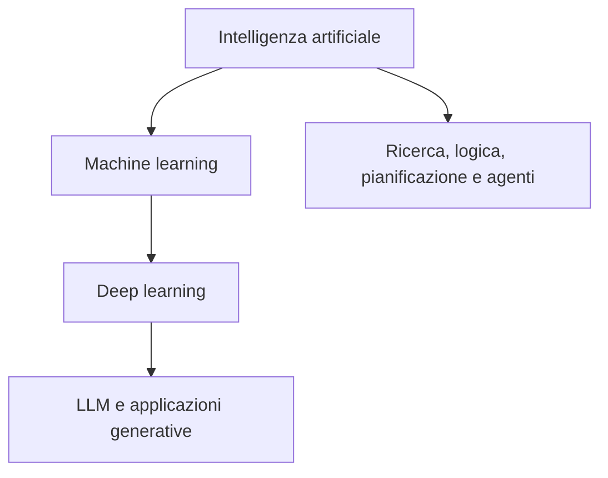
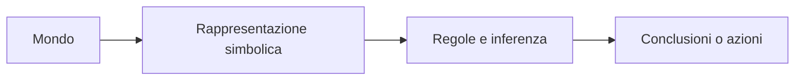
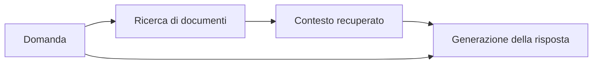
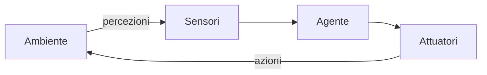
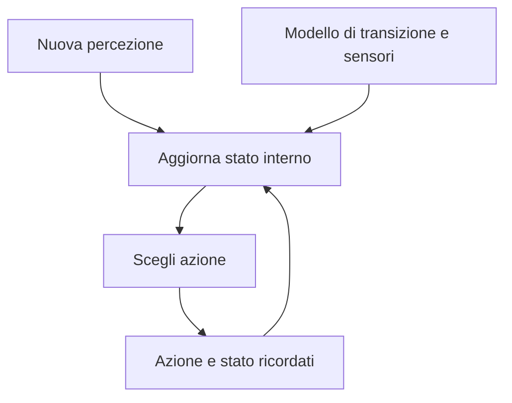
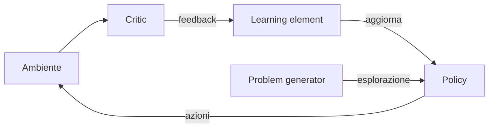

# 23/9
## 1. Che cosa studia l'IA

L'intelligenza artificiale (IA) studia come costruire sistemi capaci di comportamenti intelligenti. È un campo interdisciplinare: informatica, matematica, ingegneria e fisica contribuiscono con modelli e implementazioni; psicologia e neuroscienze studiano cognizione e decisioni; biologia suggerisce meccanismi adattivi; linguistica studia il linguaggio; filosofia pone domande sul significato di intelligenza e coscienza.

**IA, machine learning e deep learning non sono sinonimi.** Le slide presentano una relazione di inclusione:



Il corso esplora soprattutto metodi di IA che non richiedono necessariamente deep learning: ricerca di soluzioni, rappresentazione della conoscenza, pianificazione, ragionamento probabilistico, ottimizzazione evolutiva e vita artificiale. Le tecniche possono essere combinate in sistemi ibridi.

### Programma del corso

| Area | Argomenti indicati nelle slide |
| --- | --- |
| Ricerca | Ricerca non informata e informata; ricerca locale; problemi di soddisfacimento di vincoli; giochi |
| Conoscenza e decisioni | Agenti; inferenza proposizionale e del primo ordine; pianificazione |
| Incertezza | Reti bayesiane; modelli di Markov nascosti |
| Adattamento e interazione | Ottimizzazione evolutiva; novelty search e quality-diversity; vita artificiale; sistemi multiagente |

Il testo *Artificial Intelligence: A Modern Approach* (AIMA, parti I–IV) è facoltativo: secondo le slide basta il materiale del corso. Per la parte evolutiva sono segnalati *The Neuroevolution Book* e i riferimenti puntuali presenti nelle dispense.

## 2. Alcune tappe storiche

| Periodo | Evento e idea principale |
| --- | --- |
| 1943 | McCulloch e Pitts propongono un modello di neurone artificiale. |
| 1950 | Turing propone il suo celebre criterio comportamentale di confronto. |
| 1956 | Il workshop di Dartmouth contribuisce a stabilire il nome «artificial intelligence»; *Logic Theorist* di Newell e Simon è un programma per dimostrare teoremi. |
| 1973 | Il rapporto Lighthill contribuisce a una fase di ridimensionamento della ricerca britannica, spesso associata a un «inverno dell'IA». |
| Anni 1980 | I sistemi esperti applicano conoscenza specifica di dominio; il progetto Cyc (1984) tenta di codificare il senso comune. |
| 1997 | Deep Blue batte Garry Kasparov in una sfida a scacchi. |
| 2012 | AlexNet vince ImageNet: crescita d'interesse per il deep learning. |
| 2016–2018 | AlphaGo (2016), architettura Transformer (2017), AlphaFold (indicato nelle slide nel 2018). |
| Anni 2020 | Modelli GPT, modelli multimodali e sistemi di IA agentica. |

La storia alterna approcci basati su simboli, conoscenza esplicita, ricerca e apprendimento statistico. Non bisogna leggere la tabella come una successione in cui una tecnica elimina automaticamente le precedenti.

## 3. IA simbolica

L'**IA simbolica** rappresenta conoscenza mediante elementi interpretabili (simboli) e regole che li manipolano. Per esempio, si possono rappresentare fatti come `Gatto(Felix)` e regole generali come `Gatto(x) → Animale(x)`. Una procedura d'inferenza deriva nuovi fatti a partire da queste rappresentazioni.



**Punto forte:** la rappresentazione di alto livello può essere letta e ispezionata da una persona. **Problema:** in un mondo complesso occorre decidere quali simboli usare e come collegarli agli oggetti e ai fenomeni reali.

### Il problema del radicamento dei simboli

Il *symbol grounding problem* (Harnad, 1990) chiede da dove provenga il significato dei simboli impiegati da un sistema. Se `gatto` è solo una stringa associata ad altre stringhe, come viene collegata a un gatto nel mondo?

- **Simboli forniti dall'uomo:** il progettista sceglie vocabolario e significati operativi; questo sposta sul progettista il lavoro di interpretazione.
- **Rappresentazioni costruite dal sistema:** il sistema ricava regolarità da percezioni o dati e può costruire rappresentazioni meno direttamente leggibili.

La semiotica distingue il **significante** (segno) dal **significato** (ciò a cui il segno rinvia). Le slide accostano questo problema a riflessioni filosofiche e ai limiti dei sistemi formali: è utile distinguere tale analogia dal contenuto tecnico dei teoremi di incompletezza di Gödel, che non dimostrano da soli una tesi generale sul significato dei simboli nell'IA.

### Ipotesi del sistema fisico di simboli (PSSH)

L'ipotesi di Newell e Simon afferma che un sistema fisico di simboli possiede i mezzi **necessari e sufficienti** per l'azione intelligente. Un calcolatore manipola simboli attraverso processi fisici; l'ipotesi propone che questa capacità sia centrale per l'intelligenza.

> **Da distinguere:** una tesi sui mezzi dell'azione intelligente non è, da sola, una dimostrazione che un sistema provi esperienza soggettiva.

## 4. Intelligenza e coscienza

Le slide separano esplicitamente **comportamento intelligente** e **coscienza**. La seconda è spesso collegata all'esperienza soggettiva: «che cosa si prova» a essere un certo soggetto, secondo la domanda resa celebre da Nagel.

- Osservare il comportamento o ispezionare i componenti di un sistema potrebbe non risolvere la questione dell'esperienza soggettiva.
- Il materialismo collega i fenomeni mentali a processi fisici; il dualismo considera mente e corpo sostanze differenti.
- Hofstadter attribuisce particolare importanza all'organizzazione dei processi simbolici, anche indipendentemente dal substrato fisico.

Sono **posizioni e problemi filosofici aperti**, presentati nelle slide per ragionare sui confini delle definizioni di IA, non criteri operativi già risolti dal corso.

## 5. Rappresentazioni subsimboliche e modelli

La complessità del mondo rende difficile elencare a mano tutti i simboli, le categorie e le regole rilevanti. Le **rappresentazioni subsimboliche** usano configurazioni di valori numerici distribuiti, come le rappresentazioni interne delle reti neurali, per descrivere regolarità nei dati.

Le slide distinguono tre usi possibili di un modello:

| Modello | Domanda guida | Esempio illustrativo |
| --- | --- | --- |
| Descrittivo | «Com'è fatto il sistema?» | Organizzare le caratteristiche di una casa. |
| Predittivo | «Che cosa accadrà / quale valore osserverò?» | Stimare il prezzo di vendita da superficie, locali ed efficienza energetica. |
| Decisionale | «Che cosa conviene fare?» | Scegliere un'azione in base a obiettivi e conseguenze previste. |

Nel machine learning si apprende una mappatura dagli input agli output, schematizzabile come $f_\theta:X\to Y$, dove $\theta$ indica i parametri appresi. **Addestramento** significa stimare tali parametri dai dati; **inferenza** significa usare il modello addestrato su nuovi input. Le slide sottolineano il costo in dati e calcolo, particolarmente alto per modelli profondi e di grandi dimensioni; GPU e TPU sono esempi di acceleratori dedicati.

## 6. Sistemi ibridi e applicazioni

Il messaggio delle slide è integrare tecniche diverse quando utile. Un modello linguistico può lavorare con un sistema di recupero di documenti, una base di conoscenza o un meccanismo di pianificazione.

**Esempio di raccordo (RAG):**



Il *retrieval-augmented generation* è menzionato nelle slide come esempio motivante: il diagramma descrive il meccanismo generale, senza attribuire alle slide dettagli implementativi specifici. Le slide citano inoltre l'«AI scientist» e un possibile **Agentic Web**, in cui agenti autonomi reperiscono informazioni e interagiscono con servizi e altri sistemi.

## 7. Computazione evolutiva

L'**ottimizzazione evolutiva** si ispira a processi di variazione e selezione per cercare soluzioni. L'interesse non si limita alla massimizzazione di un obiettivo ordinario: le slide chiedono se si possano ricercare anche **novità** e **interesse**. Questo prepara i temi successivi di novelty search e quality-diversity.

## 8. Informazioni pratiche dalle slide

- **Prerequisiti:** algoritmi e complessità, basi di logica formale, elementi di probabilità e analisi.
- **Modalità 1:** esame orale sui temi del corso; voto finale uguale al voto dell'orale.
- **Modalità 2 (per frequentanti):** orale più progetto facoltativo. Se l'orale $X\geq18$, il voto finale è

$$
V=0{,}70X+0{,}30P,
$$

  dove $P$ è il voto del progetto. Se $X<18$, l'esame è insufficiente; in caso di insuccesso le slide consentono di conservare lo stesso progetto. Ai non frequentanti si applica la modalità 1.
- **Progetto:** proposta, realizzazione e presentazione finale; piccoli gruppi fino a tre persone, salvo progetti particolarmente impegnativi. Occorre chiarire i contributi dei membri; eventuali scostamenti dal piano iniziale vanno spiegati.
- **Materiale:** pagina Moodle indicata nelle slide: <https://elearning.di.unipi.it/course/view.php?id=1158>.

## 9. Concetti da saper spiegare

1. Perché $\text{deep learning}\subseteq\text{machine learning}\subseteq\text{IA}$ non esaurisce l'intero campo dell'IA?
2. Quali vantaggi e difficoltà presenta la rappresentazione simbolica?
3. Che cosa chiede il problema del radicamento dei simboli?
4. In che senso la PSSH riguarda l'azione intelligente, e perché non risolve automaticamente il problema della coscienza?
5. Come differiscono modelli descrittivi, predittivi e decisionali?
6. Perché costruire un sistema ibrido che combini recupero di informazioni e generazione?

**Prossima lezione:** agenti intelligenti, relazione con l'ambiente e architetture decisionali.


# 24/9

> **Fonte:** Andrea Cossu, *Artificial Intelligence Fundamentals — Design of Intelligent Agents*, slide 1–33. È disponibile anche la registrazione «AIF Lecture 2» del 24 settembre 2026, ma non contiene sottotitoli e non è stata trascritta: questi appunti seguono le slide. Le formule di raccordo e gli esempi aggiunti sono segnalati come elaborazioni didattiche.

## 1. Agente, ambiente, percezioni e azioni

Un **agente** è un sistema che percepisce l'ambiente mediante **sensori** e può modificarlo mediante **attuatori**. A ogni istante riceve una percezione (*percept*) e sceglie un'azione.



La **funzione agente**, o *policy*, associa la storia delle percezioni a un'azione:

$$
f:P^*\longrightarrow A.
$$

Qui $P$ è l'insieme delle possibili percezioni, $P^*$ l'insieme delle sequenze finite di percezioni e $A$ l'insieme delle azioni. Scrivere $f(p_t)$ invece di $f(p_1,\ldots,p_t)$ descrive un caso più ristretto: un agente che si basa soltanto sulla percezione corrente. La funzione può essere implementata in un dispositivo fisico oppure simulata.

> **Distinzione:** lo stato effettivo dell'ambiente non coincide necessariamente con ciò che l'agente percepisce. I sensori possono rivelarne solo una parte.

## 2. Esempio: il mondo dell'aspirapolvere

L'agente si trova in una delle due stanze, $A$ o $B$. Può eseguire

$$
\mathcal A=\{\mathrm{Left},\mathrm{Right},\mathrm{Suck},\mathrm{NoOp}\}.
$$

Una percezione semplice è la coppia $(x_t,s_t)$, dove $x_t\in\{A,B\}$ è la posizione e $s_t\in\{\text{clean},\text{dirty}\}$ è lo stato osservato della stanza corrente. L'obiettivo è pulire l'ambiente, quindi conoscere solo lo stato della stanza corrente potrebbe non bastare per sapere se *tutto* è pulito.

La funzione riflessa presentata nelle slide è:

```text
ReflexVacuumAgent(posizione, stato):
    se stato = dirty: restituisci Suck
    altrimenti se posizione = A: restituisci Right
    altrimenti: restituisci Left
```

| Percezione corrente | Azione |
| --- | --- |
| $(A,\text{dirty})$ oppure $(B,\text{dirty})$ | `Suck` |
| $(A,\text{clean})$ | `Right` |
| $(B,\text{clean})$ | `Left` |

L'agente raggiunge e pulisce le stanze nel modello semplice, ma **continua a spostarsi quando entrambe sono pulite**, perché non tiene memoria e le regole non prevedono `NoOp` in questa situazione. Se i movimenti hanno un costo, una policy più adatta richiede altre informazioni o uno stato interno.

## 3. Razionalità e misura delle prestazioni

Un agente **razionale** sceglie, per ogni storia di percezioni, l'azione che *ci si aspetta* massimizzi la misura delle prestazioni, date le informazioni percepite e la conoscenza incorporata nell'agente.

Una formalizzazione didattica della definizione è:

$$
a_t^*\in\operatorname*{arg\,max}_{a\in A}
\mathbb E\!\left[M\mid p_{1:t},K,a\right],
$$

dove $M$ è la prestazione risultante, $p_{1:t}$ la storia osservata e $K$ la conoscenza disponibile. La scelta dipende da **ciò che è noto al momento**, non da un accesso privilegiato allo stato vero o al futuro.

| La razionalità **non implica** | Perché |
| --- | --- |
| Onniscienza | Le percezioni potrebbero non contenere informazioni rilevanti. |
| Chiaroveggenza | Le percezioni future non sono già disponibili. |
| Successo garantito | Le azioni possono avere esiti incerti o diversi da quelli previsti. |

La valutazione è **consequenzialista**: conta l'effetto delle azioni sull'ambiente. È perciò cruciale scegliere una misura delle prestazioni adeguata. Per esempio, «grammi di sporco raccolti in un'ora» potrebbe incentivare comportamenti che accumulano sporco invece di mantenere pulite le stanze. È un esempio di *Goodhart's law*: quando una metrica diventa un bersaglio da massimizzare, può perdere la capacità di rappresentare lo scopo desiderato.

In ambienti statici, completamente osservabili e prevedibili una policy fissa può funzionare; quando cambiano le condizioni, può diventare fragile. Le slide usano il comportamento ripetitivo della vespa *Sphex* come esempio di schema d'azione che prosegue senza adattarsi a un'interferenza esterna.

## 4. PEAS: descrivere il compito prima di progettare l'agente

La sigla **PEAS** specifica quattro aspetti del problema:

| Lettera | Termine | Domanda |
| --- | --- | --- |
| **P** | *Performance measure* | Come valutiamo l'esito del comportamento? |
| **E** | *Environment* | In quale ambiente opera l'agente? |
| **A** | *Actuators* | Con quali azioni può intervenire? |
| **S** | *Sensors* | Quali dati può osservare? |

**Esempio delle slide: taxi autonomo.**

| Componente | Specifica esemplificativa |
| --- | --- |
| Prestazione | Sicurezza, arrivo a destinazione, rispetto della legge, comfort, profitti. |
| Ambiente | Strade, autostrade, traffico, pedoni, condizioni atmosferiche. |
| Attuatori | Sterzo, acceleratore, freno, clacson, altoparlante e display. |
| Sensori | Telecamere, accelerometri, indicatori del veicolo, sensori del motore, GPS. |

Un ambiente più ristretto rende generalmente più semplice progettare l'agente. Nel linguaggio delle slide l'**architettura** comprende sensori e attuatori; l'agente combina l'architettura con la funzione che decide le azioni.

## 5. Come classificare gli ambienti

| Dimensione | Un estremo | L'altro estremo | Conseguenza progettuale |
| --- | --- | --- | --- |
| Osservabilità | Completamente osservabile: i sensori forniscono lo stato completo. | Parzialmente osservabile o non osservabile: dati incompleti, sensori difettosi o assenti. | Può servire una stima interna dello stato. |
| Transizioni | Deterministico: stato e azione individuano un solo stato successivo. | Stocastico / non deterministico: sono possibili più esiti. | Occorre considerare incertezza ed esiti alternativi. |
| Rappresentazione | Discreto: valori separati per stati, tempi, percezioni e azioni. | Continuo: almeno alcune grandezze variano continuamente. | Cambiano rappresentazioni e algoritmi adatti. |
| Partecipanti | Agente singolo. | Multiagente: il risultato dipende anche dalle azioni di altri agenti. | Si devono modellare interazione e, talvolta, competizione. |
| Conoscenza delle regole | Ambiente noto: sono conosciute le dinamiche. | Ambiente ignoto: le regole devono essere apprese o esplorate. | «Noto» non significa «completamente osservabile». |

Una transizione deterministica ideale si può scrivere $s_{t+1}=T(s_t,a_t)$; con incertezza si può usare, come **formalizzazione didattica**, una distribuzione $P(s_{t+1}\mid s_t,a_t)$. Le slide notano che una osservabilità parziale può far *apparire* non deterministiche le transizioni rispetto all'informazione dell'agente: stati reali diversi ma indistinguibili possono produrre esiti diversi.

**Classificazione riportata dalle slide:**

| Ambiente | Completamente osservabile | Deterministico | Discreto | Agente singolo |
| --- | --- | --- | --- | --- |
| Sudoku | Sì | Sì | Sì | Sì |
| Backgammon | Sì | No | Sì | No |
| Taxi autonomo | No | No | No | No |

Nella sintesi finale delle slide compaiono anche le dimensioni **episodico** e **statico**, benché non siano sviluppate nelle pagine di classificazione: un ambiente episodico permette di trattare le decisioni come episodi sostanzialmente indipendenti; in uno statico l'ambiente non cambia durante la deliberazione dell'agente. Questa è una precisazione didattica, non una tabella aggiuntiva del docente.

## 6. Famiglie di agenti

| Tipo | Informazione usata | Come decide | Limite tipico |
| --- | --- | --- | --- |
| Agente a tabella | Intera storia di percezioni | Cerca l'azione in una tabella. | La tabella cresce enormemente. |
| Riflesso semplice | Percezione attuale | Regole condizione–azione. | Non ricostruisce informazioni non osservate ora. |
| Basato su modello | Percezione più stato interno | Aggiorna una stima del mondo, poi applica regole. | Dipende dalla qualità del modello. |
| Basato su obiettivi | Stato stimato, modello, obiettivi | Valuta azioni rispetto al raggiungimento di uno scopo. | Serve cercare o pianificare possibili sviluppi. |
| Basato sull'utilità | Stato stimato, esiti e utilità | Confronta il valore atteso di diversi esiti. | Serve assegnare utilità e stimare incertezza. |

Le categorie descrivono **quali componenti decisionali** sono disponibili; un meccanismo di apprendimento può essere aggiunto a ciascuna di esse.

### 6.1 Agente a tabella e agente riflesso semplice

L'agente a tabella specifica una risposta per ogni possibile storia percettiva. Se esistono $m$ percezioni possibili e consideriamo tutte le storie di lunghezza $t$, ci sono $m^t$ storie di quella lunghezza: è una **deduzione di conteggio**, utile a capire perché la tabella diventa impraticabile. Le slide contrappongono questa crescita esponenziale alla valutazione molto più economica delle regole di un agente riflesso semplice.

Un agente riflesso semplice applica regole del tipo:

$$
\text{se condizione sulla percezione corrente, allora esegui azione.}
$$

È efficace quando la percezione corrente fornisce tutto ciò che serve alla decisione; è fragile se due situazioni che richiedono azioni diverse producono la stessa osservazione attuale.

### 6.2 Agente basato su modello

Conserva uno **stato interno** che riassume le informazioni rilevanti della storia percettiva. Lo aggiorna con:

1. Un **modello di transizione**, che descrive come il mondo evolve e che effetto hanno le azioni.
2. Un **modello dei sensori**, che descrive come lo stato del mondo dà luogo alle percezioni.



In questo modo può operare in ambienti parzialmente osservabili, anche se la sua stima può rimanere approssimata.

### 6.3 Agente basato su obiettivi

Rappresenta un **obiettivo** separatamente dalle regole immediate: usa il modello per chiedersi quali stati potrebbero derivare da un'azione e sceglie un percorso verso l'obiettivo. Questa struttura rende possibile cambiare obiettivo senza riscrivere tutte le regole condizione–azione. Ricerca e pianificazione sono strumenti per confrontare le opzioni.

Raggiungere un obiettivo può richiedere di sacrificare una ricompensa immediata per un risultato migliore nel lungo periodo: l'azione migliore dipende dunque dall'orizzonte e dal criterio di valutazione.

### 6.4 Agente basato sull'utilità

Un obiettivo binario dice se uno stato è desiderato; una **funzione di utilità** $U(s)$ permette di confrontare anche stati intermedi e risultati diversi. Nelle situazioni incerte si può confrontare l'utilità attesa:

$$
\mathbb E[U\mid a]=\sum_i p_i\,u_i,
$$

dove $p_i$ è la probabilità dell'esito $i$ dopo l'azione $a$ e $u_i$ la sua utilità. Una possibile regola decisionale è $a^*\in\operatorname*{arg\,max}_{a\in A}\mathbb E[U\mid a]$. Questo permette di bilanciare esiti, preferenze e rischio quando le azioni non garantiscono un risultato unico.

> **Prestazione e utilità:** la misura delle prestazioni valuta esternamente l'esito dell'agente; l'utilità è un criterio interno che l'agente usa per scegliere. Devono essere coerenti, ma non sono automaticamente la stessa cosa.

### 6.5 Agente che apprende

L'apprendimento può cambiare la policy, il modello o altri componenti di un agente già descritto. Le slide distinguono:

| Componente | Ruolo |
| --- | --- |
| **Performance element / policy** | Sceglie le azioni dato il contesto disponibile. |
| **Critic** | Valuta il comportamento rispetto alla misura delle prestazioni e fornisce feedback. |
| **Learning element** | Usa il feedback per modificare la conoscenza o la policy. |
| **Problem generator** | Propone esperienze o azioni nuove per esplorare, evitando una scelta sempre orientata al beneficio immediato. |



L'idea chiave è che **apprendere non identifica da solo una particolare architettura**: anche un agente riflesso, basato su modello, obiettivi o utilità può apprendere.

## 7. Come rappresentare la conoscenza

Le slide propongono due assi concettuali diversi.

### Struttura dello stato

| Rappresentazione | Descrizione | Esempio didattico |
| --- | --- | --- |
| **Atomica** | Lo stato è trattato come un'unità senza struttura interna accessibile. | Identificatore di una configurazione. |
| **Fattorizzata** | Lo stato è composto da attributi o variabili. | $(\text{posizione},\text{carburante},\text{meteo})$. |
| **Strutturata** | Oggetti, proprietà e relazioni formano una struttura, spesso un grafo. | `Taxi` è sulla `Strada 1`, vicino al `Pedone 2`. |

L'espressività cresce passando da atomica a fattorizzata a strutturata, assieme ai costi di progettazione e ragionamento che possono aumentare secondo il problema.

### Distribuzione delle rappresentazioni

- **Localista:** concetti e posizioni di memoria sono associati in modo sostanzialmente uno a uno.
- **Distribuita:** più unità concorrono a rappresentare un concetto e una stessa unità partecipa a più concetti.

Questa dimensione riguarda *come* i concetti sono codificati nella memoria; la distinzione atomica/fattorizzata/strutturata riguarda *quanta struttura dello stato* è resa esplicita. Sono assi differenti.

## 8. Collegamenti utili per l'orale

1. **Dalla funzione agente alla razionalità:** $f:P^*\to A$ specifica che cosa farebbe l'agente; la misura delle prestazioni stabilisce come giudicare quelle scelte.
2. **Da PEAS alla scelta dell'architettura:** sensori e proprietà dell'ambiente determinano se bastano regole sulla percezione attuale o servono memoria, modelli e pianificazione.
3. **Dal riflesso al modello:** quando la stessa percezione corrisponde a stati reali diversi, conservare storia rilevante aiuta a distinguerli.
4. **Dall'obiettivo all'utilità:** sapere quali stati raggiungere non sempre basta a confrontare costo, probabilità e qualità dei diversi risultati.
5. **Apprendimento come componente trasversale:** il sistema può migliorare nel tempo indipendentemente dalla famiglia di agente scelta.

### Domande di autoverifica

- Qual è la differenza tra stato dell'ambiente, percezione e storia percettiva?
- L'agente aspirapolvere delle slide smette mai di muoversi quando entrambe le stanze sono pulite? Perché?
- Perché la razionalità non richiede che un'azione abbia sempre successo?
- Come descriveresti in PEAS un robot consegnatore in un edificio?
- Qual è la differenza tra ambiente parzialmente osservabile e ambiente ignoto?
- A che cosa servono rispettivamente modello di transizione e modello dei sensori?
- Quale vantaggio offre un obiettivo esplicito rispetto alle sole regole riflessive?
- In quali casi conviene confrontare utilità attese invece di controllare solo se l'obiettivo è raggiunto?

**Prossimi argomenti indicati nelle slide:** progetti e ricerca nello spazio degli stati.
