# 23/9
## 1. Che cosa studia l'IA

L'intelligenza artificiale (IA) studia come costruire sistemi capaci di comportamenti intelligenti. È un campo interdisciplinare: informatica, matematica, ingegneria e fisica contribuiscono con modelli e implementazioni; psicologia e neuroscienze studiano cognizione e decisioni; biologia suggerisce meccanismi adattivi; linguistica studia il linguaggio; filosofia pone domande sul significato di intelligenza e coscienza.

**IA, machine learning e deep learning non sono sinonimi.** Le slide presentano una relazione di inclusione:

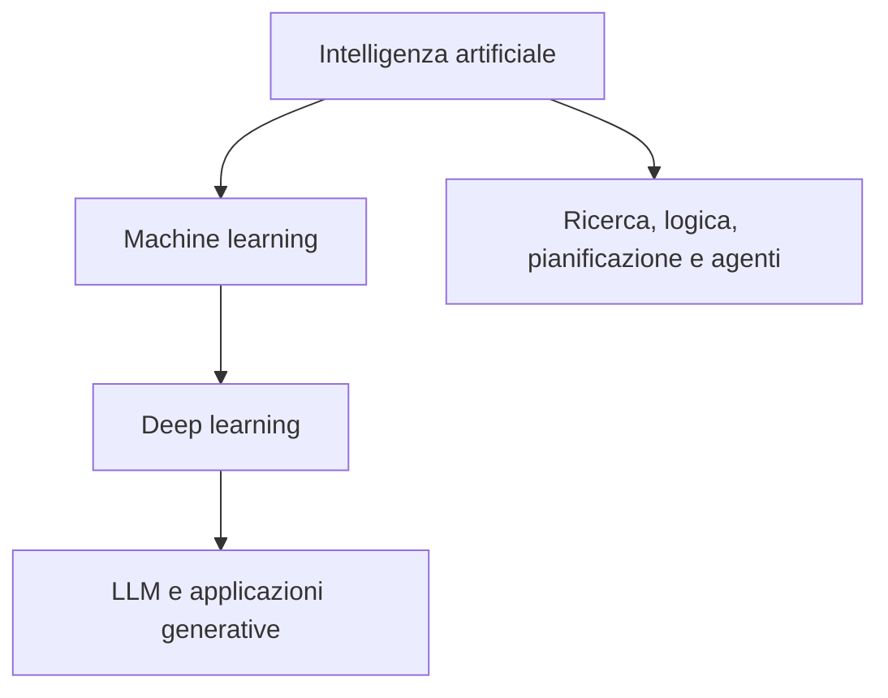
```mermaid
flowchart TB
  AI["Intelligenza artificiale"] --> ML["Machine learning"]
  ML --> DL["Deep learning"]
  DL --> LLM["LLM e applicazioni generative"]
  AI --> S["Ricerca, logica, pianificazione e agenti"]
```

Il corso esplora soprattutto metodi di IA che non richiedono necessariamente deep learning: ricerca di soluzioni, rappresentazione della conoscenza, pianificazione, ragionamento probabilistico, ottimizzazione evolutiva e vita artificiale. Le tecniche possono essere combinate in sistemi ibridi.

### Programma del corso

| Area | Argomenti indicati nelle slide |
| --- | --- |
| Ricerca | Ricerca non informata e informata; ricerca locale; problemi di soddisfacimento di vincoli; giochi |
| Conoscenza e decisioni | Agenti; inferenza proposizionale e del primo ordine; pianificazione |
| Incertezza | Reti bayesiane; modelli di Markov nascosti |
| Adattamento e interazione | Ottimizzazione evolutiva; novelty search e quality-diversity; vita artificiale; sistemi multiagente |

Il testo *Artificial Intelligence: A Modern Approach* (AIMA, parti I–IV) è facoltativo: secondo le slide basta il materiale del corso. Per la parte evolutiva sono segnalati *The Neuroevolution Book* e i riferimenti puntuali presenti nelle dispense.

## 2. Alcune tappe storiche

| Periodo | Evento e idea principale |
| --- | --- |
| 1943 | McCulloch e Pitts propongono un modello di neurone artificiale. |
| 1950 | Turing propone il suo celebre criterio comportamentale di confronto. |
| 1956 | Il workshop di Dartmouth contribuisce a stabilire il nome «artificial intelligence»; *Logic Theorist* di Newell e Simon è un programma per dimostrare teoremi. |
| 1973 | Il rapporto Lighthill contribuisce a una fase di ridimensionamento della ricerca britannica, spesso associata a un «inverno dell'IA». |
| Anni 1980 | I sistemi esperti applicano conoscenza specifica di dominio; il progetto Cyc (1984) tenta di codificare il senso comune. |
| 1997 | Deep Blue batte Garry Kasparov in una sfida a scacchi. |
| 2012 | AlexNet vince ImageNet: crescita d'interesse per il deep learning. |
| 2016–2018 | AlphaGo (2016), architettura Transformer (2017), AlphaFold (indicato nelle slide nel 2018). |
| Anni 2020 | Modelli GPT, modelli multimodali e sistemi di IA agentica. |

La storia alterna approcci basati su simboli, conoscenza esplicita, ricerca e apprendimento statistico. Non bisogna leggere la tabella come una successione in cui una tecnica elimina automaticamente le precedenti.

## 3. IA simbolica

L'**IA simbolica** rappresenta conoscenza mediante elementi interpretabili (simboli) e regole che li manipolano. Per esempio, si possono rappresentare fatti come `Gatto(Felix)` e regole generali come `Gatto(x) → Animale(x)`. Una procedura d'inferenza deriva nuovi fatti a partire da queste rappresentazioni.

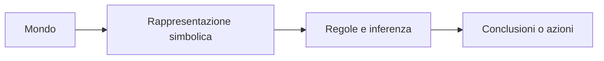
```mermaid
flowchart LR
  W["Mondo"] --> R["Rappresentazione simbolica"]
  R --> I["Regole e inferenza"]
  I --> C["Conclusioni o azioni"]
```

**Punto forte:** la rappresentazione di alto livello può essere letta e ispezionata da una persona. **Problema:** in un mondo complesso occorre decidere quali simboli usare e come collegarli agli oggetti e ai fenomeni reali.

### Il problema del radicamento dei simboli

Il *symbol grounding problem* (Harnad, 1990) chiede da dove provenga il significato dei simboli impiegati da un sistema. Se `gatto` è solo una stringa associata ad altre stringhe, come viene collegata a un gatto nel mondo?

- **Simboli forniti dall'uomo:** il progettista sceglie vocabolario e significati operativi; questo sposta sul progettista il lavoro di interpretazione.
- **Rappresentazioni costruite dal sistema:** il sistema ricava regolarità da percezioni o dati e può costruire rappresentazioni meno direttamente leggibili.

La semiotica distingue il **significante** (segno) dal **significato** (ciò a cui il segno rinvia). Le slide accostano questo problema a riflessioni filosofiche e ai limiti dei sistemi formali: è utile distinguere tale analogia dal contenuto tecnico dei teoremi di incompletezza di Gödel, che non dimostrano da soli una tesi generale sul significato dei simboli nell'IA.

### Ipotesi del sistema fisico di simboli (PSSH)

L'ipotesi di Newell e Simon afferma che un sistema fisico di simboli possiede i mezzi **necessari e sufficienti** per l'azione intelligente. Un calcolatore manipola simboli attraverso processi fisici; l'ipotesi propone che questa capacità sia centrale per l'intelligenza.

> **Da distinguere:** una tesi sui mezzi dell'azione intelligente non è, da sola, una dimostrazione che un sistema provi esperienza soggettiva.

## 4. Intelligenza e coscienza

Le slide separano esplicitamente **comportamento intelligente** e **coscienza**. La seconda è spesso collegata all'esperienza soggettiva: «che cosa si prova» a essere un certo soggetto, secondo la domanda resa celebre da Nagel.

- Osservare il comportamento o ispezionare i componenti di un sistema potrebbe non risolvere la questione dell'esperienza soggettiva.
- Il materialismo collega i fenomeni mentali a processi fisici; il dualismo considera mente e corpo sostanze differenti.
- Hofstadter attribuisce particolare importanza all'organizzazione dei processi simbolici, anche indipendentemente dal substrato fisico.

Sono **posizioni e problemi filosofici aperti**, presentati nelle slide per ragionare sui confini delle definizioni di IA, non criteri operativi già risolti dal corso.

## 5. Rappresentazioni subsimboliche e modelli

La complessità del mondo rende difficile elencare a mano tutti i simboli, le categorie e le regole rilevanti. Le **rappresentazioni subsimboliche** usano configurazioni di valori numerici distribuiti, come le rappresentazioni interne delle reti neurali, per descrivere regolarità nei dati.

Le slide distinguono tre usi possibili di un modello:

| Modello | Domanda guida | Esempio illustrativo |
| --- | --- | --- |
| Descrittivo | «Com'è fatto il sistema?» | Organizzare le caratteristiche di una casa. |
| Predittivo | «Che cosa accadrà / quale valore osserverò?» | Stimare il prezzo di vendita da superficie, locali ed efficienza energetica. |
| Decisionale | «Che cosa conviene fare?» | Scegliere un'azione in base a obiettivi e conseguenze previste. |

Nel machine learning si apprende una mappatura dagli input agli output, schematizzabile come $f_\theta:X\to Y$, dove $\theta$ indica i parametri appresi. **Addestramento** significa stimare tali parametri dai dati; **inferenza** significa usare il modello addestrato su nuovi input. Le slide sottolineano il costo in dati e calcolo, particolarmente alto per modelli profondi e di grandi dimensioni; GPU e TPU sono esempi di acceleratori dedicati.

## 6. Sistemi ibridi e applicazioni

Il messaggio delle slide è integrare tecniche diverse quando utile. Un modello linguistico può lavorare con un sistema di recupero di documenti, una base di conoscenza o un meccanismo di pianificazione.

**Esempio di raccordo (RAG):**

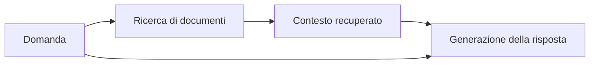
```mermaid
flowchart LR
  Q["Domanda"] --> R["Ricerca di documenti"]
  R --> D["Contesto recuperato"]
  D --> G["Generazione della risposta"]
  Q --> G
```

Il *retrieval-augmented generation* è menzionato nelle slide come esempio motivante: il diagramma descrive il meccanismo generale, senza attribuire alle slide dettagli implementativi specifici. Le slide citano inoltre l'«AI scientist» e un possibile **Agentic Web**, in cui agenti autonomi reperiscono informazioni e interagiscono con servizi e altri sistemi.

## 7. Computazione evolutiva

L'**ottimizzazione evolutiva** si ispira a processi di variazione e selezione per cercare soluzioni. L'interesse non si limita alla massimizzazione di un obiettivo ordinario: le slide chiedono se si possano ricercare anche **novità** e **interesse**. Questo prepara i temi successivi di novelty search e quality-diversity.

## 8. Informazioni pratiche dalle slide

- **Prerequisiti:** algoritmi e complessità, basi di logica formale, elementi di probabilità e analisi.
- **Modalità 1:** esame orale sui temi del corso; voto finale uguale al voto dell'orale.
- **Modalità 2 (per frequentanti):** orale più progetto facoltativo. Se l'orale $X\geq18$, il voto finale è

$$
V=0{,}70X+0{,}30P,
$$

  dove $P$ è il voto del progetto. Se $X<18$, l'esame è insufficiente; in caso di insuccesso le slide consentono di conservare lo stesso progetto. Ai non frequentanti si applica la modalità 1.
- **Progetto:** proposta, realizzazione e presentazione finale; piccoli gruppi fino a tre persone, salvo progetti particolarmente impegnativi. Occorre chiarire i contributi dei membri; eventuali scostamenti dal piano iniziale vanno spiegati.
- **Materiale:** pagina Moodle indicata nelle slide: <https://elearning.di.unipi.it/course/view.php?id=1158>.

## 9. Concetti da saper spiegare

1. Perché $\text{deep learning}\subseteq\text{machine learning}\subseteq\text{IA}$ non esaurisce l'intero campo dell'IA?
2. Quali vantaggi e difficoltà presenta la rappresentazione simbolica?
3. Che cosa chiede il problema del radicamento dei simboli?
4. In che senso la PSSH riguarda l'azione intelligente, e perché non risolve automaticamente il problema della coscienza?
5. Come differiscono modelli descrittivi, predittivi e decisionali?
6. Perché costruire un sistema ibrido che combini recupero di informazioni e generazione?

**Prossima lezione:** agenti intelligenti, relazione con l'ambiente e architetture decisionali.


# 24/9

> **Fonti:** Andrea Cossu, *Artificial Intelligence Fundamentals — Design of Intelligent Agents*, slide 1–33; trascrizione della lezione 2 del 24 settembre 2026 (`transcript (1).vtt`). La parte finale della registrazione introduce anche *3_Projects.pdf*. La trascrizione automatica presenta qualche parola deformata: i dettagli sono stati confrontati con le slide.

## 1. Agente, ambiente, percezioni e azioni

Un **agente** è un sistema che percepisce l'ambiente mediante **sensori** e può modificarlo mediante **attuatori**. A ogni istante riceve una percezione (*percept*) e sceglie un'azione.

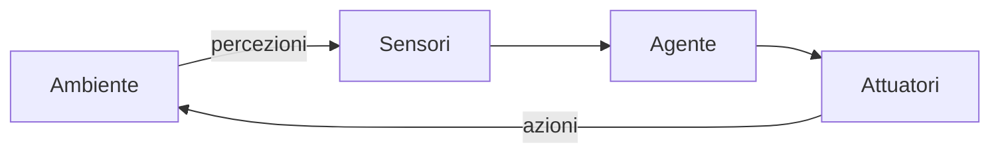
```mermaid
flowchart LR
  E["Ambiente"] -- "percezioni" --> S["Sensori"]
  S --> A["Agente"]
  A --> T["Attuatori"]
  T -- "azioni" --> E
```

La **funzione agente**, o *policy*, associa la storia delle percezioni a un'azione:

$$
f:P^*\longrightarrow A.
$$

Qui $P$ è l'insieme delle possibili percezioni, $P^*$ l'insieme delle sequenze finite di percezioni e $A$ l'insieme delle azioni. Scrivere $f(p_t)$ invece di $f(p_1,\ldots,p_t)$ descrive un caso più ristretto: un agente che si basa soltanto sulla percezione corrente. La funzione può essere implementata in un dispositivo fisico oppure simulata.

> **Distinzione:** lo stato effettivo dell'ambiente non coincide necessariamente con ciò che l'agente percepisce. I sensori possono rivelarne solo una parte.

## 2. Esempio: il mondo dell'aspirapolvere

L'agente si trova in una delle due stanze, $A$ o $B$. Può eseguire

$$
\mathcal A=\{\mathrm{Left},\mathrm{Right},\mathrm{Suck},\mathrm{NoOp}\}.
$$

Una percezione semplice è la coppia $(x_t,s_t)$, dove $x_t\in\{A,B\}$ è la posizione e $s_t\in\{\text{clean},\text{dirty}\}$ è lo stato osservato della stanza corrente. L'obiettivo è pulire l'ambiente, quindi conoscere solo lo stato della stanza corrente potrebbe non bastare per sapere se *tutto* è pulito.

La funzione riflessa presentata nelle slide è:

```text
ReflexVacuumAgent(posizione, stato):
    se stato = dirty: restituisci Suck
    altrimenti se posizione = A: restituisci Right
    altrimenti: restituisci Left
```

| Percezione corrente | Azione |
| --- | --- |
| $(A,\text{dirty})$ oppure $(B,\text{dirty})$ | `Suck` |
| $(A,\text{clean})$ | `Right` |
| $(B,\text{clean})$ | `Left` |

L'agente raggiunge e pulisce le stanze nel modello semplice, ma **continua a spostarsi quando entrambe sono pulite**, perché non tiene memoria e le regole non prevedono `NoOp` in questa situazione. Se i movimenti hanno un costo, una policy più adatta richiede altre informazioni o uno stato interno.

Nella spiegazione orale (circa 11–16 min) il docente confronta la tabella delle **intere storie percettive**, potenzialmente infinita se il tempo non è limitato, con la regola sintetica qui sopra. Una tabella piccola può comunque essere una buona *baseline* se il dominio è davvero piccolo e si conosce l'azione corretta per ogni caso. Le regole riflessive comprimono la tabella **per questo specifico comportamento**, che ignora il passato: non ogni possibile funzione $f:P^*\to A$ può essere ridotta a regole sulla sola percezione corrente.

## 3. Razionalità e misura delle prestazioni

Un agente **razionale** sceglie, per ogni storia di percezioni, l'azione che *ci si aspetta* massimizzi la misura delle prestazioni, date le informazioni percepite e la conoscenza incorporata nell'agente.

Una formalizzazione didattica della definizione è:

$$
a_t^*\in\operatorname*{arg\,max}_{a\in A}
\mathbb E\!\left[M\mid p_{1:t},K,a\right],
$$

dove $M$ è la prestazione risultante, $p_{1:t}$ la storia osservata e $K$ la conoscenza disponibile. La scelta dipende da **ciò che è noto al momento**, non da un accesso privilegiato allo stato vero o al futuro.

| La razionalità **non implica** | Perché |
| --- | --- |
| Onniscienza | Le percezioni potrebbero non contenere informazioni rilevanti. |
| Chiaroveggenza | Le percezioni future non sono già disponibili. |
| Successo garantito | Le azioni possono avere esiti incerti o diversi da quelli previsti. |

La valutazione è **consequenzialista**: conta l'effetto delle azioni sull'ambiente. È perciò cruciale scegliere una misura delle prestazioni adeguata. Per esempio, «grammi di sporco raccolti in un'ora» potrebbe incentivare comportamenti che accumulano sporco invece di mantenere pulite le stanze. È un esempio di *Goodhart's law*: quando una metrica diventa un bersaglio da massimizzare, può perdere la capacità di rappresentare lo scopo desiderato.

**Esempio concreto della registrazione (circa 27–32 min):** si potrebbe premiare il numero di istanti in cui entrambe le stanze restano pulite, eventualmente aggiungendo il tempo necessario a ripulirle. Se invece si premiano solo i grammi raccolti, un robot potrebbe aspirare e poi riversare lo stesso sporco, ripetendo l'operazione: punteggio alto, casa non pulita. Il docente invita a osservare il comportamento degli agenti migliori oltre ai grafici della metrica, perché anche errori dell'ambiente simulato possono diventare scorciatoie sfruttate dall'ottimizzazione.

In ambienti statici, completamente osservabili e prevedibili una policy fissa può funzionare; quando cambiano le condizioni, può diventare fragile. Le slide usano il comportamento ripetitivo della vespa *Sphex* come esempio di schema d'azione che prosegue senza adattarsi a un'interferenza esterna.

## 4. PEAS: descrivere il compito prima di progettare l'agente

La sigla **PEAS** specifica quattro aspetti del problema:

| Lettera | Termine | Domanda |
| --- | --- | --- |
| **P** | *Performance measure* | Come valutiamo l'esito del comportamento? |
| **E** | *Environment* | In quale ambiente opera l'agente? |
| **A** | *Actuators* | Con quali azioni può intervenire? |
| **S** | *Sensors* | Quali dati può osservare? |

**Esempio delle slide: taxi autonomo.**

| Componente | Specifica esemplificativa |
| --- | --- |
| Prestazione | Sicurezza, arrivo a destinazione, rispetto della legge, comfort, profitti. |
| Ambiente | Strade, autostrade, traffico, pedoni, condizioni atmosferiche. |
| Attuatori | Sterzo, acceleratore, freno, clacson, altoparlante e display. |
| Sensori | Telecamere, accelerometri, indicatori del veicolo, sensori del motore, GPS. |

Un ambiente più ristretto rende generalmente più semplice progettare l'agente. Nel linguaggio delle slide l'**architettura** comprende sensori e attuatori; l'agente combina l'architettura con la funzione che decide le azioni.

## 5. Come classificare gli ambienti

| Dimensione | Un estremo | L'altro estremo | Conseguenza progettuale |
| --- | --- | --- | --- |
| Osservabilità | Completamente osservabile: i sensori forniscono lo stato completo. | Parzialmente osservabile o non osservabile: dati incompleti, sensori difettosi o assenti. | Può servire una stima interna dello stato. |
| Transizioni | Deterministico: stato e azione individuano un solo stato successivo. | Stocastico / non deterministico: sono possibili più esiti. | Occorre considerare incertezza ed esiti alternativi. |
| Rappresentazione | Discreto: valori separati per stati, tempi, percezioni e azioni. | Continuo: almeno alcune grandezze variano continuamente. | Cambiano rappresentazioni e algoritmi adatti. |
| Partecipanti | Agente singolo. | Multiagente: il risultato dipende anche dalle azioni di altri agenti. | Si devono modellare interazione e, talvolta, competizione. |
| Conoscenza delle regole | Ambiente noto: sono conosciute le dinamiche. | Ambiente ignoto: le regole devono essere apprese o esplorate. | «Noto» non significa «completamente osservabile». |

Una transizione deterministica ideale si può scrivere $s_{t+1}=T(s_t,a_t)$; con incertezza si può usare, come **formalizzazione didattica**, una distribuzione $P(s_{t+1}\mid s_t,a_t)$. Le slide notano che una osservabilità parziale può far *apparire* non deterministiche le transizioni rispetto all'informazione dell'agente: stati reali diversi ma indistinguibili possono produrre esiti diversi.

**Classificazione riportata dalle slide:**

| Ambiente | Completamente osservabile | Deterministico | Discreto | Agente singolo |
| --- | --- | --- | --- | --- |
| Sudoku | Sì | Sì | Sì | Sì |
| Backgammon | Sì | No | Sì | No |
| Taxi autonomo | No | No | No | No |

Nella sintesi finale delle slide compaiono anche le dimensioni **episodico** e **statico**, benché non siano sviluppate nelle pagine di classificazione: un ambiente episodico permette di trattare le decisioni come episodi sostanzialmente indipendenti; in uno statico l'ambiente non cambia durante la deliberazione dell'agente. Questa è una precisazione didattica, non una tabella aggiuntiva del docente.

## 6. Famiglie di agenti

| Tipo | Informazione usata | Come decide | Limite tipico |
| --- | --- | --- | --- |
| Agente a tabella | Intera storia di percezioni | Cerca l'azione in una tabella. | La tabella cresce enormemente. |
| Riflesso semplice | Percezione attuale | Regole condizione–azione. | Non ricostruisce informazioni non osservate ora. |
| Basato su modello | Percezione più stato interno | Aggiorna una stima del mondo, poi applica regole. | Dipende dalla qualità del modello. |
| Basato su obiettivi | Stato stimato, modello, obiettivi | Valuta azioni rispetto al raggiungimento di uno scopo. | Serve cercare o pianificare possibili sviluppi. |
| Basato sull'utilità | Stato stimato, esiti e utilità | Confronta il valore atteso di diversi esiti. | Serve assegnare utilità e stimare incertezza. |

Le categorie descrivono **quali componenti decisionali** sono disponibili; un meccanismo di apprendimento può essere aggiunto a ciascuna di esse.

### 6.1 Agente a tabella e agente riflesso semplice

L'agente a tabella specifica una risposta per ogni possibile storia percettiva. Se esistono $m$ percezioni possibili e consideriamo tutte le storie di lunghezza $t$, ci sono $m^t$ storie di quella lunghezza: è una **deduzione di conteggio**, utile a capire perché la tabella diventa impraticabile. Le slide contrappongono questa crescita esponenziale alla valutazione molto più economica delle regole di un agente riflesso semplice.

Un agente riflesso semplice applica regole del tipo:

$$
\text{se condizione sulla percezione corrente, allora esegui azione.}
$$

È efficace quando la percezione corrente fornisce tutto ciò che serve alla decisione; è fragile se due situazioni che richiedono azioni diverse producono la stessa osservazione attuale.

### 6.2 Agente basato su modello

Conserva uno **stato interno** che riassume le informazioni rilevanti della storia percettiva. Lo aggiorna con:

1. Un **modello di transizione**, che descrive come il mondo evolve e che effetto hanno le azioni.
2. Un **modello dei sensori**, che descrive come lo stato del mondo dà luogo alle percezioni.

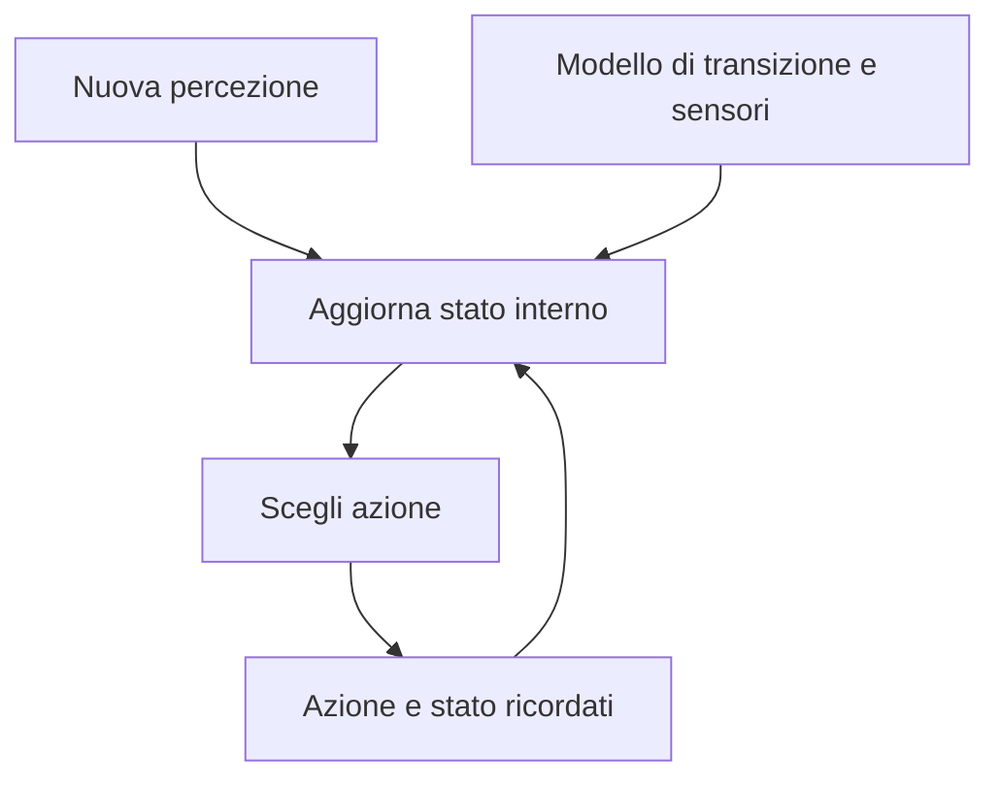
```mermaid
flowchart TB
  P["Nuova percezione"] --> U["Aggiorna stato interno"]
  M["Modello di transizione e sensori"] --> U
  U --> D["Scegli azione"]
  D --> H["Azione e stato ricordati"]
  H --> U
```

In questo modo può operare in ambienti parzialmente osservabili, anche se la sua stima può rimanere approssimata.

### 6.3 Agente basato su obiettivi

Rappresenta un **obiettivo** separatamente dalle regole immediate: usa il modello per chiedersi quali stati potrebbero derivare da un'azione e sceglie un percorso verso l'obiettivo. Questa struttura rende possibile cambiare obiettivo senza riscrivere tutte le regole condizione–azione. Ricerca e pianificazione sono strumenti per confrontare le opzioni.

Raggiungere un obiettivo può richiedere di sacrificare una ricompensa immediata per un risultato migliore nel lungo periodo: l'azione migliore dipende dunque dall'orizzonte e dal criterio di valutazione.

### 6.4 Agente basato sull'utilità

Un obiettivo binario dice se uno stato è desiderato; una **funzione di utilità** $U(s)$ permette di confrontare anche stati intermedi e risultati diversi. Nelle situazioni incerte si può confrontare l'utilità attesa:

$$
\mathbb E[U\mid a]=\sum_i p_i\,u_i,
$$

dove $p_i$ è la probabilità dell'esito $i$ dopo l'azione $a$ e $u_i$ la sua utilità. Una possibile regola decisionale è $a^*\in\operatorname*{arg\,max}_{a\in A}\mathbb E[U\mid a]$. Questo permette di bilanciare esiti, preferenze e rischio quando le azioni non garantiscono un risultato unico.

> **Prestazione e utilità:** la misura delle prestazioni valuta esternamente l'esito dell'agente; l'utilità è un criterio interno che l'agente usa per scegliere. Devono essere coerenti, ma non sono automaticamente la stessa cosa.

### 6.5 Agente che apprende

L'apprendimento può cambiare la policy, il modello o altri componenti di un agente già descritto. Le slide distinguono:

| Componente | Ruolo |
| --- | --- |
| **Performance element / policy** | Sceglie le azioni dato il contesto disponibile. |
| **Critic** | Valuta il comportamento rispetto alla misura delle prestazioni e fornisce feedback. |
| **Learning element** | Usa il feedback per modificare la conoscenza o la policy. |
| **Problem generator** | Propone esperienze o azioni nuove per esplorare, evitando una scelta sempre orientata al beneficio immediato. |

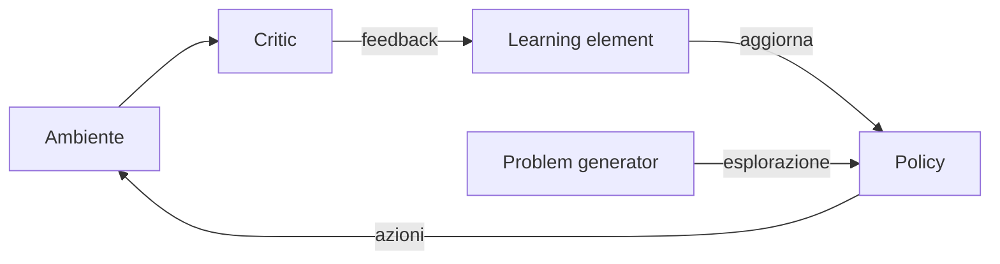
```mermaid
flowchart LR
  E["Ambiente"] --> C["Critic"]
  C -- "feedback" --> L["Learning element"]
  L -- "aggiorna" --> P["Policy"]
  G["Problem generator"] -- "esplorazione" --> P
  P -- "azioni" --> E
```

L'idea chiave è che **apprendere non identifica da solo una particolare architettura**: anche un agente riflesso, basato su modello, obiettivi o utilità può apprendere.

## 7. Come rappresentare la conoscenza

Le slide propongono due assi concettuali diversi.

### Struttura dello stato

| Rappresentazione | Descrizione | Esempio didattico |
| --- | --- | --- |
| **Atomica** | Lo stato è trattato come un'unità senza struttura interna accessibile. | Identificatore di una configurazione. |
| **Fattorizzata** | Lo stato è composto da attributi o variabili. | $(\text{posizione},\text{carburante},\text{meteo})$. |
| **Strutturata** | Oggetti, proprietà e relazioni formano una struttura, spesso un grafo. | `Taxi` è sulla `Strada 1`, vicino al `Pedone 2`. |

L'espressività cresce passando da atomica a fattorizzata a strutturata, assieme ai costi di progettazione e ragionamento che possono aumentare secondo il problema.

### Distribuzione delle rappresentazioni

- **Localista:** concetti e posizioni di memoria sono associati in modo sostanzialmente uno a uno.
- **Distribuita:** più unità concorrono a rappresentare un concetto e una stessa unità partecipa a più concetti.

Nella registrazione (circa 65–66 min) viene evidenziato un compromesso: la codifica distribuita può sopportare la perdita di una singola unità grazie alla ridondanza, ma richiede più risorse per memorizzare e gestire una rappresentazione.

Questa dimensione riguarda *come* i concetti sono codificati nella memoria; la distinzione atomica/fattorizzata/strutturata riguarda *quanta struttura dello stato* è resa esplicita. Sono assi differenti.

## 8. Collegamenti utili per l'orale

1. **Dalla funzione agente alla razionalità:** $f:P^*\to A$ specifica che cosa farebbe l'agente; la misura delle prestazioni stabilisce come giudicare quelle scelte.
2. **Da PEAS alla scelta dell'architettura:** sensori e proprietà dell'ambiente determinano se bastano regole sulla percezione attuale o servono memoria, modelli e pianificazione.
3. **Dal riflesso al modello:** quando la stessa percezione corrisponde a stati reali diversi, conservare storia rilevante aiuta a distinguerli.
4. **Dall'obiettivo all'utilità:** sapere quali stati raggiungere non sempre basta a confrontare costo, probabilità e qualità dei diversi risultati.
5. **Apprendimento come componente trasversale:** il sistema può migliorare nel tempo indipendentemente dalla famiglia di agente scelta.

### Domande di autoverifica

- Qual è la differenza tra stato dell'ambiente, percezione e storia percettiva?
- L'agente aspirapolvere delle slide smette mai di muoversi quando entrambe le stanze sono pulite? Perché?
- Perché la razionalità non richiede che un'azione abbia sempre successo?
- Come descriveresti in PEAS un robot consegnatore in un edificio?
- Qual è la differenza tra ambiente parzialmente osservabile e ambiente ignoto?
- A che cosa servono rispettivamente modello di transizione e modello dei sensori?
- Quale vantaggio offre un obiettivo esplicito rispetto alle sole regole riflessive?
- In quali casi conviene confrontare utilità attese invece di controllare solo se l'obiettivo è raggiunto?

## 9. Coda della lezione: avvio dei progetti (circa 67–84 min)

La registrazione prosegue oltre l'ultima slide sugli agenti e avvia la dispensa *Optional Project Roadmap*. Il progetto è facoltativo per i frequentanti. Il docente incoraggia a implementare e **valutare con cura poche tecniche del corso**: nel parlato preferisce due o tre metodi ben compresi e confrontati a molti algoritmi provati superficialmente. I gruppi sono di norma di una, due o tre persone, con un referente; il lavoro deve essere riproducibile, facilmente eseguibile e corredato di una relazione concisa (indicativamente 5–7 pagine, esclusi appendice e riferimenti).

Se il voto dell'orale $X$ è almeno 18, il progetto pesa il 30% e l'orale il 70%: $V=0{,}7X+0{,}3P$. In caso di orale insufficiente, la valutazione del progetto resta valida per una sessione successiva. Nella registrazione il docente parla di una proposta informale entro il **16 ottobre** e di materiale finale almeno **sette giorni prima della presentazione**. Le slide indicano l'invio via email con oggetto `[AIFProject]`, mentre nel parlato il docente prospetta un modulo o una consegna su Moodle: per il *canale effettivo* fa fede l'avviso operativo del corso, perché le due fonti differiscono.

Come primo spunto viene introdotta **Gymnasium**, raccolta di ambienti con una semplice interfaccia Python che permette di osservare lo stato, scegliere un'azione e misurarne gli esiti; la lezione 3 riprende gli esempi di progetto e passa poi alla ricerca.


# 30/9


> **Fonti:** Andrea Cossu, *Artificial Intelligence Fundamentals — (Optional) Project Roadmap* (`3_Projects.pdf`, slide 1–22), e trascrizione della lezione 3 (`transcript.vtt`, circa 95 minuti). Le slide allegate riguardano il progetto; la seconda parte della registrazione (circa 35–95 min) introduce la ricerca e la breadth-first search, senza la relativa dispensa tra gli allegati. Le formule e gli schemi formalizzano le spiegazioni orali. La trascrizione automatica contiene errori e cambia talvolta lingua: i nomi tecnici sono normalizzati quando sono riconoscibili.

## 1. Progetto facoltativo: scopo e valutazione

Il progetto permette di applicare le metodologie del corso a un problema scelto dal gruppo: implementare approcci, costruire esperimenti, ricevere feedback e comunicare risultati. È **facoltativo** e, secondo le slide, la modalità con progetto è riservata ai frequentanti; per i non frequentanti resta l'orale sui temi del corso.

Sia $X$ il voto dell'orale e $P$ il voto del progetto. Se l'orale è sufficiente,

$$
X\geq 18\quad\Longrightarrow\quad V=0{,}70X+0{,}30P.
$$

Se $X<18$, l'esame è insufficiente, ma la valutazione del progetto può essere conservata per una sessione successiva. Prima della consegna ufficiale del progetto è possibile scegliere la modalità con solo orale; dopo la consegna le slide escludono il ritorno alla modalità 1.

### Gruppo, implementazione e documentazione

| Aspetto | Indicazioni del corso |
| --- | --- |
| Gruppo | Da 1 a 3 studenti, con un referente; gruppi più grandi per progetti davvero impegnativi. Complessità proporzionata al numero di membri e contributi distinguibili. |
| Tema | Scelta libera, anche diversa dagli esempi; è necessaria almeno una metodologia studiata nel corso. |
| Codice | Il docente chiede un progetto autocontenuto, scaricabile ed eseguibile facilmente; nelle slide è richiesto GitHub con tutti i membri nel progetto. |
| Relazione | Circa 5–7 pagine: introduzione, lavori correlati, metodologie, esperimenti/risultati e conclusione. Appendice e bibliografia fuori dal limite. |
| Presentazione | A dicembre, presentazione di gruppo o poster in base al numero di gruppi; le slide indicano 5–20 minuti. Tutti i membri devono contribuire. |
| Valutazione | Qualità della relazione, chiarezza della presentazione, comprensione del lavoro svolto e contributo individuale; il voto del singolo può differire da quello del gruppo. |

Nella registrazione il docente precisa che **non pretende la soluzione completa di un problema ambizioso**: conta l'accuratezza con cui si progettano esperimenti, si confrontano gli approcci e si interpretano anche risultati negativi. È preferibile studiare bene poche tecniche rispetto a elencarne molte con una sola misura finale.

### Scadenze e comunicazioni riportate nelle fonti

| Passaggio | Indicazione |
| --- | --- |
| Proposta informale | Entro il **16 ottobre 2026**: descrivere attività e «chi fa che cosa»; soggetta ad approvazione. |
| Materiale finale | Relazione PDF e presentazione PDF/PPTX, con link al codice nella relazione, **almeno sette giorni prima della presentazione**. |
| Contatto docente | `andrea.cossu@unipi.it`; nelle slide è richiesto `[AIFProject]` nell'oggetto delle email. |

**Canale di consegna da verificare negli avvisi Moodle:** le slide parlano di email del referente; nel parlato della lezione 2 il docente preannuncia un modulo e la consegna su Moodle. Queste istruzioni sono divergenti e possono essere state aggiornate. La proposta è distinta dalla relazione finale. Le slide propongono come modello facoltativo il template LaTeX NeurIPS 2025.

## 2. Idee progettuali discusse nelle slide e nella registrazione (0–35 min)

| Ambiente/idea | Compito possibile | Cosa valutare |
| --- | --- | --- |
| **Gymnasium** | Confrontare algoritmi di ricerca, pianificazione o ottimizzazione su ambienti diversi. | Risultati su più istanze, tempo, qualità e sensibilità ai parametri. |
| **NetHack** | Risolvere un sotto problema: percorsi sicuri, combattimento, inventario, riconoscimento delle stanze, rappresentazione dello stato, base di conoscenza. | Misure specifiche del sotto problema, senza pretendere di vincere tutto il gioco. |
| **BioMaker CA** | Modificare le regole locali di un mondo artificiale con cellule e crescita simile a piante. | Configurazioni iniziali, stabilità, sensibilità delle dinamiche alle regole. |
| **Particle Lenia** | Variare attrazione/repulsione fra particelle e osservare forme emergenti. | Attrattori, risposta a perturbazioni, dipendenza dai parametri iniziali. |
| **ARC-AGI 3** | Costruire un agente per una scelta circoscritta di ambienti nuovi. | Capacità di adattarsi ai puzzle; distinguere generalizzazione da soluzioni codificate per un solo caso. |
| **Gioco delle mani** | Studiare algoritmi per giochi a turni su un piccolo spazio di stati. | Vittorie, sconfitte, cicli/patte e qualità delle mosse. |
| **IA ibrida** | Usare un modello generativo per proporre euristiche a un algoritmo classico, oppure confrontare la simulazione testuale di A* con la sua esecuzione. | Correttezza, costo della soluzione, latenza e risorse computazionali. |

### NetHack come esempio di delimitazione del problema

Il gioco include esplorazione di livelli, nemici, oggetti e numerose azioni. Nella registrazione (circa 1–6 min) il docente suggerisce di selezionare **un sotto problema**. Per un agente di *pathfinding*, ad esempio, occorre definire una destinazione, gli ostacoli e la reazione ai mostri; si misurano passi, sopravvivenza e percentuale di obiettivi raggiunti. L'ambiente mette a disposizione un'interfaccia: non serve ricreare l'intero gioco.

### Sistemi di vita artificiale

In **BioMaker CA** lo stato è distribuito fra celle e ogni cella si aggiorna secondo regole locali basate sui vicini. La registrazione (circa 7–16 min) osserva che piccole modifiche delle regole, applicate a tutte le celle a ogni passo, possono produrre grandi differenze globali. In **Particle Lenia** si studiano invece insiemi di particelle con interazioni, spesso interpretabili come attrazione e repulsione, e configurazioni che persistono o emergono nel tempo (circa 17–21 min).

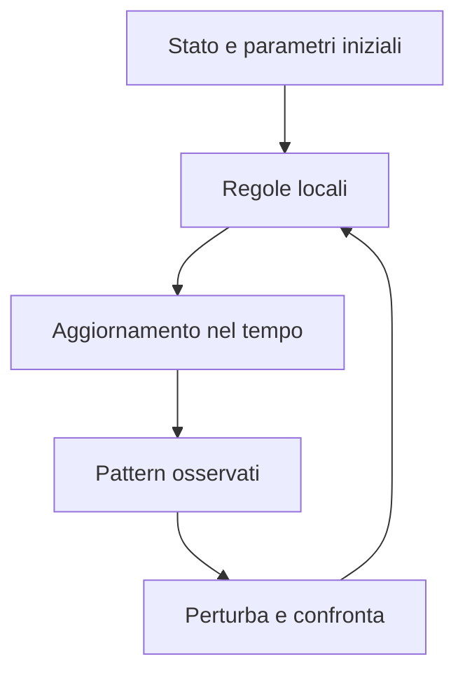
```mermaid
flowchart TB
  I["Stato e parametri iniziali"] --> R["Regole locali"]
  R --> U["Aggiornamento nel tempo"]
  U --> O["Pattern osservati"]
  O --> V["Perturba e confronta"]
  V --> R
```

Per un esperimento sensato conviene annotare condizioni iniziali, regole, metriche e ripetizioni. «Attrattore» nella spiegazione indica un comportamento che persiste nonostante gli aggiornamenti; può essere una configurazione fissa o una dinamica stabile, secondo il sistema esaminato.

### Giochi e approcci ibridi

Nel **gioco delle mani**, due giocatori partono con un dito su ciascuna mano; a turno una mano attacca una mano avversaria e il conteggio cambia secondo le regole delle slide, incluso il modulo cinque. Se entrambe le mani di un giocatore sono inattive, perde; è prevista una regola di suddivisione di una mano con due o quattro dita. Poiché il parlato abbrevia alcune varianti, in un progetto occorre **fissare con precisione le regole** prima di enumerare stati e mosse. Il docente ipotizza la presenza di cicli e posizioni di patta, senza fornirne una dimostrazione (circa 26–29 min).

Per gli **approcci ibridi** (circa 29–34 min), un esempio è chiedere a un modello generativo di produrre un'euristica $h(s)$ per guidare la ricerca, poi confrontarla con un'euristica progettata manualmente. Un'altra prova consiste nel chiedere al modello di simulare i passaggi di un algoritmo come A* senza eseguire codice: va controllata la correttezza *di ogni passaggio*, non solo la risposta finale. La valutazione comprende anche latenza e risorse necessarie.

## 3. Dalla progettazione dell'agente alla ricerca (circa 35–42 min)

Nella seconda parte della lezione il docente passa alla **ricerca nello spazio degli stati**. Un agente basato su obiettivi può calcolare prima una sequenza di azioni, usando un modello dell'ambiente, e poi eseguirla. L'aspetto difficile spesso è formulare correttamente il mondo come un problema di ricerca; gli algoritmi lavorano *sull'astrazione* così costruita.

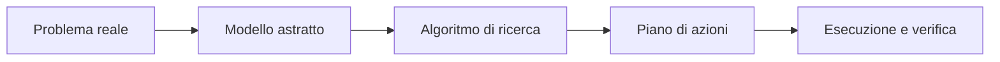
```mermaid
flowchart LR
  R["Problema reale"] --> M["Modello astratto"]
  M --> S["Algoritmo di ricerca"]
  S --> P["Piano di azioni"]
  P --> E["Esecuzione e verifica"]
```

La ricerca introdotta qui considera soprattutto ambienti **completamente osservabili, deterministici, a singolo agente e discreti**. Se il modello delle transizioni è corretto, un piano trovato nel modello conduce allo stato obiettivo quando viene eseguito; nel mondo reale va comunque verificata la corrispondenza tra modello e ambiente.

| Modalità | Funzionamento | Esito |
| --- | --- | --- |
| **Anello aperto / offline** | Calcolo l'intero piano prima di agire. | Adeguato quando l'esito delle azioni è sufficientemente prevedibile. |
| **Anello chiuso / online** | Eseguo un'azione, osservo l'esito, aggiorno la decisione. | Indispensabile quando una sequenza fissata in anticipo non è affidabile. |

Le due modalità descrivono **come usare le osservazioni durante l'esecuzione**. La ricerca può essere **non informata** (nessuna stima aggiuntiva di vicinanza all'obiettivo) o **informata** (usa un'euristica): il corso prosegue su entrambe.

## 4. Formalizzazione di un problema di ricerca (circa 42–53 min)

Un problema può essere schematizzato da

$$
\mathcal P=(S,s_0,A,\operatorname{Result},G,c),
$$

dove:

| Componente | Significato |
| --- | --- |
| $S$ | Spazio degli stati: rappresentazioni delle situazioni rilevanti. |
| $s_0\in S$ | Stato iniziale. |
| $A(s)$ | Azioni **ammissibili nello stato $s$**; non tutte le azioni globali sono sempre disponibili. |
| $\operatorname{Result}(s,a)$ | Stato successivo all'azione $a$ nello stato $s$; nel caso deterministico è una funzione. |
| $G(s)$ | Test che stabilisce se $s$ è uno stato obiettivo. |
| $c(s,a,s')$ | Costo di un passo che porta da $s$ a $s'$. |

Lo **spazio degli stati** può essere rappresentato come un grafo: i vertici sono gli stati e gli archi le transizioni dovute alle azioni. Nell'esempio delle città, uno stato può essere «sono ad Arad», le azioni possibili sono i collegamenti con città adiacenti, l'obiettivo è Bucarest e il costo può modellare chilometri, tempo o carburante. Il costo scelto cambia quale soluzione è considerata migliore.

Un **cammino soluzione** è una sequenza di azioni $\pi=(a_1,\ldots,a_k)$ che, a partire da $s_0$, termina in uno stato $s_k$ con $G(s_k)=\text{vero}$. Il costo complessivo è, per un modello additivo,

$$
C(\pi)=\sum_{i=1}^{k}c(s_{i-1},a_i,s_i).
$$

Una **soluzione ottima** minimizza $C(\pi)$ fra i cammini soluzione. Possono esserci più stati obiettivo e più soluzioni; il test $G$ può descriverli tutti senza elencarli. Il problema deve rappresentare abbastanza del mondo per rendere valide le azioni, ma non necessariamente ogni dettaglio fisico: nella spiegazione (circa 48–53 min) il docente insiste sulla scelta dello **stato astratto** e di una **funzione di costo** allineata con il compito reale.

## 5. Quando una sequenza fissa non basta (circa 53–60 min)

| Tipo di problema | Cosa sa l'agente | Forma della soluzione |
| --- | --- | --- |
| **A stato singolo** | Stato iniziale noto, ambiente osservabile e transizioni determinate. | Sequenza di azioni calcolata in anticipo. |
| **Senza sensori / conformante** | Non osserva lo stato effettivo, ma può ragionare su un insieme di stati possibili. | Una sequenza che raggiunga l'obiettivo da *tutti* gli stati ancora possibili, se esiste. |
| **Di contingenza** | Una transizione può avere più esiti o alcune proprietà sono osservate solo durante l'esecuzione. | Piano condizionale che sceglie azioni diverse in base a nuove osservazioni. |

Per il mondo dell'aspirapolvere, se si vede lo sporco della stanza in cui si entra, una parte del piano può essere:

```text
entra nella stanza B
se B è sporca: aspira
altrimenti: prosegui senza aspirare
```

> **Precisazione concettuale:** non determinismo e osservabilità parziale sono proprietà distinte: dopo un'azione incerta si può osservare perfettamente l'esito, oppure si può avere una transizione deterministica senza poter osservare completamente lo stato. La trascrizione le avvicina in alcuni passaggi, ma nessuna delle due implica automaticamente l'altra.

## 6. Esempi di modellazione (circa 57–66 min)

### Aspirapolvere

Se le stanze sono due, uno stato completo può essere $(x,d_A,d_B)$, con $x\in\{A,B\}$ e $d_A,d_B\in\{\text{pulita},\text{sporca}\}$: in questo modello ci sono $2\cdot2\cdot2=8$ combinazioni. Le azioni includono muoversi, aspirare e non fare nulla. Il test obiettivo è

$$
G(x,d_A,d_B)\iff d_A=\text{pulita}\ \land\ d_B=\text{pulita}.
$$

La registrazione osserva che assegnare costo zero a `NoOp` può creare un numero indefinito di piani ottimi ottenuti inserendo attese gratuite. Un costo positivo del tempo o delle azioni distingue le soluzioni che puliscono prima.

### Puzzle a tessere

Uno stato è la disposizione delle tessere, inclusa la casella vuota. Conviene definire l'azione come **spostamento della casella vuota** nelle direzioni ammissibili, invece di definire mosse separate per ogni tessera: si ottiene un insieme di quattro tipi di azione, alcuni disabilitati a seconda della posizione del vuoto. Ogni mossa può avere costo unitario. La trascrizione menziona la difficoltà del problema generalizzato, ma la lezione non ne dimostra qui una classificazione formale di complessità.

### Assemblaggio robotico

Gli stati possono comprendere coordinate delle articolazioni; le azioni sono comandi o coppie applicate ai giunti; il test obiettivo verifica l'assemblaggio e il costo può misurare il tempo. Qui stati e azioni sono spesso **continui**: il modello discreto di ricerca illustrato nella lezione non si applica direttamente senza ulteriori tecniche o discretizzazione.

## 7. Ricerca generica: albero, frontiera e stati raggiunti (circa 67–78 min)

L'algoritmo costruisce un **albero di ricerca** a partire dallo stato iniziale. Quando **espande** un nodo, genera i figli corrispondenti alle azioni ammissibili. La **frontiera** contiene i nodi generati ma non ancora espansi; una struttura `reached` può registrare gli stati già scoperti per evitare ripetizioni.

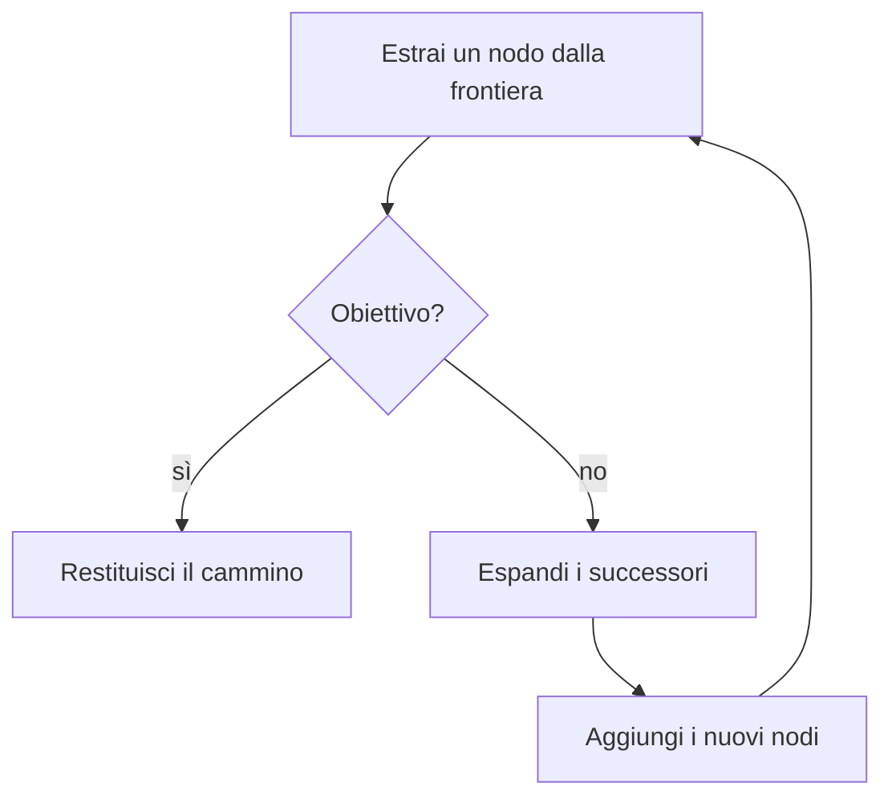
```mermaid
flowchart TB
  F["Estrai un nodo dalla frontiera"] --> G{"Obiettivo?"}
  G -- "sì" --> R["Restituisci il cammino"]
  G -- "no" --> X["Espandi i successori"]
  X --> N["Aggiungi i nuovi nodi"]
  N --> F
```

**Nodo e stato non sono sinonimi.** Uno stato è una configurazione del problema; un nodo dell'albero è un record della ricerca che rappresenta uno stato, eventualmente con padre, azione d'ingresso, profondità e costo accumulato. Lo stesso stato può comparire in *più nodi* se viene raggiunto per vie diverse. Senza controlli, un percorso fra due città può produrre il ciclo $A\to B\to A\to B\to\cdots$.

```text
frontiera ← struttura contenente il nodo iniziale
raggiunti ← {stato iniziale}               # variante con controllo dei duplicati
finché frontiera non è vuota:
    nodo ← estrai secondo la strategia
    se nodo.stato soddisfa G: restituisci il cammino risalendo i padri
    per ogni azione ammissibile in nodo.stato:
        figlio ← nodo di ricerca per Result(nodo.stato, azione)
        se figlio.stato non è in raggiunti:
            aggiungi figlio.stato a raggiunti
            inserisci figlio nella frontiera
restituisci fallimento
```

La **strategia di estrazione** determina l'ordine della visita; sostituirla produce algoritmi diversi. La variante mostrata controlla gli stati ripetuti al momento della generazione; altre implementazioni possono fare il controllo in un momento diverso o limitarsi a rilevare i cicli lungo il cammino corrente.

Per confrontare strategie, il docente propone quattro proprietà:

1. **Completezza:** se una soluzione esiste, l'algoritmo la trova alle condizioni dichiarate; in uno spazio finito esplorato interamente può anche concludere che non c'è soluzione.
2. **Complessità temporale:** nodi generati o espansi nel caso peggiore.
3. **Complessità spaziale:** memoria necessaria, soprattutto per frontiera e stati memorizzati.
4. **Ottimalità:** la prima soluzione restituita ha costo minimo?

Indichiamo con $b$ il massimo numero di successori per nodo, con $d$ la profondità della soluzione più superficiale (in BFS a costi uniformi, anche di costo minimo) e con $m$ la massima profondità dell'albero, possibilmente infinita. La trascrizione descrive $d$ come profondità di una soluzione di costo minimo: questa identificazione richiede l'ipotesi di **costi per passo uguali**; con costi diversi le due profondità possono non coincidere.

## 8. Breadth-first search (BFS, circa 78–95 min)

La BFS usa una **coda FIFO** come frontiera: i nodi scoperti per primi sono espansi per primi. Quindi visita prima tutti i nodi a profondità $0$, poi a profondità $1$, poi a profondità $2$, e così via.

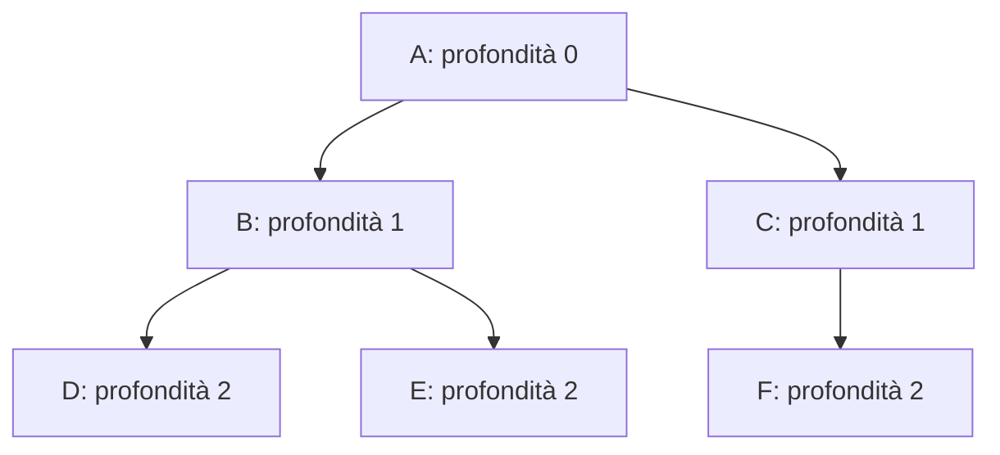
```mermaid
flowchart TB
  A["A: profondità 0"] --> B["B: profondità 1"]
  A --> C["C: profondità 1"]
  B --> D["D: profondità 2"]
  B --> E["E: profondità 2"]
  C --> F["F: profondità 2"]
```

Con coda FIFO, dopo aver espanso $A$ la frontiera contiene $[B,C]$. Espandendo $B$ si aggiungono $D,E$ in coda: $[C,D,E]$. Dunque $C$ viene esaminato prima di qualunque nodo a profondità 2.

| Proprietà | BFS e condizioni |
| --- | --- |
| Completezza | Sì, se il fattore di ramificazione $b$ è finito e una soluzione si trova a profondità finita. |
| Tempo | Esponenziale nella profondità: circa $1+b+\cdots+b^d=O(b^d)$ se il test obiettivo avviene alla generazione; alcune varianti espandono anche il livello successivo e si riportano come $O(b^{d+1})$. |
| Spazio | Esponenziale: la coda e, nella ricerca su grafo, l'insieme degli stati raggiunti possono contenere un intero livello dell'albero. |
| Ottimalità | Sì **per numero di passi**; anche per costo totale quando ogni passo costa la stessa costante positiva. Non è garantita con costi arbitrari. |

Per $b>1$, la somma geometrica fino al livello $d$ è

$$
1+b+b^2+\cdots+b^d=\frac{b^{d+1}-1}{b-1}=\Theta(b^d)
$$

se si prende $b$ come costante maggiore di 1 e ci si ferma entro quel livello. Il docente risponde a una domanda finale sulla notazione $O(b^d)$ (circa 93–95 min): i livelli meno profondi non cambiano l'ordine di crescita. Il dettaglio del *momento in cui si controlla l'obiettivo* determina se nel caso peggiore si generano anche nodi al livello $d+1$; per questo manuali diversi possono usare esponenti diversi.

La registrazione distingue l'albero di ricerca dal grafo degli stati e consiglia di evitare gli stati già incontrati: con costi uniformi BFS raggiunge per prima una certa configurazione tramite un cammino di lunghezza minima, quindi scartare una copia scoperta più tardi non peggiora la soluzione. **Questa deduzione non vale senza le ipotesi sui costi.**

## 9. Ripasso per l'orale

1. Quali scelte compie lo studente quando formalizza un problema di ricerca, e quali compie invece l'algoritmo?
2. Perché la scelta del costo per passo può rendere «ottima» una soluzione indesiderata nel mondo reale?
3. Che differenza c'è tra piano offline, piano condizionale e azione online dopo un'osservazione?
4. Perché uno stato può comparire in più nodi dell'albero di ricerca?
5. Quali condizioni rendono BFS completa e ottima? Che cosa cambia con costi non uniformi?
6. Perché la memoria, e non solo il tempo, è un limite pratico di BFS?
7. Per un progetto NetHack, come definiresti un sotto problema verificabile e quali metriche useresti?

**Continuazione prevista:** altre strategie di ricerca non informata, poi ricerca informata ed euristiche.

# 1/10

> **Fonti:** Andrea Cossu, *Search* (`4_Search.pdf`, slide 1–64) e registrazione trascritta (`aif4.vtt`, circa 95 minuti). La lezione riprende la BFS introdotta nella lezione 3. Alcuni termini della trascrizione automatica sono deformati: per nomi, notazioni e formule si è fatto riferimento alle slide.

## 1. Richiamo: problema e struttura della ricerca

Un agente che risolve problemi rappresenta stati, azioni possibili, transizioni, stato iniziale, obiettivo e costi. L'algoritmo costruisce un **albero di ricerca** sopra il grafo degli stati. Un nodo dell'albero contiene almeno lo stato rappresentato, un riferimento al padre, l'azione che lo ha generato, la profondità e il costo del cammino $g(n)$. Lo stesso stato può apparire in nodi diversi se esistono cammini alternativi.

La **frontiera** raccoglie i nodi generati e non ancora espansi. Cambiando l'ordine in cui si estrae un nodo dalla frontiera si ottengono algoritmi differenti. Durante la lezione vengono confrontati rispetto a completezza, ottimalità, tempo e memoria.

| Simbolo | Significato |
| --- | --- |
| $b$ | Numero massimo di successori di un nodo (*branching factor*). |
| $d$ | Profondità della soluzione più superficiale; se tutti i passi costano uguale, coincide con la profondità di una soluzione ottima. |
| $m$ | Profondità massima dell'albero, anche infinita. |
| $C^*$ | Costo della soluzione ottima. |
| $\varepsilon$ | Limite inferiore **positivo** del costo di ogni azione, quando richiesto. |

> **Precisazione:** le slide chiamano $d$ «profondità della soluzione di costo minimo». Con costi non uniformi, la soluzione meno costosa può essere più profonda di quella più vicina alla radice; gli indici delle complessità vanno letti con le ipotesi proprie di ogni algoritmo.

## 2. Ricerca non informata

Queste strategie usano le informazioni presenti nella definizione del problema, senza una stima aggiuntiva della distanza dall'obiettivo. La registrazione sviluppa costo uniforme, profondità, alcune varianti e i controlli sui cammini.

### 2.1 BFS: il riferimento iniziale

La **breadth-first search** usa una coda FIFO ed espande gli stati per livelli di profondità. Se ogni passo costa la stessa costante positiva, la prima soluzione scoperta alla minima profondità ha costo minimo. Con ramificazione finita è completa per una soluzione a profondità finita. Tempo e spazio crescono esponenzialmente con $d$; nella variante che controlla l'obiettivo alla generazione sono $O(b^d)$, mentre dettagli implementativi possono far generare anche il livello $d+1$.

### 2.2 Ricerca a costo uniforme (UCS, algoritmo di Dijkstra)

Con costi differenti, l'ordine dei livelli non coincide con l'ordine dei costi. La **uniform-cost search** sceglie dalla frontiera il nodo col minore costo già accumulato:

$$
g(n)=\sum_{e\in\text{cammino}(s_0,n)}c(e).
$$

La frontiera è una coda di priorità ordinata per $g(n)$. L'esplorazione procede quindi per **soglie di costo**, anziché per profondità. Se il fattore di ramificazione è finito e ogni azione costa almeno $\varepsilon>0$, UCS è completa per una soluzione finita ed è ottima per costi non negativi: il primo obiettivo **estratto dalla coda** ha costo minimo.

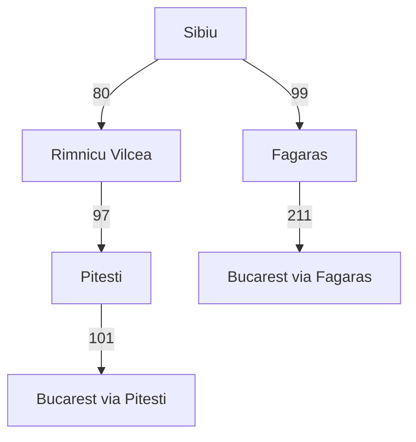
```mermaid
flowchart TB
  S["Sibiu"] -- "80" --> R["Rimnicu Vilcea"]
  S -- "99" --> F["Fagaras"]
  R -- "97" --> P["Pitesti"]
  F -- "211" --> B1["Bucarest via Fagaras"]
  P -- "101" --> B2["Bucarest via Pitesti"]
```

Nel disegno illustrativo, raggiungere l'obiettivo per la prima volta attraverso Făgăraș costa $99+211=310$; passando da Rîmnicu Vîlcea e Pitești costa $80+97+101=278$. **Controllare l'obiettivo già alla generazione** del primo nodo Bucarest restituirebbe 310: occorre attendere che il nodo obiettivo sia estratto secondo priorità. La registrazione insiste su questa differenza con BFS (circa 14–19 min). I numeri dello schema servono solo a mostrare il meccanismo.

La stima riportata nelle slide è

$$
T_{\mathrm{UCS}},\ S_{\mathrm{UCS}}\in O\!\left(b^{1+\lfloor C^*/\varepsilon\rfloor}\right).
$$

È un limite pessimista: prima di raggiungere un obiettivo costoso possono essere esplorati molti cammini lunghi composti da azioni economiche, persino vicoli ciechi. Il $+1$ è legato al controllo dell'obiettivo quando il nodo viene estratto: altri nodi possono essere generati nel frattempo. L'esempio orale sottolinea anche che il **costo modellato** dev'essere coerente con il compito reale.

### 2.3 Ricerca in profondità (DFS)

La **depth-first search** espande prima il nodo non espanso più profondo; la frontiera è una pila LIFO. Conserva principalmente il cammino corrente e le alternative ancora da esplorare.

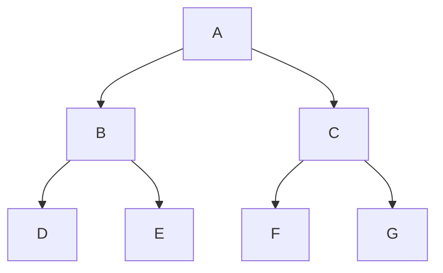
```mermaid
flowchart TB
  A --> B
  A --> C
  B --> D
  B --> E
  C --> F
  C --> G
```

Con ordine sinistra–destra, DFS scende $A\to B\to D$ prima di passare a $E$, $C$, $F$ e $G$. Può fermarsi su una soluzione non ottima o restare indefinitamente in un ramo infinito o in un ciclo.

| Proprietà | DFS con sola memoria del cammino/frontiera |
| --- | --- |
| Completezza | Non in generale; su un albero finito senza cicli sì. Con uno spazio finito e controlli adeguati dei duplicati può essere resa completa. |
| Tempo | $O(b^m)$ nel limite usuale dell'albero finito. |
| Spazio | $O(bm)$ per pila e alternative ancora aperte; memorizzare tutti gli stati raggiunti può annullare questo vantaggio. |
| Ottimalità | No, neppure se tutti i passi costano uguale. |

La trascrizione (circa 20–30 min) richiama questo compromesso: DFS può usare molta meno memoria di BFS, ma bisogna scegliere come gestire cicli e profondità elevata.

### 2.4 Varianti di DFS e ricerca bidirezionale

- **Profondità limitata:** si arresta l'espansione oltre una soglia $\ell$; può non trovare obiettivi più profondi.
- **Approfondimento iterativo:** ripete la DFS con limiti $0,1,2,\ldots$. Per ramificazione finita e costi unitari combina la completezza e l'ottimalità in numero di passi della BFS con memoria circa $O(bd)$; ripete l'esplorazione dei livelli superficiali. Questa caratterizzazione è una conseguenza standard della strategia, oltre alla descrizione orale.
- **Bidirezionale:** esplora dallo stato iniziale e, se si sanno generare i predecessori, dall'obiettivo; termina quando le ricerche si incontrano. Se le due frontiere crescono simmetricamente, l'ordine del lavoro può ridursi verso $O(b^{d/2})$, con costi di memoria e di rilevamento dell'intersezione. Non basta conoscere il nome dell'obiettivo: occorre poter cercare anche all'indietro.

### 2.5 Cicli e cammini ridondanti

Un **ciclo** ritorna a uno stato già presente nello stesso cammino, per esempio $A\to B\to C\to A$. Un **cammino ridondante** raggiunge uno stato già raggiunto altrove, per esempio $A\to B$ e $A\to C\to B$; quest'ultimo non è necessariamente un ciclo.

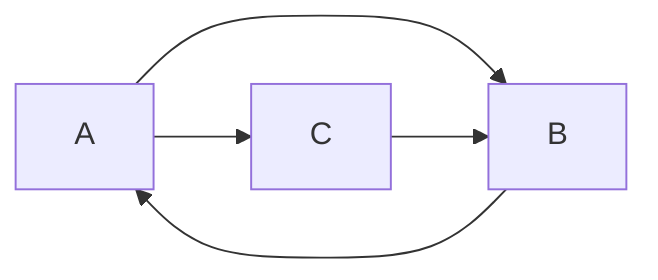
```mermaid
flowchart LR
  A --> B
  A --> C
  C --> B
  B --> A
```

Il controllo della catena dei padri rileva cicli sul cammino corrente, con tempo fino a $O(m)$ per controllo e poca memoria aggiuntiva; limitarlo agli ultimi $K$ antenati costa $O(K)$ ma perde cicli più lunghi. La **ricerca su grafo** conserva una tabella degli stati raggiunti e, per i problemi con costi, il cammino migliore noto verso ciascuno. Se compare un cammino meno costoso verso uno stato già scoperto, occorre aggiornare la voce e, secondo l'algoritmo, la sua priorità o riaprire lo stato. Le slide contrappongono questo controllo alla ricerca ad albero senza gestione dei cammini ridondanti.

## 3. Ricerca informata: l'euristica

Una **euristica** $h(n)$ stima il costo residuo per raggiungere un obiettivo dallo stato nel nodo $n$. Non è il costo esatto $h^*(n)$, che di norma richiederebbe di risolvere il problema. Negli esempi delle città, la distanza in linea d'aria può aiutare anche se il tragitto reale segue strade e deviazioni (registrazione, circa 43–46 min).

### 3.1 Greedy best-first search

Espande il nodo con il valore $h(n)$ più basso, ignorando quanto si è già speso. È una coda di priorità per $h$:

$$
f_{\mathrm{greedy}}(n)=h(n).
$$

Può dirigersi rapidamente verso l'obiettivo se la stima è utile, ma una stima ingannevole può far esplorare regioni profonde. Non garantisce la soluzione di costo minimo; completezza e limiti dipendono da cicli, finitezza e implementazione. Le slide danno per la versione ad albero limiti $O(b^m)$ in tempo e spazio e confrontano la completezza con DFS.

### 3.2 A*: costo trascorso più stima residua

A* ordina la frontiera per

$$
f(n)=g(n)+h(n),
$$

dove $g(n)$ è il costo già pagato, $h(n)$ la stima per arrivare a un obiettivo e $f(n)$ la stima del costo complessivo di una soluzione che passa da $n$. Questo evita di favorire un ramo soltanto perché sembra vicino alla meta pur essendo già molto costoso.

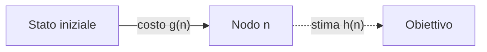
```mermaid
flowchart LR
  S["Stato iniziale"] -- "costo g(n)" --> N["Nodo n"]
  N -. "stima h(n)" .-> G["Obiettivo"]
```

Un'euristica è **ammissibile** se è ottimistica:

$$
0\le h(n)\le h^*(n),\qquad h(G)=0\text{ per ogni obiettivo }G.
$$

In ricerca ad albero, A* con euristica ammissibile restituisce una soluzione ottima alle normali condizioni sui costi e sulla finitezza della ramificazione. In ricerca su grafo occorre inoltre gestire correttamente i cammini migliorati, riaprendo i nodi quando serve. La **consistenza** è una condizione più forte:

$$
h(n)\le c(n,a,n')+h(n')\quad\text{per ogni transizione }n\xrightarrow{a}n'.
$$

Da essa segue $f(n')\ge f(n)$ lungo ogni cammino. Con costi non negativi e una gestione corretta della coda, **uno stato estratto per l'espansione** ha allora il costo $g$ ottimo e non deve essere riaperto. «Generato» e «estratto/espanso» vanno distinti: la prima scoperta di uno stato non è necessariamente la migliore.

**Idea della dimostrazione dell'ottimalità (slide 56):** supponiamo che A* stia per estrarre una soluzione con costo $C>C^*$. Sulla frontiera deve esserci un nodo $n$ di un cammino ottimo, con $g(n)=g^*(n)$. Per ammissibilità, $f(n)=g^*(n)+h(n)\le g^*(n)+h^*(n)=C^*<C$. La coda avrebbe quindi scelto $n$ prima della soluzione subottima: contraddizione. Per la ricerca su grafo questa argomentazione presuppone che un percorso ottimo verso $n$ non sia stato scartato erroneamente.

### 3.3 Weighted A*: meno espansioni, qualità controllata

La variante pesata usa

$$
f_W(n)=g(n)+W h(n),\qquad W>1.
$$

Pesa maggiormente la vicinanza stimata all'obiettivo e può trovare più rapidamente una soluzione soddisfacente. Con euristica ammissibile, condizioni standard di terminazione e gestione corretta dei cammini, il costo restituito è limitato da $C\le W C^*$. Il prezzo è la perdita della garanzia di ottimalità esatta. Le slide illustrano un caso con circa 5% di costo in più e un risparmio di tempo di sette volte: è un esempio, non una garanzia generale.

## 4. Progettare e confrontare euristiche

Per l'8-puzzle:

$$
h_1(n)=\#\{\text{tessere fuori posto}\},\qquad
h_2(n)=\sum_{i\ne\text{vuoto}}\bigl(|x_i-x_i^*|+|y_i-y_i^*|\bigr).
$$

$h_2$ somma le distanze di Manhattan di ogni tessera dalla propria posizione finale, ignorando gli ostacoli reciproci. Con costo unitario per mossa, entrambe sono ammissibili e $h_2(n)\ge h_1(n)$: in questo senso $h_2$ **domina** $h_1$. L'esempio delle slide riporta $h_1(S)=6$ e $h_2(S)=14$. Se due euristiche sono ammissibili, anche $\max(h_1,h_2)$ lo è e domina entrambe.

Un modo per costruire $h$ è **rilassare il problema**: si rimuove un vincolo, si risolve esattamente il problema semplificato e si usa quel costo come limite inferiore del costo reale. Per esempio, Manhattan corrisponde a permettere a ogni tessera di raggiungere la destinazione senza che le altre la ostacolino. Il costo ottimo del problema rilassato non supera quello del problema originale.

Per confrontare le euristiche sulle istanze si usa anche il **fattore di ramificazione effettivo** $b^*$: se vengono generati $N$ nodi per arrivare a profondità $d$, si risolve

$$
N+1=1+b^*+(b^*)^2+\cdots+(b^*)^d.
$$

Un valore più vicino a 1 indica, a parità di profondità, meno nodi esplorati. Occorre dichiarare come si conta $N$ e usare lo stesso criterio in tutti i confronti. La registrazione ricorda che un'euristica può anche essere appresa dai dati; qui il punto è valutarla e verificarne le proprietà richieste dall'algoritmo.

## 5. Riepilogo rapido

| Algoritmo | Priorità della frontiera | Completo? | Ottimo? | Memoria caratteristica |
| --- | --- | --- | --- | --- |
| BFS | Ordine FIFO / profondità crescente | Sì se $b$ finito | Sì per costi uniformi | Esponenziale in $d$ |
| UCS | $g(n)$ minimo | Sì con $b$ finito e $c\ge\varepsilon>0$ | Sì | Potenzialmente esponenziale |
| DFS | Nodo più profondo / pila LIFO | Solo con opportune condizioni o controlli | No | $O(bm)$ senza tabella globale |
| Greedy | $h(n)$ minimo | Dipende dal problema e dai controlli | No | Potenzialmente esponenziale |
| A* | $g(n)+h(n)$ minimo | Sì con ipotesi standard | Sì con euristica ammissibile e gestione corretta dei duplicati | Spesso molto elevata |
| Weighted A* | $g(n)+Wh(n)$ minimo | Con ipotesi standard | Non esattamente; limite $WC^*$ sotto ipotesi appropriate | Dipende dal problema |

### Domande per ripassare

1. Perché in UCS il test obiettivo va fatto all'estrazione, e quale controesempio compare se lo si fa alla generazione?
2. Qual è la differenza fra un ciclo lungo il cammino e un cammino ridondante verso uno stato?
3. Quando DFS consuma solo $O(bm)$ memoria e che cosa cambia conservando tutti gli stati raggiunti?
4. In che modo $g(n)$ e $h(n)$ cooperano nella scelta dei nodi di A*?
5. Perché l'ammissibilità da sola non autorizza sempre a chiudere definitivamente uno stato appena generato?
6. Come ottieni un'euristica ammissibile rilassando un problema?
7. Quando ha senso scegliere Weighted A* anche se perde l'ottimalità esatta?


# 5/10

> **Fonti:** Andrea Cossu, *Local Search — Search in Nondeterministic, Unobservable Environments* (`5_Local_Search.pdf`) e trascrizione `aif5.vtt` (circa 95 minuti). La registrazione arriva al piano condizionale e alla ricerca AND-OR delle slide 19–22. Le slide 23–29 anticipano la ricerca senza sensori e con osservabilità parziale; sono raccolte in fondo, distinguendole dai contenuti effettivamente spiegati durante questa registrazione.

## 1. Perché cercare localmente?

Gli algoritmi delle lezioni precedenti costruiscono un cammino dallo stato iniziale fino all'obiettivo. La **ricerca locale** mantiene una o poche **soluzioni candidate** e prova a migliorarle passando a candidati vicini. Nei problemi di ottimizzazione interessa soprattutto *quale configurazione ottenere*: la sequenza di mosse per arrivarci può essere irrilevante.

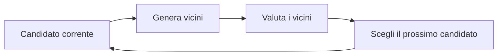
```mermaid
flowchart LR
  C["Candidato corrente"] --> N["Genera vicini"]
  N --> V["Valuta i vicini"]
  V --> S["Scegli il prossimo candidato"]
  S --> C
```

Si guadagna in memoria perché non si conserva necessariamente l'albero né l'insieme completo degli stati visitati. Si possono trattare spazi enormi o continui, purché si sappiano generare nuovi candidati e valutarne la qualità. La ricerca non è sistematica: può fermarsi su una soluzione **abbastanza buona**, magari dopo un limite di tempo. Nella registrazione (circa 0–7 min) il docente usa come esempio le **$N$ regine**: una configurazione colloca le regine sulla scacchiera, la funzione obiettivo penalizza gli attacchi reciproci e una mossa riposiziona una regina.

Sia $V(s)$ un valore da massimizzare, oppure $C(s)$ un costo da minimizzare. Le due convenzioni sono equivalenti ponendo $V(s)=-C(s)$, ma **i segni delle formule vanno mantenuti coerenti**.

## 2. Hill climbing: una soluzione alla volta

Il **hill climbing** sceglie un vicino di valore massimo e si sposta solo se migliora strettamente il candidato corrente:

```text
current ← stato iniziale
ripeti:
    neighbor ← un vicino con il più alto V
    se V(neighbor) ≤ V(current): restituisci current
    current ← neighbor
```

Conserva un candidato e le informazioni necessarie a confrontare i suoi vicini. È una strategia **greedy**: guarda il vantaggio locale e non garantisce di trovare il massimo globale. Nella registrazione (circa 10–26 min) il docente presenta una superficie di valori con diversi ostacoli:

| Fenomeno | Che cosa accade | Possibile rimedio |
| --- | --- | --- |
| **Massimo locale** | Tutti i vicini sono peggiori, benché esistano soluzioni migliori altrove. | Ripartenze casuali o mosse peggiorative controllate. |
| **Plateau** | Molti vicini hanno lo stesso valore: manca una direzione evidente. | Mosse laterali, limitate a un massimo di $K$ passi. |
| **Cresta** | Mosse semplici lungo singole coordinate non seguono bene la direzione di miglioramento. | Cambiare vicinato o regola di proposta delle mosse. |

Con **random restart** si riparte più volte da configurazioni casuali e si conserva la soluzione migliore. Se ciascuna ripartenza ha probabilità indipendente $p>0$ di entrare nel bacino di una soluzione globale, dopo $r$ tentativi la probabilità di averlo raggiunto almeno una volta è $1-(1-p)^r$. Questa è una formalizzazione didattica: la garanzia richiede tali ipotesi e un numero illimitato di tentativi; in tempo finito il successo non è assicurato.

La registrazione collega la ricerca locale all'**ottimizzazione tramite gradiente**. Il gradiente usa derivate per scegliere una direzione in uno spazio continuo e rappresenta una famiglia diversa di mosse rispetto alla selezione esplicita del miglior vicino discreto. Per minimizzare $C(x)$, una forma standard è $x_{t+1}=x_t-\eta\nabla C(x_t)$ con passo $\eta>0$.

## 3. Simulated annealing: accettare talvolta una mossa peggiore

Il hill climbing si blocca quando ogni vicino immediato peggiora il valore. Il **simulated annealing** genera un vicino casuale e, all'inizio, consente anche mosse peggiorative; col tempo ne riduce la probabilità attraverso una **temperatura** $T_t$ che decresce.

Adottiamo la convenzione delle slide: **minimizzare** $C(s)$ e definire

$$
\Delta E=C(s_{\mathrm{corrente}})-C(s_{\mathrm{nuovo}}).
$$

Se $\Delta E>0$, la mossa è migliorativa e viene accettata. Se $\Delta E\le 0$, viene accettata con probabilità

$$
P(\text{accetta mossa peggiore})=\exp\!\left(\frac{\Delta E}{T_t}\right),\qquad T_t>0.
$$

Per $\Delta E<0$ tale probabilità è compresa fra 0 e 1. Con $\Delta E=-1$: se $T=1$, è $e^{-1}\simeq0{,}368$; se $T=0{,}1$, è $e^{-10}\simeq0{,}000045$. A temperatura fissa, una perdita maggiore è meno probabile; fissata la perdita, una temperatura maggiore la rende più probabile.

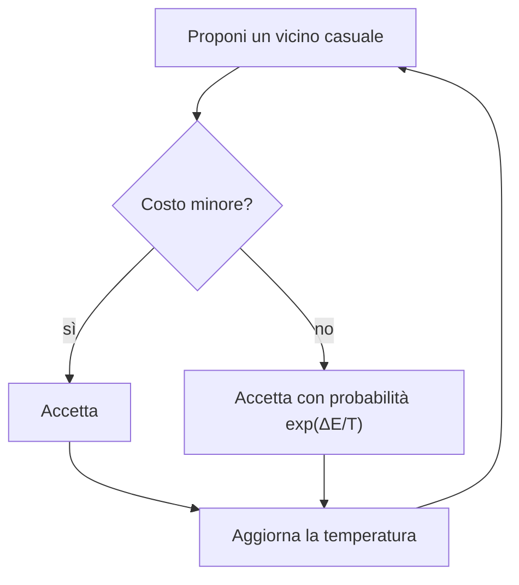
```mermaid
flowchart TB
  P["Proponi un vicino casuale"] --> B{"Costo minore?"}
  B -- "sì" --> A["Accetta"]
  B -- "no" --> Q["Accetta con probabilità exp(ΔE/T)"]
  A --> T["Aggiorna la temperatura"]
  Q --> T
  T --> P
```

Lo **schedule** può essere geometrico $T_t=\kappa T_{t-1}$, con $0<\kappa<1$, oppure della forma $T_t=T_0/t^\alpha$ con $\alpha>0$. Partire «caldi» favorisce esplorazione; raffreddare favorisce mosse migliorative. Se uno schedule pone **esattamente** $T=0$, l'algoritmo delle slide restituisce lo stato corrente. Il limite $T\to0^+$ fa tendere a zero la probabilità di accettare peggioramenti; non basta per assicurare il massimo globale con uno schedule pratico. La registrazione (circa 27–45 min) invita a ragionare sui due parametri, perdita e temperatura, separatamente.

## 4. Local beam search: più candidati che cooperano

La **local beam search** conserva $K$ stati correnti. A ogni passo genera i successori di tutti e conserva i $K$ candidati più promettenti nell'insieme risultante. È diversa da $K$ hill climbing indipendenti: se tutti i migliori candidati discendono dalla stessa regione, possono sostituire *tutti* quelli provenienti dalle altre regioni.

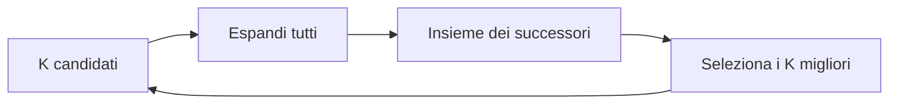
```mermaid
flowchart LR
  B["K candidati"] --> X["Espandi tutti"]
  X --> R["Insieme dei successori"]
  R --> K["Seleziona i K migliori"]
  K --> B
```

Questo scambio di informazione concentra la ricerca sulle regioni promettenti, ma rischia di perdere **diversità**: tutti gli stati della beam possono convergere verso lo stesso massimo locale. La variante stocastica seleziona alcuni candidati con probabilità dipendente dal valore, anziché tenere sempre deterministicamente i primi $K$. Se il valore può essere negativo o non rappresenta direttamente un peso probabilistico, va prima trasformato in pesi non negativi e normalizzati.

Le slide menzionano l'**ottimizzazione evolutiva** come area collegata ma rimandata a lezioni dedicate.

## 5. Beam search nella generazione di testo

La registrazione (circa 54–72 min) usa un decoder che traduce «how are you?» in italiano. In generazione **greedy** si sceglie a ogni passo la parola più probabile e si prosegue fino al token di fine. Una scelta localmente probabile può impedire di ottenere la frase complessivamente più probabile.

Nella **beam search** si mantengono i $K$ prefissi con punteggio complessivo maggiore; ciascuno viene espanso con possibili parole successive e si trattengono nuovamente i migliori $K$. Il punteggio della sequenza è una probabilità **congiunta**, non solo la probabilità dell'ultima parola:

$$
P(w_{1:t})=\prod_{i=1}^{t}P(w_i\mid w_{1:i-1},x),
$$

dove $x$ è il testo di input. Per esempio, se $P(A)=0{,}5$, $P(B\mid A)=0{,}4$ e $P(C\mid A,B)=0{,}8$, allora

$$
P(A,B)=0{,}5\cdot0{,}4=0{,}2,\qquad P(A,B,C)=0{,}2\cdot0{,}8=0{,}16.
$$

Per $N$ posizioni e beam $K$, nelle slide si contano circa $KN$ esecuzioni del decoder, trascurando i dettagli del primo passo, le terminazioni anticipate e il costo di selezione nel vocabolario. Si può usare la somma dei logaritmi per evitare prodotti numericamente piccoli: $\log P(w_{1:t})=\sum_i\log P(w_i\mid w_{1:i-1},x)$. Le sequenze terminate con il token `END` vanno gestite come candidati completi; la beam non garantisce il massimo globale su tutte le frasi possibili.

> **Due usi del termine «beam»:** nella ricerca locale si mantengono $K$ stati del problema; nella generazione si mantengono $K$ *prefissi* di sequenze. Il meccanismo comune è espandere tutti i candidati correnti e selezionare insieme i nuovi migliori $K$.

## 6. Ricerca con azioni non deterministiche

Nella parte finale della lezione (circa 73–95 min), il docente torna a problemi in cui la coppia $(s,a)$ può produrre **più stati successivi**. È utile modellare l'insieme degli esiti possibili:

$$
\operatorname{Result}(s,a)\subseteq S.
$$

L'insieme dei possibili stati attuali, quando non si sa quale sia quello reale, è uno **stato di credenza** $B\subseteq S$. Se l'agente può osservare l'esito di un'azione, può predisporre in anticipo un **piano condizionale** che copra tutte le diramazioni: la soluzione è una struttura con scelte del tipo «se osservo questo, esegui ...», anziché un'unica lista di mosse.

### 6.1 Nodi OR e AND

- In un nodo **OR** l'agente sceglie **una** fra le azioni disponibili: ne basta una che porti a una soluzione.
- In un nodo **AND** l'ambiente può produrre **uno qualunque** degli esiti dell'azione scelta: il piano deve comprendere una continuazione risolutiva per **tutti** gli esiti possibili.

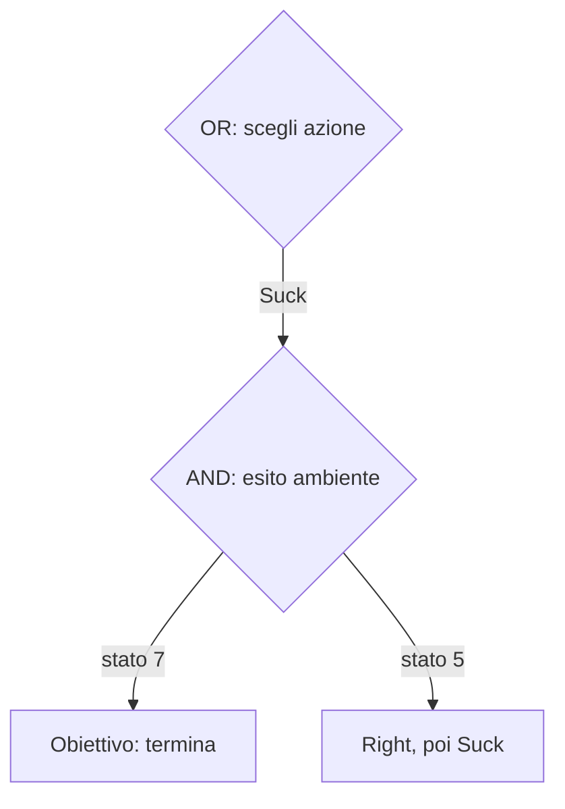
```mermaid
flowchart TB
  O{"OR: scegli azione"} -- "Suck" --> A{"AND: esito ambiente"}
  A -- "stato 7" --> G["Obiettivo: termina"]
  A -- "stato 5" --> R["Right, poi Suck"]
```

**Aspirapolvere erratico (slide 20):** quando una stanza è sporca, `Suck` pulisce quella stanza e talvolta anche la vicina; se una stanza è pulita, aspirare può persino depositare sporco. Dallo stato etichettato 1 nelle slide, $\operatorname{Result}(1,\mathrm{Suck})=\{5,7\}$. Un piano è: `Suck`; se si osserva lo stato 5, esegui `Right` e `Suck`; se si osserva 7, l'obiettivo è già raggiunto. Le etichette 1, 5 e 7 si riferiscono allo schema di stati della dispensa.

Una **soluzione AND-OR** è un sottoalbero in cui ciascun nodo OR seleziona una sola azione, tutti i figli di ogni nodo AND selezionato sono coperti e ogni foglia terminale soddisfa l'obiettivo. Un algoritmo in profondità su tale struttura è completo **per soluzioni acicliche** sotto le ipotesi usuali, ma non garantisce il costo minimo. Le slide indicano un limite di tempo e spazio $O((bk)^d)$, dove $b$ è la ramificazione dei nodi OR, $k$ quella degli AND e $d$ la profondità per coppie di livelli; esprimere $b^k d$ sarebbe un'altra funzione, quindi le parentesi sono essenziali.

**Precisazione della discussione orale:** il docente inizialmente inverte verbalmente «open loop» e «closed loop», poi chiarisce il punto operativo. Il piano condizionale viene **calcolato prima**, quindi può essere eseguito *senza rifare la ricerca a ogni passo*, ma l'agente deve **osservare l'esito** per scegliere il ramo giusto. Nel lessico usuale, questa esecuzione è un controllo con feedback (*closed loop*), mentre «non ripianificare online» descrive il momento in cui il piano è stato calcolato. I due criteri sono distinti.

## 7. Anticipazione presente solo nelle ultime slide

La registrazione termina annunciando per la lezione successiva **soluzioni cicliche** e problemi senza sensori; le slide 23–29 contengono già questi concetti, qui raccolti come materiale preparatorio.

### Soluzioni cicliche

Se una mossa di spostamento può fallire, si può dover ripetere l'azione finché riesce: un piano del tipo «finché sono nello stato 5, prova `Right`; poi `Suck`» è ciclico. Un algoritmo che scarta qualunque ritorno di stato non lo trova. L'affermazione che «prima o poi si riesce» richiede un'ipotesi sull'ambiente, ad esempio una probabilità positiva di successo a ogni tentativo indipendente; senza di essa un esito avverso potrebbe ripetersi sempre.

### Nessun sensore: cercare nello spazio delle credenze

Un agente **sensorless** non riceve percezioni per distinguere gli stati; il suo stato di credenza $B$ è l'insieme delle possibilità ancora compatibili con le azioni compiute. Da $N$ stati fisici si possono formare fino a $2^N$ insiemi di credenza. Con transizioni determinate,

$$
\operatorname{Result}(B,a)=\{\operatorname{Result}(s,a):s\in B\};
$$

con azioni non deterministiche occorre invece unire *tutti* gli esiti possibili:

$$
\operatorname{Result}(B,a)=\bigcup_{s\in B}\operatorname{Result}(s,a).
$$

Nel mondo delle due stanze, partendo dalla credenza $\{1,\ldots,8\}$, l'azione `Right` produce nelle slide $\{2,4,6,8\}$: l'agente non sa quanto sporco ci sia, ma sa di trovarsi a destra. Senza osservazioni il piano non può diramarsi in base all'esito; un obiettivo **garantito** è raggiunto quando *ogni* stato rimasto nella credenza soddisfa il test obiettivo. Se un'azione è illegale o pericolosa in qualche stato possibile, conviene ammettere soltanto azioni legali in **tutti** gli stati di $B$, cioè l'intersezione degli insiemi $A(s)$.

### Osservabilità parziale

Ricevere una percezione consente di restringere la credenza agli stati compatibili. Per esempio, le slide associano l'osservazione `[L, Dirty]` a due stati possibili $\{1,3\}$. Se osservazioni e azioni possono produrre più esiti, una ricerca AND-OR può pianificare i rami corrispondenti. **Osservabilità e determinismo restano proprietà indipendenti**: la prima riguarda ciò che si vede, il secondo quanti esiti può avere una transizione.

## 8. Domande per l'orale

1. Perché la ricerca locale può usare poca memoria, e quale informazione perde rispetto alla ricerca di cammini?
2. Che differenza c'è fra massimo locale e plateau? Quando una mossa laterale può aiutare?
3. Con la convenzione di costo minimo, quale segno ha $\Delta E$ per una mossa peggiorativa e come varia $e^{\Delta E/T}$?
4. Perché una beam di ampiezza $K$ non equivale a $K$ ricerche indipendenti?
5. Come si calcola $P(w_1,w_2,w_3)$ dalle probabilità condizionate del decoder?
6. In un albero AND-OR, quali rami possono essere scartati e quali vanno risolti tutti?
7. Un piano condizionale precomputato richiede osservazioni mentre viene eseguito? Richiede sempre una nuova ricerca?
8. Perché un agente senza sensori ragiona su insiemi di stati invece che su un unico stato?

# 7/10


> **Fonti:** Andrea Cossu, *Constraint Satisfaction Problem* (`6_CSP.pdf`, slide 1–33) e trascrizione `transcript(1).vtt` (circa 99 minuti). La registrazione dedica i primi 40 minuti al completamento della ricerca in ambienti non osservabili, poi arriva fino alle euristiche MRV, degree e LCV. Le slide 21–32, dedicate a propagazione e struttura dei CSP, sono raccolte in una sezione separata: il docente le annuncia per la lezione seguente. La trascrizione automatica contiene alcuni termini imprecisi; notazioni e formule sono state controllate sulle slide.

## 1. Collegamento con la lezione precedente: stati di credenza (circa 0–40 min)

Un **piano condizionale** per un ambiente non deterministico deve prevedere ogni esito possibile di un'azione. La ricerca AND-OR sceglie una sola azione nei nodi OR, ma deve risolvere tutti gli esiti nei nodi AND. La trascrizione osserva un limite della DFS AND-OR che scarta sempre i cicli: evita l'esplorazione infinita, ma perde soluzioni che richiedono, per esempio, di ripetere uno spostamento finché riesce. La completezza di quella versione va dunque riferita alle **soluzioni acicliche**.

Quando non si conosce esattamente lo stato effettivo, si ragiona su uno **stato di credenza** $B\subseteq S$: l'insieme degli stati fisici ancora possibili. L'incertezza può derivare da sensori incompleti, esiti non deterministici o entrambi. Con $N=|S|$ stati fisici, lo spazio di tutte le credenze contiene fino a $2^N$ sottoinsiemi.

### Ambiente senza sensori: ricerca conformante

Un agente *sensorless* non riceve osservazioni che identifichino lo stato effettivo. Può comunque conoscere il modello delle azioni. Nell'aspirapolvere a due stanze, se inizialmente qualsiasi stato è possibile, $B_0=\{1,2,\ldots,8\}$; l'azione `Right` porta agli stati $\{2,4,6,8\}$ del diagramma delle slide, poiché ora la posizione è nota pur senza averla osservata.

Per un'azione deterministica, la transizione nello spazio delle credenze è

$$
\operatorname{Result}(B,a)=\{\operatorname{Result}(s,a):s\in B\}.
$$

Se anche l'azione è non deterministica, si uniscono tutti i suoi possibili risultati:

$$
\operatorname{Result}(B,a)=\bigcup_{s\in B}\operatorname{Result}(s,a).
$$

Una **soluzione garantita** senza sensori è una sequenza di azioni che termina in una credenza i cui stati soddisfano tutti l'obiettivo:

$$
G(B)\iff\forall s\in B:\ G(s).
$$

Non occorre necessariamente ottenere una credenza con un solo stato: possono restare più stati possibili, purché siano **tutti** obiettivi. Il docente nel parlato propone il caso di credenza singola come intuizione semplice; la condizione generale è quella della formula. Inoltre, con una transizione deterministica $|\operatorname{Result}(B,a)|\le|B|$, ma la grandezza può rimanere invariata; con transizioni non deterministiche può anche aumentare.

Se una mossa è pericolosa quando non è ammissibile in uno degli stati possibili, l'agente può consentire solo

$$
A_{\mathrm{sicure}}(B)=\bigcap_{s\in B}A(s).
$$

L'unione $\bigcup_{s\in B}A(s)$ ammetterebbe invece azioni lecite in *almeno uno* stato: utilizzarla richiede di definire che cosa accade negli altri. La scelta modifica il problema che si sta risolvendo.

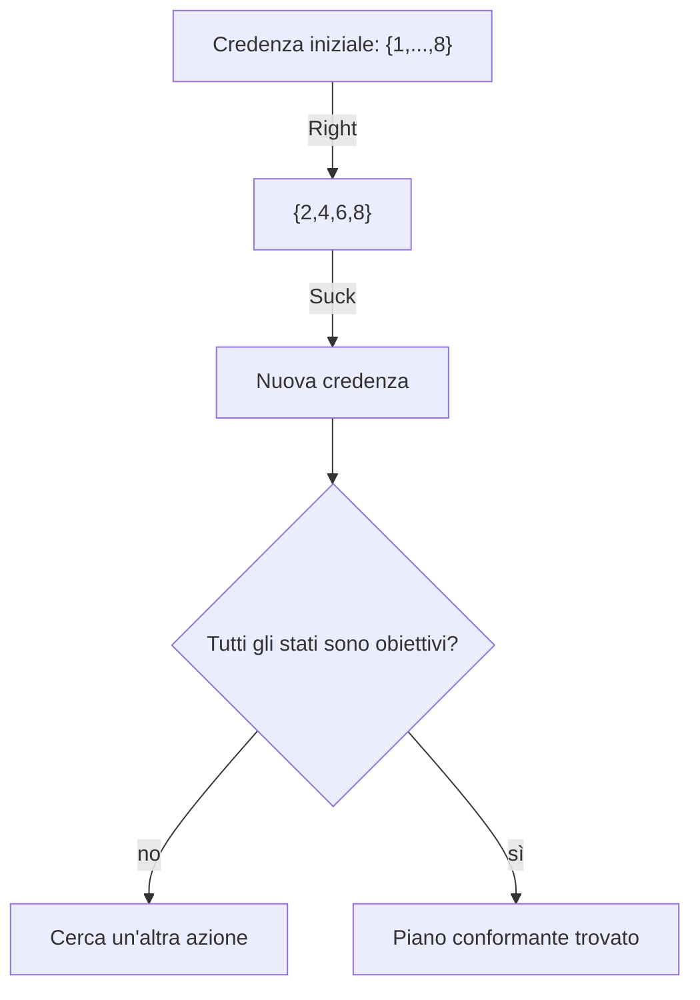
```mermaid
flowchart TB
  B0["Credenza iniziale: {1,...,8}"] -- "Right" --> B1["{2,4,6,8}"]
  B1 -- "Suck" --> B2["Nuova credenza"]
  B2 --> G{"Tutti gli stati sono obiettivi?"}
  G -- "no" --> A["Cerca un'altra azione"]
  G -- "sì" --> F["Piano conformante trovato"]
```

L'agente può cercare tra credenze con gli algoritmi già studiati: ciascuna credenza è un nodo del nuovo spazio degli stati. Senza sensori **non può scegliere rami in base a osservazioni durante l'esecuzione**, mentre con osservabilità parziale può aggiornare la credenza usando le percezioni e seguire un piano condizionale. La ricerca può diventare costosa perché lo spazio delle credenze cresce esponenzialmente; non segue automaticamente che ogni algoritmo abbia complessità esattamente $2^{2^N}$: questa dipende anche da rappresentazione, ramificazione e profondità.

## 2. Dal singolo stato alle variabili del CSP (circa 40–50 min)

Negli esempi precedenti uno stato poteva essere trattato come un oggetto atomico. Un **problema di soddisfacimento di vincoli** (*constraint satisfaction problem*, CSP) rende esplicita la struttura dello stato:

$$
\mathcal P=(X,D,C),\qquad X=\{X_1,\ldots,X_n\},\quad X_i\in D_i,
$$

dove $D_i$ è il dominio dei valori della variabile $X_i$ e $C$ è l'insieme dei vincoli. Una **assegnazione** $\alpha$ è una funzione parziale o totale che associa valori alle variabili.

| Termine | Significato |
| --- | --- |
| Parziale | Solo alcune variabili hanno un valore. |
| Completa | Ogni variabile ha un valore nel suo dominio. |
| Consistente | Nessun vincolo applicabile alle variabili già assegnate viene violato. |
| Soluzione | Assegnazione **completa e consistente**. |

Un vincolo con variabili ancora libere è verificabile in modo definitivo soltanto quando tutte le sue variabili sono state assegnate; algoritmi di propagazione possono spesso escludere valori prima di quel momento. Per i **CSP finiti generali**, la ricerca di una soluzione è NP-completa nel caso peggiore: la proprietà non va estesa automaticamente a ogni sottoclasse (per esempio gli alberi), né a domini infiniti senza specificare la rappresentazione dei vincoli.

### Esempio: colorazione della mappa australiana

Le variabili rappresentano gli stati/territori $X=\{\mathrm{WA},\mathrm{NT},\mathrm{SA},\mathrm{Q},\mathrm{NSW},\mathrm{V},\mathrm{T}\}$ e ogni dominio è $\{r,g,b\}$. Per regioni confinanti si impone un colore differente:

$$
C=\{X_i\ne X_j:(i,j)\in E\},
$$

dove $E$ contiene le coppie confinanti. Tasmania ($\mathrm T$) è isolata nel **grafo dei vincoli** e può essere colorata indipendentemente dal continente. Un esempio di assegnazione parziale $\{\mathrm{WA}=r,\mathrm{NT}=g\}$ è consistente per il loro vincolo; $\{\mathrm{WA}=r,\mathrm{NT}=r\}$ non lo è.

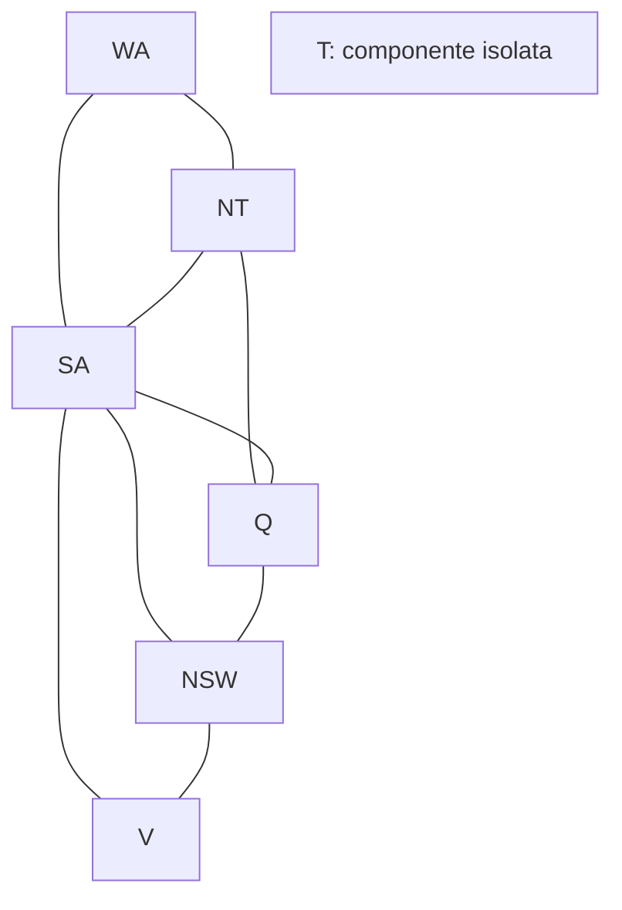
```mermaid
flowchart TB
  WA --- NT
  WA --- SA
  NT --- SA
  NT --- Q
  SA --- Q
  SA --- NSW
  SA --- V
  Q --- NSW
  NSW --- V
  T["T: componente isolata"]
```

Gli archi del grafo esprimono i vincoli **binari**, non distanze geografiche. Per questa rappresentazione ciascun arco richiede due valori differenti.

## 3. Domini, vincoli e loro rappresentazione (circa 50–76 min)

Un CSP può avere domini booleani, finiti non booleani, interi infiniti o continui. La classe dei vincoli determina quali strumenti siano adatti: sistemi lineari su variabili reali hanno metodi specifici; con vincoli non lineari o aritmetica su interi infiniti non si può presumere lo stesso comportamento. La trascrizione insiste sull'identificare la classe concreta prima di scegliere un solutore.

| Vincolo | Variabili coinvolte | Esempio |
| --- | --- | --- |
| Unario | Una | $X\ne1$. |
| Binario | Due | $A\le B$ oppure $\mathrm{WA}\ne\mathrm{NT}$. |
| Globale / di arità maggiore | Tre o più, non necessariamente tutte | $\operatorname{AllDiff}(A,B,C,D)$. |
| Di preferenza (*soft*) | Una o più | «Evitare, se possibile, una lezione di lunedì». |

I **vincoli rigidi** devono sempre valere; quelli di preferenza possono essere violati pagando un costo. Una formulazione di ottimizzazione vincolata è

$$
\min_{\alpha\text{ soddisfa i vincoli rigidi}}
\sum_{j=1}^{m}w_j\,\mathbf 1[\alpha\text{ viola la preferenza }j].
$$

Nell'esempio orale dell'orario universitario, aule occupate e contemporaneità impossibili sono vincoli rigidi; una preferenza del docente per certi giorni può essere morbida. La funzione obiettivo permette di scegliere la soluzione che viola meno preferenze *pesate*, senza trasformarle in condizioni impossibili da soddisfare.

### Grafi, ipergrafi e variabili ausiliarie

Un grafo ordinario rappresenta direttamente vincoli binari. Un vincolo con più variabili può essere rappresentato da un **ipergrafo** o, graficamente, da un nodo «vincolo» connesso a tutte le variabili interessate. Nella crittoaritmetica $TWO+TWO=FOUR$, per esempio, i riporti $C_1,C_2,C_3$ sono variabili ausiliarie e le colonne impongono

$$
\begin{aligned}
O+O&=R+10C_1,\\
C_1+W+W&=U+10C_2,\\
C_2+T+T&=O+10C_3,\\
C_3&=F.
\end{aligned}
$$

I domini delle lettere sono le cifre, i riporti sono coerenti con la somma; per la crittoaritmetica usuale occorrono anche lettere distinte e cifre iniziali non nulle. La trascrizione (circa 66–69 min) usa questo esempio per far vedere come una formula aritmetica generi vincoli di arità maggiore di due.

Per **binarizzare** un vincolo ternario $X+Y=Z$, con $D_X=D_Y=D_Z=\{1,2,3\}$, si introduce una variabile nascosta $U$ il cui dominio è l'insieme delle triple ammesse:

$$
D_U=\{(x,y,z)\in D_X\times D_Y\times D_Z:x+y=z\}.
$$

Si sostituisce il vincolo ternario con tre vincoli binari $U_1=X$, $U_2=Y$, $U_3=Z$. In questo esempio $D_U=\{(1,1,2),(1,2,3),(2,1,3)\}$. La conversione conserva le soluzioni sulle variabili originali, ma costruire il dominio ausiliario può costare molto se il prodotto cartesiano è grande. Un propagatore dedicato, ad esempio per `AllDiff`, può essere più utile della conversione.

## 4. Ricerca per assegnazioni parziali (circa 76–91 min)

Un'implementazione ingenua della DFS parte da $\alpha=\varnothing$ e a ogni passo può scegliere **qualsiasi** variabile ancora libera e uno dei suoi $d$ valori. Al primo livello ci sono $nd$ azioni, poi $(n-1)d$, e così via. Anche assegnando gli stessi valori finali, ordini diversi delle variabili ripetono la medesima soluzione: si arriverebbe fino a

$$
(nd)((n-1)d)\cdots d=n!d^n
$$

foglie, pur esistendo soltanto $d^n$ assegnazioni complete distinte. Le assegnazioni a variabili differenti **commutano**: imporre un ordine di scelta delle variabili, anche determinato dinamicamente ma unico in ogni stato della ricerca, evita di generare tutte le permutazioni dell'ordine.

### Backtracking

Il **backtracking** assegna una variabile per volta, verifica subito i vincoli che può valutare e torna indietro appena un ramo non può condurre a una soluzione:

```text
Backtrack(assegnazione α):
    se α è completa: restituisci α
    X ← scegli una variabile non assegnata
    per ogni v in un ordine scelto dal dominio di X:
        se α ∪ {X = v} è consistente:
            risposta ← Backtrack(α ∪ {X = v})
            se risposta è una soluzione: restituisci risposta
    restituisci fallimento
```

```mermaid
flowchart TB
  P["Assegnazione parziale"] --> V["Scegli variabile e valore"]
  V --> C{"Vincoli rispettati?"}
  C -- "no" --> B["Backtrack: prova altra scelta"]
  C -- "sì, incompleta" --> P
  C -- "sì, completa" --> S["Soluzione"]
```

Con $n$ domini **finiti**, l'albero ha profondità $n$ e ramificazione finita, quindi la ricerca sistematica termina con una soluzione o con un fallimento. Il limite nel caso peggiore resta esponenziale, $O(d^n)$ foglie se i domini hanno dimensione $d$; il controllo precoce dei vincoli può potare moltissimi rami in pratica. La registrazione (circa 80–90 min) contrappone questa situazione alla DFS in alberi infiniti: qui non ci sono cammini di assegnazione oltre la profondità $n$.

### Ordinare variabili e valori

| Euristica | Sceglie | Criterio | Perché può aiutare |
| --- | --- | --- | --- |
| **MRV** (*minimum remaining values*) | La prossima variabile | Minimo numero di valori ancora leciti. | Individua presto un dominio impossibile o quasi esaurito: *fail first*. |
| **Degree** | La prossima variabile, spesso a parità di MRV | Massimo numero di vincoli con variabili non assegnate. | Una scelta può influenzare molte variabili future. |
| **LCV** (*least constraining value*) | Il prossimo valore della variabile già scelta | Elimina il minor numero di valori dai domini delle altre. | Lascia aperte più continuazioni se basta trovare una soluzione. |

MRV e degree ordinano **variabili**; LCV ordina **valori**. La prima cerca presto un fallimento, la terza prova prima una scelta che conserva flessibilità. Se si vogliono **tutte** le soluzioni, cambiare l'ordine non elimina soluzioni ma modifica il momento in cui si trovano. Queste euristiche sfruttano la struttura generale di un CSP, senza una stima $h(n)$ del costo residuo come in A*.

## 5. Materiale delle slide 21–32: propagazione e strutture speciali

> La registrazione si ferma alle euristiche precedenti e annuncia l'inferenza per la lezione successiva. Questa sezione permette di leggere l'intera dispensa, ma i seguenti algoritmi **non risultano spiegati in questa registrazione**.

### 5.1 Propagazione dei vincoli

La **constraint propagation** elimina dai domini valori che non possono comparire in una soluzione, prima o durante la ricerca. In un CSP unario $D_X=\{1,2,3,4\}$ con $X<3$, la **consistenza di nodo** restringe $D_X$ a $\{1,2\}$.

Per un vincolo binario $C_{XY}$, l'arco diretto $X\to Y$ è **consistente** se ogni valore di $X$ ha almeno un valore di supporto in $Y$:

$$
\forall x\in D_X\;\exists y\in D_Y:\ C_{XY}(x,y).
$$

La proprietà va verificata in entrambe le direzioni per rendere consistenti tutti gli archi pertinenti. La consistenza d'arco non garantisce una soluzione globale: può rimanere un'incompatibilità che coinvolge più vincoli insieme.

**AC-3** mantiene una coda di archi orientati. Estrae $X\to Y$, elimina da $D_X$ i valori senza supporto in $D_Y$ e, se $D_X$ è cambiato, reinserisce gli archi $Z\to X$ dei vicini che potrebbero aver perso supporto. Un dominio vuoto segnala fallimento. La stima standard delle slide è $O(cd^3)$, con $c$ archi orientati e dimensione massima del dominio $d$: una revisione può controllare $O(d^2)$ coppie e uno stesso arco può essere riesaminato fino a $O(d)$ volte.

### 5.2 Propagazione durante il backtracking

- **Forward checking:** dopo $X=v$ si cancellano dai domini delle variabili non assegnate $Y$ i valori incompatibili con $X=v$. In termini di archi, si rivede $Y\to X$. Se un dominio diventa vuoto, si torna indietro.
- **MAC** (*maintaining arc consistency*): dopo l'assegnazione si propaga la consistenza d'arco, per esempio tramite AC-3, anche **fra variabili non ancora assegnate**. Può scoprire inconsistenze più lontane, ma ogni passo costa più del semplice forward checking.

```mermaid
flowchart LR
  A["Assegna X=v"] --> F["Riduci i domini dei vicini"]
  F --> M["MAC: propaga fra tutti gli archi coinvolti"]
  M --> D{"Dominio vuoto?"}
  D -- "sì" --> B["Backtrack"]
  D -- "no" --> N["Prosegui"]
```

### 5.3 Ricerca locale per CSP

Un'altra formulazione parte da una **assegnazione completa**, che può violare vincoli, e cambia il valore di una variabile per volta. La regola **min-conflicts** seleziona una variabile che partecipa a un conflitto e le assegna un valore che minimizza i conflitti residui. Una variante dà peso maggiore ai vincoli ripetutamente violati: con pesi iniziali $w_j=1$, minimizza $\sum_jw_j\mathbf1[C_j\text{ violato}]$ durante la scelta e incrementa i pesi dei vincoli violati per orientare le mosse successive. È ricerca locale: può trovare rapidamente una soluzione, senza la garanzia generale del backtracking esaustivo.

### 5.4 Sfruttare il grafo dei vincoli

Se il grafo ha più **componenti connesse**, ciascuna si risolve indipendentemente e le assegnazioni si uniscono. Nella mappa australiana Tasmania forma una componente autonoma. Se la componente maggiore contiene $c$ variabili, una ricerca ingenua per componente ha costo dominato da circa $d^c$ anziché $d^n$; contano anche il numero delle componenti e i rispettivi costi.

Per un **CSP binario il cui grafo è un albero**, le slide indicano un algoritmo $O(nd^2)$:

1. Si sceglie una radice e si ordina il grafo in modo che i genitori precedano i figli.
2. Dalle foglie verso la radice si rendono consistenti gli archi $\text{genitore}\to\text{figlio}$, eliminando i valori del genitore privi di supporto nel figlio.
3. Dalla radice verso le foglie si assegna a ciascun figlio un valore compatibile con quello scelto per il genitore.

Una volta effettuata la propagazione, non occorre tornare indietro: ogni scelta rimasta per il genitore ha supporto nei figli. La complessità conta circa $n-1$ archi e fino a $d^2$ confronti per arco.

Se il grafo contiene cicli, si può cercare un **cutset** di $c$ variabili: fissandone i valori, il grafo residuo diventa un albero. Si provano fino a $d^c$ assegnazioni del cutset e si risolve ogni volta il residuo. La stima riportata dalle slide è

$$
O\!\left(d^c(n-c)d^2\right),
$$

più il costo di verificare i vincoli che coinvolgono le variabili fissate. È vantaggioso quando $c$ è piccolo rispetto a $n$.

## 6. Riepilogo per l'orale

1. Perché un piano senza sensori non può ramificarsi sull'esito osservato? Quando una credenza soddisfa *necessariamente* l'obiettivo?
2. Qual è la differenza tra stato atomico, stato fattorizzato e assegnazione parziale?
3. Come rappresenti la colorazione della mappa come tripla $(X,D,C)$?
4. Quali problemi pone trasformare un vincolo ternario in vincoli binari mediante una variabile nascosta?
5. Da dove viene il fattore $n!$ nella DFS ingenua e perché il backtracking lo evita?
6. Quali euristiche scelgono la variabile, e quale sceglie il valore?
7. Che cosa elimina la consistenza di nodo? Quando un arco $X\to Y$ è consistente?
8. Quale informazione propaga MAC che il solo forward checking non usa?
9. Perché un grafo di vincoli ad albero si risolve senza backtracking dopo la propagazione?
