# 15/9

## 1. Cos’è un Business Process

Un **Business Process** può essere definito come:

> un insieme di passi o attività finalizzati al raggiungimento di un certo risultato.

Gli esempi possono essere molto diversi, come:

- apertura di un conto;
    
- gestione di un ordine;
    
- elaborazione di una richiesta;
    
- produzione di un prodotto o servizio.
    

L’elemento importante non è quindi una singola attività, ma **come varie attività sono organizzate e coordinate per produrre un risultato**.

---

## 2. Business Process Management — BPM

Il **Business Process Management (BPM)** riguarda la gestione sistematica dei processi aziendali.

Tra gli obiettivi principali ci sono:

- automatizzare i workflow;
    
- orchestrare processi complessi;
    
- ridurre il rischio di errori;
    
- ottenere metriche sul processo;
    
- conoscere lo stato del processo in tempo reale;
    
- imporre scadenze;
    
- validare i dati;
    
- ridurre i costi di formazione.
    

Quindi BPM non significa semplicemente “disegnare diagrammi”, ma riguarda l’intero ciclo di:

**modellazione → esecuzione → analisi → verifica → miglioramento**

dei processi.

---

## 3. Obiettivi del corso

Il corso affronta diversi aspetti del Business Process Management.

In particolare:

### Linguaggi grafici

Vengono utilizzate notazioni grafiche per rappresentare processi, come:

- **BPMN**
    
- **EPC**
    

Queste permettono di rappresentare visivamente attività, decisioni, sincronizzazioni e interazioni.

---

### Modelli formali

Dietro ai diagrammi grafici possono esserci modelli matematici rigorosi, tra cui:

- automi;
    
- **Petri Nets**;
    
- **Workflow Nets**.
    

I modelli formali consentono di ragionare matematicamente sul comportamento dei processi.

---

### Proprietà strutturali e comportamentali

È possibile verificare proprietà del processo e individuare problemi come:

- **dead tasks**;
    
- **deadlock**;
    
- comportamenti non desiderati.
    

---

### Correttezza

Vengono studiate proprietà come:

- **soundness**;
    
- **boundedness**;
    
- **liveness**;
    
- **free-choice**.
    

L’obiettivo è stabilire se il processo si comporta correttamente in tutti i casi possibili.

---

### Verification tools

Alcuni strumenti utilizzati sono:

- WoPeD;
    
- ProM;
    
- Woflan;
    
- traduttori BPMN → Petri Net.
    

Questi permettono di effettuare analisi automatiche dei modelli.

---

### Performance analysis

Un processo non deve essere soltanto corretto: deve essere anche efficiente.

Per questo vengono analizzati:

- bottleneck;
    
- simulazioni;
    
- capacità del sistema;
    
- capacity planning.
    

---

### Process Mining

Il process mining utilizza dati reali provenienti dall’esecuzione dei processi per:

- scoprire automaticamente modelli;
    
- confrontare il comportamento reale con quello previsto;
    
- migliorare i processi.
    

---

## 4. Dati e processi

Tradizionalmente i sistemi informativi venivano progettati partendo principalmente dai **dati**.

La domanda fondamentale era:

**“Che cosa dobbiamo rappresentare?”**

Da qui derivavano tecniche come:

- database;
    
- modelli ER;
    
- modelli concettuali dei dati.
    

Il PDF sottolinea però che oggi i **processi sono importanti quanto i dati** e devono essere supportati sistematicamente.

Quindi abbiamo due dimensioni:

**What → dati**

**How → processi**

Non basta sapere quali informazioni esistono; bisogna anche capire **come vengono trasformate e utilizzate nel tempo**.

---

## 5. Perché i Business Process sono importanti

Ogni prodotto o servizio è il risultato dell’esecuzione di una serie di attività.

Per un’azienda, due importanti vantaggi competitivi sono:

- riuscire a portare rapidamente nuovi prodotti sul mercato;
    
- riuscire a modificare prodotti esistenti a basso costo.
    

I business process sono fondamentali perché permettono di:

- organizzare le attività;
    
- comprendere le relazioni tra esse;
    
- coordinare persone e sistemi.
    

L’Information Technology rappresenta un supporto fondamentale per realizzare questi obiettivi.

---

## 6. Modellazione

Una definizione intuitiva proposta nelle slide è:

**Modelling = dare forma a idee, organizzazioni, processi, collaborazioni e pratiche.**

Modelliamo qualcosa principalmente per tre ragioni:

1. **analizzarlo**;
    
2. **comunicarlo ad altri**;
    
3. **modificarlo**, se necessario.
    

Quindi un modello non serve soltanto a documentare un sistema.

Serve anche come strumento di ragionamento.

Un modello permette di passare da qualcosa di complesso e poco strutturato a una rappresentazione più semplice su cui possiamo ragionare.

---

## 7. Un modello non coincide con la realtà

Una delle idee centrali dell’introduzione è:

> “All models are wrong, but some are useful.”

Un modello è necessariamente una **semplificazione della realtà**.

Non cerca di rappresentare ogni dettaglio.

Deve invece rappresentare **gli aspetti rilevanti rispetto al problema che vogliamo studiare**.

Ad esempio, una mappa stradale non rappresenta:

- ogni edificio;
    
- ogni albero;
    
- ogni dettaglio geografico.
    

Rappresenta ciò che è utile per muoversi.

Lo stesso vale per i modelli di processo.

---

## 8. Workflow Management e BPM

Negli anni '90 i **Workflow Management Systems** cercavano soprattutto di automatizzare processi strutturati.

Il loro ambito era però relativamente limitato.

Il BPM amplia questo punto di vista.

Si passa da:

**workflow management system**

principalmente interno a una singola organizzazione,

a:

**process-aware information systems**

che possono coinvolgere anche più organizzazioni.

Questo passaggio introduce una visione più ampia del processo.

---

## 9. Prima e dopo BPM

Senza un approccio sistematico ai processi:

- si conosce l’obiettivo finale;
    
- ma ogni caso può essere gestito in modo diverso.
    

Con BPM:

- il comportamento del processo viene esplicitato;
    
- sappiamo come trattare ogni occorrenza;
    
- possiamo conoscere lo stato corrente;
    
- possiamo imporre vincoli e scadenze;
    
- possiamo raccogliere metriche.
    

L’introduzione di un **BPMS — Business Process Management System** permette inoltre di automatizzare molte di queste attività.

---

## 10. Le diverse prospettive del BPM

Il BPM interessa persone con background molto differenti.

Il corso distingue tre prospettive principali.

### Business administration

Obiettivi:

- aumentare la soddisfazione del cliente;
    
- ridurre i costi;
    
- introdurre nuovi prodotti.
    

---

### Software development

Obiettivi:

- creare software robusto e scalabile;
    
- integrare software esistente;
    
- utilizzare nuove tecnologie.
    

---

### Formal methods

Obiettivi:

- analizzare proprietà formali;
    
- individuare difetti;
    
- correggere problemi;
    
- astrarre dalla complessità del mondo reale.
    

Il BPM cerca di mettere in comunicazione questi tre mondi.

Il suo obiettivo complessivo è ottenere una:

**realizzazione robusta e corretta dei business process nel software**

che contribuisca a migliorare la soddisfazione del cliente e il vantaggio competitivo dell’impresa.

---

## 11. L’astrazione

L’**astrazione** è uno dei concetti fondamentali del corso.

Persone con background differenti guardano allo stesso sistema in modi differenti.

Per esempio:

- un manager guarda agli obiettivi aziendali;
    
- uno sviluppatore guarda all’implementazione;
    
- un esperto di metodi formali guarda alle proprietà matematiche.
    

Il problema è che ciascuna prospettiva può concentrarsi troppo sul proprio livello.

L’astrazione permette quindi di creare:

**un linguaggio comune tra differenti punti di vista.**

Come affermano le slide:

> abstraction is the key to achieve some common understanding.

---

## 12. Livelli di astrazione

Lo stesso oggetto può essere rappresentato in molti modi.

L’esempio delle slide è una mappa della Terra.

Possiamo avere:

- un globo;
    
- una mappa politica;
    
- una mappa geografica;
    
- una mappa stradale.
    

L’oggetto è lo stesso, ma cambiano:

- il livello di dettaglio;
    
- il punto di vista;
    
- lo scopo.
    

Quindi:

**one object → many views**

In generale possiamo avere:

**scopi diversi → astrazioni diverse → modelli diversi**

oppure anche:

**stesso scopo → astrazioni diverse → modelli diversi**

---

## 13. Le astrazioni possono essere progettate o ricavate

Un concetto interessante introdotto attraverso l’esempio del calcio è che un modello può essere:

### Prescrittivo

Definiamo il modello prima dell’esecuzione.

Ad esempio:

> questo è il piano tattico che la squadra deve seguire.

---

### Derivato dal comportamento

Osserviamo quello che è successo e ricostruiamo il modello.

Ad esempio:

> osservando tutte le azioni della squadra, posso cercare di ricostruire la strategia adottata.

Questa seconda idea porta direttamente al **Process Mining**.

---

## 14. Process Mining

Il Process Mining studia i processi partendo dai dati generati durante la loro esecuzione.

I sistemi informatici memorizzano eventi come:

- operazioni;
    
- messaggi;
    
- transazioni;
    
- timestamp;
    
- utenti;
    
- risorse.
    

Questi dati possono essere organizzati in **event logs**.

Ogni evento dovrebbe essere associato almeno a:

- un'attività;
    
- una specifica istanza del processo, detta **case**.
    

Possono essere presenti anche informazioni aggiuntive come:

- timestamp;
    
- risorsa che ha eseguito l’attività;
    
- dati associati.
    

Il diagramma a pagina 58 mostra il rapporto fra **mondo reale, sistema software, event log e process model**.

---

## 15. I tre tipi principali di Process Mining

Esistono tre grandi categorie.

### Discovery

Si parte dagli **event log** e si costruisce automaticamente un modello.

```text
event log → process model
```

Domanda:

> Qual è il processo realmente eseguito?

---

### Conformance checking

Si confrontano:

- modello previsto;
    
- comportamento osservato.
    

```text
process model ↔ event log
```

Serve a individuare deviazioni.

Domanda:

> Il processo reale rispetta il modello?

---

### Enhancement

Si usa il comportamento osservato per migliorare un modello esistente.

```text
process model + event log → improved model
```

---

## 16. Modelli formali e importanza delle dimostrazioni

La seconda parte della lezione usa il celebre problema dei **sette ponti di Königsberg** per mostrare perché astrazione, formalizzazione e dimostrazioni sono utili.

L’obiettivo non è semplicemente insegnare teoria dei grafi.

L’esempio mostra il metodo che verrà utilizzato nel corso:

```text
problema reale
↓
astrazione
↓
modello formale
↓
proprietà matematica
↓
teorema
↓
dimostrazione
↓
algoritmo
```

Questo schema è estremamente importante.

---

## 17. Il problema dei sette ponti di Königsberg

La città di Königsberg era attraversata dal fiume Pregel.

Sette ponti collegavano:

- due isole;
    
- le due sponde del fiume.
    

Il problema era:

> è possibile attraversare tutti i ponti una e una sola volta, tornando al punto di partenza?

Nessuno riusciva a trovare un percorso.

Euler ebbe un'intuizione fondamentale:

invece di continuare a cercare percorsi, cercò di **dimostrare che il percorso non poteva esistere**.

---

## 18. Astrazione del problema

Euler eliminò tutti i dettagli irrilevanti della città.

Le zone di terra diventano:

**vertici / nodi**

I ponti diventano:

**archi / edges**

Il problema geografico diventa quindi un problema su grafi.

Questo è un perfetto esempio di modellazione:

```text
Città reale
   ↓
diagramma astratto
   ↓
grafo
```

---

## 19. Property-preserving abstraction

Una buona astrazione non può essere arbitraria.

Deve preservare le proprietà importanti del problema.

Nel caso di Königsberg:

```text
problema originale
↓
attraversare ogni ponte una sola volta
```

diventa:

```text
problema sul grafo
↓
attraversare ogni arco una sola volta
```

L’astrazione deve quindi **preservare l’insieme delle soluzioni**.

Questo concetto sarà fondamentale anche nei business process.

---

## 20. Dal problema concreto al problema generale

L’astrazione permette tre livelli.

### Problema originale

Attraversare i sette ponti di Königsberg.

### Problema sul grafo

Disegnare il grafo senza:

- staccare la penna;
    
- ripassare un arco.
    

### Problema generalizzato

Dato un grafo connesso:

> esiste un circuito che attraversa ogni arco esattamente una volta?

Questo permette di risolvere non soltanto Königsberg, ma **un’intera classe di problemi**.

---

## 21. Terminologia sui grafi

## Path

Un **path** è una sequenza finita di archi contigui.

## Circuit

Un path è un **circuito** quando termina nello stesso vertice da cui è iniziato.

## Eulerian path

Un **cammino euleriano** attraversa ogni arco del grafo esattamente una volta.

## Eulerian circuit

Un **circuito euleriano** è un cammino euleriano che ritorna al vertice iniziale.

## Degree

Il **grado** di un vertice è il numero di archi incidenti su quel vertice.

Un vertice può essere:

- **even**, se il grado è pari;
    
- **odd**, se il grado è dispari.
    

---

## 22. Intuizione fondamentale

Se attraversiamo un vertice durante un circuito:

```text
entro → esco
```

Gli archi vengono quindi usati a coppie.

Di conseguenza, ogni vertice deve avere un numero pari di archi.

Nel grafo originale di Königsberg tutti e quattro i vertici hanno grado dispari.

Quindi:

**un circuito euleriano è impossibile.**

---

## 23. Teorema del circuito euleriano

Il PDF introduce il seguente teorema:

> Un grafo connesso contiene un circuito euleriano se e solo se ogni suo vertice ha grado pari.

Formalmente:

G ha un circuito euleriano  ⟺  ∀v∈V, deg⁡(v) eˋ pariG \text{ ha un circuito euleriano} \iff \forall v \in V,\ \deg(v)\text{ è pari}

Questo è un teorema **necessario e sufficiente**.

---

## 24. Necessità

Supponiamo che il grafo abbia un circuito euleriano.

Ogni volta che il circuito entra in un vertice deve anche uscirne.

Quindi gli archi incidenti sul vertice vengono consumati a coppie:

2+2+2+…2+2+2+\dots

Perciò ogni vertice deve avere grado pari.

Quindi:

EulerianCircuit(G)⇒∀v, deg(v) pariEulerianCircuit(G) \Rightarrow \forall v,\ deg(v)\text{ pari}

---

## 25. Sufficienza

L’altra direzione è più interessante:

∀v, deg(v) pari⇒EulerianCircuit(G)\forall v,\ deg(v)\text{ pari} \Rightarrow EulerianCircuit(G)

La dimostrazione presentata nel PDF procede per **induzione sul numero di archi**.

L’idea è:

1. dato che tutti i vertici hanno grado pari, nel grafo esiste almeno un ciclo CC;
    
2. si rimuovono gli archi di CC;
    
3. rimangono una o più componenti connesse;
    
4. i vertici continuano ad avere grado pari;
    
5. per ipotesi induttiva, ogni componente ha un circuito euleriano;
    
6. questi circuiti vengono inseriti all’interno del ciclo CC.
    

Alla fine si ottiene un circuito che attraversa tutti gli archi.

---

## 26. Una dimostrazione può diventare un algoritmo

Questa è probabilmente una delle lezioni concettuali più importanti del PDF.

Il teorema dice soltanto:

> il circuito esiste.

Ma la sua dimostrazione ci dice anche **come costruirlo**.

L’algoritmo è essenzialmente:

```text
trova un ciclo
rimuovilo
risolvi ricorsivamente le componenti rimanenti
inserisci i loro circuiti nel ciclo originale
```

Quindi:

**proof → constructive procedure → algorithm**

Questo principio tornerà nel corso quando si parlerà di **correctness by construction**.

---

## 27. Cammino euleriano

Viene poi generalizzato il risultato.

Un grafo contiene un **cammino euleriano** se e solo se possiede:

0 oppure 20 \text{ oppure } 2

vertici di grado dispari.

Quindi:

### 0 vertici dispari

Esiste un circuito euleriano.

### 2 vertici dispari

Esiste un cammino euleriano aperto.

I due vertici dispari saranno:

- punto iniziale;
    
- punto finale.
    

### Più di 2 vertici dispari

Non può esistere un cammino euleriano.

---

## 28. Dimostrazione del caso con due vertici dispari

Supponiamo che i due vertici dispari siano uu e vv.

Aggiungiamo temporaneamente un arco:

(u,v)(u,v)

Ora i loro gradi diventano pari.

Quindi tutti i vertici hanno grado pari e il nuovo grafo possiede un circuito euleriano.

Rimuovendo l’arco artificiale (u,v)(u,v), il circuito si trasforma in un cammino euleriano che:

- inizia in uu;
    
- termina in vv.
    

---

## 29. Cosa vuole insegnare veramente l’esempio di Euler

Il punto della lunga digressione non è semplicemente imparare i grafi euleriani.

Il PDF conclude esplicitamente con una serie di **Lessons learned**.

Il processo metodologico è:

### 1. Partire da un problema concreto

Ad esempio:

> attraversare i ponti di Königsberg.

### 2. Astrarre

Eliminare dettagli non importanti.

### 3. Costruire un modello

Nel caso di Euler, un grafo.

### 4. Preservare le proprietà importanti

Le soluzioni del modello devono corrispondere alle soluzioni del problema reale.

### 5. Usare una notazione visuale

Utile per capire intuitivamente il problema.

### 6. Usare una notazione matematica

Necessaria per avere:

- precisione;
    
- rigore;
    
- assenza di ambiguità.
    

### 7. Formulare teoremi

I teoremi permettono di rispondere a intere classi di problemi.

### 8. Dimostrare i teoremi

Le dimostrazioni spiegano perché una proprietà è vera.

### 9. Derivare algoritmi

Una dimostrazione costruttiva può suggerire direttamente un algoritmo.

---

## 30. Visual notation vs mathematical notation

Il corso utilizzerà entrambe.

### Visual notation

Vantaggi:

- intuitiva;
    
- leggibile;
    
- facile da comunicare.
    

Esempio:

```text
○ → [Activity] → ◇ → [Activity]
```

### Mathematical notation

Vantaggi:

- precisa;
    
- rigorosa;
    
- non ambigua;
    
- utilizzabile nelle dimostrazioni.
    

L’obiettivo non è scegliere una delle due.

Bisogna utilizzare **il livello di formalità adatto allo scopo**.

---

## 31. Prescriptive modelling vs model discovery

Il PDF anticipa due modi complementari di usare i modelli.

## Prescriptive

Il modello dice **come il processo dovrebbe comportarsi**.

```text
model → execution
```

È tipico della progettazione dei processi.

---

## Descriptive / discovery

Il modello viene ricostruito osservando ciò che è realmente accaduto.

```text
execution → event logs → model
```

È tipico del Process Mining.

---

## 32. Correctness by design

Tra gli argomenti che verranno sviluppati nel corso c'è la **correctness by design**.

L’idea è preferibile a:

```text
costruisco il sistema
↓
trovo gli errori
↓
li correggo
```

L’obiettivo è invece:

```text
uso componenti/regole corrette
↓
costruisco il processo
↓
ottengo correttezza per costruzione
```

È un tema strettamente collegato ai metodi formali.

---

## 33. Separation of concerns

Un altro concetto anticipato dal PDF è la **separation of concerns**.

Un sistema complesso viene studiato separando diversi aspetti:

- comportamento;
    
- dati;
    
- organizzazione;
    
- risorse;
    
- performance;
    
- implementazione.
    

Ogni modello può concentrarsi su un aspetto specifico senza dover descrivere tutto contemporaneamente.

---

## Schema riassuntivo dell’intera lezione

```text
REAL WORLD
    │
    ▼
Business Processes
    │
    ▼
Modelling
    │
    ├── graphical models
    │      └── BPMN
    │
    └── formal models
           ├── automata
           ├── Petri Nets
           └── Workflow Nets
                    │
                    ▼
                 Analysis
        ┌───────────┼───────────┐
        ▼           ▼           ▼
 verification   performance   simulation
        │
        ▼
 correctness
        │
        ▼
 implementation
```

Parallelamente:

```text
REAL EXECUTION
      │
      ▼
  Event Logs
      │
      ▼
Process Mining
 ┌────┼──────────────┐
 ▼    ▼              ▼
Discovery   Conformance   Enhancement
```

---

# 17/9

A (connected) graph G contains an Eulerian circuit if and only if there are no odd vertices.

A (connected) graph contains an Eulerian path if and only if there are 0 or 2 odd vertices.

## Process Orientation

We need products to live our lives = food

Immaterial products (services) are also frequent = entertainment

All products are the outcome of some work

Products are supplied to people via markets (distribution in exchange of money)

There are services and products necessary to keep the organization operating (not making a direct contribution to keep us alive)

People organize specialized work units (limited range of products, highly efficient)

Relatively autonomous divisions: they know how to do some specific product or how to provide some specific service

Process orientation is based on a critical analysis of a concept to organize work units originally introduced by Frederick Taylor

![[Pasted image 20260920182237.png]]

Aim: to improve industrial efficiency 

by analysing work, the "one best way" to do it would be found (time and motion study) 

Distinction between mental (planning work) and manual labor (executing work) 

Detailed plans, specifying the job and how it was to be done, were to be formulated by management and communicated to the workers

Pitfall of Taylorism:
- Plain functional breakdown is not efficient in business organizations that process information and immaterial data
- Steps of a business process are often related to each other
- Context information on the whole case is required during the process
- The handovers of work cause a major problem because of that (workers require knowledge)


Not only process orientation serves to capture the activities a company performs, but also to study and improve the connections between activities

Process perspective:
- Not only process orientation serves to capture the activities a company performs, but also to study and improve the connections between activities
- As a consequence, workers must have broader skills and competencies (knowledge workers must have a broad understanding of the ultimate goal of their work)
- Main effect, at the organizational level, process orientation is best achieved using a matrix organizational structure


## Organizational Structures

Each resource has the ability to carry out particular tasks and each task can be performed only by certain resources (e.g., bank tellers are not allowed to grant mortgag

In a process we can indicate: which tasks need to be performed, the order in which they must be carried out, who should do them

The way in which work items are allocated to resources (people, machines) is very important to the efficiency and effectiveness of the workflow

An organizational structure establishes how the work, authorities and responsibilities are divided up amongst its staff

Classification criteria can involve: 
- functions: functional properties and skills; 
- roles: position in the organization (like groups or work units)

A single resource can fulfil several roles, at the same time or at different times

Network Structure:

Network: autonomous actors collaborate to supply products or services (non-hierarchical structure, ad-hoc clustering, outsourcing, dynamic joining of team members)

![[Pasted image 20260920183101.png]]


Hierarchical structure:

Hierarchical: tree structure,
- internal nodes are individual roles/ functions, 
- leaves are staff or departments, 
- branches are authority relationships Also called organization chart

![[Pasted image 20260920183239.png]]


Matrix Structure:

Matrix: join hierarchical and (dynamic) functional dimension: one row for each process (each person can have one or more functional bosses, known as project leaders)

![[Pasted image 20260920183318.png]]


## Actors

Most people’s work is assigned or outsourced to them by other people: their principals (they can be individuals, departments or firms)

We can divide principals in two forms: boss and customer

Assignments ordered by bosses are often related to work for customers

A person who is assigned a task is called contractor (assignments can be carried out by machines and computer applications as well as people)

A contract exists between a principal and a contractor about the case to be performed (deadline for completion, price to be paid)

A communication protocol can be established between a principal and a contractor to exchange information

![[Pasted image 20260920183510.png]]

An actor can be a principal or a contractor, or play both roles at the same time (contractors may redirect work to third parties)

![[Pasted image 20260920183530.png]]

## Cases and Procedures

Many different types of work exist (baking bread, making forniture, design a building, collect surveys to compile a statistic)

They have in common the case: often one tangible thing produced or modified (bread, forniture, house, diagram) but more abstract cases are also possible (a lawsuit, an insurance claim, digital data)

Synonyms: work, job, product, service, item

---

Working on a case is typically discrete in nature 

Every case has a beginning and an end 

Each case can be distinguished from any other case 

Each case involves a procedure being performed: the tasks to be carried out and the conditions that determine the order of the tasks 

Synonyms: process, project


A task is a logical unit of work that is carried out as a single whole

A resource is the generic name for a person, machine or group of persons or machines that is responsible for a task

Some tasks can be performed by a computer without human intervention

Executing some tasks may require human intelligence: a judgement or a decision (a bank employee decides about a loan request)

Persons need knowledge to execute tasks (their past experience, company guidelines)

An activity is the performance of a task by a resource

Various cases may share the same procedure, but each case may involve different activities to be carried out, depending on case attributes (one insurance claim may involve objections and another one may not)

The number of procedures in a company is (generally) finite and far smaller than the number of cases to be handled

Example:
it is easier to make one hundred skirts with the same pattern than one hundred skirts using different patterns (off-the-rack is cheaper than made-to-measure)

The cost per case falls as the number of cases increases

Strategy: keep the number of procedures small and make the number of cases that each can perform as high as possible

Example:
Insurance companies want to keep the number of claims as low as possible, but this is generally a factor they cannot control

They can try to keep low the number of procedures, but the risk is to make them too much complex (a unique procedure to handle all cases is possible in principle, but inefficient in practice)

Ideal situation: a small number of good procedures, with a lot of cases to be handled by each of them

Observation: task execution can be highly dependent on cases

## Process Orientation

Each product that a company provides to the market is the outcome of a number of tasks to be performed

Business processes are about activities understanding, correlation, organization and improvement

Process management systems support and encourage communication between employees and make their activities more controllable

Business process reengineering is based on the understanding that rapid, radical redesign of business processes can be the road to success

A business process is a collection of activities that take one or more kinds of input and create an output that is of value to the customer

The main innovation is the shift of focus on the business logic of the process (how work is done), instead of the product perspective (what is done)

Collection = Processes wrap up a collection of tasks

Definability = Processes must have clearly defined boundaries, input and output

A process is a specific ordering of work activities across time and space, with a beginning and an end.

Unless designers or participants can agree on the way work is and should be structured, it will be very difficult to systematically improve, or effect innovation in, that work

Following a structured process is generally a good thing, and there is nothing inherently slow or inefficient about acting along process lines

Ordered = Process tasks are ordered according to their position in time and space

A process is a set of linked activities that take an input and transform it to create an output.

Customer = The process output has a recipien

Linked = Process activities are linked along a value-added chain (order of execution)

Processes that are clearly structured are amenable to measurement in a variety of dimensions have cost, time, output quality, and customer satisfaction

When we reduce cost or increase customer satisfaction, we have bettered the process itself

Processes also need clearly defined owners to be responsible for design and execution.

Ownership must be seen as an additional or alternative dimension of the organizational structure.

During periods of radical process change, ownership takes precedence over other organizational structures. Otherwise process owners will not have the power or legitimacy needed to implement process designs that violate organizational charts and norms

Ownership = There is one responsible for the performance and continuous improvement of the process

Cross-functionality = A process can span several functions within and across the organizational structure

Other processes produce products that are invisible to the external customer but essential to the effective management of the business.

Primary process:

Produce company’s products (production processes)

Customer-oriented, even if sometimes the customer is not known in advance

Generate income for the company

Examples: raw materials purchase, service sale, design and engineering, distribution

Secondary process:

Support primary processes (support processes)

Examples: machinery purchase and maintenance, personnel management (recruitment and selection, training, work appraisal, payrolls, dismissal), financial administration, marketing

Tertiary process:

Direct and coordinate primary and secondary ones (managerial processes)

Fix objectives, allocated resources and preconditions for the managers of other processes

Examples: maintenance of contracts with financiers and other stakeholders

Diagram Notation:

Visual languages offer an important communication mean (intuitive, universal, immediate, non-technical, no / little prior knowledge required)

Natural choice: nodes and arrows (oriented graphs)

Standard:

A predefined (small) set of shapes and lines with non-ambiguous meaning

different colors, borders, symbols can be used to assign different meaning or add some information

e.g., different arrows for different dependencies

Important concept: start, end, task, link, order, ownership, responsibility


# 22/9

Definition: a business process consists of a set of activities that are performed in coordination in an organizational and technical environment. These activities jointly realize a business goal.

Orchestration = Each business process is enacted by a single organization

Collaboration/Choreography = but it may interact with business processes performed by other organizations.

Definition: business process model consists of a set of activity models and execution constraints between them

Definition: business process instance represents a concrete case in the operational business of a company, consisting of activity instances

Each activity model acts as a blueprint for a set of activity instances

Each business process model acts as a blueprint for a set of business process instances (related to cases)

If no confusion is possible, the term activity is used to refer to activity models (tasks) as well as activity instances

Analogously, the term process is used to refer to process models as well as process instances

Each business process starts and ends with a customer who requests a product and who receives the product as a result of the business process (a customer can be internal to the company)

Each business process is assigned a process owner, who is responsible for the process

the owner is in charge of making sure that process instances are conducted correctly, that business goals are met, and that process performances are measured and improved

Each business process comprises a set of activities needed to realize the business goals

tasks can be expressed at different levels of granularity (each unit of work is seen as an atomic action, possibly with a duration and a cost)

Execution constraints are used to order activities in a way that enterprise resources are used efficiently and at the same time the business goals are met

process orchestration languages are used to express execution constraints about distribution over time

Each task may need some specific abilities (roles) to be carried out

process orchestration languages are used to express execution constraints about distribution over space

From informal textual descriptions (requirements) to a particular business process modelling notation

Explicit business process models expressed in a graphical notation facilitate communication, so that different stakeholders can: communicate efficiently refine processes improve processes

Definition: business process management includes concepts, methods, and techniques to support the design, administration, configuration, enactment, and analysis of business processes.

We need explicit representation of business processes, their tasks and the execution constraints between them

Business processes can then be subject to analysis, improvement, and enactment

Business process models are the main artefact for implementing business processes

This implementation can be done by organizational rules and policies, but it can also be done by business process management (software) system

Definition: business process management system is a generic software system that is driven by explicit process representations to coordinate the enactment of business processes.

Example: insurance claim

1. recording the receipt of the claim 
2. establishing the type of the claim 
3. checking covering of client's policy 
4. checking the premium (payments up to date?) 
5. decision for rejection/admission: 
6. if 3 or 4 has negative result: producing a rejection letter, then 12 
7. if 3 & 4 have positive results: sending estimate amount to be paid, 
8. recording client's reaction 
9. assessment of objection: 
10. if 9 has negative result: decision to revise 7 
11. if 9 has positive result: payment of claim 
12. filing and closure of claim

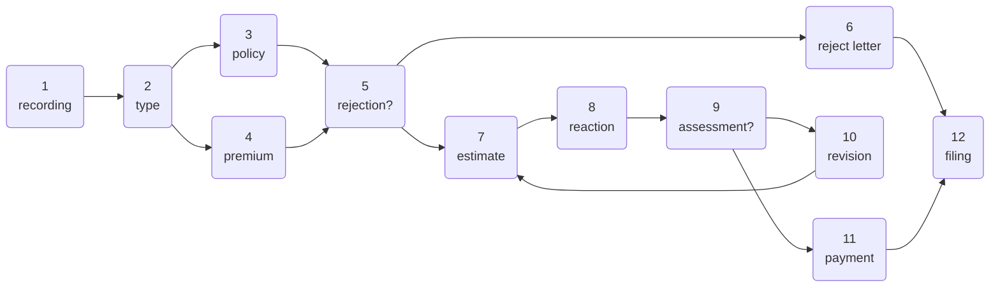
```mermaid
flowchart LR
    n1("1<br/>recording")
    n2("2<br/>type")
    n3("3<br/>policy")
    n4("4<br/>premium")
    n5("5<br/>rejection?")
    n6("6<br/>reject letter")
    n7("7<br/>estimate")
    n8("8<br/>reaction")
    n9("9<br/>assessment?")
    n10("10<br/>revision")
    n11("11<br/>payment")
    n12("12<br/>filing")

    n1 --> n2
    n2 --> n3
    n2 --> n4
    n3 --> n5
    n4 --> n5
    n5 --> n6
    n5 --> n7
    n6 --> n12
    n7 --> n8
    n8 --> n9
    n9 --> n10
    n10 --> n7
    n9 --> n11
    n11 --> n12
```

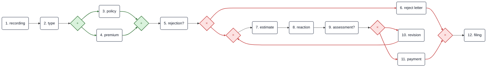
```mermaid
flowchart LR
    n1("1. recording")
    n2("2. type")
    n3("3. policy")
    n4("4. premium")
    n5("5. rejection?")
    n6("6. reject letter")
    n7("7. estimate")
    n8("8. reaction")
    n9("9. assessment?")
    n10("10. revision")
    n11("11. payment")
    n12("12. filing")

    gSplit{"+"}
    gJoin{"+"}
    gReject{"×"}
    gEstimate{"×"}
    gAssessment{"×"}
    gFiling{"×"}

    n1 --> n2
    n2 --> gSplit

    gSplit --> n3
    gSplit --> n4
    n3 --> gJoin
    n4 --> gJoin

    gJoin --> n5
    n5 --> gReject

    gReject --> n6
    gReject --> gEstimate
    n10 --> gEstimate
    gEstimate --> n7

    n7 --> n8
    n8 --> n9
    n9 --> gAssessment

    gAssessment --> n10
    gAssessment --> n11

    n6 --> gFiling
    n11 --> gFiling
    gFiling --> n12

    classDef task fill:#ffffff,stroke:#6b7280,stroke-width:2px,color:#111827;
    classDef parallel fill:#d9f2dc,stroke:#3f7d44,stroke-width:2px,color:#3f7d44;
    classDef exclusive fill:#fde2e2,stroke:#c94747,stroke-width:2px,color:#c94747;

    class n1,n2,n3,n4,n5,n6,n7,n8,n9,n10,n11,n12 task;
    class gSplit,gJoin parallel;
    class gReject,gEstimate,gAssessment,gFiling exclusive;

    linkStyle 2,3,4,5 stroke:#3f7d44,stroke-width:2px;
    linkStyle 8,9,10,15,16,17,18 stroke:#c94747,stroke-width:2px;
```

![[Pasted image 20260922094853.png]]

![[Pasted image 20260922104641.png]]

![[Pasted image 20260922104650.png]]


# 24/9

## 1. Perché introdurre le reti di Petri

I diagrammi di processo descrivono attività e percorsi possibili, ma per rispondere a domande come «qual è lo stato corrente del caso?» serve una semantica precisa dello stato e dei cambiamenti di stato. Le **reti di Petri** offrono una rappresentazione grafica semplice e una semantica formale per l'esecuzione dei processi. Qui sono impiegate come specifica **formale** (il comportamento delle istanze è definito senza ambiguità) e **astratta** (si prescinde dall'ambiente concreto di esecuzione). Le *workflow net* aggiungono vincoli strutturali adatti ai processi aziendali. (pp. 3–11, 40–46)

La notazione grafica va letta assieme alle regole sui token: due disegni simili possono ammettere esecuzioni diverse. Nei grafici Mermaid seguenti, i **cerchi** rappresentano *place*, i **rettangoli** rappresentano *transition* e `●` segnala un token iniziale. Mermaid è usato come schema didattico: la semantica è quella definita dalle formule, non dal motore di disegno.

## 2. Elementi di una rete

| Elemento | Simbolo usuale | Interpretazione possibile |
|---|---|---|
| **Place** (*posto*) | Cerchio | Stato, condizione, buffer, deposito di risorse |
| **Transition** (*transizione*) | Rettangolo | Attività, operazione, decisione, trasformazione |
| **Token** (*marca*) | Punto dentro un posto | Caso, documento, messaggio, risorsa o semplice attivazione |
| **Arc** (*arco*) | Freccia | Dipendenza tra un posto e una transizione |

Un arco ammesso va da **posto a transizione** oppure da **transizione a posto**. Nella rete trattata dalle slide non ci sono archi diretti posto–posto o transizione–transizione. Un arco $p\to t$ indica che $t$ consuma un token da $p$ quando scatta; un arco $t\to p$ indica che $t$ produce un token in $p$. (pp. 12–15)

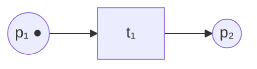
```mermaid
flowchart LR
    p1(("p₁ ●")) --> t1["t₁"]
    t1 --> p2(("p₂"))
```

**Attenzione:** il token non è un arco né un'attività. È contenuto in un posto e rappresenta l'informazione o la risorsa necessaria per abilitare una transizione.

### Definizione formale

Una rete di Petri marcata è una tupla

$$
N=(P,T,F,M_0),
$$

dove:

- $P$ è un insieme finito di posti;
- $T$ è un insieme finito di transizioni, con $P\cap T=\varnothing$;
- $F\subseteq(P\times T)\cup(T\times P)$ è la relazione di flusso, cioè l'insieme degli archi;
- $M_0:P\to\mathbb{N}$ è la **marcatura iniziale**: $M_0(p)$ è il numero di token inizialmente presenti in $p$.

Una marcatura generica $M:P\to\mathbb{N}$ descrive invece lo **stato corrente** della rete. La struttura $P,T,F$ resta fissa durante l'esecuzione, mentre la marcatura cambia. (pp. 23, 29–30)

### Pre-set e post-set

Per qualsiasi nodo $x\in P\cup T$:

$$
{}^{\bullet}x=\{y\mid(y,x)\in F\},
\qquad
x^{\bullet}=\{y\mid(x,y)\in F\}.
$$

In particolare, ${}^{\bullet}t$ sono i posti **di ingresso** di $t$ (da cui consuma token), mentre $t^{\bullet}$ sono i posti **di uscita** (in cui produce token). Per un posto $p$, ${}^{\bullet}p$ sono le transizioni che producono token in $p$ e $p^{\bullet}$ quelle che li consumano. (pp. 24–27)

## 3. Il token game: abilitazione e scatto

Una transizione $t$ è **abilitata** nella marcatura $M$ quando ciascun posto di ingresso contiene almeno un token:

$$
M\vdash t\ \text{abilitata}
\quad\Longleftrightarrow\quad
\forall p\in{}^{\bullet}t,\;M(p)\geq 1.
$$

Quando $t$ **scatta** (*fires*), consuma un token da ciascun posto di ingresso e produce un token in ciascun posto di uscita. Indicando con $M\xrightarrow{t}M'$ lo scatto:

$$
M'(p)=M(p)-\mathbf{1}_{p\in{}^{\bullet}t}
                 +\mathbf{1}_{p\in t^{\bullet}}.
$$

Qui $\mathbf{1}_{C}$ vale $1$ se la condizione $C$ è vera e $0$ altrimenti. Se un posto è sia ingresso sia uscita della stessa transizione, il consumo e la produzione si compensano. La formula riguarda le reti ordinarie delle slide, con archi non pesati. (pp. 28–30)

Lo scatto è **atomico**. La semantica adottata nelle slide è **interleaving**: possono essere abilitate più transizioni nello stesso momento, ma si considera uno scatto per volta. Questo non esclude che la rete rappresenti attività indipendenti; semplicemente, le loro possibili esecuzioni sono descritte tramite diversi ordini di scatto. Il numero complessivo di token può aumentare o diminuire. (p. 30)

### Esempio: due input, un output

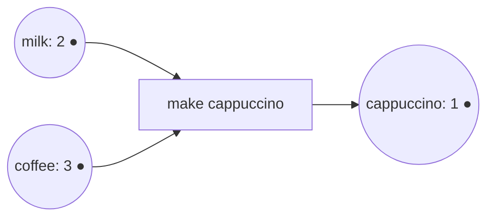
```mermaid
flowchart LR
    milk(("milk: 2 ●")) --> make["make cappuccino"]
    coffee(("coffee: 3 ●")) --> make
    make --> cup(("cappuccino: 1 ●"))
```

Con la marcatura mostrata nelle slide, $M(\text{milk})=2$, $M(\text{coffee})=3$ e $M(\text{cappuccino})=1$. Uno scatto di `make cappuccino` porta a $(1,2,2)$: consuma **un** token da ciascun input e aggiunge **un** token all'output. Dopo un secondo scatto la marcatura diventa $(0,1,3)$ e la transizione non è più abilitata, perché manca il latte. (p. 22)

### Esempio di evoluzione

Nell'esempio animato delle slide $t_1$ produce contemporaneamente token in $p_2$ e $p_3$; $t_2$ riporta un token da $p_3$ in $p_1$; $t_3$ usa $p_2$ e $p_3$ per produrre un token in $p_4$; $t_4$ riporta un token da $p_4$ in $p_3$. Con $M_0=\{p_1\}$, una sequenza possibile è: (pp. 31–39)

| Scatto | Marcatura dopo lo scatto | Transizioni abilitate subito dopo |
|---|---|---|
| Inizio | $\{p_1\}$ | $t_1$ |
| $t_1$ | $\{p_2,p_3\}$ | $t_2,t_3$ |
| $t_2$ | $\{p_1,p_2\}$ | $t_1$ |
| $t_1$ | $\{2p_2,p_3\}$ | $t_2,t_3$ |
| $t_3$ | $\{p_2,p_4\}$ | $t_4$ |
| $t_4$ | $\{p_2,p_3\}$ | $t_2,t_3$ |

La scrittura $2p_2$ significa **due token nello stesso posto** $p_2$. È utile controllare la marcatura dopo ogni scatto prima di decidere quale transizione può scattare.

## 4. Costrutti fondamentali

### Sequenza

Se $t_2$ richiede il token prodotto da $t_1$, $t_2$ può scattare solo dopo $t_1$. (p. 16)

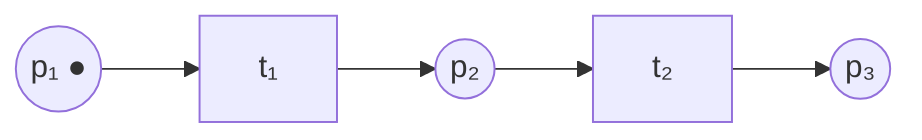
```mermaid
flowchart LR
    p1(("p₁ ●")) --> t1["t₁"] --> p2(("p₂")) --> t2["t₂"] --> p3(("p₃"))
```

### XOR split e XOR join

Uno **XOR split** nasce quando due transizioni competono per lo **stesso token** di ingresso. Se una scatta, consuma quel token e l'altra non può più scattare per quella stessa istanza. Uno **XOR join** riunisce alternative: ciascuna transizione di ingresso può alimentare lo stesso posto successivo, senza attendere l'altra. (pp. 17–18)

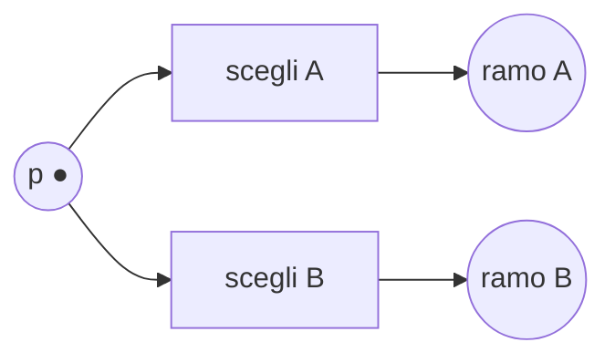
```mermaid
flowchart LR
    p(("p ●")) --> a["scegli A"] --> pa(("ramo A"))
    p --> b["scegli B"] --> pb(("ramo B"))
```

### AND split e AND join

Un **AND split** è una transizione con più posti di uscita: scattando produce un token **in ciascun ramo**. Un **AND join** è una transizione con più posti di ingresso: è abilitata solo quando **tutti** i rami richiesti hanno un token. (pp. 19–20)

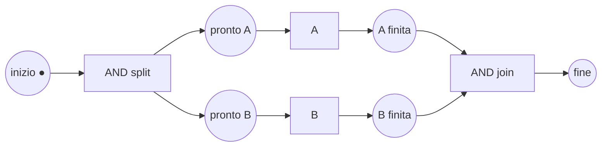
```mermaid
flowchart LR
    i(("inizio ●")) --> split["AND split"]
    split --> pa(("pronto A")) --> a["A"] --> da(("A finita")) --> join["AND join"]
    split --> pb(("pronto B")) --> b["B"] --> db(("B finita")) --> join
    join --> o(("fine"))
```

In questo esempio $A$ e $B$ possono avvenire in entrambi gli ordini, ma il join aspetta entrambe. Non basta disegnare due frecce: conta **se partono da una sola transizione** (produzione di due token) oppure **dallo stesso posto verso due transizioni** (competizione per un token).

### La figura chiamata «OR split»

Le slide mostrano una rete in cui da un posto si può scegliere una transizione che produce solo il ramo alto, solo il ramo basso, oppure entrambi. È quindi una realizzazione esplicita delle tre possibilità $\{A\}$, $\{B\}$ e $\{A,B\}$ mediante **transizioni distinte**. Non è un nuovo tipo primitivo di arco nella definizione formale della rete. (p. 21)

## 5. Workflow net (WfN)

Una **workflow net** è una rete di Petri $(P,T,F)$ che soddisfa questi vincoli **strutturali**:

1. esiste un posto iniziale distinto $i\in P$ con ${}^{\bullet}i=\varnothing$;
2. esiste un posto finale distinto $o\in P$ con $o^{\bullet}=\varnothing$;
3. ogni altro posto e ogni transizione appartengono ad **almeno un cammino** che va da $i$ a $o$.

Il token in $i$ rappresenta un caso non ancora iniziato; un token in $o$ rappresenta un caso terminato. Il terzo vincolo impedisce che parti della rete siano totalmente estranee al percorso di un caso. Per discutere l'esecuzione di un singolo caso si usa tipicamente la marcatura iniziale $M_0=[i]$: un token in $i$ e nessuno negli altri posti. (pp. 40–47)

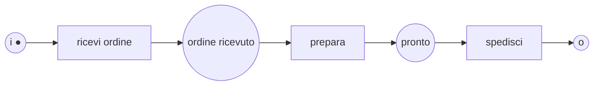
```mermaid
flowchart LR
    i(("i ●")) --> receive["ricevi ordine"] --> p(("ordine ricevuto"))
    p --> pack["prepara"] --> ready(("pronto")) --> send["spedisci"] --> o(("o"))
```

**Conseguenze strutturali:** $i$ è l'unico nodo senza archi entranti e $o$ l'unico nodo senza archi uscenti. Per esempio, se un altro nodo $v$ non avesse archi entranti, non potrebbe trovarsi lungo un cammino da $i$ a $o$, salvo coincidere con $i$. Analogamente per il nodo finale. (pp. 44–45)

Per riconoscere una WfN, controlla le **direzioni** degli archi, poi chiediti per ogni nodo: «esiste un cammino da $i$ fino a questo nodo e da qui fino a $o$?». Un ciclo può essere ammesso se i suoi nodi appartengono comunque a un cammino da $i$ a $o$. Se un arco torna in $i$, il posto scelto non ha più pre-set vuoto; se un ramo termina in un altro nodo senza poter raggiungere $o$, il terzo vincolo fallisce. (pp. 48–59)

> **Distinzione da ricordare:** appartenere a un cammino da $i$ a $o$ è una condizione sul **grafo**. Da sola non dimostra che tutti i cammini di esecuzione terminino, che non vi siano deadlock o che la marcatura finale contenga esattamente un token in $o$. Queste sono domande sul comportamento della rete.

## 6. Decorazioni grafiche e sottoprocessi

WoPeD mostra simboli decorati come **zucchero sintattico**: un'etichetta grafica compatta può essere espansa in una rete ordinaria. Per esempio, un AND split corrisponde a una transizione con più output; uno XOR split può essere espanso in transizioni alternative che condividono il posto di ingresso. Lo stesso vale per i join e per combinazioni di join e split. Le slide avvertono che alcune decorazioni si somigliano molto e che la loro posizione può cambiare il significato: per comprendere il comportamento, conviene espandere la forma abbreviata. (pp. 63–71)

La presenza di un unico ingresso e di un'unica uscita aiuta anche la **strutturazione gerarchica**: una transizione può essere raffinata da un'intera workflow net che rappresenta un sottoprocesso. (pp. 72–74)

## 7. Pattern di controllo nelle workflow net

Le slide riepilogano sequenza, parallelismo, scelta, iterazione e vincoli di capacità. (pp. 75–97)

| Pattern | Meccanismo nella rete | Proprietà da osservare |
|---|---|---|
| **Sequenza** | Token prodotto da $A$ e richiesto da $B$ | $B$ segue $A$ |
| **Parallelismo** | AND split, due rami, AND join | Si eseguono sia $A$ sia $B$, in qualunque ordine |
| **Scelta esplicita** | Transizione di scelta XOR, poi un ramo | La decisione si prende prima di abilitare $A$ o $B$ |
| **Scelta differita** | Due transizioni $A$ e $B$ competono per un token | Entrambe possono essere inizialmente abilitate; decide quella che scatta per prima |
| **Iterazione** | Arco di ritorno verso un punto precedente | Si ripete un'attività, con o senza esecuzione obbligatoria iniziale |
| **Capacità o esclusione** | Posto che rappresenta una risorsa condivisa | Una sola attivazione o attività concorrente usa la risorsa alla volta |

### Scelta esplicita e scelta differita

Nella **scelta esplicita**, una transizione decide il ramo prima che l'attività $A$ o $B$ sia abilitata. Nella **scelta differita/implicita**, $A$ e $B$ sono entrambe abilitate finché condividono il token; scattando, una consuma il token e disabilita l'altra. Il risultato «eseguo A oppure B» può apparire simile, ma **il momento della decisione cambia**. In BPMN le slide collegano questa distinzione allo XOR gateway rispetto alla scelta basata su eventi. (pp. 80–84, 105)

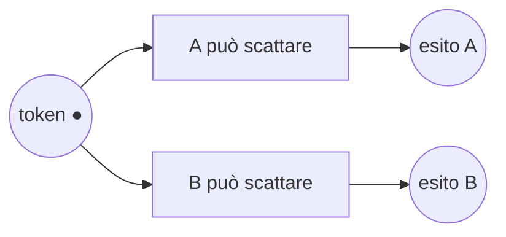
```mermaid
flowchart LR
    p(("token ●")) --> a["A può scattare"] --> endA(("esito A"))
    p --> b["B può scattare"] --> endB(("esito B"))
```

Il diagramma mostra la **scelta differita**: non esiste una transizione separata che selezioni il ramo prima di $A$ o $B$.

### Iterazione: almeno una volta oppure zero o più volte

Nel ciclo **one or more** il token deve passare per $A$ prima di arrivare al punto in cui si decide se ripeterla o uscire. Nel ciclo **zero or more** esiste una via d'uscita che evita $A$ già alla prima decisione. (pp. 85–92)

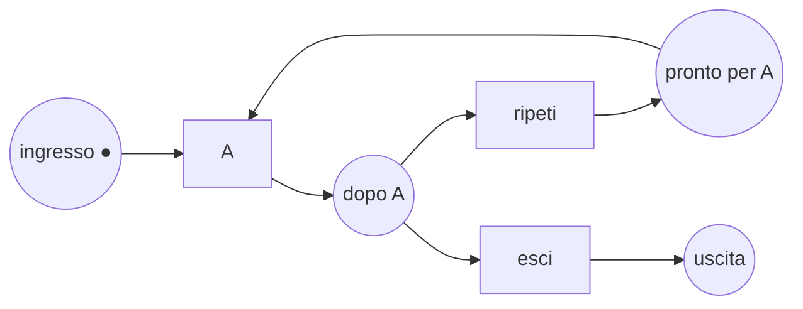
```mermaid
flowchart LR
    in(("ingresso ●")) --> a["A"] --> choice(("dopo A"))
    choice --> repeat["ripeti"] --> ready(("pronto per A")) --> a
    choice --> exit["esci"] --> out(("uscita"))
```

Questo schema rappresenta il caso **almeno una volta**. Per ottenere **zero o più volte**, il bivio va collocato *prima* di $A$, con un arco che arriva direttamente all'uscita.

### Posto come risorsa: capacità e mutua esclusione

Un posto con **un token di risorsa** può fungere da autorizzazione. La transizione d'ingresso in $A$ consuma quel token e quella d'uscita lo restituisce. Finché $A$ lo trattiene, un'altra attivazione che richiede la stessa risorsa deve aspettare: così si modellano «una pratica alla volta» o la mutua esclusione tra $A$ e $B$. Una diversa disposizione degli archi può imporre anche **alternanza**: $A$, poi $B$, poi di nuovo $A$. (pp. 93–95)

La mutua esclusione descrive quali attività non possono essere **contemporaneamente in corso**; non significa necessariamente che uno dei due rami venga omesso.

## 8. Trigger: chi o che cosa avvia una transizione

L'abilitazione data dai token può essere accompagnata da un **trigger**, cioè un'annotazione che specifica la causa esterna o l'iniziativa necessaria per avviare l'attività. Le slide distinguono: (pp. 98–104)

| Trigger | Significato | Esempio |
|---|---|---|
| Automatico | La transizione può partire automaticamente | Elaborazione interna |
| User | Un utente prende l'iniziativa | Invio manuale di una richiesta |
| External | Occorre un evento o messaggio esterno | Arriva una risposta |
| Time | Scade un timer | Invio di un sollecito |

Nell'esempio delle slide l'utente invia una richiesta; una risposta esterna può permettere di proseguire, mentre la scadenza di un timer può attivare un promemoria. I trigger **decorano** le transizioni e aggiungono informazione sul contesto di esecuzione; non cambiano la definizione strutturale di posto, transizione e arco.

## 9. Esercizio finale: gestione di un danno auto

La traccia delle slide descrive un'assicurazione che registra un sinistro, lo classifica come **semplice** o **complesso**, svolge i controlli, decide fra **OK** e **NOK** e invia comunque una lettera al cliente. Se l'esito è OK, effettua prima il pagamento. (pp. 106–108)

- **Sinistro semplice:** `check insurance` e `phone garage` sono indipendenti, quindi si avviano in parallelo e si attende che entrambi finiscano.
- **Sinistro complesso:** `check insurance` $\to$ `check damage history` $\to$ `phone garage`, in questo ordine.
- I due rami si riuniscono prima della decisione.
- **OK:** pagamento, poi lettera. **NOK:** lettera senza pagamento.

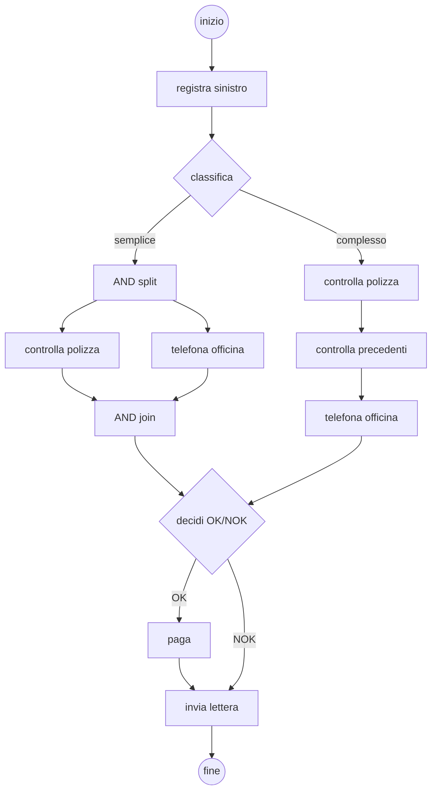
```mermaid
flowchart TD
    start(("inizio")) --> register["registra sinistro"] --> classify{"classifica"}
    classify -->|semplice| split["AND split"]
    split --> si["controlla polizza"] --> sj["AND join"]
    split --> sg["telefona officina"] --> sj
    classify -->|complesso| ci["controlla polizza"] --> ch["controlla precedenti"] --> cg["telefona officina"]
    sj --> decide{"decidi OK/NOK"}
    cg --> decide
    decide -->|OK| pay["paga"] --> letter["invia lettera"]
    decide -->|NOK| letter
    letter --> finish(("fine"))
```

Questo diagramma riassume il **flusso del caso**. In una rete di Petri espansa si inseriscono posti tra transizioni consecutive e si realizzano i bivi XOR con transizioni alternative. Nel ramo semplice l'AND join richiede due token, uno per ciascun compito concluso. Nel ramo complesso i compiti restano in sequenza. Il pagamento appartiene soltanto al ramo OK, mentre la lettera è raggiungibile da entrambi gli esiti.

## 10. Domande utili per l'orale

1. Quali sono i quattro componenti di $(P,T,F,M_0)$ e che cosa rappresenta una marcatura?
2. Che differenza c'è tra posto, transizione e token?
3. Che cosa sono ${}^{\bullet}t$ e $t^{\bullet}$? Come si definiscono per un posto?
4. Quando una transizione è abilitata? Come si calcola la nuova marcatura dopo lo scatto?
5. Cosa significa che lo scatto è atomico e la semantica è interleaving?
6. Qual è la differenza strutturale e comportamentale tra XOR split e AND split?
7. Perché un AND join deve attendere token da tutti i suoi ingressi?
8. Quali sono le tre condizioni che definiscono una workflow net?
9. Perché una workflow net ha un unico nodo senza archi entranti e uno senza archi uscenti?
10. La sola definizione di workflow net garantisce che ogni caso finisca correttamente? Perché?
11. Come si distingue una scelta esplicita da una scelta differita?
12. Come si costruiscono cicli con una o più esecuzioni e con zero o più esecuzioni?
13. Come può un singolo token rappresentare una risorsa che impone mutua esclusione?
14. Quali trigger compaiono nelle slide e cosa aggiungono alla rete?
15. Come modelleresti i due tipi di sinistro dell'esercizio finale e perché il ramo semplice richiede un AND join?

### Schema conclusivo

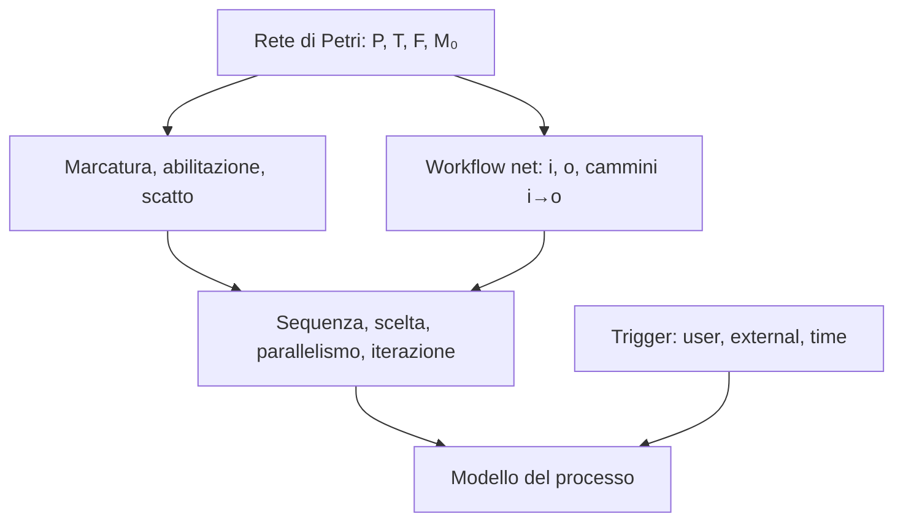
```mermaid
flowchart TD
    net["Rete di Petri: P, T, F, M₀"] --> semantics["Marcatura, abilitazione, scatto"]
    net --> wfn["Workflow net: i, o, cammini i→o"]
    semantics --> patterns["Sequenza, scelta, parallelismo, iterazione"]
    wfn --> patterns
    patterns --> process["Modello del processo"]
    triggers["Trigger: user, external, time"] --> process
```