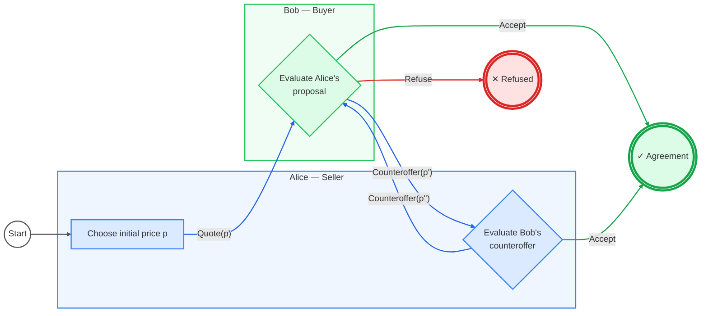

# 1. Objective

>Alice wants to sell her car, Bob is interested in buying it. Alice asks some quote. Bob can accept the bargain, refuse it or make a counteroffer. Alice can accept or make a counteroffer and so on, Until either the bargain is accepted or refused.

Send your solutions to: bruni@di.unipi.it

Bob can:

1. accept the proposal;
2. refuse the proposal;
3. send a counteroffer.

If Bob sends a counteroffer, Alice can:

1. accept it;
2. send another counteroffer.

---

# 2. Diagrammatic Notation

The following visual notation is used.

| Element | Notation | Meaning |
|---|---|---|
| Alice | Blue area | States and actions belonging to Alice |
| Bob | Green area | States and actions belonging to Bob |
| Start | Circle | Beginning of the negotiation |
| Decision | Diamond | Evaluation of the received proposal |
| Quote / Counteroffer | Blue arrow | A price proposal is sent to the other actor |
| Accept | Green arrow | The current proposal is accepted |
| Refuse | Red arrow | The negotiation is refused |
| Successful termination | Double green circle | Agreement reached |
| Failed termination | Double red circle | Negotiation terminated without agreement |

The notation separates two different concepts:

- **shapes represent states** of the negotiation;
- **arrows represent messages/actions** exchanged by the actors.

The colour of a message represents its semantic meaning:

- 🔵 **blue** → price proposal;
- 🟢 **green** → acceptance;
- 🔴 **red** → refusal.

---

# 3. Negotiation Protocol

The protocol starts with Alice choosing an initial price \(p\) and sending it
to Bob:

$Alice \xrightarrow{\operatorname{Quote}(p)} Bob$

Bob evaluates Alice's proposal.

He has three possible choices.

### Accept

Bob accepts the proposed price:

$Bob \xrightarrow{\operatorname{Accept}} Agreement$

The negotiation terminates successfully.

### Refuse

Bob refuses the proposal:

$Bob \xrightarrow{\operatorname{Refuse}} Rejected$

The negotiation terminates without an agreement.

### Counteroffer

Bob proposes a different price \(p'\):

$Bob \xrightarrow{\operatorname{Counteroffer}(p')} Alice$

Alice must now evaluate Bob's proposal.

Alice has two alternatives.

### Accept Bob's counteroffer

$Alice \xrightarrow{\operatorname{Accept}} Agreement$

The negotiation terminates successfully.

### Make another counteroffer

Alice proposes another price \(p''\):

$Alice \xrightarrow{\operatorname{Counteroffer}(p'')} Bob$

Control returns to Bob and the negotiation continues.

---

# 4. Diagram



---

# 6. Properties of the Model

## Absence of dead states

Every non-final state has at least one possible outgoing transition.

Bob's decision state has:

$Out(B)=\{Accept,\,Refuse,\,Counteroffer\}$

while Alice's decision state has:

$Out(A)=\{Accept,\,Counteroffer\}$

Therefore, the protocol does not contain an intermediate state from which no
action is possible.

---

## Terminal states

The protocol has two terminal outcomes.

### Successful termination

```text
Agreement
```

The current proposal has been accepted.

### Unsuccessful termination

```text
Refused
```

Bob has rejected the negotiation.

Neither final state has outgoing transitions.

---

## Negotiation loop

Counteroffers create a cycle:

$Bob\rightarrow Alice\rightarrow Bob\rightarrow Alice\rightarrow \cdots$

Therefore, an arbitrary number of counteroffers is possible.

---

## Termination

The protocol **does not guarantee termination**.

For example, the following behaviour is theoretically possible:

$Counteroffer\rightarrow Counteroffer\rightarrow Counteroffer\rightarrow \cdots$

The negotiation terminates only if eventually:

- Alice or Bob sends `Accept`, or
- Bob sends `Refuse`.

Thus:

$\text{Accept} \lor \text{Refuse}\Rightarrow\text{termination}$

but an infinite sequence of counteroffers remains possible.

---

# 8. Design Rationale

The notation has been designed to keep different concepts visually distinct.

Actor identity is represented by the **background area**:

- blue for Alice;
- green for Bob.

The state of the protocol is represented by the **shape of the node**:

- circles for initial/final states;
- diamonds for decision states.

Communication is represented using **directed arrows**.

The semantic meaning of the communication is represented by colour:

- blue for proposals and counteroffers;
- green for acceptance;
- red for refusal.


