# 16/9

## Obiettivi della lezione

La lezione introduce il lessico e gli strumenti quantitativi necessari per ragionare sulla scalabilità. Il punto centrale del corso non è memorizzare tecnologie o architetture specifiche, ma comprendere **perché** determinate scelte progettuali funzionano o falliscono quando crescono carico, dati e risorse.

Il metodo seguito nel corso è:

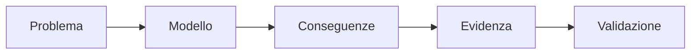

Un sistema deve quindi essere descritto attraverso ipotesi esplicite, misurato e infine validato. Le tecnologie servono a rendere concreto il modello, non a sostituirlo.

## 1. Sistemi distribuiti

### 1.1 Definizione operativa

Un **sistema distribuito** è formato da elementi di calcolo autonomi che cooperano attraverso la comunicazione, offrendo a utenti o applicazioni l'esperienza di un sistema coerente.

Le tre proprietà essenziali sono:

- **autonomia**: ciascun nodo possiede risorse e stato di esecuzione propri;
- **comunicazione**: i nodi scambiano informazioni per cooperare;
- **coerenza percepita**: l'insieme deve presentarsi come un servizio unitario.

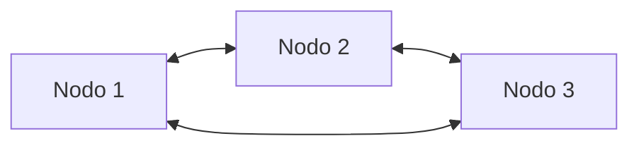

La distribuzione non rende automaticamente un sistema scalabile: introduce anche comunicazione, coordinamento, stato condiviso e possibilità di guasti parziali.

## 2. La domanda di scalabilità

Un sistema che funziona per mille utenti non è necessariamente lo stesso problema di un sistema destinato a un milione di utenti. Cambiando scala possono crescere:

- tasso di arrivo delle richieste;
- concorrenza;
- volume dei dati;
- domanda di risorse;
- pressione sui requisiti di latenza;
- rischio operativo.

I requisiti di correttezza, disponibilità e tempo di risposta non scompaiono mentre il carico cresce. La scalabilità riguarda proprio la capacità di conservare un comportamento accettabile durante questa crescita.

### 2.1 Il numero di utenti non descrive il workload

Dire “un milione di utenti” non basta. Occorre precisare almeno:

- il processo di arrivo, indicato per esempio con $\lambda(t)$;
- il costo medio di una richiesta;
- il mix di operazioni;
- la distribuzione temporale delle richieste;
- la quantità di stato letta o modificata.

Due workload possono contenere lo stesso numero totale di richieste ma produrre pressioni istantanee molto diverse.

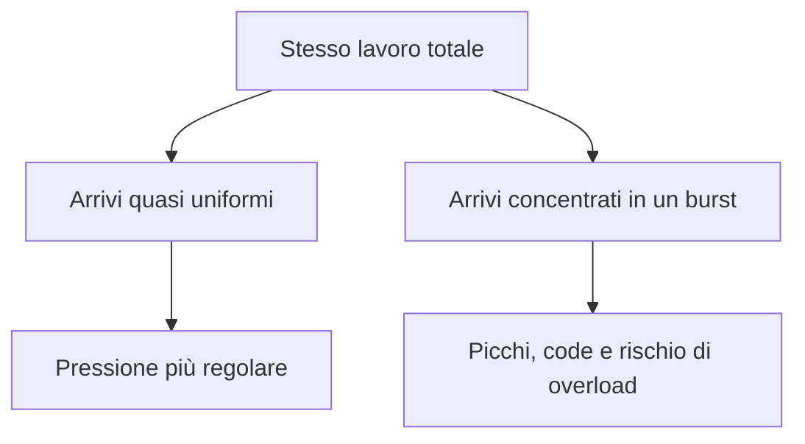

Un workload **bursty** solleva inoltre una decisione di capacity planning: dimensionare il sistema per il picco, per il carico medio oppure accettare una degradazione controllata della qualità durante i picchi.

### 2.2 Dimensioni della scalabilità

La scalabilità è multidimensionale. Una dichiarazione di scalabilità deve specificare quale dimensione cresce:

| Dimensione | Domanda principale |
|---|---|
| Carico | Il sistema conserva prestazioni accettabili con più richieste o lavoro? |
| Dati/dimensione | Riesce a gestire dataset e stato più grandi? |
| Geografia | Funziona su distanze e regioni più ampie? |
| Amministrazione | Rimane gestibile con più organizzazioni, team o domini? |

Secondo la prospettiva di Bondi, la **load scalability** riguarda la capacità di operare in modo graduale sotto carichi maggiori o minori, evitando ritardi eccessivi, spreco di risorse e contesa improduttiva.

Quando la capacità aggiuntiva viene ottenuta mediante più nodi cooperanti, il problema di scalabilità diventa anche un problema di sistemi distribuiti.

## 3. Due regimi sperimentali

Prima di misurare la scalabilità bisogna distinguere tra un lavoro finito e un servizio continuo.

| Caso | Domanda |
|---|---|
| Computazione finita | Quanto diminuisce il tempo di completamento aggiungendo risorse? |
| Servizio continuo | Come si legano throughput, latenza, capacità e concorrenza? |

### 3.1 Strong scaling

Nello **strong scaling** il workload totale rimane costante mentre cresce il numero $p$ di risorse:

$$
W_{\text{tot}} = \text{costante}, \qquad p \uparrow
$$

La domanda è: **quanto più velocemente posso completare lo stesso lavoro?**

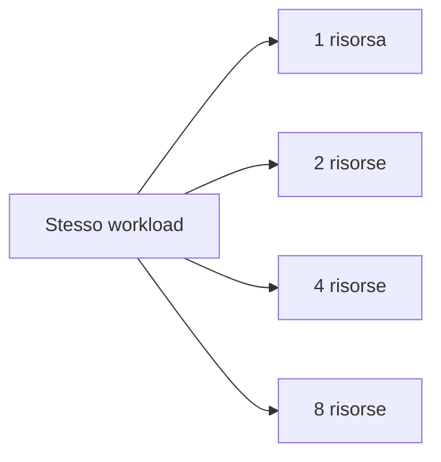

È utile per elaborazioni con una quantità di lavoro fissata e una scadenza, per esempio una simulazione o un job batch che deve terminare il prima possibile.

### 3.2 Weak scaling

Nel **weak scaling** il lavoro per risorsa rimane costante: aumentando le risorse cresce proporzionalmente anche il workload.

$$
\frac{W(p)}{p} = \text{costante}, \qquad p \uparrow
$$

La domanda è: **quanto lavoro in più posso gestire mantenendo comparabile la pressione su ciascuna risorsa?**

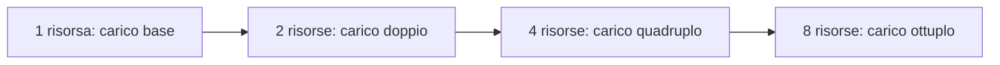

Questa prospettiva è particolarmente importante per servizi web, motori di ricerca e sistemi nei quali il numero di utenti o la quantità di dati continua a crescere.

> [!important]
> Strong e weak scaling sono **regimi sperimentali**: descrivono come varia il workload durante una misura. Non sono sinonimi delle leggi di Amdahl e Gustafson, che sono invece modelli analitici.

## 4. Speedup ed efficienza

Sia $T(1)$ il tempo necessario a completare un workload con una risorsa e $T(p)$ il tempo con $p$ risorse.

### 4.1 Speedup

Lo **speedup** è:

$$
S(p) = \frac{T(1)}{T(p)}
$$

Nel caso ideale:

$$
S(p) = p
$$

Questo significa che raddoppiando le risorse il tempo si dimezza. Nei sistemi reali lo speedup è normalmente sublineare a causa di parti seriali, comunicazione, sincronizzazione, sbilanciamento e overhead di scheduling.

### 4.2 Efficienza

L'**efficienza** misura la frazione dello speedup lineare ideale effettivamente ottenuta:

$$
E(p) = \frac{S(p)}{p}
$$

- $E(p)=1$: uso ideale delle risorse;
- $0<E(p)<1$: una parte della capacità aggiunta non si traduce in speedup;
- una forte diminuzione di $E(p)$ indica rendimenti decrescenti.

### 4.3 Esempio

| $p$ | $T(p)$ in secondi | $S(p)=T(1)/T(p)$ | $E(p)=S(p)/p$ |
|---:|---:|---:|---:|
| $1$ | $100$ | $1.00$ | $1.00$ |
| $2$ | $54$ | $1.85$ | $0.93$ |
| $4$ | $31$ | $3.23$ | $0.81$ |
| $8$ | $21$ | $4.76$ | $0.60$ |
| $16$ | $17$ | $5.88$ | $0.37$ |

Con $16$ risorse il sistema è più veloce, ma conserva solo il $37\%$ dell'efficienza ideale. Aggiungere risorse aiuta, ma non linearmente.

## 5. Legge di Amdahl

### 5.1 Ipotesi

Per un workload fisso, sia:

- $s$ la frazione del **tempo di esecuzione** non parallelizzabile;
- $1-s$ la frazione perfettamente parallelizzabile;
- $p$ il numero di risorse.

La legge di Amdahl fornisce lo speedup teorico:

$$
S_A(p) = \frac{1}{s + \frac{1-s}{p}}
$$

> [!warning]
> $s$ è una frazione del **tempo**, non una percentuale di righe di codice. Una piccola parte del programma può occupare una parte significativa del tempo totale.

### 5.2 Esempio con $s=0.05$

Con quattro risorse:

$$
S_A(4) = \frac{1}{0.05 + \frac{0.95}{4}} \approx 3.48
$$

Con sedici risorse:

$$
S_A(16) = \frac{1}{0.05 + \frac{0.95}{16}} \approx 9.14
$$

Le risorse aggiuntive continuano ad aiutare, ma il guadagno marginale diminuisce.

### 5.3 Limite asintotico

Quando $p$ tende all'infinito, la parte parallelizzabile tende idealmente a zero, ma la parte seriale rimane:

$$
\lim_{p\to\infty} S_A(p) = \frac{1}{s}
$$

Con $s=0.05$:

$$
\lim_{p\to\infty} S_A(p) = 20
$$

Neppure un numero infinito di risorse permetterebbe di superare uno speedup di $20$ nel modello.

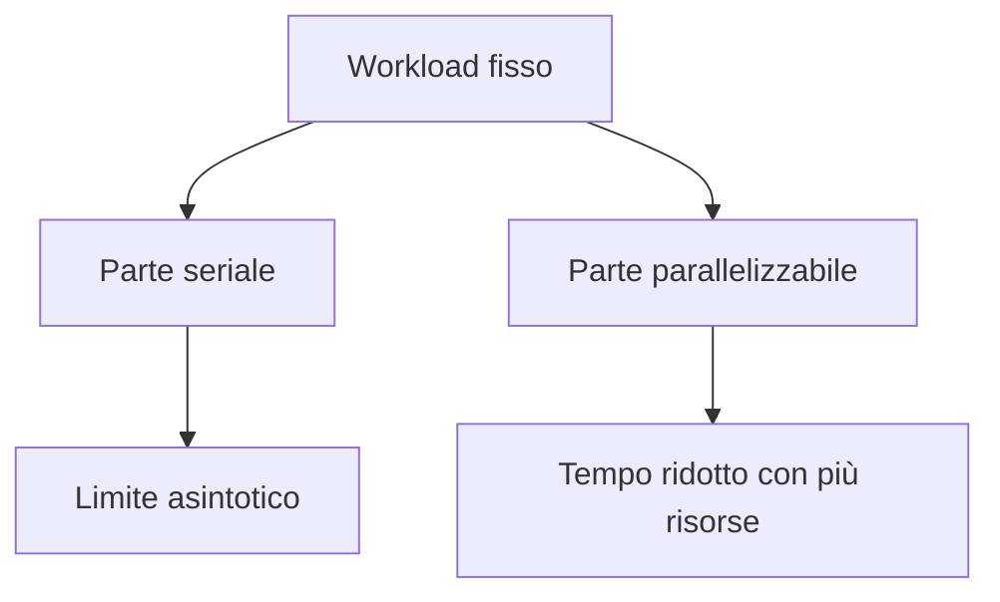

### 5.4 Cosa include e cosa trascura

Il modello include un workload fisso, una parte seriale e una parte idealmente parallelizzabile. Non rende espliciti:

- overhead di comunicazione;
- costi di sincronizzazione;
- load imbalance;
- effetti di cache;
- overhead di scheduling.

La lezione pratica è che, per migliorare lo strong scaling, non basta aggiungere risorse: bisogna ridurre o eliminare la parte non scalabile.

## 6. Legge di Gustafson

Amdahl mantiene fisso il problema. Gustafson cambia domanda: se sono disponibili più risorse, perché non usarle per risolvere un problema più grande?

Nel modello di **scaled-size computing**, $s$ è la frazione seriale misurata rispetto al tempo di esecuzione parallelo. Lo speedup scalato è:

$$
S_G(p) = p - s(p-1)
$$

### 6.1 Esempio

Per $p=64$ e $s=0.05$:

$$
S_G(64) = 64 - 0.05(64-1) = 60.85
$$

Il risultato non contraddice Amdahl: i due modelli rispondono a domande diverse.

| Amdahl | Gustafson |
|---|---|
| Workload fisso | Workload scalato |
| Quanto più velocemente completo lo stesso lavoro? | Quanto più grande può essere il problema mantenendo comparabile l'esecuzione? |
| Evidenzia il limite della parte seriale | Evidenzia il lavoro aggiuntivo assorbibile con più risorse |

## 7. Dai job finiti ai servizi continui: legge di Little

Per un servizio continuo non esiste un unico job da completare: il lavoro continua ad arrivare. Diventano centrali throughput, latenza e numero di richieste contemporaneamente presenti nel sistema.

### 7.1 Definire il confine

Prima di applicare la legge bisogna scegliere il **system boundary**. Solo ciò che si trova dentro quel confine viene contato nel numero di elementi e nel tempo di permanenza.

Siano:

- $\lambda$: tasso medio di arrivo o throughput, espresso per esempio in richieste al secondo;
- $W$: tempo medio trascorso da una richiesta nel sistema;
- $L$: numero medio di richieste presenti nel sistema, cioè lavoro *in flight*.

In condizioni appropriate di stazionarietà e finitezza:

$$
L = \lambda W
$$

Le unità sono coerenti:

$$
\frac{\text{richieste}}{\text{secondo}} \cdot \text{secondi} = \text{richieste}
$$

### 7.2 Esempio

Se:

$$
\lambda = 1000\ \text{richieste/s}, \qquad W=0.2\ \text{s}
$$

allora:

$$
L = 1000 \cdot 0.2 = 200
$$

In media ci sono $200$ richieste all'interno del confine scelto.

Se il tempo medio raddoppia mentre il throughput resta invariato:

$$
W=0.4\ \text{s} \quad \Longrightarrow \quad L=400
$$

Raddoppia quindi il lavoro contemporaneamente presente nel sistema, con maggiori necessità di memoria, thread, connessioni o altre risorse.

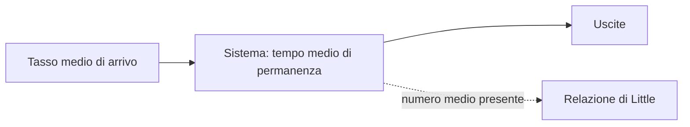

### 7.3 Cosa non dice la legge di Little

La legge mette in relazione medie di lungo periodo, ma non determina:

- il valore del tempo di risposta $W$;
- la capacità massima;
- l'effetto della burstiness;
- la distribuzione delle latenze;
- il comportamento durante overload o transitori.

Serve quindi come identità utile per il dimensionamento e per riconoscere accumuli di lavoro, non come modello completo di coda.

## 8. Scale-up e scale-out

### 8.1 Scale-up

Lo **scale-up** aumenta la capacità di una singola istanza: più CPU, memoria, storage o hardware più veloce. Non crea necessariamente un sistema distribuito.

### 8.2 Scale-out

Lo **scale-out** aggiunge nodi o istanze cooperanti. Permette di superare i limiti fisici ed economici di una singola macchina, ma introduce problemi distribuiti.

| Scale-up | Scale-out |
|---|---|
| Una singola istanza più potente | Più istanze cooperanti |
| Semplicità architetturale relativa | Comunicazione e coordinamento |
| Limiti fisici ed economici del nodo | Capacità potenzialmente più elastica |
| Non implica distribuzione | Implica normalmente problemi distribuiti |

### 8.3 Quando basta un load balancer

La replica orizzontale è più semplice quando:

- le richieste sono indipendenti;
- i worker sono intercambiabili;
- non esiste stato mutabile condiviso.

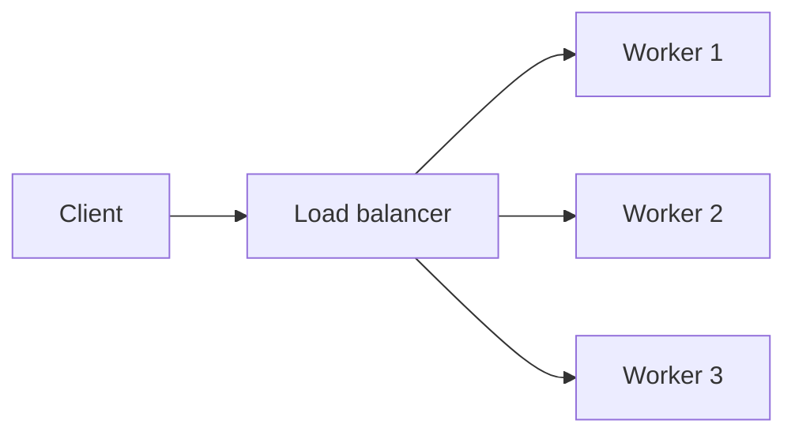

Questa architettura aumenta la capacità solo finché non emerge un nuovo collo di bottiglia.

Se si aggiungono stato condiviso, interazioni remote, invarianti distribuiti o guasti parziali, i worker cessano di essere realmente indipendenti.

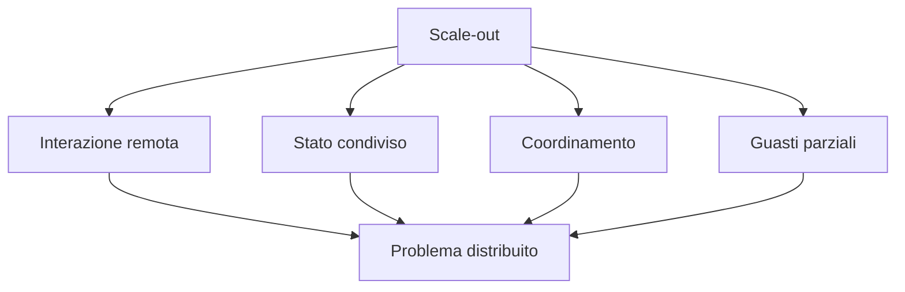

## 9. Errori concettuali da evitare

1. **Dire che un sistema scala senza specificare rispetto a cosa.** Bisogna dichiarare workload, risorse e proprietà richieste.
2. **Usare il numero di utenti come descrizione completa del carico.** Mancano frequenza, mix, costo e distribuzione temporale delle richieste.
3. **Confondere strong scaling con Amdahl e weak scaling con Gustafson.** I primi sono regimi sperimentali, i secondi modelli analitici.
4. **Interpretare $s$ come frazione del codice.** È la frazione del tempo di esecuzione che rimane seriale nel modello.
5. **Pensare che Little determini la latenza.** La legge lega tre medie, ma non spiega da sola da dove derivi $W$.
6. **Pensare che più nodi eliminino automaticamente i limiti.** I colli di bottiglia possono spostarsi verso stato, rete, coordinamento o load balancer.

## 10. Formulario essenziale

| Concetto | Formula |
|---|---|
| Speedup | $S(p)=\dfrac{T(1)}{T(p)}$ |
| Efficienza | $E(p)=\dfrac{S(p)}{p}$ |
| Amdahl | $S_A(p)=\dfrac{1}{s+\frac{1-s}{p}}$ |
| Limite di Amdahl | $\displaystyle\lim_{p\to\infty}S_A(p)=\dfrac{1}{s}$ |
| Gustafson | $S_G(p)=p-s(p-1)$ |
| Little | $L=\lambda W$ |

## 11. Possibili domande d'esame

### Che cosa deve contenere una dichiarazione di scalabilità?

Deve indicare la dimensione che cresce, il modello del workload, le risorse disponibili e le proprietà che devono rimanere accettabili. “Supporta un milione di utenti” è insufficiente perché non specifica arrivi, costo e mix delle richieste.

### Qual è la differenza tra strong e weak scaling?

Nello strong scaling il workload rimane fisso e si misura la riduzione del tempo aggiungendo risorse. Nel weak scaling cresce sia il workload sia il numero di risorse, mantenendo circa costante il lavoro per risorsa.

### Perché Amdahl limita lo speedup?

La frazione seriale $s$ non beneficia delle risorse aggiuntive. Quando la parte parallelizzabile diventa trascurabile, il tempo seriale domina e lo speedup tende a $1/s$.

### Amdahl e Gustafson si contraddicono?

No. Amdahl considera un problema di dimensione fissa; Gustafson considera un problema che cresce con le risorse. Cambia la domanda sperimentale, quindi cambia l'interpretazione dello speedup.

### Come si interpreta $L=\lambda W$?

Se arrivano in media $\lambda$ richieste al secondo e ciascuna resta nel sistema per $W$ secondi, allora nel sistema sono presenti mediamente $L$ richieste. Il confine del sistema deve essere scelto esplicitamente.

## 12. Sintesi finale

- La scalabilità richiede un modello esplicito di carico e risorse.
- Strong e weak scaling misurano scenari diversi.
- Speedup ed efficienza permettono di quantificare il beneficio delle risorse aggiunte.
- Amdahl mostra il limite imposto dalla parte seriale di un workload fisso.
- Gustafson mostra quanto lavoro aggiuntivo possa essere trattato facendo crescere il problema.
- Little collega throughput, tempo nel sistema e lavoro in corso.
- Lo scale-out introduce distribuzione e, con essa, comunicazione, stato, coordinamento e guasti parziali.

## 13. Indicazioni organizzative emerse durante la lezione

La trascrizione presenta due modalità principali per il lavoro d'esame:

1. una relazione ragionata con analisi critica di un tema concordato;
2. un piccolo progetto, preferibilmente svolto in due persone, centrato su distribuzione e scalabilità.

In entrambi i casi è previsto un orale: la parte principale riguarda il progetto o la relazione, mentre la parte rimanente riguarda gli argomenti del corso. Le indicazioni definitive vanno comunque verificate nelle comunicazioni ufficiali del docente.

## Riferimenti principali

- G. M. Amdahl, *Validity of the Single Processor Approach to Achieving Large Scale Computing Capabilities*, 1967.
- J. L. Gustafson, *Reevaluating Amdahl's Law*, 1988.
- J. D. C. Little, *A Proof for the Queuing Formula: $L=\lambda W$*, 1961.
- A. B. Bondi, *Characteristics of Scalability and Their Impact on Performance*, 2000.
- M. van Steen e A. S. Tanenbaum, *A Brief Introduction to Distributed Systems*, 2016.

# 18/9

## Obiettivo della lezione

La replica orizzontale è semplice quando le richieste sono indipendenti e i worker sono intercambiabili. Quando queste ipotesi vengono rimosse, stato, decisioni e dipendenze devono essere collocati da qualche parte.

L'architettura deve quindi rispondere a quattro domande ricorrenti:

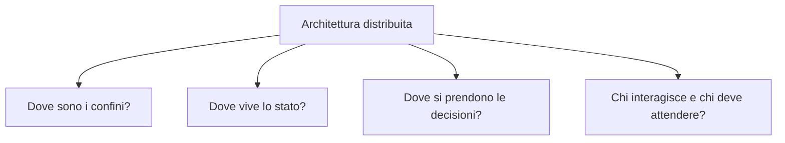

L'idea fondamentale è che i vincoli di scalabilità non vengono semplicemente eliminati: quando l'architettura cambia, essi spesso **si spostano**.

## 1. Decomposizione e confini

### 1.1 Prima della decomposizione

In un sistema monolitico, computazione, stato e decisioni si trovano nello stesso confine. Chiamate di funzione e accessi in memoria sono locali.

Decomporre il sistema significa scegliere parti separate. Dopo la decomposizione:

- una chiamata locale può diventare un'interazione di protocollo;
- un accesso in memoria può diventare un accesso remoto allo stato;
- errori e ritardi di rete entrano nel cammino di esecuzione;
- diventano espliciti i problemi di ownership e coordinamento.

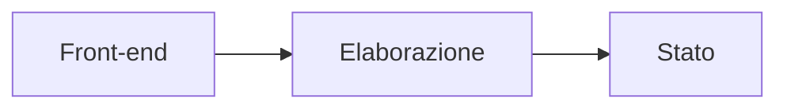

I confini migliorano separazione e distribuzione del lavoro, ma trasformano alcune dipendenze locali in comunicazione remota.

### 1.2 Il criterio di Parnas

Secondo Parnas, un sistema può essere decomposto in modi diversi. La decomposizione va scelta in base alle decisioni progettuali che ogni modulo deve **nascondere e localizzare**.

Nel caso distribuito questo principio ha un'ulteriore conseguenza: la decomposizione determina quali dipendenze potranno attraversare i confini delle macchine.

Esempio concettuale: la crescita di un'organizzazione o di un prodotto non aumenta soltanto il carico, ma può rendere la struttura del software troppo accoppiata, difficile da separare e lenta da distribuire.

## 2. Architettura come grafo di dipendenze

### 2.1 Modello

Un'architettura può essere rappresentata come un grafo:

$$
G=(V,E)
$$

dove:

- $V$ è l'insieme dei componenti;
- $E$ è l'insieme delle dipendenze che richiedono scambio di informazioni.

La decomposizione sceglie i componenti. Il **placement** sceglie dove eseguirli. Se $H$ è l'insieme degli host:

$$
\pi:V\to H
$$

e $\pi(v)$ indica l'host sul quale è collocato il componente $v$.

### 2.2 Dipendenze locali e remote

Una dipendenza $(u,v)$ è remota quando i due componenti sono collocati su host diversi. L'insieme degli archi tagliati dal placement è:

$$
E_{\text{cut}}(\pi)=\{(u,v)\in E:\pi(u)\neq\pi(v)\}
$$

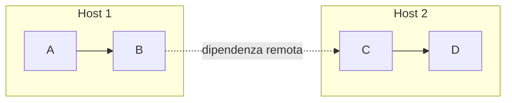

Se ogni dipendenza $e$ trasferisce $w_e$ byte per unità di lavoro, un primo modello del volume di comunicazione è:

$$
C_{\text{edge}}(\pi)=\sum_{e\in E_{\text{cut}}(\pi)}w_e
$$

Lo stesso grafo, le stesse macchine e la stessa computazione possono produrre volumi di comunicazione differenti a seconda del placement.

### 2.3 Limite del modello a grafo

Il taglio degli archi è una semplificazione. Tre archi potrebbero rappresentare tre messaggi distinti, oppure la distribuzione dello stesso dato a tre consumatori. Contare ogni arco separatamente può quindi sovrastimare o rappresentare male la comunicazione reale.

## 3. Ipergrafi e dipendenze condivise

### 3.1 Definizione

Un **ipergrafo** è:

$$
\mathcal{H}=(V,N)
$$

dove ciascun iperarco, o *net*, $n\in N$ può collegare un sottoinsieme arbitrario di vertici.

Un unico iperarco può rappresentare un dato prodotto da un componente e richiesto da più consumatori.

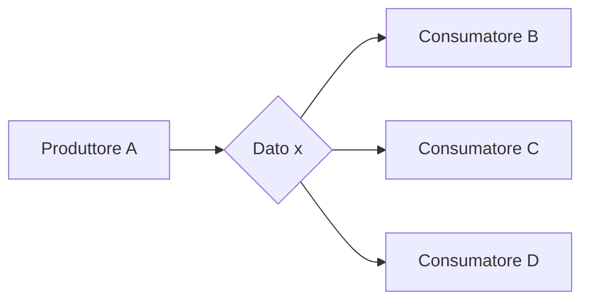

Il nodo centrale nel diagramma è solo una resa grafica: nel modello $x$ è un iperarco che collega $A$, $B$, $C$ e $D$.

### 3.2 Connettività di un iperarco

Data una partizione:

$$
\Pi=\{V_1,\ldots,V_p\}
$$

la connettività dell'iperarco $n$ è:

$$
\lambda_n(\Pi)=\left|\{i:n\cap V_i\neq\varnothing\}\right|
$$

$\lambda_n$ indica quante partizioni sono toccate dall'iperarco.

- Se il dato tocca due partizioni, $\lambda_n-1=1$.
- Se ne tocca tre, $\lambda_n-1=2$.

Il termine $\lambda_n-1$ ha un significato fisico: se una partizione possiede il dato e il dato è richiesto complessivamente in $\lambda_n$ partizioni, deve essere inviato alle altre $\lambda_n-1$.

### 3.3 Metrica connectivity-1

Se l'iperarco $n$ rappresenta $c_n$ unità di dati, il volume di comunicazione è modellato da:

$$
C(\Pi)=\sum_{n\in N}c_n\bigl(\lambda_n(\Pi)-1\bigr)
$$

### 3.4 Esempio pesato

Consideriamo:

$$
n_x=\{A,B,C\}, \qquad c_x=10\ \text{MB}
$$

$$
n_y=\{C,D\}, \qquad c_y=1\ \text{MB}
$$

Per il placement $\Pi_A$ si ha $\lambda_x=2$ e $\lambda_y=1$:

$$
C(\Pi_A)=10(2-1)+1(1-1)=10\ \text{MB}
$$

Per il placement $\Pi_B$ si ha $\lambda_x=2$ e $\lambda_y=2$:

$$
C(\Pi_B)=10(2-1)+1(2-1)=11\ \text{MB}
$$

Non sono cambiati computazione, numero di nodi o bilanciamento; è cambiato soltanto il placement dei componenti dipendenti.

## 4. Località contro bilanciamento

Se l'unico obiettivo fosse minimizzare la comunicazione, la soluzione sarebbe collocare tutto in una sola partizione:

$$
V_1=V, \qquad V_2=\cdots=V_p=\varnothing
$$

ottenendo:

$$
C(\Pi)=0
$$

Questa soluzione ha località perfetta ma non distribuisce il lavoro. Bisogna quindi ottimizzare insieme comunicazione e bilanciamento.

Sia $W(V)$ il lavoro computazionale totale. Il carico ideale per $p$ partizioni è:

$$
\frac{W(V)}{p}
$$

Poiché un bilanciamento perfetto può essere impossibile o troppo costoso, si introduce una tolleranza relativa $\varepsilon$:

$$
W(V_i)\leq(1+\varepsilon)\frac{W(V)}{p}
$$

Il problema diventa:

$$
\min_{\Pi}\sum_{n\in N}c_n(\lambda_n-1)
$$

soggetto al vincolo:

$$
W(V_i)\leq(1+\varepsilon)\frac{W(V)}{p}
$$

Per esempio, con $W(V)=100$, $p=4$ e $\varepsilon=0.1$:

$$
W(V_i)\leq1.1\cdot\frac{100}{4}=27.5
$$

> [!important]
> Se ogni placement bilanciato di una decomposizione produce molta comunicazione tra confini, potrebbe essere sbagliata la decomposizione stessa, non soltanto il placement.

## 5. Volume di comunicazione e tempo

Due placement con lo stesso $C(\Pi)$ possono avere prestazioni diverse. Il solo volume non cattura:

- numero di messaggi e batching;
- topologia e congestione;
- concentrazione del traffico su un singolo nodo;
- costi di latenza rispetto a quelli di banda;
- struttura delle sincronizzazioni;
- sovrapposizione tra comunicazione e computazione.

Una prima approssimazione del tempo necessario a un messaggio di $m$ byte è:

$$
T_{\text{msg}}\approx\alpha+\beta m
$$

dove:

- $\alpha$ è il costo fisso di startup o latenza;
- $\beta$ è il costo marginale per byte.

Un modello schematico del costo del placement diventa:

$$
T_{\text{comm}}(\Pi)\approx
\sum_{e\in E_{\text{cut}}(\Pi)}(\alpha+\beta w_e)
$$

Molti messaggi piccoli possono costare più di pochi messaggi grandi a parità di byte, perché pagano $\alpha$ più volte.

## 6. Placement dello stato

### 6.1 Stato privato

Il caso più semplice si verifica quando ogni worker possiede stato privato e computazione e stato sono co-locati.

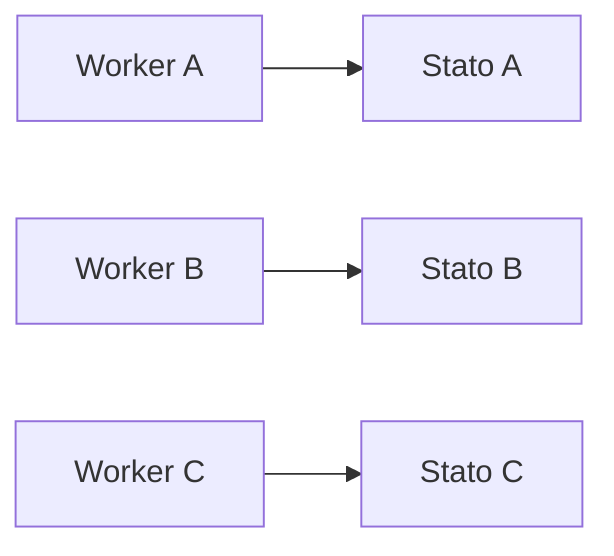

Gli accessi rimangono locali, evitando una dipendenza comune.

### 6.2 Stato mutabile condiviso

Con più worker che accedono allo stesso stato mutabile, scalare i worker non scala automaticamente il servizio di stato.

Se arrivano richieste al tasso $\lambda$ e ciascuna esegue in media $r$ accessi allo stato, il carico offerto al livello di stato è:

$$
\lambda_s=r\lambda
$$

Il valore dipende dal workload e dall'intensità degli accessi, non dal numero di worker. Aumentare i worker può quindi aumentare la pressione su un collo di bottiglia invariato.

### 6.3 Ownership e località

Partizionare lo stato e collocare la computazione vicino alla porzione che possiede migliora la località. Tuttavia sostituisce una dipendenza con un'altra:

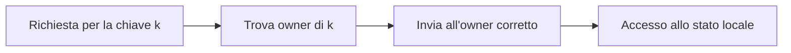

Diventano responsabilità esplicite:

- mappatura chiave-owner;
- routing;
- movimento dei dati;
- gestione dei cambi di ownership;
- riequilibrio delle partizioni.

### 6.4 Replicazione

Se esistono più copie modificabili dello stesso stato, nasce una nuova domanda: come vengono mantenute coerenti? La replicazione può aumentare disponibilità e capacità di lettura, ma introduce coordinamento e modelli di consistenza.

## 7. Shared-nothing

Nell'architettura **shared-nothing**, ciascun processore possiede memoria e dischi privati; la cooperazione avviene tramite rete, senza memoria o disco globalmente condivisi.

L'intuizione è:

- partizionare ownership di dati ed elaborazione;
- ridurre le risorse globalmente condivise;
- comunicare esplicitamente mediante messaggi.

Il principio rimane visibile nei servizi moderni basati su shard, anche se computazione e storage non sono sempre fisicamente co-locati. Bisogna distinguere il principio architetturale dalla sua specifica implementazione fisica.

## 8. Dove vengono prese le decisioni?

Il luogo in cui il lavoro viene eseguito non deve coincidere con il luogo in cui si prendono decisioni di placement o scheduling.

### 8.1 Controllo centralizzato

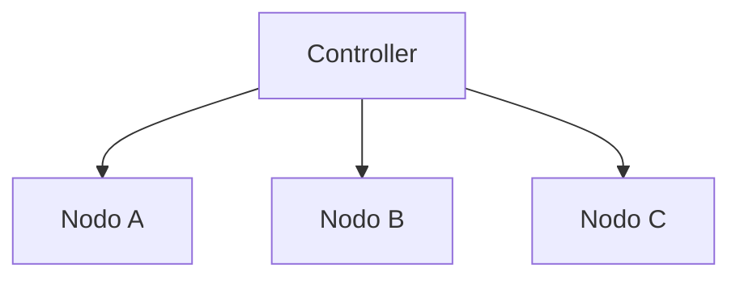

Vantaggi:

- punto decisionale globale più semplice;
- informazioni e autorità localizzate;
- maggiore facilità nel perseguire un obiettivo globale.

Svantaggi:

- le informazioni devono fluire verso il controller;
- il controller diventa una dipendenza per le decisioni;
- può diventare collo di bottiglia o single point of failure;
- in caso di partizione di rete alcuni nodi possono non ricevere decisioni.

### 8.2 Controllo distribuito

Vantaggi:

- evita un unico punto globale di decisione;
- permette decisioni vicine ai dati e agli eventi;
- può continuare a funzionare in alcuni scenari di partizione;
- può ridurre latenza e proteggere dati locali, come nell'edge computing.

Svantaggi:

- le informazioni sono disperse, incomplete o ritardate;
- la coerenza delle decisioni richiede coordinamento;
- ottenere una visione globale diventa più difficile.

Non esiste una gerarchia assoluta: la scelta dipende dalla decisione, dalla sua portata e dalla freschezza delle informazioni necessarie.

## 9. Struttura delle interazioni

### 9.1 Dipendenza sincrona diretta

In una chiamata sincrona $A$ non può completare il passo finché $B$ non partecipa e risponde.

In una catena sequenziale semplificata:

$$
T_{\text{e2e}}\approx T_A+L_{A,B}+T_B+L_{B,A}
$$

dove $L_{A,B}$ e $L_{B,A}$ sono i ritardi di comunicazione, non necessariamente simmetrici.

Spostare $B$ oltre un confine di rete modifica il cammino critico anche se la computazione logica non cambia.

### 9.2 Dipendenze parallele

In un fork/join idealizzato, se $B$ e $C$ procedono in parallelo:

$$
T_{\text{join}}\approx T_A+\max(T_B,T_C)
$$

La latenza dipende dal ramo più lento, non dalla somma dei due. In pratica bisogna aggiungere comunicazione, scheduling e costo del join.

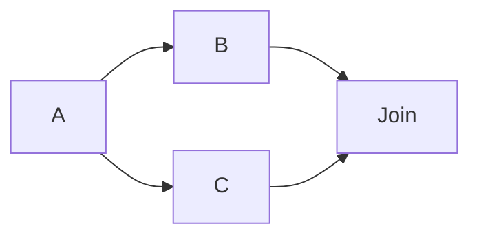

### 9.3 Intermediari e asincronia

Un broker, una coda o un buffer durevole modifica l'accoppiamento temporale:

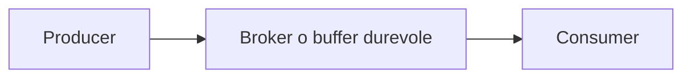

Il producer può progredire senza attendere che il consumer completi immediatamente il lavoro. La dipendenza non scompare: cambiano il suo tempo e i requisiti di stato.

Nuove responsabilità possono includere:

- durabilità dei messaggi;
- retry e gestione dei duplicati;
- ordering;
- backpressure;
- scalabilità e replica del broker.

L'intermediario può semplificare una topologia molti-a-molti, ma può anche diventare un nuovo collo di bottiglia o single point of failure se non è progettato per scalare.

La domanda guida è sempre: **chi deve aspettare chi?**

## 10. Due architetture a confronto

### Architettura A: computazione replicata, stato condiviso

- distribuzione semplice delle richieste;
- worker intercambiabili;
- la dipendenza dallo stato comune rimane;
- il tier di stato può diventare il limite principale.

### Architettura B: ownership e stato localizzato

- migliore località;
- capacità dello stato distribuita tra shard;
- routing e mappa del placement diventano espliciti;
- movimento e riequilibrio dello stato diventano operazioni architetturali.

| Vincolo | Stato condiviso | Stato partizionato |
|---|---|---|
| Routing | Semplice | Deve trovare l'owner |
| Località | Potenzialmente bassa | Alta se computazione e stato coincidono |
| Collo di bottiglia | Servizio di stato comune | Hot shard, router o mappa |
| Ribilanciamento | Meno visibile | Responsabilità esplicita |
| Coordinamento | Sugli accessi condivisi | Su ownership, movimento e copie |

La seconda architettura non elimina i vincoli: li sposta dallo stato condiviso verso routing, ownership e movimento dei dati.

## 11. Esempio: servizio di elaborazione fotografica

Un servizio online può includere:

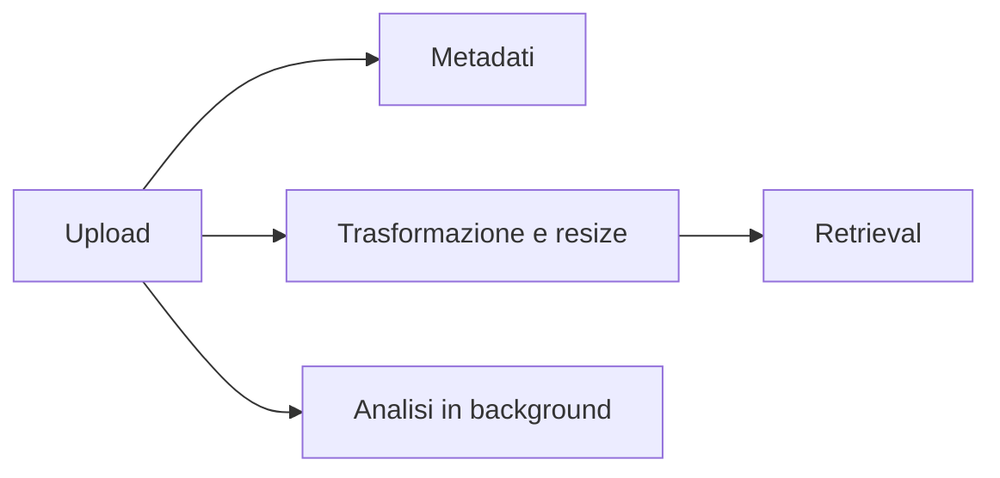

Domande architetturali:

- Dove risiedono i byte delle immagini?
- Dove vengono eseguite trasformazioni e resize?
- Quali passaggi devono essere sincroni per rispondere all'utente?
- Quali attività possono essere demandate a una coda?
- Chi decide il placement?
- Come si localizza lo shard corretto?
- Cosa accade se un componente è lento o irraggiungibile?

Lo stesso sistema può comporre front-end stateless, processamento partizionato, stato replicato e analisi asincrona. Non serve imporre un'unica struttura a tutti i sottosistemi.

## 12. Errori concettuali da evitare

1. **Pensare che la decomposizione rimuova le dipendenze.** Le rende esplicite e può trasformarle in comunicazione remota.
2. **Confondere decomposizione e placement.** La prima sceglie le parti; il secondo sceglie dove collocarle.
3. **Ottimizzare soltanto il volume di comunicazione.** Collocare tutto su una macchina minimizza il traffico ma annulla la distribuzione del lavoro.
4. **Trattare $C(\Pi)$ come tempo di comunicazione.** Il tempo dipende anche da latenza, numero di messaggi, topologia e congestione.
5. **Credere che più worker scalino lo stato condiviso.** Il carico sullo stato è $\lambda_s=r\lambda$ e può restare il collo di bottiglia.
6. **Pensare che l'asincronia elimini una dipendenza.** La sposta nel tempo e richiede buffering, durabilità e gestione degli errori.
7. **Considerare sempre superiore il controllo distribuito.** Centralizzazione e distribuzione hanno costi diversi e dipendono dalla portata della decisione.

## 13. Formulario essenziale

| Concetto                    | Formula                                                                              |
| --------------------------- | ------------------------------------------------------------------------------------ |
| Placement                   | $\pi:V\to H$                                                                         |
| Archi remoti                | $E_{\text{cut}}(\pi)=\{(u,v)\in E:\pi(u)\neq\pi(v)\}$                                |
| Edge-cut pesato             | $C_{\text{edge}}(\pi)=\sum_{e\in E_{\text{cut}}(\pi)}w_e$                            |
| Connettività di un iperarco | $\lambda_n(\Pi)=\left\| \left\{i \mid n \cap V_i \neq \varnothing \right\} \right\|$ |
| Connectivity-1              | $C(\Pi)=\sum_{n\in N}c_n(\lambda_n-1)$                                               |
| Vincolo di bilanciamento    | $W(V_i)\leq(1+\varepsilon)\dfrac{W(V)}{p}$                                           |
| Costo di un messaggio       | $T_{\text{msg}}\approx\alpha+\beta m$                                                |
| Carico sullo stato          | $\lambda_s=r\lambda$                                                                 |
| Catena sincrona             | $T_{\text{e2e}}\approx T_A+L_{A,B}+T_B+L_{B,A}$                                      |
| Fork/join                   | $T_{\text{join}}\approx T_A+\max(T_B,T_C)$                                           |

## 14. Possibili domande d'esame

### Qual è la differenza tra decomposizione e placement?

La decomposizione definisce i componenti e i loro confini; il placement assegna tali componenti agli host. Una stessa decomposizione può avere costi di comunicazione molto diversi con placement differenti.

### Perché un ipergrafo può modellare meglio una dipendenza condivisa?

Un singolo iperarco può rappresentare uno stesso dato usato da più componenti. In un grafo ordinario sarebbero necessari più archi, che potrebbero essere erroneamente interpretati come trasferimenti indipendenti.

### Perché non basta minimizzare $C(\Pi)$?

La soluzione minima assoluta colloca tutto in una sola partizione, ottenendo zero comunicazione ma nessuna distribuzione del carico. Serve un problema vincolato che minimizzi la comunicazione rispettando il bilanciamento.

### Qual è la differenza tra volume e tempo di comunicazione?

Il volume conta i byte trasferiti, mentre il tempo dipende anche da startup, latenza, numero dei messaggi, rete, congestione e possibilità di sovrapporre comunicazione e calcolo.

### Perché partizionare lo stato non elimina i problemi architetturali?

Migliora località e capacità, ma richiede di trovare l'owner corretto, instradare le richieste, muovere i dati e riequilibrare le partizioni. Con la replica si aggiungono consistenza e coordinamento.

### Che cosa cambia introducendo un broker asincrono?

Il producer non deve più attendere direttamente il consumer. L'accoppiamento temporale si riduce, ma emergono requisiti di durabilità, retry, deduplicazione, ordering, backpressure e scalabilità del broker.

## 15. Sintesi finale

- La decomposizione crea confini e rende alcune dipendenze remote.
- Il placement determina quali dipendenze attraversano la rete.
- Grafi e ipergrafi permettono di ragionare formalmente sulla comunicazione.
- La minimizzazione della comunicazione deve rispettare il bilanciamento del carico.
- Il volume trasferito non coincide con il tempo di comunicazione.
- Stato privato, condiviso, partizionato o replicato produce vincoli differenti.
- Esecuzione e decisione possono essere centralizzate o distribuite in modi diversi.
- Sincronia, parallelismo e asincronia cambiano il cammino critico e il modo in cui i componenti attendono.
- Un'architettura non elimina magicamente i vincoli di scalabilità: li rende visibili e li sposta.

## Riferimenti principali

- D. L. Parnas, *On the Criteria To Be Used in Decomposing Systems into Modules*, 1972.
- M. Stonebraker, *The Case for Shared Nothing*, 1986.
- Ü. V. Çatalyürek e C. Aykanat, *Hypergraph-Partitioning-Based Decomposition for Parallel Sparse-Matrix Vector Multiplication*, 1999.
- B. Hendrickson e T. G. Kolda, *Graph Partitioning Models for Parallel Computing*, 2000.
- G. Karypis e V. Kumar, *A Fast and High Quality Multilevel Scheme for Partitioning Irregular Graphs*, 1998.

# 23/9

# 25/9
