# 16/9

## Obiettivi della lezione

La lezione introduce il lessico e gli strumenti quantitativi necessari per ragionare sulla scalabilità. Il punto centrale del corso non è memorizzare tecnologie o architetture specifiche, ma comprendere **perché** determinate scelte progettuali funzionano o falliscono quando crescono carico, dati e risorse.

Il metodo seguito nel corso è:

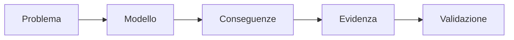
```mermaid
flowchart LR
    A["Problema"] --> B["Modello"]
    B --> C["Conseguenze"]
    C --> D["Evidenza"]
    D --> E["Validazione"]
```

Un sistema deve quindi essere descritto attraverso ipotesi esplicite, misurato e infine validato. Le tecnologie servono a rendere concreto il modello, non a sostituirlo.

## 1. Sistemi distribuiti

### 1.1 Definizione operativa

Un **sistema distribuito** è formato da elementi di calcolo autonomi che cooperano attraverso la comunicazione, offrendo a utenti o applicazioni l'esperienza di un sistema coerente.

Le tre proprietà essenziali sono:

- **autonomia**: ciascun nodo possiede risorse e stato di esecuzione propri;
- **comunicazione**: i nodi scambiano informazioni per cooperare;
- **coerenza percepita**: l'insieme deve presentarsi come un servizio unitario.

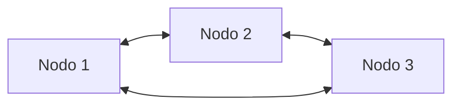
```mermaid
flowchart LR
    N1["Nodo 1"] <--> N2["Nodo 2"]
    N2 <--> N3["Nodo 3"]
    N1 <--> N3
```

La distribuzione non rende automaticamente un sistema scalabile: introduce anche comunicazione, coordinamento, stato condiviso e possibilità di guasti parziali.

## 2. La domanda di scalabilità

Un sistema che funziona per mille utenti non è necessariamente lo stesso problema di un sistema destinato a un milione di utenti. Cambiando scala possono crescere:

- tasso di arrivo delle richieste;
- concorrenza;
- volume dei dati;
- domanda di risorse;
- pressione sui requisiti di latenza;
- rischio operativo.

I requisiti di correttezza, disponibilità e tempo di risposta non scompaiono mentre il carico cresce. La scalabilità riguarda proprio la capacità di conservare un comportamento accettabile durante questa crescita.

### 2.1 Il numero di utenti non descrive il workload

Dire “un milione di utenti” non basta. Occorre precisare almeno:

- il processo di arrivo, indicato per esempio con $\lambda(t)$;
- il costo medio di una richiesta;
- il mix di operazioni;
- la distribuzione temporale delle richieste;
- la quantità di stato letta o modificata.

Due workload possono contenere lo stesso numero totale di richieste ma produrre pressioni istantanee molto diverse.

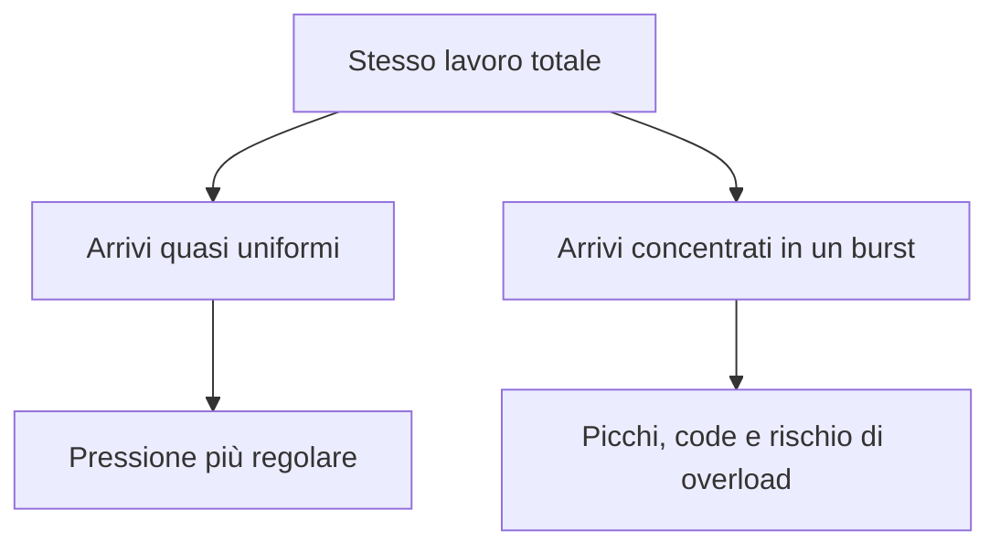
```mermaid
flowchart TD
    W["Stesso lavoro totale"] --> U["Arrivi quasi uniformi"]
    W --> B["Arrivi concentrati in un burst"]
    U --> U1["Pressione più regolare"]
    B --> B1["Picchi, code e rischio di overload"]
```

Un workload **bursty** solleva inoltre una decisione di capacity planning: dimensionare il sistema per il picco, per il carico medio oppure accettare una degradazione controllata della qualità durante i picchi.

### 2.2 Dimensioni della scalabilità

La scalabilità è multidimensionale. Una dichiarazione di scalabilità deve specificare quale dimensione cresce:

| Dimensione | Domanda principale |
|---|---|
| Carico | Il sistema conserva prestazioni accettabili con più richieste o lavoro? |
| Dati/dimensione | Riesce a gestire dataset e stato più grandi? |
| Geografia | Funziona su distanze e regioni più ampie? |
| Amministrazione | Rimane gestibile con più organizzazioni, team o domini? |

Secondo la prospettiva di Bondi, la **load scalability** riguarda la capacità di operare in modo graduale sotto carichi maggiori o minori, evitando ritardi eccessivi, spreco di risorse e contesa improduttiva.

Quando la capacità aggiuntiva viene ottenuta mediante più nodi cooperanti, il problema di scalabilità diventa anche un problema di sistemi distribuiti.

## 3. Due regimi sperimentali

Prima di misurare la scalabilità bisogna distinguere tra un lavoro finito e un servizio continuo.

| Caso | Domanda |
|---|---|
| Computazione finita | Quanto diminuisce il tempo di completamento aggiungendo risorse? |
| Servizio continuo | Come si legano throughput, latenza, capacità e concorrenza? |

### 3.1 Strong scaling

Nello **strong scaling** il workload totale rimane costante mentre cresce il numero $p$ di risorse:

$$
W_{\text{tot}} = \text{costante}, \qquad p \uparrow
$$

La domanda è: **quanto più velocemente posso completare lo stesso lavoro?**

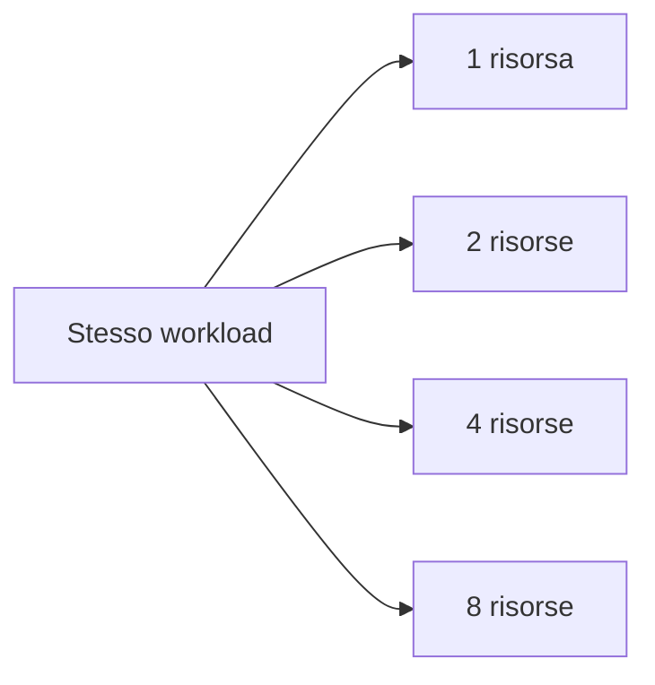
```mermaid
flowchart LR
    W["Stesso workload"] --> P1["1 risorsa"]
    W --> P2["2 risorse"]
    W --> P4["4 risorse"]
    W --> P8["8 risorse"]
```

È utile per elaborazioni con una quantità di lavoro fissata e una scadenza, per esempio una simulazione o un job batch che deve terminare il prima possibile.

### 3.2 Weak scaling

Nel **weak scaling** il lavoro per risorsa rimane costante: aumentando le risorse cresce proporzionalmente anche il workload.

$$
\frac{W(p)}{p} = \text{costante}, \qquad p \uparrow
$$

La domanda è: **quanto lavoro in più posso gestire mantenendo comparabile la pressione su ciascuna risorsa?**

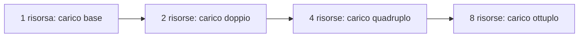
```mermaid
flowchart LR
    P1["1 risorsa: carico base"] --> P2["2 risorse: carico doppio"]
    P2 --> P4["4 risorse: carico quadruplo"]
    P4 --> P8["8 risorse: carico ottuplo"]
```

Questa prospettiva è particolarmente importante per servizi web, motori di ricerca e sistemi nei quali il numero di utenti o la quantità di dati continua a crescere.

> [!important]
> Strong e weak scaling sono **regimi sperimentali**: descrivono come varia il workload durante una misura. Non sono sinonimi delle leggi di Amdahl e Gustafson, che sono invece modelli analitici.

## 4. Speedup ed efficienza

Sia $T(1)$ il tempo necessario a completare un workload con una risorsa e $T(p)$ il tempo con $p$ risorse.

### 4.1 Speedup

Lo **speedup** è:

$$
S(p) = \frac{T(1)}{T(p)}
$$

Nel caso ideale:

$$
S(p) = p
$$

Questo significa che raddoppiando le risorse il tempo si dimezza. Nei sistemi reali lo speedup è normalmente sublineare a causa di parti seriali, comunicazione, sincronizzazione, sbilanciamento e overhead di scheduling.

### 4.2 Efficienza

L'**efficienza** misura la frazione dello speedup lineare ideale effettivamente ottenuta:

$$
E(p) = \frac{S(p)}{p}
$$

- $E(p)=1$: uso ideale delle risorse;
- $0<E(p)<1$: una parte della capacità aggiunta non si traduce in speedup;
- una forte diminuzione di $E(p)$ indica rendimenti decrescenti.

### 4.3 Esempio

| $p$ | $T(p)$ in secondi | $S(p)=T(1)/T(p)$ | $E(p)=S(p)/p$ |
|---:|---:|---:|---:|
| $1$ | $100$ | $1.00$ | $1.00$ |
| $2$ | $54$ | $1.85$ | $0.93$ |
| $4$ | $31$ | $3.23$ | $0.81$ |
| $8$ | $21$ | $4.76$ | $0.60$ |
| $16$ | $17$ | $5.88$ | $0.37$ |

Con $16$ risorse il sistema è più veloce, ma conserva solo il $37\%$ dell'efficienza ideale. Aggiungere risorse aiuta, ma non linearmente.

## 5. Legge di Amdahl

### 5.1 Ipotesi

Per un workload fisso, sia:

- $s$ la frazione del **tempo di esecuzione** non parallelizzabile;
- $1-s$ la frazione perfettamente parallelizzabile;
- $p$ il numero di risorse.

La legge di Amdahl fornisce lo speedup teorico:

$$
S_A(p) = \frac{1}{s + \frac{1-s}{p}}
$$

> [!warning]
> $s$ è una frazione del **tempo**, non una percentuale di righe di codice. Una piccola parte del programma può occupare una parte significativa del tempo totale.

### 5.2 Esempio con $s=0.05$

Con quattro risorse:

$$
S_A(4) = \frac{1}{0.05 + \frac{0.95}{4}} \approx 3.48
$$

Con sedici risorse:

$$
S_A(16) = \frac{1}{0.05 + \frac{0.95}{16}} \approx 9.14
$$

Le risorse aggiuntive continuano ad aiutare, ma il guadagno marginale diminuisce.

### 5.3 Limite asintotico

Quando $p$ tende all'infinito, la parte parallelizzabile tende idealmente a zero, ma la parte seriale rimane:

$$
\lim_{p\to\infty} S_A(p) = \frac{1}{s}
$$

Con $s=0.05$:

$$
\lim_{p\to\infty} S_A(p) = 20
$$

Neppure un numero infinito di risorse permetterebbe di superare uno speedup di $20$ nel modello.

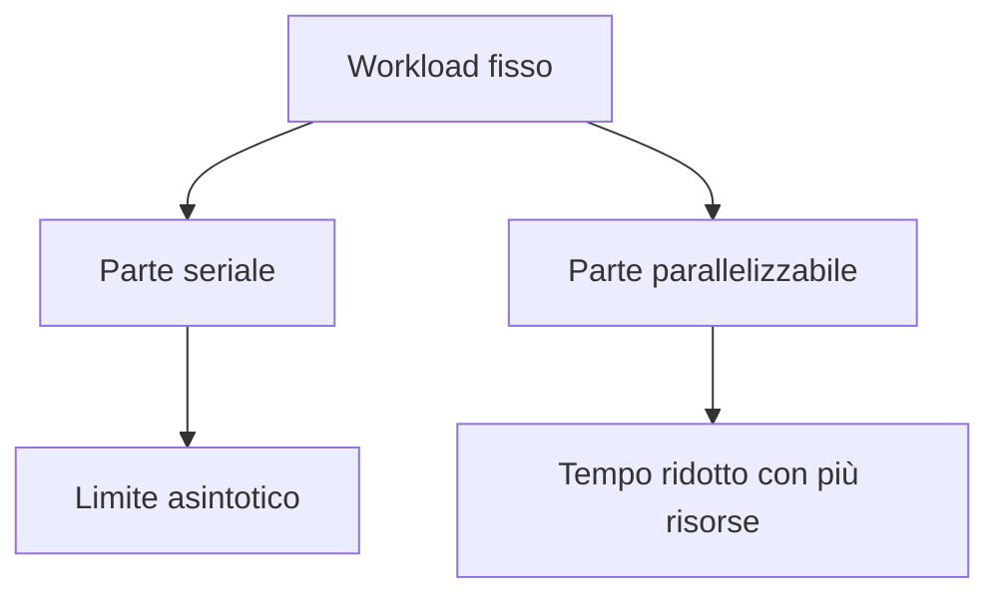
```mermaid
flowchart TD
    W["Workload fisso"] --> S["Parte seriale"]
    W --> P["Parte parallelizzabile"]
    S --> L["Limite asintotico"]
    P --> R["Tempo ridotto con più risorse"]
```

### 5.4 Cosa include e cosa trascura

Il modello include un workload fisso, una parte seriale e una parte idealmente parallelizzabile. Non rende espliciti:

- overhead di comunicazione;
- costi di sincronizzazione;
- load imbalance;
- effetti di cache;
- overhead di scheduling.

La lezione pratica è che, per migliorare lo strong scaling, non basta aggiungere risorse: bisogna ridurre o eliminare la parte non scalabile.

## 6. Legge di Gustafson

Amdahl mantiene fisso il problema. Gustafson cambia domanda: se sono disponibili più risorse, perché non usarle per risolvere un problema più grande?

Nel modello di **scaled-size computing**, $s$ è la frazione seriale misurata rispetto al tempo di esecuzione parallelo. Lo speedup scalato è:

$$
S_G(p) = p - s(p-1)
$$

### 6.1 Esempio

Per $p=64$ e $s=0.05$:

$$
S_G(64) = 64 - 0.05(64-1) = 60.85
$$

Il risultato non contraddice Amdahl: i due modelli rispondono a domande diverse.

| Amdahl | Gustafson |
|---|---|
| Workload fisso | Workload scalato |
| Quanto più velocemente completo lo stesso lavoro? | Quanto più grande può essere il problema mantenendo comparabile l'esecuzione? |
| Evidenzia il limite della parte seriale | Evidenzia il lavoro aggiuntivo assorbibile con più risorse |

## 7. Dai job finiti ai servizi continui: legge di Little

Per un servizio continuo non esiste un unico job da completare: il lavoro continua ad arrivare. Diventano centrali throughput, latenza e numero di richieste contemporaneamente presenti nel sistema.

### 7.1 Definire il confine

Prima di applicare la legge bisogna scegliere il **system boundary**. Solo ciò che si trova dentro quel confine viene contato nel numero di elementi e nel tempo di permanenza.

Siano:

- $\lambda$: tasso medio di arrivo o throughput, espresso per esempio in richieste al secondo;
- $W$: tempo medio trascorso da una richiesta nel sistema;
- $L$: numero medio di richieste presenti nel sistema, cioè lavoro *in flight*.

In condizioni appropriate di stazionarietà e finitezza:

$$
L = \lambda W
$$

Le unità sono coerenti:

$$
\frac{\text{richieste}}{\text{secondo}} \cdot \text{secondi} = \text{richieste}
$$

### 7.2 Esempio

Se:

$$
\lambda = 1000\ \text{richieste/s}, \qquad W=0.2\ \text{s}
$$

allora:

$$
L = 1000 \cdot 0.2 = 200
$$

In media ci sono $200$ richieste all'interno del confine scelto.

Se il tempo medio raddoppia mentre il throughput resta invariato:

$$
W=0.4\ \text{s} \quad \Longrightarrow \quad L=400
$$

Raddoppia quindi il lavoro contemporaneamente presente nel sistema, con maggiori necessità di memoria, thread, connessioni o altre risorse.

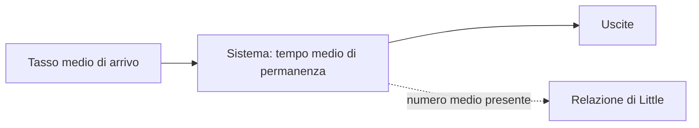
```mermaid
flowchart LR
    A["Tasso medio di arrivo"] --> S["Sistema: tempo medio di permanenza"]
    S --> O["Uscite"]
    S -.->|numero medio presente| L["Relazione di Little"]
```

### 7.3 Cosa non dice la legge di Little

La legge mette in relazione medie di lungo periodo, ma non determina:

- il valore del tempo di risposta $W$;
- la capacità massima;
- l'effetto della burstiness;
- la distribuzione delle latenze;
- il comportamento durante overload o transitori.

Serve quindi come identità utile per il dimensionamento e per riconoscere accumuli di lavoro, non come modello completo di coda.

## 8. Scale-up e scale-out

### 8.1 Scale-up

Lo **scale-up** aumenta la capacità di una singola istanza: più CPU, memoria, storage o hardware più veloce. Non crea necessariamente un sistema distribuito.

### 8.2 Scale-out

Lo **scale-out** aggiunge nodi o istanze cooperanti. Permette di superare i limiti fisici ed economici di una singola macchina, ma introduce problemi distribuiti.

| Scale-up | Scale-out |
|---|---|
| Una singola istanza più potente | Più istanze cooperanti |
| Semplicità architetturale relativa | Comunicazione e coordinamento |
| Limiti fisici ed economici del nodo | Capacità potenzialmente più elastica |
| Non implica distribuzione | Implica normalmente problemi distribuiti |

### 8.3 Quando basta un load balancer

La replica orizzontale è più semplice quando:

- le richieste sono indipendenti;
- i worker sono intercambiabili;
- non esiste stato mutabile condiviso.

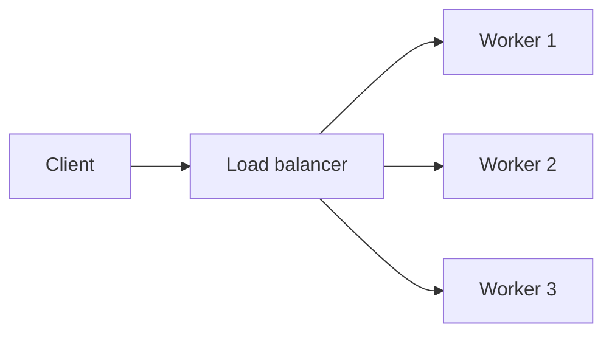
```mermaid
flowchart LR
    C["Client"] --> LB["Load balancer"]
    LB --> W1["Worker 1"]
    LB --> W2["Worker 2"]
    LB --> W3["Worker 3"]
```

Questa architettura aumenta la capacità solo finché non emerge un nuovo collo di bottiglia.

Se si aggiungono stato condiviso, interazioni remote, invarianti distribuiti o guasti parziali, i worker cessano di essere realmente indipendenti.

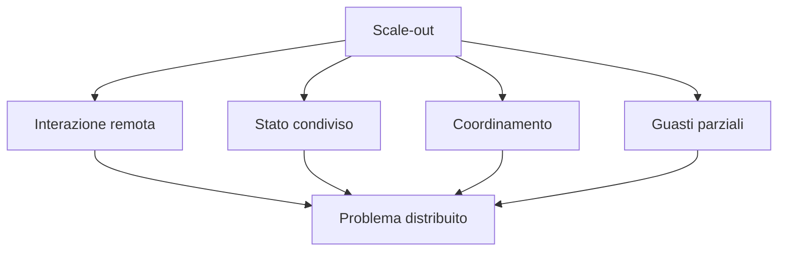
```mermaid
flowchart TD
    SO["Scale-out"] --> I["Interazione remota"]
    SO --> S["Stato condiviso"]
    SO --> C["Coordinamento"]
    SO --> F["Guasti parziali"]
    I --> P["Problema distribuito"]
    S --> P
    C --> P
    F --> P
```

## 9. Errori concettuali da evitare

1. **Dire che un sistema scala senza specificare rispetto a cosa.** Bisogna dichiarare workload, risorse e proprietà richieste.
2. **Usare il numero di utenti come descrizione completa del carico.** Mancano frequenza, mix, costo e distribuzione temporale delle richieste.
3. **Confondere strong scaling con Amdahl e weak scaling con Gustafson.** I primi sono regimi sperimentali, i secondi modelli analitici.
4. **Interpretare $s$ come frazione del codice.** È la frazione del tempo di esecuzione che rimane seriale nel modello.
5. **Pensare che Little determini la latenza.** La legge lega tre medie, ma non spiega da sola da dove derivi $W$.
6. **Pensare che più nodi eliminino automaticamente i limiti.** I colli di bottiglia possono spostarsi verso stato, rete, coordinamento o load balancer.

## 10. Formulario essenziale

| Concetto | Formula |
|---|---|
| Speedup | $S(p)=\dfrac{T(1)}{T(p)}$ |
| Efficienza | $E(p)=\dfrac{S(p)}{p}$ |
| Amdahl | $S_A(p)=\dfrac{1}{s+\frac{1-s}{p}}$ |
| Limite di Amdahl | $\displaystyle\lim_{p\to\infty}S_A(p)=\dfrac{1}{s}$ |
| Gustafson | $S_G(p)=p-s(p-1)$ |
| Little | $L=\lambda W$ |

## 11. Possibili domande d'esame

### Che cosa deve contenere una dichiarazione di scalabilità?

Deve indicare la dimensione che cresce, il modello del workload, le risorse disponibili e le proprietà che devono rimanere accettabili. “Supporta un milione di utenti” è insufficiente perché non specifica arrivi, costo e mix delle richieste.

### Qual è la differenza tra strong e weak scaling?

Nello strong scaling il workload rimane fisso e si misura la riduzione del tempo aggiungendo risorse. Nel weak scaling cresce sia il workload sia il numero di risorse, mantenendo circa costante il lavoro per risorsa.

### Perché Amdahl limita lo speedup?

La frazione seriale $s$ non beneficia delle risorse aggiuntive. Quando la parte parallelizzabile diventa trascurabile, il tempo seriale domina e lo speedup tende a $1/s$.

### Amdahl e Gustafson si contraddicono?

No. Amdahl considera un problema di dimensione fissa; Gustafson considera un problema che cresce con le risorse. Cambia la domanda sperimentale, quindi cambia l'interpretazione dello speedup.

### Come si interpreta $L=\lambda W$?

Se arrivano in media $\lambda$ richieste al secondo e ciascuna resta nel sistema per $W$ secondi, allora nel sistema sono presenti mediamente $L$ richieste. Il confine del sistema deve essere scelto esplicitamente.

## 12. Sintesi finale

- La scalabilità richiede un modello esplicito di carico e risorse.
- Strong e weak scaling misurano scenari diversi.
- Speedup ed efficienza permettono di quantificare il beneficio delle risorse aggiunte.
- Amdahl mostra il limite imposto dalla parte seriale di un workload fisso.
- Gustafson mostra quanto lavoro aggiuntivo possa essere trattato facendo crescere il problema.
- Little collega throughput, tempo nel sistema e lavoro in corso.
- Lo scale-out introduce distribuzione e, con essa, comunicazione, stato, coordinamento e guasti parziali.

## 13. Indicazioni organizzative emerse durante la lezione

La trascrizione presenta due modalità principali per il lavoro d'esame:

1. una relazione ragionata con analisi critica di un tema concordato;
2. un piccolo progetto, preferibilmente svolto in due persone, centrato su distribuzione e scalabilità.

In entrambi i casi è previsto un orale: la parte principale riguarda il progetto o la relazione, mentre la parte rimanente riguarda gli argomenti del corso. Le indicazioni definitive vanno comunque verificate nelle comunicazioni ufficiali del docente.

## Riferimenti principali

- G. M. Amdahl, *Validity of the Single Processor Approach to Achieving Large Scale Computing Capabilities*, 1967.
- J. L. Gustafson, *Reevaluating Amdahl's Law*, 1988.
- J. D. C. Little, *A Proof for the Queuing Formula: $L=\lambda W$*, 1961.
- A. B. Bondi, *Characteristics of Scalability and Their Impact on Performance*, 2000.
- M. van Steen e A. S. Tanenbaum, *A Brief Introduction to Distributed Systems*, 2016.

# 18/9

## Obiettivo della lezione

La replica orizzontale è semplice quando le richieste sono indipendenti e i worker sono intercambiabili. Quando queste ipotesi vengono rimosse, stato, decisioni e dipendenze devono essere collocati da qualche parte.

L'architettura deve quindi rispondere a quattro domande ricorrenti:

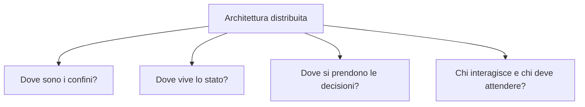
```mermaid
flowchart TD
    A["Architettura distribuita"] --> B["Dove sono i confini?"]
    A --> S["Dove vive lo stato?"]
    A --> D["Dove si prendono le decisioni?"]
    A --> I["Chi interagisce e chi deve attendere?"]
```

L'idea fondamentale è che i vincoli di scalabilità non vengono semplicemente eliminati: quando l'architettura cambia, essi spesso **si spostano**.

## 1. Decomposizione e confini

### 1.1 Prima della decomposizione

In un sistema monolitico, computazione, stato e decisioni si trovano nello stesso confine. Chiamate di funzione e accessi in memoria sono locali.

Decomporre il sistema significa scegliere parti separate. Dopo la decomposizione:

- una chiamata locale può diventare un'interazione di protocollo;
- un accesso in memoria può diventare un accesso remoto allo stato;
- errori e ritardi di rete entrano nel cammino di esecuzione;
- diventano espliciti i problemi di ownership e coordinamento.

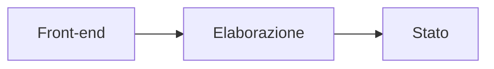
```mermaid
flowchart LR
    F["Front-end"] --> P["Elaborazione"]
    P --> S["Stato"]
```

I confini migliorano separazione e distribuzione del lavoro, ma trasformano alcune dipendenze locali in comunicazione remota.

### 1.2 Il criterio di Parnas

Secondo Parnas, un sistema può essere decomposto in modi diversi. La decomposizione va scelta in base alle decisioni progettuali che ogni modulo deve **nascondere e localizzare**.

Nel caso distribuito questo principio ha un'ulteriore conseguenza: la decomposizione determina quali dipendenze potranno attraversare i confini delle macchine.

Esempio concettuale: la crescita di un'organizzazione o di un prodotto non aumenta soltanto il carico, ma può rendere la struttura del software troppo accoppiata, difficile da separare e lenta da distribuire.

## 2. Architettura come grafo di dipendenze

### 2.1 Modello

Un'architettura può essere rappresentata come un grafo:

$$
G=(V,E)
$$

dove:

- $V$ è l'insieme dei componenti;
- $E$ è l'insieme delle dipendenze che richiedono scambio di informazioni.

La decomposizione sceglie i componenti. Il **placement** sceglie dove eseguirli. Se $H$ è l'insieme degli host:

$$
\pi:V\to H
$$

e $\pi(v)$ indica l'host sul quale è collocato il componente $v$.

### 2.2 Dipendenze locali e remote

Una dipendenza $(u,v)$ è remota quando i due componenti sono collocati su host diversi. L'insieme degli archi tagliati dal placement è:

$$
E_{\text{cut}}(\pi)=\{(u,v)\in E:\pi(u)\neq\pi(v)\}
$$

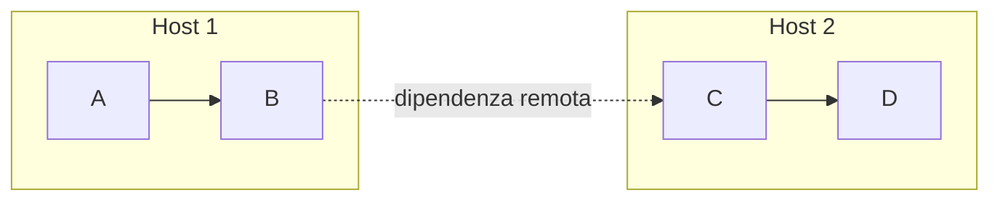
```mermaid
flowchart LR
    subgraph H1["Host 1"]
        A["A"] --> B["B"]
    end
    subgraph H2["Host 2"]
        C["C"] --> D["D"]
    end
    B -.->|dipendenza remota| C
```

Se ogni dipendenza $e$ trasferisce $w_e$ byte per unità di lavoro, un primo modello del volume di comunicazione è:

$$
C_{\text{edge}}(\pi)=\sum_{e\in E_{\text{cut}}(\pi)}w_e
$$

Lo stesso grafo, le stesse macchine e la stessa computazione possono produrre volumi di comunicazione differenti a seconda del placement.

### 2.3 Limite del modello a grafo

Il taglio degli archi è una semplificazione. Tre archi potrebbero rappresentare tre messaggi distinti, oppure la distribuzione dello stesso dato a tre consumatori. Contare ogni arco separatamente può quindi sovrastimare o rappresentare male la comunicazione reale.

## 3. Ipergrafi e dipendenze condivise

### 3.1 Definizione

Un **ipergrafo** è:

$$
\mathcal{H}=(V,N)
$$

dove ciascun iperarco, o *net*, $n\in N$ può collegare un sottoinsieme arbitrario di vertici.

Un unico iperarco può rappresentare un dato prodotto da un componente e richiesto da più consumatori.

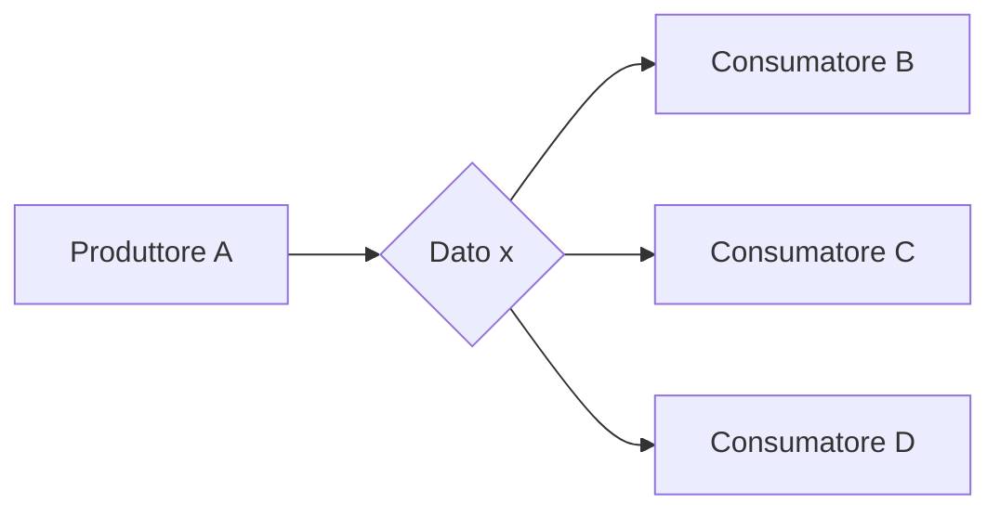
```mermaid
flowchart LR
    A["Produttore A"] --> X{"Dato x"}
    X --> B["Consumatore B"]
    X --> C["Consumatore C"]
    X --> D["Consumatore D"]
```

Il nodo centrale nel diagramma è solo una resa grafica: nel modello $x$ è un iperarco che collega $A$, $B$, $C$ e $D$.

### 3.2 Connettività di un iperarco

Data una partizione:

$$
\Pi=\{V_1,\ldots,V_p\}
$$

la connettività dell'iperarco $n$ è:

$$
\lambda_n(\Pi)=\left|\{i:n\cap V_i\neq\varnothing\}\right|
$$

$\lambda_n$ indica quante partizioni sono toccate dall'iperarco.

- Se il dato tocca due partizioni, $\lambda_n-1=1$.
- Se ne tocca tre, $\lambda_n-1=2$.

Il termine $\lambda_n-1$ ha un significato fisico: se una partizione possiede il dato e il dato è richiesto complessivamente in $\lambda_n$ partizioni, deve essere inviato alle altre $\lambda_n-1$.

### 3.3 Metrica connectivity-1

Se l'iperarco $n$ rappresenta $c_n$ unità di dati, il volume di comunicazione è modellato da:

$$
C(\Pi)=\sum_{n\in N}c_n\bigl(\lambda_n(\Pi)-1\bigr)
$$

### 3.4 Esempio pesato

Consideriamo:

$$
n_x=\{A,B,C\}, \qquad c_x=10\ \text{MB}
$$

$$
n_y=\{C,D\}, \qquad c_y=1\ \text{MB}
$$

Per il placement $\Pi_A$ si ha $\lambda_x=2$ e $\lambda_y=1$:

$$
C(\Pi_A)=10(2-1)+1(1-1)=10\ \text{MB}
$$

Per il placement $\Pi_B$ si ha $\lambda_x=2$ e $\lambda_y=2$:

$$
C(\Pi_B)=10(2-1)+1(2-1)=11\ \text{MB}
$$

Non sono cambiati computazione, numero di nodi o bilanciamento; è cambiato soltanto il placement dei componenti dipendenti.

## 4. Località contro bilanciamento

Se l'unico obiettivo fosse minimizzare la comunicazione, la soluzione sarebbe collocare tutto in una sola partizione:

$$
V_1=V, \qquad V_2=\cdots=V_p=\varnothing
$$

ottenendo:

$$
C(\Pi)=0
$$

Questa soluzione ha località perfetta ma non distribuisce il lavoro. Bisogna quindi ottimizzare insieme comunicazione e bilanciamento.

Sia $W(V)$ il lavoro computazionale totale. Il carico ideale per $p$ partizioni è:

$$
\frac{W(V)}{p}
$$

Poiché un bilanciamento perfetto può essere impossibile o troppo costoso, si introduce una tolleranza relativa $\varepsilon$:

$$
W(V_i)\leq(1+\varepsilon)\frac{W(V)}{p}
$$

Il problema diventa:

$$
\min_{\Pi}\sum_{n\in N}c_n(\lambda_n-1)
$$

soggetto al vincolo:

$$
W(V_i)\leq(1+\varepsilon)\frac{W(V)}{p}
$$

Per esempio, con $W(V)=100$, $p=4$ e $\varepsilon=0.1$:

$$
W(V_i)\leq1.1\cdot\frac{100}{4}=27.5
$$

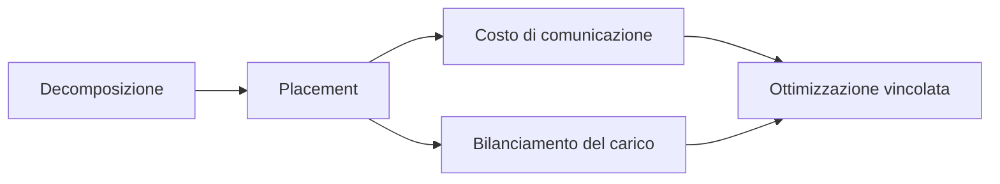
```mermaid
flowchart LR
    D["Decomposizione"] --> P["Placement"]
    P --> C["Costo di comunicazione"]
    P --> B["Bilanciamento del carico"]
    C --> O["Ottimizzazione vincolata"]
    B --> O
```

> [!important]
> Se ogni placement bilanciato di una decomposizione produce molta comunicazione tra confini, potrebbe essere sbagliata la decomposizione stessa, non soltanto il placement.

## 5. Volume di comunicazione e tempo

Due placement con lo stesso $C(\Pi)$ possono avere prestazioni diverse. Il solo volume non cattura:

- numero di messaggi e batching;
- topologia e congestione;
- concentrazione del traffico su un singolo nodo;
- costi di latenza rispetto a quelli di banda;
- struttura delle sincronizzazioni;
- sovrapposizione tra comunicazione e computazione.

Una prima approssimazione del tempo necessario a un messaggio di $m$ byte è:

$$
T_{\text{msg}}\approx\alpha+\beta m
$$

dove:

- $\alpha$ è il costo fisso di startup o latenza;
- $\beta$ è il costo marginale per byte.

Un modello schematico del costo del placement diventa:

$$
T_{\text{comm}}(\Pi)\approx
\sum_{e\in E_{\text{cut}}(\Pi)}(\alpha+\beta w_e)
$$

Molti messaggi piccoli possono costare più di pochi messaggi grandi a parità di byte, perché pagano $\alpha$ più volte.

## 6. Placement dello stato

### 6.1 Stato privato

Il caso più semplice si verifica quando ogni worker possiede stato privato e computazione e stato sono co-locati.

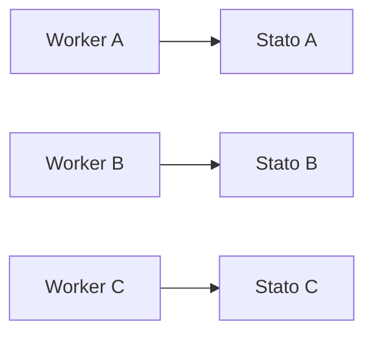
```mermaid
flowchart LR
    W1["Worker A"] --> S1["Stato A"]
    W2["Worker B"] --> S2["Stato B"]
    W3["Worker C"] --> S3["Stato C"]
```

Gli accessi rimangono locali, evitando una dipendenza comune.

### 6.2 Stato mutabile condiviso

Con più worker che accedono allo stesso stato mutabile, scalare i worker non scala automaticamente il servizio di stato.

Se arrivano richieste al tasso $\lambda$ e ciascuna esegue in media $r$ accessi allo stato, il carico offerto al livello di stato è:

$$
\lambda_s=r\lambda
$$

Il valore dipende dal workload e dall'intensità degli accessi, non dal numero di worker. Aumentare i worker può quindi aumentare la pressione su un collo di bottiglia invariato.

### 6.3 Ownership e località

Partizionare lo stato e collocare la computazione vicino alla porzione che possiede migliora la località. Tuttavia sostituisce una dipendenza con un'altra:

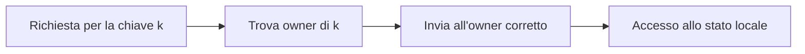
```mermaid
flowchart LR
    R["Richiesta per la chiave k"] --> M["Trova owner di k"]
    M --> O["Invia all'owner corretto"]
    O --> S["Accesso allo stato locale"]
```

Diventano responsabilità esplicite:

- mappatura chiave-owner;
- routing;
- movimento dei dati;
- gestione dei cambi di ownership;
- riequilibrio delle partizioni.

### 6.4 Replicazione

Se esistono più copie modificabili dello stesso stato, nasce una nuova domanda: come vengono mantenute coerenti? La replicazione può aumentare disponibilità e capacità di lettura, ma introduce coordinamento e modelli di consistenza.

## 7. Shared-nothing

Nell'architettura **shared-nothing**, ciascun processore possiede memoria e dischi privati; la cooperazione avviene tramite rete, senza memoria o disco globalmente condivisi.

L'intuizione è:

- partizionare ownership di dati ed elaborazione;
- ridurre le risorse globalmente condivise;
- comunicare esplicitamente mediante messaggi.

Il principio rimane visibile nei servizi moderni basati su shard, anche se computazione e storage non sono sempre fisicamente co-locati. Bisogna distinguere il principio architetturale dalla sua specifica implementazione fisica.

## 8. Dove vengono prese le decisioni?

Il luogo in cui il lavoro viene eseguito non deve coincidere con il luogo in cui si prendono decisioni di placement o scheduling.

### 8.1 Controllo centralizzato

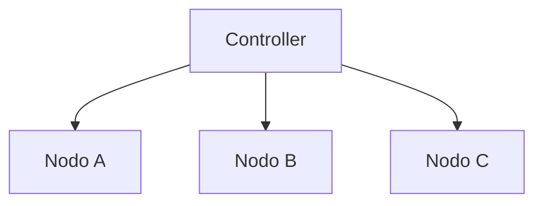
```mermaid
flowchart TD
    C["Controller"] --> A["Nodo A"]
    C --> B["Nodo B"]
    C --> D["Nodo C"]
```

Vantaggi:

- punto decisionale globale più semplice;
- informazioni e autorità localizzate;
- maggiore facilità nel perseguire un obiettivo globale.

Svantaggi:

- le informazioni devono fluire verso il controller;
- il controller diventa una dipendenza per le decisioni;
- può diventare collo di bottiglia o single point of failure;
- in caso di partizione di rete alcuni nodi possono non ricevere decisioni.

### 8.2 Controllo distribuito

Vantaggi:

- evita un unico punto globale di decisione;
- permette decisioni vicine ai dati e agli eventi;
- può continuare a funzionare in alcuni scenari di partizione;
- può ridurre latenza e proteggere dati locali, come nell'edge computing.

Svantaggi:

- le informazioni sono disperse, incomplete o ritardate;
- la coerenza delle decisioni richiede coordinamento;
- ottenere una visione globale diventa più difficile.

Non esiste una gerarchia assoluta: la scelta dipende dalla decisione, dalla sua portata e dalla freschezza delle informazioni necessarie.

## 9. Struttura delle interazioni

### 9.1 Dipendenza sincrona diretta

In una chiamata sincrona $A$ non può completare il passo finché $B$ non partecipa e risponde.

In una catena sequenziale semplificata:

$$
T_{\text{e2e}}\approx T_A+L_{A,B}+T_B+L_{B,A}
$$

dove $L_{A,B}$ e $L_{B,A}$ sono i ritardi di comunicazione, non necessariamente simmetrici.

Spostare $B$ oltre un confine di rete modifica il cammino critico anche se la computazione logica non cambia.

### 9.2 Dipendenze parallele

In un fork/join idealizzato, se $B$ e $C$ procedono in parallelo:

$$
T_{\text{join}}\approx T_A+\max(T_B,T_C)
$$

La latenza dipende dal ramo più lento, non dalla somma dei due. In pratica bisogna aggiungere comunicazione, scheduling e costo del join.

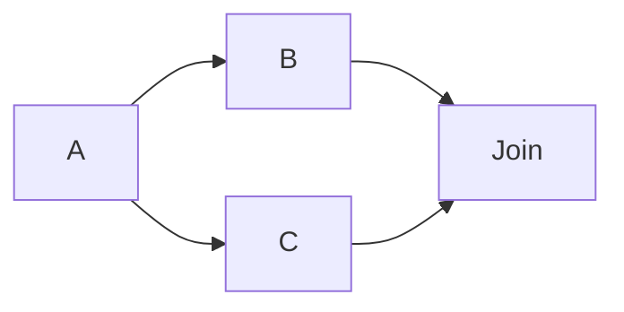
```mermaid
flowchart LR
    A["A"] --> B["B"]
    A --> C["C"]
    B --> J["Join"]
    C --> J
```

### 9.3 Intermediari e asincronia

Un broker, una coda o un buffer durevole modifica l'accoppiamento temporale:

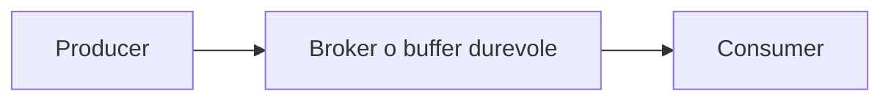
```mermaid
flowchart LR
    P["Producer"] --> M["Broker o buffer durevole"]
    M --> C["Consumer"]
```

Il producer può progredire senza attendere che il consumer completi immediatamente il lavoro. La dipendenza non scompare: cambiano il suo tempo e i requisiti di stato.

Nuove responsabilità possono includere:

- durabilità dei messaggi;
- retry e gestione dei duplicati;
- ordering;
- backpressure;
- scalabilità e replica del broker.

L'intermediario può semplificare una topologia molti-a-molti, ma può anche diventare un nuovo collo di bottiglia o single point of failure se non è progettato per scalare.

La domanda guida è sempre: **chi deve aspettare chi?**

## 10. Due architetture a confronto

### Architettura A: computazione replicata, stato condiviso

- distribuzione semplice delle richieste;
- worker intercambiabili;
- la dipendenza dallo stato comune rimane;
- il tier di stato può diventare il limite principale.

### Architettura B: ownership e stato localizzato

- migliore località;
- capacità dello stato distribuita tra shard;
- routing e mappa del placement diventano espliciti;
- movimento e riequilibrio dello stato diventano operazioni architetturali.

| Vincolo | Stato condiviso | Stato partizionato |
|---|---|---|
| Routing | Semplice | Deve trovare l'owner |
| Località | Potenzialmente bassa | Alta se computazione e stato coincidono |
| Collo di bottiglia | Servizio di stato comune | Hot shard, router o mappa |
| Ribilanciamento | Meno visibile | Responsabilità esplicita |
| Coordinamento | Sugli accessi condivisi | Su ownership, movimento e copie |

La seconda architettura non elimina i vincoli: li sposta dallo stato condiviso verso routing, ownership e movimento dei dati.

## 11. Esempio: servizio di elaborazione fotografica

Un servizio online può includere:

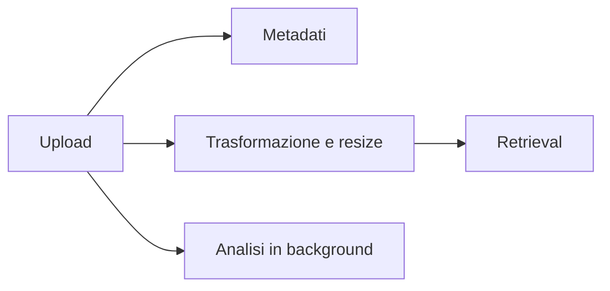
```mermaid
flowchart LR
    U["Upload"] --> M["Metadati"]
    U --> T["Trasformazione e resize"]
    T --> R["Retrieval"]
    U --> A["Analisi in background"]
```

Domande architetturali:

- Dove risiedono i byte delle immagini?
- Dove vengono eseguite trasformazioni e resize?
- Quali passaggi devono essere sincroni per rispondere all'utente?
- Quali attività possono essere demandate a una coda?
- Chi decide il placement?
- Come si localizza lo shard corretto?
- Cosa accade se un componente è lento o irraggiungibile?

Lo stesso sistema può comporre front-end stateless, processamento partizionato, stato replicato e analisi asincrona. Non serve imporre un'unica struttura a tutti i sottosistemi.

## 12. Errori concettuali da evitare

1. **Pensare che la decomposizione rimuova le dipendenze.** Le rende esplicite e può trasformarle in comunicazione remota.
2. **Confondere decomposizione e placement.** La prima sceglie le parti; il secondo sceglie dove collocarle.
3. **Ottimizzare soltanto il volume di comunicazione.** Collocare tutto su una macchina minimizza il traffico ma annulla la distribuzione del lavoro.
4. **Trattare $C(\Pi)$ come tempo di comunicazione.** Il tempo dipende anche da latenza, numero di messaggi, topologia e congestione.
5. **Credere che più worker scalino lo stato condiviso.** Il carico sullo stato è $\lambda_s=r\lambda$ e può restare il collo di bottiglia.
6. **Pensare che l'asincronia elimini una dipendenza.** La sposta nel tempo e richiede buffering, durabilità e gestione degli errori.
7. **Considerare sempre superiore il controllo distribuito.** Centralizzazione e distribuzione hanno costi diversi e dipendono dalla portata della decisione.

## 13. Formulario essenziale

| Concetto                    | Formula                                                                              |
| --------------------------- | ------------------------------------------------------------------------------------ |
| Placement                   | $\pi:V\to H$                                                                         |
| Archi remoti                | $E_{\text{cut}}(\pi)=\{(u,v)\in E:\pi(u)\neq\pi(v)\}$                                |
| Edge-cut pesato             | $C_{\text{edge}}(\pi)=\sum_{e\in E_{\text{cut}}(\pi)}w_e$                            |
| Connettività di un iperarco | $\lambda_n(\Pi)=\left\| \left\{i \mid n \cap V_i \neq \varnothing \right\} \right\|$ |
| Connectivity-1              | $C(\Pi)=\sum_{n\in N}c_n(\lambda_n-1)$                                               |
| Vincolo di bilanciamento    | $W(V_i)\leq(1+\varepsilon)\dfrac{W(V)}{p}$                                           |
| Costo di un messaggio       | $T_{\text{msg}}\approx\alpha+\beta m$                                                |
| Carico sullo stato          | $\lambda_s=r\lambda$                                                                 |
| Catena sincrona             | $T_{\text{e2e}}\approx T_A+L_{A,B}+T_B+L_{B,A}$                                      |
| Fork/join                   | $T_{\text{join}}\approx T_A+\max(T_B,T_C)$                                           |

## 14. Possibili domande d'esame

### Qual è la differenza tra decomposizione e placement?

La decomposizione definisce i componenti e i loro confini; il placement assegna tali componenti agli host. Una stessa decomposizione può avere costi di comunicazione molto diversi con placement differenti.

### Perché un ipergrafo può modellare meglio una dipendenza condivisa?

Un singolo iperarco può rappresentare uno stesso dato usato da più componenti. In un grafo ordinario sarebbero necessari più archi, che potrebbero essere erroneamente interpretati come trasferimenti indipendenti.

### Perché non basta minimizzare $C(\Pi)$?

La soluzione minima assoluta colloca tutto in una sola partizione, ottenendo zero comunicazione ma nessuna distribuzione del carico. Serve un problema vincolato che minimizzi la comunicazione rispettando il bilanciamento.

### Qual è la differenza tra volume e tempo di comunicazione?

Il volume conta i byte trasferiti, mentre il tempo dipende anche da startup, latenza, numero dei messaggi, rete, congestione e possibilità di sovrapporre comunicazione e calcolo.

### Perché partizionare lo stato non elimina i problemi architetturali?

Migliora località e capacità, ma richiede di trovare l'owner corretto, instradare le richieste, muovere i dati e riequilibrare le partizioni. Con la replica si aggiungono consistenza e coordinamento.

### Che cosa cambia introducendo un broker asincrono?

Il producer non deve più attendere direttamente il consumer. L'accoppiamento temporale si riduce, ma emergono requisiti di durabilità, retry, deduplicazione, ordering, backpressure e scalabilità del broker.

## 15. Sintesi finale

- La decomposizione crea confini e rende alcune dipendenze remote.
- Il placement determina quali dipendenze attraversano la rete.
- Grafi e ipergrafi permettono di ragionare formalmente sulla comunicazione.
- La minimizzazione della comunicazione deve rispettare il bilanciamento del carico.
- Il volume trasferito non coincide con il tempo di comunicazione.
- Stato privato, condiviso, partizionato o replicato produce vincoli differenti.
- Esecuzione e decisione possono essere centralizzate o distribuite in modi diversi.
- Sincronia, parallelismo e asincronia cambiano il cammino critico e il modo in cui i componenti attendono.
- Un'architettura non elimina magicamente i vincoli di scalabilità: li rende visibili e li sposta.

## Riferimenti principali

- D. L. Parnas, *On the Criteria To Be Used in Decomposing Systems into Modules*, 1972.
- M. Stonebraker, *The Case for Shared Nothing*, 1986.
- Ü. V. Çatalyürek e C. Aykanat, *Hypergraph-Partitioning-Based Decomposition for Parallel Sparse-Matrix Vector Multiplication*, 1999.
- B. Hendrickson e T. G. Kolda, *Graph Partitioning Models for Parallel Computing*, 2000.
- G. Karypis e V. Kumar, *A Fast and High Quality Multilevel Scheme for Partitioning Irregular Graphs*, 1998.

# 23/9

---
title: "Lezione 3 - Sorgenti e limiti della scalabilità I"
course: "Scalable Distributed Computing"
academic_year: "2026/2027"
tags:
  - distributed-systems
  - scalability
  - performance-modeling
  - bottlenecks
---
## Obiettivo della lezione

Una curva di scalabilità scadente è un'**osservazione**, non una diagnosi. Curve esteriormente simili possono essere prodotte da meccanismi interni diversi; di conseguenza richiedono interventi differenti.

Il metodo seguito nella lezione è:

```mermaid
flowchart LR
    O["Osservazione"] --> H["Ipotesi sul meccanismo"]
    H --> M["Modello quantitativo minimo"]
    M --> P["Predizione verificabile"]
    P --> V["Misura e validazione"]
    V --> D["Conferma o rifiuto dell'ipotesi"]
```

Il vero lavoro non consiste quindi nel dare un nome alla forma della curva, ma nello spiegare **perché** il sistema potrebbe produrla.

## 1. Sistema di riferimento

La lezione usa ripetutamente una piccola architettura astratta:

```mermaid
flowchart LR
    I["Ingress"] --> Q["Coda delle richieste"]
    Q --> W["Worker del servizio"]
    W --> S["Servizio di stato condiviso"]
    S --> D["Servizio downstream"]
    D --> R["Risposte"]
    C["Controllo"] -.-> W
    C -.-> S
```

Non rappresenta un prodotto specifico. Serve a isolare diversi possibili limiti dello stesso percorso end-to-end:

- lavoro non scalabile;
- capacità fissa condivisa;
- attesa e contesa;
- lavoro aggiuntivo creato dalla scala;
- coordinamento.

La variabile di controllo principale è il numero $N$ di worker; gli osservabili principali sono throughput e latenza.

## 2. Dal modello ideale al gap di scalabilità

Per un lavoro fisso $W$, il modello ideale prevede:

$$
T_{\text{ideal}}(N)=\frac{W}{N}
$$

e quindi:

$$
S_{\text{ideal}}(N)=N
$$

Raddoppiando le risorse, il tempo dovrebbe dimezzarsi oppure la capacità utile dovrebbe raddoppiare. Un sistema reale può invece mostrare rendimenti decrescenti, un plateau o persino un calo delle prestazioni.

Definiamo il **gap di scalabilità**:

$$
G(N)=T_{\text{real}}(N)-T_{\text{ideal}}(N)
$$

con:

$$
T_{\text{real}}(N)>T_{\text{ideal}}(N)
$$

La domanda diagnostica è: da quale meccanismo deriva $G(N)$?

### 2.1 Forme qualitative da spiegare

| Forma osservata | Possibile spiegazione iniziale |
|---|---|
| Crescita con rendimenti decrescenti | Lavoro non scalabile |
| Plateau | Capacità fissa condivisa |
| Picco seguito da declino | Contesa o overhead dipendente dalla scala |
| Completamento dominato dalla coda | Il partecipante più lento determina il tempo |

Queste associazioni sono ipotesi di partenza, non conclusioni automatiche.

## 3. Amdahl come baseline diagnostica

Benché un servizio online non sia normalmente un job batch, si può congelare analiticamente il workload per isolare l'effetto della sola parte non parallelizzabile.

Siano:

$$
s=\frac{T_{\text{serial}}}{T(1)}
$$

e:

$$
1-s=\frac{T_{\text{parallel}}}{T(1)}
$$

La legge di Amdahl fornisce:

$$
S(N)=\frac{1}{s+\frac{1-s}{N}}
$$

Moltiplicando numeratore e denominatore per $N$:

$$
S(N)=\frac{N}{sN+1-s}
$$

Questa forma è utile per studiare marginalità e curvatura.

> [!note]
> Amdahl e Gustafson rispondono a domande diverse. Amdahl considera lavoro fisso e viene usata qui come baseline diagnostica; Gustafson considera lavoro utile scalato. La vicinanza tra Gustafson e weak scaling non li rende sinonimi.

## 4. Rendimento marginale delle risorse

### 4.1 Rilassamento continuo

Le macchine sono discrete, quindi realmente $N\in\mathbb{N}$. Per studiare la forma della curva si estende temporaneamente il modello a $N\in\mathbb{R}^{+}$.

Questo rilassamento permette di usare le derivate, ma non implica l'esistenza di frazioni di macchina. Le decisioni reali dovranno essere ricondotte a valori interi.

### 4.2 Prima derivata

Partendo da:

$$
S(N)=\frac{N}{sN+1-s}
$$

si ottiene:

$$
S'(N)=\frac{1-s}{(sN+1-s)^2}
$$

Per $0<s<1$:

$$
S'(N)>0
$$

ma:

$$
\lim_{N\to\infty}S'(N)=0
$$

Il beneficio marginale di ulteriori risorse rimane positivo, ma tende a zero.

### 4.3 Seconda derivata e concavità

Derivando ancora:

$$
S''(N)=-\frac{2s(1-s)}{(sN+1-s)^3}
$$

Per $0<s<1$:

$$
S''(N)<0
$$

La curva è concava: ogni risorsa aggiuntiva contribuisce meno della precedente.

```mermaid
flowchart TD
    A["Più risorse"] --> B["Speedup ancora crescente"]
    B --> C["Guadagno marginale più piccolo"]
    C --> D["Rendimenti decrescenti"]
```

### 4.4 Guadagno discreto

Per una decisione reale, il guadagno di un nodo aggiuntivo è:

$$
\Delta S(N)=S(N+1)-S(N)
$$

Le derivate descrivono la struttura della curva; la differenza finita risponde direttamente alla domanda “quanto guadagno aggiungendo un nodo?”.

### 4.5 Esempio con $s=0.05$

| $N$ | $S(N)$ | Efficienza $S(N)/N$ | $\Delta S(N)$ |
|---:|---:|---:|---:|
| $4$ | $3.48$ | $0.87$ | $0.63$ |
| $16$ | $9.14$ | $0.57$ | $0.31$ |
| $64$ | $15.42$ | $0.24$ | $0.06$ |

Il sistema continua a migliorare, ma il valore economico di “un nodo in più” crolla molto prima di raggiungere il limite teorico.

## 5. Quanto costa avvicinarsi al limite di Amdahl?

Il limite massimo è:

$$
S_{\max}=\frac{1}{s}
$$

Supponiamo di volere almeno una frazione $\rho$ del limite:

$$
S(N)\geq\rho S_{\max}
$$

Sostituendo le formule:

$$
\frac{N}{sN+1-s}\geq\frac{\rho}{s}
$$

Poiché i denominatori sono positivi per $0<s<1$ e $N>0$:

$$
sN\geq\rho(sN+1-s)
$$

$$
sN(1-\rho)\geq\rho(1-s)
$$

e quindi:

$$
N\geq\frac{\rho(1-s)}{s(1-\rho)}
$$

Con $s=0.05$, si ha $S_{\max}=20$:

| Frazione $\rho$ | Speedup desiderato | $N$ continuo minimo |
|---:|---:|---:|
| $0.80$ | $16$ | $76$ |
| $0.90$ | $18$ | $171$ |
| $0.95$ | $19$ | $361$ |

Gli ultimi punti percentuali sono molto costosi. Per il deployment si arrotonda verso l'alto a un numero intero ammissibile.

## 6. Limite diagnostico di Amdahl

Poiché $S'(N)>0$, Amdahl può descrivere una curva che cresce sempre più lentamente e si appiattisce verso un asintoto. Non può però descrivere una capacità che, superato un picco, **diminuisce**.

```mermaid
flowchart LR
    A["Parte seriale"] --> B["Rendimenti decrescenti"]
    B --> C["Appiattimento asintotico"]
    C --> D["Nessun calo previsto"]
```

Se le prestazioni peggiorano aggiungendo risorse, è necessario introdurre un altro meccanismo nel modello.

## 7. Capacità condivisa fissa

Consideriamo ora worker scalabili seguiti da un servizio di stato con capacità fissa.

Sia $x$ la capacità di un singolo worker. La capacità totale del tier dei worker è:

$$
X_{\text{workers}}(N)=Nx
$$

Sia $C$ la capacità massima della risorsa condivisa. Poiché ogni richiesta deve attraversare entrambi gli stadi:

$$
X(N)=\min\{Nx,C\}
$$

Il limite end-to-end è la capacità più piccola.

### 7.1 Due regimi

$$
Nx<C\quad\Longrightarrow\quad X(N)=Nx
$$

$$
Nx\geq C\quad\Longrightarrow\quad X(N)=C
$$

Il punto di attraversamento continuo è:

$$
N^{*}=\frac{C}{x}
$$

Il primo numero intero di worker capace di saturare la risorsa condivisa è:

$$
N_{\text{sat}}=\left\lceil\frac{C}{x}\right\rceil
$$

```mermaid
flowchart LR
    W["Capacità dei worker"] --> M{"Capacità minima"}
    S["Capacità dello stato condiviso"] --> M
    M --> X["Throughput end-to-end"]
```

### 7.2 Esempio

Supponiamo:

$$
x=700\ \text{richieste/s per worker}
$$

e:

$$
C_{\text{state}}=10\,000\ \text{richieste/s}
$$

Allora:

$$
\frac{C_{\text{state}}}{x}=\frac{10\,000}{700}\approx14.29
$$

e quindi:

$$
N_{\text{sat}}=15
$$

Oltre circa $15$ worker, aggiungere capacità al solo tier dei worker non sposta il plateau.

Con $20$ worker:

$$
20\cdot700=14\,000\ \text{richieste/s}
$$

ma il throughput end-to-end resta vicino a $10\,000$ richieste al secondo. Portando invece lo stato condiviso a $20\,000$ richieste al secondo, il tier dei worker torna a essere il limite attivo, vicino a $14\,000$ richieste al secondo.

## 8. Migrazione del collo di bottiglia

Rimuovere un collo di bottiglia non rende illimitato il sistema: può soltanto esporre il limite successivo.

Se:

$$
C_{\text{state}}=10\,000,\qquad C_{\text{down}}=14\,000
$$

allora inizialmente:

$$
X(N)=\min\{700N,10\,000,14\,000\}
$$

Dopo aver portato lo stato a $20\,000$ richieste al secondo:

$$
X(N)=\min\{700N,20\,000,14\,000\}
$$

Il plateau dello stato scompare, ma compare quello del servizio downstream.

```mermaid
flowchart LR
    B1["Bottleneck sullo stato"] --> I["Intervento sullo stato"]
    I --> B2["Bottleneck downstream"]
    B2 --> N["Nuova diagnosi"]
```

Un modello di capacità è utile perché permette di confrontare gli interventi **prima** del deployment.

### 8.1 Predizioni verificabili

Se la capacità condivisa fissa è la spiegazione corretta, aumentando $N$ oltre $N_{\text{sat}}$ dovremmo osservare:

- throughput vicino a $C$;
- risorsa condivisa prossima alla saturazione;
- worker aggiuntivi sempre meno utilizzati;
- spostamento del plateau quando aumenta $C$.

Un modello utile non si limita ad adattarsi alla curva: suggerisce che cosa misurare dopo.

## 9. Contesa e attesa

Il bottleneck indica **dove** la capacità smette di crescere. La contesa descrive invece che cosa fanno i partecipanti in eccesso: attendono, si bloccano, ritentano oppure competono per punti di serializzazione interni.

```mermaid
flowchart LR
    W1["Worker"] --> Q["Coda o attesa"]
    W2["Worker"] --> Q
    W3["Worker"] --> Q
    W4["Worker"] --> Q
    Q --> S["Stato condiviso"]
```

Supponiamo che il servizio di stato ammetta al massimo $8$ operazioni concorrenti e sia già sempre occupato:

| Worker | Operazioni attive | Potenzialmente in attesa | Throughput utile |
|---:|---:|---:|---:|
| $8$ | $8$ | $0$ | $\approx C$ |
| $16$ | $8$ | $8$ | $\approx C$ |
| $32$ | $8$ | $24$ | $\approx C$ |

Il throughput resta piatto, ma cresce la quantità di lavoro bloccato. Una curva piatta può quindi nascondere una contesa in rapido aumento.

### 9.1 Modello minimo

Un modello intenzionalmente semplice è:

$$
T(N)=T_{\text{useful}}(N)+T_{\text{wait}}(N)
$$

In un regime nel quale la contesa aumenta con il numero di worker:

$$
T'_{\text{wait}}(N)>0
$$

Predizione: se la contesa domina, aumentando $N$ devono crescere lunghezza delle code, tempo bloccato, lock-wait o retry, anche quando il throughput utile non cresce più.

## 10. Contesa e overhead non sono la stessa cosa

| Contesa | Overhead creato dalla scala |
|---|---|
| Gli attori non possono progredire perché una risorsa è occupata | Il sistema più grande esegue effettivamente più lavoro |
| Crescono tempo in coda, blocchi e stalli | Crescono messaggi, byte, metadata, retry o sincronizzazioni |
| Si misura il tempo di attesa | Si misura il volume totale di lavoro aggiuntivo |

Le due cause possono coesistere e produrre curve simili, ma richiedono osservabili diversi per essere distinte.

## 11. Osservabilità e diagnosi

Per verificare i modelli servono metriche, ma anche l'osservabilità ha un costo: raccolta, trasferimento e analisi dei dati generano traffico e overhead. Occorre quindi raccogliere misure capaci di discriminare tra ipotesi senza perturbare eccessivamente il sistema.

Esempio pratico discusso a lezione: se il database è il collo di bottiglia, non è detto che vada sostituito. Un indice o un miglioramento locale può rimuovere quel limite e far migrare il bottleneck altrove.

## 12. Formulario essenziale

| Concetto | Formula |
|---|---|
| Tempo ideale | $T_{\text{ideal}}(N)=W/N$ |
| Gap di scalabilità | $G(N)=T_{\text{real}}(N)-T_{\text{ideal}}(N)$ |
| Amdahl | $S(N)=\dfrac{N}{sN+1-s}$ |
| Guadagno marginale continuo | $S'(N)=\dfrac{1-s}{(sN+1-s)^2}$ |
| Curvatura | $S''(N)=-\dfrac{2s(1-s)}{(sN+1-s)^3}$ |
| Guadagno discreto | $\Delta S(N)=S(N+1)-S(N)$ |
| Risorse per una frazione del limite | $N\geq\dfrac{\rho(1-s)}{s(1-\rho)}$ |
| Capacità end-to-end | $X(N)=\min\{Nx,C\}$ |
| Primo punto di saturazione | $N_{\text{sat}}=\left\lceil C/x\right\rceil$ |
| Tempo con contesa | $T(N)=T_{\text{useful}}(N)+T_{\text{wait}}(N)$ |

## 13. Possibili domande d'esame

### Perché una scarsa scalabilità non è già una diagnosi?

Perché rendimenti decrescenti, plateau e declino possono derivare da parti seriali, capacità fisse, contesa o overhead. Bisogna formulare un meccanismo, derivarne una predizione e misurare osservabili capaci di distinguerlo dalle alternative.

### Che cosa aggiungono le derivate alla legge di Amdahl?

La prima derivata quantifica il rendimento marginale delle risorse; la seconda mostra che il rendimento è decrescente. L'asintoto indica il limite, mentre le derivate descrivono come ci si avvicina a esso.

### Perché Amdahl non descrive il retrograde scaling?

Per $0<s<1$, $S'(N)>0$ per ogni $N>0$. Lo speedup cresce sempre, anche se sempre più lentamente; non può diminuire senza introdurre un costo aggiuntivo dipendente dalla scala.

### Come si determina il plateau causato da una capacità condivisa?

Si modella il throughput come $X(N)=\min\{Nx,C\}$. Il primo numero di worker capace di saturare la risorsa è $N_{\text{sat}}=\lceil C/x\rceil$.

### Qual è la differenza tra bottleneck e contesa?

Il bottleneck determina la capacità massima attiva; la contesa determina quanto lavoro resta in attesa o compete quando troppi partecipanti raggiungono quella risorsa.

## 14. Sintesi finale

- Una curva anomala deve essere spiegata attraverso meccanismi verificabili.
- Amdahl descrive rendimenti decrescenti e appiattimento, ma non un declino.
- Avvicinarsi agli ultimi punti percentuali del limite può richiedere moltissime risorse.
- Una capacità condivisa fissa produce un plateau modellabile mediante un minimo tra capacità.
- Rimuovendo un bottleneck, il vincolo può migrare lungo il percorso end-to-end.
- Throughput piatto e attesa crescente possono coesistere.
- Contesa e overhead creato dalla scala sono fenomeni distinti e richiedono misure differenti.

## Riferimenti principali

- G. M. Amdahl, *Validity of the Single Processor Approach to Achieving Large Scale Computing Capabilities*, 1967.
- N. J. Gunther, *A General Theory of Computational Scalability Based on Rational Functions*, 2008.
- B. Schwartz, *Forecasting MySQL Scalability with the Universal Scalability Law*, 2011.
- A. B. Bondi, *Characteristics of Scalability and Their Impact on Performance*, 2000.

# 25/9

---
title: "Lezione 4 - Sorgenti e limiti della scalabilità II"
course: "Scalable Distributed Computing"
academic_year: "2026/2027"
tags:
  - distributed-systems
  - scalability
  - overhead
  - stragglers
  - universal-scalability-law
---
## Obiettivo della lezione

La lezione completa l'analisi dei principali meccanismi che piegano una curva di scalabilità:

- lavoro aggiuntivo creato dalla scala;
- picco e successivo declino delle prestazioni;
- straggler, code di latenza e sincronizzazione;
- sbilanciamento del lavoro o delle velocità;
- sintesi descrittiva mediante Universal Scalability Law.

```mermaid
flowchart TD
    A["Aumento delle risorse"] --> O["Overhead dipendente dalla scala"]
    A --> F["Maggiore fan-out"]
    A --> C["Più coordinamento"]
    O --> R["Picco e declino"]
    F --> T["Dominio delle code di latenza"]
    C --> R
```

## 1. La scala può creare nuovo lavoro

Consideriamo un intervallo di osservazione fisso. Se ogni worker genera mediamente $h$ operazioni di controllo, il volume delle operazioni di controllo è:

$$
M_{\text{control}}(N)=hN
$$

Aggiungere worker non redistribuisce soltanto il lavoro utile: può creare heartbeat, rinnovi di lease, registrazioni di routing, bookkeeping dello scheduler, aggiornamenti di metadata e traffico di monitoraggio.

La relazione precedente descrive il **volume di lavoro**, non ancora il tempo trascorso. Per modellare il tempo occorre un'ipotesi aggiuntiva. Nel regime operativo considerato, supponiamo che la penalità temporale sia approssimativamente lineare:

$$
H(N)=cN
$$

$c$ riassume il modo in cui il lavoro aggiuntivo si traduce in tempo.

> [!warning]
> Da $M_{\text{control}}(N)=hN$ non segue automaticamente $H(N)=cN$. La seconda formula è un'ulteriore ipotesi di modellazione.

## 2. Modello con overhead lineare

Per un lavoro utile fisso $W$:

$$
T(N)=\frac{W}{N}+H(N)=\frac{W}{N}+cN
$$

Il primo termine diminuisce aumentando le risorse; il secondo cresce.

```mermaid
flowchart LR
    U["Riduzione del tempo utile"] --> B["Punto di bilanciamento"]
    O["Crescita dell'overhead"] --> B
    B --> M["Tempo totale minimo"]
```

Per valori piccoli di $N$ domina la riduzione del lavoro utile. Per valori grandi domina il costo creato dalla scala. Tra i due regimi esiste un minimo.

## 3. Derivazione del numero ottimale di risorse

### 3.1 Prima derivata

$$
T'(N)=-\frac{W}{N^2}+c
$$

Nel rilassamento continuo, un punto stazionario $N^{*}$ soddisfa:

$$
T'(N^{*})=0
$$

quindi:

$$
-\frac{W}{(N^{*})^2}+c=0
$$

$$
\frac{W}{(N^{*})^2}=c
$$

e infine:

$$
N^{*}=\sqrt{\frac{W}{c}}
$$

In questo punto il beneficio marginale della divisione ulteriore del lavoro uguaglia il costo marginale introdotto dalla scala.

### 3.2 Verifica del minimo

La seconda derivata è:

$$
T''(N)=\frac{2W}{N^3}
$$

Per $W>0$ e $N>0$:

$$
T''(N)>0
$$

La funzione è strettamente convessa e $N^{*}$ è un minimo.

### 3.3 Interpretazione dei due regimi

Per $N<N^{*}$:

$$
T'(N)<0
$$

e aggiungere risorse riduce il tempo.

Per $N>N^{*}$:

$$
T'(N)>0
$$

e l'overhead domina: aggiungere risorse rende il sistema più lento.

Questa è una spiegazione quantitativa del **retrograde scaling**.

## 4. Esempio numerico

Siano:

$$
W=3600\ \text{node-seconds},\qquad c=1\ \text{s/node}
$$

Il modello prevede:

$$
N^{*}=\sqrt{\frac{3600}{1}}=60
$$

Con $N=30$:

$$
T(30)=\frac{3600}{30}+30=120+30=150\ \text{s}
$$

Con $N=60$:

$$
T(60)=\frac{3600}{60}+60=60+60=120\ \text{s}
$$

Con $N=120$:

$$
T(120)=\frac{3600}{120}+120=30+120=150\ \text{s}
$$

| $N$ | Termine utile | Overhead | Tempo totale |
|---:|---:|---:|---:|
| $30$ | $120$ s | $30$ s | $150$ s |
| $60$ | $60$ s | $60$ s | $120$ s |
| $120$ | $30$ s | $120$ s | $150$ s |

Raddoppiare le risorse oltre l'ottimo peggiora le prestazioni.

L'uguaglianza dei due contributi in $N^{*}$ è una conseguenza specifica della forma $W/N+cN$. Il criterio generale rimane:

$$
T'(N^{*})=0
$$

### 4.1 Deployment intero

Poiché il numero di risorse è intero e $T(N)$ è convessa, si confrontano i due interi adiacenti al minimo continuo:

$$
N_{\mathbb{N}}^{*}
=
\operatorname*{arg\,min}_{n\in\{\lfloor N^{*}\rfloor,\lceil N^{*}\rceil\}}T(n)
$$

$N^{*}$ non è una dimensione universale del cluster: vale solo sotto le ipotesi del modello e cambia se cambia la forma dell'overhead.

## 5. Workload scalato

Supponiamo ora che il lavoro utile cresca linearmente con le risorse:

$$
W(N)=wN
$$

Con parallelismo ideale:

$$
T_{\text{useful}}(N)=\frac{W(N)}{N}=w
$$

Includendo il costo dipendente dalla scala:

$$
T(N)=w+H(N)
$$

e quindi:

$$
T'(N)=H'(N)
$$

Il termine di lavoro utile non cresce più con $N$; il comportamento dipende interamente dall'overhead:

$$
H'(N)\approx0\quad\Longrightarrow\quad T(N)\approx\text{costante}
$$

$$
H'(N)>0\quad\Longrightarrow\quad T(N)\ \text{cresce con la scala}
$$

Anche quando il lavoro per risorsa resta costante, l'efficienza complessiva può peggiorare se l'overhead cresce con il numero di partecipanti.

## 6. Strutture di coordinamento

In un'architettura master-worker, il numero di relazioni worker-controller cresce come:

$$
O(N)
$$

Se ogni coppia di partecipanti può interagire, il numero di coppie non ordinate è:

$$
\frac{N(N-1)}{2}
$$

mentre il numero di relazioni ordinate è:

$$
N(N-1)
$$

| $N$ | Relazioni worker-controller | Coppie non ordinate |
|---:|---:|---:|
| $10$ | $10$ | $45$ |
| $100$ | $100$ | $4950$ |

Questa non è l'affermazione che ogni sistema esegua un all-to-all. È un motivo strutturale che mostra come alcune opportunità di coordinamento possano crescere molto più rapidamente della capacità utile.

## 7. Code di latenza e completamento sincronizzato

Consideriamo ora un job distribuito con barriera. La fase può terminare soltanto quando tutti i worker hanno completato.

```mermaid
flowchart TD
    M["Master"] --> W1["Worker 1"]
    M --> W2["Worker 2"]
    M --> W3["Worker lento"]
    W1 --> B["Completamento della fase"]
    W2 --> B
    W3 --> B
```

Il tempo medio dei worker non è il modello di completamento corretto:

$$
T_{\text{phase}}=\max_i T_i
$$

Con un costo di sincronizzazione:

$$
T_{\text{phase}}=\max_i T_i+T_{\text{sync}}
$$

La dipendenza strutturale impone il massimo: non è una scelta fatta solo per comodità matematica.

### 7.1 Media sana, fase lenta

Supponiamo che, su $100$ worker:

- $99$ terminino in $10$ secondi;
- $1$ termini in $40$ secondi.

La media è:

$$
\frac{99\cdot10+40}{100}=10.3\ \text{s}
$$

ma la fase termina in:

$$
40\ \text{s}
$$

La media descrive il worker tipico; la barriera attende il massimo.

## 8. Fan-out e latenza end-to-end

Una richiesta può essere suddivisa in più rami paralleli, tutti necessari per il join finale.

```mermaid
flowchart LR
    R["Richiesta"] --> A["Ramo A"]
    R --> B["Ramo B"]
    R --> C["Ramo lento"]
    A --> J["Join"]
    B --> J
    C --> J
```

Se tutti i rami sono necessari:

$$
T_{\text{request}}=\max_i T_i
$$

Aumentando il fan-out aumenta la probabilità che almeno un ramo cada nella coda della distribuzione delle latenze. Una coda rara a livello del singolo servizio può quindi diventare frequente a livello end-to-end.

## 9. Straggler in MapReduce

Nel benchmark di sort del MapReduce originale, disabilitando i backup task si osservò una lunga coda finale:

| Osservazione | Valore riportato |
|---|---:|
| Istante in cui mancavano solo $5$ reduce task | $960$ s |
| Tempo aggiuntivo per gli ultimi straggler | circa $300$ s |
| Tempo totale senza backup task | $1283$ s |
| Aumento del tempo totale | $44\%$ |

Pochi task lenti possono dominare il tempo di un job altrimenti massicciamente parallelo.

## 10. Origine dello straggler

Per il worker $i$, siano:

- $W_i$ il lavoro assegnato;
- $r_i$ la velocità di elaborazione.

Il suo tempo è:

$$
T_i=\frac{W_i}{r_i}
$$

Se la fase attende tutti:

$$
T_{\text{completion}}=\max_i\frac{W_i}{r_i}
$$

Uno straggler può quindi derivare da due cause strutturalmente diverse:

| Sbilanciamento del lavoro | Eterogeneità delle velocità |
|---|---|
| $W_i$ insolitamente grande | $r_i$ insolitamente piccolo |
| Un worker riceve più lavoro | Un worker esegue più lentamente |
| Problema di partizionamento o skew | Problema di hardware, runtime, rete o contesa |

## 11. Esempi di sbilanciamento

Con quattro worker identici di velocità $r$:

$$
[10,10,10,10]\quad\Longrightarrow\quad T_A=\frac{10}{r}
$$

$$
[5,5,5,25]\quad\Longrightarrow\quad T_B=\frac{25}{r}
$$

Il lavoro totale è sempre $40$, ma la seconda fase dura $2.5$ volte la prima.

Con $100$ unità su $10$ worker:

- distribuzione bilanciata: ogni worker riceve $10$;
- distribuzione skewed: nove worker ricevono $6$ e uno riceve $46$.

Entrambe hanno:

$$
\sum_i W_i=100
$$

ma nel secondo caso il massimo è $46$ invece di $10$, quindi la fase sincronizzata può durare circa $4.6$ volte di più.

## 12. Efficienza del bilanciamento

Con worker aventi la stessa velocità $r$, confrontiamo tempo ideale e reale:

$$
E_{\text{balance}}=\frac{T_{\text{ideal}}}{T_{\text{completion}}}
$$

Sostituendo:

$$
E_{\text{balance}}=
\frac{\operatorname{avg}(W_i)/r}{\max_i(W_i)/r}
$$

La velocità comune si semplifica:

$$
E_{\text{balance}}
=
\frac{\operatorname{avg}(W_i)}{\max_i(W_i)}
\leq 1
$$

Per $[5,5,5,25]$:

$$
\operatorname{avg}(W_i)=10,\qquad\max_i(W_i)=25
$$

quindi:

$$
E_{\text{balance}}=\frac{10}{25}=0.4
$$

Rimane soltanto il $40\%$ dell'efficienza ideale di bilanciamento, anche se lavoro totale, hardware e numero di worker sono invariati.

## 13. Sintesi dei meccanismi

| Forma della curva o del tempo | Meccanismo principale |
|---|---|
| Appiattimento graduale | Lavoro non scalabile |
| Plateau netto | Capacità condivisa fissa |
| Picco e declino | Contesa oppure overhead creato dalla scala |
| Completamento dominato dalla coda | Massimo, straggler o sbilanciamento |

Il modello del massimo per job sincronizzati non deve essere sostituito da un modello di capacità media: descrivono oggetti differenti.

## 14. Universal Scalability Law

La **Universal Scalability Law** offre una famiglia descrittiva compatta a due parametri:

$$
C(N)=\frac{N}{1+\sigma(N-1)+\kappa N(N-1)}
$$

dove:

- $\sigma$ rappresenta una penalità con crescita lineare, collegata alla componente seriale o alla contesa coerente con la forma di Amdahl;
- $\kappa$ rappresenta una penalità dipendente dalla scala con crescita quadratica, associabile fenomenologicamente a coordinamento o interazioni tra partecipanti.

> [!important]
> In questa lezione la USL non viene derivata causalmente dai meccanismi del sistema di riferimento. $\sigma$ e $\kappa$ vanno trattati come coefficienti fenomenologici stimati dai dati, a meno che un modello specifico giustifichi un'interpretazione causale.

### 14.1 Collegamento con Amdahl

La forma classica è:

$$
S_A(N)=\frac{1}{\sigma+\frac{1-\sigma}{N}}
$$

Moltiplicando numeratore e denominatore per $N$:

$$
C_A(N)=\frac{N}{1+\sigma(N-1)}
$$

La derivata è:

$$
C_A'(N)=\frac{1-\sigma}{[1+\sigma(N-1)]^2}
$$

Per $0\leq\sigma<1$:

$$
C_A'(N)>0
$$

e, per $\sigma>0$:

$$
\lim_{N\to\infty}C_A(N)=\frac{1}{\sigma}
$$

La forma di Amdahl può piegarsi e saturare, ma non può produrre retrograde scaling.

### 14.2 Ruolo del termine quadratico

La USL aggiunge:

$$
\kappa N(N-1)
$$

Il numero di opportunità di interazione può crescere quadraticamente, mentre la capacità utile ideale cresce linearmente. Anche un costo molto piccolo per interazione può quindi diventare dominante.

| $N$ | Relazioni ordinate $N(N-1)$ |
|---:|---:|
| $8$ | $56$ |
| $32$ | $992$ |
| $64$ | $4032$ |

### 14.3 Casi notevoli

- Se $\sigma=0$ e $\kappa=0$, allora $C(N)=N$: scalabilità lineare ideale.
- Se $\kappa=0$ e $\sigma>0$, si ottiene la forma di Amdahl: crescita con saturazione asintotica.
- Se $\kappa>0$, il termine quadratico può produrre un massimo seguito da declino.

```mermaid
flowchart TD
    U["Modello USL"] --> I["Crescita lineare ideale"]
    U --> A["Appiattimento tipo Amdahl"]
    U --> P["Picco e declino"]
    A --> S["Termine lineare"]
    P --> K["Termine quadratico"]
```

La parola “Universal” non significa che la formula possa essere applicata senza validazione a qualunque sistema. È un modello compatto da adattare ai dati e interpretare con cautela.

## 15. Formulario essenziale

| Concetto | Formula |
|---|---|
| Volume di controllo | $M_{\text{control}}(N)=hN$ |
| Tempo con overhead lineare | $T(N)=W/N+cN$ |
| Derivata | $T'(N)=-W/N^2+c$ |
| Ottimo continuo | $N^{*}=\sqrt{W/c}$ |
| Convessità | $T''(N)=2W/N^3>0$ |
| Workload scalato | $W(N)=wN$ |
| Tempo con workload scalato | $T(N)=w+H(N)$ |
| Fase sincronizzata | $T_{\text{phase}}=\max_i T_i+T_{\text{sync}}$ |
| Tempo di un worker | $T_i=W_i/r_i$ |
| Completamento | $T_{\text{completion}}=\max_i(W_i/r_i)$ |
| Efficienza di bilanciamento | $E_{\text{balance}}=\operatorname{avg}(W_i)/\max_i(W_i)$ |
| USL | $C(N)=\dfrac{N}{1+\sigma(N-1)+\kappa N(N-1)}$ |

## 16. Possibili domande d'esame

### Come può l'aumento delle risorse creare lavoro?

Ogni nuovo partecipante può produrre heartbeat, lease, registrazioni, metadata, sincronizzazioni e traffico di monitoraggio. Il volume di queste operazioni dipende dalla scala e non esisterebbe nella stessa quantità in un sistema più piccolo.

### Come si deriva $N^{*}$ nel modello $T(N)=W/N+cN$?

Si pone a zero la derivata $T'(N)=-W/N^2+c$. Ne segue $W/(N^{*})^2=c$ e quindi $N^{*}=\sqrt{W/c}$. La seconda derivata positiva dimostra che è un minimo.

### Perché la media non descrive una fase con barriera?

La fase termina soltanto quando arriva l'ultimo partecipante. Il tempo è quindi determinato da $\max_i T_i$, non dalla media. Pochi straggler possono dominare il completamento.

### Da quali cause può derivare uno straggler?

Da un lavoro assegnato $W_i$ molto grande oppure da una velocità $r_i$ molto bassa. I due casi richiedono diagnosi e rimedi diversi.

### Che cosa rappresentano $\sigma$ e $\kappa$ nella USL?

$\sigma$ descrive una penalità lineare coerente con serializzazione o contesa; $\kappa$ descrive una penalità che cresce quadraticamente con la scala. Sono coefficienti descrittivi finché non viene giustificata una lettura causale.

### Perché il termine quadratico può causare retrograde scaling?

La capacità utile ideale cresce come $N$, mentre la penalità può crescere come $N(N-1)$. Per $N$ sufficientemente grande, la penalità domina il numeratore lineare e la capacità normalizzata diminuisce.

## 17. Sintesi finale

- La scala può generare lavoro aggiuntivo oltre a redistribuire quello utile.
- Nel modello $W/N+cN$ esiste un numero ottimale di risorse; oltre quel punto il sistema rallenta.
- Con workload scalato, il comportamento è determinato dalla crescita dell'overhead.
- Nei job sincronizzati conta il partecipante più lento, non il partecipante medio.
- Fan-out, skew ed eterogeneità amplificano le code di latenza.
- La USL ricompone in una formula descrittiva crescita ideale, appiattimento e declino.
- L'adattamento di una curva non sostituisce una diagnosi causale e deve essere validato con misure appropriate.

## Riferimenti principali

- G. M. Amdahl, *Validity of the Single Processor Approach to Achieving Large Scale Computing Capabilities*, 1967.
- J. Dean e S. Ghemawat, *MapReduce: Simplified Data Processing on Large Clusters*, 2004.
- N. J. Gunther, *A General Theory of Computational Scalability Based on Rational Functions*, 2008.
- B. Schwartz, *Forecasting MySQL Scalability with the Universal Scalability Law*, 2011.
- A. B. Bondi, *Characteristics of Scalability and Their Impact on Performance*, 2000.

# 30/9

# 2/10