# 15/9

ICT = Information and Communication Technology

Verification = “check that we are building the thing right”
Validation = “check that we are building the right thing”

Formal methods are the “applied mathematics for modelling and analysing ICT systems”

Formal Verification Techniques for Property P:
- Deductive methods
	- method: provide a formal proof that P holds
	- tool: theorem prover/proof assistant of proof checker
	- appicable if: system has form of a mathematical theory
- Model Checking
	- method: systematic checker on P in all states
	- tool: model checker (SPIN, NUMSMV, UPPALL)
	- appicable if: system generates (finite) behavioural model
- Model-based simulation or testing
	- method: test for P by exploring possible behaviours
	- applicable if: system defines an executable model

Simulation and Testing:
- Basic Procedure:
	- take a model (simulation) or a realisation (testing)
	- stimulate it with certain inputs (the test)
	- observe reaction and check wheter this is "desired"
- Important drawbacks:
	- number of possible behaviours is very large (or even infinite)
	- unexplored behaviours may contain the fatal bug
- About testing: testing/simulation can show the presence of errors, not their absence

Example of Proof Rules:
1. Backward axiom
2. cut rule
3. Invariant rule
4. Logical rule

$$
\begin{align}
& \frac{}{\{A[e/x]\} x:= e \{A\}} & \\ \\
& \frac{\{A\}P\{B\} \; \{B\}Q\{C\}}{\{A\}P;Q\{C\}} & \\ \\
& \frac{\{I \land b\} P \{I\}}{\{I\}\text{while b do P}\{I\land \lnot B\}} & \\ \\
&\frac{A \implies A' \; \{A'\}P\{B'\} \; B' \implies B}{\{A\}P\{B\}}
\end{align}
$$

Model Checking Overview #TODO

What is Model Checking? Model checking is an automated technique that, given a finite-state model of a system and a formal property, systematically checks whether this property holds for (a given state in) that model.

What are Models?
- Tansistion systems
	- states labeled with basic proposition
	- Transition relation between states
	- Action-labeled transitions to facilitate composition
- Expressivity
	- Programs are transition systems
	- Multi-threading programs are transistion systems
	- Communicating processes are transition systems
	- Hardware circuits are transistion systems

What are Properties? #TODO 

The Model Checking Process:
- Modeling Phase
	- model the system under consideration
	- as a first sanity check, perform some simulations
	- formalise the property to be checked
- Running Phase
	- run the model checker to check the validity of the property in the model
- Analysis pahse
	- property satisfied ? check next property (if any)
	- property violated ? 
		- analyse generated counterexample by simulation
		- refine the model, design, or property . . . and repeat the entire procedure
	- out of memory ? try to reduce the model and try again

Pros of Model Checking:
- widely applicable
- allows for partial verification
- potential "push-button" technology
- rapidly increasing industrial interest
- in case of property violation, a counterexample is provided
- sound and interesting mathematical foundations
- not biased to the most possible scenarios

Cons of Model checking:
- main focus on control-insensitive applications
- model checking is only as "good" as the system model
- no garuantee about completeness of results
- impossible to check generalisations

Model checking is a very e↵ective technique to expose potential design errors

Transitions systems:


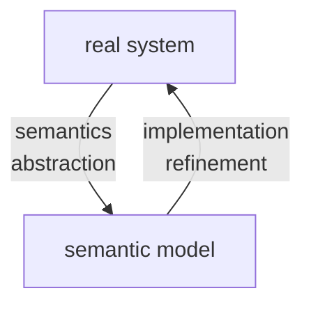

the semantic model yields a formal representation of:
- the states of the system (nodes)
- the stepwise behaviour (transistions)
- the initial state
- additional informations on
	- communication (actions)
	- state properties (atomic proposition)

T = (S,Act,->,$S_0$,AP,L):
- S = set of states
- Act = set of actions
- -> $\subseteq S \times Act \times S$ is the transition relation ($s \xrightarrow{\alpha} s'$)
- $S_0 \subseteq S$ = set of initial states
- AP = set of atomic propositions
- $L: S \to 2^{AP}$ labeling function

```
select nondeterministically an initial state s \in S_0
while s is non-terminal do
	select nondeterministically a transitions s(alpha)->s'
	execute the action alpha and puts s:=s'
```

executions: maximal "transitions sequences"

Reach(T) = set of all states that are reachable from an initial state through some execution

(interleaving) parallel execution of independent actions ($\alpha,\beta$ independent):
$$ \underbrace{x := x + 1}_{\text{action } \alpha} \;\parallel\; \underbrace{y := y - 3}_{\text{action } \beta} $$

(competition) parallel execution of dependent actions ($\alpha,\beta$ dependent):
$$ \underbrace{x := x + 1}_{\text{action } \alpha} \;\parallel\; \underbrace{y := 2*x}_{\text{action } \beta} $$

Model Checking:

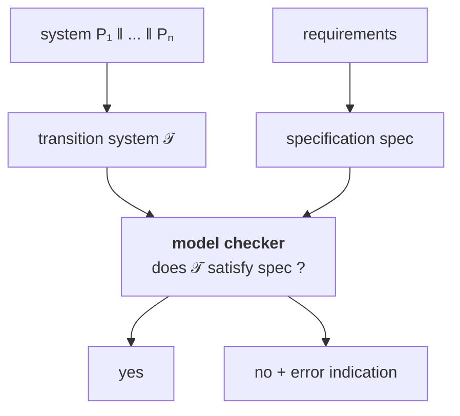

semantics = transistion system + model checker

Example TS for sequential circuit:
$\lambda_i,\delta_j  \; \hat{=} \; \{0,1\}^n \times \{0,1\}^k\to \{0,1\}$
$\lambda_i$ output value of output var $y_i$
$\delta_j$ next value for register $r_j$

![[Pasted image 20260917195251.png]]

1 output bit, no input, 100 register => 2^100 states
no output, 1 input bit, 100 register => 2^100 + 2^1 = 2^101 

Example TS for sequential program:

![[Pasted image 20260917195951.png]]

typed variable: variable x + data domain Dom(x)
- Boolean : x + Dom(x) = {0,1}
- Integer : y + Dom(y) = N
- variable z : Dom(z) = {yellow, red, blue}

type consistent function $\eta: Var \to Values$
- $\eta(x) \in Dom(x) \; \forall x \in Var$
- Values = $\bigcup_{x \in Var} Dom(x)$
- Eval(Var) = set of evaluations for Var

if Var is a set of typed variables then

Cond(Var) = set of Boolean conditions on the variables in Var

$(\lnot x \land y<z+3)$
Dom(x) = {0,1}
Dom(y)=Dom(y)=N
Dom(w)={yellow,red,blue}
$[x=0,y=3,z=6]\models \lnot x \land y < z$
$[x=0,y=3,z=6]\not\models x \lor y = z$

$Effect:Act \times Eval(Var) \to Eval(Var)$

A program graph over Var (set of typed vars) is:

P =(Loc, Act, Effect,->, $Loc_0$, $g_0$)
- Loc = finite set of locations (control states)
- Act = set of actions
- $Effect:Act \times Eval(Var) \to Eval(Var)$
- -> $\subseteq Loc \times Cond(Var) \times Act \times Loc$
	- $l \xrightarrow{g:\alpha}l'$
	- l,l' are locations
	- $g \in Cond(Var)$
	- $\alpha \in Act$
- $Loc_0 \subseteq Loc$ is set of the initial locations
- $g_0 \in Cond(Var)$ initial condition on the variables

Program graph P over Var => transition system $T_P$

state in $T_P$ = <l,$\eta$> = <location,variable evaluation>

$T_P$ = (S,Act,->,$S_0$,AP,L):
- $S = Loc \times Eval(Var)$
- $S_0  =\{<l,\eta>:l \in Loc_0,\eta \models g_0\}$
- $\frac{l \xrightarrow{g:\alpha}l' \;\land\; \eta \models g}{<l,\eta> \xrightarrow{\alpha}<l',Effect(\alpha,\eta)>}$
- $AP = Loc \cup Cond(Var)$
- $L(<l,\eta>)=\{l\} \cup \{g \in Cond(Var): \eta \models g\}$

Guarded Command Language (GCL) = high-level modeling language that contains features of imperative languages and nondeterministic choice

GCL-program -> program graph -> transition system

guarded command g => stmt:
- g = guard, Boolean condition on the program variables
- stmt = statement

```GCL
DO :: g=>stmt OD  /// WHILE g DO stmt OD
IF :: g => stmt1  /// IF g THEN stmt1
   :: ¬g =>stmt2  ///      ELSE stmt2
FI                /// FI
```

:: stands for the nondeterministic choice between enabled guarded commands

semantics of a GCL-program = program graph

| Action        | Enabled                                         | Effect                             |
| ------------- | ----------------------------------------------- | ---------------------------------- |
| `get_coke`    | if `#coke > 0`                                  | `#coke := #coke - 1`               |
| `get_sprite`  | if `#sprite > 0`                                | `#sprite := #sprite - 1`           |
| `refill`      | any time                                        | `#sprite := max`<br>`#coke := max` |
| `insert_coin` | any time                                        | no effect on variables             |
| `return_coin` | if machine is empty and user has entered a coin | no effect on variables             |

```
DO :: true => insert_coin;
      IF :: #sprite=#coke=0 => return_coin
         :: #coke > 0 => get_coke
         :: #sprite > 0 => get_sprite
	  FI
   :: true => refill
OD
```

start location (DO :: ...)
select location (IF :: \#sprite ...)
$\#sprite,\#coke \in \{0,1,\dots,max\}$

![[Pasted image 20260918171454.png]]
# 17/9

"real" parallel system $P = P_1 || \dots || P_n$
transition system $T = T_1 || \dots || T_n$ 
P -> T analysis semantics
T -> P compositional design

goal: define semantic parallel operators on transition system or program graphs that model "real" parallel operators

||| Interleaving operator for TS:
- interleaving of concurrent, independent actions of parallel processes (modelled by TS)
- representation by nondeterministic choice: "which subprocess performs the next step?"

$effect(\alpha|||\beta) = effect(\alpha;\beta+\beta;\alpha)$: parallel execution of $\alpha$ and $\beta$ on two processors $\hat{=}$ serial execution on a single processor in arbitrary order


$T_1 ||| T_2 = (S_1\times S_2,Act_1\cup Act_2,\to,S_{0,1}\times S_{0,2},AP,L)$:
- where $\to$ is given by:
	- $\frac{s_1 \xrightarrow{\alpha} s_1'}{<s_1,s_2> \xrightarrow{\alpha} <s_1',s_2>}$
	- $\frac{s_2 \xrightarrow{\alpha} s_2'}{<s_1,s_2> \xrightarrow{\alpha} <s_1,s_2'>}$
- $AP = AP_1 \uplus AP_2$
- $L(<s_1,s_2>)=L_1(s_1) \cup L_2(s_2)$

SOS = structured operational semantics

interleaving fails for dependent actions -> inconsistent states

$P_1 ||| P_2 = (Loc_1 \times Loc_2,\dots,\to,\dots)$:
- $\frac{l_1 \xrightarrow{g:\alpha} l_1'}{<l_1,l_2> \xrightarrow{g:\alpha} <l_1',l_2>}$
- $\frac{l_2 \xrightarrow{g:\alpha} l_2'}{<l_1,l_2> \xrightarrow{g:\alpha} <l_1,l_2'>}$

Process $P_1$:
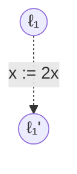

Process $P_2$:
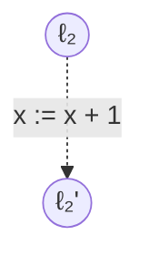

$P_1 ||| P_2$:
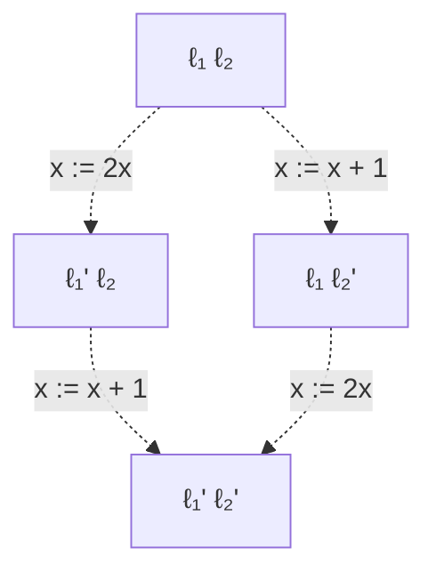

Transition system $T_{P_1 ||| P_2}$:
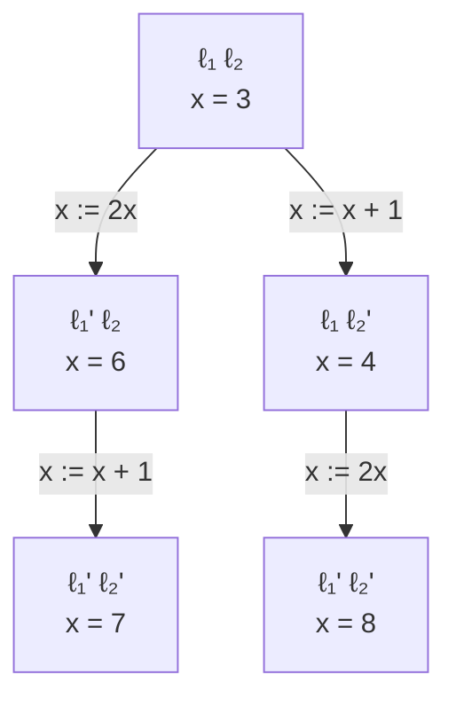

$T_{P_1|||P_2} \not =  T_{P_1} ||| T_{P_2}$

![[Pasted image 20260918183302.png]]

![[Pasted image 20260918183318.png]]

![[Pasted image 20260918183416.png]]

![[Pasted image 20260918183449.png]]

![[Pasted image 20260918183557.png]]

Peterson Algo:

![[Pasted image 20260918183623.png]]

![[Pasted image 20260918183801.png]]

![[Pasted image 20260918183812.png]]

value of $b_1$ is given by $wait_1 \lor crit_1$
value of $b_2$ is given by $wait_2 \lor crit_2$
\+ unrechable states

(incorrect)
![[Pasted image 20260919015845.png]]


Operators for parallelism and communication:
- true concurrency: interleaving operator ||| for TS (no communication, no dependencies)
- communication via shared variables
	- description of subsystems by program graphs
	- interleaving ||| for program graphs
	- TS is obtained by "unfolding"
- synchronous message passing <- data abstract
	- operator $|||_{Syn}$ for TS
	- interleaving for independent actions
	- synchronization over actions in Syn
- channel systems: communication via shared variables + via channels

$Syn \subseteq Act_1\cap Act_2$ = set of synchronization actions

$T_1 ||_{Syn} T_2 = (S_1 \times S_2,Act_1 \cup Act_2, \to, \dots)$

for modeling the concurrent execution of $T_1$ and $T_2$ with synchronization over all actions in Syn

interleaving for all actions $\alpha \in Act_i \setminus Syn$:
$$ \frac{s_1 \xrightarrow{\alpha} s'_1}{<s_1,s_2> \xrightarrow{\alpha} <s'_1,s_2>}$$

$$ \frac{s_2 \xrightarrow{\alpha} s'_2}{<s_1,s_2> \xrightarrow{\alpha} <s_1,s'_2>}$$

handshaking (rendezvous) for all $\alpha \in Syn$:
$$\frac{s_1 \xrightarrow{\alpha}_1s'_1 \land s_2 \xrightarrow{\alpha}_2 s'_2}{<s_1,s_2> \xrightarrow{\alpha} <s'_1,s'_2>}$$

mutual exclusion by synchronous message passing using an arbiter:

![[Pasted image 20260919175930.png]]

$(T_1 ||| T_2) \; ||_{Syn} \; Arbiter$ where Syn = {request, release}

pure interleaving for TS + handshaking for actions request and release

![[Pasted image 20260919180159.png]]

synchronization operator $||_{Syn}$ for three or more processes

![[Pasted image 20260919180259.png]]

![[Pasted image 20260919180316.png]]

![[Pasted image 20260919180441.png]]

# 18/9

## 1. Channel Systems

Un **Channel System (CS)** permette di rappresentare sistemi paralleli dipendenti dai dati in cui i processi possono comunicare mediante:

- **shared variables**;
- **synchronous message passing**;
- **asynchronous message passing**.

Le ultime due forme utilizzano dei **channels**.

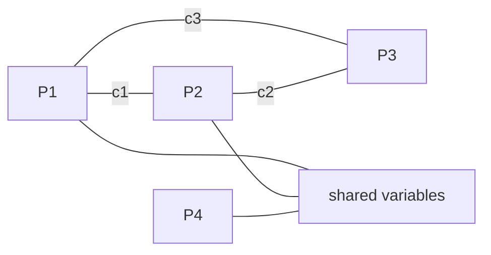

I channel possono essere di due tipi:

| Tipo | Capacità | Comunicazione |
|---|---:|---|
| synchronous | $0$ | sender e receiver devono sincronizzarsi |
| FIFO | $\geq 1$ | comunicazione asincrona |

La **capacity** di un FIFO channel indica il numero di celle disponibili nel buffer.

Quindi:

$$
cap(c)=0
\quad\Longrightarrow\quad
\text{synchronous channel}
$$

mentre:

$$
cap(c)\geq1
\quad\Longrightarrow\quad
\text{FIFO / asynchronous channel}
$$

---

## 2. Program Graphs e Channel Systems

I processi:

$$
P_1,\ldots,P_n
$$

sono rappresentati tramite **program graphs**.

Un processo può contenere normali transizioni condizionali:

$$
\ell_i
\xrightarrow{g:\alpha}
\ell_i'
$$

dove:

- $g$ è una guardia;
- $\alpha$ è un'azione.

Inoltre vengono introdotte delle **communication actions**.

## Sending

$$
\ell_i
\xrightarrow{c!v}
\ell_i'
$$

significa:

> invia il valore $v$ attraverso il channel $c$.

## Receiving

$$
\ell_i
\xrightarrow{c?x}
\ell_i'
$$

significa:

> ricevi un valore dal channel $c$ e assegnalo alla variabile $x$.

Possiamo quindi schematizzare:

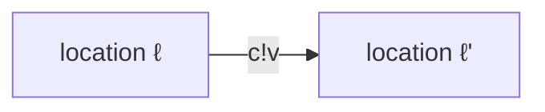

e:

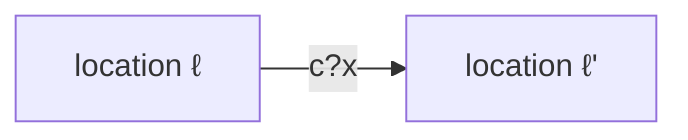

---

## 3. Typed Variables

Una variabile tipata $x$ possiede un dominio:

$$
Dom(x)
$$

Una **variable evaluation** per un insieme di variabili $Var$ è una funzione:

$$
\eta : Var \rightarrow Values
$$

che deve essere type-consistent, cioè:

$$
\eta(x)\in Dom(x)
$$

per ogni:

$$
x\in Var.
$$

L'insieme di tutte le valutazioni compatibili viene indicato con:

$$
Eval(Var)
$$

---

## 4. Typed Channels

Un channel tipato $c$ possiede:

- una capacità $cap(c)$;
- un dominio $Dom(c)$.

Formalmente:

$$
cap(c)\in \mathbb{N}\cup\{\infty\}
$$

e:

$$
Dom(c)
$$

definisce quali valori possono essere trasmessi sul channel.

---

## 5. Channel Evaluation

Per un insieme di channel $Chan$, una **channel evaluation** è una funzione:

$$
\xi : Chan \rightarrow Values^*
$$

Per ogni channel $c$:

$$
\xi(c)
$$

è una parola composta da elementi appartenenti a $Dom(c)$.

Inoltre:

$$
|\xi(c)|\leq cap(c)
$$

Per esempio:

$$
\xi(c)=v_1v_2v_3
$$

significa che il FIFO channel $c$ contiene:

$$
v_1,\ v_2,\ v_3
$$

nell'ordine indicato.

Possiamo interpretarlo come:

```text
front                            back
  ↓                                ↓
+----+----+----+----+----+
| v1 | v2 | v3 |    |    |
+----+----+----+----+----+
```

---

## 6. Definizione di Channel System

Un channel system ha la forma:

$$
[P_1 \mid P_2 \mid \ldots \mid P_n]
$$

dove ciascun $P_i$ è un program graph.

Il sistema è definito rispetto alla coppia:

$$
(Var,Chan)
$$

dove:

- $Var$ = insieme delle typed variables;
- $Chan$ = insieme dei typed channels.

Ogni program graph ha forma:

$$
P_i =
(Loc_i,Act_i,Effect_i,\rightarrow_i,Loc_{0,i},g_0)
$$

con transizioni del tipo:

$$
\ell
\xrightarrow{g:\alpha}_i
\ell'
$$

oppure azioni di comunicazione:

$$
\ell
\xrightarrow{c!v}_i
\ell'
$$

$$
\ell
\xrightarrow{c?x}_i
\ell'
$$

---

## 7. Comunicazione asincrona

Consideriamo un channel:

$$
c
$$

con:

$$
cap(c)\geq1.
$$

La comunicazione è **asynchronous**.

## Sending

L'azione:

$$
c!v
$$

è abilitata se:

$$
c\text{ non è pieno}.
$$

L'effetto è:

$$
add(c,v)
$$

cioè $v$ viene aggiunto in fondo alla coda.

Esempio:

$$
v_1v_2\ldots v_r
\xrightarrow{c!v}
v_1v_2\ldots v_rv
$$

## Receiving

L'azione:

$$
c?x
$$

è abilitata se il channel non è vuoto.

Se:

$$
v=front(c)
$$

allora vengono eseguiti:

$$
x:=v
$$

e:

$$
remove(c)
$$

Quindi:

$$
vv_2\ldots v_r
\xrightarrow{c?x}
v_2\ldots v_r
$$

con:

$$
x=v.
$$

## Riassunto

| Action | Enabled if | Effect |
|---|---|---|
| $c!v$ | channel $c$ not full | $add(c,v)$ |
| $c?x$ | channel $c$ not empty | $x:=front(c)$, $remove(c)$ |

---

## 8. Comunicazione sincrona

Se:

$$
cap(c)=0
$$

non esiste un buffer.

Le operazioni:

$$
c!v
$$

e:

$$
c?x
$$

devono quindi essere eseguite **contemporaneamente**.

L'effetto della comunicazione è:

$$
x:=v.
$$

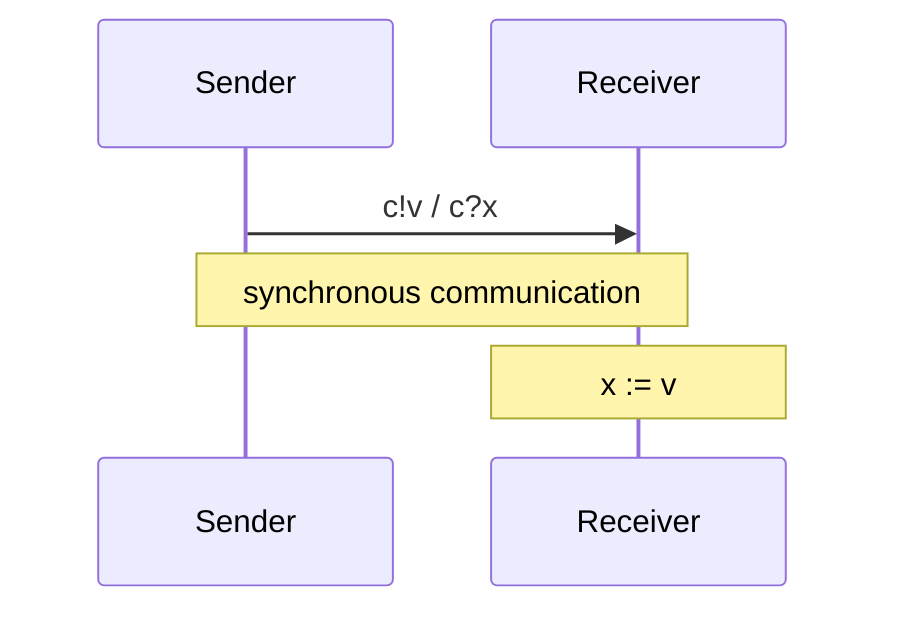

Non esiste quindi uno stato intermedio nel quale il messaggio è memorizzato nel channel.

---

## 9. Asynchronous vs Synchronous Communication

## Asynchronous

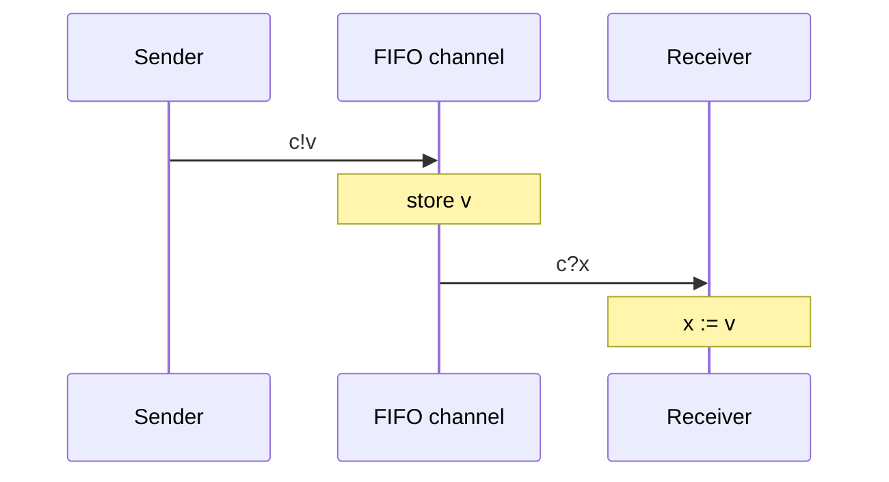

Sender e receiver possono agire in istanti differenti.

## Synchronous

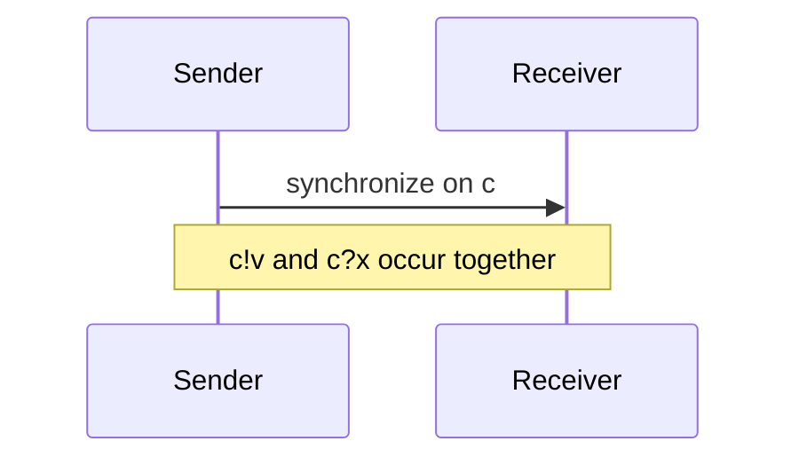

Il sender non può eseguire l'azione se nessun receiver corrispondente è pronto.

---

## 10. Transition-System Semantics dei Channel Systems

A un channel system:

$$
C=[P_1|\ldots|P_n]
$$

associamo un transition system:

$$
\mathcal{T}_C.
$$

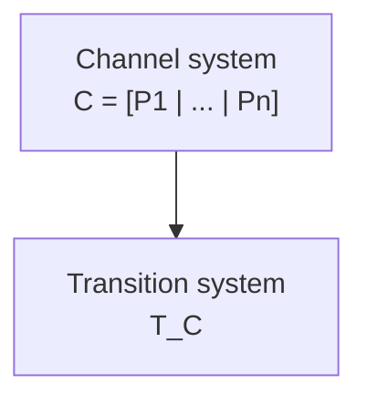

---

## 11. Stati di $\mathcal{T}_C$

Gli stati hanno forma:

$$
\langle
\ell_1,\ldots,\ell_n,\eta,\xi
\rangle
$$

dove:

- $\ell_i$ è la location corrente del processo $P_i$;
- $\eta$ è la valutazione delle variabili;
- $\xi$ è la valutazione dei channel.

Quindi uno stato contiene **tre tipi di informazioni**:

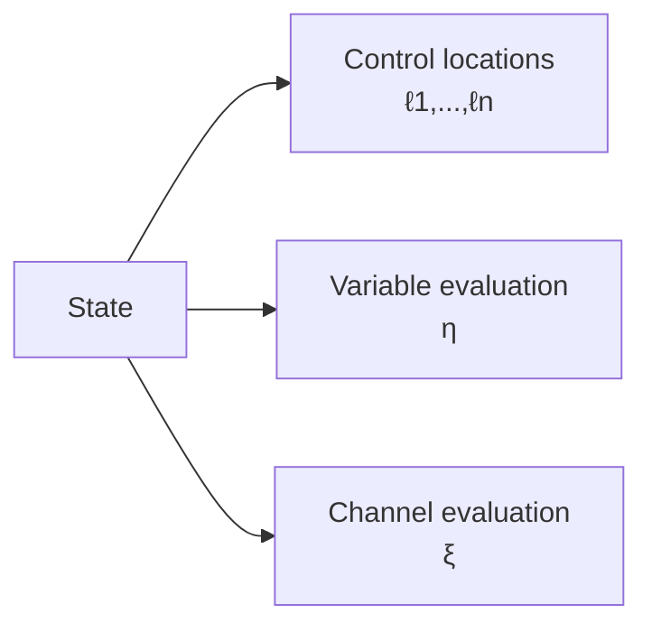

Formalmente:

$$
\ell_i\in Loc_i
$$

$$
\eta\in Eval(Var)
$$

$$
\xi\in Eval(Chan).
$$

---

## 12. Variable Evaluation

Formalmente:

$$
\eta :
Var
\rightarrow
\coprod_{x\in Var}Dom(x)
$$

con:

$$
\eta(x)\in Dom(x).
$$

L'idea importante è che $\eta$ rappresenta **lo stato corrente di tutte le variabili condivise**.

---

## 13. Channel Evaluation

Analogamente:

$$
\xi :
Chan
\rightarrow
\coprod_{c\in Chan}Dom(c)^*
$$

con:

$$
\xi(c)\in Dom(c)^*
$$

e:

$$
|\xi(c)|\leq cap(c).
$$

Per la rappresentazione tramite $\xi$ sono rilevanti soprattutto i channel con:

$$
cap(c)\geq1
$$

perché i channel sincroni non contengono messaggi memorizzati.

---

## 14. Transition Relation

La transition relation:

$$
\rightarrow
$$

di un Channel System è definita mediante **SOS rules** (*Structural Operational Semantics*).

Le regole appartengono a due categorie:

1. interleaving delle normali azioni;
2. message passing attraverso channel.

---

## 15. SOS Rule — Interleaving

Supponiamo che il processo $P_i$ abbia una transizione:

$$
\ell_i
\xrightarrow{g:\alpha}_i
\ell_i'
$$

e che:

$$
\eta\models g.
$$

Allora il Channel System può effettuare:

$$
\frac{
\ell_i\xrightarrow{g:\alpha}_i\ell_i'
\quad\land\quad
\eta\models g
}{
\langle
\ell_1,\ldots,\ell_i,\ldots,\ell_n,\eta,\xi
\rangle
\xrightarrow{\alpha}
\langle
\ell_1,\ldots,\ell_i',\ldots,\ell_n,
Effect_i(\alpha,\eta),\xi
\rangle
}
$$

Da notare che:

$$
\xi'=\xi.
$$

Una normale azione di un processo **non modifica i channel**.

---

## 16. SOS Rules — Asynchronous Message Passing

Consideriamo:

$$
cap(c)\geq1.
$$

### Receiving

Supponiamo:

$$
\ell_i
\xrightarrow{c?x}_i
\ell_i'
$$

e:

$$
\xi(c)=v_1v_2\ldots v_k
$$

con:

$$
k\geq1.
$$

Allora:

$$
\langle
\ell_1,\ldots,\ell_i,\ldots,\ell_n,\eta,\xi
\rangle
\xrightarrow{\tau}
\langle
\ell_1,\ldots,\ell_i',\ldots,\ell_n,\eta',\xi'
\rangle
$$

dove:

$$
\eta'=\eta[x:=v_1].
$$

L'update:

$$
\eta[x:=v_1]
$$

è definito come:

$$
\eta[x:=v_1](y)=
\begin{cases}
\eta(y) & y\neq x\\
v_1 & y=x
\end{cases}
$$

Il channel diventa:

$$
\xi'(c)=v_2\ldots v_k.
$$

---

## 17. Internal Action $\tau$

Le operazioni di comunicazione vengono rappresentate nel transition system mediante:

$$
\tau
$$

che rappresenta una **internal action**.

Quindi:

$$
\xrightarrow{\tau}
$$

significa che il transition system evolve senza esporre l'azione di comunicazione come azione osservabile esternamente.

---

## 18. SOS Rule — Synchronous Message Passing

Consideriamo due processi differenti:

$$
i\neq j.
$$

Supponiamo:

$$
\ell_i
\xrightarrow{c?x}_i
\ell_i'
$$

e contemporaneamente:

$$
\ell_j
\xrightarrow{c!v}_j
\ell_j'.
$$

Allora:

$$
\frac{
\ell_i\xrightarrow{c?x}_i\ell_i'
\quad\land\quad
\ell_j\xrightarrow{c!v}_j\ell_j'
\quad\land\quad
i\neq j
}{
\langle
\ell_1,\ldots,\ell_i,\ldots,\ell_j,\ldots,\ell_n,
\eta,\xi
\rangle
\xrightarrow{\tau}
\langle
\ell_1,\ldots,\ell_i',\ldots,\ell_j',\ldots,\ell_n,
\eta[x:=v],\xi
\rangle
}
$$

Il punto fondamentale è che **entrambi i processi cambiano location nella stessa transizione**.

Inoltre:

$$
\xi'=\xi
$$

perché un synchronous channel non possiede buffer.

---

## 19. Numero di stati

Consideriamo:

- $2$ processi con $2$ location ciascuno;
- $2$ Boolean variables;
- $2$ channel;
- ogni channel ha capacità $10$;
- ogni channel trasporta valori Boolean.

Per un singolo channel, le possibili configurazioni sono:

$$
1+2+2^2+\ldots+2^{10}
$$

quindi:

$$
\sum_{i=0}^{10}2^i
=
2^{11}-1.
$$

Il numero complessivo di stati è quindi:

$$
2\cdot2
\cdot2\cdot2
\cdot
(2^{11}-1)
\cdot
(2^{11}-1).
$$

Equivalentemente:

$$
2^4(2^{11}-1)^2.
$$

Questo valore è:

$$
>2^{24}.
$$

Se almeno un channel è **unbounded**:

$$
cap(c)=\infty
$$

allora il numero di stati può diventare:

$$
\infty.
$$

---

## 20. Numero di configurazioni di un channel

Se un channel $c$ ha:

$$
|Dom(c)|=d
$$

e capacità:

$$
cap(c)=k,
$$

le possibili sequenze contenute nel buffer sono:

$$
\epsilon
$$

oppure una sequenza di lunghezza $1,2,\ldots,k$.

Da ciò segue:

$$
N_c
=
\sum_{i=0}^{k}d^i.
$$

Per esempio, con Boolean values:

$$
d=2
$$

e:

$$
k=10,
$$

otteniamo:

$$
N_c=
\sum_{i=0}^{10}2^i
=
2^{11}-1.
$$

---

## 21. Alternating Bit Protocol

L'**Alternating Bit Protocol (ABP)** viene utilizzato per trasmettere messaggi in maniera affidabile sopra un channel che può perdere messaggi.

I componenti principali sono:

- **Sender**;
- **Timer**;
- **Receiver**.

Il sender associa al messaggio un bit:

$$
y\in\{0,1\}.
$$

Il receiver restituisce un acknowledgement contenente il bit ricevuto:

$$
x.
$$

### Struttura generale

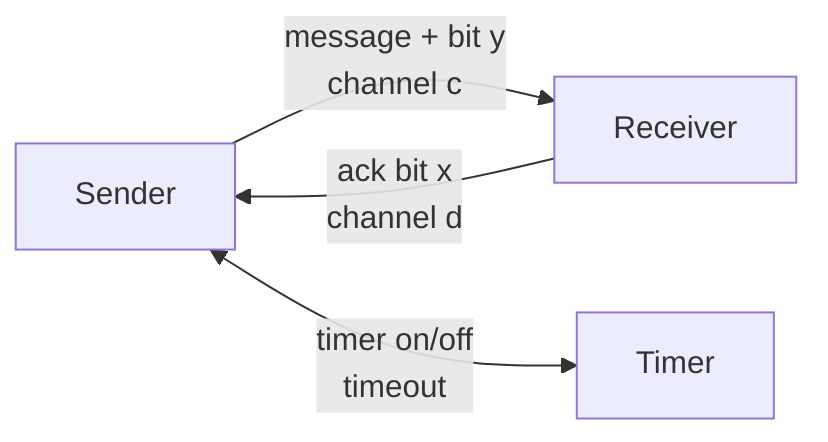

Il channel dati $c$ può essere **unreliable**.

Il channel degli acknowledgement $d$ può anch'esso essere unreliable nelle versioni più generali.

---

## 22. Idea dell'Alternating Bit

Il sender alterna tra:

$$
y=0
$$

e:

$$
y=1.
$$

Sequenza concettuale:

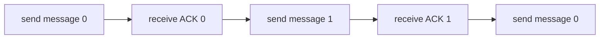

Dopo un acknowledgement corretto:

$$
y:=\neg y.
$$

Quindi:

$$
0\rightarrow1\rightarrow0\rightarrow1\rightarrow\cdots
$$

---

## 23. Protocollo del Sender

```text
LOOP FOREVER

(1) send message + bit y
    activate timer

(2) AWAIT timeout or acknowledgement x DO

    IF timeout THEN
        goto (1)

    ELSE
        IF x = y THEN
            turn off timer
            y := not y
        ELSE
            ignore x
        FI
    FI
OD
```

Il timeout permette al sender di capire che:

- il messaggio potrebbe essere stato perso;
- oppure l'acknowledgement potrebbe essere stato perso.

In entrambi i casi il messaggio viene ritrasmesso.

---

## 24. Perché serve il bit?

Immaginiamo che il sender trasmetta:

$$
message(0)
$$

ma non riceva l'acknowledgement.

Il sender ritrasmette:

$$
message(0).
$$

Il receiver deve capire che il secondo messaggio è una **duplicazione**, non un nuovo messaggio.

Il bit alternato permette di distinguere:

$$
\text{new message}
$$

da:

$$
\text{duplicate message}.
$$

---

## 25. Sender + Timer + Receiver

Il protocollo viene modellato come channel system:

$$
[Sender \mid Timer \mid Receiver].
$$

Le comunicazioni sono di tipi differenti.

Tra **Sender** e **Timer**:

$$
\text{synchronous communication}
$$

tramite channel come $e$ e $f$.

Tra **Sender** e **Receiver**:

$$
\text{asynchronous communication}
$$

tramite i channel:

$$
c,\ d.
$$

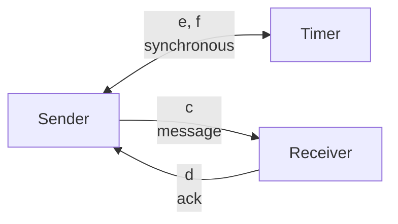

---

## 26. Program Graph del Sender

Il sender alterna due famiglie di stati, una per il bit $0$ e una per il bit $1$.

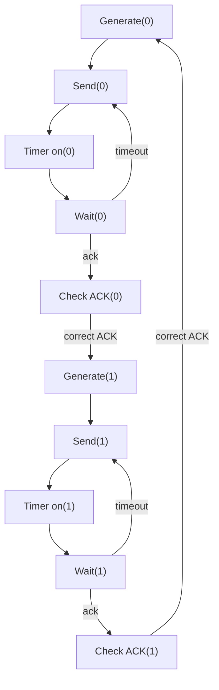

Gli acknowledgement errati vengono ignorati.

---

## 27. Receiver

Anche il receiver mantiene il bit che si aspetta.

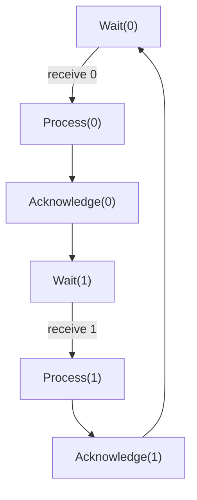

Se riceve nuovamente il bit precedente, riconosce il messaggio come duplicato e non lo processa nuovamente.

---

## 28. Perdita di un messaggio

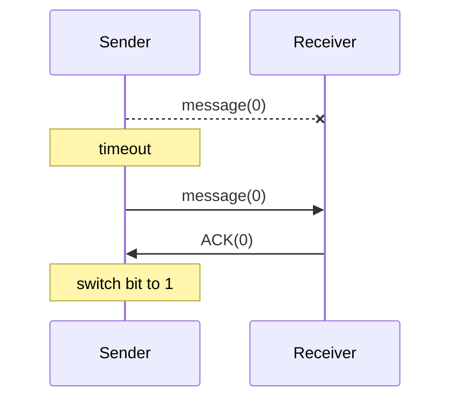

Il protocollo continua a funzionare perché il timeout causa una ritrasmissione.

---

## 29. Perdita dell'ACK

```mermaid
sequenceDiagram
    participant S as Sender
    participant R as Receiver

    S->>R: message(0)
    R--xS: ACK(0)

    Note over S: timeout

    S->>R: message(0)
    Note over R: duplicate message
    R->>S: ACK(0)

    Note over S: switch bit to 1
```

Il receiver riconosce la duplicazione grazie all'alternating bit.

---

## 30. Dimensione del TS dell'ABP

Nelle slide vengono considerate:

- $10$ location del sender;
- $2$ location del timer;
- $6$ location del receiver.

Quindi, ignorando inizialmente i channel:

$$
10\cdot2\cdot6.
$$

A questo bisogna moltiplicare il numero delle channel evaluations:

$$
10\cdot2\cdot6
\cdot
\#\text{channel evaluations}.
$$

Per FIFO di capacità $10$, lo spazio degli stati supera:

$$
10^8.
$$

Questo esempio introduce direttamente il problema della **state explosion**.

---

## 31. Varianti dei Channel Systems

### Conditional communication actions

È possibile avere:

$$
\ell
\xrightarrow{g:c?x}
\ell'.
$$

La comunicazione può essere eseguita solo se la condizione $g$ è vera.

### Generalized sending

Invece di:

$$
c!v
$$

si può utilizzare:

$$
c!expr.
$$

Per esempio:

$$
c!(2x+7).
$$

Il valore dell'espressione viene calcolato prima di essere inviato.

### Communication as condition

Si possono anche avere forme come:

$$
\ell
\xrightarrow{c?x:\alpha}
\ell'.
$$

Questo permette rappresentazioni più compatte del transition system.

---

## 32. Open e Closed Channel Systems

### Open Channel System

$$
P_1|\ldots|P_n
$$

### Closed Channel System

$$
[P_1|\ldots|P_n].
$$

Un sistema **open** può interagire con componenti esterni.

Un sistema **closed** viene invece considerato come sistema completo.

---

## 33. Riassunto degli operatori paralleli

### Pure interleaving

$$
T_1 ||| T_2
$$

Caratteristiche:

- concorrenza;
- nessuna comunicazione;
- le azioni vengono interleaved.

```mermaid
flowchart LR
    T1["T1"]
    OP["|||"]
    T2["T2"]

    T1 --- OP
    OP --- T2
```

---

## 34. Synchronous Message Passing

Forma generale:

$$
T_1 \parallel_{Syn} T_2.
$$

Caratteristiche:

- interleaving delle azioni indipendenti;
- sincronizzazione per le azioni appartenenti a $Syn$.

---

## 35. Interleaving di Program Graphs

$$
P_1 ||| P_2
$$

permette:

- interleaving;
- comunicazione tramite **shared variables**.

---

## 36. Channel Systems

$$
[P_1|\ldots|P_n]
$$

permettono contemporaneamente:

- interleaving;
- shared variables;
- synchronous message passing;
- asynchronous message passing.

```mermaid
flowchart TB
    I["Pure interleaving"]
    PG["Program graphs"]
    CS["Channel systems"]

    I -->|"add shared variables"| PG
    PG -->|"add channels"| CS
```

---

## 37. Synchronous Product

Un altro operatore introdotto è il **synchronous product**:

$$
T_1\otimes T_2.
$$

A differenza dell'interleaving, qui i processi sono **completamente sincronizzati**.

Non abbiamo:

$$
\alpha
\quad\text{oppure}\quad
\beta
$$

ma una sola transizione congiunta:

$$
\alpha * \beta.
$$

---

## 38. Definizione del Synchronous Product

Consideriamo:

$$
T_1=(S_1,Act_1,\rightarrow_1,\ldots)
$$

e:

$$
T_2=(S_2,Act_2,\rightarrow_2,\ldots).
$$

Il synchronous product è:

$$
T_1\otimes T_2
=
(S_1\times S_2,Act,\rightarrow,\ldots).
$$

Lo state space è quindi:

$$
S_1\times S_2.
$$

Le azioni vengono combinate mediante una funzione:

$$
Act_1\times Act_2
\rightarrow Act
$$

$$
(\alpha,\beta)
\mapsto
\alpha*\beta.
$$

---

## 39. Regola del Synchronous Product

Se:

$$
s_1\xrightarrow{\alpha}_1s_1'
$$

e:

$$
s_2\xrightarrow{\beta}_2s_2',
$$

allora:

$$
\frac{
s_1\xrightarrow{\alpha}_1s_1'
\quad\land\quad
s_2\xrightarrow{\beta}_2s_2'
}{
\langle s_1,s_2\rangle
\xrightarrow{\alpha*\beta}
\langle s_1',s_2'\rangle
}.
$$

Quindi entrambi i sistemi devono effettuare una transizione.

---

## 40. Interleaving vs Synchronous Product

### Interleaving

Da:

$$
(s_1,s_2)
$$

può evolvere solo il primo:

$$
(s_1,s_2)
\rightarrow
(s_1',s_2)
$$

oppure solo il secondo:

$$
(s_1,s_2)
\rightarrow
(s_1,s_2').
$$

### Synchronous Product

I due componenti evolvono insieme:

$$
(s_1,s_2)
\rightarrow
(s_1',s_2').
$$

```mermaid
flowchart LR
    A["(s1,s2)"]
    B["(s1',s2')"]

    A -->|"α * β"| B
```

---

## 41. Synchronous Product dei circuiti

Il synchronous product viene utilizzato anche per comporre **sequential circuits**.

Supponiamo due circuiti:

$$
C_1
$$

e:

$$
C_2.
$$

La composizione:

$$
C_1\otimes C_2
$$

possiede congiuntamente:

- input dei due circuiti;
- output dei due circuiti;
- registri interni dei due circuiti.

```mermaid
flowchart LR
    I1["inputs C1"]
    C1["Circuit C1"]
    O1["outputs C1"]

    I2["inputs C2"]
    C2["Circuit C2"]
    O2["outputs C2"]

    I1 --> C1 --> O1
    I2 --> C2 --> O2
```

Il transition system del circuito composto è ottenuto mediante:

$$
T_1\otimes T_2.
$$

---

## 42. State Explosion Problem

Uno dei problemi fondamentali del model checking è la **state explosion**.

Il transition system di un sistema reattivo può diventare enormemente grande.

Può addirittura essere infinito.

### Sistemi con domini infiniti

Per esempio:

$$
x\in\mathbb N.
$$

Se una variabile può assumere infiniti valori, il TS può avere infiniti stati.

### Strutture dati infinite

Lo stesso problema compare con strutture non limitate come:

- stack;
- queue;
- list.

---

## 43. Crescita esponenziale

Anche quando il TS è finito, può crescere esponenzialmente rispetto al numero di componenti.

Per:

$$
T_1,\ldots,T_n
$$

lo spazio degli stati della composizione può essere:

$$
S_1\times S_2\times\ldots\times S_n.
$$

Quindi:

$$
|S|
=
|S_1|
|S_2|
\cdots
|S_n|.
$$

Se ogni componente possiede $m$ stati:

$$
|S|=m^n.
$$

La crescita è dunque esponenziale nel numero dei componenti.

---

## 44. State Explosion nei Channel Systems

Per un channel system, lo stato contiene:

$$
\langle
\ell_1,\ldots,\ell_n,\eta,\xi
\rangle.
$$

La dimensione dipende quindi da:

1. numero delle location;
2. domini delle variabili;
3. domini dei channel;
4. capacità dei channel.

Una forma concettuale della dimensione è:

$$
|S|
=
\left(
\prod_{i=1}^{n}|Loc_i|
\right)
\cdot
\left(
\prod_{x\in Var}|Dom(x)|
\right)
\cdot
\left(
\prod_{c\in Chan}
\#Eval(c)
\right).
$$

Con channel FIFO finiti:

$$
\#Eval(c)
=
\sum_{j=0}^{cap(c)}
|Dom(c)|^j.
$$

Pertanto:

$$
|S|
=
\left(
\prod_{i=1}^{n}|Loc_i|
\right)
\left(
\prod_{x\in Var}|Dom(x)|
\right)
\left(
\prod_{c\in Chan}
\sum_{j=0}^{cap(c)}
|Dom(c)|^j
\right).
$$

---

## 45. Perché la State Explosion è importante

Anche sistemi apparentemente piccoli possono generare transition systems giganteschi.

```mermaid
flowchart LR
    S["Small syntactic<br/>system"]
    T["Huge transition<br/>system"]

    S -->|"semantic expansion"| T
```

Il problema nasce perché il transition system deve rappresentare **tutte le possibili combinazioni** di:

- control locations;
- variable evaluations;
- channel contents;
- interleavings;
- comunicazioni.

---

## 46. Model Checking

```mermaid
flowchart TB
    SYS["system<br/>P1 || ... || Pn"]
    REQ["requirements"]

    TS["transition system T"]
    SPEC["specification spec"]

    MC["model checker<br/>does T satisfy spec?"]

    YES["yes"]
    NO["no + error indication"]

    SYS --> TS
    REQ --> SPEC

    TS --> MC
    SPEC --> MC

    MC --> YES
    MC --> NO
```

Le slide evidenziano che il sistema viene inizialmente descritto sintatticamente come:

$$
P_1,\ldots,P_n.
$$

Attraverso le **SOS rules** viene generato il transition system:

$$
\mathcal T.
$$

La specifica dei requisiti produce invece:

$$
spec.
$$

Infine il model checker verifica:

$$
\boxed{\mathcal T\models spec}
$$

---

## 47. Catena completa

```mermaid
flowchart TB
    PG["Program graphs<br/>P1,...,Pn"]

    CS["Channel system<br/>[P1 | ... | Pn]"]

    SOS["SOS rules"]

    TS["Transition system<br/>T_C"]

    SPEC["Specification<br/>spec"]

    MC["Model checker"]

    RESULT["satisfied / counterexample"]

    PG --> CS
    CS --> SOS
    SOS --> TS

    TS --> MC
    SPEC --> MC

    MC --> RESULT
```

In formula:

$$
[P_1|\ldots|P_n]
\overset{\text{SOS semantics}}{\longrightarrow}
\mathcal T_C
$$

e successivamente:

$$
\mathcal T_C\models spec\ ?
$$

---

## 48. Concetti fondamentali da ricordare

1. **Channel System**

   $$
   [P_1|\ldots|P_n]
   $$

2. **Synchronous channel**

   $$
   cap(c)=0
   $$

3. **Asynchronous FIFO channel**

   $$
   cap(c)\geq1
   $$

4. **Sending**

   $$
   c!v
   $$

5. **Receiving**

   $$
   c?x
   $$

6. **State di un Channel System**

   $$
   \langle
   \ell_1,\ldots,\ell_n,\eta,\xi
   \rangle
   $$

7. **Variable evaluation**

   $$
   \eta\in Eval(Var)
   $$

8. **Channel evaluation**

   $$
   \xi\in Eval(Chan)
   $$

9. **Asynchronous communication**

   sender e receiver agiscono separatamente attraverso un FIFO.

10. **Synchronous communication**

   $$
   c!v
   \quad\text{e}\quad
   c?x
   $$

   devono sincronizzarsi.

11. **SOS semantics**

   definisce come il Channel System genera il transition system.

12. **Alternating Bit Protocol**

   usa bit alternati, acknowledgement e timeout per rendere affidabile una comunicazione su channel inaffidabili.

13. **Synchronous product**

   $$
   T_1\otimes T_2
   $$

   rappresenta processi completamente sincronizzati.

14. **State explosion**

   la dimensione dello state space cresce rapidamente con componenti, variabili e channel.

15. **Model checking**

   $$
   \boxed{\mathcal T\models spec}
   $$

   verifica automaticamente se il transition system soddisfa la specifica.
