# 15/9

ICT = Information and Communication Technology

Verification = “check that we are building the thing right”
Validation = “check that we are building the right thing”

Formal methods are the “applied mathematics for modelling and analysing ICT systems”

Formal Verification Techniques for Property P:
- Deductive methods
	- method: provide a formal proof that P holds
	- tool: theorem prover/proof assistant of proof checker
	- appicable if: system has form of a mathematical theory
- Model Checking
	- method: systematic checker on P in all states
	- tool: model checker (SPIN, NUMSMV, UPPALL)
	- appicable if: system generates (finite) behavioural model
- Model-based simulation or testing
	- method: test for P by exploring possible behaviours
	- applicable if: system defines an executable model

Simulation and Testing:
- Basic Procedure:
	- take a model (simulation) or a realisation (testing)
	- stimulate it with certain inputs (the test)
	- observe reaction and check wheter this is "desired"
- Important drawbacks:
	- number of possible behaviours is very large (or even infinite)
	- unexplored behaviours may contain the fatal bug
- About testing: testing/simulation can show the presence of errors, not their absence

Example of Proof Rules:
1. Backward axiom
2. cut rule
3. Invariant rule
4. Logical rule

$$
\begin{align}
& \frac{}{\{A[e/x]\} x:= e \{A\}} & \\ \\
& \frac{\{A\}P\{B\} \; \{B\}Q\{C\}}{\{A\}P;Q\{C\}} & \\ \\
& \frac{\{I \land b\} P \{I\}}{\{I\}\text{while b do P}\{I\land \lnot B\}} & \\ \\
&\frac{A \implies A' \; \{A'\}P\{B'\} \; B' \implies B}{\{A\}P\{B\}}
\end{align}
$$

Model Checking Overview #TODO

What is Model Checking? Model checking is an automated technique that, given a finite-state model of a system and a formal property, systematically checks whether this property holds for (a given state in) that model.

What are Models?
- Tansistion systems
	- states labeled with basic proposition
	- Transition relation between states
	- Action-labeled transitions to facilitate composition
- Expressivity
	- Programs are transition systems
	- Multi-threading programs are transistion systems
	- Communicating processes are transition systems
	- Hardware circuits are transistion systems

What are Properties? #TODO 

The Model Checking Process:
- Modeling Phase
	- model the system under consideration
	- as a first sanity check, perform some simulations
	- formalise the property to be checked
- Running Phase
	- run the model checker to check the validity of the property in the model
- Analysis pahse
	- property satisfied ? check next property (if any)
	- property violated ? 
		- analyse generated counterexample by simulation
		- refine the model, design, or property . . . and repeat the entire procedure
	- out of memory ? try to reduce the model and try again

Pros of Model Checking:
- widely applicable
- allows for partial verification
- potential "push-button" technology
- rapidly increasing industrial interest
- in case of property violation, a counterexample is provided
- sound and interesting mathematical foundations
- not biased to the most possible scenarios

Cons of Model checking:
- main focus on control-insensitive applications
- model checking is only as "good" as the system model
- no garuantee about completeness of results
- impossible to check generalisations

Model checking is a very e↵ective technique to expose potential design errors

Transitions systems:


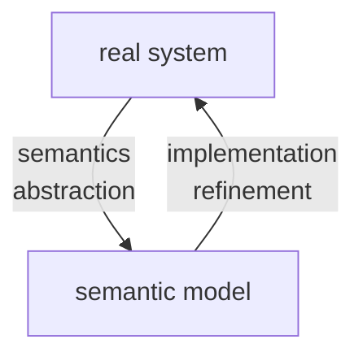

the semantic model yields a formal representation of:
- the states of the system (nodes)
- the stepwise behaviour (transistions)
- the initial state
- additional informations on
	- communication (actions)
	- state properties (atomic proposition)

T = (S,Act,->,$S_0$,AP,L):
- S = set of states
- Act = set of actions
- -> $\subseteq S \times Act \times S$ is the transition relation ($s \xrightarrow{\alpha} s'$)
- $S_0 \subseteq S$ = set of initial states
- AP = set of atomic propositions
- $L: S \to 2^{AP}$ labeling function

```
select nondeterministically an initial state s \in S_0
while s is non-terminal do
	select nondeterministically a transitions s(alpha)->s'
	execute the action alpha and puts s:=s'
```

executions: maximal "transitions sequences"

Reach(T) = set of all states that are reachable from an initial state through some execution

(interleaving) parallel execution of independent actions ($\alpha,\beta$ independent):
$$ \underbrace{x := x + 1}_{\text{action } \alpha} \;\parallel\; \underbrace{y := y - 3}_{\text{action } \beta} $$

(competition) parallel execution of dependent actions ($\alpha,\beta$ dependent):
$$ \underbrace{x := x + 1}_{\text{action } \alpha} \;\parallel\; \underbrace{y := 2*x}_{\text{action } \beta} $$

Model Checking:

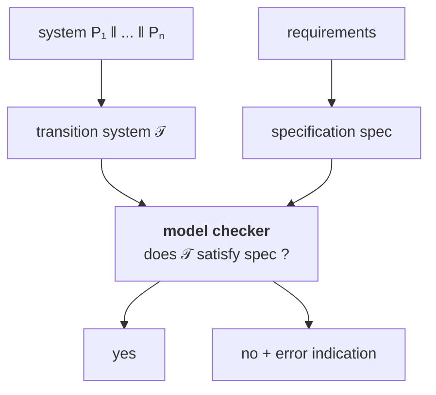

semantics = transistion system + model checker

Example TS for sequential circuit:
$\lambda_i,\delta_j  \; \hat{=} \; \{0,1\}^n \times \{0,1\}^k\to \{0,1\}$
$\lambda_i$ output value of output var $y_i$
$\delta_j$ next value for register $r_j$

![[Pasted image 20260917195251.png]]

1 output bit, no input, 100 register => 2^100 states
no output, 1 input bit, 100 register => 2^100 + 2^1 = 2^101 

Example TS for sequential program:

![[Pasted image 20260917195951.png]]

typed variable: variable x + data domain Dom(x)
- Boolean : x + Dom(x) = {0,1}
- Integer : y + Dom(y) = N
- variable z : Dom(z) = {yellow, red, blue}

type consistent function $\eta: Var \to Values$
- $\eta(x) \in Dom(x) \; \forall x \in Var$
- Values = $\bigcup_{x \in Var} Dom(x)$
- Eval(Var) = set of evaluations for Var

if Var is a set of typed variables then

Cond(Var) = set of Boolean conditions on the variables in Var

$(\lnot x \land y<z+3)$
Dom(x) = {0,1}
Dom(y)=Dom(y)=N
Dom(w)={yellow,red,blue}
$[x=0,y=3,z=6]\models \lnot x \land y < z$
$[x=0,y=3,z=6]\not\models x \lor y = z$

$Effect:Act \times Eval(Var) \to Eval(Var)$

A program graph over Var (set of typed vars) is:

P =(Loc, Act, Effect,->, $Loc_0$, $g_0$)
- Loc = finite set of locations (control states)
- Act = set of actions
- $Effect:Act \times Eval(Var) \to Eval(Var)$
- -> $\subseteq Loc \times Cond(Var) \times Act \times Loc$
	- $l \xrightarrow{g:\alpha}l'$
	- l,l' are locations
	- $g \in Cond(Var)$
	- $\alpha \in Act$
- $Loc_0 \subseteq Loc$ is set of the initial locations
- $g_0 \in Cond(Var)$ initial condition on the variables

Program graph P over Var => transition system $T_P$

state in $T_P$ = <l,$\eta$> = <location,variable evaluation>

$T_P$ = (S,Act,->,$S_0$,AP,L):
- $S = Loc \times Eval(Var)$
- $S_0  =\{<l,\eta>:l \in Loc_0,\eta \models g_0\}$
- $\frac{l \xrightarrow{g:\alpha}l' \;\land\; \eta \models g}{<l,\eta> \xrightarrow{\alpha}<l',Effect(\alpha,\eta)>}$
- $AP = Loc \cup Cond(Var)$
- $L(<l,\eta>)=\{l\} \cup \{g \in Cond(Var): \eta \models g\}$

Guarded Command Language (GCL) = high-level modeling language that contains features of imperative languages and nondeterministic choice

GCL-program -> program graph -> transition system

guarded command g => stmt:
- g = guard, Boolean condition on the program variables
- stmt = statement

```GCL
DO :: g=>stmt OD  /// WHILE g DO stmt OD
IF :: g => stmt1  /// IF g THEN stmt1
   :: ¬g =>stmt2  ///      ELSE stmt2
FI                /// FI
```

:: stands for the nondeterministic choice between enabled guarded commands

semantics of a GCL-program = program graph

| Action        | Enabled                                         | Effect                             |
| ------------- | ----------------------------------------------- | ---------------------------------- |
| `get_coke`    | if `#coke > 0`                                  | `#coke := #coke - 1`               |
| `get_sprite`  | if `#sprite > 0`                                | `#sprite := #sprite - 1`           |
| `refill`      | any time                                        | `#sprite := max`<br>`#coke := max` |
| `insert_coin` | any time                                        | no effect on variables             |
| `return_coin` | if machine is empty and user has entered a coin | no effect on variables             |

```
DO :: true => insert_coin;
      IF :: #sprite=#coke=0 => return_coin
         :: #coke > 0 => get_coke
         :: #sprite > 0 => get_sprite
	  FI
   :: true => refill
OD
```

start location (DO :: ...)
select location (IF :: \#sprite ...)
$\#sprite,\#coke \in \{0,1,\dots,max\}$

![[Pasted image 20260918171454.png]]
# 17/9

"real" parallel system $P = P_1 || \dots || P_n$
transition system $T = T_1 || \dots || T_n$ 
P -> T analysis semantics
T -> P compositional design

goal: define semantic parallel operators on transition system or program graphs that model "real" parallel operators

||| Interleaving operator for TS:
- interleaving of concurrent, independent actions of parallel processes (modelled by TS)
- representation by nondeterministic choice: "which subprocess performs the next step?"

$effect(\alpha|||\beta) = effect(\alpha;\beta+\beta;\alpha)$: parallel execution of $\alpha$ and $\beta$ on two processors $\hat{=}$ serial execution on a single processor in arbitrary order


$T_1 ||| T_2 = (S_1\times S_2,Act_1\cup Act_2,\to,S_{0,1}\times S_{0,2},AP,L)$:
- where $\to$ is given by:
	- $\frac{s_1 \xrightarrow{\alpha} s_1'}{<s_1,s_2> \xrightarrow{\alpha} <s_1',s_2>}$
	- $\frac{s_2 \xrightarrow{\alpha} s_2'}{<s_1,s_2> \xrightarrow{\alpha} <s_1,s_2'>}$
- $AP = AP_1 \uplus AP_2$
- $L(<s_1,s_2>)=L_1(s_1) \cup L_2(s_2)$

SOS = structured operational semantics

interleaving fails for dependent actions -> inconsistent states

$P_1 ||| P_2 = (Loc_1 \times Loc_2,\dots,\to,\dots)$:
- $\frac{l_1 \xrightarrow{g:\alpha} l_1'}{<l_1,l_2> \xrightarrow{g:\alpha} <l_1',l_2>}$
- $\frac{l_2 \xrightarrow{g:\alpha} l_2'}{<l_1,l_2> \xrightarrow{g:\alpha} <l_1,l_2'>}$

Process $P_1$:
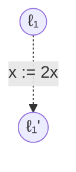

Process $P_2$:
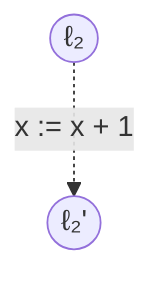

$P_1 ||| P_2$:
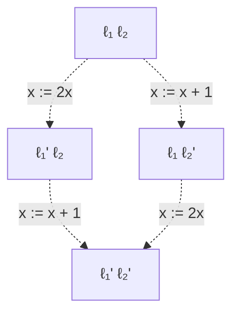

Transition system $T_{P_1 ||| P_2}$:
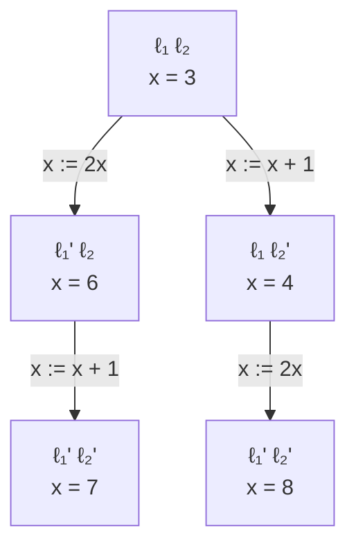

$T_{P_1|||P_2} \not =  T_{P_1} ||| T_{P_2}$

![[Pasted image 20260918183302.png]]

![[Pasted image 20260918183318.png]]

![[Pasted image 20260918183416.png]]

![[Pasted image 20260918183449.png]]

![[Pasted image 20260918183557.png]]

Peterson Algo:

![[Pasted image 20260918183623.png]]

![[Pasted image 20260918183801.png]]

![[Pasted image 20260918183812.png]]

value of $b_1$ is given by $wait_1 \lor crit_1$
value of $b_2$ is given by $wait_2 \lor crit_2$
\+ unrechable states

(incorrect)
![[Pasted image 20260919015845.png]]


Operators for parallelism and communication:
- true concurrency: interleaving operator ||| for TS (no communication, no dependencies)
- communication via shared variables
	- description of subsystems by program graphs
	- interleaving ||| for program graphs
	- TS is obtained by "unfolding"
- synchronous message passing <- data abstract
	- operator $|||_{Syn}$ for TS
	- interleaving for independent actions
	- synchronization over actions in Syn
- channel systems: communication via shared variables + via channels

$Syn \subseteq Act_1\cap Act_2$ = set of synchronization actions

$T_1 ||_{Syn} T_2 = (S_1 \times S_2,Act_1 \cup Act_2, \to, \dots)$

for modeling the concurrent execution of $T_1$ and $T_2$ with synchronization over all actions in Syn

interleaving for all actions $\alpha \in Act_i \setminus Syn$:
$$ \frac{s_1 \xrightarrow{\alpha} s'_1}{<s_1,s_2> \xrightarrow{\alpha} <s'_1,s_2>}$$

$$ \frac{s_2 \xrightarrow{\alpha} s'_2}{<s_1,s_2> \xrightarrow{\alpha} <s_1,s'_2>}$$

handshaking (rendezvous) for all $\alpha \in Syn$:
$$\frac{s_1 \xrightarrow{\alpha}_1s'_1 \land s_2 \xrightarrow{\alpha}_2 s'_2}{<s_1,s_2> \xrightarrow{\alpha} <s'_1,s'_2>}$$

mutual exclusion by synchronous message passing using an arbiter:

![[Pasted image 20260919175930.png]]

$(T_1 ||| T_2) \; ||_{Syn} \; Arbiter$ where Syn = {request, release}

pure interleaving for TS + handshaking for actions request and release

![[Pasted image 20260919180159.png]]

synchronization operator $||_{Syn}$ for three or more processes

![[Pasted image 20260919180259.png]]

![[Pasted image 20260919180316.png]]

![[Pasted image 20260919180441.png]]

# 18/9

## 1. Channel Systems

Un **Channel System (CS)** permette di rappresentare sistemi paralleli dipendenti dai dati in cui i processi possono comunicare mediante:

- **shared variables**;
- **synchronous message passing**;
- **asynchronous message passing**.

Le ultime due forme utilizzano dei **channels**.

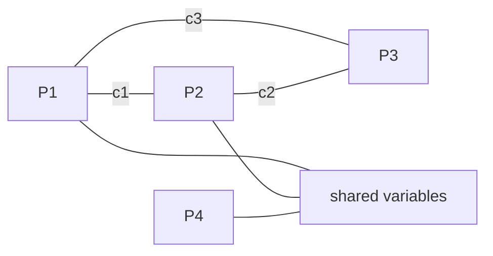

I channel possono essere di due tipi:

| Tipo | Capacità | Comunicazione |
|---|---:|---|
| synchronous | $0$ | sender e receiver devono sincronizzarsi |
| FIFO | $\geq 1$ | comunicazione asincrona |

La **capacity** di un FIFO channel indica il numero di celle disponibili nel buffer.

Quindi:

$$
cap(c)=0
\quad\Longrightarrow\quad
\text{synchronous channel}
$$

mentre:

$$
cap(c)\geq1
\quad\Longrightarrow\quad
\text{FIFO / asynchronous channel}
$$

---

## 2. Program Graphs e Channel Systems

I processi:

$$
P_1,\ldots,P_n
$$

sono rappresentati tramite **program graphs**.

Un processo può contenere normali transizioni condizionali:

$$
\ell_i
\xrightarrow{g:\alpha}
\ell_i'
$$

dove:

- $g$ è una guardia;
- $\alpha$ è un'azione.

Inoltre vengono introdotte delle **communication actions**.

## Sending

$$
\ell_i
\xrightarrow{c!v}
\ell_i'
$$

significa:

> invia il valore $v$ attraverso il channel $c$.

## Receiving

$$
\ell_i
\xrightarrow{c?x}
\ell_i'
$$

significa:

> ricevi un valore dal channel $c$ e assegnalo alla variabile $x$.

Possiamo quindi schematizzare:

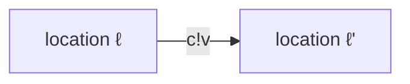

e:

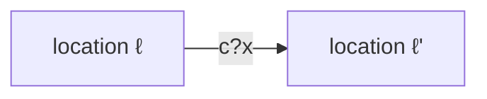

---

## 3. Typed Variables

Una variabile tipata $x$ possiede un dominio:

$$
Dom(x)
$$

Una **variable evaluation** per un insieme di variabili $Var$ è una funzione:

$$
\eta : Var \rightarrow Values
$$

che deve essere type-consistent, cioè:

$$
\eta(x)\in Dom(x)
$$

per ogni:

$$
x\in Var.
$$

L'insieme di tutte le valutazioni compatibili viene indicato con:

$$
Eval(Var)
$$

---

## 4. Typed Channels

Un channel tipato $c$ possiede:

- una capacità $cap(c)$;
- un dominio $Dom(c)$.

Formalmente:

$$
cap(c)\in \mathbb{N}\cup\{\infty\}
$$

e:

$$
Dom(c)
$$

definisce quali valori possono essere trasmessi sul channel.

---

## 5. Channel Evaluation

Per un insieme di channel $Chan$, una **channel evaluation** è una funzione:

$$
\xi : Chan \rightarrow Values^*
$$

Per ogni channel $c$:

$$
\xi(c)
$$

è una parola composta da elementi appartenenti a $Dom(c)$.

Inoltre:

$$
|\xi(c)|\leq cap(c)
$$

Per esempio:

$$
\xi(c)=v_1v_2v_3
$$

significa che il FIFO channel $c$ contiene:

$$
v_1,\ v_2,\ v_3
$$

nell'ordine indicato.

Possiamo interpretarlo come:

```text
front                            back
  ↓                                ↓
+----+----+----+----+----+
| v1 | v2 | v3 |    |    |
+----+----+----+----+----+
```

---

## 6. Definizione di Channel System

Un channel system ha la forma:

$$
[P_1 \mid P_2 \mid \ldots \mid P_n]
$$

dove ciascun $P_i$ è un program graph.

Il sistema è definito rispetto alla coppia:

$$
(Var,Chan)
$$

dove:

- $Var$ = insieme delle typed variables;
- $Chan$ = insieme dei typed channels.

Ogni program graph ha forma:

$$
P_i =
(Loc_i,Act_i,Effect_i,\rightarrow_i,Loc_{0,i},g_0)
$$

con transizioni del tipo:

$$
\ell
\xrightarrow{g:\alpha}_i
\ell'
$$

oppure azioni di comunicazione:

$$
\ell
\xrightarrow{c!v}_i
\ell'
$$

$$
\ell
\xrightarrow{c?x}_i
\ell'
$$

---

## 7. Comunicazione asincrona

Consideriamo un channel:

$$
c
$$

con:

$$
cap(c)\geq1.
$$

La comunicazione è **asynchronous**.

## Sending

L'azione:

$$
c!v
$$

è abilitata se:

$$
c\text{ non è pieno}.
$$

L'effetto è:

$$
add(c,v)
$$

cioè $v$ viene aggiunto in fondo alla coda.

Esempio:

$$
v_1v_2\ldots v_r
\xrightarrow{c!v}
v_1v_2\ldots v_rv
$$

## Receiving

L'azione:

$$
c?x
$$

è abilitata se il channel non è vuoto.

Se:

$$
v=front(c)
$$

allora vengono eseguiti:

$$
x:=v
$$

e:

$$
remove(c)
$$

Quindi:

$$
vv_2\ldots v_r
\xrightarrow{c?x}
v_2\ldots v_r
$$

con:

$$
x=v.
$$

## Riassunto

| Action | Enabled if | Effect |
|---|---|---|
| $c!v$ | channel $c$ not full | $add(c,v)$ |
| $c?x$ | channel $c$ not empty | $x:=front(c)$, $remove(c)$ |

---

## 8. Comunicazione sincrona

Se:

$$
cap(c)=0
$$

non esiste un buffer.

Le operazioni:

$$
c!v
$$

e:

$$
c?x
$$

devono quindi essere eseguite **contemporaneamente**.

L'effetto della comunicazione è:

$$
x:=v.
$$

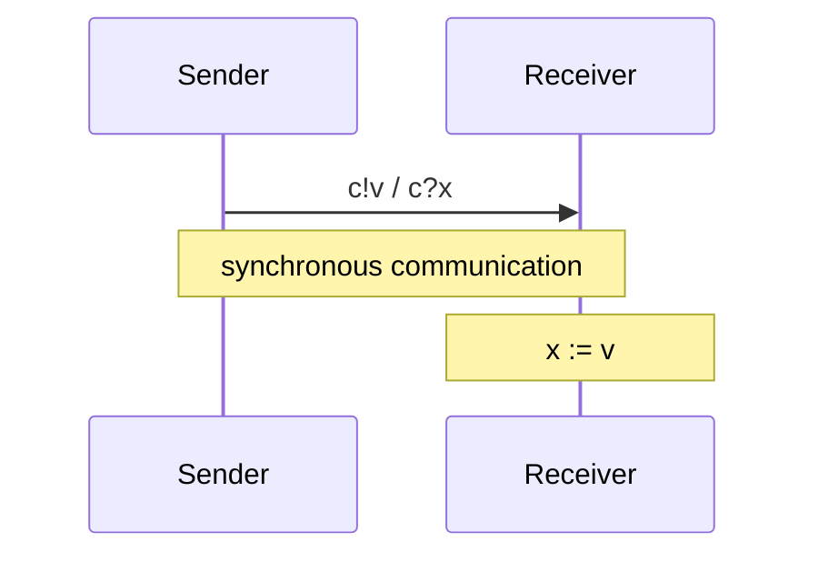

Non esiste quindi uno stato intermedio nel quale il messaggio è memorizzato nel channel.

---

## 9. Asynchronous vs Synchronous Communication

## Asynchronous

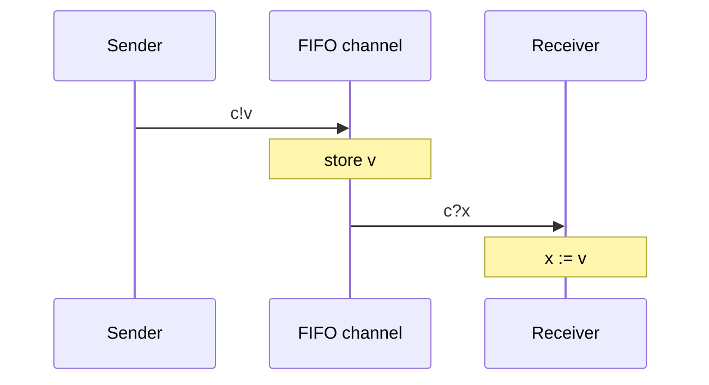

Sender e receiver possono agire in istanti differenti.

## Synchronous

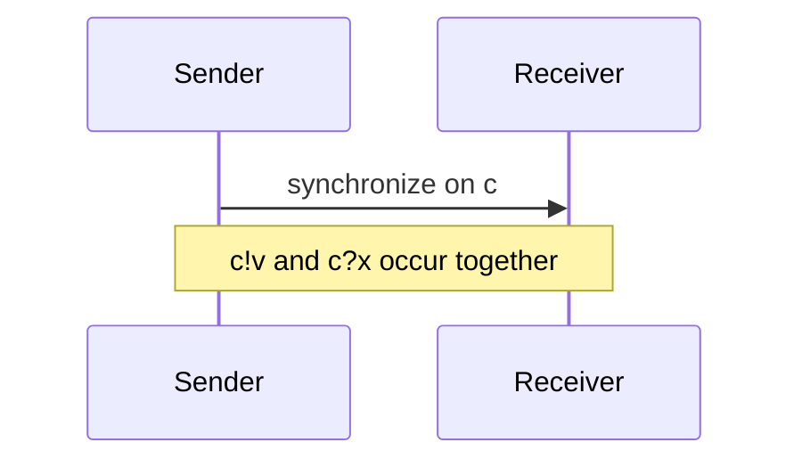

Il sender non può eseguire l'azione se nessun receiver corrispondente è pronto.

---

## 10. Transition-System Semantics dei Channel Systems

A un channel system:

$$
C=[P_1|\ldots|P_n]
$$

associamo un transition system:

$$
\mathcal{T}_C.
$$

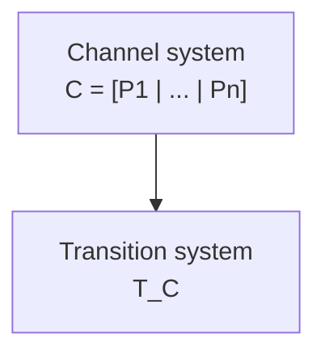

---

## 11. Stati di $\mathcal{T}_C$

Gli stati hanno forma:

$$
\langle
\ell_1,\ldots,\ell_n,\eta,\xi
\rangle
$$

dove:

- $\ell_i$ è la location corrente del processo $P_i$;
- $\eta$ è la valutazione delle variabili;
- $\xi$ è la valutazione dei channel.

Quindi uno stato contiene **tre tipi di informazioni**:

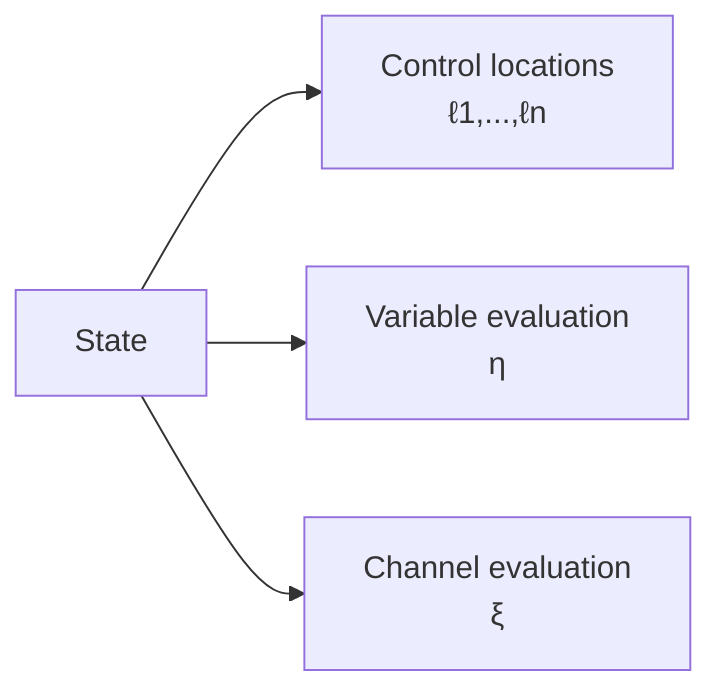

Formalmente:

$$
\ell_i\in Loc_i
$$

$$
\eta\in Eval(Var)
$$

$$
\xi\in Eval(Chan).
$$

---

## 12. Variable Evaluation

Formalmente:

$$
\eta :
Var
\rightarrow
\coprod_{x\in Var}Dom(x)
$$

con:

$$
\eta(x)\in Dom(x).
$$

L'idea importante è che $\eta$ rappresenta **lo stato corrente di tutte le variabili condivise**.

---

## 13. Channel Evaluation

Analogamente:

$$
\xi :
Chan
\rightarrow
\coprod_{c\in Chan}Dom(c)^*
$$

con:

$$
\xi(c)\in Dom(c)^*
$$

e:

$$
|\xi(c)|\leq cap(c).
$$

Per la rappresentazione tramite $\xi$ sono rilevanti soprattutto i channel con:

$$
cap(c)\geq1
$$

perché i channel sincroni non contengono messaggi memorizzati.

---

## 14. Transition Relation

La transition relation:

$$
\rightarrow
$$

di un Channel System è definita mediante **SOS rules** (*Structural Operational Semantics*).

Le regole appartengono a due categorie:

1. interleaving delle normali azioni;
2. message passing attraverso channel.

---

## 15. SOS Rule — Interleaving

Supponiamo che il processo $P_i$ abbia una transizione:

$$
\ell_i
\xrightarrow{g:\alpha}_i
\ell_i'
$$

e che:

$$
\eta\models g.
$$

Allora il Channel System può effettuare:

$$
\frac{
\ell_i\xrightarrow{g:\alpha}_i\ell_i'
\quad\land\quad
\eta\models g
}{
\langle
\ell_1,\ldots,\ell_i,\ldots,\ell_n,\eta,\xi
\rangle
\xrightarrow{\alpha}
\langle
\ell_1,\ldots,\ell_i',\ldots,\ell_n,
Effect_i(\alpha,\eta),\xi
\rangle
}
$$

Da notare che:

$$
\xi'=\xi.
$$

Una normale azione di un processo **non modifica i channel**.

---

## 16. SOS Rules — Asynchronous Message Passing

Consideriamo:

$$
cap(c)\geq1.
$$

### Receiving

Supponiamo:

$$
\ell_i
\xrightarrow{c?x}_i
\ell_i'
$$

e:

$$
\xi(c)=v_1v_2\ldots v_k
$$

con:

$$
k\geq1.
$$

Allora:

$$
\langle
\ell_1,\ldots,\ell_i,\ldots,\ell_n,\eta,\xi
\rangle
\xrightarrow{\tau}
\langle
\ell_1,\ldots,\ell_i',\ldots,\ell_n,\eta',\xi'
\rangle
$$

dove:

$$
\eta'=\eta[x:=v_1].
$$

L'update:

$$
\eta[x:=v_1]
$$

è definito come:

$$
\eta[x:=v_1](y)=
\begin{cases}
\eta(y) & y\neq x\\
v_1 & y=x
\end{cases}
$$

Il channel diventa:

$$
\xi'(c)=v_2\ldots v_k.
$$

---

## 17. Internal Action $\tau$

Le operazioni di comunicazione vengono rappresentate nel transition system mediante:

$$
\tau
$$

che rappresenta una **internal action**.

Quindi:

$$
\xrightarrow{\tau}
$$

significa che il transition system evolve senza esporre l'azione di comunicazione come azione osservabile esternamente.

---

## 18. SOS Rule — Synchronous Message Passing

Consideriamo due processi differenti:

$$
i\neq j.
$$

Supponiamo:

$$
\ell_i
\xrightarrow{c?x}_i
\ell_i'
$$

e contemporaneamente:

$$
\ell_j
\xrightarrow{c!v}_j
\ell_j'.
$$

Allora:

$$
\frac{
\ell_i\xrightarrow{c?x}_i\ell_i'
\quad\land\quad
\ell_j\xrightarrow{c!v}_j\ell_j'
\quad\land\quad
i\neq j
}{
\langle
\ell_1,\ldots,\ell_i,\ldots,\ell_j,\ldots,\ell_n,
\eta,\xi
\rangle
\xrightarrow{\tau}
\langle
\ell_1,\ldots,\ell_i',\ldots,\ell_j',\ldots,\ell_n,
\eta[x:=v],\xi
\rangle
}
$$

Il punto fondamentale è che **entrambi i processi cambiano location nella stessa transizione**.

Inoltre:

$$
\xi'=\xi
$$

perché un synchronous channel non possiede buffer.

---

## 19. Numero di stati

Consideriamo:

- $2$ processi con $2$ location ciascuno;
- $2$ Boolean variables;
- $2$ channel;
- ogni channel ha capacità $10$;
- ogni channel trasporta valori Boolean.

Per un singolo channel, le possibili configurazioni sono:

$$
1+2+2^2+\ldots+2^{10}
$$

quindi:

$$
\sum_{i=0}^{10}2^i
=
2^{11}-1.
$$

Il numero complessivo di stati è quindi:

$$
2\cdot2
\cdot2\cdot2
\cdot
(2^{11}-1)
\cdot
(2^{11}-1).
$$

Equivalentemente:

$$
2^4(2^{11}-1)^2.
$$

Questo valore è:

$$
>2^{24}.
$$

Se almeno un channel è **unbounded**:

$$
cap(c)=\infty
$$

allora il numero di stati può diventare:

$$
\infty.
$$

---

## 20. Numero di configurazioni di un channel

Se un channel $c$ ha:

$$
|Dom(c)|=d
$$

e capacità:

$$
cap(c)=k,
$$

le possibili sequenze contenute nel buffer sono:

$$
\epsilon
$$

oppure una sequenza di lunghezza $1,2,\ldots,k$.

Da ciò segue:

$$
N_c
=
\sum_{i=0}^{k}d^i.
$$

Per esempio, con Boolean values:

$$
d=2
$$

e:

$$
k=10,
$$

otteniamo:

$$
N_c=
\sum_{i=0}^{10}2^i
=
2^{11}-1.
$$

---

## 21. Alternating Bit Protocol

L'**Alternating Bit Protocol (ABP)** viene utilizzato per trasmettere messaggi in maniera affidabile sopra un channel che può perdere messaggi.

I componenti principali sono:

- **Sender**;
- **Timer**;
- **Receiver**.

Il sender associa al messaggio un bit:

$$
y\in\{0,1\}.
$$

Il receiver restituisce un acknowledgement contenente il bit ricevuto:

$$
x.
$$

### Struttura generale

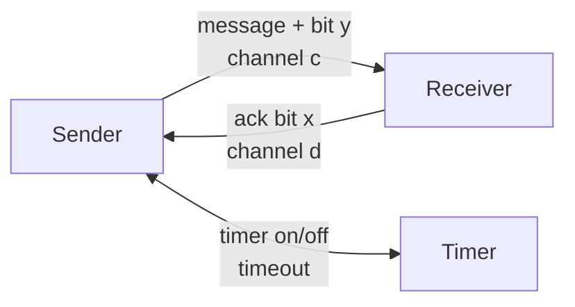

Il channel dati $c$ può essere **unreliable**.

Il channel degli acknowledgement $d$ può anch'esso essere unreliable nelle versioni più generali.

---

## 22. Idea dell'Alternating Bit

Il sender alterna tra:

$$
y=0
$$

e:

$$
y=1.
$$

Sequenza concettuale:

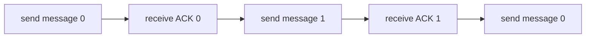

Dopo un acknowledgement corretto:

$$
y:=\neg y.
$$

Quindi:

$$
0\rightarrow1\rightarrow0\rightarrow1\rightarrow\cdots
$$

---

## 23. Protocollo del Sender

```text
LOOP FOREVER

(1) send message + bit y
    activate timer

(2) AWAIT timeout or acknowledgement x DO

    IF timeout THEN
        goto (1)

    ELSE
        IF x = y THEN
            turn off timer
            y := not y
        ELSE
            ignore x
        FI
    FI
OD
```

Il timeout permette al sender di capire che:

- il messaggio potrebbe essere stato perso;
- oppure l'acknowledgement potrebbe essere stato perso.

In entrambi i casi il messaggio viene ritrasmesso.

---

## 24. Perché serve il bit?

Immaginiamo che il sender trasmetta:

$$
message(0)
$$

ma non riceva l'acknowledgement.

Il sender ritrasmette:

$$
message(0).
$$

Il receiver deve capire che il secondo messaggio è una **duplicazione**, non un nuovo messaggio.

Il bit alternato permette di distinguere:

$$
\text{new message}
$$

da:

$$
\text{duplicate message}.
$$

---

## 25. Sender + Timer + Receiver

Il protocollo viene modellato come channel system:

$$
[Sender \mid Timer \mid Receiver].
$$

Le comunicazioni sono di tipi differenti.

Tra **Sender** e **Timer**:

$$
\text{synchronous communication}
$$

tramite channel come $e$ e $f$.

Tra **Sender** e **Receiver**:

$$
\text{asynchronous communication}
$$

tramite i channel:

$$
c,\ d.
$$

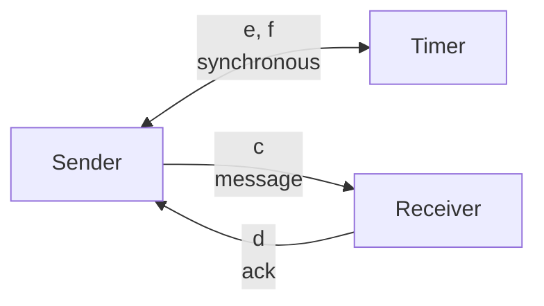

---

## 26. Program Graph del Sender

Il sender alterna due famiglie di stati, una per il bit $0$ e una per il bit $1$.

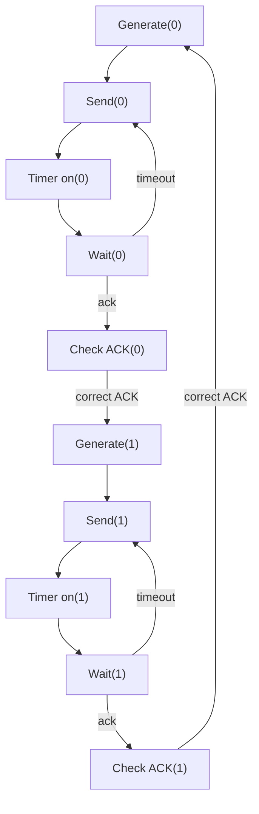

Gli acknowledgement errati vengono ignorati.

---

## 27. Receiver

Anche il receiver mantiene il bit che si aspetta.

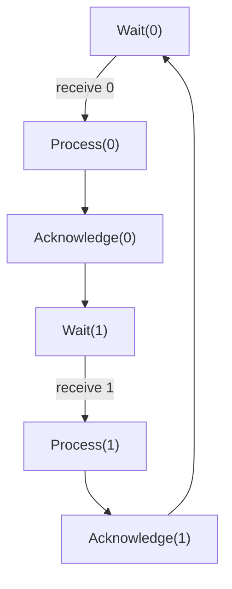

Se riceve nuovamente il bit precedente, riconosce il messaggio come duplicato e non lo processa nuovamente.

---

## 28. Perdita di un messaggio

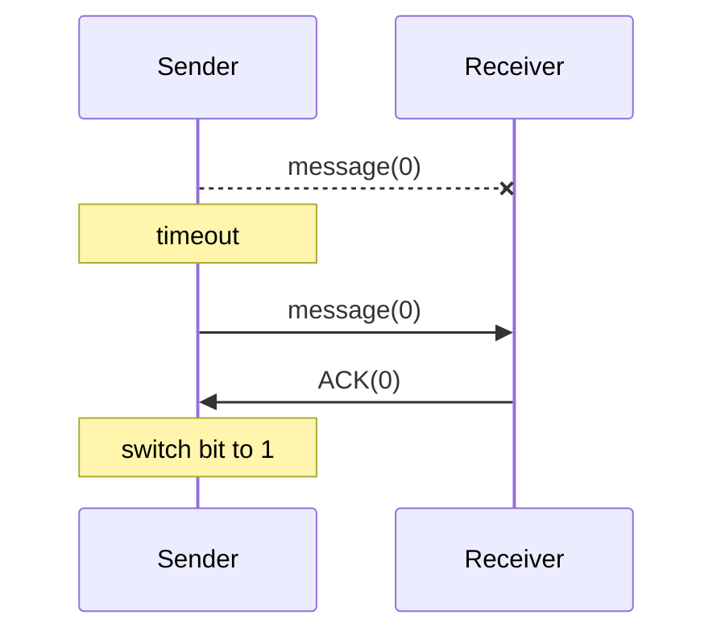

Il protocollo continua a funzionare perché il timeout causa una ritrasmissione.

---

## 29. Perdita dell'ACK

```mermaid
sequenceDiagram
    participant S as Sender
    participant R as Receiver

    S->>R: message(0)
    R--xS: ACK(0)

    Note over S: timeout

    S->>R: message(0)
    Note over R: duplicate message
    R->>S: ACK(0)

    Note over S: switch bit to 1
```

Il receiver riconosce la duplicazione grazie all'alternating bit.

---

## 30. Dimensione del TS dell'ABP

Nelle slide vengono considerate:

- $10$ location del sender;
- $2$ location del timer;
- $6$ location del receiver.

Quindi, ignorando inizialmente i channel:

$$
10\cdot2\cdot6.
$$

A questo bisogna moltiplicare il numero delle channel evaluations:

$$
10\cdot2\cdot6
\cdot
\#\text{channel evaluations}.
$$

Per FIFO di capacità $10$, lo spazio degli stati supera:

$$
10^8.
$$

Questo esempio introduce direttamente il problema della **state explosion**.

---

## 31. Varianti dei Channel Systems

### Conditional communication actions

È possibile avere:

$$
\ell
\xrightarrow{g:c?x}
\ell'.
$$

La comunicazione può essere eseguita solo se la condizione $g$ è vera.

### Generalized sending

Invece di:

$$
c!v
$$

si può utilizzare:

$$
c!expr.
$$

Per esempio:

$$
c!(2x+7).
$$

Il valore dell'espressione viene calcolato prima di essere inviato.

### Communication as condition

Si possono anche avere forme come:

$$
\ell
\xrightarrow{c?x:\alpha}
\ell'.
$$

Questo permette rappresentazioni più compatte del transition system.

---

## 32. Open e Closed Channel Systems

### Open Channel System

$$
P_1|\ldots|P_n
$$

### Closed Channel System

$$
[P_1|\ldots|P_n].
$$

Un sistema **open** può interagire con componenti esterni.

Un sistema **closed** viene invece considerato come sistema completo.

---

## 33. Riassunto degli operatori paralleli

### Pure interleaving

$$
T_1 ||| T_2
$$

Caratteristiche:

- concorrenza;
- nessuna comunicazione;
- le azioni vengono interleaved.

```mermaid
flowchart LR
    T1["T1"]
    OP["|||"]
    T2["T2"]

    T1 --- OP
    OP --- T2
```

---

## 34. Synchronous Message Passing

Forma generale:

$$
T_1 \parallel_{Syn} T_2.
$$

Caratteristiche:

- interleaving delle azioni indipendenti;
- sincronizzazione per le azioni appartenenti a $Syn$.

---

## 35. Interleaving di Program Graphs

$$
P_1 ||| P_2
$$

permette:

- interleaving;
- comunicazione tramite **shared variables**.

---

## 36. Channel Systems

$$
[P_1|\ldots|P_n]
$$

permettono contemporaneamente:

- interleaving;
- shared variables;
- synchronous message passing;
- asynchronous message passing.

```mermaid
flowchart TB
    I["Pure interleaving"]
    PG["Program graphs"]
    CS["Channel systems"]

    I -->|"add shared variables"| PG
    PG -->|"add channels"| CS
```

---

## 37. Synchronous Product

Un altro operatore introdotto è il **synchronous product**:

$$
T_1\otimes T_2.
$$

A differenza dell'interleaving, qui i processi sono **completamente sincronizzati**.

Non abbiamo:

$$
\alpha
\quad\text{oppure}\quad
\beta
$$

ma una sola transizione congiunta:

$$
\alpha * \beta.
$$

---

## 38. Definizione del Synchronous Product

Consideriamo:

$$
T_1=(S_1,Act_1,\rightarrow_1,\ldots)
$$

e:

$$
T_2=(S_2,Act_2,\rightarrow_2,\ldots).
$$

Il synchronous product è:

$$
T_1\otimes T_2
=
(S_1\times S_2,Act,\rightarrow,\ldots).
$$

Lo state space è quindi:

$$
S_1\times S_2.
$$

Le azioni vengono combinate mediante una funzione:

$$
Act_1\times Act_2
\rightarrow Act
$$

$$
(\alpha,\beta)
\mapsto
\alpha*\beta.
$$

---

## 39. Regola del Synchronous Product

Se:

$$
s_1\xrightarrow{\alpha}_1s_1'
$$

e:

$$
s_2\xrightarrow{\beta}_2s_2',
$$

allora:

$$
\frac{
s_1\xrightarrow{\alpha}_1s_1'
\quad\land\quad
s_2\xrightarrow{\beta}_2s_2'
}{
\langle s_1,s_2\rangle
\xrightarrow{\alpha*\beta}
\langle s_1',s_2'\rangle
}.
$$

Quindi entrambi i sistemi devono effettuare una transizione.

---

## 40. Interleaving vs Synchronous Product

### Interleaving

Da:

$$
(s_1,s_2)
$$

può evolvere solo il primo:

$$
(s_1,s_2)
\rightarrow
(s_1',s_2)
$$

oppure solo il secondo:

$$
(s_1,s_2)
\rightarrow
(s_1,s_2').
$$

### Synchronous Product

I due componenti evolvono insieme:

$$
(s_1,s_2)
\rightarrow
(s_1',s_2').
$$

```mermaid
flowchart LR
    A["(s1,s2)"]
    B["(s1',s2')"]

    A -->|"α * β"| B
```

---

## 41. Synchronous Product dei circuiti

Il synchronous product viene utilizzato anche per comporre **sequential circuits**.

Supponiamo due circuiti:

$$
C_1
$$

e:

$$
C_2.
$$

La composizione:

$$
C_1\otimes C_2
$$

possiede congiuntamente:

- input dei due circuiti;
- output dei due circuiti;
- registri interni dei due circuiti.

```mermaid
flowchart LR
    I1["inputs C1"]
    C1["Circuit C1"]
    O1["outputs C1"]

    I2["inputs C2"]
    C2["Circuit C2"]
    O2["outputs C2"]

    I1 --> C1 --> O1
    I2 --> C2 --> O2
```

Il transition system del circuito composto è ottenuto mediante:

$$
T_1\otimes T_2.
$$

---

## 42. State Explosion Problem

Uno dei problemi fondamentali del model checking è la **state explosion**.

Il transition system di un sistema reattivo può diventare enormemente grande.

Può addirittura essere infinito.

### Sistemi con domini infiniti

Per esempio:

$$
x\in\mathbb N.
$$

Se una variabile può assumere infiniti valori, il TS può avere infiniti stati.

### Strutture dati infinite

Lo stesso problema compare con strutture non limitate come:

- stack;
- queue;
- list.

---

## 43. Crescita esponenziale

Anche quando il TS è finito, può crescere esponenzialmente rispetto al numero di componenti.

Per:

$$
T_1,\ldots,T_n
$$

lo spazio degli stati della composizione può essere:

$$
S_1\times S_2\times\ldots\times S_n.
$$

Quindi:

$$
|S|
=
|S_1|
|S_2|
\cdots
|S_n|.
$$

Se ogni componente possiede $m$ stati:

$$
|S|=m^n.
$$

La crescita è dunque esponenziale nel numero dei componenti.

---

## 44. State Explosion nei Channel Systems

Per un channel system, lo stato contiene:

$$
\langle
\ell_1,\ldots,\ell_n,\eta,\xi
\rangle.
$$

La dimensione dipende quindi da:

1. numero delle location;
2. domini delle variabili;
3. domini dei channel;
4. capacità dei channel.

Una forma concettuale della dimensione è:

$$
|S|
=
\left(
\prod_{i=1}^{n}|Loc_i|
\right)
\cdot
\left(
\prod_{x\in Var}|Dom(x)|
\right)
\cdot
\left(
\prod_{c\in Chan}
\#Eval(c)
\right).
$$

Con channel FIFO finiti:

$$
\#Eval(c)
=
\sum_{j=0}^{cap(c)}
|Dom(c)|^j.
$$

Pertanto:

$$
|S|
=
\left(
\prod_{i=1}^{n}|Loc_i|
\right)
\left(
\prod_{x\in Var}|Dom(x)|
\right)
\left(
\prod_{c\in Chan}
\sum_{j=0}^{cap(c)}
|Dom(c)|^j
\right).
$$

---

## 45. Perché la State Explosion è importante

Anche sistemi apparentemente piccoli possono generare transition systems giganteschi.

```mermaid
flowchart LR
    S["Small syntactic<br/>system"]
    T["Huge transition<br/>system"]

    S -->|"semantic expansion"| T
```

Il problema nasce perché il transition system deve rappresentare **tutte le possibili combinazioni** di:

- control locations;
- variable evaluations;
- channel contents;
- interleavings;
- comunicazioni.

---

## 46. Model Checking

```mermaid
flowchart TB
    SYS["system<br/>P1 || ... || Pn"]
    REQ["requirements"]

    TS["transition system T"]
    SPEC["specification spec"]

    MC["model checker<br/>does T satisfy spec?"]

    YES["yes"]
    NO["no + error indication"]

    SYS --> TS
    REQ --> SPEC

    TS --> MC
    SPEC --> MC

    MC --> YES
    MC --> NO
```

Le slide evidenziano che il sistema viene inizialmente descritto sintatticamente come:

$$
P_1,\ldots,P_n.
$$

Attraverso le **SOS rules** viene generato il transition system:

$$
\mathcal T.
$$

La specifica dei requisiti produce invece:

$$
spec.
$$

Infine il model checker verifica:

$$
\boxed{\mathcal T\models spec}
$$

---

## 47. Catena completa

```mermaid
flowchart TB
    PG["Program graphs<br/>P1,...,Pn"]

    CS["Channel system<br/>[P1 | ... | Pn]"]

    SOS["SOS rules"]

    TS["Transition system<br/>T_C"]

    SPEC["Specification<br/>spec"]

    MC["Model checker"]

    RESULT["satisfied / counterexample"]

    PG --> CS
    CS --> SOS
    SOS --> TS

    TS --> MC
    SPEC --> MC

    MC --> RESULT
```

In formula:

$$
[P_1|\ldots|P_n]
\overset{\text{SOS semantics}}{\longrightarrow}
\mathcal T_C
$$

e successivamente:

$$
\mathcal T_C\models spec\ ?
$$

---

## 48. Concetti fondamentali da ricordare

1. **Channel System**

   $$
   [P_1|\ldots|P_n]
   $$

2. **Synchronous channel**

   $$
   cap(c)=0
   $$

3. **Asynchronous FIFO channel**

   $$
   cap(c)\geq1
   $$

4. **Sending**

   $$
   c!v
   $$

5. **Receiving**

   $$
   c?x
   $$

6. **State di un Channel System**

   $$
   \langle
   \ell_1,\ldots,\ell_n,\eta,\xi
   \rangle
   $$

7. **Variable evaluation**

   $$
   \eta\in Eval(Var)
   $$

8. **Channel evaluation**

   $$
   \xi\in Eval(Chan)
   $$

9. **Asynchronous communication**

   sender e receiver agiscono separatamente attraverso un FIFO.

10. **Synchronous communication**

   $$
   c!v
   \quad\text{e}\quad
   c?x
   $$

   devono sincronizzarsi.

11. **SOS semantics**

   definisce come il Channel System genera il transition system.

12. **Alternating Bit Protocol**

   usa bit alternati, acknowledgement e timeout per rendere affidabile una comunicazione su channel inaffidabili.

13. **Synchronous product**

   $$
   T_1\otimes T_2
   $$

   rappresenta processi completamente sincronizzati.

14. **State explosion**

   la dimensione dello state space cresce rapidamente con componenti, variabili e channel.

15. **Model checking**

   $$
   \boxed{\mathcal T\models spec}
   $$

   verifica automaticamente se il transition system soddisfa la specifica.

# 22/9

Exercise Sheet 1

# 24/9

## 1. Obiettivo della lezione

Questa parte del corso introduce le **Linear Time Properties** per transition systems.

I temi principali sono:

- state-based view di un transition system;
- execution fragments, path fragments e paths;
- linear-time view e branching-time view;
- traces;
- Linear-Time properties;
- relazione di soddisfacimento;
- mutual exclusion e liveness;
- trace inclusion;
- refinement e data abstraction;
- trace equivalence;
- classificazione safety/liveness;
- invariants;
- invariant checking tramite DFS.

---

## 2. State-based view di un Transition System

Un transition system ha forma:

$$
\mathcal{T}=(S,Act,\rightarrow,S_0,AP,L)
$$

dove:

- $S$ è lo spazio degli stati;
- $Act$ è l'insieme delle azioni;
- $\rightarrow$ è la relazione di transizione;
- $S_0\subseteq S$ è l'insieme degli stati iniziali;
- $AP$ è l'insieme delle atomic propositions;
- $L:S\rightarrow 2^{AP}$ è la labeling function.

Nella **state-based view** si astraggono le action labels e si considera soltanto il grafo degli stati.

```mermaid
flowchart TB
    T["Transition system T"]
    G["State graph G_T"]
    S["nodes = states S"]
    E["edges = transitions without action labels"]

    T -->|"abstraction from actions"| G
    G --> S
    G --> E
```

Le action labels rimangono importanti per:

- interazioni e comunicazione;
- fairness assumptions.

Le atomic propositions e la labeling function sono invece utilizzate per specificare proprietà.

---

## 3. Predecessori e successori

Per uno stato $s\in S$ definiamo:

$$
Post(s)=\{t\in S\mid s\rightarrow t\}
$$

e:

$$
Pre(s)=\{u\in S\mid u\rightarrow s\}
$$

Quindi:

- $Post(s)$ contiene i successori immediati di $s$;
- $Pre(s)$ contiene i predecessori immediati di $s$.

```mermaid
flowchart LR
    U1["u1"] --> S["s"]
    U2["u2"] --> S
    S --> T1["t1"]
    S --> T2["t2"]
```

In questo esempio:

$$
Pre(s)=\{u_1,u_2\}
$$

$$
Post(s)=\{t_1,t_2\}
$$

---

## 4. Execution fragments

Un **execution fragment** è una sequenza di transizioni consecutive.

Può essere infinita:

$$
s_0\xrightarrow{\alpha_0}s_1
\xrightarrow{\alpha_1}s_2
\xrightarrow{\alpha_2}\cdots
$$

oppure finita:

$$
s_0\xrightarrow{\alpha_0}s_1
\xrightarrow{\alpha_1}\cdots
\xrightarrow{\alpha_{n-1}}s_n
$$

Un execution fragment contiene quindi:

- stati;
- azioni.

---

## 5. Path fragments

Un **path fragment** si ottiene proiettando un execution fragment soltanto sugli stati.

Un path fragment infinito ha forma:

$$
\pi=s_0s_1s_2\ldots
$$

mentre uno finito ha forma:

$$
\pi=s_0s_1\ldots s_n.
$$

Deve valere:

$$
s_{i+1}\in Post(s_i)
$$

per ogni posizione valida $i$.

Equivalentemente:

$$
s_i\rightarrow s_{i+1}.
$$

---

## 6. Initial e maximal path fragments

Un path fragment è **initial** se:

$$
s_0\in S_0.
$$

È **maximal** se:

- è infinito, oppure
- è finito e termina in uno stato terminale.

Uno **path di $\mathcal{T}$** è quindi un path fragment:

- initial;
- maximal.

Uno **path dello stato $s$** è invece un maximal path fragment che parte da $s$.

---

## 7. Notazione per i paths

Definiamo:

$$
Paths(\mathcal{T})
$$

come l'insieme di tutti gli initial maximal path fragments del transition system.

Definiamo inoltre:

$$
Paths(s)
$$

come l'insieme dei maximal path fragments che iniziano nello stato $s$.

Per i path fragments finiti useremo:

$$
Paths_{fin}(\mathcal{T})
$$

e:

$$
Paths_{fin}(s).
$$

---

## 8. Esempio di paths

Consideriamo:

```mermaid
flowchart TB
    S0["s0"]
    S1["s1"]
    S2["s2"]

    S0 --> S1
    S0 --> S2
    S1 --> S1
```

Se $s_2$ è terminale, gli initial maximal paths sono:

$$
s_0s_1s_1s_1\ldots
$$

e:

$$
s_0s_2.
$$

Quindi:

$$
|Paths(\mathcal{T})|=2.
$$

Per $s_1$:

$$
Paths(s_1)=\{s_1^\omega\}
$$

dove:

$$
s_1^\omega=s_1s_1s_1\ldots
$$

I finite path fragments che partono da $s_1$ sono invece:

$$
Paths_{fin}(s_1)=
\{s_1^n\mid n\in\mathbb{N},n\geq1\}.
$$

---

## 9. Linear-time vs Branching-time

Partiamo da:

$$
\mathcal{T}=(S,Act,\rightarrow,S_0,AP,L).
$$

Dopo aver astratto dalle azioni otteniamo:

- state graph;
- labeling tramite $L$.

Da qui possiamo osservare il sistema secondo due prospettive.

```mermaid
flowchart TB
    T["Transition system"]
    G["State graph + labeling"]
    LT["Linear-time view"]
    BT["Branching-time view"]

    T -->|"abstract from actions"| G
    G --> LT
    G --> BT
```

### Linear-time view

La linear-time view è **path-based**.

Considera:

- sequenze di stati;
- singole evoluzioni complete del sistema.

La struttura di branching viene ignorata.

### Branching-time view

La branching-time view mantiene invece:

- stati;
- scelte nondeterministiche;
- differenti rami futuri.

La struttura di branching è quindi rilevante.

---

## 10. Dallo state graph alle traces

Nella linear-time view non siamo interessati direttamente agli stati, ma a ciò che è **osservabile** negli stati.

Data la labeling function:

$$
L:S\rightarrow 2^{AP},
$$

un path:

$$
\pi=s_0s_1s_2\ldots
$$

produce la sequenza:

$$
L(s_0)L(s_1)L(s_2)\ldots
$$

chiamata **trace**.

```mermaid
flowchart TB
    E["Execution: states + actions"]
    P["Path: states"]
    T["Trace: sets of atomic propositions"]

    E -->|"remove action labels"| P
    P -->|"apply labeling L"| T
```

---

## 11. Traces

Per un path:

$$
\pi=s_0s_1s_2\ldots
$$

definiamo:

$$
trace(\pi)=L(s_0)L(s_1)L(s_2)\ldots
$$

Ogni elemento della trace è quindi un sottoinsieme di $AP$.

Se il path è infinito:

$$
trace(\pi)\in(2^{AP})^\omega.
$$

Se è finito:

$$
trace(\pi)\in(2^{AP})^+.
$$

Nel seguito si assume spesso che il transition system **non abbia terminal states**. In questo caso tutte le traces rilevanti sono infinite.

---

## 12. Traces di un Transition System

Definiamo:

$$
Traces(\mathcal{T})
=
\{trace(\pi)\mid\pi\in Paths(\mathcal{T})\}.
$$

Se il TS non ha stati terminali:

$$
Traces(\mathcal{T})\subseteq(2^{AP})^\omega.
$$

Per i finite path fragments:

$$
Traces_{fin}(\mathcal{T})
=
\{trace(\hat{\pi})\mid
\hat{\pi}\in Paths_{fin}(\mathcal{T})\}.
$$

e quindi:

$$
Traces_{fin}(\mathcal{T})\subseteq(2^{AP})^*.
$$

---

## 13. Esempio di trace

Supponiamo:

$$
AP=\{a\}
$$

e un TS che possa produrre:

$$
\{a\},\emptyset,\emptyset,\emptyset,\ldots
$$

oppure:

$$
\emptyset,\emptyset,\emptyset,\ldots
$$

Allora:

$$
Traces(\mathcal{T})
=
\{\{a\}\emptyset^\omega,\emptyset^\omega\}.
$$

I prefissi finiti comprendono:

$$
\{a\}\emptyset^n
$$

per $n\geq0$, e:

$$
\emptyset^m
$$

per $m\geq1$.

---

## 14. Trattamento degli stati terminali

Nel corso si preferisce spesso lavorare con transition systems senza terminal states.

Prima si calcola:

$$
Reach(\mathcal{T})
$$

cioè l'insieme degli stati raggiungibili da almeno uno stato iniziale.

Per ogni reachable terminal state $s$:

- se $s$ rappresenta una terminazione prevista, si introduce un trap state;
- se $s$ rappresenta un fault, ad esempio un deadlock, il design va corretto prima di procedere.

```mermaid
flowchart LR
    S["terminal state s"]
    STOP["stop"]
    S --> STOP
    STOP --> STOP
```

In questo modo una terminazione intenzionale viene trasformata in un comportamento infinito stabile.

---

## 15. Esempio: vending machine

Le slide confrontano differenti implementazioni di una vending machine.

Una prima implementazione usa uno stato intermedio `select`:

```mermaid
flowchart TB
    PAY["pay"]
    SEL["select"]
    C["coke"]
    S["sprite"]

    PAY --> SEL
    SEL --> C
    SEL --> S
    C --> PAY
    S --> PAY
```

Un'altra implementazione rappresenta direttamente la scelta durante il pagamento:

```mermaid
flowchart TB
    PAY["pay"]
    PC["paid_c"]
    PS["paid_s"]
    C["coke"]
    S["sprite"]

    PAY --> PC
    PAY --> PS
    PC --> C
    PS --> S
    C --> PAY
    S --> PAY
```

La state-based view astrae dalle azioni e osserva soltanto le atomic propositions.

Per esempio:

$$
AP=\{coke,sprite\}
$$

oppure:

$$
AP=\{pay,drink\}.
$$

La labeling function potrebbe soddisfare:

$$
L(coke)=\{coke\}
$$

e:

$$
L(pay)=\emptyset.
$$

L'idea centrale è che sistemi strutturalmente diversi possono risultare indistinguibili nella linear-time view se generano le stesse traces.

---

## 16. Mutual exclusion con semaforo

Consideriamo due processi:

- $P_1$;
- $P_2$.

Ognuno attraversa gli stati:

- `noncrit`;
- `wait`;
- `crit`.

Un semaforo condiviso $y$ è inizializzato a:

$$
y=1.
$$

Per entrare nella critical section viene eseguita l'operazione:

$$
y>0:y:=y-1.
$$

All'uscita:

$$
y:=y+1.
$$

Lo state space contiene combinazioni delle control locations dei due processi e del valore di $y$.

Per osservare la proprietà di mutua esclusione possiamo scegliere:

$$
AP=\{crit_1,crit_2\}.
$$

Oppure, per studiare anche liveness:

$$
AP=\{wait_1,crit_1,wait_2,crit_2\}.
$$

---

## 17. Linear-Time Properties

Una **Linear-Time property** su $AP$ è un linguaggio di parole infinite sull'alfabeto:

$$
\Sigma=2^{AP}.
$$

Formalmente:

$$
E\subseteq(2^{AP})^\omega.
$$

Quindi una LT property specifica **quali traces infinite sono ammesse**.

Un transition system soddisfa una proprietà se tutte le sue traces appartengono al linguaggio della proprietà.

---

## 18. Proprietà MUTEX

Per:

$$
AP=\{wait_1,crit_1,wait_2,crit_2\}
$$

la proprietà di mutua esclusione può essere definita come:

$$
MUTEX=
\left\{
A_0A_1A_2\ldots
\in(2^{AP})^\omega
\;\middle|\;
\forall i\in\mathbb{N},
\ crit_1\notin A_i
\lor
crit_2\notin A_i
\right\}.
$$

Equivalentemente, in ogni posizione della trace:

$$
\neg(crit_1\land crit_2).
$$

Quindi i due processi non possono trovarsi contemporaneamente nelle rispettive critical sections.

---

## 19. Proprietà LIVE

La proprietà di starvation freedom richiede che un processo che attende venga infine servito.

Per esempio, intuitivamente:

$$
wait_1
\Rightarrow
\text{eventualmente }crit_1
$$

e:

$$
wait_2
\Rightarrow
\text{eventualmente }crit_2.
$$

Nelle slide la proprietà viene espressa sulle traces richiedendo che l'attesa ripetuta sia accompagnata dall'ingresso ripetuto nella critical section.

L'idea è:

$$
\text{un processo non deve rimanere in attesa per sempre}.
$$

---

## 20. Satisfaction relation per LT properties

Sia $\mathcal{T}$ un TS senza terminal states su $AP$ e sia $E$ una LT property.

Definiamo:

$$
\mathcal{T}\models E
$$

se e solo se:

$$
Traces(\mathcal{T})\subseteq E.
$$

Questa è la definizione fondamentale:

$$
\boxed{
\mathcal{T}\models E
\iff
Traces(\mathcal{T})\subseteq E
}
$$

Per uno stato $s$:

$$
s\models E
\iff
Traces(s)\subseteq E.
$$

---

## 21. Mutual exclusion con semaforo: safety vs liveness

Per il sistema con semaforo delle slide:

$$
T_{Sem}\models MUTEX.
$$

La mutua esclusione è garantita.

Tuttavia:

$$
T_{Sem}\not\models LIVE.
$$

È infatti possibile avere un comportamento in cui un processo continua ad ottenere il semaforo mentre l'altro rimane in attesa indefinitamente.

Quindi:

- la soluzione è **safe**;
- non è necessariamente **starvation-free**.

---

## 22. Peterson's Mutual Exclusion Algorithm

Le slide confrontano il semaforo con l'algoritmo di Peterson.

Per il transition system associato all'algoritmo di Peterson:

$$
T_{Pet}\models MUTEX
$$

e:

$$
T_{Pet}\models LIVE.
$$

Quindi Peterson garantisce sia:

- mutual exclusion;
- progress/starvation freedom nel modello considerato.

Questo esempio evidenzia che safety e liveness sono proprietà differenti.

---

## 23. Trace inclusion

Siano $T_1$ e $T_2$ due transition systems definiti sullo stesso insieme $AP$.

La relazione:

$$
Traces(T_1)\subseteq Traces(T_2)
$$

significa che ogni comportamento osservabile di $T_1$ è anche ammesso da $T_2$.

Un'importante conseguenza è:

$$
Traces(T_1)\subseteq Traces(T_2)
\land
T_2\models E
\Rightarrow
T_1\models E.
$$

Infatti:

$$
Traces(T_1)
\subseteq
Traces(T_2)
\subseteq
E.
$$

---

## 24. Caratterizzazione tramite LT properties

Per due TS $T_1$ e $T_2$, sono equivalenti:

1. 

$$
Traces(T_1)\subseteq Traces(T_2)
$$

2. per ogni LT property $E$:

$$
T_2\models E
\Rightarrow
T_1\models E.
$$

Quindi la trace inclusion può essere vista come relazione fondamentale di preservazione delle Linear-Time properties.

---

## 25. Trace inclusion come refinement relation

Nel ciclo di sviluppo:

```mermaid
flowchart TB
    R["requirements"]
    S["specification E"]
    D1["design T_i"]
    D2["refined design T_i+1"]

    R --> S
    S --> D1
    D1 -->|"refinement"| D2
```

Una refinement relation può essere definita tramite trace inclusion:

$$
T_{i+1}\sqsubseteq T_i
$$

se:

$$
Traces(T_{i+1})
\subseteq
Traces(T_i).
$$

Interpretazione:

> l'implementazione più concreta non introduce nuovi comportamenti osservabili rispetto alla specifica più astratta.

Se:

$$
T_i\models E
$$

e:

$$
T_{i+1}\sqsubseteq T_i,
$$

allora:

$$
T_{i+1}\models E.
$$

---

## 26. Risoluzione del nondeterminismo

La trace inclusion compare naturalmente quando si elimina nondeterminismo.

Supponiamo che uno stato possa scegliere tra due comportamenti:

```mermaid
flowchart TB
    S["s"]
    A["behavior A"]
    B["behavior B"]

    S --> A
    S --> B
```

Un'implementazione può scegliere di mantenere soltanto uno dei due rami.

Il nuovo sistema avrà meno traces:

$$
Traces(T')
\subseteq
Traces(T).
$$

Quindi la risoluzione del nondeterminismo può essere vista come un refinement.

---

## 27. Trace inclusion e data abstraction

La trace inclusion è anche importante nelle astrazioni.

Supponiamo di avere un programma con variabili numeriche potenzialmente molto grandi o infinite.

Invece di mantenere tutti i valori concreti, si può costruire un sistema astratto basato soltanto su predicati rilevanti, ad esempio:

$$
x>0
$$

$$
x=0
$$

$$
x\equiv_2 y.
$$

L'astrazione genera tipicamente un sistema $T'$ che ammette almeno tutti i comportamenti concreti:

$$
Traces(T)\subseteq Traces(T').
$$

Quindi, se il sistema astratto soddisfa una proprietà:

$$
T'\models E,
$$

allora anche il sistema concreto la soddisfa:

$$
T\models E.
$$

```mermaid
flowchart LR
    T["Concrete TS T"]
    TA["Abstract TS T'"]
    P["Property E"]

    T -->|"abstraction"| TA
    TA -->|"verify"| P
```

L'astrazione può aggiungere comportamenti spurii, ma non deve eliminare comportamenti concreti se vuole essere usata in questo modo.

---

## 28. Trace equivalence

Due transition systems $T_1$ e $T_2$ sono **trace equivalent** se:

$$
Traces(T_1)=Traces(T_2).
$$

Questo equivale a richiedere trace inclusion in entrambe le direzioni:

$$
Traces(T_1)\subseteq Traces(T_2)
$$

e:

$$
Traces(T_2)\subseteq Traces(T_1).
$$

Due sistemi trace equivalent soddisfano esattamente le stesse Linear-Time properties:

$$
T_1\models E
\iff
T_2\models E.
$$

---

## 29. Trace equivalent vending machines

Le due vending machines presentate nelle slide hanno strutture interne differenti, ma rispetto alle atomic propositions osservate producono lo stesso comportamento.

Con:

$$
AP=\{pay,coke,sprite\},
$$

le traces hanno forma:

$$
\{pay\}\,
\emptyset\,
\{drink_1\}\,
\{pay\}\,
\emptyset\,
\{drink_2\}
\ldots
$$

con:

$$
drink_i\in\{coke,sprite\}.
$$

Quindi:

$$
Traces(T_1)=Traces(T_2).
$$

Di conseguenza:

$$
T_1
$$

e:

$$
T_2
$$

soddisfano le stesse LT properties su $AP$.

---

## 30. Classificazione delle LT properties

Le proprietà Linear-Time vengono classificate principalmente in:

- **safety properties**;
- **liveness properties**.

### Safety

Idea intuitiva:

> nothing bad will happen.

Esempi:

- mutual exclusion;
- deadlock freedom;
- ogni fase rossa è preceduta da una fase gialla.

### Liveness

Idea intuitiva:

> something good will happen.

Esempi:

- ogni processo in attesa entrerà eventualmente nella critical section;
- ogni filosofo mangerà infinitamente spesso.

---

## 31. Invariants come caso speciale di safety

Gli invariants sono una classe particolarmente importante di safety properties.

L'idea è:

> no bad state will be reached.

Una proprietà invariant può quindi essere verificata guardando soltanto gli stati raggiungibili.

Non occorre analizzare esplicitamente intere traces infinite.

---

## 32. Logica proposizionale

Le invariant conditions vengono espresse tramite propositional logic.

Una formula può essere costruita con:

$$
\Phi ::= true
\mid a
\mid \Phi_1\land\Phi_2
\mid\neg\Phi
\mid\Phi_1\lor\Phi_2
\mid\Phi_1\rightarrow\Phi_2
\mid\ldots
$$

dove:

$$
a\in AP.
$$

---

## 33. Semantica della logica proposizionale

Sia:

$$
A\subseteq AP.
$$

Allora:

$$
A\models true
$$

sempre.

Per una atomic proposition:

$$
A\models a
\iff
a\in A.
$$

Per la congiunzione:

$$
A\models\Phi_1\land\Phi_2
$$

se e solo se:

$$
A\models\Phi_1
$$

e:

$$
A\models\Phi_2.
$$

Per la negazione:

$$
A\models\neg\Phi
\iff
A\not\models\Phi.
$$

Per uno stato $s$:

$$
s\models\Phi
\iff
L(s)\models\Phi.
$$

---

## 34. Definizione di invariant

Sia $E$ una LT property su $AP$.

$E$ è un **invariant** se esiste una formula proposizionale $\Phi$ tale che:

$$
E=
\left\{
A_0A_1A_2\ldots\in(2^{AP})^\omega
\;\middle|\;
\forall i\geq0,\ A_i\models\Phi
\right\}.
$$

La formula:

$$
\Phi
$$

è chiamata **invariant condition**.

Quindi una trace soddisfa l'invariant se $\Phi$ vale in ogni posizione della trace.

---

## 35. Esempio: mutual exclusion come invariant

La proprietà:

$$
MUTEX
$$

può essere espressa tramite:

$$
\Phi=
\neg crit_1
\lor
\neg crit_2.
$$

Equivalentemente:

$$
\Phi=
\neg(crit_1\land crit_2).
$$

L'invariant corrispondente è:

$$
MUTEX=
\left\{
A_0A_1\ldots
\mid
\forall i\geq0,\ A_i\models\Phi
\right\}.
$$

---

## 36. Esempio: deadlock freedom

Per cinque dining philosophers, supponiamo che:

$$
wait_j
$$

indichi che il filosofo $j$ è bloccato in attesa.

Un deadlock globale corrisponderebbe a:

$$
wait_0\land wait_1\land wait_2\land wait_3\land wait_4.
$$

Quindi una invariant condition per la deadlock freedom è:

$$
\Phi=
\neg wait_0
\lor
\neg wait_1
\lor
\neg wait_2
\lor
\neg wait_3
\lor
\neg wait_4.
$$

Cioè, in ogni stato raggiungibile almeno un filosofo non deve essere in attesa.

---

## 37. Satisfaction degli invariants

Sia $E$ un invariant con invariant condition $\Phi$.

Per un transition system senza terminal states:

$$
\mathcal{T}\models E
$$

se e solo se ogni trace soddisfa $E$:

$$
trace(\pi)\in E
\quad
\forall\pi\in Paths(\mathcal{T}).
$$

Questo equivale a dire:

$$
s\models\Phi
$$

per ogni stato che compare su un path iniziale.

Ma tali stati sono esattamente gli stati raggiungibili.

Quindi:

$$
\boxed{
\mathcal{T}\models E
\iff
\forall s\in Reach(\mathcal{T}),\ s\models\Phi
}
$$

Questo risultato rende l'invariant checking un problema di graph reachability.

---

## 38. Invariant checking come graph analysis

Per verificare un invariant basta:

1. partire dagli stati iniziali;
2. esplorare gli stati raggiungibili;
3. controllare $\Phi$ in ogni stato;
4. fermarsi se viene trovato uno stato che viola $\Phi$.

Si può utilizzare:

- DFS;
- BFS.

```mermaid
flowchart TB
    S["Initial states"]
    R["Explore reachable states"]
    C{"Does every state satisfy Phi?"}
    Y["Invariant holds"]
    N["Counterexample path"]

    S --> R
    R --> C
    C -->|"yes"| Y
    C -->|"no"| N
```

---

## 39. Error indication

Se l'invariant è violato, il model checker deve fornire un initial path fragment:

$$
s_0s_1\ldots s_n
$$

tale che:

$$
s_i\models\Phi
$$

per:

$$
0\leq i<n
$$

ma:

$$
s_n\not\models\Phi.
$$

Questa sequenza costituisce il **counterexample**.

---

## 40. DFS-based invariant checking

Schema principale:

```text
U := empty set
pi := empty stack

FOR ALL s0 in S0 DO
    IF DFS(s0, Phi) THEN
        return "no" and reverse(pi)
    FI
OD

return "yes"
```

Dove:

- $U$ contiene gli stati già processati;
- $\pi$ è uno stack usato per ricostruire il counterexample.

---

## 41. DFS ricorsiva

La procedura concettuale è:

```text
DFS(s, Phi):

    Push(pi, s)

    IF s not in U THEN

        IF s does not satisfy Phi THEN
            return true
        FI

        insert s into U

        FOR ALL s' in Post(s) DO
            IF DFS(s', Phi) THEN
                return true
            FI
        OD
    FI

    Pop(pi)
    return false
```

Interpretazione:

- se viene raggiunto uno stato che viola $\Phi$, la ricerca termina;
- lo stack contiene il path che porta allo stato errato;
- gli stati già in $U$ non vengono riesplorati.

---

## 42. Esempio di invariant checking

Consideriamo:

```mermaid
flowchart TB
    S0["s0 : {a}"]
    S1["s1 : {a}"]
    S2["s2 : {a}"]
    T["t : empty"]

    S0 --> S1
    S0 --> S2
    S1 --> S1
    S2 --> T
```

Invariant condition:

$$
\Phi=a.
$$

Abbiamo:

$$
s_0\models a
$$

$$
s_1\models a
$$

$$
s_2\models a
$$

ma:

$$
t\not\models a.
$$

La DFS può produrre il counterexample:

$$
s_0s_2t.
$$

Quindi:

$$
s_0\not\models\text{``always }a\text{''}.
$$

---

## 43. Complessità intuitiva dell'invariant checking

Con una normale DFS/BFS ogni stato raggiungibile viene processato al più una volta.

Ogni transizione viene considerata durante l'esplorazione.

Quindi il costo è lineare rispetto alla dimensione del reachable state graph:

$$
O(|S|+|\rightarrow|).
$$

Il limite pratico principale non è quindi l'algoritmo in sé, ma la dimensione dello state space.

---

## 44. Relazioni fondamentali da ricordare

### Trace di un path

$$
trace(s_0s_1s_2\ldots)
=
L(s_0)L(s_1)L(s_2)\ldots
$$

### Traces del TS

$$
Traces(\mathcal{T})
=
\{trace(\pi)\mid\pi\in Paths(\mathcal{T})\}
$$

### LT property

$$
E\subseteq(2^{AP})^\omega
$$

### Satisfaction

$$
\mathcal{T}\models E
\iff
Traces(\mathcal{T})\subseteq E
$$

### Trace inclusion

$$
Traces(T_1)\subseteq Traces(T_2)
$$

### Preservation

$$
Traces(T_1)\subseteq Traces(T_2)
\land
T_2\models E
\Rightarrow
T_1\models E
$$

### Trace equivalence

$$
Traces(T_1)=Traces(T_2)
$$

### Invariant

$$
E=
\{
A_0A_1\ldots
\mid
\forall i,\ A_i\models\Phi
\}
$$

### Invariant checking

$$
\mathcal{T}\models E
\iff
\forall s\in Reach(\mathcal{T}),\ s\models\Phi
$$

---

## 45. Schema riassuntivo della lezione

```mermaid
flowchart TB
    TS["Transition system"]
    SG["State graph + labeling"]
    PATH["Paths"]
    TRACE["Traces"]
    LT["Linear-Time property E"]
    MC["Model checking"]
    SAFE["Safety / invariants"]
    DFS["DFS or BFS on reachable states"]

    TS -->|"abstract actions"| SG
    SG --> PATH
    PATH -->|"apply L"| TRACE
    TRACE --> MC
    LT --> MC
    LT --> SAFE
    SAFE --> DFS
```

Il percorso concettuale è quindi:

$$
\text{Transition System}
\rightarrow
\text{Paths}
\rightarrow
\text{Traces}
\rightarrow
\text{LT Properties}
\rightarrow
\text{Model Checking}.
$$

---

## 46. Concetti essenziali per l'esame

Da saper spiegare bene:

1. differenza tra execution fragment e path fragment;
2. definizione di initial e maximal path;
3. significato di $Paths(\mathcal{T})$;
4. definizione di trace;
5. differenza fra linear-time e branching-time view;
6. definizione formale di LT property;
7. significato di $\mathcal{T}\models E$;
8. proprietà $MUTEX$;
9. proprietà $LIVE$;
10. perché il semaforo può garantire safety ma non liveness;
11. perché Peterson soddisfa entrambe nel modello presentato;
12. significato della trace inclusion;
13. trace inclusion come refinement;
14. trace inclusion e data abstraction;
15. trace equivalence;
16. safety vs liveness;
17. definizione di invariant;
18. invariant condition $\Phi$;
19. equivalenza tra invariant checking e verifica di $\Phi$ su $Reach(\mathcal{T})$;
20. DFS-based invariant checking e generazione del counterexample.

---

## 47. Mappa concettuale finale

```mermaid
flowchart LR
    A["T = transition system"]
    B["Paths(T)"]
    C["Traces(T)"]
    D["LT property E"]
    E["T |= E"]
    F["Safety"]
    G["Liveness"]
    H["Invariant"]
    I["Reachability check"]

    A --> B
    B --> C
    C --> E
    D --> E
    D --> F
    D --> G
    F --> H
    H --> I
```

La relazione centrale dell'intera lezione è:

$$
\boxed{
\mathcal{T}\models E
\iff
Traces(\mathcal{T})\subseteq E
}
$$

e, per gli invariants:

$$
\boxed{
\mathcal{T}\models E
\iff
\forall s\in Reach(\mathcal{T}),\ s\models\Phi
}
$$

# 25/9
## 1. Obiettivo della lezione

Questa lezione approfondisce la parte di **Linear Time Properties** dedicata a safety properties, invariants, bad prefixes, prefix closure, finite trace inclusion ed equivalence.

L'idea intuitiva fondamentale è:

> una safety property afferma che **"nothing bad will happen"**.

---

## 2. Safety properties

Una **safety property** descrive un comportamento nel quale qualcosa di indesiderato non deve mai accadere.

Esempi:

- mutual exclusion;
- deadlock freedom;
- ogni fase rossa deve essere preceduta da una fase gialla;
- in una beverage machine, il numero di monete inserite non deve mai essere inferiore al numero di bevande erogate.

Gli invariants sono una classe particolare di safety properties.

```mermaid
flowchart TB
    S["Safety properties"]
    I["Invariants"]
    O["Other safety properties"]

    S --> I
    S --> O

    I --> B1["No bad state is reached"]
    O --> B2["No bad finite prefix occurs"]
```

---

## 3. Esempi di invariants

### Mutual exclusion

$$
\neg(crit_1 \land crit_2)
$$

Equivalentemente:

$$
\neg crit_1 \lor \neg crit_2.
$$

### Deadlock freedom

Un deadlock globale corrisponde a:

$$
\bigwedge_{0\leq i<n} wait_i.
$$

La deadlock freedom richiede quindi:

$$
\neg\left(\bigwedge_{0\leq i<n} wait_i\right).
$$

Equivalentemente:

$$
\bigvee_{0\leq i<n}\neg wait_i.
$$

---

## 4. Safety properties non invarianti

Una safety property generale può dipendere dalla storia del sistema e non soltanto dallo stato corrente.

Esempio:

> every red phase is preceded by a yellow phase.

Per verificarla bisogna sapere anche quale stato è stato osservato subito prima.

Un altro esempio:

> the total number of entered coins is never less than the total number of released drinks.

---

## 5. Bad prefix

Una violazione di una safety property può essere riconosciuta dopo un numero finito di passi.

Un **bad prefix** è un prefisso finito dopo il quale la proprietà non può più essere recuperata.

Per la beverage machine:

$$
\{pay\}\{drink\}\{drink\}
$$

è un bad prefix.

```mermaid
flowchart LR
    P["finite prefix"]
    V{"Property irreparably violated?"}
    B["Bad prefix"]
    N["Not a bad prefix"]

    P --> V
    V -->|"yes"| B
    V -->|"no"| N
```

---

## 6. Definizione formale di Safety Property

Sia:

$$
E\subseteq(2^{AP})^\omega.
$$

$E$ è una **safety property** se per ogni:

$$
\sigma=A_0A_1A_2\ldots
\in(2^{AP})^\omega\setminus E
$$

esiste un prefisso finito:

$$
A_0A_1\ldots A_n
$$

tale che nessuna sua estensione infinita appartiene a $E$.

Formalmente:

$$
E\cap
\left\{
\sigma'\in(2^{AP})^\omega
\mid
A_0\ldots A_n
\text{ è prefisso di }\sigma'
\right\}
=
\emptyset.
$$

---

## 7. Insieme dei bad prefixes

Definiamo:

$$
BadPref_E
$$

come l'insieme di tutti i bad prefixes di $E$.

Formalmente:

$$
BadPref_E\subseteq(2^{AP})^+.
$$

Quindi una safety property può essere vista come l'insieme delle parole infinite che non hanno alcun bad prefix.

---

## 8. Minimal bad prefixes

Un **minimal bad prefix** è un bad prefix per cui nessun prefisso proprio è già un bad prefix.

Se:

$$
A_0A_1\ldots A_n\in BadPref_E,
$$

allora è minimale se:

$$
A_0\ldots A_i\notin BadPref_E
$$

per ogni $i<n$.

Indichiamo il loro insieme con:

$$
MinBadPref_E.
$$

---

## 9. Esempio: traffic light

Sia:

$$
AP=\{red,yellow\}.
$$

La proprietà è:

> ogni fase rossa è preceduta da una fase gialla.

Formalmente:

$$
E=
\left\{
A_0A_1A_2\ldots
\in(2^{AP})^\omega
\;\middle|\;
\forall i\in\mathbb{N},
\ red\in A_i
\Rightarrow
i\geq1
\land
yellow\in A_{i-1}
\right\}.
$$

```mermaid
flowchart LR
    Y["yellow"]
    R["red"]
    RY["red/yellow"]
    G["green"]

    Y --> R
    R --> RY
    RY --> G
    G --> Y
```

Per questo sistema:

$$
\mathcal{T}\models E.
$$

---

## 10. Violazione della proprietà del semaforo

Un esempio di bad prefix è:

$$
\emptyset\ \{red\}\ \emptyset\ \{yellow\}.
$$

Il **minimal bad prefix** è già:

$$
\emptyset\ \{red\}.
$$

Da quel punto non è più possibile correggere il fatto che una fase rossa sia comparsa senza una fase gialla precedente.

---

## 11. Bad prefixes della proprietà traffic light

Per la proprietà precedente:

$$
BadPref_E
$$

è l'insieme delle parole finite:

$$
A_0A_1\ldots A_n
$$

per cui esiste:

$$
i\in\{0,\ldots,n\}
$$

tale che:

$$
red\in A_i
$$

e:

$$
i=0
\lor
yellow\notin A_{i-1}.
$$

---

## 12. Satisfaction delle Safety Properties

Per una safety property $E$ e un TS $\mathcal{T}$:

$$
\mathcal{T}\models E
\iff
Traces(\mathcal{T})\subseteq E.
$$

Per le safety properties possiamo usare una caratterizzazione finitaria:

$$
\boxed{
\mathcal{T}\models E
\iff
Traces_{fin}(\mathcal{T})\cap BadPref_E=\emptyset
}
$$

Equivalentemente:

$$
\boxed{
\mathcal{T}\models E
\iff
Traces_{fin}(\mathcal{T})\cap MinBadPref_E=\emptyset
}
$$

---

## 13. Finite traces

Definiamo:

$$
Traces_{fin}(\mathcal{T})
=
\{
trace(\hat{\pi})
\mid
\hat{\pi}
\text{ è un initial finite path fragment di }\mathcal{T}
\}.
$$

---

## 14. Ogni invariant è una safety property

Se $E$ è un invariant con invariant condition $\Phi$, un bad prefix è una parola finita:

$$
A_0\ldots A_n
$$

tale che:

$$
A_i\not\models\Phi
$$

per almeno un $i\in\{0,\ldots,n\}$.

Un **minimal bad prefix** soddisfa:

$$
A_i\models\Phi
$$

per $i=0,\ldots,n-1$, ma:

$$
A_n\not\models\Phi.
$$

---

## 15. Proprietà estreme

### Proprietà vuota

$$
E=\emptyset
$$

è una safety property.

Infatti:

$$
BadPref_E=(2^{AP})^+.
$$

È anche un invariant con invariant condition:

$$
false.
$$

### Proprietà universale

$$
E=(2^{AP})^\omega
$$

è anch'essa una safety property.

In questo caso:

$$
BadPref_E=\emptyset.
$$

---

## 16. Prefix di una parola infinita

Per:

$$
\sigma=A_0A_1A_2\ldots
$$

definiamo:

$$
pref(\sigma)
=
\{
A_0A_1\ldots A_n
\mid
n\geq0
\}.
$$

---

## 17. Prefix di una proprietà

Per:

$$
E\subseteq(2^{AP})^\omega
$$

definiamo:

$$
pref(E)
=
\bigcup_{\sigma\in E}pref(\sigma).
$$

---

## 18. Prefix closure

La **prefix closure** di $E$ è:

$$
cl(E)
=
\left\{
\sigma\in(2^{AP})^\omega
\mid
pref(\sigma)\subseteq pref(E)
\right\}.
$$

Intuitivamente, $cl(E)$ contiene tutte le parole infinite i cui prefissi finiti rimangono compatibili con almeno una parola di $E$.

---

## 19. Caratterizzazione tramite Prefix Closure

Teorema:

$$
\boxed{
E\text{ è una safety property}
\iff
cl(E)=E
}
$$

```mermaid
flowchart LR
    E["LT property E"]
    C["prefix closure cl(E)"]

    E --> C
    C -->|"cl(E) = E"| S["E is safety"]
```

---

## 20. Trace inclusion e LT properties

Per due TS $T_1$ e $T_2$ sullo stesso $AP$:

$$
Traces(T_1)\subseteq Traces(T_2)
$$

se e solo se, per ogni LT property $E$:

$$
T_2\models E
\Rightarrow
T_1\models E.
$$

---

## 21. Finite trace inclusion e Safety Properties

Per le sole safety properties:

$$
\boxed{
Traces_{fin}(T_1)
\subseteq
Traces_{fin}(T_2)
}
$$

se e solo se:

$$
\boxed{
\forall E\text{ safety},
\quad
T_2\models E
\Rightarrow
T_1\models E
}
$$

Quindi per preservare tutte le safety properties basta confrontare le finite traces.

---

## 22. Idea della dimostrazione: direzione $\Rightarrow$

Supponiamo:

$$
Traces_{fin}(T_1)
\subseteq
Traces_{fin}(T_2).
$$

Se:

$$
T_2\models E,
$$

allora:

$$
Traces_{fin}(T_2)
\cap
BadPref_E
=
\emptyset.
$$

Di conseguenza:

$$
Traces_{fin}(T_1)
\cap
BadPref_E
\subseteq
Traces_{fin}(T_2)
\cap
BadPref_E
=
\emptyset.
$$

Quindi:

$$
T_1\models E.
$$

---

## 23. Idea della dimostrazione: direzione $\Leftarrow$

Si considera:

$$
E=cl(Traces(T_2)).
$$

Usando:

$$
pref(Traces(T))
=
Traces_{fin}(T),
$$

si ottiene:

$$
E=
\left\{
\sigma
\mid
pref(\sigma)
\subseteq
Traces_{fin}(T_2)
\right\}.
$$

Poiché $cl(E)=E$, $E$ è una safety property e $T_2\models E$.

Per ipotesi:

$$
T_1\models E.
$$

Da cui si ricava:

$$
Traces_{fin}(T_1)
\subseteq
Traces_{fin}(T_2).
$$

---

## 24. Finite trace equivalence

Due transition systems sono **finite trace equivalent** se:

$$
Traces_{fin}(T_1)
=
Traces_{fin}(T_2).
$$

Questo vale se e solo se soddisfano esattamente le stesse safety properties.

$$
\boxed{
Traces_{fin}(T_1)=Traces_{fin}(T_2)
}
$$

se e solo se:

$$
\boxed{
T_1\text{ e }T_2
\text{ soddisfano le stesse safety properties}
}
$$

---

## 25. Riassunto delle relazioni

### Trace inclusion

$$
Traces(T)\subseteq Traces(T')
$$

se e solo se:

$$
\forall E\text{ LT},
\quad
T'\models E
\Rightarrow
T\models E.
$$

### Finite trace inclusion

$$
Traces_{fin}(T)
\subseteq
Traces_{fin}(T')
$$

se e solo se:

$$
\forall E\text{ safety},
\quad
T'\models E
\Rightarrow
T\models E.
$$

### Trace equivalence

$$
Traces(T)=Traces(T')
$$

se e solo se $T$ e $T'$ soddisfano le stesse LT properties.

### Finite trace equivalence

$$
Traces_{fin}(T)=Traces_{fin}(T')
$$

se e solo se $T$ e $T'$ soddisfano le stesse safety properties.

---

## 26. Trace inclusion implica finite trace inclusion

Se:

$$
Traces(T)
\subseteq
Traces(T'),
$$

allora:

$$
Traces_{fin}(T)
\subseteq
Traces_{fin}(T').
$$

Poiché:

$$
Traces_{fin}(T)
=
pref(Traces(T)).
$$

---

## 27. Il viceversa non vale in generale

In generale:

$$
Traces_{fin}(T)
\subseteq
Traces_{fin}(T')
$$

non implica:

$$
Traces(T)
\subseteq
Traces(T').
$$

Le slide presentano un controesempio con:

$$
AP=\{b\}.
$$

Per un sistema:

$$
Traces(T)=\{\emptyset^\omega\}.
$$

Un altro sistema può imitare ogni prefisso finito di $\emptyset^\omega$, ma in ogni comportamento infinito raggiungere infine uno stato con $b$.

Quindi le finite traces non distinguono i due sistemi rispetto a tutte le LT properties.

---

## 28. Proprietà che distingue i sistemi

La proprietà:

> eventually $b$

distingue i sistemi.

Nel controesempio:

$$
T\not\models E
$$

mentre:

$$
T'\models E.
$$

Questo mostra che una proprietà di tipo eventuality non può essere decisa osservando un solo prefisso finito.

---

## 29. Trace equivalence vs finite trace equivalence

Se:

$$
Traces(T)
=
Traces(T'),
$$

allora:

$$
Traces_{fin}(T)
=
Traces_{fin}(T').
$$

Quindi:

$$
\boxed{
\text{trace equivalence}
\Rightarrow
\text{finite trace equivalence}
}
$$

Il viceversa non vale in generale, nemmeno per transition systems finiti.

---

## 30. Quando finite trace inclusion implica trace inclusion

Supponiamo che:

1. $T$ non abbia terminal states;
2. $T'$ sia finito;
3. 

$$
Traces_{fin}(T)
\subseteq
Traces_{fin}(T').
$$

Allora:

$$
\boxed{
Traces(T)
\subseteq
Traces(T')
}
$$

e quindi:

$$
Traces(T)
\subseteq
Traces(T')
\iff
Traces_{fin}(T)
\subseteq
Traces_{fin}(T').
$$

---

## 31. Idea della dimostrazione

Prendiamo un path infinito:

$$
\pi=s_0s_1s_2\ldots
$$

in $T$.

Vogliamo trovare:

$$
\pi'=t_0t_1t_2\ldots
$$

in $T'$ tale che:

$$
trace(\pi)=trace(\pi').
$$

Ogni prefisso finito della trace di $\pi$ appartiene a $Traces_{fin}(T')$.

Quindi $T'$ contiene path fragments compatibili di lunghezza arbitraria.

Essendo $T'$ finito, si può estrarre un path infinito coerente con tutti questi prefissi.

---

## 32. Intuizione tramite unfolding

```mermaid
flowchart TB
    T0["t0"]

    T1["t1"]
    T2["t2"]

    T11["..."]
    T12["..."]
    T21["..."]
    T22["..."]

    T0 --> T1
    T0 --> T2

    T1 --> T11
    T1 --> T12
    T2 --> T21
    T2 --> T22
```

Se esistono path fragments compatibili a ogni profondità e il sistema è finito, è possibile ottenere un path infinito.

---

## 33. Image-finiteness

La finitezza totale di $T'$ non è strettamente necessaria.

È sufficiente la **image-finiteness**.

Per:

$$
T'=(S',Act,\rightarrow,S'_0,AP,L')
$$

per ogni stato $s\in S'$ e ogni $A\in2^{AP}$ deve essere finito:

$$
\{t\in Post(s)\mid L'(t)=A\}.
$$

Inoltre deve essere finito:

$$
\{s_0\in S'_0\mid L'(s_0)=A\}
$$

per ogni $A\in2^{AP}$.

---

## 34. Trace equivalence sotto ipotesi aggiuntive

In generale:

$$
Traces_{fin}(T)=Traces_{fin}(T')
$$

non implica:

$$
Traces(T)=Traces(T').
$$

La direzione inversa vale sotto ipotesi aggiuntive, ad esempio:

- $T$ e $T'$ sono finiti e senza terminal states;
- oppure $T$ e $T'$ sono **AP-deterministic**.

---

## 35. Safety vs Liveness

La distinzione concettuale è:

### Safety

Una violazione può essere dimostrata tramite un prefisso finito.

$$
\text{"something bad happened"}
$$

### Liveness

Una violazione non è, in generale, rilevabile con un prefisso finito.

Per esempio:

$$
\text{"eventually }b\text{"}.
$$

Dopo qualsiasi prefisso finito è ancora possibile che $b$ avvenga in futuro.

```mermaid
flowchart LR
    S["Safety"]
    BP["finite bad prefix"]
    L["Liveness"]
    INF["infinite behavior matters"]

    S --> BP
    L --> INF
```

---

## 36. Formule fondamentali

### Safety satisfaction

$$
\mathcal{T}\models E
\iff
Traces_{fin}(\mathcal{T})
\cap
BadPref_E
=
\emptyset.
$$

### Minimal bad prefixes

$$
\mathcal{T}\models E
\iff
Traces_{fin}(\mathcal{T})
\cap
MinBadPref_E
=
\emptyset.
$$

### Prefix closure

$$
cl(E)
=
\{
\sigma\in(2^{AP})^\omega
\mid
pref(\sigma)\subseteq pref(E)
\}.
$$

### Safety via prefix closure

$$
E\text{ safety}
\iff
cl(E)=E.
$$

### Finite trace inclusion

$$
Traces_{fin}(T_1)
\subseteq
Traces_{fin}(T_2)
$$

se e solo se:

$$
\forall E\text{ safety},
\quad
T_2\models E
\Rightarrow
T_1\models E.
$$

---

## 37. Concetti da ricordare per l'esame

1. definizione intuitiva di safety property;
2. differenza tra invariant e safety property generale;
3. definizione di bad prefix;
4. definizione di minimal bad prefix;
5. perché ogni invariant è una safety property;
6. perché $\emptyset$ è una safety property;
7. perché $(2^{AP})^\omega$ è una safety property;
8. definizione di $pref(\sigma)$;
9. definizione di $pref(E)$;
10. definizione di $cl(E)$;
11. teorema $E$ safety $\iff cl(E)=E$;
12. satisfaction tramite bad prefixes;
13. finite trace inclusion;
14. finite trace equivalence;
15. differenza fra trace equivalence e finite trace equivalence;
16. perché finite trace inclusion non implica trace inclusion in generale;
17. condizioni aggiuntive sotto cui l'implicazione inversa vale;
18. significato di image-finiteness;
19. differenza concettuale fra safety e liveness.

---

## 38. Mappa concettuale finale

```mermaid
flowchart TB
    E["LT property E"]
    S["Safety property"]
    I["Invariant"]
    BP["BadPref_E"]
    MBP["MinBadPref_E"]
    P["Prefix closure cl(E)"]
    TF["Traces_fin(T)"]
    SAT["T |= E"]
    FI["Finite trace inclusion"]
    FE["Finite trace equivalence"]

    E --> S
    I --> S
    S --> BP
    BP --> MBP
    S --> P
    P -->|"cl(E)=E"| S
    TF --> SAT
    BP --> SAT
    TF --> FI
    FI --> FE
```

La relazione centrale della lezione è:

$$
\boxed{
\mathcal{T}\models E
\iff
Traces_{fin}(\mathcal{T})\cap BadPref_E=\emptyset
}
$$

cioè: una safety property è violata quando il sistema produce un **prefisso finito irrimediabilmente cattivo**.

