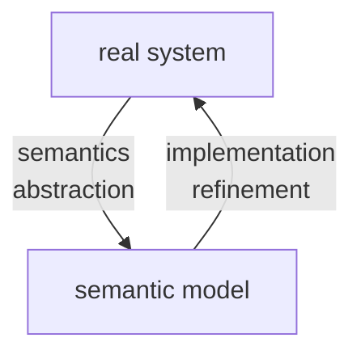
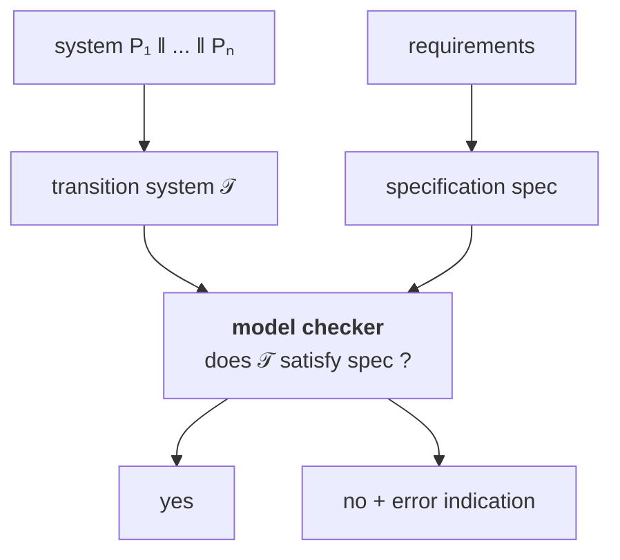
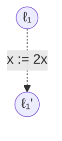
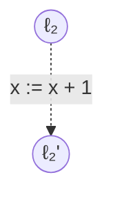
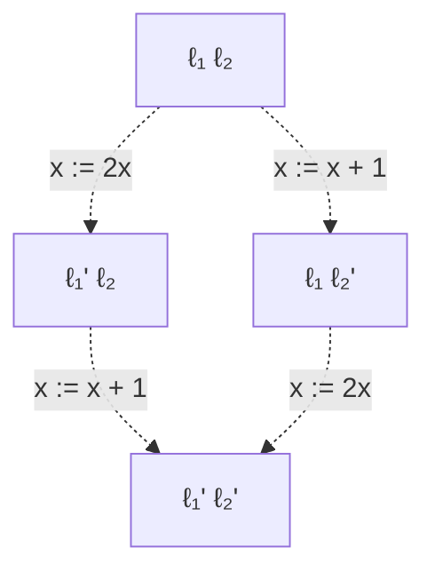
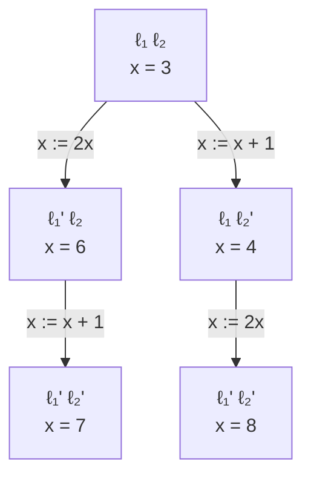

# 15/9

ICT = Information and Communication Technology

Verification = “check that we are building the thing right”
Validation = “check that we are building the right thing”

Formal methods are the “applied mathematics for modelling and analysing ICT systems”

Formal Verification Techniques for Property P:
- Deductive methods
	- method: provide a formal proof that P holds
	- tool: theorem prover/proof assistant of proof checker
	- appicable if: system has form of a mathematical theory
- Model Checking
	- method: systematic checker on P in all states
	- tool: model checker (SPIN, NUMSMV, UPPALL)
	- appicable if: system generates (finite) behavioural model
- Model-based simulation or testing
	- method: test for P by exploring possible behaviours
	- applicable if: system defines an executable model

Simulation and Testing:
- Basic Procedure:
	- take a model (simulation) or a realisation (testing)
	- stimulate it with certain inputs (the test)
	- observe reaction and check wheter this is "desired"
- Important drawbacks:
	- number of possible behaviours is very large (or even infinite)
	- unexplored behaviours may contain the fatal bug
- About testing: testing/simulation can show the presence of errors, not their absence

Example of Proof Rules:
1. Backward axiom
2. cut rule
3. Invariant rule
4. Logical rule

$$
\begin{align}
& \frac{}{\{A[e/x]\} x:= e \{A\}} & \\ \\
& \frac{\{A\}P\{B\} \; \{B\}Q\{C\}}{\{A\}P;Q\{C\}} & \\ \\
& \frac{\{I \land b\} P \{I\}}{\{I\}\text{while b do P}\{I\land \lnot B\}} & \\ \\
&\frac{A \implies A' \; \{A'\}P\{B'\} \; B' \implies B}{\{A\}P\{B\}}
\end{align}
$$

Model Checking Overview #TODO

What is Model Checking? Model checking is an automated technique that, given a finite-state model of a system and a formal property, systematically checks whether this property holds for (a given state in) that model.

What are Models?
- Tansistion systems
	- states labeled with basic proposition
	- Transition relation between states
	- Action-labeled transitions to facilitate composition
- Expressivity
	- Programs are transition systems
	- Multi-threading programs are transistion systems
	- Communicating processes are transition systems
	- Hardware circuits are transistion systems

What are Properties? #TODO 

The Model Checking Process:
- Modeling Phase
	- model the system under consideration
	- as a first sanity check, perform some simulations
	- formalise the property to be checked
- Running Phase
	- run the model checker to check the validity of the property in the model
- Analysis pahse
	- property satisfied ? check next property (if any)
	- property violated ? 
		- analyse generated counterexample by simulation
		- refine the model, design, or property . . . and repeat the entire procedure
	- out of memory ? try to reduce the model and try again

Pros of Model Checking:
- widely applicable
- allows for partial verification
- potential "push-button" technology
- rapidly increasing industrial interest
- in case of property violation, a counterexample is provided
- sound and interesting mathematical foundations
- not biased to the most possible scenarios

Cons of Model checking:
- main focus on control-insensitive applications
- model checking is only as "good" as the system model
- no garuantee about completeness of results
- impossible to check generalisations

Model checking is a very e↵ective technique to expose potential design errors

Transitions systems:




the semantic model yields a formal representation of:
- the states of the system (nodes)
- the stepwise behaviour (transistions)
- the initial state
- additional informations on
	- communication (actions)
	- state properties (atomic proposition)

T = (S,Act,->,$S_0$,AP,L):
- S = set of states
- Act = set of actions
- -> $\subseteq S \times Act \times S$ is the transition relation ($s \xrightarrow{\alpha} s'$)
- $S_0 \subseteq S$ = set of initial states
- AP = set of atomic propositions
- $L: S \to 2^{AP}$ labeling function

```
select nondeterministically an initial state s \in S_0
while s is non-terminal do
	select nondeterministically a transitions s(alpha)->s'
	execute the action alpha and puts s:=s'
```

executions: maximal "transitions sequences"

Reach(T) = set of all states that are reachable from an initial state through some execution

(interleaving) parallel execution of independent actions ($\alpha,\beta$ independent):
$$ \underbrace{x := x + 1}_{\text{action } \alpha} \;\parallel\; \underbrace{y := y - 3}_{\text{action } \beta} $$

(competition) parallel execution of dependent actions ($\alpha,\beta$ dependent):
$$ \underbrace{x := x + 1}_{\text{action } \alpha} \;\parallel\; \underbrace{y := 2*x}_{\text{action } \beta} $$

Model Checking:



semantics = transistion system + model checker

Example TS for sequential circuit:
$\lambda_i,\delta_j  \; \hat{=} \; \{0,1\}^n \times \{0,1\}^k\to \{0,1\}$
$\lambda_i$ output value of output var $y_i$
$\delta_j$ next value for register $r_j$

![[Pasted image 20260917195251.png]]

1 output bit, no input, 100 register => 2^100 states
no output, 1 input bit, 100 register => 2^100 + 2^1 = 2^101 

Example TS for sequential program:

![[Pasted image 20260917195951.png]]

typed variable: variable x + data domain Dom(x)
- Boolean : x + Dom(x) = {0,1}
- Integer : y + Dom(y) = N
- variable z : Dom(z) = {yellow, red, blue}

type consistent function $\eta: Var \to Values$
- $\eta(x) \in Dom(x) \; \forall x \in Var$
- Values = $\bigcup_{x \in Var} Dom(x)$
- Eval(Var) = set of evaluations for Var

if Var is a set of typed variables then

Cond(Var) = set of Boolean conditions on the variables in Var

$(\lnot x \land y<z+3)$
Dom(x) = {0,1}
Dom(y)=Dom(y)=N
Dom(w)={yellow,red,blue}
$[x=0,y=3,z=6]\models \lnot x \land y < z$
$[x=0,y=3,z=6]\not\models x \lor y = z$

$Effect:Act \times Eval(Var) \to Eval(Var)$

A program graph over Var (set of typed vars) is:

P =(Loc, Act, Effect,->, $Loc_0$, $g_0$)
- Loc = finite set of locations (control states)
- Act = set of actions
- $Effect:Act \times Eval(Var) \to Eval(Var)$
- -> $\subseteq Loc \times Cond(Var) \times Act \times Loc$
	- $l \xrightarrow{g:\alpha}l'$
	- l,l' are locations
	- $g \in Cond(Var)$
	- $\alpha \in Act$
- $Loc_0 \subseteq Loc$ is set of the initial locations
- $g_0 \in Cond(Var)$ initial condition on the variables

Program graph P over Var => transition system $T_P$

state in $T_P$ = <l,$\eta$> = <location,variable evaluation>

$T_P$ = (S,Act,->,$S_0$,AP,L):
- $S = Loc \times Eval(Var)$
- $S_0  =\{<l,\eta>:l \in Loc_0,\eta \models g_0\}$
- $\frac{l \xrightarrow{g:\alpha}l' \;\land\; \eta \models g}{<l,\eta> \xrightarrow{\alpha}<l',Effect(\alpha,\eta)>}$
- $AP = Loc \cup Cond(Var)$
- $L(<l,\eta>)=\{l\} \cup \{g \in Cond(Var): \eta \models g\}$

Guarded Command Language (GCL) = high-level modeling language that contains features of imperative languages and nondeterministic choice

GCL-program -> program graph -> transition system

guarded command g => stmt:
- g = guard, Boolean condition on the program variables
- stmt = statement

```GCL
DO :: g=>stmt OD  /// WHILE g DO stmt OD
IF :: g => stmt1  /// IF g THEN stmt1
   :: ¬g =>stmt2  ///      ELSE stmt2
FI                /// FI
```

:: stands for the nondeterministic choice between enabled guarded commands

semantics of a GCL-program = program graph

| Action        | Enabled                                         | Effect                             |
| ------------- | ----------------------------------------------- | ---------------------------------- |
| `get_coke`    | if `#coke > 0`                                  | `#coke := #coke - 1`               |
| `get_sprite`  | if `#sprite > 0`                                | `#sprite := #sprite - 1`           |
| `refill`      | any time                                        | `#sprite := max`<br>`#coke := max` |
| `insert_coin` | any time                                        | no effect on variables             |
| `return_coin` | if machine is empty and user has entered a coin | no effect on variables             |

```
DO :: true => insert_coin;
      IF :: #sprite=#coke=0 => return_coin
         :: #coke > 0 => get_coke
         :: #sprite > 0 => get_sprite
	  FI
   :: true => refill
OD
```

start location (DO :: ...)
select location (IF :: \#sprite ...)
$\#sprite,\#coke \in \{0,1,\dots,max\}$

![[Pasted image 20260918171454.png]]
# 17/9

"real" parallel system $P = P_1 || \dots || P_n$
transition system $T = T_1 || \dots || T_n$ 
P -> T analysis semantics
T -> P compositional design

goal: define semantic parallel operators on transition system or program graphs that model "real" parallel operators

||| Interleaving operator for TS:
- interleaving of concurrent, independent actions of parallel processes (modelled by TS)
- representation by nondeterministic choice: "which subprocess performs the next step?"

$effect(\alpha|||\beta) = effect(\alpha;\beta+\beta;\alpha)$: parallel execution of $\alpha$ and $\beta$ on two processors $\hat{=}$ serial execution on a single processor in arbitrary order


$T_1 ||| T_2 = (S_1\times S_2,Act_1\cup Act_2,\to,S_{0,1}\times S_{0,2},AP,L)$:
- where $\to$ is given by:
	- $\frac{s_1 \xrightarrow{\alpha} s_1'}{<s_1,s_2> \xrightarrow{\alpha} <s_1',s_2>}$
	- $\frac{s_2 \xrightarrow{\alpha} s_2'}{<s_1,s_2> \xrightarrow{\alpha} <s_1,s_2'>}$
- $AP = AP_1 \uplus AP_2$
- $L(<s_1,s_2>)=L_1(s_1) \cup L_2(s_2)$

SOS = structured operational semantics

interleaving fails for dependent actions -> inconsistent states

$P_1 ||| P_2 = (Loc_1 \times Loc_2,\dots,\to,\dots)$:
- $\frac{l_1 \xrightarrow{g:\alpha} l_1'}{<l_1,l_2> \xrightarrow{g:\alpha} <l_1',l_2>}$
- $\frac{l_2 \xrightarrow{g:\alpha} l_2'}{<l_1,l_2> \xrightarrow{g:\alpha} <l_1,l_2'>}$

Process $P_1$:


Process $P_2$:


$P_1 ||| P_2$:


Transition system $T_{P_1 ||| P_2}$:


$T_{P_1|||P_2} \not =  T_{P_1} ||| T_{P_2}$

![[Pasted image 20260918183302.png]]

![[Pasted image 20260918183318.png]]

![[Pasted image 20260918183416.png]]

![[Pasted image 20260918183449.png]]

![[Pasted image 20260918183557.png]]

Peterson Algo:

![[Pasted image 20260918183623.png]]

![[Pasted image 20260918183801.png]]

![[Pasted image 20260918183812.png]]

value of $b_1$ is given by $wait_1 \lor crit_1$
value of $b_2$ is given by $wait_2 \lor crit_2$
\+ unrechable states

(incorrect)
![[Pasted image 20260919015845.png]]


Operators for parallelism and communication:
- true concurrency: interleaving operator ||| for TS (no communication, no dependencies)
- communication via shared variables
	- description of subsystems by program graphs
	- interleaving ||| for program graphs
	- TS is obtained by "unfolding"
- synchronous message passing <- data abstract
	- operator $|||_{Syn}$ for TS
	- interleaving for independent actions
	- synchronization over actions in Syn
- channel systems: communication via shared variables + via channels

$Syn \subseteq Act_1\cap Act_2$ = set of synchronization actions

$T_1 ||_{Syn} T_2 = (S_1 \times S_2,Act_1 \cup Act_2, \to, \dots)$

for modeling the concurrent execution of $T_1$ and $T_2$ with synchronization over all actions in Syn

interleaving for all actions $\alpha \in Act_i \setminus Syn$:
$$ \frac{s_1 \xrightarrow{\alpha} s'_1}{<s_1,s_2> \xrightarrow{\alpha} <s'_1,s_2>}$$

$$ \frac{s_2 \xrightarrow{\alpha} s'_2}{<s_1,s_2> \xrightarrow{\alpha} <s_1,s'_2>}$$

handshaking (rendezvous) for all $\alpha \in Syn$:
$$\frac{s_1 \xrightarrow{\alpha}_1s'_1 \land s_2 \xrightarrow{\alpha}_2 s'_2}{<s_1,s_2> \xrightarrow{\alpha} <s'_1,s'_2>}$$

mutual exclusion by synchronous message passing using an arbiter:

![[Pasted image 20260919175930.png]]

$(T_1 ||| T_2) \; ||_{Syn} \; Arbiter$ where Syn = {request, release}

pure interleaving for TS + handshaking for actions request and release

![[Pasted image 20260919180159.png]]

synchronization operator $||_{Syn}$ for three or more processes

![[Pasted image 20260919180259.png]]

![[Pasted image 20260919180316.png]]

![[Pasted image 20260919180441.png]]

# 18/9

