# 15/9

ICT = Information and Communication Technology

Verification = “check that we are building the thing right”
Validation = “check that we are building the right thing”

Formal methods are the “applied mathematics for modelling and analysing ICT systems”

Formal Verification Techniques for Property P:
- Deductive methods
	- method: provide a formal proof that P holds
	- tool: theorem prover/proof assistant of proof checker
	- appicable if: system has form of a mathematical theory
- Model Checking
	- method: systematic checker on P in all states
	- tool: model checker (SPIN, NUMSMV, UPPALL)
	- appicable if: system generates (finite) behavioural model
- Model-based simulation or testing
	- method: test for P by exploring possible behaviours
	- applicable if: system defines an executable model

Simulation and Testing:
- Basic Procedure:
	- take a model (simulation) or a realisation (testing)
	- stimulate it with certain inputs (the test)
	- observe reaction and check wheter this is "desired"
- Important drawbacks:
	- number of possible behaviours is very large (or even infinite)
	- unexplored behaviours may contain the fatal bug
- About testing: testing/simulation can show the presence of errors, not their absence

Example of Proof Rules:
1. Backward axiom
2. cut rule
3. Invariant rule
4. Logical rule

$$
\begin{align}
& \frac{}{\{A[e/x]\} x:= e \{A\}} & \\ \\
& \frac{\{A\}P\{B\} \; \{B\}Q\{C\}}{\{A\}P;Q\{C\}} & \\ \\
& \frac{\{I \land b\} P \{I\}}{\{I\}\text{while b do P}\{I\land \lnot B\}} & \\ \\
&\frac{A \implies A' \; \{A'\}P\{B'\} \; B' \implies B}{\{A\}P\{B\}}
\end{align}
$$

Model Checking Overview #TODO

What is Model Checking? Model checking is an automated technique that, given a finite-state model of a system and a formal property, systematically checks whether this property holds for (a given state in) that model.

What are Models?
- Tansistion systems
	- states labeled with basic proposition
	- Transition relation between states
	- Action-labeled transitions to facilitate composition
- Expressivity
	- Programs are transition systems
	- Multi-threading programs are transistion systems
	- Communicating processes are transition systems
	- Hardware circuits are transistion systems

What are Properties? #TODO 

The Model Checking Process:
- Modeling Phase
	- model the system under consideration
	- as a first sanity check, perform some simulations
	- formalise the property to be checked
- Running Phase
	- run the model checker to check the validity of the property in the model
- Analysis pahse
	- property satisfied ? check next property (if any)
	- property violated ? 
		- analyse generated counterexample by simulation
		- refine the model, design, or property . . . and repeat the entire procedure
	- out of memory ? try to reduce the model and try again

Pros of Model Checking:
- widely applicable
- allows for partial verification
- potential "push-button" technology
- rapidly increasing industrial interest
- in case of property violation, a counterexample is provided
- sound and interesting mathematical foundations
- not biased to the most possible scenarios

Cons of Model checking:
- main focus on control-insensitive applications
- model checking is only as "good" as the system model
- no garuantee about completeness of results
- impossible to check generalisations

Model checking is a very e↵ective technique to expose potential design errors

Transitions systems:


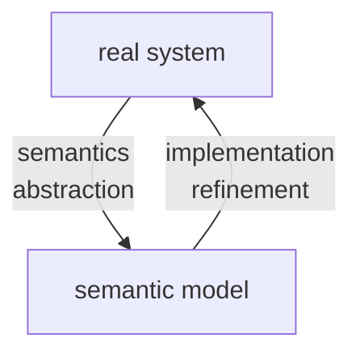
```mermaid
flowchart TB
    A["real system"]
    B["semantic model"]

    A -->|"semantics<br/>abstraction"| B
    B -->|"implementation<br/>refinement"| A
```

the semantic model yields a formal representation of:
- the states of the system (nodes)
- the stepwise behaviour (transistions)
- the initial state
- additional informations on
	- communication (actions)
	- state properties (atomic proposition)

T = (S,Act,->,$S_0$,AP,L):
- S = set of states
- Act = set of actions
- -> $\subseteq S \times Act \times S$ is the transition relation ($s \xrightarrow{\alpha} s'$)
- $S_0 \subseteq S$ = set of initial states
- AP = set of atomic propositions
- $L: S \to 2^{AP}$ labeling function

```
select nondeterministically an initial state s \in S_0
while s is non-terminal do
	select nondeterministically a transitions s(alpha)->s'
	execute the action alpha and puts s:=s'
```

executions: maximal "transitions sequences"

Reach(T) = set of all states that are reachable from an initial state through some execution

(interleaving) parallel execution of independent actions ($\alpha,\beta$ independent):
$$ \underbrace{x := x + 1}_{\text{action } \alpha} \;\parallel\; \underbrace{y := y - 3}_{\text{action } \beta} $$

(competition) parallel execution of dependent actions ($\alpha,\beta$ dependent):
$$ \underbrace{x := x + 1}_{\text{action } \alpha} \;\parallel\; \underbrace{y := 2*x}_{\text{action } \beta} $$

Model Checking:

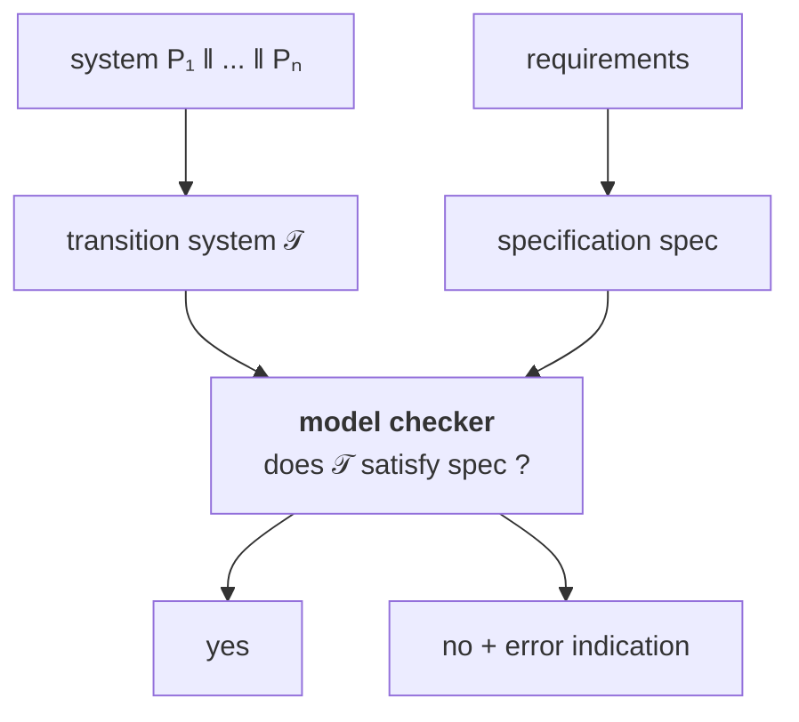
```mermaid
flowchart TB
    A["system  P₁ ‖ ... ‖ Pₙ"]
    B["requirements"]

    C["transition system 𝒯"]
    D["specification spec"]

    E["<b>model checker</b><br/>does 𝒯 satisfy spec ?"]

    F["yes"]
    G["no + error indication"]

    A --> C
    B --> D
    C --> E
    D --> E
    E --> F
    E --> G
```

semantics = transistion system + model checker

Example TS for sequential circuit:
$\lambda_i,\delta_j  \; \hat{=} \; \{0,1\}^n \times \{0,1\}^k\to \{0,1\}$
$\lambda_i$ output value of output var $y_i$
$\delta_j$ next value for register $r_j$

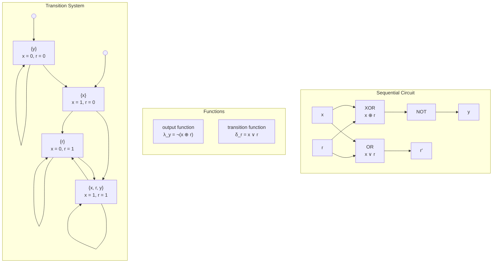
```mermaid
flowchart TB

    %% =========================
    %% Sequential circuit
    %% =========================
    subgraph CIRCUIT["Sequential Circuit"]
        direction LR

        X["x"]
        R["r"]

        XOR["XOR<br/>x ⊕ r"]
        NOT["NOT"]
        OR["OR<br/>x ∨ r"]

        Y["y"]
        RN["r'"]

        X --> XOR
        R --> XOR
        XOR --> NOT
        NOT --> Y

        X --> OR
        R --> OR
        OR --> RN
    end

    %% =========================
    %% Functions
    %% =========================
    subgraph FUNCTIONS["Functions"]
        direction TB

        OUT["output function<br/>λ_y = ¬(x ⊕ r)"]
        TRANS["transition function<br/>δ_r = x ∨ r"]
    end

    %% =========================
    %% Transition system
    %% =========================
    subgraph TS["Transition System"]
        direction TB

        I0(( ))
        I1(( ))

        S00["{y}<br/>x = 0, r = 0"]
        S10["{x}<br/>x = 1, r = 0"]

        S01["{r}<br/>x = 0, r = 1"]
        S11["{x, r, y}<br/>x = 1, r = 1"]

        %% Initial states: initial register evaluation r = 0
        I0 --> S00
        I1 --> S10

        %% r = 0 transitions
        S00 --> S00
        S00 --> S10

        S10 --> S01
        S10 --> S11

        %% r = 1 transitions
        S01 --> S01
        S01 --> S11

        S11 --> S01
        S11 --> S11
    end
```

1 output bit, no input, 100 register => 2^100 states
no output, 1 input bit, 100 register => 2^100 + 2^1 = 2^101 

Example TS for sequential program:

initially: x = 2, y = 0
```
l1 -> WHILE x > 0 DO
	    x := x - 1 <- action alpha
l2 ->   y := y + 1 <- action beta
    OD
l3 -> ...
```

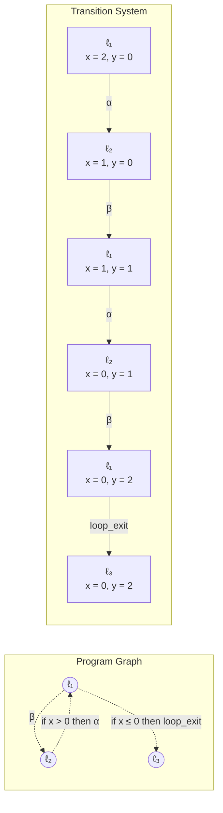
```mermaid
flowchart LR

    subgraph PG["Program Graph"]
        direction TB

        L1(("ℓ₁"))
        L2(("ℓ₂"))
        L3(("ℓ₃"))

        L1 -.->|"β"| L2
        L2 -.->|"if x > 0 then α"| L1
        L1 -.->|"if x ≤ 0 then loop_exit"| L3
    end

    subgraph TS["Transition System"]
        direction TB

        S0["ℓ₁<br/>x = 2, y = 0"]
        S1["ℓ₂<br/>x = 1, y = 0"]
        S2["ℓ₁<br/>x = 1, y = 1"]
        S3["ℓ₂<br/>x = 0, y = 1"]
        S4["ℓ₁<br/>x = 0, y = 2"]
        S5["ℓ₃<br/>x = 0, y = 2"]

        S0 -->|"α"| S1
        S1 -->|"β"| S2
        S2 -->|"α"| S3
        S3 -->|"β"| S4
        S4 -->|"loop_exit"| S5
    end
```

typed variable: variable x + data domain Dom(x)
- Boolean : x + Dom(x) = {0,1}
- Integer : y + Dom(y) = N
- variable z : Dom(z) = {yellow, red, blue}

type consistent function $\eta: Var \to Values$
- $\eta(x) \in Dom(x) \; \forall x \in Var$
- Values = $\bigcup_{x \in Var} Dom(x)$
- Eval(Var) = set of evaluations for Var

if Var is a set of typed variables then

Cond(Var) = set of Boolean conditions on the variables in Var

$(\lnot x \land y<z+3)$
Dom(x) = {0,1}
Dom(y)=Dom(y)=N
Dom(w)={yellow,red,blue}
$[x=0,y=3,z=6]\models \lnot x \land y < z$
$[x=0,y=3,z=6]\not\models x \lor y = z$

$Effect:Act \times Eval(Var) \to Eval(Var)$

A program graph over Var (set of typed vars) is:

P =(Loc, Act, Effect,->, $Loc_0$, $g_0$)
- Loc = finite set of locations (control states)
- Act = set of actions
- $Effect:Act \times Eval(Var) \to Eval(Var)$
- -> $\subseteq Loc \times Cond(Var) \times Act \times Loc$
	- $l \xrightarrow{g:\alpha}l'$
	- l,l' are locations
	- $g \in Cond(Var)$
	- $\alpha \in Act$
- $Loc_0 \subseteq Loc$ is set of the initial locations
- $g_0 \in Cond(Var)$ initial condition on the variables

Program graph P over Var => transition system $T_P$

state in $T_P$ = <l,$\eta$> = <location,variable evaluation>

$T_P$ = (S,Act,->,$S_0$,AP,L):
- $S = Loc \times Eval(Var)$
- $S_0  =\{<l,\eta>:l \in Loc_0,\eta \models g_0\}$
- $\frac{l \xrightarrow{g:\alpha}l' \;\land\; \eta \models g}{<l,\eta> \xrightarrow{\alpha}<l',Effect(\alpha,\eta)>}$
- $AP = Loc \cup Cond(Var)$
- $L(<l,\eta>)=\{l\} \cup \{g \in Cond(Var): \eta \models g\}$

Guarded Command Language (GCL) = high-level modeling language that contains features of imperative languages and nondeterministic choice

GCL-program -> program graph -> transition system

guarded command g => stmt:
- g = guard, Boolean condition on the program variables
- stmt = statement

```GCL
DO :: g=>stmt OD  /// WHILE g DO stmt OD
IF :: g => stmt1  /// IF g THEN stmt1
   :: ¬g =>stmt2  ///      ELSE stmt2
FI                /// FI
```

:: stands for the nondeterministic choice between enabled guarded commands

semantics of a GCL-program = program graph

| Action        | Enabled                                         | Effect                             |
| ------------- | ----------------------------------------------- | ---------------------------------- |
| `get_coke`    | if `#coke > 0`                                  | `#coke := #coke - 1`               |
| `get_sprite`  | if `#sprite > 0`                                | `#sprite := #sprite - 1`           |
| `refill`      | any time                                        | `#sprite := max`<br>`#coke := max` |
| `insert_coin` | any time                                        | no effect on variables             |
| `return_coin` | if machine is empty and user has entered a coin | no effect on variables             |

```
DO :: true => insert_coin;
      IF :: #sprite=#coke=0 => return_coin
         :: #coke > 0 => get_coke
         :: #sprite > 0 => get_sprite
	  FI
   :: true => refill
OD
```

start location (DO :: ...)
select location (IF :: \#sprite ...)
$\#sprite,\#coke \in \{0,1,\dots,max\}$

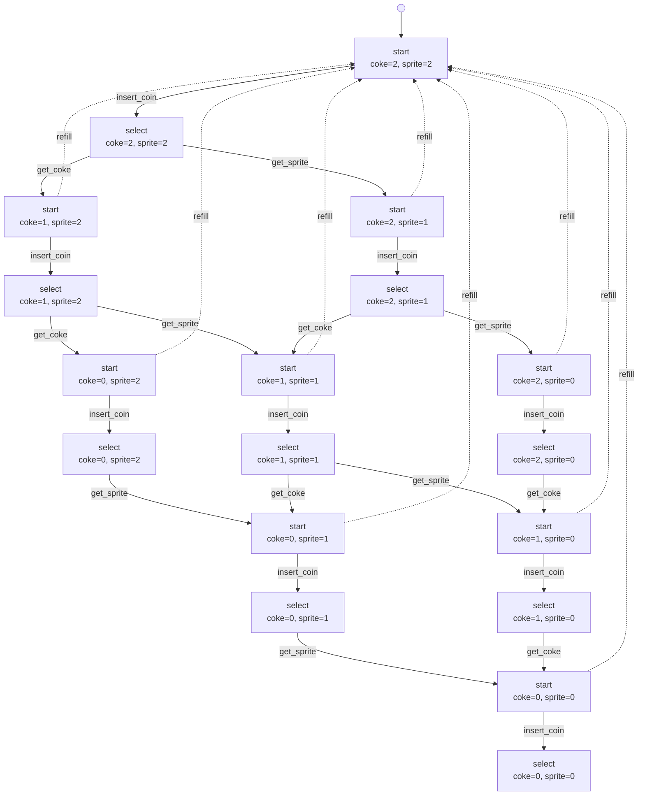
```mermaid
flowchart TB
    I(( ))

    S22["start<br/>coke=2, sprite=2"]
    Q22["select<br/>coke=2, sprite=2"]

    S12["start<br/>coke=1, sprite=2"]
    Q12["select<br/>coke=1, sprite=2"]

    S21["start<br/>coke=2, sprite=1"]
    Q21["select<br/>coke=2, sprite=1"]

    S02["start<br/>coke=0, sprite=2"]
    Q02["select<br/>coke=0, sprite=2"]

    S11["start<br/>coke=1, sprite=1"]
    Q11["select<br/>coke=1, sprite=1"]

    S20["start<br/>coke=2, sprite=0"]
    Q20["select<br/>coke=2, sprite=0"]

    S01["start<br/>coke=0, sprite=1"]
    Q01["select<br/>coke=0, sprite=1"]

    S10["start<br/>coke=1, sprite=0"]
    Q10["select<br/>coke=1, sprite=0"]

    S00["start<br/>coke=0, sprite=0"]
    Q00["select<br/>coke=0, sprite=0"]

    %% Initial state
    I --> S22

    %% Insert coin
    S22 -->|"insert_coin"| Q22

    S12 -->|"insert_coin"| Q12
    S21 -->|"insert_coin"| Q21

    S02 -->|"insert_coin"| Q02
    S11 -->|"insert_coin"| Q11
    S20 -->|"insert_coin"| Q20

    S01 -->|"insert_coin"| Q01
    S10 -->|"insert_coin"| Q10

    S00 -->|"insert_coin"| Q00

    %% Buy from full stock
    Q22 -->|"get_coke"| S12
    Q22 -->|"get_sprite"| S21

    %% Stock (1,2)
    Q12 -->|"get_coke"| S02
    Q12 -->|"get_sprite"| S11

    %% Stock (2,1)
    Q21 -->|"get_coke"| S11
    Q21 -->|"get_sprite"| S20

    %% Stock (0,2)
    Q02 -->|"get_sprite"| S01

    %% Stock (1,1)
    Q11 -->|"get_coke"| S01
    Q11 -->|"get_sprite"| S10

    %% Stock (2,0)
    Q20 -->|"get_coke"| S10

    %% Stock (0,1)
    Q01 -->|"get_sprite"| S00

    %% Stock (1,0)
    Q10 -->|"get_coke"| S00

    %% Refill transitions
    S12 -.->|"refill"| S22
    S21 -.->|"refill"| S22

    S02 -.->|"refill"| S22
    S11 -.->|"refill"| S22
    S20 -.->|"refill"| S22

    S01 -.->|"refill"| S22
    S10 -.->|"refill"| S22

    S00 -.->|"refill"| S22
```
# 17/9

"real" parallel system $P = P_1 || \dots || P_n$
transition system $T = T_1 || \dots || T_n$ 
P -> T analysis semantics
T -> P compositional design

goal: define semantic parallel operators on transition system or program graphs that model "real" parallel operators

||| Interleaving operator for TS:
- interleaving of concurrent, independent actions of parallel processes (modelled by TS)
- representation by nondeterministic choice: "which subprocess performs the next step?"

$effect(\alpha|||\beta) = effect(\alpha;\beta+\beta;\alpha)$: parallel execution of $\alpha$ and $\beta$ on two processors $\hat{=}$ serial execution on a single processor in arbitrary order


$T_1 ||| T_2 = (S_1\times S_2,Act_1\cup Act_2,\to,S_{0,1}\times S_{0,2},AP,L)$:
- where $\to$ is given by:
	- $\frac{s_1 \xrightarrow{\alpha} s_1'}{<s_1,s_2> \xrightarrow{\alpha} <s_1',s_2>}$
	- $\frac{s_2 \xrightarrow{\alpha} s_2'}{<s_1,s_2> \xrightarrow{\alpha} <s_1,s_2'>}$
- $AP = AP_1 \uplus AP_2$
- $L(<s_1,s_2>)=L_1(s_1) \cup L_2(s_2)$

SOS = structured operational semantics

interleaving fails for dependent actions -> inconsistent states

$P_1 ||| P_2 = (Loc_1 \times Loc_2,\dots,\to,\dots)$:
- $\frac{l_1 \xrightarrow{g:\alpha} l_1'}{<l_1,l_2> \xrightarrow{g:\alpha} <l_1',l_2>}$
- $\frac{l_2 \xrightarrow{g:\alpha} l_2'}{<l_1,l_2> \xrightarrow{g:\alpha} <l_1,l_2'>}$

Process $P_1$:
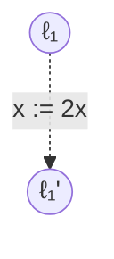
```mermaid 
flowchart TB 
A((ℓ₁)) 
B((ℓ₁')) 
A -.->|x := 2x| B 
```

Process $P_2$:
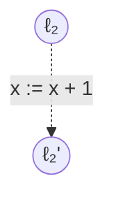
```mermaid 
flowchart TB 
A((ℓ₂)) 
B((ℓ₂')) 
A -.->|x := x + 1| B
```

$P_1 ||| P_2$:
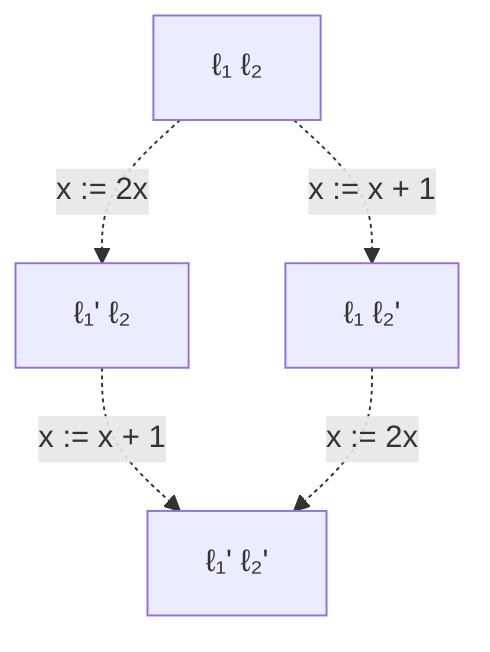
```mermaid
flowchart TB
    A["ℓ₁ ℓ₂"]
    B["ℓ₁' ℓ₂"]
    C["ℓ₁ ℓ₂'"]
    D["ℓ₁' ℓ₂'"]

    A -.->|x := 2x| B
    A -.->|x := x + 1| C

    B -.->|x := x + 1| D
    C -.->|x := 2x| D
```

Transition system $T_{P_1 ||| P_2}$:
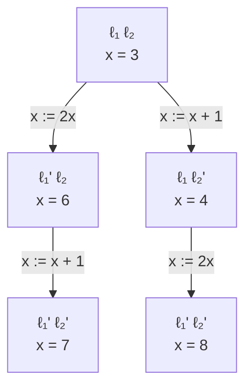
```mermaid 
flowchart TB 
A["ℓ₁ ℓ₂<br/>x = 3"] 
B["ℓ₁' ℓ₂<br/>x = 6"] 
C["ℓ₁ ℓ₂'<br/>x = 4"] 
D["ℓ₁' ℓ₂'<br/>x = 7"] 
E["ℓ₁' ℓ₂'<br/>x = 8"] 
A -->|x := 2x| B 
A -->|x := x + 1| C 
B -->|x := x + 1| D 
C -->|x := 2x| E 
```

$T_{P_1|||P_2} \not =  T_{P_1} ||| T_{P_2}$

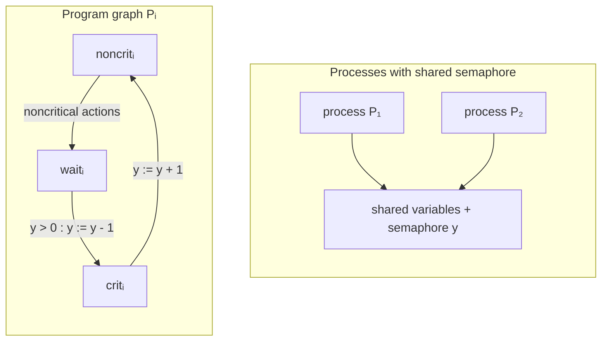
```mermaid
flowchart TB

    %% =========================
    %% Shared semaphore architecture
    %% =========================
    subgraph SYS["Processes with shared semaphore"]
        direction TB

        P1["process P₁"]
        P2["process P₂"]
        SH["shared variables + semaphore y"]

        P1 --> SH
        P2 --> SH
    end

    %% =========================
    %% Program graph of process Pi
    %% =========================
    subgraph PG["Program graph Pᵢ"]
        direction TB

        N["noncritᵢ"]
        W["waitᵢ"]
        C["critᵢ"]

        N -->|"noncritical actions"| W
        W -->|"y > 0 : y := y - 1"| C
        C -->|"y := y + 1"| N
    end
```

Protocol for process $P_i$
```text
LOOP FOREVER
    noncritical actions;

    AWAIT y > 0 DO
        y := y - 1
    OD

    critical actions;

    y := y + 1
END LOOP
````

### Process $P_1$

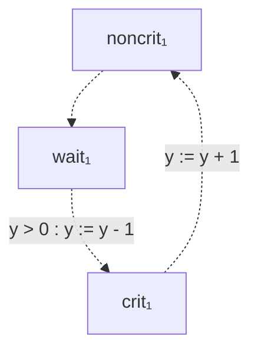
```mermaid
flowchart TB
    N1["noncrit₁"]
    W1["wait₁"]
    C1["crit₁"]

    N1 -.-> W1
    W1 -.->|"y > 0 : y := y - 1"| C1
    C1 -.->|"y := y + 1"| N1
```

### Process $P_2$

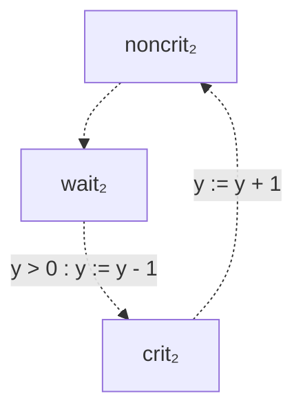
```mermaid
flowchart TB
    N2["noncrit₂"]
    W2["wait₂"]
    C2["crit₂"]

    N2 -.-> W2
    W2 -.->|"y > 0 : y := y - 1"| C2
    C2 -.->|"y := y + 1"| N2
```

### Program graph $P_1 ||| P_2$

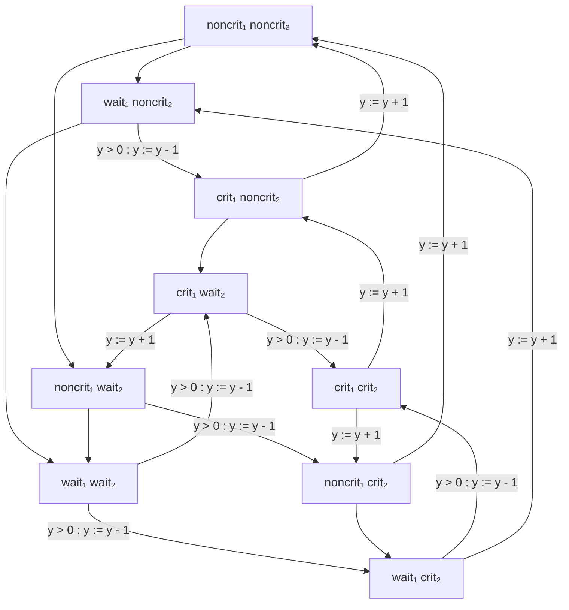
```mermaid
flowchart TB
    N1N2["noncrit₁  noncrit₂"]

    W1N2["wait₁  noncrit₂"]
    N1W2["noncrit₁  wait₂"]

    C1N2["crit₁  noncrit₂"]
    W1W2["wait₁  wait₂"]
    N1C2["noncrit₁  crit₂"]

    C1W2["crit₁  wait₂"]
    W1C2["wait₁  crit₂"]

    C1C2["crit₁  crit₂"]

    %% From initial joint state
    N1N2 --> W1N2
    N1N2 --> N1W2

    %% Process 1 enters critical section
    W1N2 -->|"y > 0 : y := y - 1"| C1N2
    W1W2 -->|"y > 0 : y := y - 1"| C1W2
    W1C2 -->|"y > 0 : y := y - 1"| C1C2

    %% Process 2 enters critical section
    N1W2 -->|"y > 0 : y := y - 1"| N1C2
    W1W2 -->|"y > 0 : y := y - 1"| W1C2
    C1W2 -->|"y > 0 : y := y - 1"| C1C2

    %% Process 1 leaves critical section
    C1N2 -->|"y := y + 1"| N1N2
    C1W2 -->|"y := y + 1"| N1W2
    C1C2 -->|"y := y + 1"| N1C2

    %% Process 2 leaves critical section
    N1C2 -->|"y := y + 1"| N1N2
    W1C2 -->|"y := y + 1"| W1N2
    C1C2 -->|"y := y + 1"| C1N2

    %% Noncritical -> waiting
    W1N2 --> W1W2
    N1W2 --> W1W2

    C1N2 --> C1W2
    N1C2 --> W1C2
```

### Reachable fragment of the transition system $T_{P_1 ||| P_2}$

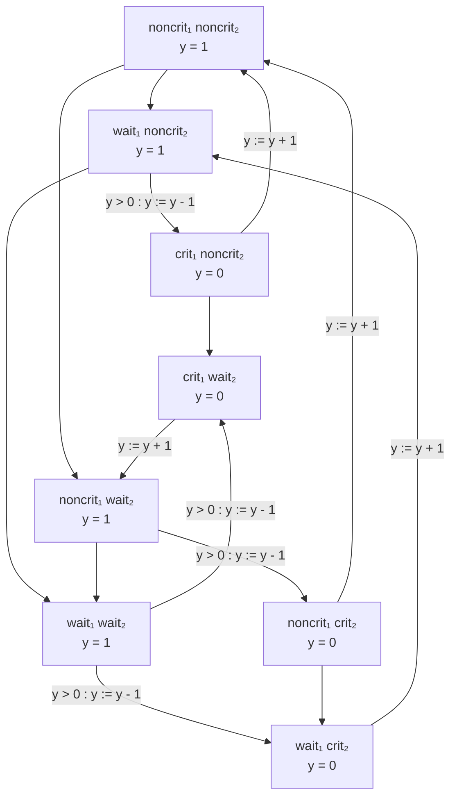
```mermaid
flowchart TB
    S0["noncrit₁  noncrit₂<br/>y = 1"]

    S1["wait₁  noncrit₂<br/>y = 1"]
    S2["noncrit₁  wait₂<br/>y = 1"]

    S3["crit₁  noncrit₂<br/>y = 0"]
    S4["wait₁  wait₂<br/>y = 1"]
    S5["noncrit₁  crit₂<br/>y = 0"]

    S6["crit₁  wait₂<br/>y = 0"]
    S7["wait₁  crit₂<br/>y = 0"]

    %% Initial branching
    S0 --> S1
    S0 --> S2

    %% First process enters critical section
    S1 -->|"y > 0 : y := y - 1"| S3
    S4 -->|"y > 0 : y := y - 1"| S6

    %% Second process enters critical section
    S2 -->|"y > 0 : y := y - 1"| S5
    S4 -->|"y > 0 : y := y - 1"| S7

    %% Other process moves to waiting
    S1 --> S4
    S2 --> S4

    S3 --> S6
    S5 --> S7

    %% Leave critical section
    S3 -->|"y := y + 1"| S0
    S6 -->|"y := y + 1"| S2

    S5 -->|"y := y + 1"| S0
    S7 -->|"y := y + 1"| S1
```

interleaving of the independent request actions:

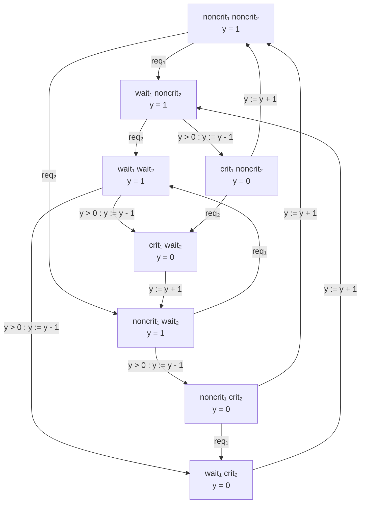
```mermaid
flowchart TB
    S0["noncrit₁  noncrit₂<br/>y = 1"]

    S1["wait₁  noncrit₂<br/>y = 1"]
    S2["noncrit₁  wait₂<br/>y = 1"]

    S3["crit₁  noncrit₂<br/>y = 0"]
    S4["wait₁  wait₂<br/>y = 1"]
    S5["noncrit₁  crit₂<br/>y = 0"]

    S6["crit₁  wait₂<br/>y = 0"]
    S7["wait₁  crit₂<br/>y = 0"]

    %% Independent request actions
    S0 -->|"req₁"| S1
    S0 -->|"req₂"| S2

    S1 -->|"req₂"| S4
    S2 -->|"req₁"| S4

    %% Enter critical section
    S1 -->|"y > 0 : y := y - 1"| S3
    S2 -->|"y > 0 : y := y - 1"| S5

    S4 -->|"y > 0 : y := y - 1"| S6
    S4 -->|"y > 0 : y := y - 1"| S7

    %% While one process is critical,
    %% the other may still issue its request
    S3 -->|"req₂"| S6
    S5 -->|"req₁"| S7

    %% Leave critical section
    S3 -->|"y := y + 1"| S0
    S6 -->|"y := y + 1"| S2

    S5 -->|"y := y + 1"| S0
    S7 -->|"y := y + 1"| S1
```

competition between the waiting processes:

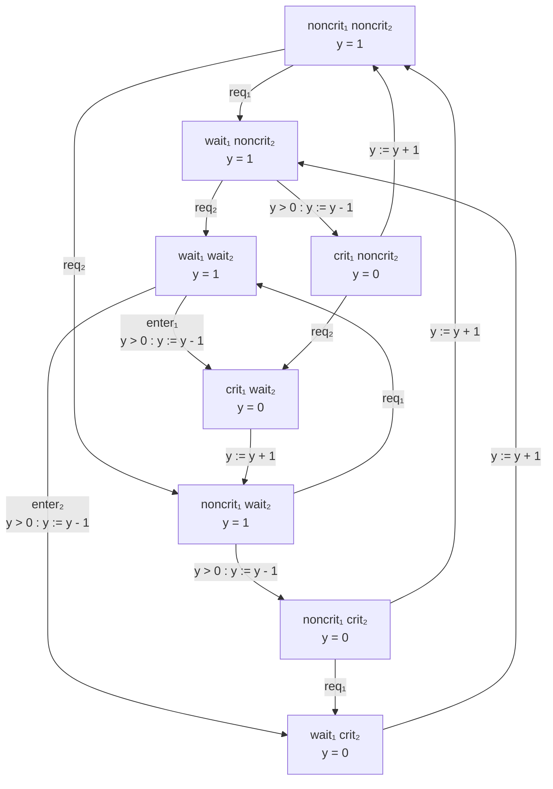
```mermaid
flowchart TB
    S0["noncrit₁  noncrit₂<br/>y = 1"]

    S1["wait₁  noncrit₂<br/>y = 1"]
    S2["noncrit₁  wait₂<br/>y = 1"]

    S3["crit₁  noncrit₂<br/>y = 0"]
    S4["wait₁  wait₂<br/>y = 1"]
    S5["noncrit₁  crit₂<br/>y = 0"]

    S6["crit₁  wait₂<br/>y = 0"]
    S7["wait₁  crit₂<br/>y = 0"]

    %% Requests
    S0 -->|"req₁"| S1
    S0 -->|"req₂"| S2

    S1 -->|"req₂"| S4
    S2 -->|"req₁"| S4

    %% Enter critical section
    S1 -->|"y > 0 : y := y - 1"| S3
    S2 -->|"y > 0 : y := y - 1"| S5

    %% Competition between the waiting processes
    S4 -->|"enter₁<br/>y > 0 : y := y - 1"| S6
    S4 -->|"enter₂<br/>y > 0 : y := y - 1"| S7

    %% Other process requests while one is critical
    S3 -->|"req₂"| S6
    S5 -->|"req₁"| S7

    %% Leave critical section
    S3 -->|"y := y + 1"| S0
    S6 -->|"y := y + 1"| S2

    S5 -->|"y := y + 1"| S0
    S7 -->|"y := y + 1"| S1
```

Peterson Algo:

```text
LOOP FOREVER
	noncritical actions;
	b_1:=1; x:=2;
	AWAIT x=1 or not(b_2) DO critical section OD
	b_1:=0
END LOOP
```

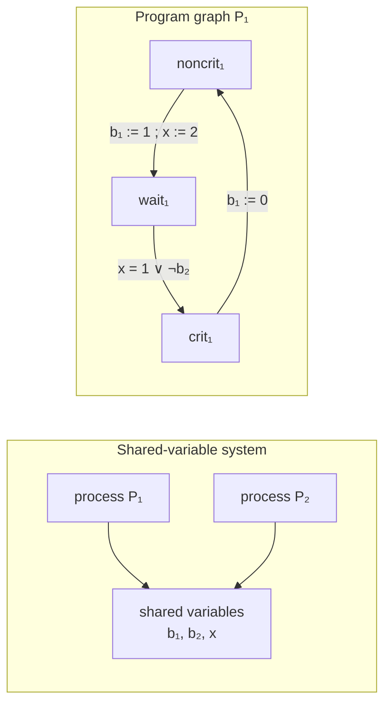
```mermaid
flowchart LR
    subgraph SYS["Shared-variable system"]
        direction TB
        P1["process P₁"]
        P2["process P₂"]
        SH["shared variables<br/>b₁, b₂, x"]

        P1 --> SH
        P2 --> SH
    end

    subgraph PG["Program graph P₁"]
        direction TB

        N["noncrit₁"]
        W["wait₁"]
        C["crit₁"]

        N -->|"b₁ := 1 ; x := 2"| W
        W -->|"x = 1 ∨ ¬b₂"| C
        C -->|"b₁ := 0"| N
    end
```

### Process $P_1$

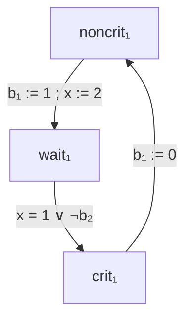
```mermaid
flowchart TB
    N1["noncrit₁"]
    W1["wait₁"]
    C1["crit₁"]

    N1 -->|"b₁ := 1 ; x := 2"| W1
    W1 -->|"x = 1 ∨ ¬b₂"| C1
    C1 -->|"b₁ := 0"| N1
```

### Process $P_2$

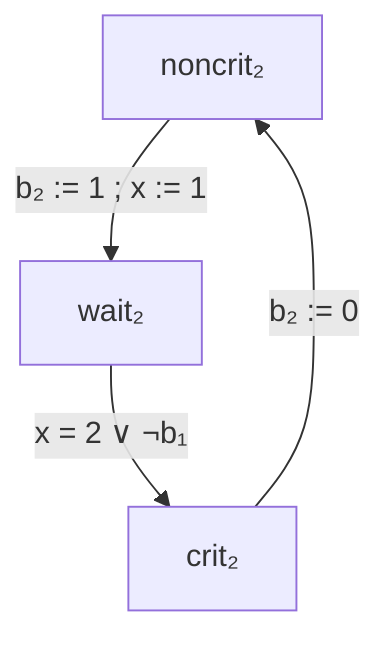
```mermaid
flowchart TB
    N2["noncrit₂"]
    W2["wait₂"]
    C2["crit₂"]

    N2 -->|"b₂ := 1 ; x := 1"| W2
    W2 -->|"x = 2 ∨ ¬b₁"| C2
    C2 -->|"b₂ := 0"| N2
```

### Program graph $P_1 ||| P_2$

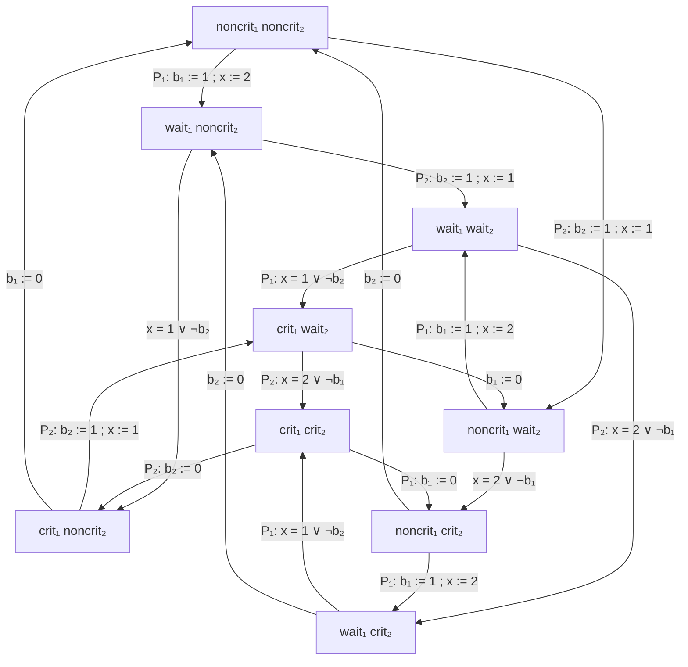
```mermaid
flowchart TB
    N1N2["noncrit₁  noncrit₂"]

    W1N2["wait₁  noncrit₂"]
    N1W2["noncrit₁  wait₂"]

    C1N2["crit₁  noncrit₂"]
    W1W2["wait₁  wait₂"]
    N1C2["noncrit₁  crit₂"]

    C1W2["crit₁  wait₂"]
    W1C2["wait₁  crit₂"]

    C1C2["crit₁  crit₂"]

    %% Initial interleaving
    N1N2 -->|"P₁: b₁ := 1 ; x := 2"| W1N2
    N1N2 -->|"P₂: b₂ := 1 ; x := 1"| N1W2

    %% Move the other process to wait
    W1N2 -->|"P₂: b₂ := 1 ; x := 1"| W1W2
    N1W2 -->|"P₁: b₁ := 1 ; x := 2"| W1W2

    %% Enter critical section
    W1N2 -->|"x = 1 ∨ ¬b₂"| C1N2
    N1W2 -->|"x = 2 ∨ ¬b₁"| N1C2

    W1W2 -->|"P₁: x = 1 ∨ ¬b₂"| C1W2
    W1W2 -->|"P₂: x = 2 ∨ ¬b₁"| W1C2

    %% Other process can request while one is critical
    C1N2 -->|"P₂: b₂ := 1 ; x := 1"| C1W2
    N1C2 -->|"P₁: b₁ := 1 ; x := 2"| W1C2

    %% Both critical in the syntactic product graph
    C1W2 -->|"P₂: x = 2 ∨ ¬b₁"| C1C2
    W1C2 -->|"P₁: x = 1 ∨ ¬b₂"| C1C2

    %% Leave critical section
    C1N2 -->|"b₁ := 0"| N1N2
    N1C2 -->|"b₂ := 0"| N1N2

    C1W2 -->|"b₁ := 0"| N1W2
    W1C2 -->|"b₂ := 0"| W1N2

    C1C2 -->|"P₁: b₁ := 0"| N1C2
    C1C2 -->|"P₂: b₂ := 0"| C1N2
```

```mermaid
flowchart TB
    I1(( ))
    I2(( ))

    A["noncrit₁  noncrit₂<br/>x = 2"]
    B["noncrit₁  noncrit₂<br/>x = 1"]

    C["wait₁  noncrit₂<br/>x = 2"]
    D["noncrit₁  wait₂<br/>x = 1"]

    E["crit₁  noncrit₂<br/>x = 2"]
    F["noncrit₁  crit₂<br/>x = 1"]

    G["wait₁  wait₂<br/>x = 1"]
    H["wait₁  wait₂<br/>x = 2"]

    J["crit₁  wait₂<br/>x = 1"]
    K["wait₁  crit₂<br/>x = 2"]

    %% Initial states
    I1 --> A
    I2 --> B

    %% From noncritical states
    A --> C
    A --> D

    B --> C
    B --> D

    %% Enter critical section directly
    C --> E
    D --> F

    %% Both processes waiting
    C --> G
    D --> H

    %% One process enters critical section
    G --> J
    H --> K

    %% Other process may request while one is critical
    E --> J
    F --> K

    %% Leaving critical section
    E --> A
    F --> B

    J --> D
    K --> C
```

value of $b_1$ is given by $wait_1 \lor crit_1$
value of $b_2$ is given by $wait_2 \lor crit_2$
\+ unrechable states

## (Incorrect) Variant of Peterson algorithm

### Process $P'_1$

```mermaid
flowchart TB
    N1["noncrit₁"]
    R1["request₁"]
    W1["wait₁"]
    C1["crit₁"]

    N1 -->|"x := 2"| R1
    R1 -->|"b₁ := 1"| W1
    W1 -->|"x = 1 ∨ ¬b₂"| C1
    C1 -->|"b₁ := 0"| N1
```

### Process $P'_2$

```mermaid
flowchart TB
    N2["noncrit₂"]
    R2["request₂"]
    W2["wait₂"]
    C2["crit₂"]

    N2 -->|"x := 1"| R2
    R2 -->|"b₂ := 1"| W2
    W2 -->|"x = 2 ∨ ¬b₁"| C2
    C2 -->|"b₂ := 0"| N2
```
### Possible execution

| $P'_1$      | $P'_2$      | $x$ | $b_1$      | $b_2$      |
| ----------- | ----------- | --: | ---------- | ---------- |
| $noncrit_1$ | $noncrit_2$ | $1$ | $\neg b_1$ | $\neg b_2$ |
| $noncrit_1$ | $request_2$ | $1$ | $\neg b_1$ | $\neg b_2$ |
| $request_1$ | $request_2$ | $2$ | $\neg b_1$ | $\neg b_2$ |
| $wait_1$    | $request_2$ | $2$ | $b_1$      | $\neg b_2$ |
| $crit_1$    | $request_2$ | $2$ | $b_1$      | $\neg b_2$ |
| $crit_1$    | $wait_2$    | $2$ | $b_1$      | $b_2$      |
| $crit_1$    | $crit_2$    | $2$ | $b_1$      | $b_2$      |

Operators for parallelism and communication:
- true concurrency: interleaving operator ||| for TS (no communication, no dependencies)
- communication via shared variables
	- description of subsystems by program graphs
	- interleaving ||| for program graphs
	- TS is obtained by "unfolding"
- synchronous message passing <- data abstract
	- operator $|||_{Syn}$ for TS
	- interleaving for independent actions
	- synchronization over actions in Syn
- channel systems: communication via shared variables + via channels

$Syn \subseteq Act_1\cap Act_2$ = set of synchronization actions

$T_1 ||_{Syn} T_2 = (S_1 \times S_2,Act_1 \cup Act_2, \to, \dots)$

for modeling the concurrent execution of $T_1$ and $T_2$ with synchronization over all actions in Syn

interleaving for all actions $\alpha \in Act_i \setminus Syn$:
$$ \frac{s_1 \xrightarrow{\alpha} s'_1}{<s_1,s_2> \xrightarrow{\alpha} <s'_1,s_2>}$$

$$ \frac{s_2 \xrightarrow{\alpha} s'_2}{<s_1,s_2> \xrightarrow{\alpha} <s_1,s'_2>}$$

handshaking (rendezvous) for all $\alpha \in Syn$:
$$\frac{s_1 \xrightarrow{\alpha}_1s'_1 \land s_2 \xrightarrow{\alpha}_2 s'_2}{<s_1,s_2> \xrightarrow{\alpha} <s'_1,s'_2>}$$

mutual exclusion by synchronous message passing using an arbiter:

```text
protocol for process P_i

LOOP FOREVER DO
	noncritical actions
	request
	critical section
	release
	noncritical actions
OD
```

Transistion system $T_i$:


```mermaid
flowchart TB
    N["noncritᵢ"]
    W["waitᵢ"]
    C["critᵢ"]

    N --> W
    W -->|"request"| C
    C -->|"release"| N
```

Arbiter:

select nondet a synchronization partner $T_1$ or $T_2$

```mermaid
flowchart TB
    U["unlock"]
    L["lock"]

    U -->|"request"| L
    L -->|"release"| U
```

$(T_1 ||| T_2) \; ||_{Syn} \; Arbiter$ where Syn = {request, release}

pure interleaving for TS + handshaking for actions request and release

```mermaid
flowchart TB
    S0["noncrit₁  noncrit₂<br/>unlock"]

    S1["wait₁  noncrit₂<br/>unlock"]
    S2["noncrit₁  wait₂<br/>unlock"]

    S3["crit₁  noncrit₂<br/>lock"]
    S4["wait₁  wait₂<br/>unlock"]
    S5["noncrit₁  crit₂<br/>lock"]

    S6["crit₁  wait₂<br/>lock"]
    S7["wait₁  crit₂<br/>lock"]

    %% Independent moves to waiting
    S0 --> S1
    S0 --> S2

    S1 --> S4
    S2 --> S4

    %% request synchronization with Arbiter
    S1 -->|"request"| S3
    S2 -->|"request"| S5

    S4 -->|"request"| S6
    S4 -->|"request"| S7

    %% The other process can move to wait while Arbiter is locked
    S3 --> S6
    S5 --> S7

    %% release synchronization with Arbiter
    S3 -->|"release"| S0
    S5 -->|"release"| S0

    S6 -->|"release"| S2
    S7 -->|"release"| S1
```

synchronization operator $||_{Syn}$ for three or more processes

### Synchronous parallel composition of multiple transition systems

Consider the transition systems:

$$
\mathcal{T}_1 = (S_1, Act_1, \rightarrow_1, \ldots)
$$

$$
\mathcal{T}_2 = (S_2, Act_2, \rightarrow_2, \ldots)
$$

$$
\mathcal{T}_3 = (S_3, Act_3, \rightarrow_3, \ldots)
$$

$$
\mathcal{T}_4 = (S_4, Act_4, \rightarrow_4, \ldots)
$$

$$
\vdots
$$

with:

$$
Syn \subseteq Act_1 \cup Act_2 \cup Act_3 \cup Act_4 \cup \cdots
$$

The synchronous composition of multiple transition systems is defined as:

$$
\mathcal{T}_1
\parallel_{Syn}
\mathcal{T}_2
\parallel_{Syn}
\mathcal{T}_3
\parallel_{Syn}
\mathcal{T}_4
\parallel_{Syn}
\cdots
$$

with:

$$
\mathcal{T}_1
\parallel_{Syn}
\mathcal{T}_2
\parallel_{Syn}
\mathcal{T}_3
\parallel_{Syn}
\mathcal{T}_4
\parallel_{Syn}
\cdots
\overset{\mathrm{def}}{=}
$$

$$
\left(
\left(
\left(
\mathcal{T}_1
\parallel_{Syn}
\mathcal{T}_2
\right)
\parallel_{Syn}
\mathcal{T}_3
\right)
\parallel_{Syn}
\mathcal{T}_4
\right)
\parallel_{Syn}
\cdots
$$

For example:

$$
\mathcal{T}_1
\parallel_{Syn}
\mathcal{T}_2
\overset{\mathrm{def}}{=}
\mathcal{T}_1
\parallel_H
\mathcal{T}_2
$$

where:

$$
\boxed{
H = Syn \cap Act_1 \cap Act_2
}
$$
### Parallel composition of multiple transition systems

Consider the transition systems:

$$
\mathcal{T}_1 = (S_1, Act_1, \rightarrow_1, \ldots)
$$

$$
\mathcal{T}_2 = (S_2, Act_2, \rightarrow_2, \ldots)
$$

$$
\mathcal{T}_3 = (S_3, Act_3, \rightarrow_3, \ldots)
$$

$$
\mathcal{T}_4 = (S_4, Act_4, \rightarrow_4, \ldots)
$$

$$
\vdots
$$

with the condition:

$$
Act_i \cap Act_j \cap Act_k = \emptyset
$$

whenever $i$, $j$, and $k$ are pairwise distinct.

In other words, no action is shared by three different transition systems.

---

The parallel composition is defined as:

$$
\mathcal{T}_1
\parallel
\mathcal{T}_2
\parallel
\mathcal{T}_3
\parallel
\mathcal{T}_4
\parallel
\cdots
\overset{\mathrm{def}}{=}
$$

$$
\left(
\left(
\left(
\mathcal{T}_1
\parallel_{Syn_{1,2}}
\mathcal{T}_2
\right)
\parallel_{Syn_{1,2,3}}
\mathcal{T}_3
\right)
\parallel_{Syn_{1,2,3,4}}
\mathcal{T}_4
\right)
\parallel
\cdots
$$

where:

$$
Syn_{1,2}
=
Act_1 \cap Act_2
$$

$$
Syn_{1,2,3}
=
(Act_1 \cup Act_2)\cap Act_3
$$

$$
Syn_{1,2,3,4}
=
(Act_1 \cup Act_2 \cup Act_3)\cap Act_4
$$

and, in general:

$$
\boxed{
Syn_{1,\ldots,n}
=
\left(
\bigcup_{i=1}^{n-1} Act_i
\right)
\cap
Act_n
}
$$
#### Scanner

```mermaid
flowchart TB
    S0(("0"))
    S1(("1"))

    S0 -->|"scan"| S1
    S1 -->|"code"| S0
```

#### Booking Program

```mermaid
flowchart TB
    B0(("0"))
    B1(("1"))

    B0 -->|"code"| B1
    B1 -->|"price"| B0
```

#### Printer

```mermaid
flowchart TB
    P0(("0"))
    P1(("1"))

    P0 -->|"price"| P1
    P1 -->|"print"| P0
```

---

### $Scanner \parallel BP \parallel Printer$

Each global state is represented by:

$$
s_1s_2s_3
$$

where:

- $s_1$ = state of the **Scanner**;
- $s_2$ = state of the **Booking Program**;
- $s_3$ = state of the **Printer**.

```mermaid
flowchart TB
    I(( ))

    Q000["000"]
    Q100["100"]
    Q010["010"]
    Q001["001"]

    Q110["110"]
    Q101["101"]

    Q011["011"]
    Q111["111"]

    %% Initial state
    I --> Q000

    %% scan
    Q000 -->|"scan"| Q100
    Q010 -->|"scan"| Q110
    Q001 -->|"scan"| Q101
    Q011 -->|"scan"| Q111

    %% code / transfer
    Q100 -->|"code"| Q010
    Q101 -->|"transfer"| Q011

    %% price
    Q010 -->|"price"| Q001
    Q110 -->|"price"| Q101

    %% print
    Q001 -->|"print"| Q000
    Q101 -->|"print"| Q100
    Q011 -->|"print"| Q010
    Q111 -->|"print"| Q110
```

# 18/9

## 1. Channel Systems

Un **Channel System (CS)** permette di rappresentare sistemi paralleli dipendenti dai dati in cui i processi possono comunicare mediante:

- **shared variables**;
- **synchronous message passing**;
- **asynchronous message passing**.

Le ultime due forme utilizzano dei **channels**.

```mermaid
flowchart LR
    P1["P1"]
    P2["P2"]
    P3["P3"]
    P4["P4"]

    SV["shared variables"]

    P1 ---|"c1"| P2
    P1 ---|"c3"| P3
    P2 ---|"c2"| P3

    P1 --- SV
    P2 --- SV
    P4 --- SV
```

I channel possono essere di due tipi:

| Tipo | Capacità | Comunicazione |
|---|---:|---|
| synchronous | $0$ | sender e receiver devono sincronizzarsi |
| FIFO | $\geq 1$ | comunicazione asincrona |

La **capacity** di un FIFO channel indica il numero di celle disponibili nel buffer.

Quindi:

$$
cap(c)=0
\quad\Longrightarrow\quad
\text{synchronous channel}
$$

mentre:

$$
cap(c)\geq1
\quad\Longrightarrow\quad
\text{FIFO / asynchronous channel}
$$

---

## 2. Program Graphs e Channel Systems

I processi:

$$
P_1,\ldots,P_n
$$

sono rappresentati tramite **program graphs**.

Un processo può contenere normali transizioni condizionali:

$$
\ell_i
\xrightarrow{g:\alpha}
\ell_i'
$$

dove:

- $g$ è una guardia;
- $\alpha$ è un'azione.

Inoltre vengono introdotte delle **communication actions**.

## Sending

$$
\ell_i
\xrightarrow{c!v}
\ell_i'
$$

significa:

> invia il valore $v$ attraverso il channel $c$.

## Receiving

$$
\ell_i
\xrightarrow{c?x}
\ell_i'
$$

significa:

> ricevi un valore dal channel $c$ e assegnalo alla variabile $x$.

Possiamo quindi schematizzare:

```mermaid
flowchart LR
    A["location ℓ"]
    B["location ℓ'"]

    A -->|"c!v"| B
```

e:

```mermaid
flowchart LR
    A["location ℓ"]
    B["location ℓ'"]

    A -->|"c?x"| B
```

---

## 3. Typed Variables

Una variabile tipata $x$ possiede un dominio:

$$
Dom(x)
$$

Una **variable evaluation** per un insieme di variabili $Var$ è una funzione:

$$
\eta : Var \rightarrow Values
$$

che deve essere type-consistent, cioè:

$$
\eta(x)\in Dom(x)
$$

per ogni:

$$
x\in Var.
$$

L'insieme di tutte le valutazioni compatibili viene indicato con:

$$
Eval(Var)
$$

---

## 4. Typed Channels

Un channel tipato $c$ possiede:

- una capacità $cap(c)$;
- un dominio $Dom(c)$.

Formalmente:

$$
cap(c)\in \mathbb{N}\cup\{\infty\}
$$

e:

$$
Dom(c)
$$

definisce quali valori possono essere trasmessi sul channel.

---

## 5. Channel Evaluation

Per un insieme di channel $Chan$, una **channel evaluation** è una funzione:

$$
\xi : Chan \rightarrow Values^*
$$

Per ogni channel $c$:

$$
\xi(c)
$$

è una parola composta da elementi appartenenti a $Dom(c)$.

Inoltre:

$$
|\xi(c)|\leq cap(c)
$$

Per esempio:

$$
\xi(c)=v_1v_2v_3
$$

significa che il FIFO channel $c$ contiene:

$$
v_1,\ v_2,\ v_3
$$

nell'ordine indicato.

Possiamo interpretarlo come:

```text
front                            back
  ↓                                ↓
+----+----+----+----+----+
| v1 | v2 | v3 |    |    |
+----+----+----+----+----+
```

---

## 6. Definizione di Channel System

Un channel system ha la forma:

$$
[P_1 \mid P_2 \mid \ldots \mid P_n]
$$

dove ciascun $P_i$ è un program graph.

Il sistema è definito rispetto alla coppia:

$$
(Var,Chan)
$$

dove:

- $Var$ = insieme delle typed variables;
- $Chan$ = insieme dei typed channels.

Ogni program graph ha forma:

$$
P_i =
(Loc_i,Act_i,Effect_i,\rightarrow_i,Loc_{0,i},g_0)
$$

con transizioni del tipo:

$$
\ell
\xrightarrow{g:\alpha}_i
\ell'
$$

oppure azioni di comunicazione:

$$
\ell
\xrightarrow{c!v}_i
\ell'
$$

$$
\ell
\xrightarrow{c?x}_i
\ell'
$$

---

## 7. Comunicazione asincrona

Consideriamo un channel:

$$
c
$$

con:

$$
cap(c)\geq1.
$$

La comunicazione è **asynchronous**.

## Sending

L'azione:

$$
c!v
$$

è abilitata se:

$$
c\text{ non è pieno}.
$$

L'effetto è:

$$
add(c,v)
$$

cioè $v$ viene aggiunto in fondo alla coda.

Esempio:

$$
v_1v_2\ldots v_r
\xrightarrow{c!v}
v_1v_2\ldots v_rv
$$

## Receiving

L'azione:

$$
c?x
$$

è abilitata se il channel non è vuoto.

Se:

$$
v=front(c)
$$

allora vengono eseguiti:

$$
x:=v
$$

e:

$$
remove(c)
$$

Quindi:

$$
vv_2\ldots v_r
\xrightarrow{c?x}
v_2\ldots v_r
$$

con:

$$
x=v.
$$

## Riassunto

| Action | Enabled if | Effect |
|---|---|---|
| $c!v$ | channel $c$ not full | $add(c,v)$ |
| $c?x$ | channel $c$ not empty | $x:=front(c)$, $remove(c)$ |

---

## 8. Comunicazione sincrona

Se:

$$
cap(c)=0
$$

non esiste un buffer.

Le operazioni:

$$
c!v
$$

e:

$$
c?x
$$

devono quindi essere eseguite **contemporaneamente**.

L'effetto della comunicazione è:

$$
x:=v.
$$

```mermaid
sequenceDiagram
    participant S as Sender
    participant R as Receiver

    S->>R: c!v / c?x
    Note over S,R: synchronous communication
    Note over R: x := v
```

Non esiste quindi uno stato intermedio nel quale il messaggio è memorizzato nel channel.

---

## 9. Asynchronous vs Synchronous Communication

## Asynchronous

```mermaid
sequenceDiagram
    participant S as Sender
    participant C as FIFO channel
    participant R as Receiver

    S->>C: c!v
    Note over C: store v

    C->>R: c?x
    Note over R: x := v
```

Sender e receiver possono agire in istanti differenti.

## Synchronous

```mermaid
sequenceDiagram
    participant S as Sender
    participant R as Receiver

    S->>R: synchronize on c
    Note over S,R: c!v and c?x occur together
```

Il sender non può eseguire l'azione se nessun receiver corrispondente è pronto.

---

## 10. Transition-System Semantics dei Channel Systems

A un channel system:

$$
C=[P_1|\ldots|P_n]
$$

associamo un transition system:

$$
\mathcal{T}_C.
$$

```mermaid
flowchart TB
    CS["Channel system<br/>C = [P1 | ... | Pn]"]
    TS["Transition system<br/>T_C"]

    CS --> TS
```

---

## 11. Stati di $\mathcal{T}_C$

Gli stati hanno forma:

$$
\langle
\ell_1,\ldots,\ell_n,\eta,\xi
\rangle
$$

dove:

- $\ell_i$ è la location corrente del processo $P_i$;
- $\eta$ è la valutazione delle variabili;
- $\xi$ è la valutazione dei channel.

Quindi uno stato contiene **tre tipi di informazioni**:

```mermaid
flowchart LR
    S["State"]

    L["Control locations<br/>ℓ1,...,ℓn"]
    V["Variable evaluation<br/>η"]
    C["Channel evaluation<br/>ξ"]

    S --> L
    S --> V
    S --> C
```

Formalmente:

$$
\ell_i\in Loc_i
$$

$$
\eta\in Eval(Var)
$$

$$
\xi\in Eval(Chan).
$$

---

## 12. Variable Evaluation

Formalmente:

$$
\eta :
Var
\rightarrow
\coprod_{x\in Var}Dom(x)
$$

con:

$$
\eta(x)\in Dom(x).
$$

L'idea importante è che $\eta$ rappresenta **lo stato corrente di tutte le variabili condivise**.

---

## 13. Channel Evaluation

Analogamente:

$$
\xi :
Chan
\rightarrow
\coprod_{c\in Chan}Dom(c)^*
$$

con:

$$
\xi(c)\in Dom(c)^*
$$

e:

$$
|\xi(c)|\leq cap(c).
$$

Per la rappresentazione tramite $\xi$ sono rilevanti soprattutto i channel con:

$$
cap(c)\geq1
$$

perché i channel sincroni non contengono messaggi memorizzati.

---

## 14. Transition Relation

La transition relation:

$$
\rightarrow
$$

di un Channel System è definita mediante **SOS rules** (*Structural Operational Semantics*).

Le regole appartengono a due categorie:

1. interleaving delle normali azioni;
2. message passing attraverso channel.

---

## 15. SOS Rule — Interleaving

Supponiamo che il processo $P_i$ abbia una transizione:

$$
\ell_i
\xrightarrow{g:\alpha}_i
\ell_i'
$$

e che:

$$
\eta\models g.
$$

Allora il Channel System può effettuare:

$$
\frac{
\ell_i\xrightarrow{g:\alpha}_i\ell_i'
\quad\land\quad
\eta\models g
}{
\langle
\ell_1,\ldots,\ell_i,\ldots,\ell_n,\eta,\xi
\rangle
\xrightarrow{\alpha}
\langle
\ell_1,\ldots,\ell_i',\ldots,\ell_n,
Effect_i(\alpha,\eta),\xi
\rangle
}
$$

Da notare che:

$$
\xi'=\xi.
$$

Una normale azione di un processo **non modifica i channel**.

---

## 16. SOS Rules — Asynchronous Message Passing

Consideriamo:

$$
cap(c)\geq1.
$$

### Receiving

Supponiamo:

$$
\ell_i
\xrightarrow{c?x}_i
\ell_i'
$$

e:

$$
\xi(c)=v_1v_2\ldots v_k
$$

con:

$$
k\geq1.
$$

Allora:

$$
\langle
\ell_1,\ldots,\ell_i,\ldots,\ell_n,\eta,\xi
\rangle
\xrightarrow{\tau}
\langle
\ell_1,\ldots,\ell_i',\ldots,\ell_n,\eta',\xi'
\rangle
$$

dove:

$$
\eta'=\eta[x:=v_1].
$$

L'update:

$$
\eta[x:=v_1]
$$

è definito come:

$$
\eta[x:=v_1](y)=
\begin{cases}
\eta(y) & y\neq x\\
v_1 & y=x
\end{cases}
$$

Il channel diventa:

$$
\xi'(c)=v_2\ldots v_k.
$$

---

## 17. Internal Action $\tau$

Le operazioni di comunicazione vengono rappresentate nel transition system mediante:

$$
\tau
$$

che rappresenta una **internal action**.

Quindi:

$$
\xrightarrow{\tau}
$$

significa che il transition system evolve senza esporre l'azione di comunicazione come azione osservabile esternamente.

---

## 18. SOS Rule — Synchronous Message Passing

Consideriamo due processi differenti:

$$
i\neq j.
$$

Supponiamo:

$$
\ell_i
\xrightarrow{c?x}_i
\ell_i'
$$

e contemporaneamente:

$$
\ell_j
\xrightarrow{c!v}_j
\ell_j'.
$$

Allora:

$$
\frac{
\ell_i\xrightarrow{c?x}_i\ell_i'
\quad\land\quad
\ell_j\xrightarrow{c!v}_j\ell_j'
\quad\land\quad
i\neq j
}{
\langle
\ell_1,\ldots,\ell_i,\ldots,\ell_j,\ldots,\ell_n,
\eta,\xi
\rangle
\xrightarrow{\tau}
\langle
\ell_1,\ldots,\ell_i',\ldots,\ell_j',\ldots,\ell_n,
\eta[x:=v],\xi
\rangle
}
$$

Il punto fondamentale è che **entrambi i processi cambiano location nella stessa transizione**.

Inoltre:

$$
\xi'=\xi
$$

perché un synchronous channel non possiede buffer.

---

## 19. Numero di stati

Consideriamo:

- $2$ processi con $2$ location ciascuno;
- $2$ Boolean variables;
- $2$ channel;
- ogni channel ha capacità $10$;
- ogni channel trasporta valori Boolean.

Per un singolo channel, le possibili configurazioni sono:

$$
1+2+2^2+\ldots+2^{10}
$$

quindi:

$$
\sum_{i=0}^{10}2^i
=
2^{11}-1.
$$

Il numero complessivo di stati è quindi:

$$
2\cdot2
\cdot2\cdot2
\cdot
(2^{11}-1)
\cdot
(2^{11}-1).
$$

Equivalentemente:

$$
2^4(2^{11}-1)^2.
$$

Questo valore è:

$$
>2^{24}.
$$

Se almeno un channel è **unbounded**:

$$
cap(c)=\infty
$$

allora il numero di stati può diventare:

$$
\infty.
$$

---

## 20. Numero di configurazioni di un channel

Se un channel $c$ ha:

$$
|Dom(c)|=d
$$

e capacità:

$$
cap(c)=k,
$$

le possibili sequenze contenute nel buffer sono:

$$
\epsilon
$$

oppure una sequenza di lunghezza $1,2,\ldots,k$.

Da ciò segue:

$$
N_c
=
\sum_{i=0}^{k}d^i.
$$

Per esempio, con Boolean values:

$$
d=2
$$

e:

$$
k=10,
$$

otteniamo:

$$
N_c=
\sum_{i=0}^{10}2^i
=
2^{11}-1.
$$

---

## 21. Alternating Bit Protocol

L'**Alternating Bit Protocol (ABP)** viene utilizzato per trasmettere messaggi in maniera affidabile sopra un channel che può perdere messaggi.

I componenti principali sono:

- **Sender**;
- **Timer**;
- **Receiver**.

Il sender associa al messaggio un bit:

$$
y\in\{0,1\}.
$$

Il receiver restituisce un acknowledgement contenente il bit ricevuto:

$$
x.
$$

### Struttura generale

```mermaid
flowchart LR
    S["Sender"]
    R["Receiver"]
    T["Timer"]

    S -->|"message + bit y<br/>channel c"| R
    R -->|"ack bit x<br/>channel d"| S

    S <-->|"timer on/off<br/>timeout"| T
```

Il channel dati $c$ può essere **unreliable**.

Il channel degli acknowledgement $d$ può anch'esso essere unreliable nelle versioni più generali.

---

## 22. Idea dell'Alternating Bit

Il sender alterna tra:

$$
y=0
$$

e:

$$
y=1.
$$

Sequenza concettuale:

```mermaid
flowchart LR
    A["send message 0"]
    B["receive ACK 0"]
    C["send message 1"]
    D["receive ACK 1"]
    E["send message 0"]

    A --> B --> C --> D --> E
```

Dopo un acknowledgement corretto:

$$
y:=\neg y.
$$

Quindi:

$$
0\rightarrow1\rightarrow0\rightarrow1\rightarrow\cdots
$$

---

## 23. Protocollo del Sender

```text
LOOP FOREVER

(1) send message + bit y
    activate timer

(2) AWAIT timeout or acknowledgement x DO

    IF timeout THEN
        goto (1)

    ELSE
        IF x = y THEN
            turn off timer
            y := not y
        ELSE
            ignore x
        FI
    FI
OD
```

Il timeout permette al sender di capire che:

- il messaggio potrebbe essere stato perso;
- oppure l'acknowledgement potrebbe essere stato perso.

In entrambi i casi il messaggio viene ritrasmesso.

---

## 24. Perché serve il bit?

Immaginiamo che il sender trasmetta:

$$
message(0)
$$

ma non riceva l'acknowledgement.

Il sender ritrasmette:

$$
message(0).
$$

Il receiver deve capire che il secondo messaggio è una **duplicazione**, non un nuovo messaggio.

Il bit alternato permette di distinguere:

$$
\text{new message}
$$

da:

$$
\text{duplicate message}.
$$

---

## 25. Sender + Timer + Receiver

Il protocollo viene modellato come channel system:

$$
[Sender \mid Timer \mid Receiver].
$$

Le comunicazioni sono di tipi differenti.

Tra **Sender** e **Timer**:

$$
\text{synchronous communication}
$$

tramite channel come $e$ e $f$.

Tra **Sender** e **Receiver**:

$$
\text{asynchronous communication}
$$

tramite i channel:

$$
c,\ d.
$$

```mermaid
flowchart LR
    S["Sender"]
    T["Timer"]
    R["Receiver"]

    S <-->|"e, f<br/>synchronous"| T

    S -->|"c<br/>message"| R
    R -->|"d<br/>ack"| S
```

---

## 26. Program Graph del Sender

Il sender alterna due famiglie di stati, una per il bit $0$ e una per il bit $1$.

```mermaid
flowchart TB
    G0["Generate(0)"]
    S0["Send(0)"]
    T0["Timer on(0)"]
    W0["Wait(0)"]
    C0["Check ACK(0)"]

    G1["Generate(1)"]
    S1["Send(1)"]
    T1["Timer on(1)"]
    W1["Wait(1)"]
    C1["Check ACK(1)"]

    G0 --> S0
    S0 --> T0
    T0 --> W0

    W0 -->|"timeout"| S0
    W0 -->|"ack"| C0
    C0 -->|"correct ACK"| G1

    G1 --> S1
    S1 --> T1
    T1 --> W1

    W1 -->|"timeout"| S1
    W1 -->|"ack"| C1
    C1 -->|"correct ACK"| G0
```

Gli acknowledgement errati vengono ignorati.

---

## 27. Receiver

Anche il receiver mantiene il bit che si aspetta.

```mermaid
flowchart TB
    W0["Wait(0)"]
    P0["Process(0)"]
    A0["Acknowledge(0)"]

    W1["Wait(1)"]
    P1["Process(1)"]
    A1["Acknowledge(1)"]

    W0 -->|"receive 0"| P0
    P0 --> A0
    A0 --> W1

    W1 -->|"receive 1"| P1
    P1 --> A1
    A1 --> W0
```

Se riceve nuovamente il bit precedente, riconosce il messaggio come duplicato e non lo processa nuovamente.

---

## 28. Perdita di un messaggio

```mermaid
sequenceDiagram
    participant S as Sender
    participant R as Receiver

    S--xR: message(0)
    Note over S: timeout

    S->>R: message(0)
    R->>S: ACK(0)

    Note over S: switch bit to 1
```

Il protocollo continua a funzionare perché il timeout causa una ritrasmissione.

---

## 29. Perdita dell'ACK

```mermaid
sequenceDiagram
    participant S as Sender
    participant R as Receiver

    S->>R: message(0)
    R--xS: ACK(0)

    Note over S: timeout

    S->>R: message(0)
    Note over R: duplicate message
    R->>S: ACK(0)

    Note over S: switch bit to 1
```

Il receiver riconosce la duplicazione grazie all'alternating bit.

---

## 30. Dimensione del TS dell'ABP

Nelle slide vengono considerate:

- $10$ location del sender;
- $2$ location del timer;
- $6$ location del receiver.

Quindi, ignorando inizialmente i channel:

$$
10\cdot2\cdot6.
$$

A questo bisogna moltiplicare il numero delle channel evaluations:

$$
10\cdot2\cdot6
\cdot
\#\text{channel evaluations}.
$$

Per FIFO di capacità $10$, lo spazio degli stati supera:

$$
10^8.
$$

Questo esempio introduce direttamente il problema della **state explosion**.

---

## 31. Varianti dei Channel Systems

### Conditional communication actions

È possibile avere:

$$
\ell
\xrightarrow{g:c?x}
\ell'.
$$

La comunicazione può essere eseguita solo se la condizione $g$ è vera.

### Generalized sending

Invece di:

$$
c!v
$$

si può utilizzare:

$$
c!expr.
$$

Per esempio:

$$
c!(2x+7).
$$

Il valore dell'espressione viene calcolato prima di essere inviato.

### Communication as condition

Si possono anche avere forme come:

$$
\ell
\xrightarrow{c?x:\alpha}
\ell'.
$$

Questo permette rappresentazioni più compatte del transition system.

---

## 32. Open e Closed Channel Systems

### Open Channel System

$$
P_1|\ldots|P_n
$$

### Closed Channel System

$$
[P_1|\ldots|P_n].
$$

Un sistema **open** può interagire con componenti esterni.

Un sistema **closed** viene invece considerato come sistema completo.

---

## 33. Riassunto degli operatori paralleli

### Pure interleaving

$$
T_1 ||| T_2
$$

Caratteristiche:

- concorrenza;
- nessuna comunicazione;
- le azioni vengono interleaved.

```mermaid
flowchart LR
    T1["T1"]
    OP["|||"]
    T2["T2"]

    T1 --- OP
    OP --- T2
```

---

## 34. Synchronous Message Passing

Forma generale:

$$
T_1 \parallel_{Syn} T_2.
$$

Caratteristiche:

- interleaving delle azioni indipendenti;
- sincronizzazione per le azioni appartenenti a $Syn$.

---

## 35. Interleaving di Program Graphs

$$
P_1 ||| P_2
$$

permette:

- interleaving;
- comunicazione tramite **shared variables**.

---

## 36. Channel Systems

$$
[P_1|\ldots|P_n]
$$

permettono contemporaneamente:

- interleaving;
- shared variables;
- synchronous message passing;
- asynchronous message passing.

```mermaid
flowchart TB
    I["Pure interleaving"]
    PG["Program graphs"]
    CS["Channel systems"]

    I -->|"add shared variables"| PG
    PG -->|"add channels"| CS
```

---

## 37. Synchronous Product

Un altro operatore introdotto è il **synchronous product**:

$$
T_1\otimes T_2.
$$

A differenza dell'interleaving, qui i processi sono **completamente sincronizzati**.

Non abbiamo:

$$
\alpha
\quad\text{oppure}\quad
\beta
$$

ma una sola transizione congiunta:

$$
\alpha * \beta.
$$

---

## 38. Definizione del Synchronous Product

Consideriamo:

$$
T_1=(S_1,Act_1,\rightarrow_1,\ldots)
$$

e:

$$
T_2=(S_2,Act_2,\rightarrow_2,\ldots).
$$

Il synchronous product è:

$$
T_1\otimes T_2
=
(S_1\times S_2,Act,\rightarrow,\ldots).
$$

Lo state space è quindi:

$$
S_1\times S_2.
$$

Le azioni vengono combinate mediante una funzione:

$$
Act_1\times Act_2
\rightarrow Act
$$

$$
(\alpha,\beta)
\mapsto
\alpha*\beta.
$$

---

## 39. Regola del Synchronous Product

Se:

$$
s_1\xrightarrow{\alpha}_1s_1'
$$

e:

$$
s_2\xrightarrow{\beta}_2s_2',
$$

allora:

$$
\frac{
s_1\xrightarrow{\alpha}_1s_1'
\quad\land\quad
s_2\xrightarrow{\beta}_2s_2'
}{
\langle s_1,s_2\rangle
\xrightarrow{\alpha*\beta}
\langle s_1',s_2'\rangle
}.
$$

Quindi entrambi i sistemi devono effettuare una transizione.

---

## 40. Interleaving vs Synchronous Product

### Interleaving

Da:

$$
(s_1,s_2)
$$

può evolvere solo il primo:

$$
(s_1,s_2)
\rightarrow
(s_1',s_2)
$$

oppure solo il secondo:

$$
(s_1,s_2)
\rightarrow
(s_1,s_2').
$$

### Synchronous Product

I due componenti evolvono insieme:

$$
(s_1,s_2)
\rightarrow
(s_1',s_2').
$$

```mermaid
flowchart LR
    A["(s1,s2)"]
    B["(s1',s2')"]

    A -->|"α * β"| B
```

---

## 41. Synchronous Product dei circuiti

Il synchronous product viene utilizzato anche per comporre **sequential circuits**.

Supponiamo due circuiti:

$$
C_1
$$

e:

$$
C_2.
$$

La composizione:

$$
C_1\otimes C_2
$$

possiede congiuntamente:

- input dei due circuiti;
- output dei due circuiti;
- registri interni dei due circuiti.

```mermaid
flowchart LR
    I1["inputs C1"]
    C1["Circuit C1"]
    O1["outputs C1"]

    I2["inputs C2"]
    C2["Circuit C2"]
    O2["outputs C2"]

    I1 --> C1 --> O1
    I2 --> C2 --> O2
```

Il transition system del circuito composto è ottenuto mediante:

$$
T_1\otimes T_2.
$$

---

## 42. State Explosion Problem

Uno dei problemi fondamentali del model checking è la **state explosion**.

Il transition system di un sistema reattivo può diventare enormemente grande.

Può addirittura essere infinito.

### Sistemi con domini infiniti

Per esempio:

$$
x\in\mathbb N.
$$

Se una variabile può assumere infiniti valori, il TS può avere infiniti stati.

### Strutture dati infinite

Lo stesso problema compare con strutture non limitate come:

- stack;
- queue;
- list.

---

## 43. Crescita esponenziale

Anche quando il TS è finito, può crescere esponenzialmente rispetto al numero di componenti.

Per:

$$
T_1,\ldots,T_n
$$

lo spazio degli stati della composizione può essere:

$$
S_1\times S_2\times\ldots\times S_n.
$$

Quindi:

$$
|S|
=
|S_1|
|S_2|
\cdots
|S_n|.
$$

Se ogni componente possiede $m$ stati:

$$
|S|=m^n.
$$

La crescita è dunque esponenziale nel numero dei componenti.

---

## 44. State Explosion nei Channel Systems

Per un channel system, lo stato contiene:

$$
\langle
\ell_1,\ldots,\ell_n,\eta,\xi
\rangle.
$$

La dimensione dipende quindi da:

1. numero delle location;
2. domini delle variabili;
3. domini dei channel;
4. capacità dei channel.

Una forma concettuale della dimensione è:

$$
|S|
=
\left(
\prod_{i=1}^{n}|Loc_i|
\right)
\cdot
\left(
\prod_{x\in Var}|Dom(x)|
\right)
\cdot
\left(
\prod_{c\in Chan}
\#Eval(c)
\right).
$$

Con channel FIFO finiti:

$$
\#Eval(c)
=
\sum_{j=0}^{cap(c)}
|Dom(c)|^j.
$$

Pertanto:

$$
|S|
=
\left(
\prod_{i=1}^{n}|Loc_i|
\right)
\left(
\prod_{x\in Var}|Dom(x)|
\right)
\left(
\prod_{c\in Chan}
\sum_{j=0}^{cap(c)}
|Dom(c)|^j
\right).
$$

---

## 45. Perché la State Explosion è importante

Anche sistemi apparentemente piccoli possono generare transition systems giganteschi.

```mermaid
flowchart LR
    S["Small syntactic<br/>system"]
    T["Huge transition<br/>system"]

    S -->|"semantic expansion"| T
```

Il problema nasce perché il transition system deve rappresentare **tutte le possibili combinazioni** di:

- control locations;
- variable evaluations;
- channel contents;
- interleavings;
- comunicazioni.

---

## 46. Model Checking

```mermaid
flowchart TB
    SYS["system<br/>P1 || ... || Pn"]
    REQ["requirements"]

    TS["transition system T"]
    SPEC["specification spec"]

    MC["model checker<br/>does T satisfy spec?"]

    YES["yes"]
    NO["no + error indication"]

    SYS --> TS
    REQ --> SPEC

    TS --> MC
    SPEC --> MC

    MC --> YES
    MC --> NO
```

Le slide evidenziano che il sistema viene inizialmente descritto sintatticamente come:

$$
P_1,\ldots,P_n.
$$

Attraverso le **SOS rules** viene generato il transition system:

$$
\mathcal T.
$$

La specifica dei requisiti produce invece:

$$
spec.
$$

Infine il model checker verifica:

$$
\boxed{\mathcal T\models spec}
$$

---

## 47. Catena completa

```mermaid
flowchart TB
    PG["Program graphs<br/>P1,...,Pn"]

    CS["Channel system<br/>[P1 | ... | Pn]"]

    SOS["SOS rules"]

    TS["Transition system<br/>T_C"]

    SPEC["Specification<br/>spec"]

    MC["Model checker"]

    RESULT["satisfied / counterexample"]

    PG --> CS
    CS --> SOS
    SOS --> TS

    TS --> MC
    SPEC --> MC

    MC --> RESULT
```

In formula:

$$
[P_1|\ldots|P_n]
\overset{\text{SOS semantics}}{\longrightarrow}
\mathcal T_C
$$

e successivamente:

$$
\mathcal T_C\models spec\ ?
$$

---

## 48. Concetti fondamentali da ricordare

1. **Channel System**

   $$
   [P_1|\ldots|P_n]
   $$

2. **Synchronous channel**

   $$
   cap(c)=0
   $$

3. **Asynchronous FIFO channel**

   $$
   cap(c)\geq1
   $$

4. **Sending**

   $$
   c!v
   $$

5. **Receiving**

   $$
   c?x
   $$

6. **State di un Channel System**

   $$
   \langle
   \ell_1,\ldots,\ell_n,\eta,\xi
   \rangle
   $$

7. **Variable evaluation**

   $$
   \eta\in Eval(Var)
   $$

8. **Channel evaluation**

   $$
   \xi\in Eval(Chan)
   $$

9. **Asynchronous communication**

   sender e receiver agiscono separatamente attraverso un FIFO.

10. **Synchronous communication**

   $$
   c!v
   \quad\text{e}\quad
   c?x
   $$

   devono sincronizzarsi.

11. **SOS semantics**

   definisce come il Channel System genera il transition system.

12. **Alternating Bit Protocol**

   usa bit alternati, acknowledgement e timeout per rendere affidabile una comunicazione su channel inaffidabili.

13. **Synchronous product**

   $$
   T_1\otimes T_2
   $$

   rappresenta processi completamente sincronizzati.

14. **State explosion**

   la dimensione dello state space cresce rapidamente con componenti, variabili e channel.

15. **Model checking**

   $$
   \boxed{\mathcal T\models spec}
   $$

   verifica automaticamente se il transition system soddisfa la specifica.

# 22/9

Exercise Sheet 1

# 24/9

## 1. Obiettivo della lezione

Questa parte del corso introduce le **Linear Time Properties** per transition systems.

I temi principali sono:

- state-based view di un transition system;
- execution fragments, path fragments e paths;
- linear-time view e branching-time view;
- traces;
- Linear-Time properties;
- relazione di soddisfacimento;
- mutual exclusion e liveness;
- trace inclusion;
- refinement e data abstraction;
- trace equivalence;
- classificazione safety/liveness;
- invariants;
- invariant checking tramite DFS.

---

## 2. State-based view di un Transition System

Un transition system ha forma:

$$
\mathcal{T}=(S,Act,\rightarrow,S_0,AP,L)
$$

dove:

- $S$ è lo spazio degli stati;
- $Act$ è l'insieme delle azioni;
- $\rightarrow$ è la relazione di transizione;
- $S_0\subseteq S$ è l'insieme degli stati iniziali;
- $AP$ è l'insieme delle atomic propositions;
- $L:S\rightarrow 2^{AP}$ è la labeling function.

Nella **state-based view** si astraggono le action labels e si considera soltanto il grafo degli stati.

```mermaid
flowchart TB
    T["Transition system T"]
    G["State graph G_T"]
    S["nodes = states S"]
    E["edges = transitions without action labels"]

    T -->|"abstraction from actions"| G
    G --> S
    G --> E
```

Le action labels rimangono importanti per:

- interazioni e comunicazione;
- fairness assumptions.

Le atomic propositions e la labeling function sono invece utilizzate per specificare proprietà.

---

## 3. Predecessori e successori

Per uno stato $s\in S$ definiamo:

$$
Post(s)=\{t\in S\mid s\rightarrow t\}
$$

e:

$$
Pre(s)=\{u\in S\mid u\rightarrow s\}
$$

Quindi:

- $Post(s)$ contiene i successori immediati di $s$;
- $Pre(s)$ contiene i predecessori immediati di $s$.

```mermaid
flowchart LR
    U1["u1"] --> S["s"]
    U2["u2"] --> S
    S --> T1["t1"]
    S --> T2["t2"]
```

In questo esempio:

$$
Pre(s)=\{u_1,u_2\}
$$

$$
Post(s)=\{t_1,t_2\}
$$

---

## 4. Execution fragments

Un **execution fragment** è una sequenza di transizioni consecutive.

Può essere infinita:

$$
s_0\xrightarrow{\alpha_0}s_1
\xrightarrow{\alpha_1}s_2
\xrightarrow{\alpha_2}\cdots
$$

oppure finita:

$$
s_0\xrightarrow{\alpha_0}s_1
\xrightarrow{\alpha_1}\cdots
\xrightarrow{\alpha_{n-1}}s_n
$$

Un execution fragment contiene quindi:

- stati;
- azioni.

---

## 5. Path fragments

Un **path fragment** si ottiene proiettando un execution fragment soltanto sugli stati.

Un path fragment infinito ha forma:

$$
\pi=s_0s_1s_2\ldots
$$

mentre uno finito ha forma:

$$
\pi=s_0s_1\ldots s_n.
$$

Deve valere:

$$
s_{i+1}\in Post(s_i)
$$

per ogni posizione valida $i$.

Equivalentemente:

$$
s_i\rightarrow s_{i+1}.
$$

---

## 6. Initial e maximal path fragments

Un path fragment è **initial** se:

$$
s_0\in S_0.
$$

È **maximal** se:

- è infinito, oppure
- è finito e termina in uno stato terminale.

Uno **path di $\mathcal{T}$** è quindi un path fragment:

- initial;
- maximal.

Uno **path dello stato $s$** è invece un maximal path fragment che parte da $s$.

---

## 7. Notazione per i paths

Definiamo:

$$
Paths(\mathcal{T})
$$

come l'insieme di tutti gli initial maximal path fragments del transition system.

Definiamo inoltre:

$$
Paths(s)
$$

come l'insieme dei maximal path fragments che iniziano nello stato $s$.

Per i path fragments finiti useremo:

$$
Paths_{fin}(\mathcal{T})
$$

e:

$$
Paths_{fin}(s).
$$

---

## 8. Esempio di paths

Consideriamo:

```mermaid
flowchart TB
    S0["s0"]
    S1["s1"]
    S2["s2"]

    S0 --> S1
    S0 --> S2
    S1 --> S1
```

Se $s_2$ è terminale, gli initial maximal paths sono:

$$
s_0s_1s_1s_1\ldots
$$

e:

$$
s_0s_2.
$$

Quindi:

$$
|Paths(\mathcal{T})|=2.
$$

Per $s_1$:

$$
Paths(s_1)=\{s_1^\omega\}
$$

dove:

$$
s_1^\omega=s_1s_1s_1\ldots
$$

I finite path fragments che partono da $s_1$ sono invece:

$$
Paths_{fin}(s_1)=
\{s_1^n\mid n\in\mathbb{N},n\geq1\}.
$$

---

## 9. Linear-time vs Branching-time

Partiamo da:

$$
\mathcal{T}=(S,Act,\rightarrow,S_0,AP,L).
$$

Dopo aver astratto dalle azioni otteniamo:

- state graph;
- labeling tramite $L$.

Da qui possiamo osservare il sistema secondo due prospettive.

```mermaid
flowchart TB
    T["Transition system"]
    G["State graph + labeling"]
    LT["Linear-time view"]
    BT["Branching-time view"]

    T -->|"abstract from actions"| G
    G --> LT
    G --> BT
```

### Linear-time view

La linear-time view è **path-based**.

Considera:

- sequenze di stati;
- singole evoluzioni complete del sistema.

La struttura di branching viene ignorata.

### Branching-time view

La branching-time view mantiene invece:

- stati;
- scelte nondeterministiche;
- differenti rami futuri.

La struttura di branching è quindi rilevante.

---

## 10. Dallo state graph alle traces

Nella linear-time view non siamo interessati direttamente agli stati, ma a ciò che è **osservabile** negli stati.

Data la labeling function:

$$
L:S\rightarrow 2^{AP},
$$

un path:

$$
\pi=s_0s_1s_2\ldots
$$

produce la sequenza:

$$
L(s_0)L(s_1)L(s_2)\ldots
$$

chiamata **trace**.

```mermaid
flowchart TB
    E["Execution: states + actions"]
    P["Path: states"]
    T["Trace: sets of atomic propositions"]

    E -->|"remove action labels"| P
    P -->|"apply labeling L"| T
```

---

## 11. Traces

Per un path:

$$
\pi=s_0s_1s_2\ldots
$$

definiamo:

$$
trace(\pi)=L(s_0)L(s_1)L(s_2)\ldots
$$

Ogni elemento della trace è quindi un sottoinsieme di $AP$.

Se il path è infinito:

$$
trace(\pi)\in(2^{AP})^\omega.
$$

Se è finito:

$$
trace(\pi)\in(2^{AP})^+.
$$

Nel seguito si assume spesso che il transition system **non abbia terminal states**. In questo caso tutte le traces rilevanti sono infinite.

---

## 12. Traces di un Transition System

Definiamo:

$$
Traces(\mathcal{T})
=
\{trace(\pi)\mid\pi\in Paths(\mathcal{T})\}.
$$

Se il TS non ha stati terminali:

$$
Traces(\mathcal{T})\subseteq(2^{AP})^\omega.
$$

Per i finite path fragments:

$$
Traces_{fin}(\mathcal{T})
=
\{trace(\hat{\pi})\mid
\hat{\pi}\in Paths_{fin}(\mathcal{T})\}.
$$

e quindi:

$$
Traces_{fin}(\mathcal{T})\subseteq(2^{AP})^*.
$$

---

## 13. Esempio di trace

Supponiamo:

$$
AP=\{a\}
$$

e un TS che possa produrre:

$$
\{a\},\emptyset,\emptyset,\emptyset,\ldots
$$

oppure:

$$
\emptyset,\emptyset,\emptyset,\ldots
$$

Allora:

$$
Traces(\mathcal{T})
=
\{\{a\}\emptyset^\omega,\emptyset^\omega\}.
$$

I prefissi finiti comprendono:

$$
\{a\}\emptyset^n
$$

per $n\geq0$, e:

$$
\emptyset^m
$$

per $m\geq1$.

---

## 14. Trattamento degli stati terminali

Nel corso si preferisce spesso lavorare con transition systems senza terminal states.

Prima si calcola:

$$
Reach(\mathcal{T})
$$

cioè l'insieme degli stati raggiungibili da almeno uno stato iniziale.

Per ogni reachable terminal state $s$:

- se $s$ rappresenta una terminazione prevista, si introduce un trap state;
- se $s$ rappresenta un fault, ad esempio un deadlock, il design va corretto prima di procedere.

```mermaid
flowchart LR
    S["terminal state s"]
    STOP["stop"]
    S --> STOP
    STOP --> STOP
```

In questo modo una terminazione intenzionale viene trasformata in un comportamento infinito stabile.

---

## 15. Esempio: vending machine

Le slide confrontano differenti implementazioni di una vending machine.

Una prima implementazione usa uno stato intermedio `select`:

```mermaid
flowchart TB
    PAY["pay"]
    SEL["select"]
    C["coke"]
    S["sprite"]

    PAY --> SEL
    SEL --> C
    SEL --> S
    C --> PAY
    S --> PAY
```

Un'altra implementazione rappresenta direttamente la scelta durante il pagamento:

```mermaid
flowchart TB
    PAY["pay"]
    PC["paid_c"]
    PS["paid_s"]
    C["coke"]
    S["sprite"]

    PAY --> PC
    PAY --> PS
    PC --> C
    PS --> S
    C --> PAY
    S --> PAY
```

La state-based view astrae dalle azioni e osserva soltanto le atomic propositions.

Per esempio:

$$
AP=\{coke,sprite\}
$$

oppure:

$$
AP=\{pay,drink\}.
$$

La labeling function potrebbe soddisfare:

$$
L(coke)=\{coke\}
$$

e:

$$
L(pay)=\emptyset.
$$

L'idea centrale è che sistemi strutturalmente diversi possono risultare indistinguibili nella linear-time view se generano le stesse traces.

---

## 16. Mutual exclusion con semaforo

Consideriamo due processi:

- $P_1$;
- $P_2$.

Ognuno attraversa gli stati:

- `noncrit`;
- `wait`;
- `crit`.

Un semaforo condiviso $y$ è inizializzato a:

$$
y=1.
$$

Per entrare nella critical section viene eseguita l'operazione:

$$
y>0:y:=y-1.
$$

All'uscita:

$$
y:=y+1.
$$

Lo state space contiene combinazioni delle control locations dei due processi e del valore di $y$.

Per osservare la proprietà di mutua esclusione possiamo scegliere:

$$
AP=\{crit_1,crit_2\}.
$$

Oppure, per studiare anche liveness:

$$
AP=\{wait_1,crit_1,wait_2,crit_2\}.
$$

---

## 17. Linear-Time Properties

Una **Linear-Time property** su $AP$ è un linguaggio di parole infinite sull'alfabeto:

$$
\Sigma=2^{AP}.
$$

Formalmente:

$$
E\subseteq(2^{AP})^\omega.
$$

Quindi una LT property specifica **quali traces infinite sono ammesse**.

Un transition system soddisfa una proprietà se tutte le sue traces appartengono al linguaggio della proprietà.

---

## 18. Proprietà MUTEX

Per:

$$
AP=\{wait_1,crit_1,wait_2,crit_2\}
$$

la proprietà di mutua esclusione può essere definita come:

$$
MUTEX=
\left\{
A_0A_1A_2\ldots
\in(2^{AP})^\omega
\;\middle|\;
\forall i\in\mathbb{N},
\ crit_1\notin A_i
\lor
crit_2\notin A_i
\right\}.
$$

Equivalentemente, in ogni posizione della trace:

$$
\neg(crit_1\land crit_2).
$$

Quindi i due processi non possono trovarsi contemporaneamente nelle rispettive critical sections.

---

## 19. Proprietà LIVE

La proprietà di starvation freedom richiede che un processo che attende venga infine servito.

Per esempio, intuitivamente:

$$
wait_1
\Rightarrow
\text{eventualmente }crit_1
$$

e:

$$
wait_2
\Rightarrow
\text{eventualmente }crit_2.
$$

Nelle slide la proprietà viene espressa sulle traces richiedendo che l'attesa ripetuta sia accompagnata dall'ingresso ripetuto nella critical section.

L'idea è:

$$
\text{un processo non deve rimanere in attesa per sempre}.
$$

---

## 20. Satisfaction relation per LT properties

Sia $\mathcal{T}$ un TS senza terminal states su $AP$ e sia $E$ una LT property.

Definiamo:

$$
\mathcal{T}\models E
$$

se e solo se:

$$
Traces(\mathcal{T})\subseteq E.
$$

Questa è la definizione fondamentale:

$$
\boxed{
\mathcal{T}\models E
\iff
Traces(\mathcal{T})\subseteq E
}
$$

Per uno stato $s$:

$$
s\models E
\iff
Traces(s)\subseteq E.
$$

---

## 21. Mutual exclusion con semaforo: safety vs liveness

Per il sistema con semaforo delle slide:

$$
T_{Sem}\models MUTEX.
$$

La mutua esclusione è garantita.

Tuttavia:

$$
T_{Sem}\not\models LIVE.
$$

È infatti possibile avere un comportamento in cui un processo continua ad ottenere il semaforo mentre l'altro rimane in attesa indefinitamente.

Quindi:

- la soluzione è **safe**;
- non è necessariamente **starvation-free**.

---

## 22. Peterson's Mutual Exclusion Algorithm

Le slide confrontano il semaforo con l'algoritmo di Peterson.

Per il transition system associato all'algoritmo di Peterson:

$$
T_{Pet}\models MUTEX
$$

e:

$$
T_{Pet}\models LIVE.
$$

Quindi Peterson garantisce sia:

- mutual exclusion;
- progress/starvation freedom nel modello considerato.

Questo esempio evidenzia che safety e liveness sono proprietà differenti.

---

## 23. Trace inclusion

Siano $T_1$ e $T_2$ due transition systems definiti sullo stesso insieme $AP$.

La relazione:

$$
Traces(T_1)\subseteq Traces(T_2)
$$

significa che ogni comportamento osservabile di $T_1$ è anche ammesso da $T_2$.

Un'importante conseguenza è:

$$
Traces(T_1)\subseteq Traces(T_2)
\land
T_2\models E
\Rightarrow
T_1\models E.
$$

Infatti:

$$
Traces(T_1)
\subseteq
Traces(T_2)
\subseteq
E.
$$

---

## 24. Caratterizzazione tramite LT properties

Per due TS $T_1$ e $T_2$, sono equivalenti:

1. 

$$
Traces(T_1)\subseteq Traces(T_2)
$$

2. per ogni LT property $E$:

$$
T_2\models E
\Rightarrow
T_1\models E.
$$

Quindi la trace inclusion può essere vista come relazione fondamentale di preservazione delle Linear-Time properties.

---

## 25. Trace inclusion come refinement relation

Nel ciclo di sviluppo:

```mermaid
flowchart TB
    R["requirements"]
    S["specification E"]
    D1["design T_i"]
    D2["refined design T_i+1"]

    R --> S
    S --> D1
    D1 -->|"refinement"| D2
```

Una refinement relation può essere definita tramite trace inclusion:

$$
T_{i+1}\sqsubseteq T_i
$$

se:

$$
Traces(T_{i+1})
\subseteq
Traces(T_i).
$$

Interpretazione:

> l'implementazione più concreta non introduce nuovi comportamenti osservabili rispetto alla specifica più astratta.

Se:

$$
T_i\models E
$$

e:

$$
T_{i+1}\sqsubseteq T_i,
$$

allora:

$$
T_{i+1}\models E.
$$

---

## 26. Risoluzione del nondeterminismo

La trace inclusion compare naturalmente quando si elimina nondeterminismo.

Supponiamo che uno stato possa scegliere tra due comportamenti:

```mermaid
flowchart TB
    S["s"]
    A["behavior A"]
    B["behavior B"]

    S --> A
    S --> B
```

Un'implementazione può scegliere di mantenere soltanto uno dei due rami.

Il nuovo sistema avrà meno traces:

$$
Traces(T')
\subseteq
Traces(T).
$$

Quindi la risoluzione del nondeterminismo può essere vista come un refinement.

---

## 27. Trace inclusion e data abstraction

La trace inclusion è anche importante nelle astrazioni.

Supponiamo di avere un programma con variabili numeriche potenzialmente molto grandi o infinite.

Invece di mantenere tutti i valori concreti, si può costruire un sistema astratto basato soltanto su predicati rilevanti, ad esempio:

$$
x>0
$$

$$
x=0
$$

$$
x\equiv_2 y.
$$

L'astrazione genera tipicamente un sistema $T'$ che ammette almeno tutti i comportamenti concreti:

$$
Traces(T)\subseteq Traces(T').
$$

Quindi, se il sistema astratto soddisfa una proprietà:

$$
T'\models E,
$$

allora anche il sistema concreto la soddisfa:

$$
T\models E.
$$

```mermaid
flowchart LR
    T["Concrete TS T"]
    TA["Abstract TS T'"]
    P["Property E"]

    T -->|"abstraction"| TA
    TA -->|"verify"| P
```

L'astrazione può aggiungere comportamenti spurii, ma non deve eliminare comportamenti concreti se vuole essere usata in questo modo.

---

## 28. Trace equivalence

Due transition systems $T_1$ e $T_2$ sono **trace equivalent** se:

$$
Traces(T_1)=Traces(T_2).
$$

Questo equivale a richiedere trace inclusion in entrambe le direzioni:

$$
Traces(T_1)\subseteq Traces(T_2)
$$

e:

$$
Traces(T_2)\subseteq Traces(T_1).
$$

Due sistemi trace equivalent soddisfano esattamente le stesse Linear-Time properties:

$$
T_1\models E
\iff
T_2\models E.
$$

---

## 29. Trace equivalent vending machines

Le due vending machines presentate nelle slide hanno strutture interne differenti, ma rispetto alle atomic propositions osservate producono lo stesso comportamento.

Con:

$$
AP=\{pay,coke,sprite\},
$$

le traces hanno forma:

$$
\{pay\}\,
\emptyset\,
\{drink_1\}\,
\{pay\}\,
\emptyset\,
\{drink_2\}
\ldots
$$

con:

$$
drink_i\in\{coke,sprite\}.
$$

Quindi:

$$
Traces(T_1)=Traces(T_2).
$$

Di conseguenza:

$$
T_1
$$

e:

$$
T_2
$$

soddisfano le stesse LT properties su $AP$.

---

## 30. Classificazione delle LT properties

Le proprietà Linear-Time vengono classificate principalmente in:

- **safety properties**;
- **liveness properties**.

### Safety

Idea intuitiva:

> nothing bad will happen.

Esempi:

- mutual exclusion;
- deadlock freedom;
- ogni fase rossa è preceduta da una fase gialla.

### Liveness

Idea intuitiva:

> something good will happen.

Esempi:

- ogni processo in attesa entrerà eventualmente nella critical section;
- ogni filosofo mangerà infinitamente spesso.

---

## 31. Invariants come caso speciale di safety

Gli invariants sono una classe particolarmente importante di safety properties.

L'idea è:

> no bad state will be reached.

Una proprietà invariant può quindi essere verificata guardando soltanto gli stati raggiungibili.

Non occorre analizzare esplicitamente intere traces infinite.

---

## 32. Logica proposizionale

Le invariant conditions vengono espresse tramite propositional logic.

Una formula può essere costruita con:

$$
\Phi ::= true
\mid a
\mid \Phi_1\land\Phi_2
\mid\neg\Phi
\mid\Phi_1\lor\Phi_2
\mid\Phi_1\rightarrow\Phi_2
\mid\ldots
$$

dove:

$$
a\in AP.
$$

---

## 33. Semantica della logica proposizionale

Sia:

$$
A\subseteq AP.
$$

Allora:

$$
A\models true
$$

sempre.

Per una atomic proposition:

$$
A\models a
\iff
a\in A.
$$

Per la congiunzione:

$$
A\models\Phi_1\land\Phi_2
$$

se e solo se:

$$
A\models\Phi_1
$$

e:

$$
A\models\Phi_2.
$$

Per la negazione:

$$
A\models\neg\Phi
\iff
A\not\models\Phi.
$$

Per uno stato $s$:

$$
s\models\Phi
\iff
L(s)\models\Phi.
$$

---

## 34. Definizione di invariant

Sia $E$ una LT property su $AP$.

$E$ è un **invariant** se esiste una formula proposizionale $\Phi$ tale che:

$$
E=
\left\{
A_0A_1A_2\ldots\in(2^{AP})^\omega
\;\middle|\;
\forall i\geq0,\ A_i\models\Phi
\right\}.
$$

La formula:

$$
\Phi
$$

è chiamata **invariant condition**.

Quindi una trace soddisfa l'invariant se $\Phi$ vale in ogni posizione della trace.

---

## 35. Esempio: mutual exclusion come invariant

La proprietà:

$$
MUTEX
$$

può essere espressa tramite:

$$
\Phi=
\neg crit_1
\lor
\neg crit_2.
$$

Equivalentemente:

$$
\Phi=
\neg(crit_1\land crit_2).
$$

L'invariant corrispondente è:

$$
MUTEX=
\left\{
A_0A_1\ldots
\mid
\forall i\geq0,\ A_i\models\Phi
\right\}.
$$

---

## 36. Esempio: deadlock freedom

Per cinque dining philosophers, supponiamo che:

$$
wait_j
$$

indichi che il filosofo $j$ è bloccato in attesa.

Un deadlock globale corrisponderebbe a:

$$
wait_0\land wait_1\land wait_2\land wait_3\land wait_4.
$$

Quindi una invariant condition per la deadlock freedom è:

$$
\Phi=
\neg wait_0
\lor
\neg wait_1
\lor
\neg wait_2
\lor
\neg wait_3
\lor
\neg wait_4.
$$

Cioè, in ogni stato raggiungibile almeno un filosofo non deve essere in attesa.

---

## 37. Satisfaction degli invariants

Sia $E$ un invariant con invariant condition $\Phi$.

Per un transition system senza terminal states:

$$
\mathcal{T}\models E
$$

se e solo se ogni trace soddisfa $E$:

$$
trace(\pi)\in E
\quad
\forall\pi\in Paths(\mathcal{T}).
$$

Questo equivale a dire:

$$
s\models\Phi
$$

per ogni stato che compare su un path iniziale.

Ma tali stati sono esattamente gli stati raggiungibili.

Quindi:

$$
\boxed{
\mathcal{T}\models E
\iff
\forall s\in Reach(\mathcal{T}),\ s\models\Phi
}
$$

Questo risultato rende l'invariant checking un problema di graph reachability.

---

## 38. Invariant checking come graph analysis

Per verificare un invariant basta:

1. partire dagli stati iniziali;
2. esplorare gli stati raggiungibili;
3. controllare $\Phi$ in ogni stato;
4. fermarsi se viene trovato uno stato che viola $\Phi$.

Si può utilizzare:

- DFS;
- BFS.

```mermaid
flowchart TB
    S["Initial states"]
    R["Explore reachable states"]
    C{"Does every state satisfy Phi?"}
    Y["Invariant holds"]
    N["Counterexample path"]

    S --> R
    R --> C
    C -->|"yes"| Y
    C -->|"no"| N
```

---

## 39. Error indication

Se l'invariant è violato, il model checker deve fornire un initial path fragment:

$$
s_0s_1\ldots s_n
$$

tale che:

$$
s_i\models\Phi
$$

per:

$$
0\leq i<n
$$

ma:

$$
s_n\not\models\Phi.
$$

Questa sequenza costituisce il **counterexample**.

---

## 40. DFS-based invariant checking

Schema principale:

```text
U := empty set
pi := empty stack

FOR ALL s0 in S0 DO
    IF DFS(s0, Phi) THEN
        return "no" and reverse(pi)
    FI
OD

return "yes"
```

Dove:

- $U$ contiene gli stati già processati;
- $\pi$ è uno stack usato per ricostruire il counterexample.

---

## 41. DFS ricorsiva

La procedura concettuale è:

```text
DFS(s, Phi):

    Push(pi, s)

    IF s not in U THEN

        IF s does not satisfy Phi THEN
            return true
        FI

        insert s into U

        FOR ALL s' in Post(s) DO
            IF DFS(s', Phi) THEN
                return true
            FI
        OD
    FI

    Pop(pi)
    return false
```

Interpretazione:

- se viene raggiunto uno stato che viola $\Phi$, la ricerca termina;
- lo stack contiene il path che porta allo stato errato;
- gli stati già in $U$ non vengono riesplorati.

---

## 42. Esempio di invariant checking

Consideriamo:

```mermaid
flowchart TB
    S0["s0 : {a}"]
    S1["s1 : {a}"]
    S2["s2 : {a}"]
    T["t : empty"]

    S0 --> S1
    S0 --> S2
    S1 --> S1
    S2 --> T
```

Invariant condition:

$$
\Phi=a.
$$

Abbiamo:

$$
s_0\models a
$$

$$
s_1\models a
$$

$$
s_2\models a
$$

ma:

$$
t\not\models a.
$$

La DFS può produrre il counterexample:

$$
s_0s_2t.
$$

Quindi:

$$
s_0\not\models\text{``always }a\text{''}.
$$

---

## 43. Complessità intuitiva dell'invariant checking

Con una normale DFS/BFS ogni stato raggiungibile viene processato al più una volta.

Ogni transizione viene considerata durante l'esplorazione.

Quindi il costo è lineare rispetto alla dimensione del reachable state graph:

$$
O(|S|+|\rightarrow|).
$$

Il limite pratico principale non è quindi l'algoritmo in sé, ma la dimensione dello state space.

---

## 44. Relazioni fondamentali da ricordare

### Trace di un path

$$
trace(s_0s_1s_2\ldots)
=
L(s_0)L(s_1)L(s_2)\ldots
$$

### Traces del TS

$$
Traces(\mathcal{T})
=
\{trace(\pi)\mid\pi\in Paths(\mathcal{T})\}
$$

### LT property

$$
E\subseteq(2^{AP})^\omega
$$

### Satisfaction

$$
\mathcal{T}\models E
\iff
Traces(\mathcal{T})\subseteq E
$$

### Trace inclusion

$$
Traces(T_1)\subseteq Traces(T_2)
$$

### Preservation

$$
Traces(T_1)\subseteq Traces(T_2)
\land
T_2\models E
\Rightarrow
T_1\models E
$$

### Trace equivalence

$$
Traces(T_1)=Traces(T_2)
$$

### Invariant

$$
E=
\{
A_0A_1\ldots
\mid
\forall i,\ A_i\models\Phi
\}
$$

### Invariant checking

$$
\mathcal{T}\models E
\iff
\forall s\in Reach(\mathcal{T}),\ s\models\Phi
$$

---

## 45. Schema riassuntivo della lezione

```mermaid
flowchart TB
    TS["Transition system"]
    SG["State graph + labeling"]
    PATH["Paths"]
    TRACE["Traces"]
    LT["Linear-Time property E"]
    MC["Model checking"]
    SAFE["Safety / invariants"]
    DFS["DFS or BFS on reachable states"]

    TS -->|"abstract actions"| SG
    SG --> PATH
    PATH -->|"apply L"| TRACE
    TRACE --> MC
    LT --> MC
    LT --> SAFE
    SAFE --> DFS
```

Il percorso concettuale è quindi:

$$
\text{Transition System}
\rightarrow
\text{Paths}
\rightarrow
\text{Traces}
\rightarrow
\text{LT Properties}
\rightarrow
\text{Model Checking}.
$$

---

## 46. Concetti essenziali per l'esame

Da saper spiegare bene:

1. differenza tra execution fragment e path fragment;
2. definizione di initial e maximal path;
3. significato di $Paths(\mathcal{T})$;
4. definizione di trace;
5. differenza fra linear-time e branching-time view;
6. definizione formale di LT property;
7. significato di $\mathcal{T}\models E$;
8. proprietà $MUTEX$;
9. proprietà $LIVE$;
10. perché il semaforo può garantire safety ma non liveness;
11. perché Peterson soddisfa entrambe nel modello presentato;
12. significato della trace inclusion;
13. trace inclusion come refinement;
14. trace inclusion e data abstraction;
15. trace equivalence;
16. safety vs liveness;
17. definizione di invariant;
18. invariant condition $\Phi$;
19. equivalenza tra invariant checking e verifica di $\Phi$ su $Reach(\mathcal{T})$;
20. DFS-based invariant checking e generazione del counterexample.

---

## 47. Mappa concettuale finale

```mermaid
flowchart LR
    A["T = transition system"]
    B["Paths(T)"]
    C["Traces(T)"]
    D["LT property E"]
    E["T |= E"]
    F["Safety"]
    G["Liveness"]
    H["Invariant"]
    I["Reachability check"]

    A --> B
    B --> C
    C --> E
    D --> E
    D --> F
    D --> G
    F --> H
    H --> I
```

La relazione centrale dell'intera lezione è:

$$
\boxed{
\mathcal{T}\models E
\iff
Traces(\mathcal{T})\subseteq E
}
$$

e, per gli invariants:

$$
\boxed{
\mathcal{T}\models E
\iff
\forall s\in Reach(\mathcal{T}),\ s\models\Phi
}
$$

# 25/9
## 1. Obiettivo della lezione

Questa lezione approfondisce la parte di **Linear Time Properties** dedicata a safety properties, invariants, bad prefixes, prefix closure, finite trace inclusion ed equivalence.

L'idea intuitiva fondamentale è:

> una safety property afferma che **"nothing bad will happen"**.

---

## 2. Safety properties

Una **safety property** descrive un comportamento nel quale qualcosa di indesiderato non deve mai accadere.

Esempi:

- mutual exclusion;
- deadlock freedom;
- ogni fase rossa deve essere preceduta da una fase gialla;
- in una beverage machine, il numero di monete inserite non deve mai essere inferiore al numero di bevande erogate.

Gli invariants sono una classe particolare di safety properties.

```mermaid
flowchart TB
    S["Safety properties"]
    I["Invariants"]
    O["Other safety properties"]

    S --> I
    S --> O

    I --> B1["No bad state is reached"]
    O --> B2["No bad finite prefix occurs"]
```

---

## 3. Esempi di invariants

### Mutual exclusion

$$
\neg(crit_1 \land crit_2)
$$

Equivalentemente:

$$
\neg crit_1 \lor \neg crit_2.
$$

### Deadlock freedom

Un deadlock globale corrisponde a:

$$
\bigwedge_{0\leq i<n} wait_i.
$$

La deadlock freedom richiede quindi:

$$
\neg\left(\bigwedge_{0\leq i<n} wait_i\right).
$$

Equivalentemente:

$$
\bigvee_{0\leq i<n}\neg wait_i.
$$

---

## 4. Safety properties non invarianti

Una safety property generale può dipendere dalla storia del sistema e non soltanto dallo stato corrente.

Esempio:

> every red phase is preceded by a yellow phase.

Per verificarla bisogna sapere anche quale stato è stato osservato subito prima.

Un altro esempio:

> the total number of entered coins is never less than the total number of released drinks.

---

## 5. Bad prefix

Una violazione di una safety property può essere riconosciuta dopo un numero finito di passi.

Un **bad prefix** è un prefisso finito dopo il quale la proprietà non può più essere recuperata.

Per la beverage machine:

$$
\{pay\}\{drink\}\{drink\}
$$

è un bad prefix.

```mermaid
flowchart LR
    P["finite prefix"]
    V{"Property irreparably violated?"}
    B["Bad prefix"]
    N["Not a bad prefix"]

    P --> V
    V -->|"yes"| B
    V -->|"no"| N
```

---

## 6. Definizione formale di Safety Property

Sia:

$$
E\subseteq(2^{AP})^\omega.
$$

$E$ è una **safety property** se per ogni:

$$
\sigma=A_0A_1A_2\ldots
\in(2^{AP})^\omega\setminus E
$$

esiste un prefisso finito:

$$
A_0A_1\ldots A_n
$$

tale che nessuna sua estensione infinita appartiene a $E$.

Formalmente:

$$
E\cap
\left\{
\sigma'\in(2^{AP})^\omega
\mid
A_0\ldots A_n
\text{ è prefisso di }\sigma'
\right\}
=
\emptyset.
$$

---

## 7. Insieme dei bad prefixes

Definiamo:

$$
BadPref_E
$$

come l'insieme di tutti i bad prefixes di $E$.

Formalmente:

$$
BadPref_E\subseteq(2^{AP})^+.
$$

Quindi una safety property può essere vista come l'insieme delle parole infinite che non hanno alcun bad prefix.

---

## 8. Minimal bad prefixes

Un **minimal bad prefix** è un bad prefix per cui nessun prefisso proprio è già un bad prefix.

Se:

$$
A_0A_1\ldots A_n\in BadPref_E,
$$

allora è minimale se:

$$
A_0\ldots A_i\notin BadPref_E
$$

per ogni $i<n$.

Indichiamo il loro insieme con:

$$
MinBadPref_E.
$$

---

## 9. Esempio: traffic light

Sia:

$$
AP=\{red,yellow\}.
$$

La proprietà è:

> ogni fase rossa è preceduta da una fase gialla.

Formalmente:

$$
E=
\left\{
A_0A_1A_2\ldots
\in(2^{AP})^\omega
\;\middle|\;
\forall i\in\mathbb{N},
\ red\in A_i
\Rightarrow
i\geq1
\land
yellow\in A_{i-1}
\right\}.
$$

```mermaid
flowchart LR
    Y["yellow"]
    R["red"]
    RY["red/yellow"]
    G["green"]

    Y --> R
    R --> RY
    RY --> G
    G --> Y
```

Per questo sistema:

$$
\mathcal{T}\models E.
$$

---

## 10. Violazione della proprietà del semaforo

Un esempio di bad prefix è:

$$
\emptyset\ \{red\}\ \emptyset\ \{yellow\}.
$$

Il **minimal bad prefix** è già:

$$
\emptyset\ \{red\}.
$$

Da quel punto non è più possibile correggere il fatto che una fase rossa sia comparsa senza una fase gialla precedente.

---

## 11. Bad prefixes della proprietà traffic light

Per la proprietà precedente:

$$
BadPref_E
$$

è l'insieme delle parole finite:

$$
A_0A_1\ldots A_n
$$

per cui esiste:

$$
i\in\{0,\ldots,n\}
$$

tale che:

$$
red\in A_i
$$

e:

$$
i=0
\lor
yellow\notin A_{i-1}.
$$

---

## 12. Satisfaction delle Safety Properties

Per una safety property $E$ e un TS $\mathcal{T}$:

$$
\mathcal{T}\models E
\iff
Traces(\mathcal{T})\subseteq E.
$$

Per le safety properties possiamo usare una caratterizzazione finitaria:

$$
\boxed{
\mathcal{T}\models E
\iff
Traces_{fin}(\mathcal{T})\cap BadPref_E=\emptyset
}
$$

Equivalentemente:

$$
\boxed{
\mathcal{T}\models E
\iff
Traces_{fin}(\mathcal{T})\cap MinBadPref_E=\emptyset
}
$$

---

## 13. Finite traces

Definiamo:

$$
Traces_{fin}(\mathcal{T})
=
\{
trace(\hat{\pi})
\mid
\hat{\pi}
\text{ è un initial finite path fragment di }\mathcal{T}
\}.
$$

---

## 14. Ogni invariant è una safety property

Se $E$ è un invariant con invariant condition $\Phi$, un bad prefix è una parola finita:

$$
A_0\ldots A_n
$$

tale che:

$$
A_i\not\models\Phi
$$

per almeno un $i\in\{0,\ldots,n\}$.

Un **minimal bad prefix** soddisfa:

$$
A_i\models\Phi
$$

per $i=0,\ldots,n-1$, ma:

$$
A_n\not\models\Phi.
$$

---

## 15. Proprietà estreme

### Proprietà vuota

$$
E=\emptyset
$$

è una safety property.

Infatti:

$$
BadPref_E=(2^{AP})^+.
$$

È anche un invariant con invariant condition:

$$
false.
$$

### Proprietà universale

$$
E=(2^{AP})^\omega
$$

è anch'essa una safety property.

In questo caso:

$$
BadPref_E=\emptyset.
$$

---

## 16. Prefix di una parola infinita

Per:

$$
\sigma=A_0A_1A_2\ldots
$$

definiamo:

$$
pref(\sigma)
=
\{
A_0A_1\ldots A_n
\mid
n\geq0
\}.
$$

---

## 17. Prefix di una proprietà

Per:

$$
E\subseteq(2^{AP})^\omega
$$

definiamo:

$$
pref(E)
=
\bigcup_{\sigma\in E}pref(\sigma).
$$

---

## 18. Prefix closure

La **prefix closure** di $E$ è:

$$
cl(E)
=
\left\{
\sigma\in(2^{AP})^\omega
\mid
pref(\sigma)\subseteq pref(E)
\right\}.
$$

Intuitivamente, $cl(E)$ contiene tutte le parole infinite i cui prefissi finiti rimangono compatibili con almeno una parola di $E$.

---

## 19. Caratterizzazione tramite Prefix Closure

Teorema:

$$
\boxed{
E\text{ è una safety property}
\iff
cl(E)=E
}
$$

```mermaid
flowchart LR
    E["LT property E"]
    C["prefix closure cl(E)"]

    E --> C
    C -->|"cl(E) = E"| S["E is safety"]
```

---

## 20. Trace inclusion e LT properties

Per due TS $T_1$ e $T_2$ sullo stesso $AP$:

$$
Traces(T_1)\subseteq Traces(T_2)
$$

se e solo se, per ogni LT property $E$:

$$
T_2\models E
\Rightarrow
T_1\models E.
$$

---

## 21. Finite trace inclusion e Safety Properties

Per le sole safety properties:

$$
\boxed{
Traces_{fin}(T_1)
\subseteq
Traces_{fin}(T_2)
}
$$

se e solo se:

$$
\boxed{
\forall E\text{ safety},
\quad
T_2\models E
\Rightarrow
T_1\models E
}
$$

Quindi per preservare tutte le safety properties basta confrontare le finite traces.

---

## 22. Idea della dimostrazione: direzione $\Rightarrow$

Supponiamo:

$$
Traces_{fin}(T_1)
\subseteq
Traces_{fin}(T_2).
$$

Se:

$$
T_2\models E,
$$

allora:

$$
Traces_{fin}(T_2)
\cap
BadPref_E
=
\emptyset.
$$

Di conseguenza:

$$
Traces_{fin}(T_1)
\cap
BadPref_E
\subseteq
Traces_{fin}(T_2)
\cap
BadPref_E
=
\emptyset.
$$

Quindi:

$$
T_1\models E.
$$

---

## 23. Idea della dimostrazione: direzione $\Leftarrow$

Si considera:

$$
E=cl(Traces(T_2)).
$$

Usando:

$$
pref(Traces(T))
=
Traces_{fin}(T),
$$

si ottiene:

$$
E=
\left\{
\sigma
\mid
pref(\sigma)
\subseteq
Traces_{fin}(T_2)
\right\}.
$$

Poiché $cl(E)=E$, $E$ è una safety property e $T_2\models E$.

Per ipotesi:

$$
T_1\models E.
$$

Da cui si ricava:

$$
Traces_{fin}(T_1)
\subseteq
Traces_{fin}(T_2).
$$

---

## 24. Finite trace equivalence

Due transition systems sono **finite trace equivalent** se:

$$
Traces_{fin}(T_1)
=
Traces_{fin}(T_2).
$$

Questo vale se e solo se soddisfano esattamente le stesse safety properties.

$$
\boxed{
Traces_{fin}(T_1)=Traces_{fin}(T_2)
}
$$

se e solo se:

$$
\boxed{
T_1\text{ e }T_2
\text{ soddisfano le stesse safety properties}
}
$$

---

## 25. Riassunto delle relazioni

### Trace inclusion

$$
Traces(T)\subseteq Traces(T')
$$

se e solo se:

$$
\forall E\text{ LT},
\quad
T'\models E
\Rightarrow
T\models E.
$$

### Finite trace inclusion

$$
Traces_{fin}(T)
\subseteq
Traces_{fin}(T')
$$

se e solo se:

$$
\forall E\text{ safety},
\quad
T'\models E
\Rightarrow
T\models E.
$$

### Trace equivalence

$$
Traces(T)=Traces(T')
$$

se e solo se $T$ e $T'$ soddisfano le stesse LT properties.

### Finite trace equivalence

$$
Traces_{fin}(T)=Traces_{fin}(T')
$$

se e solo se $T$ e $T'$ soddisfano le stesse safety properties.

---

## 26. Trace inclusion implica finite trace inclusion

Se:

$$
Traces(T)
\subseteq
Traces(T'),
$$

allora:

$$
Traces_{fin}(T)
\subseteq
Traces_{fin}(T').
$$

Poiché:

$$
Traces_{fin}(T)
=
pref(Traces(T)).
$$

---

## 27. Il viceversa non vale in generale

In generale:

$$
Traces_{fin}(T)
\subseteq
Traces_{fin}(T')
$$

non implica:

$$
Traces(T)
\subseteq
Traces(T').
$$

Le slide presentano un controesempio con:

$$
AP=\{b\}.
$$

Per un sistema:

$$
Traces(T)=\{\emptyset^\omega\}.
$$

Un altro sistema può imitare ogni prefisso finito di $\emptyset^\omega$, ma in ogni comportamento infinito raggiungere infine uno stato con $b$.

Quindi le finite traces non distinguono i due sistemi rispetto a tutte le LT properties.

---

## 28. Proprietà che distingue i sistemi

La proprietà:

> eventually $b$

distingue i sistemi.

Nel controesempio:

$$
T\not\models E
$$

mentre:

$$
T'\models E.
$$

Questo mostra che una proprietà di tipo eventuality non può essere decisa osservando un solo prefisso finito.

---

## 29. Trace equivalence vs finite trace equivalence

Se:

$$
Traces(T)
=
Traces(T'),
$$

allora:

$$
Traces_{fin}(T)
=
Traces_{fin}(T').
$$

Quindi:

$$
\boxed{
\text{trace equivalence}
\Rightarrow
\text{finite trace equivalence}
}
$$

Il viceversa non vale in generale, nemmeno per transition systems finiti.

---

## 30. Quando finite trace inclusion implica trace inclusion

Supponiamo che:

1. $T$ non abbia terminal states;
2. $T'$ sia finito;
3. 

$$
Traces_{fin}(T)
\subseteq
Traces_{fin}(T').
$$

Allora:

$$
\boxed{
Traces(T)
\subseteq
Traces(T')
}
$$

e quindi:

$$
Traces(T)
\subseteq
Traces(T')
\iff
Traces_{fin}(T)
\subseteq
Traces_{fin}(T').
$$

---

## 31. Idea della dimostrazione

Prendiamo un path infinito:

$$
\pi=s_0s_1s_2\ldots
$$

in $T$.

Vogliamo trovare:

$$
\pi'=t_0t_1t_2\ldots
$$

in $T'$ tale che:

$$
trace(\pi)=trace(\pi').
$$

Ogni prefisso finito della trace di $\pi$ appartiene a $Traces_{fin}(T')$.

Quindi $T'$ contiene path fragments compatibili di lunghezza arbitraria.

Essendo $T'$ finito, si può estrarre un path infinito coerente con tutti questi prefissi.

---

## 32. Intuizione tramite unfolding

```mermaid
flowchart TB
    T0["t0"]

    T1["t1"]
    T2["t2"]

    T11["..."]
    T12["..."]
    T21["..."]
    T22["..."]

    T0 --> T1
    T0 --> T2

    T1 --> T11
    T1 --> T12
    T2 --> T21
    T2 --> T22
```

Se esistono path fragments compatibili a ogni profondità e il sistema è finito, è possibile ottenere un path infinito.

---

## 33. Image-finiteness

La finitezza totale di $T'$ non è strettamente necessaria.

È sufficiente la **image-finiteness**.

Per:

$$
T'=(S',Act,\rightarrow,S'_0,AP,L')
$$

per ogni stato $s\in S'$ e ogni $A\in2^{AP}$ deve essere finito:

$$
\{t\in Post(s)\mid L'(t)=A\}.
$$

Inoltre deve essere finito:

$$
\{s_0\in S'_0\mid L'(s_0)=A\}
$$

per ogni $A\in2^{AP}$.

---

## 34. Trace equivalence sotto ipotesi aggiuntive

In generale:

$$
Traces_{fin}(T)=Traces_{fin}(T')
$$

non implica:

$$
Traces(T)=Traces(T').
$$

La direzione inversa vale sotto ipotesi aggiuntive, ad esempio:

- $T$ e $T'$ sono finiti e senza terminal states;
- oppure $T$ e $T'$ sono **AP-deterministic**.

---

## 35. Safety vs Liveness

La distinzione concettuale è:

### Safety

Una violazione può essere dimostrata tramite un prefisso finito.

$$
\text{"something bad happened"}
$$

### Liveness

Una violazione non è, in generale, rilevabile con un prefisso finito.

Per esempio:

$$
\text{"eventually }b\text{"}.
$$

Dopo qualsiasi prefisso finito è ancora possibile che $b$ avvenga in futuro.

```mermaid
flowchart LR
    S["Safety"]
    BP["finite bad prefix"]
    L["Liveness"]
    INF["infinite behavior matters"]

    S --> BP
    L --> INF
```

---

## 36. Formule fondamentali

### Safety satisfaction

$$
\mathcal{T}\models E
\iff
Traces_{fin}(\mathcal{T})
\cap
BadPref_E
=
\emptyset.
$$

### Minimal bad prefixes

$$
\mathcal{T}\models E
\iff
Traces_{fin}(\mathcal{T})
\cap
MinBadPref_E
=
\emptyset.
$$

### Prefix closure

$$
cl(E)
=
\{
\sigma\in(2^{AP})^\omega
\mid
pref(\sigma)\subseteq pref(E)
\}.
$$

### Safety via prefix closure

$$
E\text{ safety}
\iff
cl(E)=E.
$$

### Finite trace inclusion

$$
Traces_{fin}(T_1)
\subseteq
Traces_{fin}(T_2)
$$

se e solo se:

$$
\forall E\text{ safety},
\quad
T_2\models E
\Rightarrow
T_1\models E.
$$

---

## 37. Concetti da ricordare per l'esame

1. definizione intuitiva di safety property;
2. differenza tra invariant e safety property generale;
3. definizione di bad prefix;
4. definizione di minimal bad prefix;
5. perché ogni invariant è una safety property;
6. perché $\emptyset$ è una safety property;
7. perché $(2^{AP})^\omega$ è una safety property;
8. definizione di $pref(\sigma)$;
9. definizione di $pref(E)$;
10. definizione di $cl(E)$;
11. teorema $E$ safety $\iff cl(E)=E$;
12. satisfaction tramite bad prefixes;
13. finite trace inclusion;
14. finite trace equivalence;
15. differenza fra trace equivalence e finite trace equivalence;
16. perché finite trace inclusion non implica trace inclusion in generale;
17. condizioni aggiuntive sotto cui l'implicazione inversa vale;
18. significato di image-finiteness;
19. differenza concettuale fra safety e liveness.

---

## 38. Mappa concettuale finale

```mermaid
flowchart TB
    E["LT property E"]
    S["Safety property"]
    I["Invariant"]
    BP["BadPref_E"]
    MBP["MinBadPref_E"]
    P["Prefix closure cl(E)"]
    TF["Traces_fin(T)"]
    SAT["T |= E"]
    FI["Finite trace inclusion"]
    FE["Finite trace equivalence"]

    E --> S
    I --> S
    S --> BP
    BP --> MBP
    S --> P
    P -->|"cl(E)=E"| S
    TF --> SAT
    BP --> SAT
    TF --> FI
    FI --> FE
```

La relazione centrale della lezione è:

$$
\boxed{
\mathcal{T}\models E
\iff
Traces_{fin}(\mathcal{T})\cap BadPref_E=\emptyset
}
$$

cioè: una safety property è violata quando il sistema produce un **prefisso finito irrimediabilmente cattivo**.


# 29/9

> Appunti derivati da `sv_07.pdf`.
>
> Formato pensato per Obsidian:
> - formule inline con `$ ... $`;
> - formule su riga separata con `$$ ... $$`;
> - schemi con blocchi `mermaid`.

---

## 1. Obiettivo della lezione

Questa parte del corso completa lo studio delle **Linear Time Properties** introducendo:

- **liveness properties**;
- relazione tra **safety** e **liveness**;
- **decomposition theorem**;
- necessità delle assunzioni di **fairness**;
- process fairness;
- fairness rispetto a insiemi di azioni;
- **unconditional**, **strong** e **weak fairness**;
- fairness assumptions;
- fair satisfaction;
- realizability delle fairness assumptions;
- relazione tra fairness e safety.

L'idea intuitiva centrale è:

> **Liveness: something good will happen.**

---

## 2. Liveness: intuizione

Una proprietà di liveness descrive qualcosa che deve accadere, prima o poi, durante l'esecuzione.

Esempi:

- un evento $a$ avverrà eventualmente;
- un programma sequenziale terminerà;
- un evento $a$ avverrà infinitamente spesso;
- ogni processo in attesa entrerà prima o poi nella critical section;
- ogni filosofo mangerà infinitamente spesso.

Possiamo distinguere tre forme intuitive.

### 2.1 Eventual occurrence

> Event $a$ will occur eventually.

In forma informale:

$$
\exists k\geq0:\ a\text{ occurs at position }k.
$$

Esempio:

> termination of a sequential program.

---

### 2.2 Infinite recurrence

> Event $a$ will occur infinitely many times.

Intuitivamente:

$$
\forall n\geq0\ \exists k\geq n:
a\text{ occurs at }k.
$$

Esempio:

> starvation freedom for dining philosophers.

---

### 2.3 Response property

> Whenever event $b$ occurs, event $a$ will occur sometime in the future.

Formalmente, per ogni posizione $j$ in cui compare $b$, deve esistere una posizione successiva $k>j$ in cui compare $a$:

$$
\forall j\geq0:
b\in A_j
\Rightarrow
\exists k>j:
a\in A_k.
$$

Esempio:

> ogni processo che aspetta entra eventualmente nella sua critical section.

---

## 3. Safety, invariant o liveness?

Le slide mostrano diversi esempi utili per riconoscere il tipo di proprietà.

| Proprietà | Tipo |
|---|---|
| Every philosopher thinks infinitely often | liveness |
| Two adjacent philosophers never eat at the same time | invariant |
| Whenever a philosopher eats, he has been thinking before | safety |
| Whenever a philosopher eats, he will think afterwards | liveness |
| Between two eating phases of philosopher $i$, philosopher $i+1$ eats at least once | safety |

La distinzione fondamentale è:

- **safety**: una violazione può essere dimostrata tramite un prefisso finito;
- **liveness**: nessun prefisso finito basta a dimostrare definitivamente la violazione.

```mermaid
flowchart LR
    P["Property"]
    S["Safety"]
    L["Liveness"]

    P --> S
    P --> L

    S --> BS["A bad event can be detected<br/>after finitely many steps"]
    L --> GL["A good event must still remain<br/>possible in the future"]
```

---

## 4. Definizione formale di Liveness Property

Sia:

$$
E\subseteq(2^{AP})^\omega
$$

una Linear-Time property.

$E$ è una **liveness property** se **ogni parola finita** su $2^{AP}$ può essere estesa a una parola infinita appartenente a $E$.

Formalmente:

$$
\boxed{
pref(E)=(2^{AP})^+
}
$$

dove:

$$
pref(E)
=
\bigcup_{\sigma\in E}pref(\sigma).
$$

Quindi per ogni parola finita non vuota:

$$
A_0A_1\ldots A_n
$$

esiste una continuazione infinita:

$$
A_{n+1}A_{n+2}\ldots
$$

tale che:

$$
A_0A_1\ldots A_nA_{n+1}\ldots\in E.
$$

---

## 5. Interpretazione della definizione

La definizione implica che una liveness property non può diventare **irrecuperabilmente falsa** dopo un numero finito di passi.

Qualunque sia il comportamento osservato finora, esiste ancora una possibile continuazione che soddisfa la proprietà.

```mermaid
flowchart LR
    P["Any finite prefix"]
    F["Possible future"]
    E["Infinite word satisfying E"]

    P --> F --> E
```

Questa è precisamente la differenza rispetto alle safety properties, dove una violazione può produrre un **bad prefix**.

---

## 6. Esempio: ogni processo entra eventualmente nella critical section

Consideriamo:

$$
AP=\{crit_i\mid i=1,\ldots,n\}.
$$

La proprietà:

> each process will eventually enter its critical section

è l'insieme:

$$
E=
\left\{
A_0A_1A_2\ldots
\;\middle|\;
\forall i\in\{1,\ldots,n\}
\ \exists k\geq0:
crit_i\in A_k
\right\}.
$$

Questa è una liveness property.

Qualunque prefisso finito osserviamo, possiamo ancora prolungarlo facendo entrare successivamente ogni processo nella propria critical section.

---

## 7. Ingresso nella critical section infinitamente spesso

La proprietà:

> each process enters its critical section infinitely often

può essere espressa come:

$$
E=
\left\{
A_0A_1A_2\ldots
\;\middle|\;
\forall i\in\{1,\ldots,n\}
\ \forall j\geq0
\ \exists k\geq j:
crit_i\in A_k
\right\}.
$$

Equivalentemente:

$$
\forall i:
crit_i
\text{ occurs infinitely often}.
$$

---

## 8. Waiting implies eventual entry

Poniamo:

$$
AP=
\{wait_i,crit_i\mid i=1,\ldots,n\}.
$$

La proprietà:

> whenever a process is waiting, it will eventually enter its critical section

è:

$$
E=
\left\{
A_0A_1\ldots
\;\middle|\;
\forall i
\ \forall j\geq0:
wait_i\in A_j
\Rightarrow
\exists k>j:
crit_i\in A_k
\right\}.
$$

È una tipica **response property**.

---

## 9. Richiamo: Safety e Prefix Closure

Per una LT property:

$$
E\subseteq(2^{AP})^\omega
$$

ricordiamo che:

$$
E
\text{ è safety}
\iff
cl(E)=E,
$$

dove:

$$
cl(E)=
\left\{
\sigma\in(2^{AP})^\omega
\mid
pref(\sigma)\subseteq pref(E)
\right\}.
$$

Questa nozione sarà fondamentale nel decomposition theorem.

---

## 10. Decomposition Theorem

Uno dei risultati centrali della lezione è:

$$
\boxed{
\text{Ogni LT property può essere scritta come intersezione
di una safety e una liveness property.}
}
$$

Formalmente, per ogni:

$$
E\subseteq(2^{AP})^\omega
$$

esistono:

- una safety property $SAFE$;
- una liveness property $LIVE$;

tali che:

$$
\boxed{
E=SAFE\cap LIVE.
}
$$

---

## 11. Costruzione di $SAFE$ e $LIVE$

La dimostrazione usa:

$$
SAFE
\overset{def}{=}
cl(E)
$$

e:

$$
LIVE
\overset{def}{=}
E
\cup
\left(
(2^{AP})^\omega\setminus cl(E)
\right).
$$

Quindi:

$$
\boxed{
SAFE=cl(E)
}
$$

$$
\boxed{
LIVE=
E\cup
\left((2^{AP})^\omega\setminus cl(E)\right)
}
$$

---

## 12. Perché $E=SAFE\cap LIVE$

Sostituendo le definizioni:

$$
SAFE\cap LIVE
=
cl(E)
\cap
\left(
E\cup
((2^{AP})^\omega\setminus cl(E))
\right).
$$

Poiché:

$$
E\subseteq cl(E),
$$

abbiamo:

$$
cl(E)\cap E=E.
$$

Inoltre:

$$
cl(E)
\cap
((2^{AP})^\omega\setminus cl(E))
=
\emptyset.
$$

Quindi:

$$
SAFE\cap LIVE=E.
$$

---

## 13. Perché $SAFE$ è una safety property

Abbiamo:

$$
SAFE=cl(E).
$$

Poiché la closure è idempotente:

$$
cl(cl(E))=cl(E),
$$

segue:

$$
cl(SAFE)=SAFE.
$$

Per la caratterizzazione delle safety properties:

$$
cl(SAFE)=SAFE
$$

implica che $SAFE$ è una safety property.

---

## 14. Perché $LIVE$ è una liveness property

Dobbiamo mostrare:

$$
pref(LIVE)=(2^{AP})^+.
$$

Intuitivamente:

- se un prefisso è compatibile con $E$, esso è prefisso di una parola di $E\subseteq LIVE$;
- se non è compatibile con $E$, una sua estensione appartiene al complemento di $cl(E)$, che è incluso in $LIVE$.

Quindi ogni prefisso finito ha un'estensione appartenente a $LIVE$.

---

## 15. LT properties contemporaneamente Safety e Liveness

Quale proprietà è contemporaneamente safety e liveness?

La risposta è:

$$
\boxed{
(2^{AP})^\omega
}
$$

cioè la proprietà universale.

Se $E$ è liveness:

$$
pref(E)=(2^{AP})^+.
$$

Quindi:

$$
cl(E)=(2^{AP})^\omega.
$$

Se $E$ è anche safety:

$$
E=cl(E).
$$

Pertanto:

$$
\boxed{
E=(2^{AP})^\omega.
}
$$

---

## 16. Il problema: liveness e interleaving

Le slide evidenziano una difficoltà fondamentale:

> le liveness properties vengono spesso violate dal modello, anche quando intuitivamente ci aspettiamo che siano vere.

La causa è che l'interleaving introduce comportamenti patologici in cui un componente viene ignorato per sempre.

---

## 17. Due semafori indipendenti

Consideriamo due traffic lights indipendenti.

```mermaid
flowchart LR
    R1["red1"] --> G1["green1"]
    G1 --> R1

    R2["red2"] --> G2["green2"]
    G2 --> R2
```

Presi singolarmente, ciascun semaforo passa continuamente tra rosso e verde.

Per il primo semaforo ci aspettiamo:

$$
\text{"infinitely often green}_1\text{"}.
$$

Ma nel puro interleaving:

$$
Light_1 ||| Light_2
$$

esiste un'esecuzione che sceglie per sempre soltanto passi di $Light_2$.

Quindi:

$$
Light_1|||Light_2
\not\models
\text{"infinitely often green}_1\text{"}.
$$

---

## 18. Perché accade?

L'interleaving è completamente **time abstract**.

Il modello non contiene l'informazione intuitiva:

> se entrambi i processi sono attivi realmente in parallelo, entrambi prima o poi ricevono tempo di CPU.

Nel TS puro, la scelta del prossimo componente è semplicemente nondeterministica.

```mermaid
flowchart TB
    S["Current global state"]
    P1["Step of P1"]
    P2["Step of P2"]

    S -->|"nondeterministic choice"| P1
    S -->|"nondeterministic choice"| P2
```

Nulla impedisce di scegliere $P_1$ per sempre e ignorare $P_2$.

---

## 19. Esempio: Mutual Exclusion con semaforo

Nel transition system di mutual exclusion basato su un semaforo, la proprietà:

> each waiting process eventually enters its critical section

può risultare falsa.

Un processo potrebbe essere continuamente superato dall'altro.

Quindi il problema non è necessariamente l'algoritmo, ma il fatto che il livello di astrazione del puro interleaving è troppo grossolano.

Questo motiva la **fairness**.

---

## 20. Process Fairness

Consideriamo:

$$
P_1|||P_2
$$

con due processi indipendenti e non comunicanti.

Possibili interleavings:

```text
P1 P2 P2 P1 P1 P1 P2 P1 P2 ...
P1 P1 P2 P1 P1 P2 P1 P1 P2 ...
P1 P1 P1 P1 P1 P1 P1 P1 P1 ...
```

I primi due sono intuitivamente **fair**.

Il terzo è **unfair**, perché $P_2$ non viene mai eseguito.

La process fairness impone quindi una restrizione sulla risoluzione del nondeterminismo.

---

## 21. Fairness: tre livelli

Le slide distinguono:

1. **unconditional fairness**;
2. **strong fairness**;
3. **weak fairness**.

Intuitivamente:

### Unconditional fairness

> every process gets its turn infinitely often.

### Strong fairness

> every process that is enabled infinitely often gets its turn infinitely often.

### Weak fairness

> every process that is continuously enabled from some point onward gets its turn infinitely often.

---

## 22. Fairness per un insieme di azioni

Sia:

$$
\mathcal{T}
$$

un transition system con action set $Act$.

Sia:

$$
A\subseteq Act.
$$

Consideriamo un execution fragment infinito:

$$
\rho=
s_0\xrightarrow{\alpha_0}s_1
\xrightarrow{\alpha_1}s_2
\xrightarrow{\alpha_2}\cdots
$$

Definiamo:

$$
Act(s_i)
=
\left\{
\beta\in Act
\mid
\exists s:
s_i\xrightarrow{\beta}s
\right\}.
$$

$Act(s_i)$ è quindi l'insieme delle azioni abilitate nello stato $s_i$.

---

## 23. Notazione "infinitamente spesso"

Le slide utilizzano due nozioni.

### Esiste infinitamente spesso

Scriveremo intuitivamente:

$$
\exists^\infty i\geq0:\ P(i)
$$

per significare:

> $P(i)$ è vera per infiniti valori di $i$.

### Per quasi tutti gli indici

Scriveremo:

$$
\forall^\infty i\geq0:\ P(i)
$$

per significare:

> da un certo punto in poi $P(i)$ è sempre vera.

Equivalentemente:

$$
\exists N:
\forall i\geq N:\ P(i).
$$

---

## 24. Unconditional $A$-fairness

$\rho$ è **unconditionally $A$-fair** se azioni appartenenti ad $A$ vengono eseguite infinitamente spesso:

$$
\boxed{
\exists^\infty i\geq0:
\alpha_i\in A.
}
$$

Non importa se tali azioni siano abilitate o meno frequentemente: la condizione richiede direttamente che vengano effettuate infinitamente spesso.

---

## 25. Strong $A$-fairness

$\rho$ è **strongly $A$-fair** se:

$$
\boxed{
\left(
\exists^\infty i\geq0:
A\cap Act(s_i)\neq\emptyset
\right)
\Rightarrow
\left(
\exists^\infty i\geq0:
\alpha_i\in A
\right).
}
$$

Interpretazione:

> se azioni appartenenti ad $A$ sono abilitate infinitamente spesso, allora azioni di $A$ devono essere eseguite infinitamente spesso.

---

## 26. Weak $A$-fairness

$\rho$ è **weakly $A$-fair** se:

$$
\boxed{
\left(
\forall^\infty i\geq0:
A\cap Act(s_i)\neq\emptyset
\right)
\Rightarrow
\left(
\exists^\infty i\geq0:
\alpha_i\in A
\right).
}
$$

Interpretazione:

> se da un certo istante in poi un'azione di $A$ rimane sempre abilitata, allora azioni di $A$ devono essere eseguite infinitamente spesso.

---

## 27. Relazione fra le tre fairness

Vale:

$$
\boxed{
\text{unconditional fairness}
\Rightarrow
\text{strong fairness}
\Rightarrow
\text{weak fairness}.
}
$$

```mermaid
flowchart LR
    U["Unconditional fairness"]
    S["Strong fairness"]
    W["Weak fairness"]

    U --> S --> W
```

L'unconditional fairness è quindi la condizione più forte.

La weak fairness è la più debole.

---

## 28. Quando viene violata la Strong Fairness?

La strong $A$-fairness viene violata se:

1. da un certo punto in poi non viene più eseguita alcuna azione di $A$;
2. azioni di $A$ continuano però a essere abilitate infinitamente spesso.

Schema:

```mermaid
flowchart LR
    S0["s0"]
    S1["s1<br/>A enabled"]
    S2["s2"]
    S3["s3<br/>A enabled"]
    S4["s4"]
    S5["s5<br/>A enabled"]

    S0 --> S1 --> S2 --> S3 --> S4 --> S5
```

Se nessuna transizione scelta appartiene ad $A$, il comportamento non è strongly $A$-fair.

---

## 29. Quando viene violata la Weak Fairness?

La weak $A$-fairness viene violata se:

1. da un certo punto in poi nessuna azione di $A$ viene eseguita;
2. da un certo punto in poi almeno un'azione di $A$ rimane **continuamente abilitata**.

Questa condizione è più forte nel pre-requisito rispetto alla strong fairness.

Per questo la weak fairness impone meno vincoli sui comportamenti.

---

## 30. Mutual Exclusion con Arbiter

Le slide usano un sistema composto da:

$$
T_1\parallel Arbiter\parallel T_2.
$$

I processi competono per sincronizzarsi con l'arbiter tramite:

$$
enter_1
$$

e:

$$
enter_2.
$$

Schema concettuale:

```mermaid
flowchart LR
    P1["Process 1"]
    A["Arbiter"]
    P2["Process 2"]

    P1 <-->|"enter1 / release"| A
    A <-->|"enter2 / release"| P2
```

L'arbiter risolve la competizione tra i processi.

---

## 31. Esempio: classificare un execution

Consideriamo:

$$
A=\{enter_1\}.
$$

Una execution che esegue $enter_1$ infinitamente spesso è:

- unconditionally $A$-fair;
- strongly $A$-fair;
- weakly $A$-fair.

Questo segue direttamente da:

$$
Unconditional
\Rightarrow
Strong
\Rightarrow
Weak.
$$

---

## 32. Fairness vacua

Se le azioni di $A$ non sono mai abilitate, una execution può non essere unconditionally fair ma risultare strongly e weakly fair.

Infatti l'antecedente della strong fairness è falso:

$$
\neg
\left(
\exists^\infty i:
A\cap Act(s_i)\neq\emptyset
\right).
$$

Quindi l'implicazione è vera vacuamente.

---

## 33. Strong fairness ma non unconditional fairness

È possibile che:

- $A$ non venga eseguito infinitamente spesso;
- ma neppure venga abilitato infinitamente spesso.

In questo caso:

- unconditional fairness: **no**;
- strong fairness: **yes**;
- weak fairness: **yes**.

---

## 34. Weak fairness ma non strong fairness

È possibile che un'azione di $A$ venga abilitata infinitamente spesso, ma solo in modo intermittente:

```text
enabled, disabled, enabled, disabled, ...
```

e non venga mai scelta.

Allora:

- strong fairness: **violata**;
- weak fairness: può essere **soddisfatta**.

Infatti $A$ non è mai continuamente abilitata da un certo punto in poi.

---

## 35. Fairness assumptions

Una fairness assumption per un TS $\mathcal{T}$ è una tripla:

$$
\boxed{
F=
(F_{ucond},F_{strong},F_{weak})
}
$$

dove:

$$
F_{ucond},F_{strong},F_{weak}
\subseteq 2^{Act}.
$$

Ogni elemento è quindi un **insieme di azioni**.

---

## 36. $F$-fair execution

Una execution $\rho$ è **$F$-fair** se:

- è unconditionally $A$-fair per ogni:

$$
A\in F_{ucond};
$$

- è strongly $A$-fair per ogni:

$$
A\in F_{strong};
$$

- è weakly $A$-fair per ogni:

$$
A\in F_{weak}.
$$

---

## 37. Fair Traces

Definiamo:

$$
\boxed{
FairTraces_F(\mathcal{T})
=
\{
trace(\rho)
\mid
\rho
\text{ è una }F\text{-fair execution di }\mathcal{T}
\}.
}
$$

Si passa quindi da tutte le traces del sistema alle sole traces generate da execution considerate fair.

```mermaid
flowchart TB
    T["Transition system T"]
    EX["All executions"]
    FAIR["F-fair executions"]
    TR["FairTraces_F(T)"]

    T --> EX
    EX -->|"apply fairness assumption F"| FAIR
    FAIR -->|"trace"| TR
```

---

## 38. Fair Satisfaction Relation

Sia:

- $\mathcal{T}$ un TS;
- $E$ una LT property;
- $F$ una fairness assumption.

Definiamo:

$$
\boxed{
\mathcal{T}\models_F E
\iff
FairTraces_F(\mathcal{T})\subseteq E.
}
$$

Quindi la proprietà deve essere soddisfatta da **tutte le execution fair**, non necessariamente da tutte le execution possibili.

---

## 39. Attenzione: la fairness dipende dall'insieme di azioni

Supponiamo:

$$
F_{strong}=\{\{\alpha,\beta\}\}.
$$

Questo significa:

> l'insieme $\{\alpha,\beta\}$ è trattato come una singola fairness constraint.

Non richiede che entrambe $\alpha$ e $\beta$ siano eseguite infinitamente spesso.

Basta che **qualche azione dell'insieme** venga eseguita infinitamente spesso quando l'insieme è abilitato infinitamente spesso.

Quindi una execution che esegue soltanto $\alpha$ infinitamente spesso può comunque essere strongly $\{\alpha,\beta\}$-fair.

---

## 40. Fairness per una singola azione

Se vogliamo imporre fairness specificamente su $\beta$, usiamo:

$$
F_{strong}=\{\{\beta\}\}.
$$

In questo caso, se $\beta$ è abilitata infinitamente spesso, deve essere eseguita infinitamente spesso.

Questo può essere sufficiente per ottenere una proprietà come:

> infinitely often $b$.

---

## 41. Fairness assumptions should be as weak as possible

Le slide sottolineano:

> fairness assumptions should be as weak as possible.

Una fairness assumption troppo forte elimina comportamenti che potrebbero essere realistici.

L'obiettivo è quindi utilizzare la condizione minima necessaria per escludere i soli comportamenti patologici.

---

## 42. Traffic lights e Weak Fairness

Per due traffic lights indipendenti definiamo:

$$
A_1=\text{actions of light 1}
$$

$$
A_2=\text{actions of light 2}.
$$

Per garantire che entrambi i semafori diventino verdi infinitamente spesso, le slide scelgono:

$$
F_{ucond}=\emptyset
$$

$$
F_{strong}=\emptyset
$$

$$
\boxed{
F_{weak}=\{A_1,A_2\}.
}
$$

Questo è sufficiente perché ciascun processo indipendente rimane abilitato durante l'interleaving.

---

## 43. Perché basta Weak Fairness nei traffic lights?

I due semafori sono indipendenti.

L'esecuzione di un processo non disabilita l'altro.

Quindi, se $Light_1$ viene ignorato, le sue azioni rimangono continuamente abilitate.

La weak fairness elimina proprio comportamenti di questo tipo.

---

## 44. Mutual Exclusion: Weak Fairness non sempre basta

Per il sistema con arbiter, supponiamo di voler dimostrare:

> each waiting process eventually enters its critical section.

Potremmo tentare:

$$
F_{weak}
=
\{
\{enter_1\},
\{enter_2\}
\}.
$$

Ma le slide mostrano che ciò non è sufficiente.

Quando un altro processo si trova nella critical section, ad esempio $enter_2$ può essere disabilitato.

Quindi $enter_2$ può essere abilitato infinitamente spesso senza essere **continuamente** abilitato.

La weak fairness non forza quindi la sua esecuzione.

---

## 45. Strong Fairness per risolvere competizioni

Per l'arbiter, le slide utilizzano:

$$
F_{ucond}=\emptyset
$$

$$
\boxed{
F_{strong}
=
\{
\{enter_1\},
\{enter_2\}
\}
}
$$

$$
F_{weak}=\emptyset.
$$

In questo modo, se un processo continua a ottenere infinite opportunità di entrare, prima o poi non può essere ignorato per sempre.

Con questa fairness:

$$
\boxed{
\mathcal{T}\models_F E
}
$$

dove $E$ è:

> each waiting process eventually enters its critical section.

---

## 46. Una proprietà più forte

Consideriamo:

$$
D=
\text{"each process enters its critical section infinitely often"}.
$$

La fairness sulle sole azioni `enter` può non essere sufficiente.

Infatti un processo potrebbe non effettuare mai la richiesta.

Per assicurare anche la progressione dalla non-critical section alla fase di waiting, le slide aggiungono weak fairness sulle request:

$$
F_{strong}
=
\{
\{enter_1\},
\{enter_2\}
\}
$$

e:

$$
F_{weak}
=
\{
\{req_1\},
\{req_2\}
\}.
$$

Allora si può ottenere anche:

$$
\mathcal{T}\models_F D.
$$

---

## 47. Regola pratica per scegliere la fairness

Per sistemi asincroni:

$$
\boxed{
parallelism
=
interleaving
+
fairness
}
$$

Le slide forniscono una **rule of thumb**.

### Strong fairness

Usarla per:

- choice between **dependent actions**;
- resolution of **competitions**.

### Weak fairness

Usarla per il nondeterminismo dovuto a:

- interleaving di **independent actions**.

### Unconditional fairness

È principalmente di interesse teorico.

```mermaid
flowchart TB
    N["Source of nondeterminism"]

    D["Dependent actions / competition"]
    I["Independent interleaving"]
    U["Pure theoretical requirement"]

    SF["Strong fairness"]
    WF["Weak fairness"]
    UF["Unconditional fairness"]

    N --> D --> SF
    N --> I --> WF
    N --> U --> UF
```

---

## 48. Scopi delle fairness conditions

Le fairness conditions possono:

1. compensare l'informazione persa nel passaggio dal vero parallelismo all'interleaving;
2. escludere comportamenti patologici e irrealistici;
3. rappresentare requisiti per uno scheduler;
4. rappresentare requisiti per l'environment;
5. essere esse stesse proprietà verificabili del sistema.

---

## 49. Fairness e Liveness

Le slide sottolineano:

> per le liveness properties, fairness può essere essenziale.

Infatti la liveness riguarda il comportamento futuro e può essere distrutta da una schedulazione patologica.

---

## 50. Fairness e Safety

Per le safety properties, invece:

> fairness è irrilevante, purché la fairness assumption sia realizable.

Questo risultato verrà formalizzato successivamente.

---

## 51. Il problema della fairness non realizable

Consideriamo un sistema in cui una fairness assumption richiede:

> eseguire $\alpha$ infinitamente spesso,

ma il sistema può eseguire $\alpha$ al massimo una volta.

Allora non esistono execution fair.

In tal caso:

$$
FairTraces_F(\mathcal{T})=\emptyset.
$$

Per definizione:

$$
\emptyset\subseteq E
$$

per qualunque $E$.

Quindi:

$$
\mathcal{T}\models_F E
$$

diventa vera **vacuamente** per ogni proprietà.

Questo comportamento è indesiderato.

---

## 52. Realizability delle fairness assumptions

Per evitare satisfaction vacua, viene introdotta la **realizability**.

Una fairness assumption $F$ è **realizable** per $\mathcal{T}$ se ogni initial finite path fragment può essere esteso a un path $F$-fair.

Equivalentemente, per ogni stato raggiungibile:

$$
\boxed{
\forall s\in Reach(\mathcal{T}),
\quad
\exists \text{ un }F\text{-fair path che parte da }s.
}
$$

---

## 53. Significato della realizability

La realizability garantisce che la fairness assumption non richieda qualcosa che il sistema non può più realizzare.

```mermaid
flowchart LR
    R["Reachable state s"]
    F{"Exists an F-fair continuation?"}
    Y["Fairness realizable"]
    N["Fairness not realizable"]

    R --> F
    F -->|"for every reachable state"| Y
    F -->|"no for some state"| N
```

---

## 54. Quali fairness possono essere realizzate?

Le slide distinguono:

- **unconditional fairness**: può non essere realizable;
- **strong fairness**: può sempre essere garantita da uno scheduler;
- **weak fairness**: può sempre essere garantita da uno scheduler.

Quindi strong e weak fairness sono particolarmente adatte per modellare requisiti di scheduling.

---

## 55. Safety e Realizable Fairness

Teorema importante:

Sia $F$ una fairness assumption **realizable** per $\mathcal{T}$.

Sia $E$ una safety property.

Allora:

$$
\boxed{
\mathcal{T}\models E
\iff
\mathcal{T}\models_F E.
}
$$

Quindi filtrare le execution tramite una fairness assumption realizable non cambia la validità delle safety properties.

---

## 56. Perché la Fairness non aiuta le Safety Properties?

Se una safety property è falsa, esiste un **bad finite prefix**.

Con fairness realizable, quel prefisso può essere prolungato fino a una execution fair.

Ma il bad prefix rimane presente.

Quindi la proprietà resta falsa anche restringendoci alle fair executions.

Schema:

```mermaid
flowchart LR
    B["Bad finite prefix"]
    F["F-fair continuation"]
    V["Infinite fair trace<br/>still violates safety"]

    B --> F --> V
```

---

## 57. Perché serve l'ipotesi di realizability?

Senza realizability il teorema è falso.

Se:

$$
FairTraces_F(\mathcal{T})=\emptyset,
$$

allora:

$$
\mathcal{T}\models_F E
$$

per ogni $E$, anche se:

$$
\mathcal{T}\not\models E.
$$

Le slide mostrano proprio un esempio in cui un invariant è falso nel sistema ma vero sotto una fairness impossibile da realizzare.

---

## 58. Safety vs Liveness rispetto alla Fairness

Possiamo riassumere:

| Proprietà | Effetto della fairness |
|---|---|
| Safety | irrilevante se la fairness è realizable |
| Liveness | spesso essenziale |
| Invariant | caso particolare di safety, quindi idem |
| Response/eventuality | spesso richiede fairness |

---

## 59. Schema complessivo

```mermaid
flowchart TB
    LT["Linear-Time Properties"]

    SAFE["Safety"]
    LIVE["Liveness"]

    BAD["Bad finite prefix"]
    EXT["Every finite prefix<br/>can be extended"]

    FAIR["Fairness"]
    U["Unconditional"]
    S["Strong"]
    W["Weak"]

    SAT["Fair satisfaction<br/>T |=_F E"]
    REAL["Realizability"]

    LT --> SAFE
    LT --> LIVE

    SAFE --> BAD
    LIVE --> EXT

    LIVE --> FAIR

    FAIR --> U
    FAIR --> S
    FAIR --> W

    FAIR --> SAT
    REAL --> SAT
```

---

## 60. Decomposition theorem — schema

```mermaid
flowchart LR
    E["LT property E"]

    SAFE["SAFE = cl(E)"]
    LIVE["LIVE = E ∪ ((2^AP)^ω \\ cl(E))"]

    INT["E = SAFE ∩ LIVE"]

    E --> SAFE
    E --> LIVE
    SAFE --> INT
    LIVE --> INT
```

Il decomposition theorem mostra che safety e liveness formano due aspetti fondamentali di ogni proprietà lineare.

---

## 61. Fairness — schema logico

Per:

$$
A\subseteq Act
$$

abbiamo:

```mermaid
flowchart TB
    U["Unconditional A-fair<br/>A executed infinitely often"]
    S["Strong A-fair<br/>A enabled infinitely often<br/>=> A executed infinitely often"]
    W["Weak A-fair<br/>A continuously enabled eventually<br/>=> A executed infinitely often"]

    U --> S --> W
```

---

## 62. Formule fondamentali da ricordare

### Liveness

$$
\boxed{
E\text{ liveness}
\iff
pref(E)=(2^{AP})^+
}
$$

### Safety

$$
\boxed{
E\text{ safety}
\iff
cl(E)=E
}
$$

### Decomposition

$$
\boxed{
E=SAFE\cap LIVE
}
$$

con:

$$
SAFE=cl(E)
$$

e:

$$
LIVE=
E\cup
((2^{AP})^\omega\setminus cl(E)).
$$

### Unconditional fairness

$$
\boxed{
\exists^\infty i:
\alpha_i\in A
}
$$

### Strong fairness

$$
\boxed{
\left(
\exists^\infty i:
A\cap Act(s_i)\neq\emptyset
\right)
\Rightarrow
\left(
\exists^\infty i:
\alpha_i\in A
\right)
}
$$

### Weak fairness

$$
\boxed{
\left(
\forall^\infty i:
A\cap Act(s_i)\neq\emptyset
\right)
\Rightarrow
\left(
\exists^\infty i:
\alpha_i\in A
\right)
}
$$

### Fairness implication

$$
\boxed{
Unconditional
\Rightarrow
Strong
\Rightarrow
Weak
}
$$

### Fairness assumption

$$
\boxed{
F=(F_{ucond},F_{strong},F_{weak})
}
$$

### Fair satisfaction

$$
\boxed{
\mathcal{T}\models_F E
\iff
FairTraces_F(\mathcal{T})\subseteq E
}
$$

### Realizability

$$
\boxed{
\forall s\in Reach(\mathcal{T}),
\exists\text{ an }F\text{-fair path starting at }s
}
$$

### Safety + realizable fairness

$$
\boxed{
E\text{ safety},\ F\text{ realizable}
\Rightarrow
(
\mathcal{T}\models E
\iff
\mathcal{T}\models_F E
)
}
$$

---

## 63. Differenze chiave: Strong vs Weak Fairness

La distinzione più importante da ricordare è:

### Strong fairness

È sufficiente che l'azione venga abilitata **infinitamente spesso**, anche con interruzioni.

```text
enabled   disabled   enabled   disabled   enabled ...
```

Se non viene mai scelta, la strong fairness è violata.

### Weak fairness

L'azione deve rimanere **continuamente abilitata** da un certo punto in poi:

```text
... enabled enabled enabled enabled enabled ...
```

Solo allora è obbligatorio eseguirla infinitamente spesso.

Perciò:

$$
Strong\ Fairness
\Rightarrow
Weak\ Fairness.
$$

---

## 64. Concetti da saper spiegare all'esame

È importante saper spiegare:

1. definizione intuitiva di liveness;
2. definizione formale tramite $pref(E)$;
3. differenza fra safety e liveness;
4. esempi di eventuality e infinite recurrence;
5. response property;
6. decomposition theorem;
7. costruzione di $SAFE$ e $LIVE$;
8. perché $(2^{AP})^\omega$ è l'unica proprietà sia safety sia liveness;
9. perché il puro interleaving può distruggere la liveness;
10. process fairness;
11. unconditional fairness;
12. strong fairness;
13. weak fairness;
14. differenza strong/weak;
15. relazione:
   $$
   unconditional\Rightarrow strong\Rightarrow weak;
   $$
16. fairness per action set;
17. definizione di $Act(s)$;
18. fairness assumption:
   $$
   F=(F_{ucond},F_{strong},F_{weak});
   $$
19. fair traces;
20. fair satisfaction:
   $$
   \mathcal{T}\models_F E;
   $$
21. perché le fairness assumptions devono essere il più deboli possibile;
22. uso della weak fairness per processi indipendenti;
23. uso della strong fairness per competizioni;
24. fairness nell'esempio del mutex con arbiter;
25. realizability;
26. problema delle fairness assumptions non realizable;
27. perché strong e weak fairness possono essere garantite da uno scheduler;
28. perché la fairness è essenziale per liveness;
29. perché la fairness realizable è irrilevante per safety;
30. dimostrazione intuitiva del teorema safety + realizable fairness.

---

## 65. Mappa concettuale finale

```mermaid
flowchart TB
    LT["Linear-Time Property E"]

    DECOMP["Decomposition theorem"]
    SAFE["Safety"]
    LIVE["Liveness"]

    PREFIX["Bad finite prefixes"]
    FUTURE["Every finite prefix<br/>has a good extension"]

    INTER["Interleaving"]
    PATH["Pathological schedules"]
    FAIR["Fairness assumptions"]

    WF["Weak fairness"]
    SF["Strong fairness"]
    UF["Unconditional fairness"]

    FSAT["Fair satisfaction"]
    REAL["Realizability"]

    LT --> DECOMP
    DECOMP --> SAFE
    DECOMP --> LIVE

    SAFE --> PREFIX
    LIVE --> FUTURE

    INTER --> PATH
    PATH -->|"may violate liveness"| FAIR

    FAIR --> WF
    FAIR --> SF
    FAIR --> UF

    FAIR --> FSAT
    REAL --> FSAT

    SF -->|"competitions / dependent actions"| FAIR
    WF -->|"independent interleaving"| FAIR
```

---

## 66. Riassunto in una frase

La lezione mostra che:

> le **liveness properties** descrivono eventi desiderabili che devono poter avvenire nel futuro, mentre la **fairness** serve a escludere schedulazioni patologiche introdotte dall'interleaving; strong e weak fairness modellano quanto persistentemente un'azione debba essere abilitata prima di pretendere che venga realmente eseguita.

Le formule centrali sono:

$$
\boxed{
E\text{ liveness}
\iff
pref(E)=(2^{AP})^+
}
$$

$$
\boxed{
E=SAFE\cap LIVE
}
$$

e:

$$
\boxed{
\mathcal{T}\models_F E
\iff
FairTraces_F(\mathcal{T})\subseteq E.
}
$$

# 1/10


> File di riferimento: `exeSV_02.pdf`.
>
> Le soluzioni sono state ricontrollate usando l'intera sequenza di slide `sv_01`–`sv_07`.
>
> In particolare:
>
> - `sv_01`: quadro generale del model checking e ruolo del transition system;
> - `sv_02`: definizione e comportamento dei transition systems;
> - `sv_03`–`sv_04`: notazione e semantica dei sistemi composti, usate per mantenere la terminologia coerente;
> - `sv_05`: paths, traces, finite traces e Linear-Time properties;
> - `sv_06`: safety, bad prefixes, prefix closure, finite trace equivalence;
> - `sv_07`: liveness, decomposition theorem e fairness.
>
> Le formule sono scritte in sintassi MathJax/Obsidian con `$ ... $` e `$$ ... $$`; gli schemi sono in Mermaid.

---

## Esercizio 1 — Traces di un Transition System

Il transition system del testo ha quattro stati:

$$
S=\{s_0,s_1,s_2,s_3\}.
$$

Lo stato iniziale è:

$$
S_0=\{s_0\}.
$$

L'insieme delle atomic propositions è:

$$
AP=\{a,b\}.
$$

La labeling function è:

$$
L(s_0)=\{a\},
$$

$$
L(s_1)=\{a\},
$$

$$
L(s_2)=\emptyset,
$$

$$
L(s_3)=\{a,b\}.
$$

Dal diagramma si leggono le transizioni:

$$
s_0\rightarrow s_1,
\qquad
s_0\rightarrow s_2,
$$

$$
s_1\rightarrow s_3,
$$

$$
s_2\rightarrow s_3,
$$

$$
s_3\rightarrow s_1,
\qquad
s_3\rightarrow s_3.
$$

Una rappresentazione equivalente è:

```mermaid
flowchart TB
    I(( ))
    S0["s0<br/>{a}"]
    S1["s1<br/>{a}"]
    S2["s2<br/>∅"]
    S3["s3<br/>{a,b}"]

    I --> S0

    S0 --> S1
    S0 --> S2

    S1 --> S3
    S2 --> S3

    S3 --> S1
    S3 --> S3
```

---

### 1.1 Richiamo: trace di un path

Secondo la definizione usata nelle slide, per un path:

$$
\pi=s_0s_1s_2\ldots
$$

la trace è:

$$
trace(\pi)
=
L(s_0)L(s_1)L(s_2)\ldots
$$

e:

$$
Traces(TS)
=
\{
trace(\pi)
\mid
\pi\in Paths(TS)
\}.
$$

Nel nostro TS non ci sono terminal states, quindi tutti i maximal paths sono infiniti.

---

### 1.2 Struttura dei paths

Da $s_0$ ci sono due possibilità iniziali:

#### Primo caso

$$
s_0\rightarrow s_1\rightarrow s_3.
$$

Le prime tre label sono:

$$
\{a\}\{a\}\{a,b\}.
$$

#### Secondo caso

$$
s_0\rightarrow s_2\rightarrow s_3.
$$

Le prime tre label sono:

$$
\{a\}\emptyset\{a,b\}.
$$

Una volta raggiunto $s_3$, abbiamo due possibilità:

1. restare in $s_3$:

$$
s_3\rightarrow s_3;
$$

2. passare per $s_1$ e tornare necessariamente in $s_3$:

$$
s_3\rightarrow s_1\rightarrow s_3.
$$

Quindi, dopo il primo raggiungimento di $s_3$, i blocchi osservabili sono:

$$
\{a,b\}
$$

oppure:

$$
\{a\}\{a,b\}.
$$

---

### 1.3 Definizione formale delle traces

Per rendere la notazione più leggibile poniamo:

$$
A=\{a\},
\qquad
B=\{a,b\}.
$$

Allora:

$$
\boxed{
Traces(TS)
=
\left\{
A\,X\,B\,w
\;\middle|\;
X\in\{A,\emptyset\},
\;
w\in(B\mid AB)^\omega
\right\}.
}
$$

Equivalentemente:

$$
\boxed{
Traces(TS)
=
A\cdot
\{A,\emptyset\}
\cdot
B
\cdot
(B+AB)^\omega.
}
$$

La notazione $(B+AB)^\omega$ significa che, dopo essere arrivati a $s_3$, possiamo ripetere infinitamente una scelta tra:

- un singolo $B$, corrispondente al self-loop $s_3\to s_3$;
- il blocco $AB$, corrispondente a $s_3\to s_1\to s_3$.

---

### 1.4 Alcuni esempi di traces

Sono traces valide:

$$
AABBBB\ldots
$$

cioè:

$$
\{a\}\{a\}\{a,b\}^\omega,
$$

e:

$$
A\emptyset BBBB\ldots
$$

cioè:

$$
\{a\}\emptyset\{a,b\}^\omega.
$$

È valida anche:

$$
AABABABBAB\ldots
$$

purché, dopo il primo $B$, ogni occorrenza di $A$ sia immediatamente seguita da $B$.

---

## Esercizio 2 — Decomposizione in Safety e Liveness

Abbiamo:

$$
AP=\{a,b\}
$$

e la proprietà:

$$
P\subseteq(2^{AP})^\omega
$$

formata dalle parole infinite:

$$
\sigma=A_0A_1A_2\ldots
$$

tali che:

$$
\exists n\geq0:
\left(
\forall\,0\leq i<n,\ a\in A_i
\right)
\land
A_n=\{a,b\}
$$

e inoltre:

$$
\exists^\infty j\geq0:
b\in A_j.
$$

In parole:

1. prima di una posizione $n$, $a$ deve essere sempre presente;
2. alla posizione $n$ deve comparire esattamente $\{a,b\}$;
3. $b$ deve comparire infinitamente spesso.

Dobbiamo costruire:

$$
P=P_{safe}\cap P_{live}.
$$

---

## 2.1 Richiamo: Decomposition Theorem

Dalle slide:

> per ogni LT property $E$ esistono una safety property $SAFE$ e una liveness property $LIVE$ tali che

$$
E=SAFE\cap LIVE.
$$

Una costruzione canonica è:

$$
SAFE=cl(E)
$$

e:

$$
LIVE
=
E
\cup
\left(
(2^{AP})^\omega\setminus cl(E)
\right).
$$

Applichiamo la costruzione a $P$.

---

## 2.2 Costruzione della parte safety

La parte safety deve imporre che **prima del primo $\{a,b\}$ non si perda mai $a$**.

Definiamo:

$$
\boxed{
P_{safe}
=
\left\{
A_0A_1A_2\ldots
\;\middle|\;
\forall i\geq0:
\left(
\forall j<i,\ A_j\neq\{a,b\}
\right)
\Rightarrow
a\in A_i
\right\}.
}
$$

Interpretazione:

> finché non è comparso $\{a,b\}$, ogni posizione deve contenere $a$.

Dopo la prima occorrenza di $\{a,b\}$, $P_{safe}$ non impone più alcun vincolo.

---

## 2.3 Perché $P_{safe}$ è una safety property?

Se una parola viola $P_{safe}$, esiste una prima posizione $i$ tale che:

$$
A_0,\ldots,A_{i-1}
\neq
\{a,b\}
$$

e:

$$
a\notin A_i.
$$

Il prefisso:

$$
A_0A_1\ldots A_i
$$

è un **bad prefix**.

Nessuna continuazione futura può cancellare il fatto che $a$ è mancato prima della prima occorrenza di $\{a,b\}$.

Quindi:

$$
P_{safe}
$$

è una safety property.

In effetti:

$$
\boxed{
P_{safe}=cl(P).
}
$$

---

## 2.4 Costruzione canonica della parte liveness

Per il decomposition theorem possiamo definire:

$$
\boxed{
P_{live}
=
P
\cup
\left(
(2^{AP})^\omega\setminus P_{safe}
\right).
}
$$

Dato che:

$$
P_{safe}=cl(P),
$$

questa è esattamente la costruzione:

$$
P_{live}
=
P
\cup
\left(
(2^{AP})^\omega\setminus cl(P)
\right).
$$

Per il decomposition theorem:

$$
P_{live}
$$

è una liveness property.

---

## 2.5 Verifica dell'intersezione

Calcoliamo:

$$
P_{safe}\cap P_{live}.
$$

Sostituendo:

$$
P_{safe}
\cap
\left(
P\cup
((2^{AP})^\omega\setminus P_{safe})
\right).
$$

Distribuendo:

$$
=
(P_{safe}\cap P)
\cup
\left(
P_{safe}
\cap
((2^{AP})^\omega\setminus P_{safe})
\right).
$$

Poiché:

$$
P\subseteq P_{safe},
$$

abbiamo:

$$
P_{safe}\cap P=P.
$$

Inoltre:

$$
P_{safe}
\cap
((2^{AP})^\omega\setminus P_{safe})
=
\emptyset.
$$

Pertanto:

$$
\boxed{
P=P_{safe}\cap P_{live}.
}
$$

---

## 2.6 Una decomposizione alternativa, più intuitiva

La decomposizione non è unica.

Possiamo scegliere anche:

$$
P'_{live}
=
\left\{
A_0A_1\ldots
\;\middle|\;
\exists n\geq0:A_n=\{a,b\}
\land
\exists^\infty j:b\in A_j
\right\}.
$$

Questa è una liveness property perché **qualunque prefisso finito** può essere esteso aggiungendo:

1. una posizione con $\{a,b\}$;
2. poi infinite posizioni contenenti $b$.

E vale ancora:

$$
\boxed{
P=P_{safe}\cap P'_{live}.
}
$$

Per coerenza con `sv_07`, però, la decomposizione canonica tramite $cl(P)$ è quella da ricordare.

---

## Esercizio 3 — Trace Equivalence e Finite Trace Equivalence

Siano:

$$
TS
$$

e:

$$
TS'
$$

transition systems sullo stesso insieme di atomic propositions $AP$.

L'esercizio richiede di dimostrare che, se entrambi sono **AP-deterministic**:

$$
\boxed{
Traces(TS)=Traces(TS')
\iff
Traces_{fin}(TS)=Traces_{fin}(TS').
}
$$

---

### 3.a — Dimostrazione

## Definizione operativa di AP-determinism

Per la dimostrazione utilizziamo la proprietà caratteristica dell'AP-determinism:

1. per una data label iniziale $A\subseteq AP$ esiste al più uno stato iniziale con label $A$;
2. da un dato stato $s$, per una data label $A\subseteq AP$, esiste al più un successore $t$ tale che:

$$
L(t)=A.
$$

Quindi una sequenza di labels determina al più un path.

---

## Direzione $\Rightarrow$

Supponiamo:

$$
Traces(TS)=Traces(TS').
$$

Dalle slide:

$$
Traces_{fin}(TS)
=
pref(Traces(TS)).
$$

Quindi:

$$
Traces_{fin}(TS)
=
pref(Traces(TS))
=
pref(Traces(TS'))
=
Traces_{fin}(TS').
$$

Pertanto:

$$
\boxed{
Traces(TS)=Traces(TS')
\Rightarrow
Traces_{fin}(TS)=Traces_{fin}(TS').
}
$$

Questa direzione non richiede AP-determinism.

---

## Direzione $\Leftarrow$

Supponiamo ora:

$$
Traces_{fin}(TS)
=
Traces_{fin}(TS').
$$

Prendiamo una trace arbitraria:

$$
\sigma=A_0A_1A_2\ldots
\in Traces(TS).
$$

Ogni prefisso finito:

$$
A_0A_1\ldots A_n
$$

appartiene a:

$$
Traces_{fin}(TS).
$$

Per ipotesi:

$$
A_0A_1\ldots A_n
\in
Traces_{fin}(TS')
$$

per ogni $n$.

Quindi, per ogni $n$, in $TS'$ esiste un initial finite path con labels:

$$
A_0,A_1,\ldots,A_n.
$$

---

## Il ruolo dell'AP-determinism

In un TS nondeterministico potrebbe accadere che:

- il prefisso di lunghezza $1$ sia realizzato da un certo path;
- il prefisso di lunghezza $2$ da un altro;
- quello di lunghezza $3$ da un altro ancora;

senza che questi witness siano compatibili tra loro.

Con AP-determinism questo non può succedere.

La label:

$$
A_0
$$

determina univocamente lo stato iniziale:

$$
t_0.
$$

Poi:

$$
A_1
$$

determina al più un successore:

$$
t_1.
$$

Induttivamente:

$$
A_{i+1}
$$

determina al più un successore $t_{i+1}$ di $t_i$.

Poiché tutti i prefissi esistono, otteniamo un unico path infinito coerente:

$$
t_0t_1t_2\ldots
$$

con:

$$
L'(t_i)=A_i.
$$

Quindi:

$$
\sigma\in Traces(TS').
$$

Abbiamo dimostrato:

$$
Traces(TS)\subseteq Traces(TS').
$$

Scambiando $TS$ e $TS'$ otteniamo anche:

$$
Traces(TS')\subseteq Traces(TS).
$$

Pertanto:

$$
\boxed{
Traces(TS)=Traces(TS').
}
$$

e dunque:

$$
\boxed{
Traces(TS)=Traces(TS')
\iff
Traces_{fin}(TS)=Traces_{fin}(TS')
}
$$

per AP-deterministic transition systems.

---

### 3.b — Controesempio senza AP-determinism

Dobbiamo costruire due sistemi tali che:

$$
Traces_{fin}(TS)=Traces_{fin}(TS')
$$

ma:

$$
Traces(TS)\neq Traces(TS').
$$

Almeno uno dei due deve essere non AP-deterministic.

Poniamo:

$$
AP=\{b\}.
$$

Usiamo:

$$
O=\emptyset,
\qquad
B=\{b\}.
$$

---

## Sistema $TS'$

$TS'$ ha, per ogni $n\geq1$, un ramo finito composto da $n$ stati etichettati $O$, seguito da uno stato $B$ con self-loop.

Schema concettuale:

```mermaid
flowchart LR
    I["initial"]

    A1["O"]
    B1["B"]

    A20["O"]
    A21["O"]
    B2["B"]

    AN0["O"]
    ANN["... O ..."]
    BN["B"]

    I --> A1 --> B1
    B1 --> B1

    I --> A20 --> A21 --> B2
    B2 --> B2

    I -.-> AN0 -.-> ANN -.-> BN
    BN --> BN
```

Esistono rami con un numero arbitrariamente grande di $O$, ma **nessun path può rimanere in $O$ per sempre**.

Il sistema non è AP-deterministic perché dalla radice ci sono differenti scelte che iniziano con la stessa osservazione $O$.

Le traces infinite sono:

$$
Traces(TS')
=
\{
O^nB^\omega
\mid
n\geq1
\}.
$$

---

## Sistema $TS$

Costruiamo $TS$ aggiungendo a $TS'$ un ulteriore ramo infinito:

$$
O\rightarrow O\rightarrow O\rightarrow\cdots
$$

Quindi:

$$
Traces(TS)
=
Traces(TS')
\cup
\{O^\omega\}.
$$

Pertanto:

$$
\boxed{
Traces(TS)\neq Traces(TS').
}
$$

---

## Finite traces

Il nuovo path:

$$
O^\omega
$$

non introduce alcun nuovo prefisso finito.

Infatti:

$$
O^k
$$

era già presente in $TS'$ grazie al ramo che contiene almeno $k$ stati $O$.

Perciò:

$$
\boxed{
Traces_{fin}(TS)
=
Traces_{fin}(TS').
}
$$

Questo mostra esattamente perché l'ipotesi di AP-determinism è importante: finite traces arbitrariamente lunghe possono essere realizzate da **rami incompatibili**.

---

## Esercizio 4 — LT Properties, Safety e Liveness

Abbiamo:

$$
AP=\{x=0,\ x>1\}.
$$

Introduciamo una notazione abbreviata:

$$
z\equiv(x=0),
$$

$$
h\equiv(x>1).
$$

Quindi:

$$
AP=\{z,h\}.
$$

Una trace è:

$$
\sigma=A_0A_1A_2\ldots
\in(2^{AP})^\omega.
$$

---

### 4.a — Formalizzazione delle proprietà

## (a) Initially $x$ differs from zero

La proprietà richiede:

$$
x\neq0
$$

nello stato iniziale.

Quindi:

$$
\boxed{
E_a
=
\left\{
A_0A_1A_2\ldots
\mid
z\notin A_0
\right\}.
}
$$

---

## (b) Initially $x=0$, but at some point $x>1$

Richiediamo:

$$
z\in A_0
$$

e, in un momento successivo:

$$
h\in A_k.
$$

Formalmente:

$$
\boxed{
E_b
=
\left\{
A_0A_1A_2\ldots
\;\middle|\;
z\in A_0
\land
\exists k>0:
h\in A_k
\right\}.
}
$$

Se si interpreta "at some point" includendo anche la posizione iniziale, si può sostituire $k>0$ con $k\geq0$; la classificazione safety/liveness non cambia.

---

## (c) $x$ exceeds one only finitely many times

Significa che esiste un punto dopo il quale:

$$
x>1
$$

non compare più.

Quindi:

$$
\boxed{
E_c
=
\left\{
A_0A_1A_2\ldots
\;\middle|\;
\exists N\geq0:
\forall k\geq N,\ h\notin A_k
\right\}.
}
$$

---

## (d) $x$ exceeds one infinitely often

Formalmente:

$$
\boxed{
E_d
=
\left\{
A_0A_1A_2\ldots
\;\middle|\;
\forall N\geq0:
\exists k\geq N:
h\in A_k
\right\}.
}
$$

Equivalentemente:

$$
\exists^\infty k:
h\in A_k.
$$

---

## (e) $x$ alternates between zero and one

Con le sole propositions:

$$
z=(x=0)
$$

e:

$$
h=(x>1),
$$

il valore:

$$
x=1
$$

corrisponde a:

$$
A_i=\emptyset.
$$

Il valore:

$$
x=0
$$

corrisponde a:

$$
A_i=\{z\}.
$$

La proprietà richiede quindi una delle due alternanze infinite:

$$
\{z\},\emptyset,\{z\},\emptyset,\ldots
$$

oppure:

$$
\emptyset,\{z\},\emptyset,\{z\},\ldots
$$

Formalmente:

$$
\boxed{
E_e
=
(\{z\}\emptyset)^\omega
\cup
(\emptyset\{z\})^\omega.
}
$$

Equivalentemente:

$$
\forall i\geq0:
A_i\in\{\emptyset,\{z\}\}
$$

e:

$$
A_i=\{z\}
\iff
A_{i+1}=\emptyset.
$$

---

### 4.b — Classificazione Safety / Liveness

Ricordiamo:

## Safety

$E$ è safety se ogni parola che viola $E$ possiede un **bad finite prefix**.

Equivalentemente:

$$
cl(E)=E.
$$

## Liveness

$E$ è liveness se ogni parola finita può essere estesa a una parola infinita in $E$:

$$
pref(E)=(2^{AP})^+.
$$

---

## Proprietà (a)

$$
E_a=
\{\sigma\mid z\notin A_0\}.
$$

Se:

$$
z\in A_0,
$$

la violazione è già definitiva dopo il primo simbolo.

Quindi:

$$
A_0
$$

è un bad prefix.

Pertanto:

$$
\boxed{E_a\text{ è safety}.}
$$

Non è liveness, perché un prefisso che inizia con:

$$
A_0=\{z\}
$$

non può più essere esteso a una parola in $E_a$.

Quindi:

$$
\boxed{
E_a:\ \text{safety, non liveness}.
}
$$

---

## Proprietà (b)

$$
E_b=
\{\sigma\mid z\in A_0\land\exists k>0:h\in A_k\}.
$$

Non è liveness:

se il primo simbolo non contiene $z$, ad esempio:

$$
A_0=\emptyset,
$$

nessuna continuazione può correggere la violazione della condizione iniziale.

Non è safety:

consideriamo una parola che:

1. parte correttamente con $z$;
2. non contiene mai $h$.

Questa parola viola $E_b$, ma dopo qualsiasi prefisso finito è ancora possibile aggiungere in futuro una posizione contenente $h$.

Quindi non esiste un bad finite prefix.

Pertanto:

$$
\boxed{
E_b:\ \text{né safety né liveness}.
}
$$

È un tipico esempio di proprietà mista:

$$
\text{safety requirement}
\land
\text{liveness requirement}.
$$

---

## Proprietà (c)

$$
E_c=
\{\sigma\mid h\text{ compare solo finitely often}\}.
$$

È liveness:

qualunque prefisso finito può essere esteso scegliendo:

$$
h\notin A_k
$$

per tutte le posizioni future.

Quindi:

$$
pref(E_c)=(2^{AP})^+.
$$

Non è safety.

Una parola che contiene $h$ infinitamente spesso viola $E_c$, ma nessun suo prefisso finito dimostra definitivamente la violazione: dopo ogni prefisso si potrebbe smettere per sempre di produrre $h$.

Pertanto:

$$
\boxed{
E_c:\ \text{liveness, non safety}.
}
$$

---

## Proprietà (d)

$$
E_d=
\{\sigma\mid h\text{ compare infinitamente spesso}\}.
$$

È liveness:

qualunque prefisso finito può essere esteso aggiungendo $h$ infinitamente spesso.

Quindi:

$$
pref(E_d)=(2^{AP})^+.
$$

Non è safety.

Se una parola contiene $h$ solo finitely often, nessun prefisso finito può dimostrare che $h$ non comparirà mai più.

Pertanto:

$$
\boxed{
E_d:\ \text{liveness, non safety}.
}
$$

---

## Proprietà (e)

$$
E_e
=
(\{z\}\emptyset)^\omega
\cup
(\emptyset\{z\})^\omega.
$$

È safety.

La prima posizione in cui:

- compare $h$;
- oppure compare una label non ammessa;
- oppure due valori consecutivi non alternano correttamente;

produce immediatamente un bad prefix.

Non è liveness.

Ad esempio il prefisso:

$$
\{h\}
$$

non può essere esteso a una parola che alterna esclusivamente $0$ e $1$.

Pertanto:

$$
\boxed{
E_e:\ \text{safety, non liveness}.
}
$$

---

## Tabella riassuntiva

| Proprietà | Safety | Liveness |
|---|:---:|:---:|
| (a) initially $x\neq0$ | ✅ | ❌ |
| (b) initially $x=0$ and eventually $x>1$ | ❌ | ❌ |
| (c) $x>1$ only finitely often | ❌ | ✅ |
| (d) $x>1$ infinitely often | ❌ | ✅ |
| (e) $x$ alternates between $0$ and $1$ | ✅ | ❌ |

---

## Esercizio 5 — Fairness

La proprietà $P$ contiene tutte le traces:

$$
\sigma=A_0A_1A_2\ldots
\in(2^{AP})^\omega
$$

tali che:

$$
\boxed{
\exists^\infty k:
A_k=\{a,b\}
}
$$

e:

$$
\boxed{
\exists n\geq0:
\forall k>n:
\left(
a\in A_k
\Rightarrow
b\in A_{k+1}
\right).
}
$$

Quindi $P$ richiede contemporaneamente:

1. lo stato osservabile $\{a,b\}$ deve comparire infinitamente spesso;
2. da un certo punto in poi, ogni stato che contiene $a$ deve essere seguito immediatamente da uno stato che contiene $b$.

---

### 5.1 Transition System

Il TS del testo è:

```mermaid
flowchart LR
    I(( ))
    S0["s0<br/>{a}"]
    S1["s1<br/>{b}"]
    S2["s2<br/>{a,b}"]
    S3["s3<br/>∅"]
    S4["s4<br/>{a,b}"]

    I --> S0

    S0 -->|"α"| S1
    S1 -->|"γ"| S0

    S1 -->|"α"| S1

    S0 -->|"β"| S2
    S2 -->|"α"| S2

    S2 -->|"γ"| S1
    S2 -->|"δ"| S3

    S3 -->|"α"| S1
    S3 -->|"β"| S3

    S3 -->|"η"| S4
    S4 -->|"β"| S4
```

Le action sets abilitate nei vari stati sono:

$$
Act(s_0)=\{\alpha,\beta\},
$$

$$
Act(s_1)=\{\alpha,\gamma\},
$$

$$
Act(s_2)=\{\alpha,\gamma,\delta\},
$$

$$
Act(s_3)=\{\alpha,\beta,\eta\},
$$

$$
Act(s_4)=\{\beta\}.
$$

---

### 5.2 Richiamo delle definizioni di fairness

Per una execution:

$$
\rho=
s_0\xrightarrow{\alpha_0}s_1
\xrightarrow{\alpha_1}s_2
\cdots
$$

e un insieme:

$$
A\subseteq Act,
$$

abbiamo:

### Unconditional $A$-fairness

$$
\exists^\infty i:
\alpha_i\in A.
$$

### Strong $A$-fairness

$$
\left(
\exists^\infty i:
A\cap Act(s_i)\neq\emptyset
\right)
\Rightarrow
\left(
\exists^\infty i:
\alpha_i\in A
\right).
$$

### Weak $A$-fairness

$$
\left(
\forall^\infty i:
A\cap Act(s_i)\neq\emptyset
\right)
\Rightarrow
\left(
\exists^\infty i:
\alpha_i\in A
\right).
$$

Una fairness assumption è una tripla:

$$
F=
(F_{ucond},F_{strong},F_{weak}).
$$

---

### 5.3 Fairness assumption $F_1$

Dal testo:

$$
\boxed{
F_1=
(
\{\{\alpha\}\},
\{\{\beta\},\{\delta,\gamma\},\{\eta\}\},
\emptyset
).
}
$$

Quindi:

- $\alpha$ deve essere eseguita infinitamente spesso;
- $\{\beta\}$ è soggetta a strong fairness;
- $\{\delta,\gamma\}$ è soggetta a strong fairness;
- $\{\eta\}$ è soggetta a strong fairness;
- non ci sono weak fairness constraints.

Dobbiamo decidere se:

$$
TS\models_{F_1}P.
$$

---

### 5.4 Prima condizione di $P$ sotto $F_1$

Vogliamo dimostrare:

$$
\exists^\infty k:
A_k=\{a,b\}.
$$

Gli stati con label $\{a,b\}$ sono:

$$
s_2
$$

e:

$$
s_4.
$$

---

## Passo 1 — Un'esecuzione $F_1$-fair non può restare in $s_4$

Da $s_4$ è disponibile solo:

$$
\beta.
$$

Quindi, dopo aver raggiunto $s_4$, non è più possibile eseguire $\alpha$.

Ma $F_1$ richiede unconditional fairness per:

$$
\{\alpha\}.
$$

Quindi un'esecuzione $F_1$-fair non può raggiungere $s_4$ e poi rimanervi.

Dato che $s_4$ non ha uscite verso altri stati, segue che una execution $F_1$-fair non può raggiungere $s_4$.

---

## Passo 2 — $s_3$ non può comparire infinitamente spesso

In $s_3$:

$$
\eta
$$

è abilitata.

Se $s_3$ comparisse infinitamente spesso, allora:

$$
\eta
$$

sarebbe abilitata infinitamente spesso.

La strong fairness di:

$$
\{\eta\}
$$

richiederebbe quindi che $\eta$ venga eseguita infinitamente spesso.

Ma la prima esecuzione di:

$$
\eta
$$

porta a:

$$
s_4,
$$

da cui non è più possibile tornare indietro.

È quindi impossibile eseguire $\eta$ infinitamente spesso.

Conclusione:

$$
\boxed{
s_3\text{ può essere visitato solo finitely often in una }F_1\text{-fair execution}.
}
$$

---

## Passo 3 — $s_2$ deve comparire infinitamente spesso

Supponiamo per assurdo che anche $s_2$ venga visitato solo finitely often.

Dato che anche $s_3$ è visitato solo finitely often e $s_4$ non è raggiungibile in una fair execution, da un certo punto in poi l'esecuzione rimarrebbe in:

$$
\{s_0,s_1\}.
$$

In $s_1$ l'azione:

$$
\gamma
$$

è abilitata.

La fairness strong su:

$$
\{\delta,\gamma\}
$$

impedisce di eseguire soltanto il self-loop $\alpha$ di $s_1$ per sempre.

Quindi $\gamma$ deve essere eseguita infinitamente spesso, causando:

$$
s_1\xrightarrow{\gamma}s_0.
$$

Pertanto $s_0$ viene visitato infinitamente spesso.

In $s_0$:

$$
\beta
$$

è abilitata.

La strong fairness su:

$$
\{\beta\}
$$

richiede allora $\beta$ infinitely often.

Ma:

$$
s_0\xrightarrow{\beta}s_2.
$$

Quindi $s_2$ deve essere visitato infinitamente spesso, contraddizione.

Pertanto:

$$
\boxed{
s_2\text{ compare infinitamente spesso}.
}
$$

Poiché:

$$
L(s_2)=\{a,b\},
$$

abbiamo:

$$
\boxed{
\exists^\infty k:
A_k=\{a,b\}.
}
$$

La prima parte di $P$ è soddisfatta.

---

### 5.5 Seconda condizione di $P$ sotto $F_1$

Vogliamo:

$$
\exists n\geq0:
\forall k>n:
\left(
a\in A_k
\Rightarrow
b\in A_{k+1}
\right).
$$

Analizziamo le transizioni uscenti dagli stati la cui label contiene $a$.

### Da $s_0$

$$
L(s_0)=\{a\}.
$$

I successori sono:

$$
s_1
\quad\text{con}\quad
L(s_1)=\{b\},
$$

oppure:

$$
s_2
\quad\text{con}\quad
L(s_2)=\{a,b\}.
$$

In entrambi i casi il successore contiene $b$.

### Da $s_2$

$$
L(s_2)=\{a,b\}.
$$

Abbiamo:

$$
s_2\xrightarrow{\alpha}s_2
$$

e il successore contiene $b$;

$$
s_2\xrightarrow{\gamma}s_1
$$

e il successore contiene $b$;

ma:

$$
\boxed{
s_2\xrightarrow{\delta}s_3
}
$$

porta a:

$$
L(s_3)=\emptyset.
$$

Questa è l'unica transizione che viola:

$$
a\in A_k
\Rightarrow
b\in A_{k+1}.
$$

### Da $s_4$

$$
L(s_4)=\{a,b\}
$$

e il self-loop $\beta$ rimane in $s_4$, quindi la condizione è rispettata.

---

## $\delta$ può comparire infinitamente spesso?

No.

Ogni esecuzione di $\delta$ porta in $s_3$:

$$
s_2\xrightarrow{\delta}s_3.
$$

Abbiamo già dimostrato che, in una $F_1$-fair execution, $s_3$ può essere visitato solo finitely often.

Quindi:

$$
\delta
$$

può essere eseguita solo finitely often.

Esiste quindi una posizione $n$ dopo l'ultima $\delta$.

Da quel punto in poi:

$$
a\in A_k
\Rightarrow
b\in A_{k+1}.
$$

Pertanto anche la seconda parte di $P$ è soddisfatta.

---

### 5.6 Risultato per $F_1$

Entrambe le condizioni di $P$ valgono su ogni $F_1$-fair execution.

Quindi:

$$
\boxed{
TS\models_{F_1}P.
}
$$

---

### 5.7 Fairness assumption $F_2$

Dal testo:

$$
\boxed{
F_2=
(
\{\{\alpha\}\},
\{\{\beta\},\{\gamma\}\},
\{\{\eta\}\}
).
}
$$

Quindi:

- unconditional fairness su $\{\alpha\}$;
- strong fairness su $\{\beta\}$;
- strong fairness su $\{\gamma\}$;
- weak fairness su $\{\eta\}$.

Dobbiamo decidere:

$$
TS\models_{F_2}P?
$$

Per mostrare che la risposta è negativa è sufficiente costruire una singola execution:

1. $F_2$-fair;
2. la cui trace non appartiene a $P$.

---

### 5.8 Counterexample per $F_2$

Consideriamo il ciclo:

$$
s_0
\xrightarrow{\beta}
s_2
\xrightarrow{\delta}
s_3
\xrightarrow{\alpha}
s_1
\xrightarrow{\gamma}
s_0.
$$

Ripetiamolo infinitamente:

$$
\boxed{
\rho=
(
s_0
\xrightarrow{\beta}
s_2
\xrightarrow{\delta}
s_3
\xrightarrow{\alpha}
s_1
\xrightarrow{\gamma}
s_0
)^\omega.
}
$$

Schema:

```mermaid
flowchart LR
    S0["s0<br/>{a}"]
    S2["s2<br/>{a,b}"]
    S3["s3<br/>∅"]
    S1["s1<br/>{b}"]

    S0 -->|"β"| S2
    S2 -->|"δ"| S3
    S3 -->|"α"| S1
    S1 -->|"γ"| S0
```

---

### 5.9 Verifica che $\rho$ sia $F_2$-fair

## Unconditional fairness su $\{\alpha\}$

Nel ciclo:

$$
s_3\xrightarrow{\alpha}s_1
$$

avviene una volta per iterazione.

Quindi:

$$
\alpha
$$

è eseguita infinitamente spesso.

Condizione soddisfatta.

---

## Strong fairness su $\{\beta\}$

$\beta$ è abilitata in particolare in:

$$
s_0
$$

e:

$$
s_3.
$$

Entrambi vengono visitati infinitamente spesso.

Nel ciclo viene eseguita:

$$
s_0\xrightarrow{\beta}s_2
$$

infinitamente spesso.

Quindi la strong $\beta$-fairness è soddisfatta.

---

## Strong fairness su $\{\gamma\}$

$\gamma$ è abilitata in:

$$
s_1
$$

e:

$$
s_2.
$$

Entrambi vengono visitati infinitamente spesso.

Nel ciclo viene eseguita:

$$
s_1\xrightarrow{\gamma}s_0
$$

infinitamente spesso.

Quindi la strong $\gamma$-fairness è soddisfatta.

---

## Weak fairness su $\{\eta\}$

$\eta$ è abilitata soltanto in:

$$
s_3.
$$

L'esecuzione visita $s_3$ infinitamente spesso, ma ogni volta lo abbandona subito tramite:

$$
s_3\xrightarrow{\alpha}s_1.
$$

Quindi $\eta$ è abilitata **infinitely often**, ma non è **continuously enabled from some point onward**.

L'antecedente della weak fairness è quindi falso.

Perciò la weak $\eta$-fairness è soddisfatta.

Conclusione:

$$
\boxed{
\rho\text{ è }F_2\text{-fair}.
}
$$

---

### 5.10 Trace del counterexample

La trace di $\rho$ è:

$$
\boxed{
(
\{a\},
\{a,b\},
\emptyset,
\{b\}
)^\omega.
}
$$

La prima condizione di $P$ è soddisfatta, perché:

$$
\{a,b\}
$$

compare infinitamente spesso.

Ma ogni volta che siamo in $s_2$:

$$
A_k=\{a,b\}
$$

e il passo successivo porta in $s_3$:

$$
A_{k+1}=\emptyset.
$$

Quindi:

$$
a\in A_k
$$

ma:

$$
b\notin A_{k+1}.
$$

Questo accade **infinitamente spesso**.

Pertanto non esiste alcun:

$$
n\geq0
$$

dopo il quale valga sempre:

$$
a\in A_k
\Rightarrow
b\in A_{k+1}.
$$

Quindi:

$$
trace(\rho)\notin P.
$$

Dato che $\rho$ è $F_2$-fair:

$$
\boxed{
TS\not\models_{F_2}P.
}
$$

---

### Risultati finali dell'Esercizio 5

$$
\boxed{
TS\models_{F_1}P
}
$$

mentre:

$$
\boxed{
TS\not\models_{F_2}P.
}
$$

La differenza fondamentale è la fairness imposta su $\eta$:

- in $F_1$, $\eta$ è **strongly fair**;
- in $F_2$, $\eta$ è soltanto **weakly fair**.

La strong fairness impedisce di visitare $s_3$ infinitamente spesso ignorando sempre $\eta$.

La weak fairness, invece, permette il counterexample perché $\eta$ viene abilitata solo in modo intermittente.

---

## Riepilogo di tutto il foglio

## Esercizio 1

Con:

$$
A=\{a\},
\qquad
B=\{a,b\},
$$

abbiamo:

$$
\boxed{
Traces(TS)
=
A\cdot
\{A,\emptyset\}
\cdot
B
\cdot
(B+AB)^\omega.
}
$$

---

## Esercizio 2

Una decomposizione canonica è:

$$
\boxed{
P_{safe}=cl(P)
}
$$

e:

$$
\boxed{
P_{live}
=
P
\cup
((2^{AP})^\omega\setminus cl(P)).
}
$$

con:

$$
\boxed{
P=P_{safe}\cap P_{live}.
}
$$

---

## Esercizio 3

Per AP-deterministic transition systems:

$$
\boxed{
Traces(TS)=Traces(TS')
\iff
Traces_{fin}(TS)=Traces_{fin}(TS').
}
$$

Senza AP-determinism, la finite trace equivalence non garantisce in generale la trace equivalence.

---

## Esercizio 4

| Proprietà | Safety | Liveness |
|---|:---:|:---:|
| initially $x\neq0$ | ✅ | ❌ |
| initially $x=0$, eventually $x>1$ | ❌ | ❌ |
| $x>1$ finitely often | ❌ | ✅ |
| $x>1$ infinitely often | ❌ | ✅ |
| $x$ alternates between $0$ and $1$ | ✅ | ❌ |

---

## Esercizio 5

$$
\boxed{
TS\models_{F_1}P
}
$$

$$
\boxed{
TS\not\models_{F_2}P.
}
$$

Un $F_2$-fair counterexample è:

$$
\boxed{
(
s_0
\xrightarrow{\beta}
s_2
\xrightarrow{\delta}
s_3
\xrightarrow{\alpha}
s_1
\xrightarrow{\gamma}
s_0
)^\omega.
}
$$

---

## Concetti del corso utilizzati

Questo foglio esercita soprattutto i concetti introdotti in `sv_05`, `sv_06` e `sv_07`:

```mermaid
flowchart LR
    TS["Transition System"]
    PATH["Paths"]
    TRACE["Traces"]
    LT["LT properties"]
    SAFE["Safety"]
    LIVE["Liveness"]
    FAIR["Fairness"]

    TS --> PATH
    PATH --> TRACE
    TRACE --> LT

    LT --> SAFE
    LT --> LIVE

    LIVE --> FAIR
```

Le relazioni fondamentali da ricordare sono:

$$
Traces(T)
=
\{trace(\pi)\mid\pi\in Paths(T)\},
$$

$$
E\text{ safety}
\iff
cl(E)=E,
$$

$$
E\text{ liveness}
\iff
pref(E)=(2^{AP})^+,
$$

$$
E=SAFE\cap LIVE,
$$

e, sotto una fairness assumption $F$:

$$
T\models_F E
\iff
FairTraces_F(T)\subseteq E.
$$

# 2/10


> Appunti derivati da `sv_08.pdf`.
>
> Formato compatibile con Obsidian:
> - formule con `$ ... $` e `$$ ... $$`;
> - schemi con blocchi `mermaid`.

---

## 1. Regular LT Properties

Una Linear-Time property è un linguaggio di parole infinite:

$$
E \subseteq (2^{AP})^\omega.
$$

L'idea delle **regular LT properties** è rappresentare tali proprietà tramite automi finiti.

In particolare:

- **regular safety properties**: NFA per i bad prefixes;
- altre regular LT properties: $\omega$-automata per parole infinite.

```mermaid
flowchart TB
    LT["Linear-Time properties"]
    REG["Regular LT properties"]
    SAFE["Regular safety properties"]
    OMEGA["Other regular LT properties"]
    LT --> REG
    REG --> SAFE
    REG --> OMEGA
    SAFE --> NFA["NFA for bad prefixes"]
    OMEGA --> OA["ω-automata"]
```

---

## 2. Richiamo: Safety Properties

Sia:

$$
E\subseteq(2^{AP})^\omega.
$$

$E$ è una **safety property** se ogni parola infinita che viola $E$ contiene un prefisso finito dopo il quale la proprietà non può più essere recuperata.

Se:

$$
\sigma=A_0A_1A_2\ldots\notin E,
$$

allora esiste:

$$
A_0A_1\ldots A_n
$$

tale che nessuna estensione infinita di quel prefisso appartiene a $E$.

Tale parola finita è un **bad prefix**.

Indichiamo con:

$$
BadPref_E
$$

l'insieme dei bad prefixes.

---

## 3. Regular Safety Property

Una safety property $E$ è **regular** se il linguaggio dei bad prefixes è regolare.

$$
\boxed{
E\text{ regular}
\iff
BadPref_E\text{ è regolare}.
}
$$

Equivalentemente, esiste un NFA $\mathcal A$ sull'alfabeto:

$$
\Sigma=2^{AP}
$$

tale che:

$$
\boxed{
L(\mathcal A)=BadPref_E.
}
$$

---

## 4. Nondeterministic Finite Automaton

Un NFA è una quintupla:

$$
\boxed{
\mathcal A=(Q,\Sigma,\delta,Q_0,F)
}
$$

dove:

- $Q$ è un insieme finito di stati;
- $\Sigma$ è l'alfabeto;
- $\delta:Q\times\Sigma\rightarrow2^Q$;
- $Q_0\subseteq Q$ è l'insieme degli stati iniziali;
- $F\subseteq Q$ è l'insieme degli stati finali.

Nel nostro contesto:

$$
\boxed{
\Sigma=2^{AP}.
}
$$

---

## 5. Run di un NFA

Per una parola:

$$
A_0A_1\ldots A_{n-1}\in\Sigma^*
$$

una run è:

$$
\pi=q_0q_1\ldots q_n
$$

con:

$$
q_0\in Q_0
$$

e:

$$
q_{i+1}\in\delta(q_i,A_i)
$$

per $0\le i<n$.

La run è accepting se:

$$
q_n\in F.
$$

---

## 6. Linguaggio accettato

$$
\boxed{
L(\mathcal A)
=
\{
w\in\Sigma^*
\mid
w\text{ possiede una accepting run in }\mathcal A
\}.
}
$$

---

## 7. Notazione simbolica

Per automi su:

$$
\Sigma=2^{AP}
$$

si possono usare formule proposizionali come etichette.

La scrittura:

$$
q\xrightarrow{\Phi}p
$$

rappresenta tutte le transizioni:

$$
q\xrightarrow{A}p
$$

con:

$$
A\subseteq AP
$$

e:

$$
A\models\Phi.
$$

Se:

$$
AP=\{a,b,c\},
$$

allora:

$$
a\land\neg b
$$

corrisponde alle lettere:

$$
\{a\}
$$

e:

$$
\{a,c\}.
$$

Inoltre:

$$
q\xrightarrow{true}p
$$

rappresenta una transizione per ogni lettera dell'alfabeto.

---

## 8. Esempio: mai due volte di seguito

Con:

$$
AP=\{a,b\},
$$

consideriamo la safety property:

> $a\land\neg b$ non deve essere vero due volte consecutive.

Un automa per i bad prefixes può essere rappresentato come:

```mermaid
stateDiagram-v2
    [*] --> q0
    q0 --> q0: true
    q0 --> q1: a ∧ ¬b
    q1 --> q2: a ∧ ¬b
    q2 --> q2: true
```

$q_2$ è accepting.

---

## 9. Esempio: Traffic Light

La proprietà è:

> Every red phase is preceded by a yellow phase.

Formalmente:

$$
E=
\left\{
A_0A_1A_2\ldots
\;\middle|\;
\forall i\ge0:
red\in A_i
\Rightarrow
i\ge1\land yellow\in A_{i-1}
\right\}.
$$

Un DFA per tutti i bad prefixes:

```mermaid
stateDiagram-v2
    [*] --> q0
    q0 --> q1: yellow ∧ ¬red
    q0 --> q0: ¬yellow ∧ ¬red
    q0 --> qF: red
    q1 --> q1: yellow
    q1 --> q0: ¬yellow
    qF --> qF: true
```

$q_F$ è accepting.

---

## 10. Minimal Bad Prefixes

Un minimal bad prefix termina esattamente alla prima violazione.

Per il traffic light:

```mermaid
stateDiagram-v2
    [*] --> q0
    q0 --> q1: yellow ∧ ¬red
    q0 --> q0: ¬yellow ∧ ¬red
    q0 --> qF: red
    q1 --> q1: yellow
    q1 --> q0: ¬yellow
```

$q_F$ è accepting ma non ha transizioni uscenti.

---

## 11. Bad Prefixes vs Minimal Bad Prefixes

Per una safety property $E$:

$$
\boxed{
BadPref_E\text{ regular}
\iff
MinBadPref_E\text{ regular}.
}
$$

Per passare da un NFA per $MinBadPref_E$ a uno per $BadPref_E$, si aggiunge:

$$
p\xrightarrow{true}p
$$

a ogni stato finale $p$.

Per il verso opposto, da un DFA per $BadPref_E$ si eliminano le transizioni uscenti dagli stati finali.

---

## 12. Ogni Invariant è Regular

Sia $E$ un invariant con invariant condition $\Phi$.

Un DFA per tutti i bad prefixes è:

```mermaid
stateDiagram-v2
    [*] --> q0
    q0 --> q0: Φ
    q0 --> qF: ¬Φ
    qF --> qF: true
```

Quindi:

$$
\boxed{
\text{ogni invariant è una regular safety property}.
}
$$

---

## 13. Esempio: MUTEX

Con:

$$
AP=\{crit_1,crit_2\}
$$

la condizione di mutual exclusion è:

$$
\Phi=\neg crit_1\lor\neg crit_2.
$$

Il DFA per i minimal bad prefixes è:

```mermaid
stateDiagram-v2
    [*] --> q0
    q0 --> q0: ¬crit1 ∨ ¬crit2
    q0 --> qF: crit1 ∧ crit2
```

---

## 14. Non ogni Safety Property è Regular

Controesempio delle slide:

$$
AP=\{pay,drink\}.
$$

La proprietà richiede che, per ogni prefisso:

$$
\left|
\{i\le j:pay\in A_i\}
\right|
\ge
\left|
\{i\le j:drink\in A_i\}
\right|.
$$

È una safety property perché una volta che i `drink` superano i `pay` la violazione è definitiva.

Tuttavia il linguaggio dei minimal bad prefixes non è regolare.

Quindi:

$$
\boxed{
RegularSafety\subsetneq Safety.
}
$$

---

## 15. Verifying Regular Safety Properties

Dati:

- un transition system finito $\mathcal T$;
- una regular safety property $E$;
- un NFA $\mathcal A$ per i bad prefixes di $E$;

vogliamo decidere:

$$
\mathcal T\models E?
$$

Per una safety property:

$$
\mathcal T\models E
\iff
Traces_{fin}(\mathcal T)\cap BadPref_E=\emptyset.
$$

Poiché:

$$
BadPref_E=L(\mathcal A),
$$

otteniamo:

$$
\boxed{
\mathcal T\models E
\iff
Traces_{fin}(\mathcal T)\cap L(\mathcal A)=\emptyset.
}
$$

---

## 16. Idea del Product Transition System

Dato un path fragment:

$$
s_0s_1\ldots s_n
$$

con trace:

$$
L(s_0)L(s_1)\ldots L(s_n),
$$

l'NFA legge tale trace producendo:

$$
q_0q_1\ldots q_{n+1}.
$$

Si accoppiano le due evoluzioni:

$$
\langle s_0,q_1\rangle,
\langle s_1,q_2\rangle,
\ldots,
\langle s_n,q_{n+1}\rangle.
$$

```mermaid
flowchart TB
    P["Path in T"]
    TR["Trace"]
    R["Run in A"]
    PR["Path in T ⊗ A"]
    P --> TR --> R --> PR
```

---

## 17. Definizione del Product TS

Siano:

$$
\mathcal T=(S,Act,\rightarrow,S_0,AP,L)
$$

e:

$$
\mathcal A=(Q,2^{AP},\delta,Q_0,F).
$$

Il prodotto è:

$$
\boxed{
\mathcal T\otimes\mathcal A
=
(S\times Q,Act,\rightarrow',S'_0,AP',L').
}
$$

---

## 18. Transizioni del prodotto

$$
\boxed{
s\xrightarrow{\alpha}s'
\land
q'\in\delta(q,L(s'))
\Rightarrow
\langle s,q\rangle
\xrightarrow{\alpha}'
\langle s',q'\rangle.
}
$$

L'automa legge la label dello stato di arrivo $s'$.

---

## 19. Stati iniziali del prodotto

$$
\boxed{
S'_0=
\{
\langle s_0,q\rangle
\mid
s_0\in S_0,
q\in\delta(Q_0,L(s_0))
\}.
}
$$

Con:

$$
\delta(P,A)=\bigcup_{p\in P}\delta(p,A).
$$

---

## 20. Atomic Propositions e Labeling del prodotto

Nel prodotto:

$$
\boxed{
AP'=Q
}
$$

e:

$$
\boxed{
L'(\langle s,q\rangle)=\{q\}.
}
$$

Quindi lo stato dell'automa diventa osservabile come atomic proposition nel product TS.

---

## 21. Significato del prodotto

Il prodotto fa avanzare insieme:

- il transition system;
- l'automa che riconosce i bad prefixes.

```mermaid
flowchart LR
    T["TS T"]
    A["NFA A"]
    P["T ⊗ A"]
    F["Reach accepting state?"]
    T --> P
    A --> P
    P --> F
```

Se viene raggiunto:

$$
\langle s,q_F\rangle
$$

con:

$$
q_F\in F,
$$

allora il sistema ha generato un bad prefix.

---

## 22. Esempio del Traffic Light Product

Nell'esempio delle slide:

- il TS ha $4$ stati;
- l'automa ha $3$ stati.

Il prodotto cartesiano può quindi avere:

$$
4\cdot3=12
$$

stati.

Ma solo:

$$
\boxed{4}
$$

sono raggiungibili.

Questo mostra l'importanza di esplorare il prodotto on-the-fly.

---

## 23. Condizioni tecniche sull'NFA

Per avere un prodotto senza terminal states si assume che l'NFA sia **non-blocking**:

$$
Q_0\neq\emptyset
$$

e:

$$
\forall q\in Q,\forall A\in2^{AP}:
\delta(q,A)\neq\emptyset.
$$

Inoltre:

$$
\boxed{
Q_0\cap F=\emptyset.
}
$$

---

## 24. Rendere un NFA Non-Blocking

Se un NFA blocca per alcune lettere, si aggiunge un trap state `stop`.

```mermaid
stateDiagram-v2
    q --> stop: missing input
    stop --> stop: true
```

Le transizioni mancanti vengono dirette verso `stop`.

---

## 25. Eliminare Initial Final States

Se:

$$
Q_0\cap F\neq\emptyset,
$$

si può introdurre un nuovo stato iniziale non-final.

La trasformazione produce:

$$
\boxed{
L(\mathcal A')=L(\mathcal A)\setminus\{\varepsilon\}.
}
$$

Per un automa dei bad prefixes:

$$
\varepsilon\notin BadPref_E,
$$

quindi la trasformazione non cambia il linguaggio rilevante.

---

## 26. Teorema fondamentale

Siano $\mathcal T$ senza terminal states e $\mathcal A$ un NFA non-blocking, con:

$$
Q_0\cap F=\emptyset
$$

e:

$$
L(\mathcal A)=BadPref_E.
$$

Allora sono equivalenti:

$$
\boxed{
(1)\quad \mathcal T\models E
}
$$

$$
\boxed{
(2)\quad Traces_{fin}(\mathcal T)\cap L(\mathcal A)=\emptyset
}
$$

$$
\boxed{
(3)\quad
\mathcal T\otimes\mathcal A
\models
\text{``always }\neg F\text{''}.
}
$$

Dove:

$$
\neg F
=
\bigwedge_{q\in F}\neg q.
$$

---

## 27. Riduzione a Invariant Checking

Il problema:

$$
\mathcal T\models E?
$$

viene trasformato in:

$$
\mathcal T\otimes\mathcal A
\models
\text{``always }\neg F\text{''}?
$$

che è un normale problema di invariant checking.

```mermaid
flowchart TB
    T["Finite TS T"]
    E["Regular safety property E"]
    A["NFA A for BadPref_E"]
    P["Construct T ⊗ A"]
    C{"Reach an accepting state?"}
    Y["T |= E"]
    N["T ⊭ E"]
    E --> A
    T --> P
    A --> P
    P --> C
    C -->|"no"| Y
    C -->|"yes"| N
```

---

## 28. Esempio: Sequential Circuit

Il circuito delle slide ha:

- input $x$;
- output $y$;
- registro $r$;

con:

$$
\lambda_y=x\oplus r
$$

e:

$$
\delta_r=x\oplus r.
$$

La valutazione iniziale è:

$$
r=0.
$$

Il TS è osservato su:

$$
AP=\{y\}.
$$

La safety property è:

> il circuito non deve mai produrre due `1` consecutivi.

Il minimal bad prefix è:

$$
\boxed{
\{y\}\{y\}.
}
$$

---

## 29. DFA per il Circuito

```mermaid
stateDiagram-v2
    [*] --> q0
    q0 --> q0: ¬y
    q0 --> q1: y
    q1 --> q0: ¬y
    q1 --> qF: y
    qF --> qF: true
```

Le slide mostrano che il circuito viola la proprietà:

$$
\boxed{
\mathcal T\not\models E.
}
$$

---

## 30. Counterexample

Se il prodotto raggiunge:

$$
\langle s_n,p_n\rangle
$$

con:

$$
p_n\in F,
$$

l'invariant checker produce un path:

$$
\langle s_0,p_0\rangle
\langle s_1,p_1\rangle
\ldots
\langle s_n,p_n\rangle.
$$

Proiettando sulla componente del sistema otteniamo:

$$
\boxed{
s_0s_1\ldots s_n
}
$$

che è l'error indication per il TS originale.

---

## 31. Algoritmo di Model Checking

```text
construct product transition system T ⊗ A

IF T ⊗ A |= "always ¬F"
THEN
    return "yes"
ELSE
    compute an initial path fragment
    (s0,p0)(s1,p1)...(sn,pn)
    where pn ∈ F

    return "no" and s0s1...sn
FI
```

---

## 32. Complessità

La complessità indicata nelle slide è:

$$
\boxed{
O(size(\mathcal T)\cdot size(\mathcal A)).
}
$$

---

## 33. Finite Traces di un TS Finito

Se $\mathcal T$ è finito, allora:

$$
\boxed{
Traces_{fin}(\mathcal T)
\text{ è un linguaggio regolare}.
}
$$

Infatti il transition system può essere trasformato in un NFA che legge le state labels.

---

## 34. Dal TS a un NFA

Dato:

$$
\mathcal T=(S,Act,\rightarrow,S_0,AP,L),
$$

si costruisce un NFA che:

- usa stati corrispondenti agli stati del TS;
- legge $L(s)$ come simbolo;
- simula le transizioni del state graph;
- rende finali gli stati necessari affinché ogni initial finite path fragment sia accettato.

Quindi:

$$
\boxed{
Traces_{fin}(\mathcal T)=L(\mathcal A)
}
$$

per un opportuno NFA finito $\mathcal A$.

---

## 35. Schema complessivo

```mermaid
flowchart TB
    LT["LT property"]
    SAFE["Safety property"]
    REG["Regular safety property"]
    BP["Bad prefixes"]
    NFA["NFA"]
    TS["Finite TS"]
    PROD["T ⊗ A"]
    INV["Invariant always ¬F"]
    LT --> SAFE
    SAFE --> BP
    BP --> REG
    REG --> NFA
    TS --> PROD
    NFA --> PROD
    PROD --> INV
```

La catena fondamentale è:

$$
\boxed{
\text{regular safety property}
\rightarrow
\text{NFA for bad prefixes}
\rightarrow
\mathcal T\otimes\mathcal A
\rightarrow
\text{invariant checking}.
}
$$

---

## 36. Formule da ricordare

### Regular safety

$$
\boxed{
E\text{ regular}
\iff
BadPref_E=L(\mathcal A)
}
$$

per qualche NFA $\mathcal A$.

### Safety satisfaction

$$
\boxed{
\mathcal T\models E
\iff
Traces_{fin}(\mathcal T)\cap BadPref_E=\emptyset.
}
$$

### Con NFA

$$
\boxed{
\mathcal T\models E
\iff
Traces_{fin}(\mathcal T)\cap L(\mathcal A)=\emptyset.
}
$$

### Product transition

$$
\boxed{
s\xrightarrow{\alpha}s'
\land
q'\in\delta(q,L(s'))
\Rightarrow
\langle s,q\rangle
\xrightarrow{\alpha}'
\langle s',q'\rangle.
}
$$

### Initial states

$$
\boxed{
S'_0=
\{
\langle s_0,q\rangle
\mid
s_0\in S_0,
q\in\delta(Q_0,L(s_0))
\}.
}
$$

### Product AP e labeling

$$
\boxed{
AP'=Q
}
$$

$$
\boxed{
L'(\langle s,q\rangle)=\{q\}.
}
$$

### Model checking theorem

$$
\boxed{
\mathcal T\models E
\iff
Traces_{fin}(\mathcal T)\cap L(\mathcal A)=\emptyset
\iff
\mathcal T\otimes\mathcal A
\models
\text{``always }\neg F\text{''}.
}
$$

### Complessità

$$
\boxed{
O(size(\mathcal T)\cdot size(\mathcal A)).
}
$$

---

## 37. Concetti da sapere per l'esame

1. definizione di regular safety property;
2. perché si riconoscono i bad prefixes e non direttamente le infinite traces;
3. definizione di NFA;
4. run e accepting run;
5. linguaggio $L(\mathcal A)$;
6. alfabeto $2^{AP}$;
7. notazione simbolica con formule proposizionali;
8. traffic light example;
9. bad prefixes vs minimal bad prefixes;
10. perché la regolarità di $BadPref_E$ e $MinBadPref_E$ è equivalente;
11. perché ogni invariant è regular;
12. DFA generale per un invariant condition $\Phi$;
13. automa per MUTEX;
14. esempio di safety property non regular;
15. relazione tra satisfaction e bad prefixes;
16. definizione del product transition system;
17. transizioni del prodotto;
18. stati iniziali del prodotto;
19. perché $AP'=Q$;
20. significato di `always ¬F`;
21. riduzione a invariant checking;
22. NFA non-blocking;
23. trap state;
24. requisito $Q_0\cap F=\emptyset$;
25. theorem di equivalenza;
26. generazione del counterexample;
27. sequential circuit example;
28. complessità del model checking;
29. perché $Traces_{fin}(\mathcal T)$ è regolare per $\mathcal T$ finito.

---

## 38. Mappa finale

```mermaid
flowchart LR
    E["Safety property E"]
    B["BadPref_E"]
    R{"Regular?"}
    A["NFA A"]
    T["Finite TS T"]
    P["T ⊗ A"]
    F{"Reach F?"}
    OK["T |= E"]
    ERR["T ⊭ E"]
    E --> B --> R
    R -->|"yes"| A
    A --> P
    T --> P
    P --> F
    F -->|"no"| OK
    F -->|"yes"| ERR
```

La relazione centrale della lezione è:

$$
\boxed{
\mathcal T\models E
\iff
\mathcal T\otimes\mathcal A
\models
\text{``always }\neg F\text{''}.
}
$$

Quindi il controllo di una **regular safety property** viene ridotto a un problema di **reachability / invariant checking** sul prodotto tra sistema e automa.

# 6/10

> Appunti derivati da `sv_09.pdf`.
>
> Formato compatibile con Obsidian:
> - formule inline con `$ ... $`;
> - formule su riga separata con `$$ ... $$`;
> - schemi con blocchi `mermaid`.

---

## 1. Obiettivo della lezione

Questa parte del corso estende le **Regular Properties** dalle safety properties ai linguaggi di parole infinite.

I temi principali sono:

- $\omega$-regular expressions;
- $\omega$-regular languages;
- Nondeterministic Büchi Automata (**NBA**);
- equivalenza tra $\omega$-regular expressions e NBA;
- proprietà di chiusura;
- nonemptiness degli NBA;
- Deterministic Büchi Automata (**DBA**);
- limiti dei DBA;
- Generalized Büchi Automata (**GNBA**);
- intersezione tramite prodotto di automi.

```mermaid
flowchart TB
    LT["Linear-Time Properties"]
    RP["Regular Properties"]
    SR["Regular Safety Properties"]
    WR["ω-Regular Properties"]

    LT --> RP
    RP --> SR
    RP --> WR

    SR --> NFA["NFA for bad prefixes"]
    WR --> RE["ω-regular expressions"]
    WR --> NBA["Büchi automata"]
```

---

## 2. Regular Expressions — richiamo

Sia:

$$
\Sigma=\{A,B,\ldots\}.
$$

La sintassi delle regular expressions è:

$$
\alpha ::= \emptyset
\mid \varepsilon
\mid A
\mid \alpha_1+\alpha_2
\mid \alpha_1.\alpha_2
\mid \alpha^*
$$

con:

$$
A\in\Sigma.
$$

La semantica associa a ogni espressione un linguaggio di parole finite:

$$
L(\alpha)\subseteq\Sigma^*.
$$

Le regole fondamentali sono:

$$
L(\emptyset)=\emptyset
$$

$$
L(\varepsilon)=\{\varepsilon\}
$$

$$
L(A)=\{A\}
$$

$$
L(\alpha_1+\alpha_2)
=
L(\alpha_1)\cup L(\alpha_2)
$$

$$
L(\alpha_1.\alpha_2)
=
L(\alpha_1)L(\alpha_2)
$$

$$
L(\alpha^*)=L(\alpha)^*.
$$

---

## 3. Dal Kleene Star all'operatore $\omega$

Il Kleene star descrive una ripetizione finita:

$$
\alpha^*.
$$

Per descrivere parole infinite viene introdotto:

$$
\boxed{\alpha^\omega}
$$

con il significato di **infinite repetition**.

Quindi:

- $\alpha^*$ = finite repetition;
- $\alpha^\omega$ = infinite repetition.

---

## 4. Definizione di $L^\omega$

Sia:

$$
L\subseteq\Sigma^*.
$$

Definiamo:

$$
\boxed{
L^\omega
=
\left\{
w_1w_2w_3\ldots
\mid
w_i\in L
\text{ per ogni }i\geq1
\right\}.
}
$$

Se:

$$
\varepsilon\notin L,
$$

allora:

$$
L^\omega\subseteq\Sigma^\omega.
$$

---

## 5. $\omega$-Regular Expressions

Una $\omega$-regular expression ha forma:

$$
\boxed{
\gamma
=
\alpha_1.\beta_1^\omega
+
\cdots
+
\alpha_n.\beta_n^\omega
}
$$

con:

$$
\varepsilon\notin L(\beta_i).
$$

La semantica è:

$$
\boxed{
L_\omega(\gamma)
=
\bigcup_{1\leq i\leq n}
L(\alpha_i)L(\beta_i)^\omega
}
$$

e:

$$
L_\omega(\gamma)\subseteq\Sigma^\omega.
$$

---

## 6. Esempio: infinitely many $B$

Per:

$$
\Sigma=\{A,B\},
$$

la $\omega$-regular expression:

$$
\boxed{(A^*.B)^\omega}
$$

descrive tutte le parole infinite che contengono **infinitely many $B$**.

---

## 7. Unione di condizioni infinite

Consideriamo:

$$
(A^*.B)^\omega+(B^*.A)^\omega.
$$

Il primo termine significa “infinitely many $B$”, il secondo “infinitely many $A$”.

Su:

$$
\Sigma=\{A,B\}
$$

ogni parola infinita ha almeno uno dei due simboli infinitamente spesso, quindi:

$$
\boxed{
(A^*.B)^\omega+(B^*.A)^\omega=\Sigma^\omega.
}
$$

---

## 8. $\omega$-Regular Languages

Un linguaggio:

$$
L\subseteq\Sigma^\omega
$$

è **$\omega$-regular** se esiste una $\omega$-regular expression $\gamma$ tale che:

$$
\boxed{L=L_\omega(\gamma).}
$$

---

## 9. $\omega$-Regular Properties

Per una LT property:

$$
E\subseteq(2^{AP})^\omega,
$$

$E$ è una **$\omega$-regular property** se esiste una $\omega$-regular expression su $2^{AP}$ tale che:

$$
\boxed{E=L_\omega(\gamma).}
$$

---

## 10. Ogni Invariant è $\omega$-Regular

Sia $\Phi$ una invariant condition e:

$$
\{A\subseteq AP\mid A\models\Phi\}
=
\{A_1,\ldots,A_k\}.
$$

Allora:

$$
\boxed{
\text{always }\Phi=(A_1+\cdots+A_k)^\omega.
}
$$

Quindi ogni invariant è $\omega$-regular.

---

## 11. Esempio: invariant $a\lor\neg b$

Per:

$$
AP=\{a,b\},
$$

le lettere che soddisfano:

$$
a\lor\neg b
$$

sono:

$$
\emptyset,\quad\{a\},\quad\{a,b\}.
$$

Quindi:

$$
\boxed{
(\emptyset+\{a\}+\{a,b\})^\omega.
}
$$

In notazione simbolica:

$$
\boxed{(a\lor\neg b)^\omega.}
$$

---

## 12. Esempio: infinitely often $a$

$$
\boxed{
\left((\neg a)^*.a\right)^\omega.
}
$$

Equivalentemente, per $AP=\{a,b\}$:

$$
\left(
(\emptyset+\{b\})^*.(\{a\}+\{a,b\})
\right)^\omega.
$$

---

## 13. Esempio: eventually $a$

$$
\boxed{
(2^{AP})^*.a.(2^{AP})^\omega.
}
$$

Significa:

1. qualunque prefisso finito;
2. una posizione in cui $a$ è vera;
3. qualunque prosecuzione infinita.

---

## 14. Esempio: from some moment on $a$

La proprietà “eventually forever $a$” è:

$$
\boxed{true^*.a^\omega.}
$$

---

## 15. Esempi di $\omega$-Regular Expressions

Per:

$$
\Sigma=\{A,B\},
$$

### Solo finitely many $A$

$$
\boxed{(A+B)^*.B^\omega.}
$$

### Ogni $A$ è immediatamente seguito da $B$

$$
\boxed{
(B^*.A.B)^*.B^\omega
+
(B^*.A.B)^\omega.
}
$$

### Ogni $A$ è eventually seguito da $B$

Le slide usano:

$$
(B^*.A^+.B)^*.B^\omega+(B^*.A^+.B)^\omega
$$

con:

$$
\alpha^+\overset{def}{=}\alpha.\alpha^*.
$$

La stessa proprietà viene semplificata a:

$$
\boxed{(A^*.B)^\omega.}
$$

---

## 16. Nondeterministic Büchi Automata

Un **Nondeterministic Büchi Automaton** ha struttura:

$$
\boxed{
\mathcal A=(Q,\Sigma,\delta,Q_0,F)
}
$$

con:

- $Q$ finito;
- $\Sigma$ alfabeto;
- $\delta:Q\times\Sigma\rightarrow2^Q$;
- $Q_0\subseteq Q$;
- $F\subseteq Q$.

La sintassi è quindi la stessa degli NFA, ma la semantica riguarda parole infinite.

---

## 17. Run di un NBA

Per:

$$
\sigma=A_0A_1A_2\ldots\in\Sigma^\omega
$$

una run è:

$$
\pi=q_0q_1q_2\ldots
$$

con:

$$
q_0\in Q_0
$$

e:

$$
q_{i+1}\in\delta(q_i,A_i)
$$

per ogni $i\geq0$.

---

## 18. Büchi Acceptance Condition

Una run è accepting se visita stati finali **infinitely often**:

$$
\boxed{
\exists^\infty i\in\mathbb N:q_i\in F.
}
$$

La differenza rispetto agli NFA è quindi essenziale:

- NFA: la run finita deve **terminare** in uno stato finale;
- NBA: una run infinita deve visitare $F$ **infinitamente spesso**.

---

## 19. Linguaggio Accettato da un NBA

$$
\boxed{
L_\omega(\mathcal A)
=
\{
\sigma\in\Sigma^\omega
\mid
\sigma\text{ possiede una accepting run in }\mathcal A
\}.
}
$$

Nel contesto delle LT properties:

$$
\Sigma=2^{AP}.
$$

---

## 20. NBA per “infinitely many $A$”

```mermaid
stateDiagram-v2
    [*] --> q0
    q0 --> q0: B
    q0 --> q1: A
    q1 --> q1: A
    q1 --> q0: B
```

Con $q_1$ accepting, il linguaggio è:

$$
\boxed{(B^*.A)^\omega.}
$$

---

## 21. Esempio strutturato

Le slide mostrano un NBA per:

> every $B$ is preceded by a positive even number of $A$'s.

Una $\omega$-regular expression equivalente è:

$$
\boxed{
((A.A)^+.B)^\omega
+
((A.A)^+.B)^*.A^\omega.
}
$$

Il primo termine gestisce il caso con infiniti $B$, il secondo quello in cui dopo un certo punto compaiono solo $A$.

---

## 22. Da NBA a $\omega$-Regular Expression

Teorema:

$$
\boxed{
\forall\text{ NBA }\mathcal A,
\exists\gamma:
L_\omega(\mathcal A)=L_\omega(\gamma).
}
$$

Sia:

$$
\mathcal A=(Q,\Sigma,\delta,Q_0,F).
$$

Per $q,p\in Q$, definiamo:

$$
\mathcal A_{q,p}=(Q,\Sigma,\delta,\{q\},\{p\}).
$$

Allora:

$$
\boxed{
L_\omega(\mathcal A)
=
\bigcup_{q\in Q_0}
\bigcup_{p\in F}
L(\mathcal A_{q,p})
\left(
L(\mathcal A_{p,p})\setminus\{\varepsilon\}
\right)^\omega.
}
$$

---

## 23. Intuizione della Conversione NBA $\to$ $\omega$-Regular

Una accepting run deve:

1. partire da uno stato iniziale;
2. raggiungere uno stato accepting $p$;
3. tornare a $p$ infinitamente spesso.

```mermaid
flowchart LR
    Q0["Initial state q0"]
    P["Accept state p"]
    P2["p"]
    P3["p"]

    Q0 -->|"finite prefix"| P
    P -->|"nonempty cycle"| P2
    P2 -->|"nonempty cycle"| P3
    P3 -->|"..."| P3
```

---

## 24. Da $\omega$-Regular Expression a NBA

Vale anche:

$$
\boxed{
\forall\gamma\ \omega\text{-regular},
\exists\text{ NBA }\mathcal A:
L_\omega(\mathcal A)=L_\omega(\gamma).
}
$$

Per:

$$
\gamma
=
\alpha_1.\beta_1^\omega+
\cdots+
\alpha_n.\beta_n^\omega,
$$

si costruiscono:

1. NFA $\mathcal A_i$ per $\alpha_i$;
2. NFA $\mathcal B_i$ per $\beta_i$;
3. NBA per $\beta_i^\omega$;
4. concatenazione tra NFA e NBA;
5. unione dei risultati.

---

## 25. NBA chiusi rispetto all'Unione

Se $\mathcal A_1$ e $\mathcal A_2$ sono NBA, esiste un NBA per:

$$
\boxed{
L_\omega(\mathcal A_1)
\cup
L_\omega(\mathcal A_2).
}
$$

L'idea è una scelta nondeterministica iniziale tra le due componenti.

```mermaid
flowchart TB
    I["Initial nondeterministic choice"]
    A1["NBA A1"]
    A2["NBA A2"]
    I --> A1
    I --> A2
```

---

## 26. Concatenazione NFA + NBA

Se $\mathcal A_1$ è un NFA e $\mathcal A_2$ un NBA, si può costruire un NBA che riconosce:

$$
\boxed{
L(\mathcal A_1).L_\omega(\mathcal A_2).
}
$$

Gli accepting states del nuovo automa sono quelli della componente NBA.

---

## 27. Operatore $\omega$ applicato a un NFA

Dato un NFA per:

$$
L\subseteq\Sigma^+,
$$

si vuole ottenere un NBA per:

$$
L^\omega.
$$

Una costruzione ingenua può essere errata se gli stati finali dell'NFA hanno transizioni uscenti.

Le slide richiedono prima di trasformare l'NFA in uno equivalente in cui tutti gli stati finali sono terminali.

Solo dopo si collega il completamento di una parola di $L$ con l'inizio della successiva iterazione.

---

## 28. Equivalenza Fondamentale

$$
\boxed{
\omega\text{-regular expressions}
\equiv
NBA\text{-recognizable languages}.
}
$$

Corollario:

$$
\boxed{
E\text{ è }\omega\text{-regular}
\iff
E=L_\omega(\mathcal A)
\text{ per qualche NBA }\mathcal A.
}
$$

---

## 29. Closure Properties

La classe dei linguaggi $\omega$-regular è chiusa rispetto a:

$$
\boxed{
\text{union, intersection, complementation}.
}
$$

Quindi:

$$
L_1\cup L_2,
\qquad
L_1\cap L_2,
\qquad
\Sigma^\omega\setminus L_1
$$

sono ancora $\omega$-regular.

L'unione è immediata.

L'intersezione sarà ottenuta tramite prodotto e GNBA.

La complementazione è più complessa che per gli automi su parole finite.

---

## 30. Nonemptiness per NBA

Dato:

$$
\mathcal A=(Q,\Sigma,\delta,Q_0,F),
$$

vogliamo decidere se:

$$
L_\omega(\mathcal A)=\emptyset.
$$

Vale:

$$
\boxed{
L_\omega(\mathcal A)\neq\emptyset
}
$$

se e solo se esistono:

$$
q_0\in Q_0,
\qquad
p\in F,
$$

$$
x\in\Sigma^*,
\qquad
y\in\Sigma^+,
$$

tali che:

$$
\boxed{
p\in\delta(q_0,x)\cap\delta(p,y).
}
$$

---

## 31. Interpretazione Grafica della Nonemptiness

La condizione significa:

> esiste uno stato accepting raggiungibile che appartiene a un ciclo.

```mermaid
flowchart LR
    Q0["Initial state q0"]
    P["Accepting state p"]
    Q0 -->|"x"| P
    P -->|"nonempty cycle y"| P
```

Da ciò segue una parola accettata:

$$
\boxed{xy^\omega.}
$$

---

## 32. Ultimately Periodic Words

Una parola della forma:

$$
\boxed{xy^\omega}
$$

con:

$$
x\in\Sigma^*,
\qquad
y\in\Sigma^+,
$$

è detta **ultimately periodic**.

Se un linguaggio NBA-recognizable è non vuoto, contiene almeno una parola di questa forma.

---

## 33. Algoritmo di Nonemptiness

Si può risolvere il problema con algoritmi su grafi:

1. calcolare gli stati raggiungibili;
2. cercare uno stato accepting raggiungibile;
3. verificare che appartenga a un ciclo.

```mermaid
flowchart TB
    A["NBA A"]
    R["Reachable states"]
    F["Reachable accepting state"]
    C{"Belongs to a cycle?"}
    NE["Lω(A) ≠ ∅"]
    E["Lω(A) = ∅"]

    A --> R --> F --> C
    C -->|"yes"| NE
    C -->|"no"| E
```

Le slide indicano complessità polinomiale nella dimensione dell'automa.

---

## 34. Deterministic Büchi Automata

Un DBA è un NBA con:

$$
Q_0=\{q_0\}
$$

e:

$$
\boxed{
|\delta(q,A)|\leq1
}
$$

per ogni $q\in Q$ e $A\in\Sigma$.

---

## 35. Esempio di DBA

Un DBA può riconoscere:

> infinitely often $B$.

```mermaid
stateDiagram-v2
    [*] --> q0
    q0 --> q0: A
    q0 --> q1: B
    q1 --> q0: A
    q1 --> q1: B
```

con $q_1$ accepting.

---

## 36. La Powerset Construction Fallisce per NBA

Per gli NFA la powerset construction permette la determinizzazione.

Per gli NBA questo non vale in generale.

Le slide usano l'esempio:

> eventually forever $a$.

Questa proprietà è NBA-recognizable, ma la powerset construction produce un comportamento equivalente a “infinitely often $a$”, quindi non preserva il linguaggio desiderato.

$$
\boxed{
\text{powerset construction non basta per determinizzare gli NBA}.
}
$$

---

## 37. Complementazione Ingenua dei DBA

Per i DFA basta invertire gli stati finali.

Per i DBA questo approccio fallisce.

Infatti il complemento di:

> visitare $F$ infinitely often

è:

> visitare $F$ only finitely often,

non semplicemente:

> visitare $Q\setminus F$ infinitely often.

---

## 38. DBA meno Espressivi degli NBA

Non esiste un DBA per:

> eventually forever $a$.

In termini di $\omega$-regular expressions:

$$
\boxed{(A+B)^*.A^\omega.}
$$

Quindi:

$$
\boxed{
DBA\text{-recognizable}
\subsetneq
\omega\text{-regular}.
}
$$

---

## 39. DBA non Chiusi per Complementazione

Le slide mostrano che:

- “infinitely many $B$” è DBA-recognizable;
- “only finitely many $B$” non è DBA-recognizable.

Quindi:

$$
\boxed{
\text{la classe DBA-recognizable non è chiusa per complementazione}.
}
$$

---

## 40. Generalized Nondeterministic Büchi Automata

Un GNBA è:

$$
\boxed{
\mathcal G=(Q,\Sigma,\delta,Q_0,\mathcal F)
}
$$

con:

$$
\mathcal F\subseteq2^Q.
$$

Quindi:

$$
\mathcal F=\{F_1,F_2,\ldots,F_k\}.
$$

---

## 41. Acceptance Condition di un GNBA

Una run:

$$
q_0q_1q_2\ldots
$$

è accepting se **ogni acceptance set** viene visitato infinitely often:

$$
\boxed{
\forall F\in\mathcal F:
\exists^\infty i:q_i\in F.
}
$$

---

## 42. Linguaggio di un GNBA

$$
\boxed{
L_\omega(\mathcal G)
=
\{
\sigma\in\Sigma^\omega
\mid
\sigma\text{ ha una accepting run in }\mathcal G
\}.
}
$$

---

## 43. Esempio GNBA: Due Liveness Requirements

Per:

$$
AP=\{crit_1,crit_2\},
$$

si vuole rappresentare:

> infinitely often $crit_1$ and infinitely often $crit_2$.

Si usano due acceptance sets:

$$
\mathcal F=
\{
\{q_1\},
\{q_2\}
\}.
$$

```mermaid
flowchart LR
    Q0["q0"]
    Q1["q1 - F1"]
    Q2["q2 - F2"]

    Q0 -->|"crit1"| Q1
    Q1 -->|"true"| Q0
    Q0 -->|"crit2"| Q2
    Q2 -->|"true"| Q0
```

---

## 44. Acceptance Condition Vuota

La semantica differisce tra NBA e GNBA.

### NBA

Se:

$$
F=\emptyset,
$$

allora:

$$
\boxed{L_\omega(\mathcal A)=\emptyset.}
$$

### GNBA

Se:

$$
\mathcal F=\emptyset,
$$

la condizione universale sugli acceptance sets è vacuamente vera.

Quindi vengono accettate tutte le parole che ammettono una run infinita.

---

## 45. Da GNBA a NBA

I GNBA non aumentano il potere espressivo.

L'idea è aggiungere una componente che ricorda quale acceptance set deve essere visitato successivamente.

Per:

$$
\mathcal F=\{F_1,\ldots,F_k\},
$$

si cicla tra:

$$
1\rightarrow2\rightarrow\cdots\rightarrow k\rightarrow1.
$$

```mermaid
flowchart LR
    F1["waiting for F1"]
    F2["waiting for F2"]
    FK["waiting for Fk"]

    F1 -->|"F1 visited"| F2
    F2 -->|"F2 visited"| FK
    FK -->|"Fk visited"| F1
```

---

## 46. Equivalenza NBA e GNBA

$$
\boxed{
NBA\text{-recognizable}
=
GNBA\text{-recognizable}.
}
$$

Combinando con il risultato precedente:

$$
\boxed{
\omega\text{-regular}
=
NBA
=
GNBA.
}
$$

---

## 47. Intersezione di Due NBA

Siano:

$$
\mathcal A_1=(Q_1,\Sigma,\delta_1,Q_{0,1},F_1)
$$

e:

$$
\mathcal A_2=(Q_2,\Sigma,\delta_2,Q_{0,2},F_2).
$$

Vogliamo un automa per:

$$
\boxed{
L_\omega(\mathcal A_1)
\cap
L_\omega(\mathcal A_2).
}
$$

I due automi vengono eseguiti in parallelo sulla stessa parola.

---

## 48. Perché il Prodotto Naturale è un GNBA

Per accettare l'intersezione devono valere entrambe le condizioni:

- $F_1$ visitato infinitely often;
- $F_2$ visitato infinitely often.

Servono quindi due acceptance sets, per cui il prodotto naturale è un GNBA.

---

## 49. Prodotto per l'Intersezione

Il GNBA:

$$
\mathcal G=\mathcal A_1\otimes\mathcal A_2
$$

ha:

$$
\boxed{Q=Q_1\times Q_2}
$$

$$
\boxed{Q_0=Q_{0,1}\times Q_{0,2}}
$$

$$
\boxed{
\mathcal F=
\{
F_1\times Q_2,
Q_1\times F_2
\}.
}
$$

La transition relation è:

$$
\boxed{
\delta(\langle q_1,q_2\rangle,A)
=
\{
\langle p_1,p_2\rangle
\mid
p_1\in\delta_1(q_1,A),
\ p_2\in\delta_2(q_2,A)
\}.
}
$$

---

## 50. Intuizione dell'Intersezione

```mermaid
flowchart TB
    W["Infinite input word"]
    A1["NBA A1"]
    A2["NBA A2"]
    P["GNBA A1 ⊗ A2"]
    C1["Visit F1 × Q2 infinitely often"]
    C2["Visit Q1 × F2 infinitely often"]
    OK["Word belongs to intersection"]

    W --> A1
    W --> A2
    A1 --> P
    A2 --> P
    P --> C1
    P --> C2
    C1 --> OK
    C2 --> OK
```

Poi il GNBA può essere trasformato in un NBA equivalente.

---

## 51. Riassunto delle Classi Espressive

Le slide concludono con:

$$
\boxed{
\text{$\omega$-regular expressions}
=
\text{NBA-recognizable}
=
\text{GNBA-recognizable}.
}
$$

Invece:

$$
\boxed{
\text{DBA-recognizable}
\subsetneq
\omega\text{-regular}.
}
$$

Gli $\omega$-regular languages sono chiusi rispetto a:

$$
\boxed{
\cup,\quad\cap,\quad\text{complement}.
}
$$

---

## 52. Mappa Concettuale Finale

```mermaid
flowchart TB
    ORE["ω-Regular Expressions"]
    WR["ω-Regular Languages"]
    NBA["Nondeterministic Büchi Automata"]
    GNBA["Generalized Büchi Automata"]
    DBA["Deterministic Büchi Automata"]

    ORE <--> WR
    WR <--> NBA
    NBA <--> GNBA

    DBA -->|"strict subset"| NBA

    NBA --> EMPTY["Nonemptiness via reachable accepting cycle"]
    NBA --> UNION["Closed under union"]
    GNBA --> INTER["Intersection via product"]
    WR --> CLOSURE["Closed under union, intersection, complement"]
```

---

## 53. Formule Fondamentali da Ricordare

### $\omega$-iteration

$$
\boxed{
L^\omega
=
\{
w_1w_2w_3\ldots
\mid
w_i\in L\text{ per ogni }i\geq1
\}.
}
$$

### $\omega$-regular expression

$$
\boxed{
\gamma=
\alpha_1.\beta_1^\omega+
\cdots+
\alpha_n.\beta_n^\omega.
}
$$

### Semantica

$$
\boxed{
L_\omega(\gamma)
=
\bigcup_{i=1}^nL(\alpha_i)L(\beta_i)^\omega.
}
$$

### NBA

$$
\boxed{
\mathcal A=(Q,\Sigma,\delta,Q_0,F).
}
$$

### Büchi Acceptance

$$
\boxed{
\exists^\infty i:q_i\in F.
}
$$

### Equivalenza

$$
\boxed{
E\text{ $\omega$-regular}
\iff
E=L_\omega(\mathcal A)
\text{ per qualche NBA }\mathcal A.
}
$$

### Nonemptiness

$$
\boxed{
L_\omega(\mathcal A)\neq\emptyset
\iff
\exists q_0\in Q_0
\exists p\in F
\exists x\in\Sigma^*
\exists y\in\Sigma^+:
 p\in\delta(q_0,x)\cap\delta(p,y).
}
$$

### GNBA Acceptance

$$
\boxed{
\forall F\in\mathcal F:
\exists^\infty i:q_i\in F.
}
$$

### Intersezione

$$
\boxed{
\mathcal F=
\{
F_1\times Q_2,
Q_1\times F_2
\}.
}
$$

---

## 54. Differenze da Non Confondere

### NFA vs NBA

#### NFA

Legge:

$$
\Sigma^*
$$

e accetta in base allo stato finale della run finita.

#### NBA

Legge:

$$
\Sigma^\omega
$$

e accetta se $F$ viene visitato infinitely often.

---

### NBA vs DBA

Un DBA è deterministico ma meno espressivo:

$$
\boxed{DBA\subsetneq NBA.}
$$

---

### NBA vs GNBA

NBA:

$$
F\subseteq Q.
$$

GNBA:

$$
\mathcal F\subseteq2^Q.
$$

Un GNBA richiede che ogni acceptance set sia visitato infinitely often, ma:

$$
\boxed{NBA=GNBA}
$$

in potere espressivo.

---

## 55. Concetti da Saper Spiegare all'Esame

1. differenza tra regular expressions e $\omega$-regular expressions;
2. significato di $\alpha^\omega$;
3. definizione di $L^\omega$;
4. sintassi e semantica delle $\omega$-regular expressions;
5. definizione di $\omega$-regular language;
6. proprietà `infinitely often`, `eventually`, `eventually forever`;
7. perché ogni invariant è $\omega$-regular;
8. definizione formale di NBA;
9. run e Büchi acceptance condition;
10. linguaggio $L_\omega(\mathcal A)$;
11. conversione NBA $\rightarrow$ $\omega$-regular expression;
12. formula con $\mathcal A_{q,p}$;
13. conversione $\omega$-regular expression $\rightarrow$ NBA;
14. closure under union;
15. concatenazione NFA/NBA;
16. costruzione per $L^\omega$;
17. equivalenza NBA / $\omega$-regular expressions;
18. closure properties;
19. nonemptiness problem;
20. reachable accepting state on a cycle;
21. ultimately periodic words $xy^\omega$;
22. definizione di DBA;
23. fallimento della powerset construction;
24. fallimento della complementazione ingenua;
25. esempio `eventually forever a`;
26. perché i DBA sono strictly less expressive;
27. definizione di GNBA;
28. acceptance condition dei GNBA;
29. caso $\mathcal F=\emptyset$;
30. conversione GNBA $\rightarrow$ NBA;
31. prodotto per intersezione;
32. acceptance sets del prodotto;
33. equivalenza finale:

$$
\omega\text{-regular}=NBA=GNBA.
$$

---

## 56. Riassunto in una Frase

La lezione mostra che le proprietà regolari su parole infinite possono essere descritte in modo equivalente tramite **$\omega$-regular expressions**, **Nondeterministic Büchi Automata** e **Generalized Büchi Automata**; i **Deterministic Büchi Automata** sono invece meno espressivi, mentre il problema di nonemptiness si riduce alla ricerca di uno stato accepting raggiungibile appartenente a un ciclo.

# 8/10
